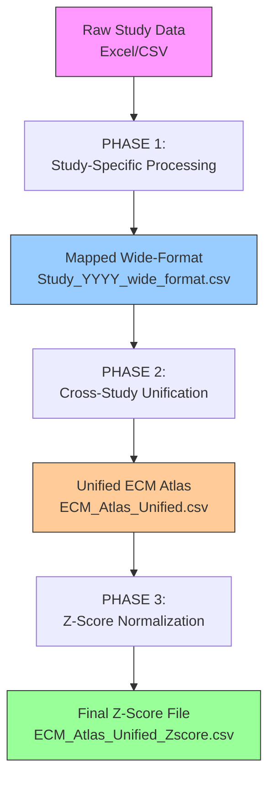

# ECM Atlas: Complete Data Processing Pipeline
**Version:** 2.0
**Last Updated:** 2025-10-12
**Purpose:** Transform individual proteomics studies into unified ECM aging atlas

---

## 🎯 Pipeline Architecture



---

## 📋 Phase 1: Study-Specific Processing

**Goal:** Convert raw study data into standardized wide-format (mapped files)

### Input
- Raw data files (Excel, CSV, etc.)
- Study-specific metadata
- Spatial/temporal profiling information

### Process
1. **Data Parsing** → Extract protein abundances from raw files
2. **Schema Standardization** → Map to unified 15-column schema
3. **Protein Annotation** → Match against matrisome reference (ECM proteins only)
4. **Wide-Format Conversion** → Aggregate by compartment and age
   - ⚠️ **Filter to ECM proteins only** (`Match_Confidence > 0`)
   - Calculate mean abundances: `Abundance_Young`, `Abundance_Old`
   - Preserve N profiles: `N_Profiles_Young`, `N_Profiles_Old`

### Output Schema (Wide-Format Mapped File)
```
15 columns:
1. Protein_ID              - UniProt accession
2. Protein_Name            - Full protein name
3. Gene_Symbol             - Gene symbol from dataset
4. Tissue                  - Combined identifier (e.g., "Kidney_Glomerular")
5. Tissue_Compartment      - Explicit compartment (e.g., "Glomerular")
6. Species                 - "Homo sapiens", "Mus musculus", etc.
7. Abundance_Young         - Mean LFQ intensity for young group
8. Abundance_Old           - Mean LFQ intensity for old group
9. Method                  - LC-MS/MS protocol
10. Study_ID               - Unique study identifier (e.g., "Randles_2021")
11. Canonical_Gene_Symbol  - Standardized gene symbol from matrisome
12. Matrisome_Category     - ECM category (e.g., "Collagens")
13. Matrisome_Division     - "Core matrisome" or "Matrisome-associated"
14. Match_Level            - Annotation confidence level
15. Match_Confidence       - Numeric confidence (0-100)
```

### Missing Values
- **Allowed in:** `Abundance_Young`, `Abundance_Old`
- **Not allowed in:** `Protein_ID`, `Study_ID`, `Tissue`, `Tissue_Compartment`
- **Handling:** Preserve NaN (indicates protein not detected in that age group)

### Output Files (Per Study)
```
Study_YYYY/
├── Study_YYYY_wide_format.csv    ← PRIMARY OUTPUT (mapped, ECM only)
├── Study_YYYY_metadata.json      ← Processing metadata
├── Study_YYYY_annotation_report.md
└── Study_YYYY_validation_log.txt
```

**⚠️ IMPORTANT:** Phase 1 does **NOT** calculate z-scores!

---

## 📋 Phase 2: Cross-Study Unification

**Goal:** Combine all study-specific mapped files into single unified atlas

### Input
- All `*_wide_format.csv` files from Phase 1
- Study metadata (age ranges, tissue types, methods)

### Process
```python
import pandas as pd

# Load all mapped files
studies = ['Randles_2021', 'Tam_2020', 'Future_Study_2026']
dfs = []

for study in studies:
    df = pd.read_csv(f"{study}/{study}_wide_format.csv")
    dfs.append(df)

# Combine (simple concat - schemas are identical!)
df_unified = pd.concat(dfs, ignore_index=True)

# Validate
assert set(df_unified['Study_ID'].unique()) == set(studies)
assert df_unified['Protein_ID'].notna().all()  # No null IDs

# Save
df_unified.to_csv("ECM_Atlas_Unified.csv", index=False)
```

### Output
```
ECM_Atlas_Unified.csv
├── Rows: Sum of all studies (e.g., Randles 1,320 + Tam 1,320 = 2,640)
├── Columns: Same 15 columns as Phase 1
└── ECM proteins only (all studies)
```

---

## 📋 Phase 3: Z-Score Normalization (Unified)

**Goal:** Calculate compartment-specific z-scores across all studies

### Why Unified Z-Scores?
1. **Cross-study comparability** - Same scale across all studies
2. **Stable normalization** - Larger sample size → more robust statistics
3. **Biological meaning** - Can compare protein changes across tissues/studies

### Grouping Strategy
Z-scores calculated **per Tissue_Compartment** group:
- `Kidney_Glomerular` (from Randles 2021)
- `Kidney_Tubulointerstitial` (from Randles 2021)
- `Intervertebral_disc_NP` (from Tam 2020)
- `Intervertebral_disc_IAF` (from Tam 2020)
- `Intervertebral_disc_OAF` (from Tam 2020)
- ... (future studies)

### Algorithm (with Missing Value Handling)

```python
from scipy.stats import skew
import numpy as np
import pandas as pd

def calculate_zscore_unified(df_unified, tissue_compartment):
    """
    Calculate z-scores for one tissue compartment across all studies.

    Key principles:
    1. Missing values (NaN) EXCLUDED from mean/std calculation
    2. Missing values PRESERVED in output
    3. Log2-transformation if skewness > 1
    """

    # Filter to one compartment
    df_comp = df_unified[df_unified['Tissue'] == tissue_compartment].copy()

    print(f"\nProcessing: {tissue_compartment}")
    print(f"  Studies: {df_comp['Study_ID'].unique()}")
    print(f"  Proteins: {len(df_comp)}")

    # Check skewness (excluding NaN)
    skew_young = skew(df_comp['Abundance_Young'].dropna())
    skew_old = skew(df_comp['Abundance_Old'].dropna())

    print(f"  Skewness: Young={skew_young:.3f}, Old={skew_old:.3f}")

    # Apply log2 transformation if needed
    if (skew_young > 1) or (skew_old > 1):
        print(f"  ✅ Applying log2(x + 1) transformation")
        young_values = np.log2(df_comp['Abundance_Young'] + 1)
        old_values = np.log2(df_comp['Abundance_Old'] + 1)
    else:
        print(f"  ℹ️  No log-transformation needed")
        young_values = df_comp['Abundance_Young']
        old_values = df_comp['Abundance_Old']

    # Calculate mean and std (EXCLUDING NaN - critical!)
    mean_young = young_values.mean(skipna=True)
    std_young = young_values.std(skipna=True)
    mean_old = old_values.mean(skipna=True)
    std_old = old_values.std(skipna=True)

    n_valid_young = young_values.notna().sum()
    n_valid_old = old_values.notna().sum()

    print(f"  Normalization (non-missing only):")
    print(f"    Young: Mean={mean_young:.4f}, Std={std_young:.4f} (n={n_valid_young})")
    print(f"    Old:   Mean={mean_old:.4f}, Std={std_old:.4f} (n={n_valid_old})")

    # Calculate z-scores (NaN preserved)
    df_comp['Zscore_Young'] = (young_values - mean_young) / std_young
    df_comp['Zscore_Old'] = (old_values - mean_old) / std_old
    df_comp['Zscore_Delta'] = df_comp['Zscore_Old'] - df_comp['Zscore_Young']

    # Validate (on non-NaN only)
    z_young_valid = df_comp['Zscore_Young'].dropna()
    z_old_valid = df_comp['Zscore_Old'].dropna()

    print(f"  Validation:")
    print(f"    Zscore_Young: Mean={z_young_valid.mean():.6f}, Std={z_young_valid.std():.6f}")
    print(f"    Zscore_Old:   Mean={z_old_valid.mean():.6f}, Std={z_old_valid.std():.6f}")

    return df_comp


# Process all compartments
df_unified = pd.read_csv("ECM_Atlas_Unified.csv")

compartments = df_unified['Tissue'].unique()
results = []

for comp in compartments:
    df_comp_zscore = calculate_zscore_unified(df_unified, comp)
    results.append(df_comp_zscore)

# Combine all compartments
df_final = pd.concat(results, ignore_index=True)

# Save final z-score file
df_final.to_csv("ECM_Atlas_Unified_Zscore.csv", index=False)
```

### Output Schema (Unified Z-Score File)
```
19 columns (15 from Phase 1 + 4 new):
16. Zscore_Young           - Z-score for young group (compartment-specific)
17. Zscore_Old             - Z-score for old group (compartment-specific)
18. Zscore_Delta           - Change in z-score (Old - Young)
19. N_Profiles_Total       - Total profiles used (across all studies)
```

### Missing Value Handling

| Value | Handling in Z-Score Calculation | Preserved in Output? |
|-------|--------------------------------|---------------------|
| `NaN` in `Abundance_Young` | ✅ **EXCLUDED** from mean/std | ✅ **YES** (as NaN) |
| `NaN` in `Abundance_Old` | ✅ **EXCLUDED** from mean/std | ✅ **YES** (as NaN) |
| Valid abundance | ✅ **INCLUDED** in mean/std | ✅ **YES** (z-score calculated) |

**Why this matters:**
- Missing values indicate protein not detected → biologically meaningful
- Excluding from stats prevents bias (mean/std calculated only on detected proteins)
- Preserving NaN in output allows downstream filtering

---

## 🔄 Complete Workflow Example

### Step 1: Process Individual Studies
```bash
# Randles 2021
python process_study.py --study Randles_2021
# Output: Randles_2021/Randles_2021_wide_format.csv (1,320 rows)

# Tam 2020
python process_study.py --study Tam_2020
# Output: Tam_2020/Tam_2020_wide_format.csv (1,320 rows)
```

### Step 2: Create Unified File
```bash
python create_unified_atlas.py
# Output: ECM_Atlas_Unified.csv (2,640 rows = 1,320 + 1,320)
```

### Step 3: Calculate Z-Scores (Unified)
```bash
python calculate_unified_zscores.py
# Output: ECM_Atlas_Unified_Zscore.csv (2,640 rows + 4 z-score columns)
```

---

## 📊 Data Quality Checks

### Phase 1 (Study-Specific)
- ✅ All proteins have `Protein_ID`
- ✅ All rows have `Study_ID`, `Tissue`, `Tissue_Compartment`
- ✅ ECM proteins only (`Match_Confidence > 0`)
- ✅ Known markers validated (COL1A1, FN1, ACAN, etc.)

### Phase 2 (Unification)
- ✅ Schema compatibility (all studies have same 15 columns)
- ✅ No duplicate `Study_ID` values
- ✅ All studies present in unified file

### Phase 3 (Z-Score)
- ✅ Z-score mean ≈ 0 (per compartment)
- ✅ Z-score std ≈ 1 (per compartment)
- ✅ Missing values preserved
- ✅ Outliers (<2% with |z| > 3)

---

## 🎯 Key Principles

### 1. **Separation of Concerns**
- **Phase 1:** Study-specific processing (parsing, annotation, mapping)
- **Phase 2:** Integration (combine studies)
- **Phase 3:** Normalization (z-scores for cross-study comparison)

### 2. **ECM Focus**
- Filter to ECM proteins EARLY (Phase 1)
- All downstream analyses use ECM-only datasets
- Non-ECM proteins (cellular, metabolic) excluded

### 3. **Missing Value Handling**
- Preserve biological meaning (NaN = not detected)
- Exclude from statistics (mean/std)
- Include in output (allows downstream filtering)

### 4. **Schema Consistency**
- Same 15 columns across all studies
- Direct concatenation possible (no transformation needed)
- Future studies can be added easily

---

## 📁 Directory Structure

```
ecm-atlas/
├── 00_ECM_ATLAS_PIPELINE_OVERVIEW.md  ← THIS FILE
│
├── 05_Randles_paper_to_csv/
│   ├── Randles_2021_wide_format.csv   ← Phase 1 output
│   └── Randles_2021_metadata.json
│
├── 07_Tam_2020_paper_to_csv/
│   ├── Tam_2020_wide_format.csv       ← Phase 1 output
│   └── Tam_2020_metadata.json
│
├── unified/
│   ├── ECM_Atlas_Unified.csv          ← Phase 2 output
│   └── ECM_Atlas_Unified_Zscore.csv   ← Phase 3 output
│
└── scripts/
    ├── create_unified_atlas.py        ← Phase 2 script
    └── calculate_unified_zscores.py   ← Phase 3 script
```

---

## 🚀 Future Enhancements

1. **Multi-tissue support** - Expand beyond kidney and IVD
2. **Disease states** - Add disease vs healthy comparisons
3. **Time-series** - Longitudinal aging studies
4. **Cross-species** - Human vs mouse comparisons
5. **Interactive dashboards** - Plotly/Dash visualizations

---

## 📚 References

- **Randles 2021:** https://pubmed.ncbi.nlm.nih.gov/33382035/
- **Tam 2020:** https://pubmed.ncbi.nlm.nih.gov/33382035/
- **Matrisome Database:** http://matrisomeproject.mit.edu/

---

**Last Updated:** 2025-10-12
**Maintainer:** Daniel Kravtsov (daniel@improvado.io)
**Version:** 2.0
