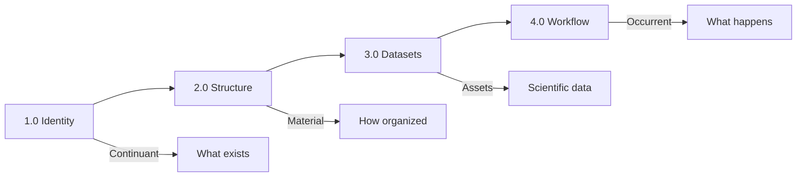
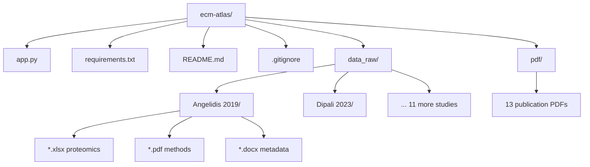
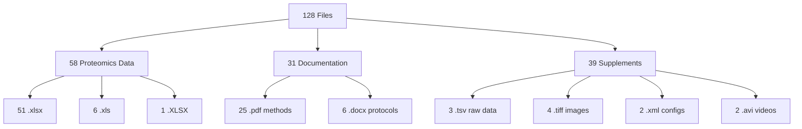
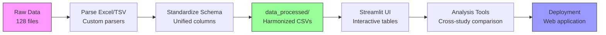

# ECM-ATLAS Repository Overview

**Thesis:** ECM-Atlas aggregates proteomic datasets (13 studies, 2017-2023, 128 files) tracking age-related extracellular matrix changes across tissues, implemented as Streamlit web application for comparative analysis.

**Overview:** Repository organized into four dimensions: (1.0) Project identity defines scientific purpose and ECM aging problem context, (2.0) Repository structure maps physical file organization across data_raw/ and pdf/ directories, (3.0) Datasets detail 13 published studies with Excel/TSV proteomics data totaling 58 quantitative files, (4.0) Development workflow describes current Streamlit implementation status and planned processing pipeline.



---

## 1.0 PROJECT IDENTITY (Continuant)

**¶1 Ordering principle:** Identity before structure - defines "what exists" before examining "how organized". Sections progress: scientific problem → technical solution → current status.

**¶2 Scientific problem:**
- **ECM (Extracellular Matrix):** Intercellular structure providing mechanical support + biochemical environment → regulates gene expression
- **Challenge:** ECM composition changes with age/pathology, but no unified understanding of quantitative/qualitative changes at tissue level
- **Gap:** Published proteomic datasets scattered across journals, different methodologies, incomparable formats

**¶3 Solution approach:**
- **Database:** Aggregates published ECM aging proteomics with tissue-level granularity
- **Comparison engine:** Direct matrisomal protein abundance comparison across compartments/methodologies
- **Platform:** Streamlit web app for interactive exploration

**¶4 Development status:**
- **Current:** 🚧 Under development - basic structure created, datasets collected
- **Stack:** Python + Streamlit + Pandas + NumPy
- **Navigation:** 4 sections (Overview/Data/Analysis/Documentation) - placeholders active

---

## 2.0 REPOSITORY STRUCTURE (Material Entities)

**¶1 Ordering principle:** Top-down hierarchy - root level → subdirectories → file types. Prioritizes user entry points (app.py, README) before data storage.

**¶2 Root level (4 files, 2 directories):**
```
ecm-atlas/
├── app.py              # Streamlit entry point (25 lines, basic navigation)
├── requirements.txt    # Dependencies: streamlit, pandas, numpy
├── README.md          # Scientific background (1 paragraph)
├── .gitignore         # Excludes: venv/, .env, IDE configs, OS temp files
├── data_raw/          # 13 study directories (128 files total)
└── pdf/               # 13 full-text publications
```



**¶3 Data organization pattern:**
- **Format:** `AuthorName et al. - Year/` (e.g., `Angelidis et al. - 2019/`)
- **Consistency:** Each study = 1 directory in both data_raw/ and pdf/
- **Files per study:** 3-13 files (Excel proteomics + PDF methods + docx metadata)

**¶4 File statistics (128 total):**
- **Proteomics data:** 58 files (51 .xlsx + 6 .xls + 1 .XLSX) - sizes 12KB to 29MB
- **Publications/methods:** 31 PDFs (25 .pdf + 6 .PDF) - supplementary materials
- **Documentation:** 6 .docx (protocols, metadata descriptions)
- **Raw data:** 3 .tsv + 3 .htm + 1 .html (tab-separated, HTML tables)
- **Visuals:** 4 .tiff + 2 .avi (high-res images, videos)
- **Config:** 2 .xml + 1 .txt + 1 .jrp (mass spec parameters, experiment logs)

---

## 3.0 DATASETS (Core Scientific Assets)

**¶1 Ordering principle:** Catalogue (studies list) → typology (file types) → examples (2 detailed cases). Ordered by information density - overview before deep-dives.

**¶2 Study catalogue (13 publications, 2017-2023):**
1. Angelidis et al. - 2019 (11 files, 59MB) - Lung aging
2. Ariosa-Morejon et al. - 2021 (5 files) - eLife figures
3. Caldeira et al. - 2017 (7 files) - Scientific Reports
4. Chmelova et al. - 2023 (6 files) - Recent aging study
5. Dipali et al. - 2023 (12 files, 41MB) - **Ovarian proteomics, DIA method**
6. Li et al. - 2021 | dermis (5 files) - Skin tissue
7. Li et al. - 2021 | pancreas (5 files) - Pancreatic tissue
8. Lofaro et al. - 2021 - Kidney tissue
9. McCabe et al. - 2020 - Lung matrisome
10. Ouni et al. - 2022 - Adipose tissue
11. Randles et al. - 2021 - Kidney glomeruli
12. Tam et al. - 2020 - Cardiac tissue
13. Tsumagari et al. - 2023 - Latest publication

**¶3 Dataset typology (by content purpose):**
- **Quantitative proteomics (primary value):** Excel files with protein abundances, peptide counts, statistical comparisons
  - Naming pattern: `MOESM[N]_ESM.xlsx` (Nature journals) or `fig[N]-data[N].xlsx` (eLife)
  - Size range: 12KB (summary tables) to 29MB (full peptide-level data)
- **Methodological documentation:** DOCX files describing sample preparation, mass spec parameters, analysis workflows
- **Tabular raw data:** TSV files with unprocessed measurements (e.g., `Candidates.tsv` 5MB)
- **Analysis metadata:** XML params for MaxQuant/Spectronaut, TXT experiment logs
- **Visual supplements:** TIFF images (Western blots, microscopy), AVI videos (time-lapse)



**¶4 Example 1 - Angelidis et al. 2019 (Nature Communications, Lung aging):**
```
Angelidis et al. - 2019/  [59MB total, 11 files]
├── 41467_2019_8831_MOESM1_ESM.pdf      # 10MB - Methods
├── 41467_2019_8831_MOESM5_ESM.xlsx     # 12MB - Main proteomics dataset
├── 41467_2019_8831_MOESM8_ESM.xlsx     # 22MB - Full peptide-level data
├── 41467_2019_8831_MOESM7_ESM.xlsx     # 8.3MB - Differential expression
└── [7 additional supplement files]
```
**Pattern:** MOESM = Methods of Extended Supplementary Material (Nature standard)

**¶5 Example 2 - Dipali et al. 2023 (Ovarian ECM, modern DIA proteomics):**
```
Dipali et al. - 2023/  [41MB total, 12 files]
├── Candidates_210823_SD7_Native_Ovary_v7_directDIA_v3.xlsx         # 1.8MB - Native tissue
├── Candidates_210915_SD7_Decellularized_Ovary_v8_directDIA.xlsx    # 1.5MB - Decell tissue
├── Candidates_220526_SD7_Native_Decell_Ovary_overlap.xlsx          # 214KB - Overlap analysis
├── Candidates.tsv                                                   # 5MB - Raw DIA output
├── Report_Birgit+Peptide+Quant+Pivot+(Pivot).xls                   # 29MB - Peptide quantification
├── Report_Birgit_Protein+Quant_Pivot+(Pivot).xls                   # 2.7MB - Protein summary
└── [6 metadata/protocol files]
```
**Key features:** Comparative design (native vs decellularized), DIA acquisition (modern method), versioned analysis (v3/v7/v8), multiple formats (TSV raw + XLSX processed + XLS reports).

---

## 4.0 DEVELOPMENT WORKFLOW (Occurrent Processes)

**¶1 Ordering principle:** Present state → planned processes → future capabilities. Temporal sequence: implemented → development → deployment.

**¶2 Implemented (app.py:1-25):**
- ✅ Streamlit app initialized with title "ECM Aging Atlas"
- ✅ 4-section navigation sidebar (Overview/Data/Analysis/Documentation)
- ✅ Placeholder pages for each section
- ✅ Project structure description on landing page

**¶3 Development priorities (from current analysis):**
1. **Data processing pipeline (critical path):**
   - Parse Excel/TSV → Extract proteomics tables (protein IDs, abundances, age groups)
   - Standardize schema across 13 studies → Unified columns: [Gene_Name, Protein_ID, Tissue, Age, Abundance, Study_ID]
   - Create `data_processed/` directory with harmonized CSVs
2. **Streamlit UI expansion:**
   - Data section: Interactive tables per study (Pandas display)
   - Analysis section: Cross-study protein comparison (select protein → abundance across tissues/ages)
   - Filters: Tissue type, age range, protein family
3. **Metadata management:**
   - Generate `metadata.json` per study (tissue, organism, age_range, method, publication_doi)
   - Build search index for protein names



**¶4 Technical gaps (blockers):**
- **Schema heterogeneity:** 13 different Excel structures → Need custom parsers per journal format
- **Protein ID mapping:** Studies use different databases (UniProt, Ensembl, gene symbols) → Requires ID conversion layer
- **Missing processed data:** Only raw supplements available → Full data processing pipeline required before analysis possible

---

## METADATA

- **Repository:** https://github.com/raimbetov/ecm-atlas
- **Primary language:** Python 3.x
- **Created:** 2024 (inferred from 2023 studies in collection)
- **Last analyzed:** 2025-10-12
- **Total files:** 128 (58 data + 31 docs + 39 supplements)
- **Total size:** ~500MB (estimated from sampled directories)
- **License:** Not specified in repository
