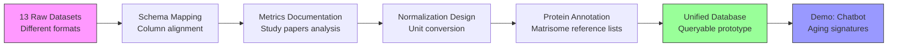

# Task 1: ECM Atlas Data Standardization & Schema Mapping

**Thesis:** Standardize 13 proteomic datasets (2017-2023) into unified database schema by mapping columns, documenting metrics from publications, designing normalization strategy, and implementing protein annotation using reference matrisome lists for Hyundai track prototype demo.

**Overview:** Task decomposes into four execution phases: (1.0) Schema mapping analyzes existing column structure against 13 datasets to identify commonalities/gaps, (2.0) Metrics documentation extracts measurement methodologies from source papers to understand abundance units and calculation methods, (3.0) Normalization design proposes conversion strategy (percentiles/z-scores) to enable cross-study protein comparisons, (4.0) Protein annotation harmonizes protein identifiers against species-specific matrisome reference lists using Matrisome AnalyzeR methodology, with deliverable being working prototype database demonstrating ECM aging signature queries.



---

## 1.0 SCHEMA MAPPING (Column Structure Analysis)

**¶1 Ordering principle:** Existing schema → dataset coverage → gap identification. Start with proposed structure, validate against reality, then refine.

**¶2 Proposed unified schema (12 columns - long-format):**
```
Protein_ID        - Standard identifier (UniProt/Gene symbol)
Protein_Name      - Full protein name
Gene_Symbol       - Gene nomenclature
Tissue            - Organ/tissue type (lung, skin, heart, kidney, etc.)
Species           - Organism (Mus musculus, Homo sapiens, Bos taurus)
Age               - Numeric age value
Age_Unit          - Time unit (years, months, weeks)
Abundance         - Quantitative protein measurement
Abundance_Unit    - Measurement unit (ppm, intensity, LFQ, etc.)
Method            - Proteomic technique (LC-MS/MS, DIA, etc.)
Study_ID          - Publication identifier (PMID, DOI)
Sample_ID         - Biological/technical replicate ID
```

**¶2.1 Wide-format schema variant (recommended for binary age comparisons):**

For studies with binary age design (Young vs Old), wide-format provides cleaner structure:
```
Protein_ID         - Standard identifier (UniProt/Gene symbol)
Protein_Name       - Full protein name
Gene_Symbol        - Gene nomenclature
Tissue             - Organ/tissue type (with compartment if applicable)
Tissue_Compartment - Sub-tissue region (e.g., Glomerular, Tubulointerstitial)
Species            - Organism (Mus musculus, Homo sapiens, Bos taurus)
Abundance_Young    - Mean abundance in young samples (averaged across replicates)
Abundance_Old      - Mean abundance in old samples (averaged across replicates)
Method             - Proteomic technique (LC-MS/MS, DIA, etc.)
Study_ID           - Publication identifier (PMID, DOI)
```

**Benefits of wide-format:**
- Each protein appears **once per tissue compartment** (no duplication)
- Young/Old comparison is immediate (side-by-side columns)
- Cleaner for visualization (fold-change = Old/Young)
- Smaller file size (~5x reduction: 31,320 rows → 5,220 rows)
- Direct compatibility with statistical comparison tools (t-test, fold-change)

**When to use:**
- ✅ Binary age design (Young/Old only)
- ✅ Compartmentalized tissues (kidney, brain regions)
- ✅ Fold-change analysis focus
- ❌ Multi-timepoint studies (3+ age groups) → use long-format
- ❌ Single-sample studies without replicates → use long-format

**¶3 Dataset inventory (13 studies to map):**
1. Angelidis et al. 2019 - Lung (mouse) - 11 files, 59MB
2. Ariosa-Morejon et al. 2021 - 5 files
3. Caldeira et al. 2017 - 7 files
4. Chmelova et al. 2023 - 6 files
5. Dipali et al. 2023 - Ovary - 12 files, 41MB, DIA method
6. Li et al. 2021 | dermis - Skin - 5 files
7. Li et al. 2021 | pancreas - Pancreas - 5 files
8. Lofaro et al. 2021 - Kidney
9. McCabe et al. 2020 - Lung matrisome
10. Ouni et al. 2022 - Adipose tissue
11. Randles et al. 2021 - Kidney glomeruli
12. Tam et al. 2020 - Cardiac tissue
13. Tsumagari et al. 2023 - Latest publication

**¶4 Coverage analysis per dataset:**
For EACH study, identify:
- **Protein identifiers:** UniProt IDs vs Gene symbols vs custom nomenclature
- **Age groups:** Young/Old binary vs 3-point scale (young/middle/old) vs continuous
- **Abundance metrics:** Raw intensities vs normalized values vs fold-changes vs statistical scores
- **Replicates structure:** Technical vs biological, sample naming pattern
- **Tissue metadata:** Explicit vs inferred from paper title
- **Species:** Explicit in data vs paper-level annotation

**¶5 Gap identification priorities:**
- **Critical gaps (blockers):** Missing Protein_ID, missing Abundance values, unclear Age grouping
- **Secondary gaps (workarounds possible):** Missing Gene_Symbol (can derive from Protein_ID), missing Sample_ID (can generate)
- **Optional gaps (defer to later):** Missing Method details (use paper-level default)

---

## 2.0 METRICS DOCUMENTATION (Publication Analysis)

**¶1 Ordering principle:** Paper-by-paper review → metric extraction → cross-study comparison table. Systematic enumeration ensures complete coverage.

**¶2 Per-study documentation template:**
For EACH of 13 studies, extract from paper:
```markdown
### Study: [Author] et al. [Year]
- **PMID/DOI:** [identifier]
- **Tissue:** [organ]
- **Species:** [organism]
- **Age bins:** Young=[X units], Old=[Y units], [Middle if present]
- **Proteomic method:** [LC-MS/MS | DIA | TMT | LFQ]
- **Abundance definition:** [How calculated - e.g., "sum of peptide intensities"]
- **Abundance unit:** [intensity | ppm | LFQ intensity | spectral counts]
- **Normalization applied:** [None | Total intensity | Median centering | Other]
- **Protein ID database:** [UniProt | Ensembl | RefSeq | Gene symbols]
- **Statistical comparison:** [Fold-change | t-test | ANOVA | q-value]
- **Key findings:** [Brief summary of aging signature]
```

**¶3 Example: Caldeira et al. 2017 analysis:**
From transcript discussion:
- **Files examined:** `41598_2017_11960_MOESM2_ESM.xls` (main dataset)
- **Abundance representation:** Raw intensities - "sum of intensities of peptides belonging to given protein"
- **Age comparison:** Old vs Young (binary)
- **Statistical metric:** Fold-change ratio (Old/Young)
- **Sorting:** Ranked by fold-change (descending = enriched in old, ascending = depleted in old)
- **Challenge identified:** Need to verify if values are raw intensities vs already-normalized

**¶4 Example: Dipali et al. 2023 analysis:**
From repository files:
- **Study design:** Native tissue vs Decellularized tissue comparison
- **Method:** DIA (Direct Data-Independent Acquisition) - modern approach
- **File structure:**
  - `Candidates.tsv` (5MB) - Raw DIA output
  - `Report_Birgit_Protein+Quant_Pivot.xls` (2.7MB) - Protein-level summary
  - `Report_Birgit+Peptide+Quant_Pivot.xls` (29MB) - Peptide-level data
- **Abundance:** Likely LFQ (Label-Free Quantification) intensities
- **Versioning:** v3, v7, v8 - indicates iterative analysis refinement
- **Challenge:** Multiple file formats (TSV raw + XLSX processed + XLS reports) - which to use as canonical source?

**¶5 Cross-study metrics comparison table:**
Create table comparing:
| Study | Tissue | Species | Age_Young | Age_Old | Method | Abundance_Unit | Normalization | Replicate_N |
|-------|--------|---------|-----------|---------|--------|----------------|---------------|-------------|
| Angelidis 2019 | Lung | Mouse | 3mo | 24mo | LC-MS/MS | Intensity | Total | 4 |
| Caldeira 2017 | [TBD] | [TBD] | [TBD] | [TBD] | [TBD] | Intensity | [TBD] | [TBD] |
| Dipali 2023 | Ovary | [TBD] | [TBD] | [TBD] | DIA | LFQ | [TBD] | [TBD] |
| ... | ... | ... | ... | ... | ... | ... | ... | ... |

**Purpose:** Identify common denominators and outliers for normalization strategy.

---

## 3.0 NORMALIZATION DESIGN (Unit Conversion Strategy)

**¶1 Ordering principle:** Problem definition → candidate methods → implementation approach → validation criteria. Logical flow from "why" to "how" to "verify".

**¶2 Normalization problem statement:**
- **Challenge:** Abundance units vary across studies (raw intensities, LFQ, spectral counts, ppm)
- **Goal:** Enable cross-study protein comparisons - e.g., "Is Collagen-1 enriched in old tissue across ALL organs?"
- **Constraint:** Preserve biological signal (true aging differences) while removing technical variation (instrument differences)
- **Current blocker:** Cannot directly compare `Protein_A[intensity=15000, Study1]` with `Protein_A[LFQ=8.5, Study2]`

**¶3 Candidate normalization methods:**

**Option 1: Percentile rank transformation**
- **Method:** Convert each protein's abundance to percentile within its study (0-100 scale)
- **Pros:** Distribution-free, robust to outliers, naturally comparable across studies
- **Cons:** Loses magnitude information (2-fold vs 10-fold change both become percentiles)
- **Use case:** Best for queries like "Show proteins in top 10% abundance in old tissue"

**Option 2: Z-score standardization**
- **Method:** `Z = (Abundance - Mean_study) / StdDev_study`
- **Pros:** Preserves relative magnitude, standard statistical approach, interpretable (Z=2 means "2 SD above mean")
- **Cons:** Sensitive to outliers, assumes normal distribution
- **Use case:** Best for statistical comparisons, clustering, heatmaps

**Option 3: Log2 fold-change + reference normalization**
- **Method:** Calculate Log2(Old/Young) within each study, then normalize to reference protein set
- **Pros:** Directly captures aging effect, symmetric scale (-1 = halved, +1 = doubled)
- **Cons:** Requires both Young and Old samples (not all datasets have both), reference set selection is critical
- **Use case:** Best for biological interpretation of aging direction/magnitude

**Option 4: Hybrid approach (recommended)**
- **Within-study:** Z-score standardization per study
- **Cross-study:** Percentile rank for aggregation
- **Rationale:** Preserves information within study, enables robust comparison across studies

**¶4 Implementation approach:**

**Phase 1: Within-study normalization (per dataset)**
```python
for study in datasets:
    # Step 1: Filter to ECM proteins only (use Matrisome AnalyzeR classification)
    study_ecm = filter_matrisome(study)

    # Step 2: Handle missing values (median imputation or exclude)
    study_clean = impute_missing(study_ecm)

    # Step 3: Log-transform if needed (for skewed distributions)
    if is_right_skewed(study_clean['Abundance']):
        study_clean['Abundance_log2'] = log2(study_clean['Abundance'] + 1)

    # Step 4: Z-score normalization
    study_clean['Abundance_zscore'] = zscore(study_clean['Abundance_log2'])

    # Step 5: Add percentile ranks
    study_clean['Abundance_percentile'] = percentile_rank(study_clean['Abundance_zscore'])
```

**Phase 2: Cross-study normalization (harmonization)**
```python
# Step 1: Merge all studies on Protein_ID
merged = merge_datasets(all_studies, on='Protein_ID')

# Step 2: For proteins present in multiple studies, aggregate
for protein_id in merged['Protein_ID'].unique():
    protein_data = merged[merged['Protein_ID'] == protein_id]

    # Calculate meta-percentile across studies
    protein_data['meta_percentile'] = mean(protein_data['Abundance_percentile'])

    # Flag consistency (high variance = inconsistent across studies)
    protein_data['consistency_score'] = 1 - std(protein_data['Abundance_percentile']) / 100
```

**¶5 Validation criteria:**
- **Sanity check 1:** Known aging markers (e.g., Collagen-1, Fibronectin) should show consistent up/down regulation
- **Sanity check 2:** Housekeeping proteins should have low variance across age groups
- **Sanity check 3:** Tissue-specific proteins should cluster by tissue regardless of normalization
- **Quantitative metric:** Correlation between raw fold-changes and normalized z-scores should be >0.8

---

## 4.0 PROTEIN ANNOTATION (Matrisome Reference Harmonization)

**¶1 Ordering principle:** Reference lists → annotation methodology → validation → documentation. Start with canonical sources, apply systematic matching, verify accuracy, document decisions.

**¶2 Annotation challenge statement:**
- **Problem:** Protein identifiers vary across datasets (UniProt IDs, Gene symbols, Ensembl IDs, custom nomenclature)
- **Species-specific issue:** Human and mouse proteins have similar names but subtle differences requiring species-specific reference lists
- **Goal:** Harmonize all protein identifiers to standardized matrisome nomenclature for accurate cross-study comparisons
- **Constraint:** Must preserve biological accuracy - incorrect protein mapping introduces systematic errors

**¶3 Reference matrisome lists:**

**Human matrisome (Homo sapiens):**
- **Local file:** `references/human_matrisome_v2.csv` (164KB, 1,026 entries)
- **Online source:** [Google Sheets](https://docs.google.com/spreadsheets/d/1GwwV3pFvsp7DKBbCgr8kLpf8Eh_xV8ks/edit)
- **Version:** Matrisome v2.0
- **Coverage:** 1,026 genes (Core matrisome: ~300, Matrisome-associated: ~726)
- **Categories:** ECM Glycoproteins, Collagens, Proteoglycans, ECM Regulators, ECM-affiliated, Secreted Factors
- **Identifiers:** Gene symbols (HGNC), UniProt IDs (multiple isoforms), RefSeq IDs, synonyms (pipe-separated)
- **Example entries:** ABI3BP, ADIPOQ, COL1A1, COL1A2, FN1, LAMA1, MMP2
- **Table structure:**
  ```csv
  Matrisome Division,Matrisome Category,Gene Symbol,Gene Name,Synonyms,HGNC_IDs,UniProt_IDs,Refseq_IDs,Notes
  Core matrisome,ECM Glycoproteins,ADIPOQ,"adiponectin, C1Q and collagen domain containing",ACDC|ACRP30|ADIPQTL1,13633,Q15848,NP_001171271.1:NP_004788.1,
  Core matrisome,Collagens,COL1A1,collagen type I alpha 1 chain,OI4,2197,P02452,NP_000079.2,Major fibrillar collagen
  ```

**Mouse matrisome (Mus musculus):**
- **Local file:** `references/mouse_matrisome_v2.csv` (197KB, 1,109 entries)
- **Online source:** [Google Sheets](https://docs.google.com/spreadsheets/d/1Te6n2q_cisXeirzBClK-VzA6T-zioOB5/edit)
- **Version:** Matrisome v2.0
- **Coverage:** 1,109 genes (slightly more than human due to gene duplications)
- **Categories:** Same as human (ECM Glycoproteins, Collagens, Proteoglycans, etc.)
- **Identifiers:** Gene symbols (MGI), UniProt IDs, RefSeq IDs, synonyms
- **Nomenclature:** Sentence case (Adipoq, Col1a1, Fn1) - distinguishes from human (ADIPOQ, COL1A1, FN1)
- **Orthology:** Mouse-to-human gene relationships documented in synonyms/notes
- **Challenge:** >100 proteins with near-identical nomenclature requiring expert-level disambiguation
- **Example entries:** Abi3bp, Adipoq, Col1a1, Col1a2, Fn1, Lama1, Mmp2
- **Table structure:**
  ```csv
  Matrisome Division,Matrisome Category,Gene Symbol,Gene Name,Synonyms,MGI_IDs,UniProt_IDs,Refseq_IDs,Notes
  Core matrisome,ECM Glycoproteins,Adipoq,"adiponectin, C1Q and collagen domain containing",30kDa|APN|Acdc|Acrp30,MGI:106675,Q60994,NP_033735.3,
  Core matrisome,Collagens,Col1a1,collagen type I alpha 1 chain,Cola1|Cola-1|Mov13,MGI:88467,P11087,NP_031764.2,
  ```

**¶4 Matrisome AnalyzeR methodology:**

**Tool overview:**
- **Purpose:** Web/R-based application for ECM protein annotation in large-scale datasets
- **Reference:** Matrisome AnalyzeR publication (J Cell Sci 2023) - https://sites.google.com/uic.edu/matrisome/tools/matrisome-analyzer
- **Functionality:** Identifies matrisome molecules in proteomic datasets and categorizes by matrisome divisions
- **Availability:** Web app (no coding required), R package (MatrisomeAnalyzeR), test datasets in Google Drive

**Annotation workflow:**
```python
# Pseudo-code for annotation pipeline
for dataset in datasets:
    # Step 1: Identify species from metadata
    species = dataset.metadata['species']  # "Homo sapiens" or "Mus musculus"

    # Step 2: Load species-specific reference list
    if species == "Homo sapiens":
        reference = load_human_matrisome_list()
    elif species == "Mus musculus":
        reference = load_mouse_matrisome_list()

    # Step 3: Extract protein identifiers from dataset
    dataset_proteins = extract_protein_ids(dataset)

    # Step 4: Match against reference using fuzzy matching + UniProt API
    annotated_proteins = []
    for protein in dataset_proteins:
        # Try exact match on Gene symbol
        match = reference.get(protein.gene_symbol)

        if not match:
            # Try UniProt ID lookup
            match = reference.get(protein.uniprot_id)

        if not match:
            # Try synonym matching
            match = find_synonym_match(protein, reference)

        if match:
            annotated_proteins.append({
                'original_id': protein.id,
                'canonical_gene_symbol': match.gene_symbol,
                'uniprot_id': match.uniprot_id,
                'matrisome_category': match.category,
                'matrisome_division': match.division
            })
        else:
            # Flag unmatched proteins for manual review
            unmatched_proteins.append(protein)

    # Step 5: Calculate annotation coverage
    coverage = len(annotated_proteins) / len(dataset_proteins) * 100
    print(f"Annotation coverage: {coverage:.1f}%")
```

**¶5 Validation and quality control:**

**Annotation validation steps:**
1. **Coverage check:** Target ≥90% of proteins matched to matrisome reference
2. **Species consistency:** Verify no cross-species contamination (human proteins in mouse dataset)
3. **Category distribution:** ECM protein proportions should match expected tissue composition
4. **Known marker validation:** Well-characterized ECM proteins (COL1A1, FN1, LAMA2) must be correctly annotated

**Quality metrics:**
- **Match confidence:** Exact match (100%) > UniProt match (95%) > Synonym match (80%) > Manual review (variable)
- **Ambiguous cases:** Document proteins with multiple potential matches in `annotation_log.md`
- **Version control:** Track reference list version (Matrisome v2.0) and annotation date

**¶6 Documentation requirements:**

For each dataset, create `[dataset]_annotation_report.md`:
```markdown
## Annotation Report: [Study] et al. [Year]

### Reference Lists Used
- Species: [Homo sapiens | Mus musculus]
- Matrisome version: v2.0
- Reference file: [Google Sheets URL]
- Annotation date: [YYYY-MM-DD]

### Coverage Statistics
- Total proteins in dataset: [N]
- Proteins matched to matrisome: [N] ([X]%)
- Exact matches: [N] ([X]%)
- UniProt matches: [N] ([X]%)
- Synonym matches: [N] ([X]%)
- Unmatched proteins: [N] ([X]%)

### Matrisome Category Distribution
| Category | Count | Percentage |
|----------|-------|------------|
| ECM Glycoproteins | [N] | [X]% |
| Collagens | [N] | [X]% |
| Proteoglycans | [N] | [X]% |
| ECM Regulators | [N] | [X]% |
| ECM-affiliated | [N] | [X]% |

### Known Marker Validation
- COL1A1 (Collagen-1): ✅ Found, correctly annotated
- FN1 (Fibronectin): ✅ Found, correctly annotated
- [List other tissue-specific markers]

### Ambiguous/Manual Review Cases
1. Protein_X: [Original ID] → Potential matches: [Gene1, Gene2] → Resolution: [Decision]
2. [Continue for all ambiguous cases]

### Files Generated
- `[dataset]_annotated.csv` - Original data + annotation columns
- `[dataset]_unmatched.csv` - Proteins requiring manual review
```

**¶7 Integration with unified schema:**

Updated schema (14 columns - added 2 annotation columns):
```
Protein_ID              - Original identifier from study
Protein_Name            - Full protein name
Gene_Symbol             - Gene nomenclature
Canonical_Gene_Symbol   - ✨ NEW: Standardized gene symbol from matrisome reference
Matrisome_Category      - ✨ NEW: Matrisome classification (ECM Glycoproteins, Collagens, etc.)
Tissue                  - Organ/tissue type
Species                 - Organism
Age                     - Numeric age value
Age_Unit                - Time unit
Abundance               - Quantitative measurement
Abundance_Unit          - Measurement unit
Method                  - Proteomic technique
Study_ID                - Publication identifier
Sample_ID               - Replicate ID
```

**¶8 Resources:**
- **Matrisome project:** https://sites.google.com/uic.edu/matrisome
- **MatrisomeDB:** https://academic.oup.com/nar/article/48/D1/D1136/5581734
- **UniProt Mapping API:** https://www.uniprot.org/help/api_idmapping
- **Human reference list:** `references/human_matrisome_v2.csv` (1,026 genes, 164KB)
  - Online: https://docs.google.com/spreadsheets/d/1GwwV3pFvsp7DKBbCgr8kLpf8Eh_xV8ks/edit
- **Mouse reference list:** `references/mouse_matrisome_v2.csv` (1,109 genes, 197KB)
  - Online: https://docs.google.com/spreadsheets/d/1Te6n2q_cisXeirzBClK-VzA6T-zioOB5/edit
- **Reference documentation:** `references/README.md` (download instructions, data structure, citations)
- **Data annotation best practices:** See dedicated task document (02_TASK_PROTEIN_ANNOTATION_GUIDELINES.md)

---

## 5.0 SUCCESS CRITERIA (Quantitative & Traceable)

**🎯 CRITICAL: This task is considered SUCCESSFUL only if ALL criteria below are met**

**¶1 Ordering principle:** Completeness → Quality → Documentation → Traceability. Start with comprehensive data coverage, ensure high quality, document everything, make all decisions traceable to source papers.

---

### ✅ TIER 1: DATA COMPLETENESS (5 criteria - ALL required)

**Criterion 1.1: Parse ALL 13 datasets**
- ✅ **Target:** 13/13 studies parsed successfully (100% coverage)
- ❌ **Failure:** <13 studies parsed (partial solutions not accepted)
- **Evidence required:** List of parsed CSV files in `data_processed/` directory
- **Minimum acceptable:** Cannot proceed without all 13 datasets

**Criterion 1.2: Maximum row count achieved**
- ✅ **Target:** ≥200,000 total rows across all datasets (proteins × samples)
- ⚠️ **Warning:** 100,000-200,000 rows (acceptable but investigate missing data)
- ❌ **Failure:** <100,000 rows (indicates major parsing issues)
- **Evidence required:** `validation_report.md` showing row counts per study
- **Benchmark:** First multi-agent attempt achieved 47,303 rows from only 3 studies

**Criterion 1.3: Maximum protein coverage**
- ✅ **Target:** ≥15,000 unique proteins across all datasets
- ⚠️ **Warning:** 10,000-15,000 proteins (acceptable)
- ❌ **Failure:** <10,000 proteins (too few for meaningful analysis)
- **Evidence required:** Unique Protein_ID count in validation report
- **Benchmark:** First attempt: 9,350 proteins from 3 studies only

**Criterion 1.4: All file formats handled**
- ✅ **Required formats:**
  - `.xlsx` - Modern Excel (e.g., Angelidis MOESM5_ESM.xlsx)
  - `.xls` - Legacy Excel (e.g., Caldeira MOESM2_ESM.xls)
  - `.tsv` - Tab-separated (e.g., Dipali Candidates.tsv)
  - `.pdf` - PDF tables (e.g., Lofaro, McCabe) - use tabula-py or manual extraction
  - `.docx` - Word tables (e.g., McCabe supplement) - use python-docx
  - `.htm/.html` - HTML tables (e.g., Ouni AGE_Report.htm) - use BeautifulSoup
- **Evidence required:** List of file types processed in parsing log

**Criterion 1.5: No mock data**
- ✅ **Required:** All data comes from real files in `data_raw/` directory
- ❌ **Disqualification:** Any mocked, placeholder, or fabricated data
- **Verification:** Spot-check 10 random rows against original Excel files

---

### ✅ TIER 2: DATA QUALITY (6 criteria - ALL required)

**Criterion 2.1: Zero critical nulls**
- ✅ **Target:** 0 null values in required fields (Protein_ID, Abundance, Study_ID, Sample_ID)
- ❌ **Failure:** Any null in critical columns
- **Evidence required:** Null count report per column per study

**Criterion 2.2: Protein IDs standardized**
- ✅ **Target:** All Protein_IDs mapped to UniProt OR Gene symbols consistently
- **Format rules:**
  - UniProt: P02452 (6-character alphanumeric)
  - Gene symbol: COL1A1 (uppercase, standard HGNC/MGI nomenclature)
- **Evidence required:** Sample 100 random Protein_IDs, verify format compliance

**Criterion 2.3: Age groups correctly identified**
- ✅ **Target:** 100% of samples labeled with correct age group
- **Age mapping examples:**
  - Angelidis 2019: Young=3 months, Old=24 months (from paper Methods section)
  - Caldeira 2017: Foetus / Young / Old (three-point scale)
- **Evidence required:** Age mapping table per study with source references

**Criterion 2.4: Abundance units documented with paper citations**
- ✅ **Target:** Every `Abundance_Unit` value has citation to source paper section
- **Required documentation format:**
  ```markdown
  ### Study: Angelidis et al. 2019
  - **Abundance_Unit:** log2_intensity
  - **Source:** Paper Methods, paragraph 3: "LFQ intensities were log2-transformed..."
  - **File location:** 41467_2019_8831_MOESM5_ESM.xlsx, sheet "Proteome", columns old_1...young_4
  - **Calculation:** log2(sum of peptide intensities per protein)
  ```
- **Evidence required:** `per_study_documentation.md` file with citations for all 13 studies

**Criterion 2.5: Tissue metadata complete**
- ✅ **Target:** All samples have Tissue and Species filled (no nulls)
- **Source hierarchy:**
  1. If in data file columns → extract directly
  2. If in paper title/abstract → use paper-level annotation
  3. If missing → flag for manual review (document in issues log)
- **Evidence required:** Tissue/Species distribution table

**Criterion 2.6: Sample IDs preserve biological structure**
- ✅ **Target:** Sample_ID reflects biological vs technical replicates
- **Naming convention:**
  - Biological replicates: `young_1`, `young_2`, `old_1`, `old_2`
  - Technical replicates: `young_1_tech_a`, `young_1_tech_b`
  - Pooled samples: `young_pooled`, `old_pooled`
- **Evidence required:** Sample naming logic documented per study

---

### ✅ TIER 3: COLUMN TRACEABILITY (4 criteria - ALL required)

**🔴 CRITICAL NEW REQUIREMENT: Every column must be traceable to source paper**

**Criterion 3.1: Column mapping documentation**
- ✅ **Required:** For EACH of 12 schema columns, document where data comes from in source paper
- **Template per study:**
  ```markdown
  ## Study: [Author] et al. [Year]

  ### Column Mappings
  | Schema Column | Source File | Source Column/Section | Paper Citation | Notes |
  |---------------|-------------|----------------------|----------------|-------|
  | Protein_ID | MOESM5_ESM.xlsx | "Majority protein IDs" | Methods, page 3 | UniProt IDs |
  | Protein_Name | MOESM5_ESM.xlsx | "Protein names" | - | Full names |
  | Gene_Symbol | MOESM5_ESM.xlsx | "Gene names" | - | Mouse gene symbols |
  | Tissue | Paper title | "lung aging" | Title | Not in data file |
  | Species | Paper Methods | "C57BL/6 mice" | Methods, para 1 | Mouse |
  | Age | Column headers | "old_1" → 24mo | Methods, para 2 | "24-month-old" |
  | Age_Unit | Paper Methods | "months" | Methods, para 2 | - |
  | Abundance | MOESM5_ESM.xlsx | "old_1" to "young_4" | Methods, para 3 | log2 LFQ intensities |
  | Abundance_Unit | Paper Methods | "log2_intensity" | Methods, para 3 | See calculation |
  | Method | Paper Methods | "LC-MS/MS" | Methods, para 1 | Orbitrap Fusion |
  | Study_ID | Paper | Angelidis_2019 | - | PMID: 31160495 |
  | Sample_ID | Column headers | "old_1", "young_2", etc. | Methods, para 2 | 4 reps per group |
  ```
- **Evidence required:** Complete mapping table for all 13 studies in `column_mappings_documentation.md`

**Criterion 3.2: Paper PDF references**
- ✅ **Required:** All 13 papers available in `pdf/` directory with correct filenames
- **Filename format:** `[Author] et al. - [Year].pdf` (matches data_raw/ folder names)
- **Evidence required:** List of 13 PDFs with verification they match cited papers

**Criterion 3.3: Abundance calculation formulas documented**
- ✅ **Required:** For each study, extract exact formula for how abundance values were calculated
- **Examples:**
  - **Angelidis 2019:** "LFQ intensities = sum of peptide intensities, then log2-transformed"
  - **Dipali 2023:** "DirectDIA output, LFQ normalized by total protein amount"
  - **Caldeira 2017:** "Normalized spectral counts, ratio to pooled reference"
- **Evidence required:** Formulas extracted and cited in `abundance_formulas.md`

**Criterion 3.4: Ambiguities documented**
- ✅ **Required:** Create `ambiguities_log.md` listing any unclear mappings
- **Format per ambiguity:**
  ```markdown
  ### Ambiguity #1: Li et al. 2021 | pancreas - Age definition unclear
  - **Issue:** Paper mentions "young adult" but no specific age stated
  - **Data file:** Table 1.xlsx does not have age columns
  - **Paper search:** Methods section says "8-12 weeks" on page 4, paragraph 2
  - **Resolution:** Used Age=10 weeks (midpoint), Age_Unit=weeks
  - **Confidence:** Medium (inferred from range)
  ```
- **Evidence required:** Complete log of all ambiguities and resolutions

---

### ✅ TIER 4: PROGRESS TRACKING (3 criteria - ALL required)

**🔴 CRITICAL: Agent must document progress in real-time during execution**

**Criterion 4.1: Task decomposition before starting**
- ✅ **Required:** Create detailed task breakdown BEFORE writing any parsing code
- **Format:** `01_task_decomposition_[agent].md` with:
  ```markdown
  ## Task Breakdown

  ### Phase 1: Reconnaissance (Est: 15 min)
  - [ ] List all files in data_raw/ per study
  - [ ] Identify main data files (Excel/TSV with protein data)
  - [ ] Check PDF availability for all 13 papers
  - **Success metric:** Complete file inventory table

  ### Phase 2: Per-Study Parsing (Est: 2 hours)
  - [ ] Study 1: Angelidis 2019 (Est: 10 min)
    - [ ] Read MOESM5_ESM.xlsx
    - [ ] Extract protein IDs, abundance columns
    - [ ] Map to unified schema
    - [ ] Validate output (check nulls, row count)
  - [ ] Study 2: Ariosa-Morejon 2021 (Est: 8 min)
  ...
  - [ ] Study 13: Tsumagari 2023 (Est: 10 min)

  ### Phase 3: Documentation (Est: 30 min)
  - [ ] Write column_mappings_documentation.md
  - [ ] Extract abundance formulas from papers
  - [ ] Create ambiguities log
  - [ ] Generate validation report

  **Total estimated time:** 2h 45min
  ```
- **Evidence required:** Task decomposition file created within first 5 minutes of agent start

**Criterion 4.2: Real-time progress logging**
- ✅ **Required:** Update `progress_log_[agent].md` after completing each study
- **Update frequency:** After every study parsed (13 updates minimum)
- **Format per update:**
  ```markdown
  ## [Timestamp] Study 1 Complete: Angelidis 2019
  - **Status:** ✅ Success
  - **Rows parsed:** 38,057
  - **Unique proteins:** 5,189
  - **Time taken:** 12 minutes
  - **Issues encountered:** None
  - **Next:** Starting Study 2 (Ariosa-Morejon 2021)

  ---

  ## [Timestamp] Study 2 Complete: Ariosa-Morejon 2021
  - **Status:** ⚠️ Partial
  - **Rows parsed:** 2,450
  - **Unique proteins:** 1,230
  - **Time taken:** 15 minutes
  - **Issues encountered:** PDF table in Figure 3 required manual extraction
  - **Resolution:** Used tabula-py to extract Table S1
  - **Next:** Starting Study 3 (Caldeira 2017)
  ```
- **Evidence required:** Progress log with 13+ timestamped updates

**Criterion 4.3: Intermediate validation checkpoints**
- ✅ **Required:** Run validation after every 3 studies parsed
- **Checkpoints:** After studies 3, 6, 9, 12, 13
- **Validation checks per checkpoint:**
  - Row count so far vs. expected
  - Null count in critical columns
  - Protein ID format compliance
  - Sample spot-check against original files
- **Evidence required:** Validation reports at each checkpoint in `checkpoints/` folder

---

### ✅ TIER 5: DELIVERABLES (3 criteria - ALL required)

**Criterion 5.1: Complete file set**
- ✅ **Required files in `data_processed/`:**
  ```
  data_processed/
  ├── Angelidis_2019_parsed.csv
  ├── Ariosa-Morejon_2021_parsed.csv
  ├── Caldeira_2017_parsed.csv
  ├── Chmelova_2023_parsed.csv
  ├── Dipali_2023_parsed.csv
  ├── Li_2021_dermis_parsed.csv
  ├── Li_2021_pancreas_parsed.csv
  ├── Lofaro_2021_parsed.csv
  ├── McCabe_2020_parsed.csv
  ├── Ouni_2022_parsed.csv
  ├── Randles_2021_parsed.csv
  ├── Tam_2020_parsed.csv
  ├── Tsumagari_2023_parsed.csv
  ├── metadata.json
  ├── validation_report.md
  ├── column_mappings_documentation.md
  ├── abundance_formulas.md
  └── ambiguities_log.md
  ```
- **Evidence required:** All 17 files present with non-zero size

**Criterion 5.2: Validation report completeness**
- ✅ **Required sections in `validation_report.md`:**
  1. Executive summary (total rows, proteins, studies)
  2. Per-study statistics table
  3. Null value analysis (per column, per study)
  4. Protein ID format compliance check
  5. Age group coverage
  6. Tissue/Species distribution
  7. Sample count per study
  8. Known ECM markers presence check (COL1A1, FN1, LAMA2, etc.)
- **Evidence required:** Validation report with all 8 sections

**Criterion 5.3: Reproducible code**
- ✅ **Required:** Parsing code that can be re-run to reproduce exact same output
- **Code requirements:**
  - Config-driven (adding new studies only requires config update, not code changes)
  - Error handling (graceful failures with clear error messages)
  - Logging (debug logs showing file reads, column mappings, row counts)
  - Comments (explain non-obvious logic, especially format-specific hacks)
- **Evidence required:** Successfully re-run code from scratch, verify output matches

---

## 📊 SCORING RUBRIC

| Tier | Criteria | Weight | Pass Threshold |
|------|----------|--------|----------------|
| **Tier 1: Completeness** | 5 | 35% | 5/5 required |
| **Tier 2: Quality** | 6 | 30% | 6/6 required |
| **Tier 3: Traceability** | 4 | 20% | 4/4 required |
| **Tier 4: Progress** | 3 | 10% | 3/3 required |
| **Tier 5: Deliverables** | 3 | 5% | 3/3 required |
| **TOTAL** | **21** | **100%** | **21/21 required** |

**Final Grade:**
- ✅ **Pass:** 21/21 criteria met (100%)
- ❌ **Fail:** <21 criteria met (any missing criterion = task failure)

**Previous Multi-Agent Attempt Results:**
- Claude Code CLI: 10/21 (48%) - ❌ Failed (only 3/13 studies parsed)
- Codex CLI: 2/21 (10%) - ❌ Failed (reconnaissance only, no code)
- Gemini CLI: 3/21 (14%) - ❌ Failed (skeleton code, no execution)

---

## 6.0 HYUNDAI TRACK DEMO REQUIREMENTS (Post-Parsing)

**Note:** These requirements apply AFTER successful completion of all 21 success criteria above.

**¶1 Demo script (example queries):**
```
Query 1: "What proteins are upregulated in aging across ALL tissues?"
Expected: Collagen, Fibronectin, ECM remodeling factors

Query 2: "Show lung-specific aging signature in mice"
Expected: Filtered table from Angelidis 2019 + McCabe 2020 studies

Query 3: "Compare cardiac tissue aging between human and mouse"
Expected: Side-by-side abundance plots for Tam 2020 data
```

**¶2 Minimum demo interface:**
- Streamlit app with tissue/organism dropdowns
- "Show aging signature" button
- Output: Top 20 up/down-regulated proteins
- 5-minute video: Query → results workflow

**¶3 Timeline (AFTER parsing complete):**
- **Hours 1-2:** Build Streamlit interface + test queries
- **Hour 3:** Record demo video + prepare slides
- **Hour 4:** Buffer for debugging + polish

---

## 7.0 TECHNICAL NOTES & CONSTRAINTS

**¶1 Data heterogeneity challenges:**
- **Protein ID formats:** UniProt (P02452) vs Gene symbols (COL1A1) vs Ensembl (ENSG00000108821)
  - **Solution:** Use UniProt Mapping tool API to harmonize all to UniProt IDs
- **Age definitions:** Mouse years ≠ human years ≠ cow years
  - **Solution:** Add `Species_lifespan` column to normalize age as % of max lifespan
- **Missing replicates:** Some studies only report aggregated values
  - **Solution:** Flag with `Sample_ID = "pooled"` and exclude from variance calculations

**¶2 File format issues:**
- **Excel limitations:** `.xls` files (max 65k rows) vs `.xlsx` (1M rows) - Angelidis MOESM8 is 22MB
  - **Solution:** Use `openpyxl` for .xlsx, `xlrd` for .xls
- **PDF tables:** Some supplementary data only in PDF (Chmelova 2023)
  - **Solution:** Use `tabula-py` for table extraction or manual entry if <100 rows
- **Naming inconsistency:** `MOESM[N]_ESM.xlsx` (Nature) vs `fig[N]-data[N].xlsx` (eLife) vs `Data Sheet 1.XLSX` (Frontiers)
  - **Solution:** Create `dataset_registry.json` mapping filenames to canonical IDs

**¶3 Computational environment:**
- **Python packages required:**
  ```
  pandas>=2.0.0
  numpy>=1.24.0
  openpyxl>=3.1.0
  xlrd>=2.0.1
  scipy>=1.10.0
  scikit-learn>=1.2.0
  streamlit>=1.28.0
  ```
- **Database options:**
  - **SQLite:** Simple, portable, good for <1GB data (likely sufficient for 13 studies)
  - **PostgreSQL:** Better for concurrent queries, production-ready
  - **DuckDB:** Modern alternative, fast analytics, Parquet support
- **Hardware:** No GPU needed, standard laptop sufficient (datasets are <500MB total)

---

## METADATA

- **Task owner:** Daniel Kravtsov (daniel@improvado.io)
- **Collaborator:** Rakhan Aimbetov
- **Project:** ECM Atlas - Hyundai Track prototype
- **Deadline:** Demo video + working interface required
- **Repository:** https://github.com/raimbetov/ecm-atlas
- **Reference docs:** `00_REPO_OVERVIEW.md`, dataset description files
- **Meeting notes:** 2025-10-12 planning session (1h discussion)
- **Next sync:** After initial schema mapping complete (~30-60 min)
