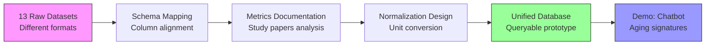

# Task 1: ECM Atlas Data Standardization & Schema Mapping

**Thesis:** Standardize 13 proteomic datasets (2017-2023) into unified database schema by mapping columns, documenting metrics from publications, and designing normalization strategy for Hyundai track prototype demo.

**Overview:** Task decomposes into three execution phases: (1.0) Schema mapping analyzes existing column structure against 13 datasets to identify commonalities/gaps, (2.0) Metrics documentation extracts measurement methodologies from source papers to understand abundance units and calculation methods, (3.0) Normalization design proposes conversion strategy (percentiles/z-scores) to enable cross-study protein comparisons, with deliverable being working prototype database demonstrating ECM aging signature queries.



---

## 1.0 SCHEMA MAPPING (Column Structure Analysis)

**¶1 Ordering principle:** Existing schema → dataset coverage → gap identification. Start with proposed structure, validate against reality, then refine.

**¶2 Proposed unified schema (12 columns):**
```
Protein_ID        - Standard identifier (UniProt/Gene symbol)
Protein_Name      - Full protein name
Gene_Symbol       - Gene nomenclature
Tissue            - Organ/tissue type (lung, skin, heart, kidney, etc.)
Species           - Organism (Mus musculus, Homo sapiens, Bos taurus)
Age               - Numeric age value
Age_Unit          - Time unit (years, months, weeks)
Abundance         - Quantitative protein measurement
Abundance_Unit    - Measurement unit (ppm, intensity, LFQ, etc.)
Method            - Proteomic technique (LC-MS/MS, DIA, etc.)
Study_ID          - Publication identifier (PMID, DOI)
Sample_ID         - Biological/technical replicate ID
```

**¶3 Dataset inventory (13 studies to map):**
1. Angelidis et al. 2019 - Lung (mouse) - 11 files, 59MB
2. Ariosa-Morejon et al. 2021 - 5 files
3. Caldeira et al. 2017 - 7 files
4. Chmelova et al. 2023 - 6 files
5. Dipali et al. 2023 - Ovary - 12 files, 41MB, DIA method
6. Li et al. 2021 | dermis - Skin - 5 files
7. Li et al. 2021 | pancreas - Pancreas - 5 files
8. Lofaro et al. 2021 - Kidney
9. McCabe et al. 2020 - Lung matrisome
10. Ouni et al. 2022 - Adipose tissue
11. Randles et al. 2021 - Kidney glomeruli
12. Tam et al. 2020 - Cardiac tissue
13. Tsumagari et al. 2023 - Latest publication

**¶4 Coverage analysis per dataset:**
For EACH study, identify:
- **Protein identifiers:** UniProt IDs vs Gene symbols vs custom nomenclature
- **Age groups:** Young/Old binary vs 3-point scale (young/middle/old) vs continuous
- **Abundance metrics:** Raw intensities vs normalized values vs fold-changes vs statistical scores
- **Replicates structure:** Technical vs biological, sample naming pattern
- **Tissue metadata:** Explicit vs inferred from paper title
- **Species:** Explicit in data vs paper-level annotation

**¶5 Gap identification priorities:**
- **Critical gaps (blockers):** Missing Protein_ID, missing Abundance values, unclear Age grouping
- **Secondary gaps (workarounds possible):** Missing Gene_Symbol (can derive from Protein_ID), missing Sample_ID (can generate)
- **Optional gaps (defer to later):** Missing Method details (use paper-level default)

---

## 2.0 METRICS DOCUMENTATION (Publication Analysis)

**¶1 Ordering principle:** Paper-by-paper review → metric extraction → cross-study comparison table. Systematic enumeration ensures complete coverage.

**¶2 Per-study documentation template:**
For EACH of 13 studies, extract from paper:
```markdown
### Study: [Author] et al. [Year]
- **PMID/DOI:** [identifier]
- **Tissue:** [organ]
- **Species:** [organism]
- **Age bins:** Young=[X units], Old=[Y units], [Middle if present]
- **Proteomic method:** [LC-MS/MS | DIA | TMT | LFQ]
- **Abundance definition:** [How calculated - e.g., "sum of peptide intensities"]
- **Abundance unit:** [intensity | ppm | LFQ intensity | spectral counts]
- **Normalization applied:** [None | Total intensity | Median centering | Other]
- **Protein ID database:** [UniProt | Ensembl | RefSeq | Gene symbols]
- **Statistical comparison:** [Fold-change | t-test | ANOVA | q-value]
- **Key findings:** [Brief summary of aging signature]
```

**¶3 Example: Caldeira et al. 2017 analysis:**
From transcript discussion:
- **Files examined:** `41598_2017_11960_MOESM2_ESM.xls` (main dataset)
- **Abundance representation:** Raw intensities - "sum of intensities of peptides belonging to given protein"
- **Age comparison:** Old vs Young (binary)
- **Statistical metric:** Fold-change ratio (Old/Young)
- **Sorting:** Ranked by fold-change (descending = enriched in old, ascending = depleted in old)
- **Challenge identified:** Need to verify if values are raw intensities vs already-normalized

**¶4 Example: Dipali et al. 2023 analysis:**
From repository files:
- **Study design:** Native tissue vs Decellularized tissue comparison
- **Method:** DIA (Direct Data-Independent Acquisition) - modern approach
- **File structure:**
  - `Candidates.tsv` (5MB) - Raw DIA output
  - `Report_Birgit_Protein+Quant_Pivot.xls` (2.7MB) - Protein-level summary
  - `Report_Birgit+Peptide+Quant_Pivot.xls` (29MB) - Peptide-level data
- **Abundance:** Likely LFQ (Label-Free Quantification) intensities
- **Versioning:** v3, v7, v8 - indicates iterative analysis refinement
- **Challenge:** Multiple file formats (TSV raw + XLSX processed + XLS reports) - which to use as canonical source?

**¶5 Cross-study metrics comparison table:**
Create table comparing:
| Study | Tissue | Species | Age_Young | Age_Old | Method | Abundance_Unit | Normalization | Replicate_N |
|-------|--------|---------|-----------|---------|--------|----------------|---------------|-------------|
| Angelidis 2019 | Lung | Mouse | 3mo | 24mo | LC-MS/MS | Intensity | Total | 4 |
| Caldeira 2017 | [TBD] | [TBD] | [TBD] | [TBD] | [TBD] | Intensity | [TBD] | [TBD] |
| Dipali 2023 | Ovary | [TBD] | [TBD] | [TBD] | DIA | LFQ | [TBD] | [TBD] |
| ... | ... | ... | ... | ... | ... | ... | ... | ... |

**Purpose:** Identify common denominators and outliers for normalization strategy.

---

## 3.0 NORMALIZATION DESIGN (Unit Conversion Strategy)

**¶1 Ordering principle:** Problem definition → candidate methods → implementation approach → validation criteria. Logical flow from "why" to "how" to "verify".

**¶2 Normalization problem statement:**
- **Challenge:** Abundance units vary across studies (raw intensities, LFQ, spectral counts, ppm)
- **Goal:** Enable cross-study protein comparisons - e.g., "Is Collagen-1 enriched in old tissue across ALL organs?"
- **Constraint:** Preserve biological signal (true aging differences) while removing technical variation (instrument differences)
- **Current blocker:** Cannot directly compare `Protein_A[intensity=15000, Study1]` with `Protein_A[LFQ=8.5, Study2]`

**¶3 Candidate normalization methods:**

**Option 1: Percentile rank transformation**
- **Method:** Convert each protein's abundance to percentile within its study (0-100 scale)
- **Pros:** Distribution-free, robust to outliers, naturally comparable across studies
- **Cons:** Loses magnitude information (2-fold vs 10-fold change both become percentiles)
- **Use case:** Best for queries like "Show proteins in top 10% abundance in old tissue"

**Option 2: Z-score standardization**
- **Method:** `Z = (Abundance - Mean_study) / StdDev_study`
- **Pros:** Preserves relative magnitude, standard statistical approach, interpretable (Z=2 means "2 SD above mean")
- **Cons:** Sensitive to outliers, assumes normal distribution
- **Use case:** Best for statistical comparisons, clustering, heatmaps

**Option 3: Log2 fold-change + reference normalization**
- **Method:** Calculate Log2(Old/Young) within each study, then normalize to reference protein set
- **Pros:** Directly captures aging effect, symmetric scale (-1 = halved, +1 = doubled)
- **Cons:** Requires both Young and Old samples (not all datasets have both), reference set selection is critical
- **Use case:** Best for biological interpretation of aging direction/magnitude

**Option 4: Hybrid approach (recommended)**
- **Within-study:** Z-score standardization per study
- **Cross-study:** Percentile rank for aggregation
- **Rationale:** Preserves information within study, enables robust comparison across studies

**¶4 Implementation approach:**

**Phase 1: Within-study normalization (per dataset)**
```python
for study in datasets:
    # Step 1: Filter to ECM proteins only (use Matrisome AnalyzeR classification)
    study_ecm = filter_matrisome(study)

    # Step 2: Handle missing values (median imputation or exclude)
    study_clean = impute_missing(study_ecm)

    # Step 3: Log-transform if needed (for skewed distributions)
    if is_right_skewed(study_clean['Abundance']):
        study_clean['Abundance_log2'] = log2(study_clean['Abundance'] + 1)

    # Step 4: Z-score normalization
    study_clean['Abundance_zscore'] = zscore(study_clean['Abundance_log2'])

    # Step 5: Add percentile ranks
    study_clean['Abundance_percentile'] = percentile_rank(study_clean['Abundance_zscore'])
```

**Phase 2: Cross-study normalization (harmonization)**
```python
# Step 1: Merge all studies on Protein_ID
merged = merge_datasets(all_studies, on='Protein_ID')

# Step 2: For proteins present in multiple studies, aggregate
for protein_id in merged['Protein_ID'].unique():
    protein_data = merged[merged['Protein_ID'] == protein_id]

    # Calculate meta-percentile across studies
    protein_data['meta_percentile'] = mean(protein_data['Abundance_percentile'])

    # Flag consistency (high variance = inconsistent across studies)
    protein_data['consistency_score'] = 1 - std(protein_data['Abundance_percentile']) / 100
```

**¶5 Validation criteria:**
- **Sanity check 1:** Known aging markers (e.g., Collagen-1, Fibronectin) should show consistent up/down regulation
- **Sanity check 2:** Housekeeping proteins should have low variance across age groups
- **Sanity check 3:** Tissue-specific proteins should cluster by tissue regardless of normalization
- **Quantitative metric:** Correlation between raw fold-changes and normalized z-scores should be >0.8

---

## 4.0 DELIVERABLES & SUCCESS CRITERIA (Hyundai Track Demo)

**¶1 Ordering principle:** Minimum viable product → demo script → stretch goals. Prioritizes working prototype over complete feature set.

**¶2 MVP requirements (for demo):**
- ✅ **Database:** 13 datasets standardized and loaded into queryable format (SQLite/PostgreSQL/CSV+Pandas)
- ✅ **Schema validation:** All 12 columns populated for at least 70% of proteins
- ✅ **Normalization:** Z-scores and percentiles calculated for all abundance values
- ✅ **Basic interface:** Streamlit app with:
  - Dropdown: Select tissue type
  - Dropdown: Select organism
  - Button: "Show aging signature"
  - Output: Table of top 20 up/down-regulated proteins
- ✅ **5-minute video:** Screen recording showing query → results workflow

**¶3 Demo script (example queries):**
```
Query 1: "What proteins are upregulated in aging across ALL tissues?"
Expected: Collagen, Fibronectin, ECM remodeling factors

Query 2: "Show lung-specific aging signature in mice"
Expected: Filtered table from Angelidis 2019 + McCabe 2020 studies

Query 3: "Compare cardiac tissue aging between human and mouse"
Expected: Side-by-side abundance plots for Tam 2020 data
```

**¶4 Stretch goals (if time permits):**
- 🔲 Chatbot interface: Natural language queries → SQL generation → results
- 🔲 Matrisome AnalyzeR integration: Automatic ECM protein classification
- 🔲 Metadata ontology: Map to CELLxGENE or AnVIL standards
- 🔲 Visualization: Heatmap of protein abundances across tissues/ages

**¶5 Timeline:**
- **Hour 1 (now):** Schema mapping + metrics documentation (Daniel task)
- **Hour 2:** Review findings + refine normalization approach (collaborative)
- **Hours 3-4:** Implement parsing scripts per dataset
- **Hours 5-6:** Run normalization pipeline + validation checks
- **Hours 7-8:** Build Streamlit interface + test queries
- **Hour 9:** Record demo video + prepare slides
- **Hour 10:** Buffer for debugging + polish

---

## 5.0 TECHNICAL NOTES & CONSTRAINTS

**¶1 Data heterogeneity challenges:**
- **Protein ID formats:** UniProt (P02452) vs Gene symbols (COL1A1) vs Ensembl (ENSG00000108821)
  - **Solution:** Use UniProt Mapping tool API to harmonize all to UniProt IDs
- **Age definitions:** Mouse years ≠ human years ≠ cow years
  - **Solution:** Add `Species_lifespan` column to normalize age as % of max lifespan
- **Missing replicates:** Some studies only report aggregated values
  - **Solution:** Flag with `Sample_ID = "pooled"` and exclude from variance calculations

**¶2 File format issues:**
- **Excel limitations:** `.xls` files (max 65k rows) vs `.xlsx` (1M rows) - Angelidis MOESM8 is 22MB
  - **Solution:** Use `openpyxl` for .xlsx, `xlrd` for .xls
- **PDF tables:** Some supplementary data only in PDF (Chmelova 2023)
  - **Solution:** Use `tabula-py` for table extraction or manual entry if <100 rows
- **Naming inconsistency:** `MOESM[N]_ESM.xlsx` (Nature) vs `fig[N]-data[N].xlsx` (eLife) vs `Data Sheet 1.XLSX` (Frontiers)
  - **Solution:** Create `dataset_registry.json` mapping filenames to canonical IDs

**¶3 Computational environment:**
- **Python packages required:**
  ```
  pandas>=2.0.0
  numpy>=1.24.0
  openpyxl>=3.1.0
  xlrd>=2.0.1
  scipy>=1.10.0
  scikit-learn>=1.2.0
  streamlit>=1.28.0
  ```
- **Database options:**
  - **SQLite:** Simple, portable, good for <1GB data (likely sufficient for 13 studies)
  - **PostgreSQL:** Better for concurrent queries, production-ready
  - **DuckDB:** Modern alternative, fast analytics, Parquet support
- **Hardware:** No GPU needed, standard laptop sufficient (datasets are <500MB total)

---

## METADATA

- **Task owner:** Daniel Kravtsov (daniel@improvado.io)
- **Collaborator:** Rakhan Aimbetov
- **Project:** ECM Atlas - Hyundai Track prototype
- **Deadline:** Demo video + working interface required
- **Repository:** https://github.com/raimbetov/ecm-atlas
- **Reference docs:** `00_REPO_OVERVIEW.md`, dataset description files
- **Meeting notes:** 2025-10-12 planning session (1h discussion)
- **Next sync:** After initial schema mapping complete (~30-60 min)
