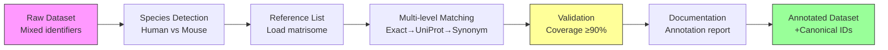

# Task 2: Protein Annotation Guidelines & Best Practices

**Thesis:** Establish systematic protein annotation methodology using Matrisome AnalyzeR reference lists for human/mouse ECM datasets, ensuring ≥90% coverage through multi-level matching strategy (exact→UniProt→synonym), validated against known markers, documented per-dataset for reproducibility.

**Overview:** Task defines annotation workflow for harmonizing protein identifiers across 13 proteomic studies. (1.0) Reference data specifies species-specific matrisome lists and their structure, (2.0) Annotation methodology describes matching algorithm hierarchy and implementation, (3.0) Quality control establishes validation criteria and coverage targets, (4.0) Documentation standards ensure reproducible annotation decisions with audit trail.



---

## 1.0 REFERENCE DATA (Matrisome Lists Structure)

**¶1 Ordering principle:** Official sources → species breakdown → data structure → access methods. Establishes canonical references before describing usage.

**¶2 Matrisome project overview:**
- **Definition:** Comprehensive catalog of extracellular matrix (ECM) and ECM-associated proteins
- **Version:** Matrisome v2.0 (current standard as of 2024)
- **Coverage:** Human (1027 genes), Mouse (1110 genes)
- **Maintainer:** Naba Lab, University of Illinois Chicago
- **Publications:**
  - Matrisome AnalyzeR tool: J Cell Sci (2023) 136(17):jcs261255
  - MatrisomeDB database: Nucleic Acids Res (2020) 48(D1):D1136–D1144
  - Original matrisome definition: Matrix Biol (2012) 31(5):259-265

**¶3 Human matrisome reference list:**

**Source:**
- **Local file:** `references/human_matrisome_v2.csv` (164KB, 1,026 entries)
- **Online URL:** https://docs.google.com/spreadsheets/d/1GwwV3pFvsp7DKBbCgr8kLpf8Eh_xV8ks/edit
- **Species:** *Homo sapiens*
- **Total entries:** 1,026 genes (1,027 rows including header)
- **File format:** CSV with pipe-separated synonyms, colon-separated multiple IDs

**Data structure (actual columns):**
```csv
Matrisome Division   - Core matrisome | Matrisome-associated
Matrisome Category   - ECM Glycoproteins | Collagens | Proteoglycans | ECM Regulators | ECM-affiliated | Secreted Factors
Gene Symbol          - Official HGNC gene symbol (all uppercase: COL1A1, FN1, ADIPOQ)
Gene Name            - Full protein name (e.g., "collagen type I alpha 1 chain")
Synonyms             - Alternative gene names (pipe-separated: ACDC|ACRP30|ADIPQTL1)
HGNC_IDs             - HGNC gene database identifiers
HGNC_IDs Links       - Link to HGNC database entries
UniProt_IDs          - UniProt accessions, colon-separated if multiple isoforms (Q15848 or P02452:Q8N123)
Refseq_IDs           - RefSeq identifiers, colon-separated (NP_001171271.1:NP_004788.1)
Notes                - Additional annotations (usually empty)
```

**Example entries (actual data):**
```csv
Core matrisome,ECM Glycoproteins,ADIPOQ,"adiponectin, C1Q and collagen domain containing",ACDC|ACRP30|ADIPQTL1|ADPN|APM-1|APM1|GBP28|adipone,13633,13633,Q15848,NP_001171271.1:NP_004788.1,
Core matrisome,Collagens,COL1A1,collagen type I alpha 1 chain,OI4,2197,2197,P02452,NP_000079.2,Major fibrillar collagen
Core matrisome,ECM Glycoproteins,FN1,fibronectin 1,CIG|ED-B|FINC|FN|FNZ|GFND|GFND2|LETS|MSF,3603,3603,P02751,NP_001293058.1:NP_001293059.1:NP_002017.1:NP_212464.1:NP_212465.1:NP_212466.1:NP_212467.1:NP_212468.1:NP_212469.1,
```

**¶4 Mouse matrisome reference list:**

**Source:**
- **Local file:** `references/mouse_matrisome_v2.csv` (197KB, 1,109 entries)
- **Online URL:** https://docs.google.com/spreadsheets/d/1Te6n2q_cisXeirzBClK-VzA6T-zioOB5/edit
- **Species:** *Mus musculus*
- **Total entries:** 1,109 genes (1,110 rows including header)
- **File format:** CSV with pipe-separated synonyms, colon-separated multiple IDs

**Data structure (actual columns):**
```csv
Matrisome Division   - Core matrisome | Matrisome-associated
Matrisome Category   - ECM Glycoproteins | Collagens | Proteoglycans | ECM Regulators | ECM-affiliated | Secreted Factors
Gene Symbol          - Official MGI gene symbol (sentence case: Adipoq, Col1a1, Fn1)
Gene Name            - Full protein name
Synonyms             - Alternative gene names (pipe-separated: 30kDa|APN|Acdc|Acrp30)
MGI_IDs              - MGI gene database identifiers
MGI_IDs Links        - Link to MGI database entries
UniProt_IDs          - UniProt accessions, colon-separated if multiple isoforms
Refseq_IDs           - RefSeq identifiers, colon-separated
Notes                - Additional annotations (usually empty)
```

**Example entries (actual data):**
```csv
Core matrisome,ECM Glycoproteins,Adipoq,"adiponectin, C1Q and collagen domain containing",30kDa|APN|Acdc|Acrp30|GBP28|adipo|apM1,MGI:106675,MGI:106675,E9PWU4:Q60994:Q8BRW2,NP_033735.3,
Core matrisome,Collagens,Col1a1,collagen type I alpha 1 chain,Cola1|Cola-1|Mov13,MGI:88467,MGI:88467,P11087,NP_031764.2,
Core matrisome,ECM Glycoproteins,Fn1,fibronectin 1,CIG|Fn|LETS,MGI:95566,MGI:95566,P11276,NP_034346.2,
```

**Critical differences from human list:**
- **Nomenclature convention:** Mouse uses sentence case (Adipoq, Col1a1, Fn1) vs human uppercase (ADIPOQ, COL1A1, FN1)
- **Gene duplications:** Mouse has 1,109 vs human 1,026 genes due to some evolutionary gene duplications
- **Database IDs:** MGI instead of HGNC
- **Orthology notes:** Some entries include human ortholog mappings for cross-species analysis
- **>100 near-identical names:** Require expert-level disambiguation (e.g., Col1a1 vs Cola1 synonyms)

**¶5 Matrisome classification hierarchy:**

**Division 1: Core Matrisome (structural ECM proteins)**
- **ECM Glycoproteins:** 200+ proteins including laminins, fibronectins, tenascins
- **Collagens:** 40+ genes encoding collagen chains (COL1A1, COL4A1, etc.)
- **Proteoglycans:** 40+ proteins including aggrecans, perlecans, syndecans

**Division 2: Matrisome-associated (regulatory proteins)**
- **ECM Regulators:** Enzymes modifying ECM (MMPs, LOXs, ADAMTSs)
- **ECM-affiliated Proteins:** Growth factors, cytokines binding ECM
- **Secreted Factors:** Proteins secreted to ECM but not structural components

**¶6 Data access methods:**

**Option 1: Manual download (simplest for batch processing)**
```bash
# Download as CSV from Google Sheets
# File → Download → Comma-separated values (.csv)

# Save as:
# - human_matrisome_v2.csv
# - mouse_matrisome_v2.csv
```

**Option 2: R package (programmatic access)**
```r
# Install MatrisomeAnalyzeR package
install.packages("devtools")
devtools::install_github("Matrisome/MatrisomeAnalyzeR")

# Load reference lists
library(MatrisomeAnalyzeR)
human_matrisome <- getMatrisomeData("Homo_sapiens")
mouse_matrisome <- getMatrisomeData("Mus_musculus")
```

**Option 3: Web application (no coding required)**
```
1. Navigate to: https://sites.google.com/uic.edu/matrisome/tools/matrisome-analyzer
2. Upload dataset (CSV/Excel)
3. Select species
4. Download annotated results
```

---

## 2.0 ANNOTATION METHODOLOGY (Matching Algorithm)

**¶1 Ordering principle:** Algorithm logic → implementation steps → edge case handling. Describes matching strategy from general approach to specific scenarios.

**¶2 Multi-level matching strategy:**

**Rationale:** Protein identifiers vary in format across datasets. Hierarchical matching maximizes coverage while maintaining confidence:
1. **Level 1 - Exact gene symbol match:** Highest confidence (100%) - dataset gene matches reference gene exactly
2. **Level 2 - UniProt ID match:** High confidence (95%) - maps via UniProt accession number
3. **Level 3 - Synonym match:** Medium confidence (80%) - matches alternative protein names from reference synonyms column
4. **Level 4 - Manual review:** Variable confidence - requires expert judgment for ambiguous cases

**¶3 Annotation workflow implementation:**

**Step 1: Species detection**
```python
def detect_species(dataset_metadata):
    """
    Identify species from dataset metadata or filename.

    Priority:
    1. Explicit metadata field: dataset.metadata['species']
    2. Parse from study title/filename: "mouse lung", "human kidney"
    3. Manual specification if ambiguous

    Returns: "Homo sapiens" | "Mus musculus"
    """
    # Check metadata field
    if 'species' in dataset_metadata:
        species = dataset_metadata['species']
        if species.lower() in ['human', 'homo sapiens']:
            return "Homo sapiens"
        elif species.lower() in ['mouse', 'mus musculus']:
            return "Mus musculus"

    # Fallback: require manual specification
    raise ValueError("Species not specified. Add to metadata or use --species flag.")
```

**Step 2: Reference list loading**
```python
import pandas as pd

def load_reference_list(species):
    """Load species-specific matrisome reference."""
    if species == "Homo sapiens":
        ref_path = "references/human_matrisome_v2.csv"
    elif species == "Mus musculus":
        ref_path = "references/mouse_matrisome_v2.csv"
    else:
        raise ValueError(f"Unsupported species: {species}")

    ref = pd.read_csv(ref_path)

    # Create lookup dictionaries for fast matching
    ref_by_gene = dict(zip(ref['Gene_Symbol'], ref.to_dict('records')))
    ref_by_uniprot = dict(zip(ref['UniProt_ID'], ref.to_dict('records')))

    # Parse synonyms into searchable structure
    ref_synonyms = {}
    for idx, row in ref.iterrows():
        if pd.notna(row['Synonyms']):
            synonyms = row['Synonyms'].split(';')
            for syn in synonyms:
                syn_clean = syn.strip()
                ref_synonyms[syn_clean] = row.to_dict()

    return {
        'by_gene': ref_by_gene,
        'by_uniprot': ref_by_uniprot,
        'by_synonym': ref_synonyms,
        'full_table': ref
    }
```

**Step 3: Multi-level matching**
```python
def annotate_protein(protein_record, reference, uniprot_mapper=None):
    """
    Annotate single protein using hierarchical matching.

    Args:
        protein_record: Dict with 'gene_symbol', 'uniprot_id', 'protein_name'
        reference: Dict returned by load_reference_list()
        uniprot_mapper: Optional UniProt API client for ID conversion

    Returns:
        Dict with annotation results + confidence score
    """
    # Level 1: Exact gene symbol match
    gene = protein_record.get('gene_symbol', '').strip()
    if gene in reference['by_gene']:
        match = reference['by_gene'][gene]
        return {
            'match_found': True,
            'match_level': 'exact_gene',
            'confidence': 100,
            'canonical_gene_symbol': match['Gene_Symbol'],
            'uniprot_id': match['UniProt_ID'],
            'matrisome_division': match['Matrisome_Division'],
            'matrisome_category': match['Matrisome_Category']
        }

    # Level 2: UniProt ID match
    uniprot = protein_record.get('uniprot_id', '').strip()
    if uniprot in reference['by_uniprot']:
        match = reference['by_uniprot'][uniprot]
        return {
            'match_found': True,
            'match_level': 'uniprot',
            'confidence': 95,
            'canonical_gene_symbol': match['Gene_Symbol'],
            'uniprot_id': match['UniProt_ID'],
            'matrisome_division': match['Matrisome_Division'],
            'matrisome_category': match['Matrisome_Category']
        }

    # Level 3: Synonym match
    protein_name = protein_record.get('protein_name', '').strip()
    if protein_name in reference['by_synonym']:
        match = reference['by_synonym'][protein_name]
        return {
            'match_found': True,
            'match_level': 'synonym',
            'confidence': 80,
            'canonical_gene_symbol': match['Gene_Symbol'],
            'uniprot_id': match['UniProt_ID'],
            'matrisome_division': match['Matrisome_Division'],
            'matrisome_category': match['Matrisome_Category']
        }

    # Level 4: No match - flag for manual review
    return {
        'match_found': False,
        'match_level': 'unmatched',
        'confidence': 0,
        'canonical_gene_symbol': None,
        'uniprot_id': None,
        'matrisome_division': None,
        'matrisome_category': None,
        'manual_review_required': True
    }
```

**Step 4: Batch annotation**
```python
def annotate_dataset(dataset, species):
    """Annotate entire proteomic dataset."""
    # Load reference
    reference = load_reference_list(species)

    # Annotate each protein
    annotations = []
    for idx, protein in dataset.iterrows():
        annotation = annotate_protein(protein, reference)
        annotation['original_index'] = idx
        annotation['original_id'] = protein.get('Protein_ID', '')
        annotations.append(annotation)

    # Merge annotations back to dataset
    annotation_df = pd.DataFrame(annotations)
    dataset_annotated = dataset.join(annotation_df.set_index('original_index'))

    return dataset_annotated
```

**¶4 Edge case handling:**

**Case 1: Multiple matches (ambiguous synonym)**
- **Scenario:** Synonym matches multiple reference entries (e.g., "Collagen" could be COL1A1, COL1A2, etc.)
- **Solution:** Flag as `ambiguous_match`, provide all candidates in `candidate_genes` field, require manual review
- **Example output:**
  ```python
  {
      'match_found': True,
      'match_level': 'ambiguous',
      'confidence': 50,
      'candidate_genes': ['COL1A1', 'COL1A2', 'COL3A1'],
      'manual_review_required': True
  }
  ```

**Case 2: Case sensitivity issues**
- **Problem:** Human uses uppercase (COL1A1), mouse uses sentence case (Col1a1), dataset may vary
- **Solution:** Normalize to reference convention before matching
  ```python
  def normalize_gene_symbol(gene, species):
      gene_clean = gene.strip()
      if species == "Homo sapiens":
          return gene_clean.upper()  # Human convention
      elif species == "Mus musculus":
          # Mouse convention: First letter uppercase, rest lowercase
          return gene_clean.capitalize()
  ```

**Case 3: Isoform annotations**
- **Problem:** Dataset includes isoform suffixes (e.g., COL1A1-201, FN1_v2)
- **Solution:** Strip isoform suffix, match base gene, preserve isoform info in separate column
  ```python
  def extract_base_gene(gene_id):
      # Remove common isoform patterns: -NNN, _vN, .NNN
      import re
      base = re.sub(r'[-_\.]\d+$', '', gene_id)
      return base
  ```

**Case 4: Obsolete gene symbols**
- **Problem:** Dataset uses deprecated gene names (e.g., old nomenclature)
- **Solution:** Use UniProt ID mapping API to convert old names to current symbols
  ```python
  def map_obsolete_gene(old_gene, species):
      """Query UniProt for current gene symbol."""
      import requests

      params = {
          'from': 'Gene_Name',
          'to': 'Gene_Name',
          'query': old_gene,
          'format': 'tab',
          'organism': '9606' if species == "Homo sapiens" else '10090'
      }

      response = requests.get('https://www.uniprot.org/uploadlists/', params=params)

      if response.ok:
          lines = response.text.strip().split('\n')
          if len(lines) > 1:
              current_gene = lines[1].split('\t')[1]
              return current_gene

      return None  # Could not map
  ```

---

## 3.0 QUALITY CONTROL (Validation Criteria)

**¶1 Ordering principle:** Coverage metrics → biological validation → consistency checks. Quantitative thresholds first, then qualitative sanity checks.

**¶2 Coverage targets:**

**Primary metric: Annotation rate**
- **Target:** ≥90% of dataset proteins matched to matrisome reference
- **Calculation:** `(proteins_matched / total_proteins) * 100`
- **Action if below target:**
  1. Review unmatched proteins for typos/formatting issues
  2. Check if dataset includes non-ECM proteins (expected in full proteomic studies)
  3. Manually annotate high-abundance unmatched proteins

**Confidence distribution:**
- **Ideal:** ≥70% exact matches, ≤30% synonym/UniProt matches, <5% manual review
- **Warning sign:** >20% manual review required - indicates poor dataset quality or wrong reference species

**¶3 Biological validation (known marker checks):**

**Universal ECM markers (should be present in all tissue datasets):**
```python
EXPECTED_MARKERS = {
    'COL1A1': {'category': 'Collagens', 'abundance': 'high'},
    'COL1A2': {'category': 'Collagens', 'abundance': 'high'},
    'FN1': {'category': 'ECM Glycoproteins', 'abundance': 'high'},
    'LAMA1': {'category': 'ECM Glycoproteins', 'abundance': 'medium'},
    'MMP2': {'category': 'ECM Regulators', 'abundance': 'medium'}
}

def validate_known_markers(annotated_dataset):
    """Check if expected ECM markers are present and correctly annotated."""
    validation_results = {}

    for marker, expected in EXPECTED_MARKERS.items():
        # Check if marker is in dataset
        marker_rows = annotated_dataset[
            annotated_dataset['canonical_gene_symbol'] == marker
        ]

        if len(marker_rows) == 0:
            validation_results[marker] = {
                'status': 'MISSING',
                'message': f"Expected marker {marker} not found in dataset"
            }
        else:
            # Check category annotation
            actual_category = marker_rows.iloc[0]['matrisome_category']
            if actual_category == expected['category']:
                validation_results[marker] = {
                    'status': 'PASS',
                    'message': f"{marker} found and correctly annotated"
                }
            else:
                validation_results[marker] = {
                    'status': 'FAIL',
                    'message': f"{marker} category mismatch: expected {expected['category']}, got {actual_category}"
                }

    return validation_results
```

**¶4 Species consistency checks:**

**Cross-contamination detection:**
- **Test:** Verify no human proteins in mouse dataset (and vice versa)
- **Method:** Check if matched genes follow species nomenclature convention
  - Human: All uppercase (COL1A1, FN1)
  - Mouse: Sentence case (Col1a1, Fn1)
- **Red flag:** >5 proteins violating convention suggests wrong reference list used

```python
def check_species_consistency(annotated_dataset, expected_species):
    """Detect potential cross-species contamination."""
    violations = []

    for idx, row in annotated_dataset.iterrows():
        gene = row['canonical_gene_symbol']

        if expected_species == "Homo sapiens":
            # Human genes should be all uppercase
            if gene != gene.upper():
                violations.append({
                    'gene': gene,
                    'issue': 'Not uppercase (expected for human)',
                    'suggestion': 'Possible mouse contamination or wrong reference'
                })

        elif expected_species == "Mus musculus":
            # Mouse genes should be sentence case (first upper, rest lower)
            if gene != gene.capitalize():
                violations.append({
                    'gene': gene,
                    'issue': 'Not sentence case (expected for mouse)',
                    'suggestion': 'Possible human contamination or wrong reference'
                })

    contamination_rate = len(violations) / len(annotated_dataset) * 100

    return {
        'contamination_rate': contamination_rate,
        'violations': violations,
        'status': 'PASS' if contamination_rate < 5 else 'FAIL'
    }
```

**¶5 Category distribution sanity checks:**

**Expected proportions (approximate guidelines):**
- **Core Matrisome:** 60-80% of annotated proteins
  - Collagens: 20-40%
  - ECM Glycoproteins: 30-50%
  - Proteoglycans: 5-15%
- **Matrisome-associated:** 20-40%
  - ECM Regulators: 10-25%
  - ECM-affiliated: 5-15%

**Outlier detection:**
```python
def check_category_distribution(annotated_dataset):
    """Verify matrisome category proportions are biologically reasonable."""
    category_counts = annotated_dataset['matrisome_category'].value_counts()
    total = len(annotated_dataset)

    distribution = {}
    warnings = []

    for category, count in category_counts.items():
        proportion = (count / total) * 100
        distribution[category] = proportion

        # Check for extreme outliers
        if category == 'Collagens' and proportion < 10:
            warnings.append(f"Low collagen proportion ({proportion:.1f}%) - expect 20-40%")
        elif category == 'Collagens' and proportion > 60:
            warnings.append(f"High collagen proportion ({proportion:.1f}%) - expect 20-40% (may indicate collagen-enriched tissue)")

    return {
        'distribution': distribution,
        'warnings': warnings,
        'status': 'PASS' if len(warnings) == 0 else 'REVIEW'
    }
```

---

## 4.0 DOCUMENTATION STANDARDS (Annotation Reports)

**¶1 Ordering principle:** Report structure → required sections → file naming → version control. Defines complete documentation requirements for reproducibility.

**¶2 Annotation report template:**

For each dataset, generate `[StudyName]_[Year]_annotation_report.md`:

```markdown
# Annotation Report: [Author] et al. [Year]

**Dataset:** [Study name/tissue/condition]
**Annotation date:** [YYYY-MM-DD]
**Annotator:** [Name or "automated pipeline"]
**Reference version:** Matrisome v2.0

---

## 1. Reference Lists Used

- **Species:** [Homo sapiens | Mus musculus]
- **Reference file:** [Filename and URL]
- **Reference date:** [Date reference list downloaded]
- **Total reference entries:** [N genes]

## 2. Coverage Statistics

| Metric | Count | Percentage |
|--------|-------|------------|
| Total proteins in dataset | [N] | 100% |
| Proteins matched to matrisome | [N] | [X.X]% |
| Unmatched proteins | [N] | [X.X]% |

**Coverage status:** [PASS ≥90% | REVIEW 70-89% | FAIL <70%]

### 2.1 Match Level Distribution

| Match Level | Count | Percentage | Confidence |
|-------------|-------|------------|------------|
| Exact gene symbol | [N] | [X.X]% | 100% |
| UniProt ID | [N] | [X.X]% | 95% |
| Synonym | [N] | [X.X]% | 80% |
| Manual review | [N] | [X.X]% | Variable |
| Unmatched | [N] | [X.X]% | 0% |

## 3. Matrisome Category Distribution

| Division | Category | Count | Percentage |
|----------|----------|-------|------------|
| Core Matrisome | ECM Glycoproteins | [N] | [X.X]% |
| Core Matrisome | Collagens | [N] | [X.X]% |
| Core Matrisome | Proteoglycans | [N] | [X.X]% |
| Matrisome-associated | ECM Regulators | [N] | [X.X]% |
| Matrisome-associated | ECM-affiliated | [N] | [X.X]% |
| Matrisome-associated | Secreted Factors | [N] | [X.X]% |

**Distribution status:** [PASS | REVIEW - see warnings]

**Warnings:**
- [List any distribution anomalies]

## 4. Known Marker Validation

| Marker | Status | Category | Notes |
|--------|--------|----------|-------|
| COL1A1 | ✅ Found | Collagens | Correctly annotated |
| COL1A2 | ✅ Found | Collagens | Correctly annotated |
| FN1 | ✅ Found | ECM Glycoproteins | Correctly annotated |
| LAMA1 | ⚠️ Missing | ECM Glycoproteins | Expected but not in dataset |
| MMP2 | ✅ Found | ECM Regulators | Correctly annotated |

## 5. Species Consistency Check

- **Expected species:** [Homo sapiens | Mus musculus]
- **Contamination rate:** [X.X]% ([N]/[Total])
- **Status:** [PASS <5% | FAIL ≥5%]

**Violations (if any):**
1. [Gene]: [Issue description]
2. [Continue if multiple violations]

## 6. Ambiguous/Manual Review Cases

### 6.1 Ambiguous Matches (Multiple Candidates)

1. **Original ID:** [Protein_X]
   - **Candidates:** [Gene1, Gene2, Gene3]
   - **Resolution:** [Selected Gene1 based on abundance pattern]
   - **Confidence:** [60%]

2. [Continue for all ambiguous cases]

### 6.2 Unmatched Proteins Requiring Review

| Original ID | Abundance | Reason Unmatched | Suggested Action |
|-------------|-----------|------------------|------------------|
| [Protein_Y] | [High] | Obsolete gene name | Query UniProt for current symbol |
| [Protein_Z] | [Low] | Likely non-ECM contaminant | Exclude from analysis |

## 7. Files Generated

- `[dataset]_annotated.csv` - Full dataset with annotation columns added
- `[dataset]_matched.csv` - Only successfully matched proteins
- `[dataset]_unmatched.csv` - Proteins requiring manual review
- `[dataset]_annotation_log.json` - Machine-readable annotation metadata

---

## Appendix: Annotation Metadata (JSON)

```json
{
  "dataset": "[study_name]",
  "species": "[Homo sapiens | Mus musculus]",
  "annotation_date": "YYYY-MM-DD",
  "reference_version": "Matrisome_v2.0",
  "reference_file": "[filename]",
  "total_proteins": [N],
  "matched_proteins": [N],
  "match_rate": [X.XX],
  "validation_status": "PASS",
  "known_markers_found": [N],
  "manual_review_required": [N]
}
```
```

**¶3 File naming conventions:**

**Annotation output files:**
```
[StudyAuthor]_[Year]_annotated.csv          # Full annotated dataset
[StudyAuthor]_[Year]_annotation_report.md   # Human-readable report
[StudyAuthor]_[Year]_annotation_log.json    # Machine-readable metadata
[StudyAuthor]_[Year]_unmatched.csv          # Proteins requiring manual review
```

**Examples:**
```
Angelidis_2019_annotated.csv
Caldeira_2017_annotation_report.md
Dipali_2023_annotation_log.json
```

**¶4 Version control and audit trail:**

**Annotation log (JSON format):**
```json
{
  "annotation_metadata": {
    "dataset_id": "Angelidis_2019",
    "annotation_timestamp": "2024-10-12T14:32:00Z",
    "annotator": "automated_pipeline_v1.0",
    "reference_version": "Matrisome_v2.0",
    "reference_file_hash": "sha256:a1b2c3d4...",
    "pipeline_version": "1.0.0",
    "python_version": "3.11.5"
  },
  "input_dataset": {
    "filename": "Angelidis_2019_raw.csv",
    "total_rows": 5247,
    "columns": ["Protein_ID", "Gene_Symbol", "Abundance"]
  },
  "annotation_results": {
    "matched": 4723,
    "unmatched": 524,
    "match_rate": 90.01,
    "match_levels": {
      "exact_gene": 3892,
      "uniprot": 623,
      "synonym": 208,
      "manual_review": 0
    }
  },
  "validation_checks": {
    "known_markers": "PASS",
    "species_consistency": "PASS",
    "category_distribution": "PASS"
  },
  "manual_modifications": [
    {
      "protein_id": "Protein_X",
      "action": "manually_mapped",
      "from": "COL1",
      "to": "COL1A1",
      "reason": "Obsolete gene symbol",
      "modified_by": "daniel@improvado.io",
      "modified_date": "2024-10-12"
    }
  ]
}
```

**¶5 Best practices for documentation:**

1. **Timestamp everything:** Record annotation date, reference list download date, pipeline version
2. **Preserve originals:** Never overwrite raw dataset - create new `_annotated.csv` file
3. **Document decisions:** All manual interventions must be logged with rationale
4. **Version references:** Include reference file checksum (SHA256) to detect changes
5. **Audit trail:** Store both automated results and any manual corrections separately
6. **Reproducibility:** Someone else should be able to recreate annotation using your report

---

## METADATA

- **Task owner:** Daniel Kravtsov (daniel@improvado.io)
- **Project:** ECM Atlas - Protein Annotation Workflow
- **Related task:** 01_TASK_DATA_STANDARDIZATION.md (Section 4.0)
- **Repository:** https://github.com/raimbetov/ecm-atlas
- **Reference resources:**
  - Matrisome project: https://sites.google.com/uic.edu/matrisome
  - Matrisome AnalyzeR: https://sites.google.com/uic.edu/matrisome/tools/matrisome-analyzer
  - Human reference list: https://docs.google.com/spreadsheets/d/1GwwV3pFvsp7DKBbCgr8kLpf8Eh_xV8ks/edit
  - Mouse reference list: https://docs.google.com/spreadsheets/d/1Te6n2q_cisXeirzBClK-VzA6T-zioOB5/edit
  - UniProt API: https://www.uniprot.org/help/api_idmapping
- **Knowledge framework source:** /Users/Kravtsovd/projects/chrome-extension-tcs/How to organize documents_knowladge_framework.md
- **Created:** 2024-10-12
