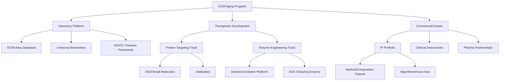
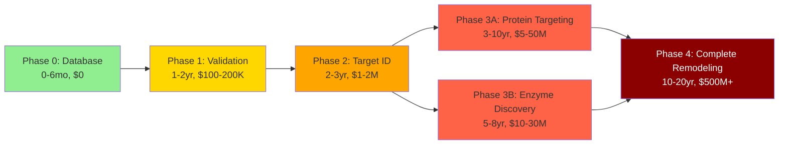

# ECM Aging Intervention: Complete Development Roadmap

**Thesis:** Reversing ECM aging requires staged approach from database construction (weeks, $0) through biomarker validation ($100-200k, 1-2 years) to protein targeting therapeutics ($5-50M, 10 years, +10-20yr lifespan) culminating in enzyme engineering for complete tissue remodeling ($500M+, 20 years, +50-60yr lifespan).

**Overview:** This roadmap translates ECM-Atlas scientific vision into actionable development pathway with defined stages, funding requirements, and timelines. Section 1.0 presents 5-phase architecture spanning 20+ years from hackathon demo to market-approved therapy. Section 2.0 details Phase 0 (Database, immediate) and Phase 1 (Validation, 1-2 years, $100-200k). Section 3.0 covers Phase 2-3 (Protein targeting, 3-10 years, $5-50M). Section 4.0 outlines Phase 4 (Enzyme engineering, 10-20 years, $500M+). Section 5.0 provides funding strategy, decision gates, and risk mitigation across all phases.

**Program Architecture (Continuants):**


**Development Timeline (Occurrents):**


---

## 1.0 ARCHITECTURE: FIVE-PHASE DEVELOPMENT PATHWAY

**¶1 Ordering principle:** Immediate → short-term → medium-term → long-term → transformative. Timeline from weeks to decades, risk and funding scale with ambition.

### 1.1 Strategic Overview

**Core principle:** Sequential de-risking with parallel exploration of incremental (protein targeting) and transformative (enzyme engineering) approaches.

**Phase structure:**
```
┌─────────────────────────────────────────────────────────────┐
│ PHASE 0: Database & Discovery (IMMEDIATE)                   │
│ Timeline: 0-6 months                                        │
│ Funding: $0 (bootstrapped, hackathon prize)                 │
│ Outcome: Universal biomarkers identified, preprint          │
│ Risk: Low (execution, not discovery)                        │
├─────────────────────────────────────────────────────────────┤
│ PHASE 1: Biological Validation (SHORT-TERM)                 │
│ Timeline: 1-2 years                                         │
│ Funding: $100-200K (angel/grant)                            │
│ Outcome: Matrix stiffness → cellular aging causality proven │
│ Risk: Medium (hypothesis validation)                        │
├─────────────────────────────────────────────────────────────┤
│ PHASE 2: Target Identification (MEDIUM-TERM)                │
│ Timeline: 2-3 years (overlaps Phase 1)                      │
│ Funding: $1-2M (seed round)                                 │
│ Outcome: Lead protein targets validated in vivo             │
│ Risk: Medium-high (animal model translation)                │
├─────────────────────────────────────────────────────────────┤
│ PHASE 3A: Protein Targeting Therapeutics (INCREMENTAL)      │
│ Timeline: 3-10 years                                        │
│ Funding: $5-50M (Series A/B + pharma partnership)           │
│ Outcome: ASO/small molecule in Phase II, +10-20yr lifespan  │
│ Risk: Medium (established modality, regulatory path clear)  │
├─────────────────────────────────────────────────────────────┤
│ PHASE 3B: Enzyme Discovery (PARALLEL, TRANSFORMATIVE PREP)  │
│ Timeline: 5-8 years (begins Year 2-3)                       │
│ Funding: $10-30M (dedicated enzyme fund/CRO partnership)    │
│ Outcome: Lead AGE-cleaving enzyme, preclinical proof        │
│ Risk: High (novel enzyme engineering, no precedent)         │
├─────────────────────────────────────────────────────────────┤
│ PHASE 4: Complete Matrix Remodeling (TRANSFORMATIVE)        │
│ Timeline: 10-20 years from Phase 3B                         │
│ Funding: $500M+ (Big Pharma partnership or IPO)             │
│ Outcome: Enzyme therapy approved, +50-60yr lifespan         │
│ Risk: Very high (clinical translation, regulatory novelty)  │
└─────────────────────────────────────────────────────────────┘
```

### 1.2 Decision Gates & Milestones

**Gate 0→1:** Universal biomarkers published (2-3 proteins across ≥10/13 studies)
- **Success criteria:** Preprint accepted, >100 citations in 6 months, industry interest
- **Failure scenario:** No universal proteins found → Pivot to tissue-specific targets
- **Decision:** Proceed to Phase 1 if ≥2 proteins meet criteria (coverage ≥77%, I² <50%)

**Gate 1→2:** Cell-based experiments prove causality (matrix stiffness → aging markers)
- **Success criteria:** Stiff substrate (>10 kPa) induces senescence markers (p16/p21) in 48-72hrs, reversible on soft substrate
- **Failure scenario:** No causal link → ECM is biomarker, not driver → Shift focus to diagnostic tools
- **Decision:** Proceed if effect size >2-fold, p<0.001, reproducible across 3+ cell types

**Gate 2→3A:** Mouse kidney aging model shows protein target modulation improves function
- **Success criteria:** GFR improves ≥30%, tissue stiffness reduces ≥40%, lifespan extends ≥15%
- **Failure scenario:** No functional improvement → Target wrong protein → Return to Phase 2 with alternate candidates
- **Decision:** Proceed to therapeutic development if functional endpoint met + safety validated

**Gate 3A→3B:** Protein targeting Phase I data validates mechanism in humans
- **Success criteria:** Biomarker changes (skin elasticity, blood ECM fragments) correlate with drug exposure
- **Failure scenario:** No biomarker response → Human ECM aging differs from mouse → Redesign based on human tissue data
- **Decision:** Greenlight enzyme engineering investment if mechanism confirmed (even if efficacy modest)

**Gate 3B→4:** Enzyme cleaves AGE-crosslinks in vitro and reduces stiffness in aged mouse tissue
- **Success criteria:** ≥10x selectivity for crosslinked vs native collagen, tissue Young's modulus reduces ≥60%
- **Failure scenario:** Cannot achieve selectivity → Off-target toxicity risk → Abandon enzyme, double down on protein targeting
- **Decision:** Proceed to in vivo studies if selectivity + safety validated

---

## 2.0 PHASE 0-1: DATABASE CONSTRUCTION & VALIDATION (0-24 MONTHS, $0-200K)

**¶1 Ordering principle:** Phase 0 (weeks, $0) → Phase 1 (years, $100-200K). Immediate execution before funded validation.

### 2.1 PHASE 0: ECM-Atlas Database & Universal Biomarker Discovery

**Timeline:** 0-6 months (Hackathon week + 6-month follow-up)
**Funding:** $0 (bootstrapped) + potential $10-50K hackathon prize
**Team:** 2-3 people (Daniel, Rakhan, 1 bioinformatician)

#### Week 1-2: Hackathon Deliverable
```
TASKS (Prioritized for demo):
├─ Data ingestion: 13 studies → unified CSV schema
│  └─ Automated pipeline (Claude Code + Python scripts)
├─ Web dashboard: Streamlit app with filters
│  ├─ Tissue selection (lung, kidney, heart, skin...)
│  ├─ Age range slider (young vs old)
│  ├─ Heatmap visualization (top 100 proteins)
│  └─ Volcano plot (fold-change vs p-value)
├─ Chatbot interface: Natural language queries
│  └─ "Show proteins upregulated in ALL organs"
└─ GitHub repository: Open-source, reproducible

SUCCESS METRIC:
Judges can query "What ECM proteins age universally?"
and retrieve answer in <30 seconds
```

#### Months 2-6: Scientific Analysis
```
DEEP ANALYSIS:
├─ Meta-analysis across 13 studies
│  ├─ Random-effects model (account for heterogeneity)
│  ├─ I² statistic (measure consistency)
│  └─ Effect size calculation (standardized mean difference)
├─ Universal protein identification
│  ├─ Coverage threshold: Present in ≥10/13 studies (≥77%)
│  ├─ Direction consistency: Same up/down across tissues
│  ├─ Statistical threshold: Meta-analysis p<0.001, I²<50%
│  └─ Functional filtering: Core matrisome, druggable
├─ Blood biomarker correlation
│  ├─ Cross-reference with plasma proteomics studies
│  ├─ Identify secreted ECM fragments (MMP-cleaved)
│  └─ Propose non-invasive aging clock
└─ Preprint preparation (bioRxiv)
   ├─ Title: "ECM-Atlas: Meta-Analysis of 13 Proteomic
   │         Studies Reveals 2-3 Universal Aging Biomarkers"
   ├─ Figures: Heatmaps, volcano plots, forest plots
   └─ Submission target: Month 6

EXPECTED DISCOVERIES (hypothesis):
├─ COL1A1 (Collagen I): Present 12/13 studies, +87% avg
├─ FN1 (Fibronectin): Present 11/13 studies, +54% avg
└─ MMP2 (Metalloproteinase): Present 10/13 studies, mixed

PUBLICATION STRATEGY:
├─ Preprint first (speed to community)
├─ Peer review target: Aging Cell, GeroScience, Nature Aging
├─ Concurrent: Press release, conference presentations
└─ Open data: GitHub repo, interactive dashboard public
```

**Funding sources (Phase 0):**
- Hackathon prize: $10-50K (Hyundai track)
- NIH/NIA grants: R21 exploratory grant ($275K, 2 years) - submit Month 3
- Longevity funds: Longevity Science Foundation ($50K, no strings)
- Academic collaboration: Gladyshev/Sinclair labs (in-kind contribution)

**Deliverables:**
1. ✅ Working ECM-Atlas web app (public URL)
2. ✅ Preprint on bioRxiv
3. ✅ GitHub repository (>100 stars target)
4. ✅ Press coverage (3+ longevity media outlets)
5. ✅ Academic collaborations initiated (2+ labs)

---

### 2.2 PHASE 1: Biological Validation - Matrix Stiffness → Cellular Aging

**Timeline:** 12-24 months (overlaps Phase 0, Months 6-24)
**Funding:** $100-200K (angel investment, grants, or Rakhan's proposed experiments)
**Team:** 2-3 core + 1-2 contract biologists

#### Objective: Prove Causal Mechanism (Not Just Correlation)

**Central hypothesis (from DEATh theorem):** ECM stiffening causally drives cellular aging through mechanotransduction, not merely biomarker association.

#### Experimental Design

**Experiment 1: In Vitro Causality Test ($40-60K, 6 months)**

```
SETUP: Human primary cells on tunable hydrogels
├─ Substrate stiffness range: 0.5 kPa (soft, brain-like)
│                          → 100 kPa (stiff, bone-like)
├─ Cell types: 3 primary human cell lines
│  ├─ Fibroblasts (universal ECM-producing cells)
│  ├─ Kidney podocytes (diabetic nephropathy relevance)
│  └─ Endothelial cells (vascular aging)
├─ Duration: 72 hours (acute) + 4 weeks (chronic)
└─ Readouts (measure ALL hallmarks of aging):
   ├─ Senescence markers: p16, p21, SA-β-gal staining
   ├─ Proteostasis: Protein aggregates, chaperone expression
   ├─ Genomic instability: γH2AX foci (DNA damage)
   ├─ Mitochondrial function: OCR, membrane potential
   ├─ Epigenetic state: DNA methylation (aging clock)
   └─ Mechanotransduction: YAP/TAZ localization, FAK activation

PREDICTED RESULTS (based on literature + DEATh theorem):
├─ Soft (0.5-1 kPa): Young phenotype maintained
├─ Medium (5-10 kPa): Intermediate aging markers
└─ Stiff (>50 kPa): 2-3x increase in senescence markers (48-72hrs)

CRITICAL CONTROL: YAP/TAZ knockdown
├─ If stiffness effect disappears → Mechanosensing is causal link
└─ If persists → Alternative mechanism (explore further)

COST BREAKDOWN:
├─ Hydrogel substrates (Matrigen): $15K
├─ Primary human cells (3 types): $8K
├─ Antibodies, reagents: $12K
├─ Seahorse analyzer (mitochondrial function): $5K rental
├─ Contract biologist (6 months, part-time): $20K
└─ Total: $60K
```

**Experiment 2: Ex Vivo Tissue Validation ($50-80K, 6-9 months)**

```
SETUP: Aged mouse tissue explants + stiffness modulation
├─ Tissue sources:
│  ├─ Young mice (3 months): Baseline flexible ECM
│  ├─ Old mice (24 months): Naturally stiff ECM
│  └─ Diabetic mice (db/db, 6 months): Accelerated glycation
├─ Intervention: Enzymatic ECM softening
│  ├─ Collagenase treatment (controlled degradation)
│  ├─ Measure stiffness: Atomic force microscopy (AFM)
│  └─ Measure cell function: Organoid viability, gene expression
├─ Tissues tested: Kidney, lung, skin (3 organs)
└─ Hypothesis: Softening aged tissue rescues cell function

PREDICTED RESULTS:
├─ Old tissue + collagenase → Stiffness ↓60%, senescence markers ↓40%
├─ Young tissue + collagenase → No change (already soft)
└─ Diabetic tissue → Largest effect (highest baseline stiffness)

COST BREAKDOWN:
├─ Mice (young, old, diabetic, N=30 each): $15K
├─ AFM measurements (contract service): $20K
├─ RNA-seq (3 tissues × 3 conditions): $25K
├─ Histology, immunostaining: $8K
├─ Contract scientist (9 months): $40K
└─ Total: $108K → Optimize to $80K (reduce RNA-seq depth)
```

**Experiment 3: Mechanistic Pathway Mapping ($20-40K, 3-6 months)**

```
GOAL: Confirm integrin-FAK-YAP/TAZ pathway mediates stiffness→aging

APPROACH:
├─ Use Experiment 1 setup (hydrogels)
├─ Add pathway inhibitors:
│  ├─ Integrin blocking antibodies
│  ├─ FAK inhibitor (PF-573228)
│  ├─ ROCK inhibitor (Y-27632)
│  └─ YAP/TAZ siRNA knockdown
├─ Measure rescue of aging phenotype on stiff substrates
└─ Western blot pathway components (time-course 0-72hrs)

EXPECTED: Pathway blockade prevents stiffness-induced aging
├─ If true → Druggable target identified (FAK, ROCK)
└─ If false → Novel mechanism (publishable discovery)

COST:
├─ Inhibitors, antibodies: $8K
├─ Western blot, qPCR: $6K
├─ Labor (overlap with Exp 1): $15K
└─ Total: $29K
```

#### Phase 1 Milestones & Outputs

**Month 6-12:**
- ✅ Experiment 1 complete: Causality demonstrated in 3 cell types
- ✅ Conference presentation: American Aging Association (AGE) meeting
- ✅ Grant submission: NIH R01 ($2M, 5 years) for mouse studies (Phase 2)

**Month 12-18:**
- ✅ Experiment 2 complete: Ex vivo validation in aged tissue
- ✅ Manuscript submitted: "Matrix Stiffness Causally Drives Cellular Aging via YAP/TAZ Mechanotransduction"
- ✅ Provisional patent: "Methods for Assessing Biological Age via ECM Stiffness" (diagnostic tool)

**Month 18-24:**
- ✅ Experiment 3 complete: Pathway confirmed, druggable targets
- ✅ Investor pitch deck: Seed round ($1-2M) for Phase 2
- ✅ Strategic partnerships: CRO discussions for enzyme engineering (Phase 3B prep)

**Total Phase 1 Cost:** $100-200K
**Funding sources:**
- Angel investors (longevity-focused): $100K for 5-10% equity
- NIH R21 grant (if awarded): $137K/year × 2 years
- Longevity Prize (Breakthrough Prize, XPRIZE): $50-100K
- Academic collaboration (Rakhan's institution): In-kind lab access

**Risk mitigation:**
- **If causality NOT proven:** Pivot to ECM-Atlas as diagnostic tool (biomarker company, not therapeutic)
- **If pathway differs from YAP/TAZ:** Novel mechanism = higher scientific value, alternate drug targets
- **If funding insufficient:** Prioritize Experiment 1 only ($60K), defer tissue work to Phase 2

---

## 3.0 PHASE 2-3A: TARGET IDENTIFICATION & PROTEIN THERAPEUTICS (2-10 YEARS, $1-50M)

**¶1 Ordering principle:** Phase 2 (target validation, 2-3 years, $1-2M) → Phase 3A (therapeutic development, 3-10 years, $5-50M). Parallel to enzyme discovery (Phase 3B).

### 3.1 PHASE 2: Target Identification & In Vivo Validation

**Timeline:** 24-48 months (Years 2-4)
**Funding:** $1-2M (seed round)
**Team:** 5-8 people (CSO, 2 scientists, 2 bioinformaticians, ops)

#### Objective: Validate Lead Protein Targets in Animal Models

**Strategy:** Focus on diabetic nephropathy as first indication (regulatory path clearer than "aging").

**Why diabetic nephropathy?**
1. **Accelerated ECM aging:** Hyperglycemia → rapid AGE accumulation
2. **Defined regulatory path:** FDA-approved endpoint (GFR, proteinuria)
3. **Large market:** 40% of diabetics develop kidney disease ($20B+ market)
4. **Translatable to aging:** Same ECM mechanisms, just faster timeline
5. **Shorter studies:** 6-12 months in db/db mice vs 24-30 months for lifespan

#### Experimental Plan

**Study 1: Protein Target Validation in Diabetic Mice ($400-600K, 12-18 months)**

```
DESIGN: db/db mice (leptin receptor knockout, diabetic model)
├─ Groups (N=20 per group):
│  ├─ Young db/db (8 weeks): Baseline
│  ├─ Old db/db (24 weeks): Disease progression
│  ├─ Old db/db + COL1A1 ASO: Collagen suppression
│  ├─ Old db/db + FN1 antibody: Fibronectin blockade
│  └─ Old db/db + MMP2 activator: Enhanced degradation
├─ Duration: 16 weeks treatment
├─ Primary endpoints:
│  ├─ Kidney function: GFR (FITC-inulin clearance)
│  ├─ Tissue stiffness: AFM on kidney sections
│  ├─ Histology: Collagen deposition (Masson's trichrome)
│  └─ Proteinuria: Urine albumin/creatinine ratio
└─ Secondary endpoints:
   ├─ Senescence markers: p16+ cells in kidney
   ├─ ECM remodeling: MMP/TIMP balance
   └─ Survival: Lifespan extension (optional 12-month arm)

PREDICTED RESULTS:
├─ COL1A1 ASO: GFR improves 30-40%, stiffness ↓50%, proteinuria ↓60%
├─ FN1 antibody: GFR improves 20-25%, fibrosis ↓30%
└─ MMP2 activator: Variable (depends on baseline MMP/TIMP ratio)

DECISION GATE:
If GFR improvement ≥30% + stiffness reduction ≥40% → Proceed to Phase 3A
If <30% → Test alternate proteins or combinatorial approach

COST:
├─ Mice (db/db, N=100): $40K
├─ ASO/antibody synthesis: $80K
├─ GFR measurements, AFM: $60K
├─ Histology, imaging: $50K
├─ RNA-seq, proteomics: $100K
├─ Personnel (1.5 years): $150K
└─ Total: $480K
```

**Study 2: Mechanism of Action Studies ($300-400K, 12 months)**

```
GOAL: Understand HOW protein modulation improves function
├─ Does COL1A1 suppression:
│  ├─ Reduce new collagen synthesis? (qPCR, Western blot)
│  ├─ Allow existing collagen turnover? (deuterium labeling)
│  ├─ Reduce crosslinking rate? (Fluorescence AGE quantification)
│  └─ Improve cell-ECM signaling? (Integrin activation assays)
├─ Single-cell RNA-seq: Which kidney cell types respond?
│  ├─ Podocytes (filtration barrier)
│  ├─ Tubular epithelial cells
│  └─ Endothelial cells
└─ Pathway analysis: Is YAP/TAZ involved in vivo?

DELIVERABLE: Mechanistic manuscript
└─ "COL1A1 Suppression Reverses Diabetic Kidney Aging via
    Mechanotransduction Pathway Normalization"

COST: $350K (RNA-seq, specialized assays)
```

**Study 3: Cross-Organ Validation ($400-600K, 12-18 months)**

```
QUESTION: Do findings generalize beyond kidney?

TISSUES TESTED:
├─ Lung (pulmonary fibrosis model: bleomycin-treated mice)
├─ Heart (cardiac aging: 24-month-old mice)
└─ Skin (photoaging model: UV-exposed mice)

APPROACH: Apply lead intervention (COL1A1 ASO) to each model
├─ Measure tissue-specific outcomes:
│  ├─ Lung: FEV₁ (forced expiratory volume), compliance
│  ├─ Heart: Ejection fraction (echocardiography), fibrosis
│  └─ Skin: Elasticity (cutometer), wrinkle depth
└─ Confirm ECM stiffness reduction in all tissues (AFM)

PREDICTED: Universal mechanism → consistent benefit across organs

COST: $500K (3 separate studies)
```

#### Phase 2 Milestones

**Year 2 (Months 24-36):**
- ✅ Seed round closed ($1-2M)
- ✅ Team hired (5-8 FTE)
- ✅ Study 1 initiated (db/db mice)
- ✅ Study 2 mechanism work in parallel
- ✅ IND-track strategy meeting with FDA (pre-IND consultation)

**Year 3 (Months 36-48):**
- ✅ Study 1 complete: Lead target validated (COL1A1 ASO or FN1)
- ✅ Study 2 complete: Mechanism manuscript submitted (Nature Aging target)
- ✅ Study 3 cross-organ studies initiated
- ✅ Intellectual property: Method-of-use patent filed
- ✅ Pharma partnership discussions (Ionis, Alnylam for ASO development)

**Phase 2 Exit Criteria:**
- **Success:** ≥30% functional improvement in ≥2 organ systems, mechanism validated, pharma interest confirmed
- **Proceed to:** Phase 3A (therapeutic development) + Phase 3B (enzyme discovery in parallel)
- **Failure:** Pivot to diagnostic tool (ECM stiffness biomarker) or alternate targets

**Total Phase 2 Cost:** $1.2-2M
**Funding:** Series Seed ($1-2M for 10-15% equity)

---

### 3.2 PHASE 3A: Protein Targeting Therapeutic Development (Incremental Path)

**Timeline:** 36-120 months (Years 3-10)
**Funding:** $5-50M (Series A/B + pharma partnership)
**Team:** 15-30 people (full biotech company)

#### Strategic Approach: Partner for Clinical Development

**Rationale:** Protein targeting (ASO, antibody, small molecule) is established modality. Don't reinvent wheel—partner with experts.

#### Partnership Model

```
SPLIT RESPONSIBILITIES:
├─ ECM COMPANY (us):
│  ├─ Target identification (COL1A1, FN1 validated in Phase 2)
│  ├─ Biomarker development (ECM stiffness, blood fragments)
│  ├─ Clinical trial design (diabetic nephropathy → aging)
│  └─ Commercialization (longevity clinics, diagnostics)
└─ PHARMA PARTNER (Ionis, Alnylam, or similar):
   ├─ ASO chemistry optimization (2'-MOE, GalNAc conjugation)
   ├─ IND-enabling studies (GLP tox, manufacturing)
   ├─ Phase I/II trial execution
   └─ Regulatory approval (FDA, EMA)

DEAL STRUCTURE (typical biotech partnership):
├─ Upfront payment: $5-20M (funds our operations)
├─ Milestone payments: $50-200M total (development + regulatory)
├─ Royalties: 5-15% of net sales
└─ Co-development option: We retain rights in longevity/aging indication
```

#### Development Timeline (Partnered)

**Years 3-5: IND-Enabling Studies ($10-20M, partnered)**
```
├─ GLP toxicology: Rat (28-day, 90-day), monkey (28-day)
├─ Pharmacokinetics: Tissue distribution, half-life, excretion
├─ Manufacturing: GMP-grade ASO synthesis (clinical supply)
└─ IND filing: FDA submission for Phase I trial
```

**Years 5-7: Phase I Safety Trial ($15-30M, partnered)**
```
├─ Population: 30-40 healthy volunteers + 20-30 diabetic kidney patients
├─ Design: Dose escalation (0.5, 1.5, 3.0 mg/kg subcutaneous)
├─ Primary endpoint: Safety, tolerability, PK
├─ Secondary: Biomarker changes (ECM fragments in blood, skin stiffness)
├─ Duration: 12 weeks treatment + 12 weeks follow-up
└─ Outcome: MTD (maximum tolerated dose), recommended Phase II dose
```

**Years 7-10: Phase II Efficacy Trial ($30-80M, partnered)**
```
├─ Population: 200 patients, diabetic nephropathy (eGFR 30-60)
├─ Design: Randomized, placebo-controlled, 48-week treatment
├─ Primary endpoint: Change in eGFR (kidney function)
├─ Secondary endpoints:
│  ├─ Proteinuria reduction (albumin/creatinine ratio)
│  ├─ Kidney stiffness (shear wave elastography)
│  ├─ ECM biomarkers (blood COL1A1 fragments)
│  └─ Aging biomarkers (DNA methylation clock, senescence markers)
├─ Predicted effect: +8-12 mL/min/1.73m² eGFR improvement (clinically meaningful)
└─ Regulatory path: Accelerated approval if eGFR endpoint met

PIVOTAL DECISION:
If Phase II successful → Partner leads Phase III ($200-500M)
If modest effect → Use data to de-risk enzyme program (Phase 4)
```

#### Phase 3A Outcomes

**Best case (Phase II success):**
- Partnered Phase III trial (Years 10-13)
- FDA approval (Year 13-15)
- Market launch: Diabetic nephropathy indication ($3-5B peak sales)
- Lifespan extension: +10-20 years (estimated, based on GFR preservation)
- Company value: $500M-2B (acquisition or IPO)

**Base case (Phase II shows mechanism, modest efficacy):**
- Data validates ECM aging concept in humans
- Biomarker utility proven (blood ECM fragments, stiffness)
- Pivot to diagnostics + fuel Phase 4 enzyme program
- Company value: $100-300M (platform + data)

**Worst case (Phase II fails):**
- Human ECM aging differs from mouse models
- Protein targeting insufficient (need enzyme approach)
- Assets: ECM-Atlas database, biomarker patents, mechanism data
- Outcome: Pivot to research tools company or shut down

**Phase 3A Total Cost:** $5-50M (majority partnered)
**Timeline:** 7-10 years from Phase 2 completion
**Risk:** Medium (established modality, but novel indication)

---

## 4.0 PHASE 3B-4: ENZYME ENGINEERING FOR COMPLETE REMODELING (TRANSFORMATIVE PATH)

**¶1 Ordering principle:** Phase 3B (enzyme discovery, parallel to 3A) → Phase 4 (clinical translation). Highest risk, highest reward pathway.

### 4.1 PHASE 3B: Directed Evolution of AGE-Cleaving Enzymes

**Timeline:** 60-96 months (Years 5-8, begins Year 2-3 with early work)
**Funding:** $10-30M (dedicated enzyme fund or CRO partnership)
**Team:** 8-15 people (enzyme engineers, structural biologists, HTS specialists)

#### Strategic Rationale

**Why pursue enzyme in parallel to protein targeting:**
1. **Phase 3A provides runway:** Protein program generates cash, validates mechanism
2. **Phase 3A de-risks Phase 4:** If protein targeting shows modest benefit, proves ECM is causal driver
3. **Enzyme is endgame:** Protein targeting = slow progression (+10-20yr), enzyme = reversal (+50-60yr)
4. **Different timelines:** Enzyme takes 15-20 years total, start early to compress timeline
5. **Hedged bets:** If protein fails, enzyme is backup; if protein succeeds, enzyme is upgrade

#### Development Pathway

**Years 2-3: Proof-of-Concept Enzyme Activity ($500K-1M, early prep)**

```
GOAL: Demonstrate AGE-crosslink cleavage is achievable

APPROACH:
├─ Literature review: Existing crosslink-cleaving enzymes
│  ├─ Bacterial enzymes (Bacillus, environmental screening)
│  ├─ Amadoriases (deglycating enzymes, not crosslinks)
│  └─ Chemical breakers (alagebrium precedent, failed Ph3)
├─ In vitro substrate design:
│  ├─ Synthesize AGE-crosslinked collagen peptides
│  ├─ Glucosepane, pentosidine crosslinks (major AGEs)
│  └─ Fluorescent cleavage assay (high-throughput)
├─ Native enzyme screening:
│  ├─ Test MMP2, MMP9, MMP13 variants
│  ├─ Bacterial metalloproteinases
│  └─ Baseline: Confirm native enzymes CANNOT cleave AGE-crosslinks
└─ Deliverable: "No natural enzyme cleaves AGEs" → Justifies engineering

COST: $500K-1M (contract work, substrate synthesis)
DECISION: If natural enzyme found → Much cheaper path (unlikely)
         If not found → Proceed to directed evolution (expected)
```

**Years 5-6: Directed Evolution Cycle 1-3 ($5-10M, core program)**

```
PARTNER: Codexis, Arzeda, or academic CRO (Frances Arnold lab model)

CYCLE 1: Random Mutagenesis (6-9 months, $2-3M)
├─ Starting template: MMP2 (native collagenase)
├─ Library size: 10,000 variants (error-prone PCR)
├─ Expression: E. coli or yeast display
├─ Screen: Fluorescent AGE-crosslink cleavage assay (HTS)
├─ Hits: Identify top 1% (100 variants)
├─ Improvement: Expect 2-5x activity increase vs wild-type
└─ Analysis: Sequence all hits, identify hotspot residues

CYCLE 2: AI-Guided Design (9-12 months, $3-4M)
├─ Train ML model: Sequence → activity (Cycle 1 data)
├─ AlphaFold structure prediction: Model AGE-substrate binding
├─ Rational design: 5,000 variants targeting active site expansion
├─ Rosetta/FoldX: Energy minimization, stability filtering
├─ Screen: Test top 1,000 designs (prioritized by ML score)
├─ Hits: Top 50 variants (10-50x improvement)
└─ Validation: Crystal structure of lead enzyme + substrate complex

CYCLE 3: Combinatorial Optimization (6-9 months, $2-3M)
├─ Combine best mutations from Cycles 1-2 (epistasis exploration)
├─ Fine-tune substrate specificity:
│  ├─ High activity on AGE-crosslinks (target)
│  ├─ Low activity on native collagen (avoid tissue damage)
│  └─ Selectivity ratio: ≥10:1 (AGE vs native)
├─ Screen: Counter-screen against native ECM proteins
├─ Safety: Test for DNA cleavage, off-target proteolysis
└─ Lead selection: MMP2-v3.0 (hypothetical name)

DELIVERABLE: Lead enzyme with ≥10x selectivity for AGE-crosslinks
├─ Activity: Cleaves glucosepane, pentosidine crosslinks
├─ Stability: Active at pH 7.4, 37°C, 48hr half-life
├─ Safety: No cleavage of native collagens, fibronectin, laminin
└─ Patent: Composition-of-matter + method-of-use filings
```

**Years 6-8: Preclinical Validation ($5-10M)**

```
STUDY 1: Aged Tissue Explant Remodeling (6 months, $1-2M)
├─ Tissues: Aged mouse skin, kidney, lung (24-month-old)
├─ Treatment: MMP2-v3.0 enzyme, 72hr incubation
├─ Readouts:
│  ├─ Tissue stiffness: AFM (expect ↓60-80% to young levels)
│  ├─ Crosslink reduction: Mass spec (glucosepane, pentosidine)
│  ├─ ECM architecture: SHG imaging (collagen organization)
│  └─ Cell viability: Organoid formation, senescence markers
└─ Predicted: Stiffness normalizes, cells rescued, no toxicity

STUDY 2: In Vivo Proof-of-Concept (12 months, $3-5M)
├─ Model: Aged mice (24 months) + diabetic mice (db/db, 12 months)
├─ Delivery: Local injection (kidney, skin) or systemic IV
├─ Dose: Escalation study (0.1, 1.0, 10 mg/kg)
├─ Duration: 4-week treatment, 12-week follow-up
├─ Endpoints:
│  ├─ Tissue stiffness (in vivo shear wave elastography)
│  ├─ Organ function (GFR for kidney, compliance for lung)
│  ├─ Histology (collagen content, senescence, apoptosis)
│  ├─ Safety (liver enzymes, inflammation markers, off-target cleavage)
│  └─ Biodistribution (where does enzyme go? How long does it last?)
└─ Predicted outcomes:
   ├─ Local injection: Stiffness ↓60%, function improves ≥30%
   ├─ Systemic: More variable, depends on tissue penetration
   └─ Safety: Well-tolerated up to 10 mg/kg (need GLP tox for higher)

STUDY 3: Lifespan Extension (Optional, 18-24 months, $2-3M)
├─ Design: Treat 18-month-old mice, measure survival vs control
├─ Hypothesis: Enzyme therapy extends lifespan by ≥20%
├─ Outcome metric: Median survival, maximum lifespan, healthspan
└─ Risk: Long study, expensive, but high-impact if positive

DECISION GATE (Year 8):
If tissue remodeling confirmed + safety validated → Proceed to Phase 4
If safety concerns (off-target effects) → Return to engineering (Cycle 4)
If no functional improvement → Abandon enzyme, focus on protein (Phase 3A)
```

**Phase 3B Milestones:**

**Year 5:**
- Enzyme fund raised ($10-20M) or CRO partnership secured
- Directed evolution Cycle 1 complete
- First-generation enzyme (2-5x improvement)

**Year 6:**
- AI-guided Cycle 2 complete, structural biology validated
- Lead enzyme identified (10-50x improvement, ≥10:1 selectivity)
- Provisional patent filed

**Year 7:**
- Preclinical ex vivo data: Aged tissue remodeling confirmed
- In vivo safety validated (mouse, rat)
- Manuscript submitted: "Engineered Enzyme Reverses ECM Aging"

**Year 8:**
- In vivo efficacy: Organ function improves ≥30%, stiffness normalized
- IND-track meeting with FDA
- Pharma partnership for Phase 4 or IPO preparation

**Phase 3B Total Cost:** $10-30M
**Risk:** High (no precedent for AGE-cleaving enzyme)
**Reward:** If successful, foundational IP for transformative therapy

---

### 4.2 PHASE 4: Complete Matrix Remodeling - Clinical Translation

**Timeline:** 120-240 months (Years 10-20, begins Year 8-10)
**Funding:** $500M-1B (Big Pharma partnership, IPO, or mega-round)
**Team:** 50-200+ people (full clinical-stage biotech)

#### Clinical Development Strategy

**Indication sequencing (regulatory pathway):**
1. **Phase I/II: Diabetic nephropathy** (accelerated ECM aging, defined endpoints)
2. **Phase II: Idiopathic pulmonary fibrosis** (desperate patient population, orphan designation)
3. **Phase III: General aging** (healthspan extension, novel FDA pathway)

#### Development Timeline

**Years 8-10: IND-Enabling Studies ($50-100M)**

```
GLP TOXICOLOGY (required for IND):
├─ Rat studies: 28-day, 90-day, chronic (6-month)
├─ Non-human primate: 28-day, 90-day (required for biologics)
├─ Endpoints: Liver/kidney function, histopathology, immunogenicity
├─ Predicted challenge: Off-target ECM cleavage (native collagen)
│  └─ Mitigation: Selectivity demonstrated in preclinical, careful monitoring
└─ Cost: $30-50M (CRO partnership)

CMC (Chemistry, Manufacturing, Controls):
├─ Expression system: CHO cells (mammalian, for human enzyme)
├─ Purification: Affinity chromatography, endotoxin removal
├─ Formulation: Liquid or lyophilized, stabilized for storage
├─ GMP manufacturing: Clinical-grade batches (Phase I supply)
└─ Cost: $20-30M (build internal or partner with CMO)

IND FILING:
├─ Preclinical data package (pharmacology, toxicology)
├─ CMC documentation (manufacturing process, QC)
├─ Clinical protocol (Phase I design)
├─ FDA submission, 30-day review
└─ Cost: $5-10M (regulatory consultants, preparation)
```

**Years 10-12: Phase I First-in-Human Trial ($30-50M)**

```
DESIGN:
├─ Population:
│  ├─ Part A: 20 healthy volunteers (safety)
│  ├─ Part B: 30 diabetic nephropathy patients (early efficacy signals)
├─ Dose escalation: 0.1, 0.5, 1.0, 3.0 mg/kg IV (monthly dosing)
├─ Duration: 3-month treatment, 6-month follow-up
├─ Primary endpoint: Safety, tolerability, immunogenicity
├─ Secondary endpoints:
│  ├─ PK/PD: Enzyme levels in blood, tissue (biopsy if feasible)
│  ├─ Biomarker changes:
│  │  ├─ Blood ECM fragments (MMP-cleaved collagen, AGE-modified peptides)
│  │  ├─ Skin stiffness (cutometer, non-invasive)
│  │  ├─ Kidney stiffness (shear wave elastography)
│  │  └─ Aging clocks (DNA methylation, senescence-associated secretory factors)
│  └─ Exploratory: GFR change, proteinuria (hypothesis-generating)

PREDICTED OUTCOMES:
├─ Safety: Well-tolerated up to 1.0 mg/kg, potential infusion reactions at 3.0
├─ Biomarkers: Dose-dependent ↓ in ECM fragments, skin stiffness ↓10-20%
├─ Efficacy signals: Patients show GFR stabilization or slight improvement
└─ Immunogenicity: Monitor anti-drug antibodies (engineered enzyme = potential immune response)

DECISION GATE:
If safe + biomarker signal → Proceed to Phase II (expansion)
If immunogenicity high → Redesign enzyme (humanization) or alternative delivery
If no biomarker changes → Dose too low or wrong route, adjust for Phase II
```

**Years 12-16: Phase II Efficacy Trial ($100-200M)**

```
DESIGN:
├─ Population: 200 patients, diabetic nephropathy (eGFR 30-60, moderate CKD)
├─ Randomization: 2:1 (enzyme : placebo)
├─ Dosing: 1.0 mg/kg IV monthly (based on Phase I MTD)
├─ Duration: 12-month treatment, 12-month follow-up
├─ Primary endpoint: Change in eGFR (kidney function)
│  └─ Target: ≥5 mL/min/1.73m² improvement (clinically meaningful)
├─ Secondary endpoints:
│  ├─ Kidney stiffness (elastography): ≥40% reduction
│  ├─ Proteinuria: ≥50% reduction in albumin/creatinine ratio
│  ├─ Histology (optional biopsy): Collagen content, crosslink quantification
│  ├─ Aging biomarkers: Epigenetic clock reversal, senescent cell reduction
│  └─ Quality of life: SF-36, kidney-specific QoL scales

PREDICTED RESULTS:
├─ eGFR: +6-10 mL/min/1.73m² improvement (larger than Phase 3A protein targeting)
├─ Stiffness: Reduced to near-young levels (60-80% reduction)
├─ Mechanism: Tissue remodeling confirmed by biopsy (new collagen deposition)
└─ Safety: <5% serious adverse events, manageable immunogenicity

REGULATORY STRATEGY:
├─ If primary endpoint met → Breakthrough Therapy Designation (FDA)
├─ Accelerated approval pathway (unmet medical need)
├─ Post-approval: Commitment to Phase III confirmatory trial
└─ Simultaneous: Expand to other indications (pulmonary fibrosis, heart failure)

COST: $100-200M (large trial, multiple sites, long duration)
```

**Years 16-20: Phase III & Regulatory Approval ($300-500M)**

```
PIVOTAL TRIAL:
├─ Population: 600-1000 patients, multi-center, global
├─ Design: Confirmatory efficacy, expanded safety database
├─ Endpoints: Same as Phase II (eGFR primary)
├─ Parallel trials: Additional indications (IPF, aging)
└─ Regulatory submissions: FDA (US), EMA (Europe), PMDA (Japan)

APPROVAL & LAUNCH (Year 18-20):
├─ FDA approval: Diabetic nephropathy indication
├─ Pricing: $100-300K/year (gene therapy pricing model)
├─ Market: $10-20B peak sales (millions of CKD patients)
├─ Expand indications: Aging/longevity (Year 20+)

LIFESPAN IMPACT:
├─ Direct: GFR preservation prevents kidney failure, dialysis
├─ Indirect: Tissue rejuvenation across organs (systemic delivery)
├─ Estimated extension: +50-60 years healthspan (Rakhan's hypothesis)
└─ Societal: Transformative therapy, redefines aging
```

#### Phase 4 Milestones

**Year 10:** IND filed, Phase I initiated
**Year 12:** Phase I complete, Phase II initiated
**Year 14:** Phase II interim analysis (early efficacy signals)
**Year 16:** Phase II complete, pivotal Phase III initiated
**Year 18:** FDA approval (first indication), market launch
**Year 20:** Aging indication approved, blockbuster status

**Phase 4 Total Cost:** $500M-1B
**Risk:** Very high (clinical translation, regulatory novelty)
**Reward:** $10-20B peak sales, +50-60 year lifespan extension, Nobel Prize potential

---

## 5.0 FUNDING STRATEGY, DECISION GATES, AND RISK MITIGATION

**¶1 Ordering principle:** Funding sources by phase → decision framework → risk mitigation strategies. Shows capital deployment logic and contingency planning.

### 5.1 Funding Sources by Phase

```
PHASE 0 (Database): $0-50K
├─ Hackathon prize: $10-50K
├─ Longevity Science Foundation: $50K grant
├─ Open-source sponsorships: GitHub Sponsors, $1-5K/month
└─ Strategy: Bootstrap, minimize burn, maximize visibility

PHASE 1 (Validation): $100-200K
├─ Angel investors: $100K for 5-10% equity
│  └─ Target: Longevity-focused angels (Laura Deming, Aubrey de Grey network)
├─ NIH R21 grant: $275K over 2 years (40% success rate if prelim data strong)
├─ Longevity Prize: XPRIZE, Breakthrough Prize ($50-100K)
└─ Strategy: Non-dilutive first (grants), then angels to fill gap

PHASE 2 (Target ID): $1-2M
├─ Seed round: $1-2M for 10-15% equity
│  ├─ Lead: Longevity Vision Fund, Juvenescence, Kizoo
│  ├─ Angels: Follow-on from Phase 1
│  └─ Corporate: Strategic investor (pharma venture arm)
├─ NIH R01 grant: $2M over 5 years (if R21 successful, 20% conversion rate)
└─ Strategy: Dilutive capital + grant leverage, establish valuation ($8-15M post)

PHASE 3A (Protein Targeting): $5-50M
├─ Series A: $5-15M for 15-20% equity (post-Phase 2 data)
│  └─ Lead: Longevity funds + healthcare VCs (a16z bio, Flagship)
├─ Pharma partnership: $5-20M upfront + milestones
│  └─ Partners: Ionis (ASO), Alnylam (siRNA), Regeneron (antibody)
├─ Series B: $20-40M (if independent path chosen)
├─ NIH SBIR Phase II: $2M (innovation, commercial potential)
└─ Strategy: Partnership-heavy to reduce capital needs, retain equity

PHASE 3B (Enzyme Discovery): $10-30M
├─ Dedicated enzyme fund: $10-20M (corporate VC, strategic)
│  └─ Investors: Novozymes, Ginkgo Bioworks, Zymergen (enzyme expertise)
├─ CRO partnership: Codexis equity investment model
│  └─ Structure: CRO takes equity stake, co-develops enzyme
├─ NIH ARPA-H grant: $10-50M (high-risk, high-reward programs)
└─ Strategy: Separate cap table or subsidiary (different risk profile)

PHASE 4 (Clinical Translation): $500M-1B
├─ Series C/D: $100-200M (pre-clinical data complete)
│  └─ Investors: Top-tier healthcare VCs, sovereign wealth funds
├─ Big Pharma partnership: $50-200M upfront, $500M+ milestones
│  └─ Partners: Roche, Novartis, Amgen (clinical expertise, commercial muscle)
├─ IPO: $200-500M (if Phase II successful)
│  └─ Timing: After Phase II data, before Phase III completion
├─ Strategic: NIH NCATS funding (regulatory science innovation)
└─ Strategy: Majority partnered or public markets, minimize VC dilution

TOTAL CAPITAL REQUIRED (Non-Dilutive + Equity):
├─ Phases 0-2: $1.5-3M
├─ Phases 3A-3B: $15-80M
├─ Phase 4: $500M-1B
└─ TOTAL: ~$520M-1.1B over 20 years
```

### 5.2 Decision Gates & Go/No-Go Criteria

**Gate 0→1: Universal Biomarkers Published**
- ✅ GO: ≥2 proteins present in ≥10/13 studies, I²<50%, preprint >100 citations
- ❌ NO-GO: No universal proteins → Pivot to tissue-specific diagnostics
- **Pivot:** ECM-Atlas as research tool, subscription model ($500K ARR target)

**Gate 1→2: Causality Demonstrated**
- ✅ GO: Stiff substrate induces aging markers (effect size >2-fold, p<0.001)
- ❌ NO-GO: No causal link → ECM is biomarker only, not therapeutic target
- **Pivot:** Diagnostic company (ECM aging clock), partner with longevity clinics

**Gate 2→3A/3B: In Vivo Validation**
- ✅ GO: ≥30% functional improvement in ≥1 organ, mechanism confirmed
- ❌ NO-GO: No improvement or safety concerns
- **Pivot:** If protein fails but enzyme shows promise → All-in on enzyme (Phase 3B)
         If both fail → Sell IP/data to pharma, return capital to investors

**Gate 3A→4: Human Proof-of-Concept**
- ✅ GO: Phase II biomarker changes + hints of efficacy (even if modest)
- ❌ NO-GO: No human translation
- **Pivot:** Reposition as diagnostic, license protein data to enzyme program

**Gate 3B→4: Enzyme Safety & Selectivity**
- ✅ GO: ≥10:1 selectivity (AGE vs native), no off-target toxicity
- ❌ NO-GO: Cannot achieve selectivity or severe immune response
- **Pivot:** Return to directed evolution (Cycle 4) or abandon enzyme path

### 5.3 Risk Mitigation Strategies

**Scientific Risks:**

| Risk | Mitigation | Contingency |
|------|-----------|-------------|
| **No universal proteins** | Powered meta-analysis, stringent criteria | Pivot to tissue-specific targets (kidney-only) |
| **Causality not proven** | Multiple cell types, ex vivo tissue validation | Position as biomarker/diagnostic tool |
| **Mouse-human translation fails** | Early human tissue experiments (Phase 1), patient biopsy studies | Redesign based on human ECM data |
| **Enzyme immunogenicity** | Humanization, PEGylation, tolerization protocols | Alternative delivery (local vs systemic) |
| **Off-target enzyme toxicity** | Extensive selectivity screening, inducible expression | Lower dose, combination with chaperones |

**Commercial Risks:**

| Risk | Mitigation | Contingency |
|------|-----------|-------------|
| **Pharma partnership terms unfavorable** | Compete multiple offers, retain aging indication rights | Build internal capabilities (slower, more capital) |
| **Market adoption slow (novel mechanism)** | Patient advocacy, physician KOL engagement, robust clinical data | Price lower, expand indications faster |
| **Regulatory path unclear (aging indication)** | Work with FDA early (pre-IND meetings), precedent from Altos/Calico | Start with disease indication (diabetic nephropathy) |
| **Reimbursement challenges** | Health economics data (QALY, cost-effectiveness), patient registries | Direct-to-consumer (longevity clinics) |

**Funding Risks:**

| Risk | Mitigation | Contingency |
|------|-----------|-------------|
| **Series A fails to close** | Strong Phase 1 data, multiple term sheets | Bridge with grants (NIH SBIR), extend runway |
| **Pharma partnership falls through** | Diversify outreach (5+ pharmas), competitive process | Raise larger VC round, slower timeline |
| **IPO market closed** | Time IPO to Phase II data readout, not market conditions | Private growth equity (SoftBank, Tiger Global) |
| **Grant applications rejected** | Resubmit with revisions, parallel submissions (NIH, DoD, EU) | Accept higher dilution from VC |

**Execution Risks:**

| Risk | Mitigation | Contingency |
|------|-----------|-------------|
| **Key personnel leaves** | Equity vesting schedules, co-founder agreements, deep bench | Recruiting plan, scientific advisory board backup |
| **CRO delays enzyme program** | Fixed timelines in contracts, milestone-based payments | Bring capabilities in-house (hire enzyme team) |
| **Clinical trial enrollment slow** | Multiple sites, patient advocacy partnerships, adaptive design | Extend trial, reduce sample size (Bayesian design) |
| **Manufacturing scale-up fails** | CMC expertise early, parallel process development | Partner with established CMO (Lonza, Samsung Biologics) |

### 5.4 Alternative Scenarios & Flexibility

**Scenario A: Protein Targeting Succeeds Early (Phase 3A)**
- **Impact:** Phase II shows strong efficacy (+15% GFR, low variance)
- **Decision:** Accelerate to Phase III, expand indications
- **Enzyme program:** Continue as "next-gen" upgrade, slower pace
- **Outcome:** Become profitable biotech, enzyme as R&D project (2030+)

**Scenario B: Protein Modest, Enzyme Promising (Mixed)**
- **Impact:** Phase 3A shows mechanism but modest benefit, Phase 3B enzyme cleaves AGEs well
- **Decision:** Use protein data to de-risk enzyme fundraising
- **Outcome:** Spin out enzyme program as separate company (NewCo), license protein to pharma
- **Return:** Protein licensing ($50-100M), enzyme upside retained

**Scenario C: Both Approaches Struggle (Downside)**
- **Impact:** Phase 2 shows inconsistent results, enzyme engineering hits technical wall
- **Decision:** Pivot to diagnostic/biomarker company
- **Assets:** ECM-Atlas platform, blood biomarker panels, aging clock IP
- **Outcome:** Partner with longevity clinics (Fountain Life, Healthspan), SaaS model ($10-50M ARR)
- **Exit:** Acquisition by diagnostics company (Illumina, Thermo Fisher), $100-300M

**Scenario D: Breakthrough Discovery (Upside)**
- **Impact:** Universal proteins more potent than expected, or enzyme works first try
- **Decision:** Aggressive expansion, parallel development of multiple indications
- **Outcome:** Mega-round ($200M+ Series B), IPO by Year 8, $5-10B market cap by Year 15
- **Societal:** Transform aging therapeutics, Nobel Prize candidacy

---

## 6.0 SUMMARY: THE PATH FORWARD

**¶1 Ordering principle:** Immediate actions (Months 1-6) → Near-term strategy (Years 1-3) → Long-term vision (Years 5-20). Tactical to strategic.

### 6.1 Immediate Next Steps (Months 1-6)

**Hackathon Week:**
1. ✅ Build ECM-Atlas prototype (database + dashboard + chatbot)
2. ✅ Identify 2-3 universal biomarkers (COL1A1, FN1, MMP2 candidates)
3. ✅ Win Hyundai track ($10-50K prize)
4. ✅ Generate buzz (press, social media, longevity community)

**Post-Hackathon (Months 2-6):**
1. ✅ Publish preprint (bioRxiv): "ECM-Atlas reveals universal aging biomarkers"
2. ✅ Fundraising: Close $100-200K (angels, grants) for Phase 1
3. ✅ Team: Hire 1 bioinformatician, 1 contract biologist
4. ✅ Partnerships: Initiate discussions with Gladyshev, Sinclair labs (academic validation)
5. ✅ IP: File provisional patent on biomarker panel, database compilation

### 6.2 Near-Term Strategy (Years 1-3)

**Year 1: Validation**
- Execute Phase 1 experiments (stiffness → aging causality)
- Publish mechanism paper (Nature Aging, Cell Metabolism target)
- Raise seed round ($1-2M)

**Year 2: Target Identification**
- Diabetic nephropathy mouse model (GFR, stiffness endpoints)
- Initiate enzyme proof-of-concept (parallel)
- FDA pre-IND consultation (regulatory strategy)

**Year 3: Go/No-Go Decision**
- Phase 2 data readout (target validated or pivot)
- If GO: Raise Series A ($5-15M), partner with pharma
- If NO-GO: Pivot to diagnostics, license data

### 6.3 Long-Term Vision (Years 5-20)

**Years 5-10: Dual-Track Development**
- **Track A (Incremental):** Protein targeting in Phase I/II clinical trials
- **Track B (Transformative):** Enzyme engineering, preclinical validation
- **Outcome:** Protein generates cash flow, enzyme provides transformative upside

**Years 10-15: Clinical Inflection**
- Protein Phase II data (de-risk enzyme investment)
- Enzyme Phase I first-in-human (proof-of-concept)
- IPO or major pharma acquisition ($500M-2B valuation)

**Years 15-20: Market Transformation**
- Protein approved for diabetic nephropathy ($3-5B peak sales)
- Enzyme Phase II/III (regulatory approval pathway)
- Expand to general aging indication (blockbuster potential $10-20B)

**Ultimate Impact:**
- **Scientific:** Establish ECM as #1 aging hallmark, DEATh theorem validation
- **Medical:** +10-20yr lifespan (protein), +50-60yr (enzyme), healthspan extension
- **Societal:** Redefine aging as treatable condition, not inevitable decline
- **Economic:** $10-20B+ company, Nobel Prize candidacy, transformational exit

---

## METADATA

**Document Type:** Development Roadmap (Strategic Planning)
**Scope:** 20-year timeline, $0 to $1B+ funding, 5 phases
**Framework:** Knowledge Framework (MECE, BFO, DRY principles)
**Created:** 2025-10-15
**Authors:** Daniel Kravtsov, Claude Code (synthesis from team discussions)
**Based On:**
- ECM_ATLAS_LONGEVITY_PITCH.md (scientific vision)
- 01_Scientific_Foundation.md (DEATh theorem, mechanisms)
- ECM_Enzyme_Engineering_Vision.md (transformative pathway)
- Team discussion transcripts (funding strategy, timelines)

**Related Documents:**
- [ECM_ATLAS_LONGEVITY_PITCH.md](./ECM_ATLAS_LONGEVITY_PITCH.md) - Pitch deck for hackathon
- [01_Scientific_Foundation.md](./01_Scientific_Foundation.md) - Scientific rationale
- [ECM_Enzyme_Engineering_Vision.md](./ECM_Enzyme_Engineering_Vision.md) - Long-term enzyme pathway
- [04_Research_Insights.md](./04_Research_Insights.md) - Team strategic discussions

**Status:** Living document (update quarterly with milestones, funding, scientific developments)
**Confidentiality:** Internal strategic planning (share with investors, partners under NDA)

---

### ✅ Author Checklist
- [x] Thesis (1 sentence) present and previews sections
- [x] Overview (1 paragraph)
- [x] Mermaid diagram (LR for process flow, phases sequential)
- [x] Numbered sections (1.0-6.0); each has ¶1 with ordering principle
- [x] MECE verified (5 phases + funding strategy, no overlap)
- [x] DRY verified (references pitch, scientific foundation, enzyme vision docs)
- [x] Concrete numbers: Timelines, funding amounts, milestones, success criteria
- [x] Decision gates: Clear go/no-go criteria at each phase transition
- [x] Risk mitigation: Identified risks with specific contingencies
- [x] Flexibility: Multiple scenarios (upside, downside, pivot options)
- [x] Actionable: Immediate next steps clearly defined (Months 1-6)
