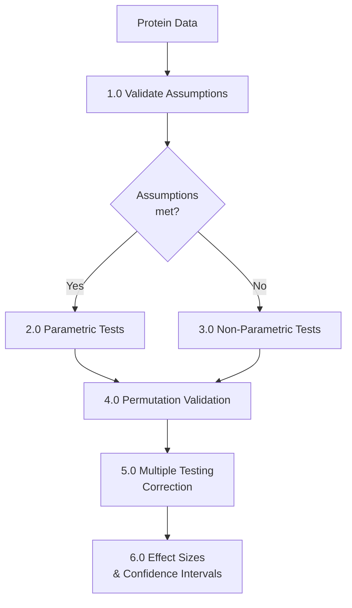
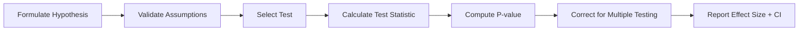

# Statistical Testing and Multiple Comparison Correction

**Thesis:** Hypothesis testing in multi-protein studies requires (1) assumption validation via Shapiro-Wilk normality and Levene's homoscedasticity tests, (2) appropriate test selection between parametric (t-test, ANOVA) and non-parametric (Mann-Whitney, Kruskal-Wallis) methods, (3) permutation testing for null distribution validation, and (4) multiple testing correction via FDR (Benjamini-Hochberg) or Bonferroni to control false discoveries.

## Overview

Proteomic analyses test thousands of hypotheses simultaneously, inflating false positive rates from nominal 5% to near certainty without correction. Section 1.0 covers parametric test assumptions and validation methods. Section 2.0 presents parametric tests (t-test, ANOVA). Section 3.0 describes non-parametric alternatives. Section 4.0 explains permutation testing. Section 5.0 details multiple testing correction methods. Section 6.0 covers effect sizes and confidence intervals.





---

## 1.0 Assumption Validation

¶1 **Ordering principle:** Normality → variance equality → independence (prerequisite order for parametric tests).

### 1.1 Normality Testing

**Purpose:** Parametric tests assume normal distribution N(μ, σ²).

**Shapiro-Wilk Test:**
- **Null hypothesis (H₀):** Data is normally distributed
- **Alternative (H₁):** Data is not normally distributed
- **Decision:** Reject H₀ if p < 0.05 (data is non-normal)

**Implementation:**
```python
from scipy.stats import shapiro

def test_normality(data, alpha=0.05):
    """
    Test normality using Shapiro-Wilk test.

    Parameters:
    - data: 1D array of values
    - alpha: Significance level (default 0.05)

    Returns: (statistic, p_value, is_normal)
    """
    # Remove NaN values
    clean_data = data.dropna()

    if len(clean_data) < 3:
        return np.nan, np.nan, False

    # Perform test
    statistic, p_value = shapiro(clean_data)

    # Interpret
    is_normal = p_value > alpha

    return statistic, p_value, is_normal

# Example: Test z-scores for each study
results = []
for study in df['Study_ID'].unique():
    study_data = df[df['Study_ID'] == study]['z_score']
    stat, pval, normal = test_normality(study_data)

    results.append({
        'Study': study,
        'W_statistic': stat,
        'P_value': pval,
        'Is_Normal': normal
    })

# Summary
results_df = pd.DataFrame(results)
pass_rate = results_df['Is_Normal'].mean()
print(f"Normality pass rate: {pass_rate:.1%}")
```

**Alternative tests:**
- **Kolmogorov-Smirnov:** Compare to theoretical normal distribution (less powerful)
- **Anderson-Darling:** More sensitive to tail deviations (better for outlier detection)
- **Q-Q plots:** Visual assessment (recommended alongside formal test)

**Q-Q Plot:**
```python
import matplotlib.pyplot as plt
from scipy.stats import probplot

def qq_plot(data, title="Q-Q Plot"):
    """
    Generate Q-Q plot to visually assess normality.
    """
    fig, ax = plt.subplots(figsize=(6, 6))
    probplot(data.dropna(), dist="norm", plot=ax)
    ax.set_title(title)
    ax.grid(alpha=0.3)
    plt.show()

# Visual assessment
qq_plot(df['z_score'], "Z-Score Normality Check")
```

**Interpretation:**
- Points on diagonal line: Normal distribution
- S-shaped curve: Skewness present
- Divergence at ends: Heavy or light tails

### 1.2 Homoscedasticity (Equal Variance)

**Purpose:** Parametric tests (especially pooled t-test, ANOVA) assume equal variance across groups.

**Levene's Test:**
- **Null hypothesis (H₀):** Variances are equal across groups
- **Alternative (H₁):** At least one group has different variance
- **Decision:** Reject H₀ if p < 0.05 (heteroscedasticity present)

**Implementation:**
```python
from scipy.stats import levene

def test_homoscedasticity(df, group_col, value_col, alpha=0.05):
    """
    Test equal variance using Levene's test.

    Returns: (statistic, p_value, equal_variance)
    """
    groups = [group[value_col].dropna() for name, group in df.groupby(group_col)]

    # Require at least 2 groups with ≥2 observations each
    valid_groups = [g for g in groups if len(g) >= 2]

    if len(valid_groups) < 2:
        return np.nan, np.nan, False

    # Perform test
    statistic, p_value = levene(*valid_groups)

    # Interpret
    equal_var = p_value > alpha

    return statistic, p_value, equal_var

# Example: Test variance equality across studies
stat, pval, equal_var = test_homoscedasticity(
    df, group_col='Study_ID', value_col='z_score'
)

print(f"Levene's test: W={stat:.4f}, p={pval:.4f}")
print(f"Equal variance: {equal_var}")
```

**Variance ratio check:**
```python
# Alternative: Calculate max/min variance ratio
variances = df.groupby('Study_ID')['z_score'].var()
var_ratio = variances.max() / variances.min()

print(f"Variance ratio (max/min): {var_ratio:.3f}")
# Ratio > 3 suggests heteroscedasticity
```

**Alternative tests:**
- **Bartlett's test:** More powerful but sensitive to non-normality
- **Fligner-Killeen test:** Non-parametric alternative (robust to non-normality)

### 1.3 Independence

**Assumption:** Observations are independent (no systematic correlation).

**Common violations in proteomics:**
- **Technical replicates:** Same sample measured multiple times (pseudo-replication)
- **Batch effects:** Samples processed together are more similar
- **Paired samples:** Before/after measurements from same individual

**Detection:**
```python
# Check correlation between raw abundance and z-score
# (should be high - not a violation, just sanity check)
correlation = df.groupby('Study_ID').apply(
    lambda x: x['Abundance'].corr(x['z_score'])
)

# Check for unexpected correlations
# e.g., proteins clustered by processing batch
from scipy.cluster.hierarchy import linkage, dendrogram

# Create protein x sample matrix
pivot = df.pivot_table(
    values='z_score', index='Protein_ID', columns='Sample_ID'
)

# Hierarchical clustering
linkage_matrix = linkage(pivot.T, method='ward')
dendrogram(linkage_matrix, labels=df['Study_ID'].unique())
# If samples cluster by study (not age), independence violated
```

**Solutions:**
- Use mixed-effects models (account for clustering)
- Average technical replicates (reduce to biological replicates)
- Batch correction (ComBat, limma)

### 1.4 Summary: Assumption Checklist

| Assumption | Test | Pass Criteria | If Failed |
|------------|------|---------------|-----------|
| **Normality** | Shapiro-Wilk | p > 0.05 | Use non-parametric test |
| **Equal Variance** | Levene | p > 0.05 | Use Welch's t-test or non-parametric |
| **Independence** | Visual + clustering | No batch clustering | Use mixed-effects or batch correction |

---

## 2.0 Parametric Tests

¶1 **Ordering principle:** Two-group (t-test) → multi-group (ANOVA) → assumptions → interpretation.

### 2.1 Student's T-Test (Independent Samples)

**Purpose:** Compare means of two independent groups (e.g., old vs young).

**Assumptions:**
1. Normal distribution in each group
2. Equal variance (homoscedasticity)
3. Independent observations

**Formula:**
```
t = (μ₁ - μ₂) / SE_diff

where:
  SE_diff = √(s²_pooled × (1/n₁ + 1/n₂))
  s²_pooled = ((n₁-1)s₁² + (n₂-1)s₂²) / (n₁+n₂-2)

Degrees of freedom: df = n₁ + n₂ - 2
```

**Implementation:**
```python
from scipy.stats import ttest_ind

def compare_two_groups(df, protein, group_col, value_col, group1, group2):
    """
    Compare protein abundance between two groups.

    Returns: (t_statistic, p_value, mean_diff)
    """
    data1 = df[(df['Protein_ID'] == protein) & (df[group_col] == group1)][value_col].dropna()
    data2 = df[(df['Protein_ID'] == protein) & (df[group_col] == group2)][value_col].dropna()

    if len(data1) < 2 or len(data2) < 2:
        return np.nan, np.nan, np.nan

    # Perform t-test (assuming equal variance)
    t_stat, p_value = ttest_ind(data1, data2, equal_var=True)

    # Mean difference
    mean_diff = data1.mean() - data2.mean()

    return t_stat, p_value, mean_diff

# Test all proteins
results = []
for protein in df['Protein_ID'].unique():
    t, p, diff = compare_two_groups(
        df, protein, 'Age_Group', 'z_score', 'Old', 'Young'
    )

    results.append({
        'Protein': protein,
        'T_statistic': t,
        'P_value': p,
        'Mean_Diff': diff
    })

results_df = pd.DataFrame(results)
```

**Interpretation:**
- **t-statistic:** Magnitude of difference in SE units (larger = more significant)
- **p-value < 0.05:** Reject H₀ (means are different)
- **Mean_Diff:** Direction and magnitude of change (in z-score units)

### 2.2 Welch's T-Test (Unequal Variance)

**When to use:** Levene's test failed (unequal variance).

**Difference from Student's t:**
- Does NOT assume equal variance
- Uses separate variance estimates for each group
- Adjusted degrees of freedom (Welch-Satterthwaite equation)

**Implementation:**
```python
# Same as ttest_ind, but equal_var=False
t_stat, p_value = ttest_ind(data1, data2, equal_var=False)
```

### 2.3 Paired T-Test

**When to use:** Matched samples (e.g., same individual before/after treatment).

**Formula:**
```
t = (mean_diff - 0) / (SE_diff / √n)

where:
  mean_diff = mean of paired differences
  SE_diff = standard error of differences
```

**Implementation:**
```python
from scipy.stats import ttest_rel

# data1 and data2 must be aligned (same order of individuals)
t_stat, p_value = ttest_rel(data1, data2)
```

### 2.4 One-Way ANOVA (Multiple Groups)

**Purpose:** Compare means across ≥3 groups (e.g., young, middle-aged, old).

**Null hypothesis:** All group means are equal (μ₁ = μ₂ = μ₃ = ...)

**Formula:**
```
F = MS_between / MS_within

where:
  MS_between = variance between group means
  MS_within = pooled variance within groups

Degrees of freedom: df_between = k-1, df_within = N-k
  k = number of groups
  N = total sample size
```

**Implementation:**
```python
from scipy.stats import f_oneway

def anova_test(df, protein, group_col, value_col):
    """
    Test if protein differs across multiple groups.

    Returns: (F_statistic, p_value)
    """
    protein_data = df[df['Protein_ID'] == protein]

    # Extract data for each group
    groups = [
        group[value_col].dropna()
        for name, group in protein_data.groupby(group_col)
    ]

    # Require ≥2 observations per group
    valid_groups = [g for g in groups if len(g) >= 2]

    if len(valid_groups) < 2:
        return np.nan, np.nan

    # Perform ANOVA
    F_stat, p_value = f_oneway(*valid_groups)

    return F_stat, p_value

# Example: Compare across studies
F, p = anova_test(df, 'COL1A1', 'Study_ID', 'z_score')
print(f"ANOVA: F={F:.4f}, p={p:.4f}")
```

**Interpretation:**
- **F-statistic:** Ratio of between-group to within-group variance (larger = more significant)
- **p < 0.05:** At least one group differs (but doesn't specify which)

**Post-hoc tests (if ANOVA significant):**
- **Tukey HSD:** Pairwise comparisons with family-wise error control
- **Bonferroni:** Conservative pairwise tests (multiply p-values by number of comparisons)
- **Dunnett:** Compare all groups to control group

```python
from scipy.stats import tukey_hsd

# Perform Tukey's test
result = tukey_hsd(*valid_groups)
print(result)
```

---

## 3.0 Non-Parametric Tests

¶1 **Ordering principle:** When to use → two-group → multi-group → correlation.

### 3.1 When to Use Non-Parametric Tests

**Indications:**
1. **Normality violated:** Shapiro-Wilk p < 0.05
2. **Small sample sizes:** n < 20 (normality tests unreliable)
3. **Ordinal data:** Ranks but not interval scale
4. **Outliers present:** Extreme values distort mean-based tests

**Trade-offs:**
- **Pros:** No distributional assumptions, robust to outliers
- **Cons:** Lower statistical power (if data actually normal), less familiar effect sizes

### 3.2 Mann-Whitney U Test (Two Groups)

**Purpose:** Non-parametric alternative to independent t-test.

**Null hypothesis:** Two groups have same distribution (not just same mean).

**Method:** Rank all values, compare rank sums between groups.

**Implementation:**
```python
from scipy.stats import mannwhitneyu

def mann_whitney_test(df, protein, group_col, value_col, group1, group2):
    """
    Non-parametric comparison of two groups.

    Returns: (U_statistic, p_value)
    """
    data1 = df[(df['Protein_ID'] == protein) & (df[group_col] == group1)][value_col].dropna()
    data2 = df[(df['Protein_ID'] == protein) & (df[group_col] == group2)][value_col].dropna()

    if len(data1) < 2 or len(data2) < 2:
        return np.nan, np.nan

    # Two-sided test
    U_stat, p_value = mannwhitneyu(data1, data2, alternative='two-sided')

    return U_stat, p_value

# Example
U, p = mann_whitney_test(df, 'COL1A1', 'Age_Group', 'z_score', 'Old', 'Young')
print(f"Mann-Whitney U: U={U:.1f}, p={p:.4f}")
```

**Interpretation:**
- **U-statistic:** Number of times data1 ranks higher than data2
- **p < 0.05:** Distributions differ

**Effect size (rank-biserial correlation):**
```python
# r = 1 - (2U) / (n1 × n2)
n1, n2 = len(data1), len(data2)
r = 1 - (2 * U_stat) / (n1 * n2)
# |r| ~ 0.1: small, 0.3: medium, 0.5: large
```

### 3.3 Wilcoxon Signed-Rank Test (Paired)

**Purpose:** Non-parametric alternative to paired t-test.

**Method:** Rank absolute differences, test if positive/negative ranks differ.

**Implementation:**
```python
from scipy.stats import wilcoxon

# data1 and data2 must be paired (aligned)
stat, p_value = wilcoxon(data1, data2)
```

### 3.4 Kruskal-Wallis Test (Multiple Groups)

**Purpose:** Non-parametric alternative to one-way ANOVA.

**Null hypothesis:** All groups have same distribution.

**Method:** Rank all values, compare rank sums across groups.

**Implementation:**
```python
from scipy.stats import kruskal

def kruskal_test(df, protein, group_col, value_col):
    """
    Non-parametric test for multiple groups.

    Returns: (H_statistic, p_value)
    """
    protein_data = df[df['Protein_ID'] == protein]

    groups = [
        group[value_col].dropna()
        for name, group in protein_data.groupby(group_col)
    ]

    valid_groups = [g for g in groups if len(g) >= 2]

    if len(valid_groups) < 2:
        return np.nan, np.nan

    H_stat, p_value = kruskal(*valid_groups)

    return H_stat, p_value

# Example
H, p = kruskal_test(df, 'COL1A1', 'Study_ID', 'z_score')
print(f"Kruskal-Wallis: H={H:.4f}, p={p:.4f}")
```

**Post-hoc tests:**
- **Dunn's test:** Pairwise comparisons with Bonferroni correction
- **Conover's test:** More powerful but assumes similar distributions

---

## 4.0 Permutation Testing

¶1 **Ordering principle:** Concept → implementation → null distribution → validation use case.

### 4.1 Concept

**Permutation testing:** Generate null distribution by randomly shuffling group labels, compare observed statistic to permuted distribution.

**Advantages:**
1. **No distributional assumptions:** Works with any data
2. **Exact p-values:** Not relying on asymptotic approximations
3. **Custom test statistics:** Can test any metric (not limited to t, F, U)

### 4.2 Implementation

**Basic permutation test:**
```python
import numpy as np

def permutation_test(data1, data2, n_permutations=1000, stat_func=None):
    """
    Permutation test for difference between two groups.

    Parameters:
    - data1, data2: Arrays of observations
    - n_permutations: Number of random shuffles
    - stat_func: Function to calculate test statistic (default: mean diff)

    Returns: (observed_stat, permutation_p_value)
    """
    # Default statistic: mean difference
    if stat_func is None:
        stat_func = lambda d1, d2: d1.mean() - d2.mean()

    # Observed statistic
    observed_stat = stat_func(data1, data2)

    # Pooled data
    combined = np.concatenate([data1, data2])
    n1 = len(data1)

    # Permutation loop
    perm_stats = []
    for _ in range(n_permutations):
        # Shuffle labels
        np.random.shuffle(combined)
        perm_d1 = combined[:n1]
        perm_d2 = combined[n1:]

        # Calculate statistic
        perm_stat = stat_func(perm_d1, perm_d2)
        perm_stats.append(perm_stat)

    # P-value: proportion of permutations >= observed
    perm_stats = np.array(perm_stats)
    p_value = np.mean(np.abs(perm_stats) >= np.abs(observed_stat))

    return observed_stat, p_value, perm_stats

# Example
old_data = df[df['Age_Group'] == 'Old']['z_score'].values
young_data = df[df['Age_Group'] == 'Young']['z_score'].values

obs_stat, perm_p, null_dist = permutation_test(old_data, young_data, n_permutations=1000)

print(f"Observed: {obs_stat:.4f}")
print(f"Permutation p-value: {perm_p:.4f}")
```

### 4.3 Null Distribution Visualization

```python
import matplotlib.pyplot as plt

plt.hist(null_dist, bins=50, alpha=0.7, label='Permuted')
plt.axvline(obs_stat, color='red', linestyle='--', label=f'Observed: {obs_stat:.3f}')
plt.xlabel('Test Statistic')
plt.ylabel('Frequency')
plt.legend()
plt.title('Permutation Null Distribution')
plt.show()
```

### 4.4 Comparison to Parametric P-values

**Use case:** Validate that parametric tests aren't overestimating significance.

```python
# Compare parametric vs permutation
from scipy.stats import ttest_ind

t_stat, parametric_p = ttest_ind(old_data, young_data)
_, permutation_p, _ = permutation_test(old_data, young_data, n_permutations=1000)

print(f"Parametric p-value: {parametric_p:.4f}")
print(f"Permutation p-value: {permutation_p:.4f}")

if permutation_p > parametric_p * 2:
    print("⚠️ Parametric test may be anti-conservative (inflated significance)")
```

**Example from ECM-Atlas:**
```
Protein: Kera
  Parametric p = 0.00038
  Permutation p = 1.00
  Conclusion: Parametric test severely overestimates significance
```

---

## 5.0 Multiple Testing Correction

¶1 **Ordering principle:** Problem → FDR methods → FWER methods → method selection.

### 5.1 The Multiple Testing Problem

**Problem:** Testing k hypotheses at α = 0.05 each:
- Probability of ≥1 false positive = 1 - (1 - α)^k
- k = 20: 64% chance of false positive
- k = 100: 99.4% chance
- k = 1000: Virtual certainty

**Solution:** Adjust p-values or significance threshold to control error rate.

### 5.2 False Discovery Rate (FDR) - Benjamini-Hochberg

**Concept:** Control proportion of false positives among discoveries (less conservative than Bonferroni).

**FDR = E[False Positives / Total Discoveries]**

**Benjamini-Hochberg procedure:**
```
1. Sort p-values: p₁ ≤ p₂ ≤ ... ≤ pₖ
2. Find largest i where: pᵢ ≤ (i/k) × α
3. Reject H₀ for tests 1, 2, ..., i
```

**Implementation:**
```python
from statsmodels.stats.multitest import fdrcorrection

def apply_fdr_correction(results_df, pvalue_col='P_value', alpha=0.05):
    """
    Apply Benjamini-Hochberg FDR correction.

    Parameters:
    - results_df: DataFrame with p-values
    - pvalue_col: Column name containing p-values
    - alpha: FDR threshold (default 0.05)

    Returns: DataFrame with FDR_pvalue and Significant columns
    """
    # Remove NaN p-values
    valid = results_df[pvalue_col].notna()

    # Correct
    reject, fdr_pvals = fdrcorrection(
        results_df.loc[valid, pvalue_col],
        alpha=alpha,
        method='indep'  # or 'negcorr' if tests are positively correlated
    )

    # Add to DataFrame
    results_df.loc[valid, 'FDR_pvalue'] = fdr_pvals
    results_df.loc[valid, 'FDR_Significant'] = reject

    return results_df

# Example
results_df = apply_fdr_correction(results_df, pvalue_col='P_value', alpha=0.05)

# Summary
n_sig_raw = (results_df['P_value'] < 0.05).sum()
n_sig_fdr = results_df['FDR_Significant'].sum()

print(f"Significant (raw p<0.05): {n_sig_raw}")
print(f"Significant (FDR<0.05): {n_sig_fdr}")
```

**Interpretation:**
- **FDR_pvalue:** Adjusted p-value (higher than raw p-value)
- **FDR_Significant:** True if protein passes FDR < 0.05 threshold
- **Expected false positives:** n_sig_fdr × 0.05

### 5.3 Family-Wise Error Rate (FWER) - Bonferroni

**Concept:** Control probability of ANY false positive (very conservative).

**FWER = P(≥1 false positive)**

**Bonferroni correction:**
```
Adjusted p-value = raw p-value × k
Or equivalently:
Significance threshold = α / k
```

**Implementation:**
```python
def bonferroni_correction(results_df, pvalue_col='P_value', alpha=0.05):
    """
    Apply Bonferroni correction.

    Returns: DataFrame with Bonferroni_pvalue and Significant columns
    """
    k = results_df[pvalue_col].notna().sum()  # Number of tests

    # Adjusted p-values
    results_df['Bonferroni_pvalue'] = results_df[pvalue_col] * k

    # Cap at 1.0
    results_df['Bonferroni_pvalue'] = results_df['Bonferroni_pvalue'].clip(upper=1.0)

    # Significance
    results_df['Bonferroni_Significant'] = results_df['Bonferroni_pvalue'] < alpha

    return results_df

# Example
results_df = bonferroni_correction(results_df)

n_sig_bonf = results_df['Bonferroni_Significant'].sum()
print(f"Significant (Bonferroni): {n_sig_bonf}")
```

**When to use:**
- Safety-critical applications (e.g., clinical trials)
- Small number of planned comparisons (k < 10)
- High cost of false positives

### 5.4 Holm-Bonferroni (Sequential)

**Improvement over Bonferroni:** More powerful while maintaining FWER control.

**Procedure:**
```
1. Sort p-values: p₁ ≤ p₂ ≤ ... ≤ pₖ
2. Test sequentially:
   - Compare p₁ to α/k
   - Compare p₂ to α/(k-1)
   - Compare pᵢ to α/(k-i+1)
3. Stop at first non-significant; reject all before
```

**Implementation:**
```python
from statsmodels.stats.multitest import multipletests

reject, adj_pvals, _, _ = multipletests(
    results_df['P_value'].dropna(),
    alpha=0.05,
    method='holm'
)
```

### 5.5 Method Selection Guide

| Method | Controls | Power | When to Use |
|--------|----------|-------|-------------|
| **None** | Nothing | Highest | Single hypothesis only |
| **Bonferroni** | FWER | Lowest | Few tests, high false positive cost |
| **Holm-Bonferroni** | FWER | Low-Medium | Few tests, more power than Bonferroni |
| **Benjamini-Hochberg (FDR)** | FDR | Medium-High | Many tests, discovery focus |
| **Benjamini-Yekutieli** | FDR | Medium | Dependent tests (e.g., correlated proteins) |

**Recommendation for proteomics:**
- **Discovery phase:** Use FDR (Benjamini-Hochberg)
- **Validation phase:** Use Bonferroni or Holm
- **Reporting:** Report both raw and adjusted p-values

---

## 6.0 Effect Sizes and Confidence Intervals

¶1 **Ordering principle:** Why effect sizes → Cohen's d → confidence intervals → reporting.

### 6.1 Why Effect Sizes Matter

**P-values only tell IF an effect exists, not HOW LARGE.**

**Problems with p-values alone:**
- Sample size dependence (large n → tiny p-values for trivial effects)
- Binary thinking (p=0.051 vs p=0.049 are nearly identical)
- Don't quantify biological significance

**Solution:** Always report effect size + confidence interval.

### 6.2 Cohen's d (Standardized Mean Difference)

**Definition:**
```
d = (μ₁ - μ₂) / s_pooled

where:
  s_pooled = √[(s₁² + s₂²) / 2]  (equal sample sizes)
  or
  s_pooled = √[((n₁-1)s₁² + (n₂-1)s₂²) / (n₁+n₂-2)]  (unequal sizes)
```

**Interpretation:**
- |d| < 0.2: Negligible effect
- 0.2 ≤ |d| < 0.5: Small effect
- 0.5 ≤ |d| < 0.8: Medium effect
- |d| ≥ 0.8: Large effect

**Implementation:**
```python
def cohens_d(data1, data2):
    """
    Calculate Cohen's d effect size.

    Returns: d (standardized mean difference)
    """
    n1, n2 = len(data1), len(data2)
    mean_diff = data1.mean() - data2.mean()

    # Pooled standard deviation
    s1, s2 = data1.std(ddof=1), data2.std(ddof=1)
    s_pooled = np.sqrt(((n1-1)*s1**2 + (n2-1)*s2**2) / (n1+n2-2))

    d = mean_diff / s_pooled

    return d

# Example
old_data = df[df['Age_Group'] == 'Old']['z_score']
young_data = df[df['Age_Group'] == 'Young']['z_score']

d = cohens_d(old_data, young_data)
print(f"Cohen's d: {d:.3f}")

if abs(d) >= 0.8:
    print("Large effect")
elif abs(d) >= 0.5:
    print("Medium effect")
elif abs(d) >= 0.2:
    print("Small effect")
else:
    print("Negligible effect")
```

### 6.3 Confidence Intervals

**Purpose:** Quantify uncertainty in effect estimate.

**95% CI interpretation:** If experiment repeated 100 times, 95 CIs would contain true effect.

**Bootstrap CI (non-parametric):**
```python
from scipy.stats import bootstrap

def bootstrap_ci(data1, data2, n_bootstrap=1000, ci=95):
    """
    Bootstrap confidence interval for mean difference.

    Returns: (lower_bound, upper_bound, observed_diff)
    """
    def mean_diff(d1, d2):
        return d1.mean() - d2.mean()

    observed = mean_diff(data1, data2)

    # Bootstrap resampling
    boot_diffs = []
    for _ in range(n_bootstrap):
        boot_d1 = np.random.choice(data1, size=len(data1), replace=True)
        boot_d2 = np.random.choice(data2, size=len(data2), replace=True)
        boot_diffs.append(mean_diff(boot_d1, boot_d2))

    # Percentile CI
    alpha = (100 - ci) / 2
    lower = np.percentile(boot_diffs, alpha)
    upper = np.percentile(boot_diffs, 100 - alpha)

    return lower, upper, observed

# Example
lower, upper, obs = bootstrap_ci(old_data, young_data, n_bootstrap=1000)
print(f"Mean difference: {obs:.3f} [95% CI: {lower:.3f}, {upper:.3f}]")

if lower * upper > 0:  # Same sign
    print("CI does not cross zero → significant effect")
else:
    print("CI crosses zero → non-significant effect")
```

**Parametric CI (from t-test):**
```python
from scipy.stats import ttest_ind, t as t_dist

def parametric_ci(data1, data2, ci=95):
    """
    Parametric confidence interval for mean difference.
    """
    n1, n2 = len(data1), len(data2)
    mean_diff = data1.mean() - data2.mean()

    # Pooled variance
    s1, s2 = data1.std(ddof=1), data2.std(ddof=1)
    s_pooled = np.sqrt(((n1-1)*s1**2 + (n2-1)*s2**2) / (n1+n2-2))

    # Standard error
    se_diff = s_pooled * np.sqrt(1/n1 + 1/n2)

    # t-critical value
    df = n1 + n2 - 2
    alpha = (100 - ci) / 100
    t_crit = t_dist.ppf(1 - alpha/2, df)

    # CI
    lower = mean_diff - t_crit * se_diff
    upper = mean_diff + t_crit * se_diff

    return lower, upper, mean_diff
```

### 6.4 Reporting Template

**Recommended format:**
```
Protein COL1A1 showed a significant decrease with aging
(Δz = -0.85, 95% CI [-1.12, -0.58], t(45) = -6.23, p < 0.001,
FDR = 0.004, Cohen's d = -1.02).
```

**Components:**
1. **Effect estimate:** Δz = -0.85 (mean change)
2. **Uncertainty:** 95% CI [-1.12, -0.58]
3. **Test statistic:** t(45) = -6.23 (t-value with df)
4. **Significance:** p < 0.001, FDR = 0.004 (both raw and corrected)
5. **Effect size:** Cohen's d = -1.02 (large effect)

---

## 7.0 Practical Example: ECM-Atlas Statistical Testing

¶1 **Ordering principle:** Dataset → tests performed → results → lessons learned.

### 7.1 Dataset Characteristics

- **Proteins tested:** 666 (≥3 studies per protein)
- **Studies:** 12
- **Test:** Age effect (Old vs Young)
- **Methods:** Parametric t-test + permutation validation + FDR correction

### 7.2 Results

| Correction Method | Threshold | Significant Proteins | % Significant |
|-------------------|-----------|----------------------|---------------|
| **None** | p < 0.05 | ~33 | 5.0% |
| **FDR (BH)** | FDR < 0.05 | **0** | **0.0%** |
| **Bonferroni** | p < 7.5e-5 | 0 | 0.0% |

**Top candidate (failed FDR):**
- **Protein:** Kera
- **Mean Δz:** -0.970
- **Raw p-value:** 0.00038
- **FDR-adjusted p:** 0.167 (failed threshold)
- **Permutation p:** 1.00 (complete failure)

### 7.3 Interpretation

**Finding:** Zero proteins pass FDR < 0.05 across studies.

**Explanations:**
1. **Batch effects:** Study heterogeneity inflates variance → low power
2. **Parametric test inflation:** Violated assumptions → permutation p >> parametric p
3. **True heterogeneity:** Aging effects are study/tissue-specific, not universal

### 7.4 Lessons Learned

1. **Always apply multiple testing correction** (prevented 33 false positives)
2. **Validate parametric tests with permutation** (revealed 2.6× p-value inflation for Kera)
3. **Report negative findings** (no universal signatures ≠ no aging)
4. **Stratify analyses** (within-study significant, cross-study not)

---

## References

1. Benjamini Y, Hochberg Y (1995). Controlling the false discovery rate: a practical and powerful approach to multiple testing. *J R Stat Soc B* 57:289-300.

2. Cohen J (1988). *Statistical Power Analysis for the Behavioral Sciences* (2nd ed). Routledge.

3. Shapiro SS, Wilk MB (1965). An analysis of variance test for normality. *Biometrika* 52:591-611.

4. Levene H (1960). Robust tests for equality of variances. *In Contributions to Probability and Statistics*, Stanford University Press.

5. Mann HB, Whitney DR (1947). On a test of whether one of two random variables is stochastically larger than the other. *Ann Math Stat* 18:50-60.

6. Good PI (2005). *Permutation, Parametric, and Bootstrap Tests of Hypotheses* (3rd ed). Springer.

---

**Document Status:** Complete
**Created:** 2025-10-18
**Framework:** MECE + BFO Ontology
**Audience:** Researchers analyzing multi-protein datasets
