# 📋 Knowledge Framework: Documentation Standards (Minto + MECE + DRY)

**Core Principle:** Write documentation like code - fractal structure where each abstraction level is complete, MECE-organized, with zero redundancy.

```mermaid
graph TD
    Thesis[1 Sentence Thesis] --> Overview[1 Paragraph Overview]
    Overview --> Diagrams[Mermaid Diagrams]

    Diagrams --> ContinuantDiagram[Continuant TD: Structure]
    Diagrams --> OccurrentDiagram[Occurrent LR: Process]
    Diagrams --> ParticipationDiagram[Participation: Optional]

    ContinuantDiagram --> Sections[3-7 MECE Sections]
    OccurrentDiagram --> Sections

    Sections --> Details[Fractal Details with ¶1, ¶2, ¶3]
```

**Ontological Rule:** TD for Continuants (what exists), LR for Occurrents (what happens)

### 🎯 4 Pillars
 - Dont be verbose!!! Yuo must Use minimum text and tokens as possible!!!!, but enought for another AI agent or human to execute task or understand document. 
- Minto - from Top to Down. 
- **MECE (Mutually Exclusive, Collectively Exhaustive):** Sections don't overlap, but cover everything. 
- Mermaid - quick vusual explanation of core concepts. 
- **Fractal:** Each level mirrors the whole - subsections follow same 1-sentence → mermaid diagrams(1 or 3 if complex) - 1-paragraph → details pattern
- **DRY:** Each fact appears exactly ONCE. Reference, don't duplicate

(try not to use to much, mice, fractal, dry in the doc it self. this is our internal terms, and docs context should fodun on "the subject" not metdata about how ot crate docs. )

### 📐 Structure Rules
- **Thesis:** Specific outcome with who/what/when - must preview your MECE sections structure
- **Overview Paragraph:** Expands thesis AND introduces each MECE section (like function docs listing parameters)
- **Sections (1.0, 2.0, 3.0):** Number all sections and subsections (1.1, 1.2). Order by: importance, logical flow, or chronology
- **Paragraph Numbering:** Within sections, number paragraphs (¶1, ¶2, ¶3). Sort by: general→specific, problem→solution, or setup→action→result
- **Ordering Principle (¶1 explains this):** State your ordering logic upfront - readers should understand why content appears in this sequence
- **Fractal Depth:** Each subsection starts with its own 1-sentence thesis, then expands only if needed
- **Coherence:** If sections are Planning→Execution→Monitoring, thesis must mention all three

### 🔄 Finding True MECE Structure
**Core Rule:** Look for the NATURAL structure of your content, don't force a template

**🧬 BFO Ontology (Highest Level):** Use formal ontology categories to separate WHAT EXISTS from WHAT HAPPENS:

¶1 **Continuants (Things that exist):**
- Exist fully at any moment in time
- Examples: database tables, API endpoints, user roles, configuration files
- Mermaid: Use `graph TD` (top-down hierarchy)
- Sections: Named by nouns (1.0 Data Model, 2.0 System Components)

¶2 **Occurrents (Things that happen):**
- Unfold across time; have beginning, middle, end
- Examples: data pipeline execution, API request flow, deployment process
- Mermaid: Use `graph LR` (left-right sequence)
- Sections: Named by verbs/processes (1.0 Setup, 2.0 Execute, 3.0 Validate)

¶3 **Independent vs Dependent Continuants:**
- Independent: Can exist alone (server, database)
- Dependent: Needs host (configuration needs server, schema needs database)
- Use for nested hierarchies in TD diagrams

¶4 **Material vs Immaterial Continuants:**
- Material: Physical entities (hardware, infrastructure)
- Immaterial: Information entities (data, schemas, algorithms)

**📊 Practical Structures:**
- **Temporal Process?** → Occurrent: 1.0 Setup → 2.0 Execution → 3.0 Cleanup
- **System Architecture?** → Continuant: 1.0 Data Layer → 2.0 Logic Layer → 3.0 Presentation
- **Decision Document?** → Mixed: 1.0 Problem (Continuant) → 2.0 Options → 3.0 Solution
- **Analysis?** → Mixed: 1.0 Data (Continuant) → 2.0 Methods (Occurrent) → 3.0 Results

**Key:** BFO ensures your categories reflect reality's actual structure. The TRUE structure makes the document write itself.

### 🎨 Mermaid Ontological Patterns (MANDATORY)

¶1 **Why Two Diagrams Minimum:**
- **Ontological completeness:** Every domain has BOTH structure (what exists) AND behavior (what happens)
- **Cognitive clarity:** Mixing "system architecture" with "process flow" in ONE diagram creates confusion
- **MECE enforcement:** Separate diagrams prevent mixing Continuants with Occurrents
- **Rule:** Complex documents REQUIRE both Continuant (TD) and Occurrent (LR) diagrams

¶2 **Continuant Diagram (Structure/Architecture):**
- **Type:** `graph TD` (top-down hierarchy)
- **Shows:** System components, data models, organizational structure, dependencies
- **Nodes:** NOUNS (Database, API, User, Table, Service)
- **Edges:** "contains", "depends on", "is part of", "inherits from"
- **Example use cases:** System architecture, data schema, component hierarchy

¶3 **Occurrent Diagram (Process/Flow):**
- **Type:** `graph LR` (left-right sequence)
- **Shows:** Workflows, pipelines, request flows, temporal sequences
- **Nodes:** VERBS or process states (Extract, Transform, Load, Validate)
- **Edges:** "then", "triggers", "flows to", temporal ordering
- **Example use cases:** Data pipeline, API request flow, deployment process

¶4 **Participation Diagram (How Continuants participate in Occurrents) - OPTIONAL:**
- **Type:** `graph TD` or `graph LR` depending on emphasis
- **Shows:** Which entities (Continuants) are involved in which processes (Occurrents)
- **Pattern:** Entity nodes + Process nodes, edges show "participates in", "executes", "produces"
- **Use when:** Need to show both WHAT and HOW (e.g., "User triggers Pipeline which updates Database")

### 🧭 Mermaid Enforcement Rules

¶1 **Mandatory Diagram Gate:**
- Every document MUST include minimum ONE Mermaid diagram at top-level overview
- Complex documents (system specs, architecture docs) REQUIRE BOTH Continuant (TD) and Occurrent (LR) diagrams
- See §"🎨 Mermaid Ontological Patterns" for selection guide

¶2 **Placement:**
- **Primary diagrams:** Directly after Overview paragraph, before Section 1.0
- **Secondary diagrams:** Within sections to illustrate complex subsystems or sub-processes
- **Order:** If both present, show Continuant (structure) BEFORE Occurrent (process)

¶3 **Size and Labeling:**
- **Node count:** 5–12 nodes per diagram; if more, split into multiple diagrams
- **Labels:** Short (1-3 words); nouns for Continuants, verbs for Occurrents
- **Edges:** Label only when relationship is not obvious from context

¶4 **DRY Principle:**
- One diagram per abstraction level
- Deeper sections get smaller, focused diagrams
- Never duplicate information between diagrams - reference parent diagram instead

### ✅ Author Checklist (paste at document end and tick