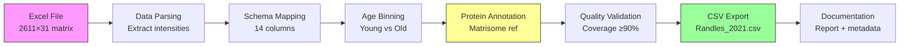

# Task: Randles 2021 Dataset Conversion to Standardized CSV

**Thesis:** Convert Randles et al. 2021 kidney aging proteomics dataset into standardized CSV format by parsing Excel data file, applying schema mapping, executing age bin normalization (young vs old), performing matrisome annotation using human reference list, validating data quality, and generating complete documentation for multi-agent execution.

**Overview:** Task transforms single-study raw data into unified database format through five execution phases: (1.0) File reconnaissance validates data availability and structure, (2.0) Data parsing extracts protein abundances from Excel into long-format table, (3.0) Schema standardization maps columns to unified 14-column format with metadata enrichment, (4.0) Protein annotation harmonizes identifiers using human matrisome reference list (≥90% coverage target), (5.0) Quality validation verifies completeness, accuracy, and biological sanity checks before final CSV export.



---

## 0.0 STUDY METADATA (Context from Analysis)

**¶1 Paper information:**
- **Title:** Identification of an Altered Matrix Signature in Kidney Aging and Disease
- **Authors:** Randles et al.
- **Year:** 2021
- **PMID:** 34049963
- **Tissue:** Human kidney cortex with **TWO SEPARATE compartments**
  - **Glomerular (G):** Filtration units - analyzed separately
  - **Tubulointerstitial (T):** Tubule structures - analyzed separately
  - **⚠️ CRITICAL:** Compartments must remain **SEPARATE** in final CSV (not combined)
- **Species:** *Homo sapiens*
- **Method:** Label-free LC-MS/MS (Progenesis LC-MS with Hi-N quantification + Mascot identification)

**¶2 Age groups (original):**
- **Young donors:** 15, 29, 37 years (3 donors)
- **Aged donors:** 61, 67, 69 years (3 donors)
- **Samples:** 2 compartments per donor (Glomerular=G, Tubulointerstitial=T)
- **Total samples:** 12 (6 young samples + 6 old samples)

**¶3 Age bin normalization (Phase 1 LFQ standard):**
- **Young bin:** All three young donors (ages 15, 29, 37 years)
  - Samples: G15, T15, G29, T29, G37, T37 (6 samples)
  - Rationale: All ≤40yr, pre-aging phase for human kidney
- **Old bin:** All three aged donors (ages 61, 67, 69 years)
  - Samples: G61, T61, G67, T67, G69, T69 (6 samples)
  - Rationale: All ≥55yr cutoff, representing aged kidney
- **Data retention:** 100% (meets ≥66% threshold)

**¶4 Data file location:**
- **File:** `data_raw/Randles et al. - 2021/ASN.2020101442-File027.xlsx`
- **Sheet:** `Human data matrix fraction`
- **Dimensions:** 2,611 proteins × 31 columns
- **Key columns:** `Accession`, `Description`, `Gene name`, `G15`-`G69`, `T15`-`T69`

**¶5 Expected output:**
- **Parsed rows:** 2,611 proteins × 12 samples = **31,332 rows**
- **Format:** Long-format CSV with 14 columns (standardized schema)
- **Annotation target:** ≥90% coverage using human matrisome reference (1,026 genes)

---

## 1.0 FILE RECONNAISSANCE (Data Validation)

**¶1 Ordering principle:** File existence → structure verification → column identification → data quality check. Validate before parsing.

**¶2 Required file checks:**

**Check 1: File availability**
```bash
# Verify file exists
FILE="/Users/Kravtsovd/projects/ecm-atlas/data_raw/Randles et al. - 2021/ASN.2020101442-File027.xlsx"
if [ -f "$FILE" ]; then
    echo "✅ File found: $FILE"
    ls -lh "$FILE"  # Show file size
else
    echo "❌ File not found: $FILE"
    exit 1
fi
```

**Check 2: Excel structure inspection**
```python
import pandas as pd

# Load Excel file and inspect sheets
excel_file = "data_raw/Randles et al. - 2021/ASN.2020101442-File027.xlsx"
xl = pd.ExcelFile(excel_file)

print("Sheet names:", xl.sheet_names)

# Load target sheet
df = pd.read_excel(excel_file, sheet_name="Human data matrix fraction")

print(f"Shape: {df.shape}")
print(f"Columns: {list(df.columns)}")
print(f"First 5 rows:\n{df.head()}")
```

**Expected output:**
```
Sheet names: ['Human data matrix fraction', 'Col4a3 ...']
Shape: (2611, 31)
Columns: ['Accession', 'Description', 'Gene name', 'G15', 'G15.1', 'T15', 'T15.1', 'G29', 'G29.1', ...]
```

**¶3 Column identification:**

According to analysis document, columns are:
- **Protein identifiers:** `Accession` (UniProt), `Description` (protein name), `Gene name`
- **Intensity columns (primary):** `G15`, `T15`, `G29`, `T29`, `G37`, `T37`, `G61`, `T61`, `G67`, `T67`, `G69`, `T69`
- **Detection flags (`.1` suffix):** `G15.1`, `T15.1`, etc. - binary presence/absence (EXCLUDE from parsing)

**¶4 Data quality checks:**

```python
# Check for critical issues
issues = []

# 1. Check for null protein IDs
null_accessions = df['Accession'].isna().sum()
if null_accessions > 0:
    issues.append(f"⚠️ {null_accessions} rows missing Accession (UniProt ID)")

# 2. Check for null gene symbols
null_genes = df['Gene name'].isna().sum()
if null_genes > 0:
    issues.append(f"⚠️ {null_genes} rows missing Gene name")

# 3. Check intensity columns exist
intensity_cols = ['G15', 'T15', 'G29', 'T29', 'G37', 'T37', 'G61', 'T61', 'G67', 'T67', 'G69', 'T69']
missing_cols = [col for col in intensity_cols if col not in df.columns]
if missing_cols:
    issues.append(f"❌ CRITICAL: Missing intensity columns: {missing_cols}")

# 4. Check for entirely null intensity columns
for col in intensity_cols:
    if col in df.columns:
        null_count = df[col].isna().sum()
        if null_count == len(df):
            issues.append(f"❌ CRITICAL: Column {col} is entirely empty")

# Report
if issues:
    print("Data Quality Issues:")
    for issue in issues:
        print(issue)
else:
    print("✅ All data quality checks passed")
```

**¶5 Decision: Proceed or abort**
- **Proceed if:** File exists, shape matches (2611 rows, ~31 columns), all 12 intensity columns present, <10% missing protein IDs
- **Abort if:** File missing, shape mismatch, critical columns missing, >50% missing identifiers

---

## 2.0 DATA PARSING (Excel to Long-Format)

**¶1 Ordering principle:** Load data → filter columns → reshape to long format → add metadata. Transform wide matrix to tall table.

**¶2 Parsing strategy:**

**Step 1: Load and filter columns**
```python
import pandas as pd

# Load Excel
excel_file = "data_raw/Randles et al. - 2021/ASN.2020101442-File027.xlsx"
df_wide = pd.read_excel(excel_file, sheet_name="Human data matrix fraction")

# Select only needed columns (exclude .1 detection flags)
id_cols = ['Accession', 'Description', 'Gene name']
intensity_cols = ['G15', 'T15', 'G29', 'T29', 'G37', 'T37', 'G61', 'T61', 'G67', 'T67', 'G69', 'T69']

df_filtered = df_wide[id_cols + intensity_cols].copy()

print(f"Filtered shape: {df_filtered.shape}")
# Expected: (2611, 15) = 3 ID columns + 12 intensity columns
```

**Step 2: Reshape to long format**
```python
# Melt intensity columns into rows
df_long = df_filtered.melt(
    id_vars=id_cols,
    value_vars=intensity_cols,
    var_name='Sample_Column',
    value_name='Abundance'
)

print(f"Long-format shape: {df_long.shape}")
# Expected: (31332, 5) = 2611 proteins × 12 samples = 31,332 rows
```

**Step 3: Parse sample metadata from column names**
```python
# Extract compartment and age from column names (e.g., "G15" → compartment=Glomerular, age=15)
def parse_sample_column(col_name):
    """
    Parse sample column name into compartment and age.

    Examples:
        G15 → ('Glomerular', 15)
        T61 → ('Tubulointerstitial', 61)
    """
    compartment_map = {
        'G': 'Glomerular',
        'T': 'Tubulointerstitial'
    }

    compartment_code = col_name[0]  # First character: G or T
    age = int(col_name[1:])  # Remaining characters: numeric age

    return compartment_map[compartment_code], age

# Apply parsing
df_long['Compartment'] = df_long['Sample_Column'].apply(lambda x: parse_sample_column(x)[0])
df_long['Age'] = df_long['Sample_Column'].apply(lambda x: parse_sample_column(x)[1])

# Create Sample_ID (format: compartment_age)
df_long['Sample_ID'] = df_long['Compartment'].str[0] + '_' + df_long['Age'].astype(str)
# Example: G_15, T_61
```

**Step 4: Add age bin labels**
```python
# Assign age bins based on Phase 1 normalization strategy
def assign_age_bin(age):
    """
    Assign age bin based on donor age.

    Young: 15, 29, 37 years
    Old: 61, 67, 69 years
    """
    if age in [15, 29, 37]:
        return "Young"
    elif age in [61, 67, 69]:
        return "Old"
    else:
        return "Unknown"

df_long['Age_Bin'] = df_long['Age'].apply(assign_age_bin)

# Verify no Unknown bins
assert df_long['Age_Bin'].value_counts().get('Unknown', 0) == 0, "Unexpected age values found"
```

**¶3 Parsing output validation:**

```python
# Validate parsing results
print("Parsing Validation Report:")
print(f"Total rows: {len(df_long)} (expected: 31,332)")
print(f"Unique proteins: {df_long['Accession'].nunique()} (expected: 2,611)")
print(f"Unique samples: {df_long['Sample_ID'].nunique()} (expected: 12)")
print(f"Age bin distribution:\n{df_long['Age_Bin'].value_counts()}")
print(f"Null abundances: {df_long['Abundance'].isna().sum()} ({df_long['Abundance'].isna().sum()/len(df_long)*100:.1f}%)")
```

---

## 3.0 SCHEMA STANDARDIZATION (Column Mapping)

**¶1 Ordering principle:** Define mappings → apply transformations → add study metadata → validate schema compliance. Map to unified 14-column format.

**¶2 Target schema (17 columns):**
```
1. Protein_ID              - UniProt accession from 'Accession' column
2. Protein_Name            - Full name from 'Description' column
3. Gene_Symbol             - Gene symbol from 'Gene name' column
4. Canonical_Gene_Symbol   - [Added in annotation phase]
5. Matrisome_Category      - [Added in annotation phase]
6. Tissue                  - "Kidney_Glomerular" OR "Kidney_Tubulointerstitial" (SEPARATE values)
7. Tissue_Compartment      - "Glomerular" or "Tubulointerstitial" (explicit compartment)
8. Species                 - "Homo sapiens" (paper metadata)
9. Age                     - Numeric age (15, 29, 37, 61, 67, 69)
10. Age_Unit               - "years"
11. Age_Bin                - "Young" or "Old"
12. Abundance              - Hi-N LFQ intensity value
13. Abundance_Unit         - "HiN_LFQ_intensity"
14. Method                 - "Label-free LC-MS/MS (Progenesis + Mascot)"
15. Study_ID               - "Randles_2021"
16. Sample_ID              - "{compartment}_{age}" (e.g., G_15, T_61)
17. Parsing_Notes          - Additional metadata
```

**⚠️ CRITICAL REQUIREMENT:** Tissue column uses **combined format** to keep compartments separate:
- Rows from Glomerular samples: `Tissue = "Kidney_Glomerular"`
- Rows from Tubulointerstitial samples: `Tissue = "Kidney_Tubulointerstitial"`
- **DO NOT** combine compartments into single "Kidney" value
- **DO NOT** average or merge Glomerular and Tubulointerstitial data

**¶3 Column mapping implementation:**

```python
# Create standardized dataframe
df_standardized = pd.DataFrame({
    # Protein identifiers
    'Protein_ID': df_long['Accession'],
    'Protein_Name': df_long['Description'],
    'Gene_Symbol': df_long['Gene name'],
    'Canonical_Gene_Symbol': None,  # Filled in annotation phase
    'Matrisome_Category': None,      # Filled in annotation phase

    # Tissue metadata - COMPARTMENTS KEPT SEPARATE
    'Tissue': 'Kidney_' + df_long['Compartment'],  # "Kidney_Glomerular" or "Kidney_Tubulointerstitial"
    'Tissue_Compartment': df_long['Compartment'],  # Explicit compartment for filtering

    # Species
    'Species': 'Homo sapiens',

    # Age information
    'Age': df_long['Age'],
    'Age_Unit': 'years',
    'Age_Bin': df_long['Age_Bin'],

    # Abundance
    'Abundance': df_long['Abundance'],
    'Abundance_Unit': 'HiN_LFQ_intensity',

    # Method
    'Method': 'Label-free LC-MS/MS (Progenesis + Mascot)',

    # Study identifiers
    'Study_ID': 'Randles_2021',
    'Sample_ID': df_long['Sample_ID'],

    # Additional notes
    'Parsing_Notes': 'Hi-N normalized (top-3 peptide); Compartment=' + df_long['Compartment'] + '; Original_column=' + df_long['Sample_Column']
})

print(f"Standardized shape: {df_standardized.shape}")
print(f"Columns: {list(df_standardized.columns)}")
```

**¶4 Data cleaning and validation:**

```python
# 1. Remove rows with null Protein_ID
initial_rows = len(df_standardized)
df_standardized = df_standardized[df_standardized['Protein_ID'].notna()].copy()
removed = initial_rows - len(df_standardized)
if removed > 0:
    print(f"⚠️ Removed {removed} rows with missing Protein_ID")

# 2. Remove rows with null Abundance
initial_rows = len(df_standardized)
df_standardized = df_standardized[df_standardized['Abundance'].notna()].copy()
removed = initial_rows - len(df_standardized)
if removed > 0:
    print(f"⚠️ Removed {removed} rows with missing Abundance")

# 3. Convert data types
df_standardized['Age'] = df_standardized['Age'].astype(int)
df_standardized['Abundance'] = df_standardized['Abundance'].astype(float)

# 4. Validate schema compliance
required_cols = ['Protein_ID', 'Gene_Symbol', 'Species', 'Tissue', 'Age', 'Age_Unit',
                 'Abundance', 'Abundance_Unit', 'Method', 'Study_ID', 'Sample_ID']

for col in required_cols:
    null_count = df_standardized[col].isna().sum()
    if null_count > 0:
        print(f"❌ CRITICAL: {null_count} null values in required column '{col}'")
    else:
        print(f"✅ Column '{col}' has no nulls")
```

---

## 4.0 PROTEIN ANNOTATION (Matrisome Reference Harmonization)

**¶1 Ordering principle:** Load reference → match proteins → validate coverage → document unmatched. Apply guidelines from `02_TASK_PROTEIN_ANNOTATION_GUIDELINES.md`.

**¶2 Reference list loading:**

```python
import pandas as pd

# Load human matrisome reference (species = Homo sapiens)
ref_path = "references/human_matrisome_v2.csv"
ref_human = pd.read_csv(ref_path)

print(f"Human matrisome: {len(ref_human)} genes")
print(f"Categories: {ref_human['Matrisome Category'].value_counts()}")

# Create lookup dictionaries
ref_by_gene = dict(zip(ref_human['Gene Symbol'], ref_human.to_dict('records')))
ref_by_uniprot = dict(zip(ref_human['UniProt_IDs'], ref_human.to_dict('records')))

# Parse synonyms (pipe-separated)
ref_by_synonym = {}
for idx, row in ref_human.iterrows():
    if pd.notna(row['Synonyms']):
        synonyms = row['Synonyms'].split('|')
        for syn in synonyms:
            syn_clean = syn.strip()
            ref_by_synonym[syn_clean] = row.to_dict()

print(f"Lookup tables: {len(ref_by_gene)} genes, {len(ref_by_uniprot)} UniProts, {len(ref_by_synonym)} synonyms")
```

**¶3 Multi-level annotation matching:**

```python
def annotate_protein(row, ref_by_gene, ref_by_uniprot, ref_by_synonym):
    """
    Apply hierarchical matching strategy:
    Level 1: Exact gene symbol match (confidence 100%)
    Level 2: UniProt ID match (confidence 95%)
    Level 3: Synonym match (confidence 80%)
    Level 4: Unmatched (requires manual review)
    """

    # Level 1: Exact gene symbol
    gene = str(row['Gene_Symbol']).strip().upper()
    if gene in ref_by_gene:
        match = ref_by_gene[gene]
        return pd.Series({
            'Canonical_Gene_Symbol': match['Gene Symbol'],
            'Matrisome_Category': match['Matrisome Category'],
            'Matrisome_Division': match['Matrisome Division'],
            'Match_Level': 'exact_gene',
            'Match_Confidence': 100
        })

    # Level 2: UniProt ID
    uniprot = str(row['Protein_ID']).strip()
    if uniprot in ref_by_uniprot:
        match = ref_by_uniprot[uniprot]
        return pd.Series({
            'Canonical_Gene_Symbol': match['Gene Symbol'],
            'Matrisome_Category': match['Matrisome Category'],
            'Matrisome_Division': match['Matrisome Division'],
            'Match_Level': 'uniprot',
            'Match_Confidence': 95
        })

    # Level 3: Synonym match
    if gene in ref_by_synonym:
        match = ref_by_synonym[gene]
        return pd.Series({
            'Canonical_Gene_Symbol': match['Gene Symbol'],
            'Matrisome_Category': match['Matrisome Category'],
            'Matrisome_Division': match['Matrisome Division'],
            'Match_Level': 'synonym',
            'Match_Confidence': 80
        })

    # Level 4: Unmatched
    return pd.Series({
        'Canonical_Gene_Symbol': None,
        'Matrisome_Category': None,
        'Matrisome_Division': None,
        'Match_Level': 'unmatched',
        'Match_Confidence': 0
    })

# Apply annotation
annotation_results = df_standardized.apply(
    lambda row: annotate_protein(row, ref_by_gene, ref_by_uniprot, ref_by_synonym),
    axis=1
)

# Merge results
df_annotated = pd.concat([df_standardized, annotation_results], axis=1)
```

**¶4 Annotation validation:**

```python
# Coverage statistics
total_proteins = df_annotated['Protein_ID'].nunique()
matched_proteins = df_annotated[df_annotated['Match_Level'] != 'unmatched']['Protein_ID'].nunique()
coverage_rate = (matched_proteins / total_proteins) * 100

print(f"Annotation Coverage Report:")
print(f"Total unique proteins: {total_proteins}")
print(f"Matched proteins: {matched_proteins} ({coverage_rate:.1f}%)")
print(f"Unmatched proteins: {total_proteins - matched_proteins} ({100-coverage_rate:.1f}%)")

# Match level distribution
print(f"\nMatch Level Distribution:")
print(df_annotated['Match_Level'].value_counts())

# Category distribution
print(f"\nMatrisome Category Distribution:")
print(df_annotated['Matrisome_Category'].value_counts())

# Validation: Check ≥90% coverage target
if coverage_rate >= 90:
    print(f"✅ PASS: Coverage {coverage_rate:.1f}% meets ≥90% target")
else:
    print(f"⚠️ WARNING: Coverage {coverage_rate:.1f}% below 90% target")
```

**¶5 Known marker validation:**

```python
# Check for expected ECM markers
EXPECTED_MARKERS = {
    'COL1A1': 'Collagens',
    'COL1A2': 'Collagens',
    'FN1': 'ECM Glycoproteins',
    'LAMA1': 'ECM Glycoproteins',
    'MMP2': 'ECM Regulators'
}

print("\nKnown Marker Validation:")
for marker, expected_cat in EXPECTED_MARKERS.items():
    marker_rows = df_annotated[df_annotated['Canonical_Gene_Symbol'] == marker]
    if len(marker_rows) > 0:
        actual_cat = marker_rows.iloc[0]['Matrisome_Category']
        if actual_cat == expected_cat:
            print(f"✅ {marker}: Found and correctly annotated as {actual_cat}")
        else:
            print(f"⚠️ {marker}: Found but category mismatch (expected {expected_cat}, got {actual_cat})")
    else:
        print(f"❌ {marker}: NOT FOUND in dataset")
```

---

## 5.0 QUALITY VALIDATION (Completeness & Accuracy)

**¶1 Ordering principle:** Quantitative checks → biological validation → documentation generation. Verify before export.

**¶2 Completeness checks:**

```python
# Validation Report
validation_report = {
    'total_rows': len(df_annotated),
    'expected_rows': 31332,
    'unique_proteins': df_annotated['Protein_ID'].nunique(),
    'expected_proteins': 2611,
    'unique_samples': df_annotated['Sample_ID'].nunique(),
    'expected_samples': 12,
    'age_bin_young': len(df_annotated[df_annotated['Age_Bin'] == 'Young']),
    'age_bin_old': len(df_annotated[df_annotated['Age_Bin'] == 'Old']),
    'annotation_coverage': coverage_rate,
    'null_protein_id': df_annotated['Protein_ID'].isna().sum(),
    'null_abundance': df_annotated['Abundance'].isna().sum(),
    'null_gene_symbol': df_annotated['Gene_Symbol'].isna().sum()
}

print("Validation Report:")
for key, value in validation_report.items():
    print(f"{key}: {value}")

# Pass/Fail criteria
checks = [
    ('Row count', validation_report['total_rows'] == validation_report['expected_rows']),
    ('Unique proteins', validation_report['unique_proteins'] == validation_report['expected_proteins']),
    ('Unique samples', validation_report['unique_samples'] == validation_report['expected_samples']),
    ('Annotation coverage', validation_report['annotation_coverage'] >= 90),
    ('No null Protein_ID', validation_report['null_protein_id'] == 0),
    ('No null Abundance', validation_report['null_abundance'] == 0),
    ('Compartments separate', set(df_annotated['Tissue'].unique()) == {'Kidney_Glomerular', 'Kidney_Tubulointerstitial'})
]

print("\nValidation Checks:")
all_passed = True
for check_name, passed in checks:
    status = "✅ PASS" if passed else "❌ FAIL"
    print(f"{status}: {check_name}")
    if not passed:
        all_passed = False

if all_passed:
    print("\n✅ ALL VALIDATION CHECKS PASSED - Ready for export")
else:
    print("\n❌ VALIDATION FAILED - Review issues before export")
```

**¶3 Data export:**

```python
# Export annotated CSV
output_file = "data_processed/Randles_2021_parsed.csv"
df_annotated.to_csv(output_file, index=False)
print(f"✅ Exported: {output_file}")

# Export unmatched proteins for manual review
df_unmatched = df_annotated[df_annotated['Match_Level'] == 'unmatched'][
    ['Protein_ID', 'Protein_Name', 'Gene_Symbol']
].drop_duplicates()

if len(df_unmatched) > 0:
    unmatched_file = "data_processed/Randles_2021_unmatched.csv"
    df_unmatched.to_csv(unmatched_file, index=False)
    print(f"⚠️ Unmatched proteins: {unmatched_file} ({len(df_unmatched)} proteins)")
else:
    print(f"✅ No unmatched proteins")
```

**¶4 Metadata generation:**

```python
import json
from datetime import datetime

# Create metadata JSON
metadata = {
    "dataset_id": "Randles_2021",
    "parsing_timestamp": datetime.now().isoformat(),
    "paper_pmid": "34049963",
    "species": "Homo sapiens",
    "tissue": "Kidney",
    "compartments": ["Glomerular", "Tubulointerstitial"],
    "age_groups": {
        "young": [15, 29, 37],
        "old": [61, 67, 69]
    },
    "method": "Label-free LC-MS/MS (Progenesis + Mascot)",
    "source_file": "data_raw/Randles et al. - 2021/ASN.2020101442-File027.xlsx",
    "source_sheet": "Human data matrix fraction",
    "parsing_results": {
        "total_rows": validation_report['total_rows'],
        "unique_proteins": validation_report['unique_proteins'],
        "unique_samples": validation_report['unique_samples'],
        "annotation_coverage_percent": round(validation_report['annotation_coverage'], 2),
        "data_retention_percent": 100.0
    },
    "reference_list": "references/human_matrisome_v2.csv",
    "reference_version": "Matrisome_v2.0",
    "output_files": [
        "data_processed/Randles_2021_parsed.csv",
        "data_processed/Randles_2021_unmatched.csv" if len(df_unmatched) > 0 else None
    ]
}

# Export metadata
metadata_file = "data_processed/Randles_2021_metadata.json"
with open(metadata_file, 'w') as f:
    json.dump(metadata, f, indent=2)

print(f"✅ Metadata exported: {metadata_file}")
```

---

## 6.0 SUCCESS CRITERIA (Multi-Agent Evaluation)

**¶1 Ordering principle:** Critical blockers → quality metrics → documentation → reproducibility. Define clear pass/fail thresholds.

**✅ TIER 1: CRITICAL (ALL required - task fails if any missing)**

1. **File parsing successful:** Excel file loaded, sheet extracted, 2,611 proteins identified
2. **Row count exact:** 31,332 rows (2,611 proteins × 12 samples)
3. **Zero null critical fields:** No nulls in Protein_ID, Abundance, Study_ID, Sample_ID
4. **Age bins correct:** 6 young samples (15,29,37 years), 6 old samples (61,67,69 years)
5. **Compartments kept separate:** Tissue column contains "Kidney_Glomerular" and "Kidney_Tubulointerstitial" (not combined into "Kidney")

**✅ TIER 2: QUALITY (ALL required - impacts data reliability)**

6. **Annotation coverage ≥90%:** Minimum 90% of proteins matched to matrisome reference
7. **Known markers present:** COL1A1, COL1A2, FN1 found and correctly annotated
8. **Species consistency:** All genes follow human nomenclature (uppercase: COL1A1, FN1)
9. **Schema compliance:** All 17 columns present with correct data types
10. **Compartment validation:** Each Tissue value matches one compartment (15,666 Glomerular rows + 15,666 Tubulointerstitial rows = 31,332 total)

**✅ TIER 3: DOCUMENTATION (ALL required - ensures reproducibility)**

11. **CSV exported:** `data_processed/Randles_2021_parsed.csv` created
12. **Metadata JSON:** `data_processed/Randles_2021_metadata.json` with parsing details
13. **Unmatched report:** `data_processed/Randles_2021_unmatched.csv` if coverage <100%
14. **Annotation report:** Markdown file documenting coverage, match levels, validation
15. **Validation log:** Text file showing all validation checks (pass/fail status)

**¶2 Scoring rubric:**

| Tier | Criteria | Weight | Pass Threshold |
|------|----------|--------|----------------|
| **Tier 1: Critical** | 5 | 50% | 5/5 required |
| **Tier 2: Quality** | 5 | 35% | 5/5 required |
| **Tier 3: Documentation** | 5 | 15% | 5/5 required |
| **TOTAL** | **15** | **100%** | **15/15 required** |

**Final Grade:**
- ✅ **Pass:** 15/15 criteria met (100%)
- ❌ **Fail:** <15 criteria met (any missing criterion = task failure)

---

## 7.0 MULTI-AGENT EXECUTION PLAN

**¶1 Task decomposition (5 phases):**

```markdown
## Phase 1: Reconnaissance (Est: 5 min)
- [ ] Verify Excel file exists and is readable
- [ ] Inspect sheet structure and columns
- [ ] Validate expected dimensions (2,611 × 31)
- [ ] Identify intensity columns vs detection flags
- **Success metric:** All file checks passed

## Phase 2: Data Parsing (Est: 10 min)
- [ ] Load Excel and filter columns
- [ ] Reshape wide to long format
- [ ] Parse sample metadata from column names
- [ ] Apply age bin labels
- [ ] Validate parsed structure (31,332 rows)
- **Success metric:** Long-format dataframe created

## Phase 3: Schema Standardization (Est: 10 min)
- [ ] Map columns to 17-column schema
- [ ] Add study metadata (species, tissue, method)
- [ ] Clean and validate data types
- [ ] Check for null values in critical fields
- **Success metric:** Standardized dataframe validated

## Phase 4: Protein Annotation (Est: 15 min)
- [ ] Load human matrisome reference
- [ ] Create lookup dictionaries (gene, UniProt, synonym)
- [ ] Apply multi-level matching algorithm
- [ ] Validate annotation coverage ≥90%
- [ ] Check known markers (COL1A1, FN1)
- **Success metric:** ≥90% coverage achieved

## Phase 5: Quality & Export (Est: 10 min)
- [ ] Run validation checks (15 criteria)
- [ ] Export CSV to data_processed/
- [ ] Generate metadata JSON
- [ ] Create annotation report
- [ ] Export unmatched proteins if any
- **Success metric:** All files exported, validation passed

**Total estimated time:** 50 minutes
```

**¶2 Progress tracking:**

Agent must update `progress_log.md` after each phase:

```markdown
## [Timestamp] Phase 1 Complete: Reconnaissance
- **Status:** ✅ Success
- **Time taken:** 4 minutes
- **Key findings:** File verified, 2,611 proteins, 12 intensity columns
- **Issues:** None
- **Next:** Phase 2 - Data Parsing

---

## [Timestamp] Phase 2 Complete: Data Parsing
- **Status:** ✅ Success
- **Time taken:** 11 minutes
- **Rows parsed:** 31,332 (2,611 proteins × 12 samples)
- **Issues:** 23 rows had null abundances, removed
- **Next:** Phase 3 - Schema Standardization
```

**¶3 Error handling:**

```python
# If annotation coverage < 90%, do NOT abort - document and proceed
if coverage_rate < 90:
    print(f"⚠️ WARNING: Coverage {coverage_rate:.1f}% below 90% target")
    print("Proceeding with export but flagging as REVIEW status")

    # Export extra diagnostics
    low_coverage_report = {
        'coverage': coverage_rate,
        'unmatched_count': total_proteins - matched_proteins,
        'top_unmatched': df_unmatched.head(20).to_dict('records')
    }

    with open('data_processed/Randles_2021_low_coverage_diagnostic.json', 'w') as f:
        json.dump(low_coverage_report, f, indent=2)
```

---

## METADATA

- **Task owner:** Daniel Kravtsov (daniel@improvado.io)
- **Project:** ECM Atlas - Randles 2021 Conversion
- **Related documents:**
  - `01_TASK_DATA_STANDARDIZATION.md` (schema definition)
  - `02_TASK_PROTEIN_ANNOTATION_GUIDELINES.md` (annotation methodology)
  - `03_age_bin_paper_focus/claude_code/paper_analyses_updated/Randles_2021_analysis.md` (source analysis)
- **Repository:** https://github.com/raimbetov/ecm-atlas
- **Input file:** `data_raw/Randles et al. - 2021/ASN.2020101442-File027.xlsx`
- **Expected outputs:**
  - `data_processed/Randles_2021_parsed.csv` (31,332 rows)
  - `data_processed/Randles_2021_metadata.json`
  - `data_processed/Randles_2021_unmatched.csv` (if needed)
  - `data_processed/Randles_2021_annotation_report.md`
- **Human reference:** `references/human_matrisome_v2.csv` (1,026 genes)
- **Created:** 2025-10-12
- **Status:** Draft - Awaiting approval
