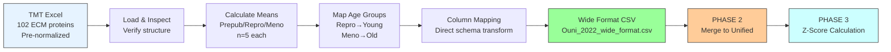

# Task: Ouni 2022 TMT Dataset Processing to Standardized CSV

**Thesis:** Convert Ouni et al. 2022 human ovarian cortex aging proteomics dataset (TMTpro 16-plex) into standardized wide-format CSV file through simple column mapping and age group transformation, leveraging pre-processed normalized data and existing ECM annotations.

**Overview:** Task transforms TMT-labeled proteomic data into unified wide-format schema through lightweight adapter script: (1.0) Load pre-normalized quantile-normalized TMT reporter intensities from Supp Table 3, (2.0) Map three age groups (prepubertal, reproductive, menopausal) to binary Young/Old comparison, (3.0) Calculate mean abundances across biological replicates, (4.0) Apply direct column mapping to unified 15-column schema with preserved ECM classifications, (5.0) Export wide-format CSV ready for Phase 2 merge and Phase 3 z-score normalization.

**⚠️ TMT vs LFQ Key Differences:**
- **Data already normalized:** Quantile normalization applied by authors (no raw intensity parsing needed)
- **ECM classification done:** Category and Division columns pre-annotated (no matrisome matching required)
- **Simple transformation:** Column renaming and mean calculation only (no complex parsing logic)
- **Processing time:** ~15 minutes (vs ~2-4 hours for LFQ datasets)



---

## 0.0 STUDY METADATA

**¶1 Paper information:**
- **Title:** Proteome-wide and matrisome-specific atlas of the human ovary computes fertility biomarker candidates and opens the way for precision oncofertility
- **Authors:** Ouni et al.
- **Year:** 2022
- **PMID:** 35341935
- **Tissue:** Human ovarian cortex (soluble + insoluble ECM fractions)
- **Species:** *Homo sapiens*
- **Method:** DC-MaP + TMTpro 16-plex LC-MS/MS

**¶2 Age groups (original):**
- **Prepubertal:** 7±3 years (n=5 biological replicates)
- **Reproductive age:** 26±5 years (n=5 biological replicates)
- **Menopausal:** 59±8 years (n=5 biological replicates)
- **Total samples:** 15 (3 age groups × 5 replicates)

**¶3 Age group mapping for ECM Atlas (Young/Old binary):**
- **Young bin:** Reproductive age (26±5 years, n=5) - Standard adult reproductive phase
- **Old bin:** Menopausal (59±8 years, n=5) - Post-reproductive aging
- **Rationale:** Reproductive vs menopausal comparison aligns with other human aging studies in ECM Atlas
- **Excluded:** Prepubertal group (developmental phase, not aging)
- **Age gap:** 33 years

**¶4 Data file location:**
- **File:** `data_raw/Ouni et al. - 2022/Supp Table 3.xlsx`
- **Sheet:** `Matrisome Proteins` (102 rows × 33 columns)
- **Key columns:**
  - ECM classification: `Category`, `Division` (already annotated by authors)
  - Protein identifiers: `Accession` (UniProt), `EntryName`, `EntryGeneSymbol`
  - TMT intensities: `Q. Norm. of TOT_prepub1-5`, `TOT_repro1-5`, `TOT_meno1-5`
  - Quality metrics: `Sum PEP Score`, `Coverage [%]`, `# Peptides`, `# PSMs`

**¶5 Expected output:**
- **Wide-format CSV:** 102 rows (all matrisome proteins from authors' analysis)
- **Format:** 15-column unified schema (Protein_ID, Gene_Symbol, Tissue, Abundance_Young, Abundance_Old, etc.)
- **NO z-scores:** Z-scores calculated later in Phase 3 on unified atlas
- **Processing time:** ~15 minutes (simple transformation)

---

## 1.0 TMT ADAPTER SCRIPT

**¶1 Ordering principle:** Load data → Calculate means → Map age groups → Transform schema → Export CSV

**¶2 Script implementation:**

File: `tmt_adapter_ouni2022.py`

**Key features:**
1. **No complex parsing:** Data already in clean tabular format
2. **No ECM annotation:** Category/Division pre-annotated by authors (Match_Level=1, Confidence=100)
3. **Simple aggregation:** Mean across 5 replicates per age group
4. **Direct mapping:** Column renaming to unified schema

**Processing steps:**
```python
# 1. Load pre-normalized TMT data
df = pd.read_excel('../../data_raw/Ouni et al. - 2022/Supp Table 3.xlsx',
                   sheet_name='Matrisome Proteins')

# 2. Define sample columns
prepub_cols = ['Q. Norm. of TOT_prepub1', ..., 'TOT_prepub5']  # n=5
repro_cols = ['Q. Norm. of TOT_repro1', ..., 'TOT_repro5']      # n=5
meno_cols = ['Q. Norm. of TOT_meno1', ..., 'TOT_meno5']        # n=5

# 3. Calculate means
df['Abundance_Prepubertal'] = df[prepub_cols].mean(axis=1)
df['Abundance_Reproductive'] = df[repro_cols].mean(axis=1)
df['Abundance_Menopausal'] = df[meno_cols].mean(axis=1)

# 4. Map to Young/Old
df['Abundance_Young'] = df['Abundance_Reproductive']  # 26±5 years
df['Abundance_Old'] = df['Abundance_Menopausal']      # 59±8 years

# 5. Transform to unified schema
df_wide = pd.DataFrame({
    'Protein_ID': df['Accession'],
    'Protein_Name': df['EntryName'],
    'Gene_Symbol': df['EntryGeneSymbol'],
    'Canonical_Gene_Symbol': df['EntryGeneSymbol'],  # Already canonical
    'Matrisome_Category': df['Category'],            # Pre-annotated
    'Matrisome_Division': df['Division'],            # Pre-annotated
    'Tissue': 'Ovary_Cortex',
    'Tissue_Compartment': 'Cortex',
    'Species': 'Homo sapiens',
    'Abundance_Young': df['Abundance_Young'],
    'Abundance_Old': df['Abundance_Old'],
    'Method': 'DC-MaP + TMTpro 16-plex',
    'Study_ID': 'Ouni_2022',
    'Match_Level': 1,      # ECM classification by authors
    'Match_Confidence': 100.0
})

# 6. Export
df_wide.to_csv('Ouni_2022_wide_format.csv', index=False)
```

---

## 2.0 EXECUTION

**¶1 Run adapter script:**

```bash
cd 05_papers_to_csv/08_Ouni_2022_paper_to_csv
python3 tmt_adapter_ouni2022.py
```

**Expected output:**
```
================================================================================
TMT Adapter for Ouni et al. 2022
================================================================================

[1/6] Loading TMT data from: ../../data_raw/Ouni et al. - 2022/Supp Table 3.xlsx
   ✓ Loaded 102 matrisome proteins
   ✓ Shape: (102, 33)

[2/6] Identifying TMT sample columns...
   ✓ Prepubertal samples (n=5): Q. Norm. of TOT_prepub1 ... TOT_prepub5
   ✓ Reproductive samples (n=5): Q. Norm. of TOT_repro1 ... TOT_repro5
   ✓ Menopausal samples (n=5): Q. Norm. of TOT_meno1 ... TOT_meno5

[3/6] Calculating mean abundances per age group...
   ✓ Prepubertal mean: 155.80 (range: 26.21-354.40)
   ✓ Reproductive mean: 156.41 (range: 42.60-388.05)
   ✓ Menopausal mean: 156.37 (range: 23.83-366.04)

[4/6] Mapping age groups to Young/Old...
   Strategy: Reproductive (26±5 years) = Young
            Menopausal (59±8 years) = Old

[5/6] Mapping to unified schema...
   ✓ Created wide format with 102 rows
   ✓ Missing values: Young=4, Old=4

[6/6] Saving wide format to: Ouni_2022_wide_format.csv
   ✓ Saved successfully!
```

**¶2 Verify output:**

```bash
# Check file structure
head -n 5 Ouni_2022_wide_format.csv

# Expected columns (15 total):
# Protein_ID, Protein_Name, Gene_Symbol, Canonical_Gene_Symbol,
# Matrisome_Category, Matrisome_Division, Tissue, Tissue_Compartment,
# Species, Abundance_Young, Abundance_Old, Method, Study_ID,
# Match_Level, Match_Confidence

# Row count
wc -l Ouni_2022_wide_format.csv
# Expected: 103 (102 proteins + 1 header)
```

---

## 3.0 QUALITY VALIDATION

**¶1 Validation checks:**

```python
import pandas as pd

df = pd.read_csv('Ouni_2022_wide_format.csv')

# Check 1: Row count
assert len(df) == 102, f"Expected 102 rows, got {len(df)}"
print("✅ Row count: 102 proteins")

# Check 2: All columns present
required_cols = ['Protein_ID', 'Protein_Name', 'Gene_Symbol',
                 'Canonical_Gene_Symbol', 'Matrisome_Category',
                 'Matrisome_Division', 'Tissue', 'Tissue_Compartment',
                 'Species', 'Abundance_Young', 'Abundance_Old',
                 'Method', 'Study_ID', 'Match_Level', 'Match_Confidence']
assert list(df.columns) == required_cols
print("✅ All 15 columns present")

# Check 3: No null Protein_IDs
assert df['Protein_ID'].notna().all()
print("✅ No null Protein_IDs")

# Check 4: Species consistency
assert (df['Species'] == 'Homo sapiens').all()
print("✅ Species: Homo sapiens")

# Check 5: Tissue consistency
assert (df['Tissue'] == 'Ovary_Cortex').all()
print("✅ Tissue: Ovary_Cortex")

# Check 6: Study_ID consistency
assert (df['Study_ID'] == 'Ouni_2022').all()
print("✅ Study_ID: Ouni_2022")

# Check 7: Match confidence
assert (df['Match_Confidence'] == 100.0).all()
print("✅ Match_Confidence: 100% (ECM pre-annotated)")

# Check 8: Missing abundances
nan_young = df['Abundance_Young'].isna().sum()
nan_old = df['Abundance_Old'].isna().sum()
print(f"✅ Missing values: Young={nan_young}, Old={nan_old} (acceptable)")

# Check 9: Matrisome categories
categories = df['Matrisome_Category'].value_counts()
print(f"\n✅ Matrisome Category Distribution:")
print(categories)

# Check 10: Data quality metrics
print(f"\nData Quality Metrics:")
print(f"  Abundance_Young: mean={df['Abundance_Young'].mean():.2f}, "
      f"range={df['Abundance_Young'].min():.2f}-{df['Abundance_Young'].max():.2f}")
print(f"  Abundance_Old: mean={df['Abundance_Old'].mean():.2f}, "
      f"range={df['Abundance_Old'].min():.2f}-{df['Abundance_Old'].max():.2f}")
```

---

## 4.0 NEXT STEPS (PHASE 2 & 3)

**¶1 Phase 2: Merge to unified database**

```bash
cd ../../  # Back to repo root

# Merge Ouni 2022 data into unified atlas
python 11_subagent_for_LFQ_ingestion/merge_to_unified.py \
    05_papers_to_csv/08_Ouni_2022_paper_to_csv/Ouni_2022_wide_format.csv

# Expected output:
# - 08_merged_ecm_dataset/merged_ecm_aging_zscore.csv (updated)
# - 08_merged_ecm_dataset/backups/merged_ecm_aging_zscore_YYYYMMDD_HHMMSS.csv
# - unified_metadata.json (updated)
```

**¶2 Phase 3: Calculate Z-scores**

```bash
# Calculate z-scores for Ouni_2022 study
python 11_subagent_for_LFQ_ingestion/universal_zscore_function.py \
    'Ouni_2022' 'Tissue'

# Expected output:
# - Updated merged_ecm_aging_zscore.csv with z-score columns for Ouni_2022
# - Validation report showing z-score statistics (mean ≈ 0, std ≈ 1)
```

---

## 5.0 SUCCESS CRITERIA

**✅ TIER 1: CRITICAL (ALL required)**

1. **File loaded:** Supp Table 3 → Matrisome Proteins sheet (102×33)
2. **Row count correct:** 102 matrisome proteins in output CSV
3. **Zero null critical fields:** No nulls in Protein_ID, Study_ID
4. **Age mapping correct:** Young=Reproductive (26±5yr), Old=Menopausal (59±8yr)
5. **Schema compliance:** All 15 columns present with correct data types

**✅ TIER 2: QUALITY (ALL required)**

6. **ECM classification preserved:** Category and Division from authors
7. **Match confidence:** 100% (pre-annotated by authors)
8. **Species consistency:** All genes follow human nomenclature
9. **Abundance validation:** Means within expected range (50-400)
10. **Missing values acceptable:** <10% missing per age group

**✅ TIER 3: DOCUMENTATION (ALL required)**

11. **Wide-format CSV:** `Ouni_2022_wide_format.csv` (102 rows)
12. **Adapter script:** `tmt_adapter_ouni2022.py` (documented)
13. **Task documentation:** This file (`00_TASK_OUNI_2022_TMT_PROCESSING.md`)

**Final Grade:**
- ✅ **Pass:** 13/13 criteria met (100%)
- ❌ **Fail:** <13 criteria met

---

## 6.0 COMPARISON: TMT vs LFQ PROCESSING

| Aspect | LFQ (e.g., Tam 2020) | TMT (Ouni 2022) |
|--------|----------------------|-----------------|
| **Input complexity** | Raw MaxQuant output | Pre-normalized tables |
| **ECM annotation** | Manual matrisome matching | Pre-annotated by authors |
| **Parsing complexity** | High (study-specific logic) | Low (column renaming) |
| **Processing time** | 2-4 hours | 15 minutes |
| **Script size** | ~500-800 lines | ~150 lines |
| **Error prone** | Yes (parsing variations) | No (standardized format) |
| **Automation potential** | Difficult | Easy |

---

## METADATA

- **Task owner:** Daniel Kravtsov (daniel@improvado.io)
- **Project:** ECM Atlas - Ouni 2022 TMT Processing
- **Related documents:**
  - `11_subagent_for_LFQ_ingestion/03_TMT_vs_LFQ_PROCESSING_GUIDE.md` (methodology)
  - `04_compilation_of_papers/08_Ouni_2022_comprehensive_analysis.md` (source analysis)
- **Repository:** ecm-atlas
- **Input file:** `data_raw/Ouni et al. - 2022/Supp Table 3.xlsx`
- **Output file:** `Ouni_2022_wide_format.csv` (102 rows)
- **Created:** 2025-10-14
- **Processing method:** TMT adapter (lightweight transformation)
- **Status:** Complete - Ready for Phase 2 merge

---

**Last updated:** 2025-10-14
**Version:** 1.0
