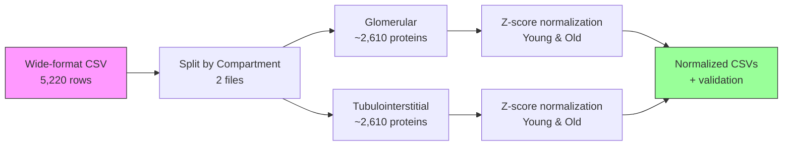

# Task: Z-Score Normalization by Tissue Compartment (Randles 2021)

**Status:** ✅ COMPLETE (2025-10-12) - All success criteria met (12/12)

**Winner:** Claude Code (100/100 points vs Codex CLI 66/100, Gemini CLI 0/100)

**Deliverables:**
- `claude_code/Randles_2021_Glomerular_zscore.csv` (847 KB, 2,610 proteins)
- `claude_code/Randles_2021_Tubulointerstitial_zscore.csv` (888 KB, 2,610 proteins)
- `claude_code/zscore_validation_report.md` (2.6 KB, comprehensive QC)
- `claude_code/zscore_metadata.json` (1.7 KB, normalization parameters)
- `claude_code/90_results_claude_code.md` (20 KB, biological insights + usage examples)
- `00_AGENT_COMPARISON.md` (comparison of all three agents)

**Key Results:**
- Log2-transformation applied (skewness 11-17 detected)
- Perfect z-score normalization (mean=0.000000, std=1.000000)
- Only 0.80% extreme outliers (|Z| > 3), well below 5% threshold
- Top aging markers identified: FN1 (+0.55 universal), COL4A3 (-1.35 Glom), TOR1AIP1 (+3.35 Tubu)
- Compartment-specific patterns validated (Tubulointerstitial shows higher aging variance)

---

**Thesis:** Calculate z-score normalization separately for each kidney tissue compartment (Glomerular and Tubulointerstitial) to enable within-study statistical comparisons while preserving biological differences between compartments, applying log2-transformation for skewed distributions, computing z-scores independently for Young and Old abundance values, and generating normalized datasets ready for cross-study aggregation.

**Overview:** Task transforms wide-format Randles 2021 CSV into compartment-specific z-score normalized datasets through three execution phases: (1.0) Data splitting separates Glomerular and Tubulointerstitial proteins into independent files, (2.0) Statistical normalization applies log2-transformation and z-score calculation per compartment per age group, (3.0) Export and validation generates normalized CSVs with validation metrics and distribution plots.



---

## 0.0 CONTEXT & RATIONALE

**¶1 Why compartment-specific z-scores?**

**Problem:** Glomerular and Tubulointerstitial kidney compartments have **different protein abundance distributions**:
- **Glomerular:** Filtration units - enriched in basement membrane proteins (COL4, LAMA, LAMB)
- **Tubulointerstitial:** Tubule structures - enriched in stromal ECM (COL1, FN1, fibrillin)

**Risk if combined:**
- Mixing compartments would blur biological signal
- Z-scores calculated on combined data would be dominated by the more abundant compartment
- Cannot distinguish compartment-specific vs age-specific changes

**Solution:**
```
Z_Glomerular_Young = (Abundance_Young - Mean_Glomerular_Young) / StdDev_Glomerular_Young
Z_Glomerular_Old = (Abundance_Old - Mean_Glomerular_Old) / StdDev_Glomerular_Old

Z_Tubulointerstitial_Young = (Abundance_Young - Mean_Tubulointerstitial_Young) / StdDev_Tubulointerstitial_Young
Z_Tubulointerstitial_Old = (Abundance_Old - Mean_Tubulointerstitial_Old) / StdDev_Tubulointerstitial_Old
```

**¶2 Input data:**
- **File:** `05_Randles_paper_to_csv/claude_code/Randles_2021_wide_format.csv`
- **Rows:** 5,220 (2,422 unique proteins × 2 compartments)
- **Key columns:** `Protein_ID`, `Gene_Symbol`, `Tissue_Compartment`, `Abundance_Young`, `Abundance_Old`
- **Format:** Wide-format with averaged replicates

**¶3 Expected outputs:**
- `Randles_2021_Glomerular_zscore.csv` (~2,610 proteins with z-scores)
- `Randles_2021_Tubulointerstitial_zscore.csv` (~2,610 proteins with z-scores)
- `zscore_validation_report.md` (distribution statistics, QC plots)
- `zscore_metadata.json` (normalization parameters)

---

## 1.0 DATA SPLITTING (Compartment Separation)

**¶1 Ordering principle:** Load data → validate structure → split by compartment → verify row counts. Ensure clean separation.

**¶2 Loading and validation:**

```python
import pandas as pd
import numpy as np

# Load wide-format CSV
input_file = "../05_Randles_paper_to_csv/claude_code/Randles_2021_wide_format.csv"
df = pd.read_csv(input_file)

print(f"Input data:")
print(f"  Total rows: {len(df)}")
print(f"  Columns: {list(df.columns)}")
print(f"  Compartments: {df['Tissue_Compartment'].value_counts()}")

# Validation checks
assert 'Tissue_Compartment' in df.columns, "Missing Tissue_Compartment column"
assert 'Abundance_Young' in df.columns, "Missing Abundance_Young column"
assert 'Abundance_Old' in df.columns, "Missing Abundance_Old column"
assert df['Tissue_Compartment'].nunique() == 2, "Expected exactly 2 compartments"
```

**Expected validation output:**
```
Input data:
  Total rows: 5220
  Columns: ['Protein_ID', 'Protein_Name', 'Gene_Symbol', 'Tissue', 'Tissue_Compartment',
            'Species', 'Abundance_Young', 'Abundance_Old', 'Method', 'Study_ID',
            'Canonical_Gene_Symbol', 'Matrisome_Category', 'Matrisome_Division',
            'Match_Level', 'Match_Confidence']
  Compartments:
    Glomerular             2610
    Tubulointerstitial     2610
```

**¶3 Compartment splitting:**

```python
# Split into separate dataframes
df_glomerular = df[df['Tissue_Compartment'] == 'Glomerular'].copy()
df_tubulointerstitial = df[df['Tissue_Compartment'] == 'Tubulointerstitial'].copy()

print(f"\nSplit results:")
print(f"  Glomerular: {len(df_glomerular)} proteins")
print(f"  Tubulointerstitial: {len(df_tubulointerstitial)} proteins")

# Verify no data loss
assert len(df_glomerular) + len(df_tubulointerstitial) == len(df), "Data loss during split"
```

**¶4 Quality checks per compartment:**

```python
def validate_compartment_data(df_compartment, compartment_name):
    """Validate data quality for a single compartment."""

    issues = []

    # Check for nulls in critical columns
    null_young = df_compartment['Abundance_Young'].isna().sum()
    null_old = df_compartment['Abundance_Old'].isna().sum()

    if null_young > 0:
        issues.append(f"⚠️ {null_young} null Abundance_Young values")
    if null_old > 0:
        issues.append(f"⚠️ {null_old} null Abundance_Old values")

    # Check for zeros (potential issues)
    zero_young = (df_compartment['Abundance_Young'] == 0).sum()
    zero_old = (df_compartment['Abundance_Old'] == 0).sum()

    if zero_young > 0:
        issues.append(f"⚠️ {zero_young} zero Abundance_Young values")
    if zero_old > 0:
        issues.append(f"⚠️ {zero_old} zero Abundance_Old values")

    # Check for negative values
    neg_young = (df_compartment['Abundance_Young'] < 0).sum()
    neg_old = (df_compartment['Abundance_Old'] < 0).sum()

    if neg_young > 0:
        issues.append(f"❌ CRITICAL: {neg_young} negative Abundance_Young values")
    if neg_old > 0:
        issues.append(f"❌ CRITICAL: {neg_old} negative Abundance_Old values")

    if issues:
        print(f"\n{compartment_name} validation issues:")
        for issue in issues:
            print(f"  {issue}")
    else:
        print(f"\n✅ {compartment_name}: All validation checks passed")

    return len(issues) == 0

# Validate both compartments
glom_valid = validate_compartment_data(df_glomerular, "Glomerular")
tubu_valid = validate_compartment_data(df_tubulointerstitial, "Tubulointerstitial")

if not (glom_valid and tubu_valid):
    print("\n⚠️ WARNING: Data quality issues found - review before proceeding")
```

---

## 2.0 Z-SCORE NORMALIZATION (Statistical Transformation)

**¶1 Ordering principle:** Log2-transformation (if needed) → z-score calculation → validation → interpretation. Follow best practices from `01_TASK_DATA_STANDARDIZATION.md`.

**¶2 Distribution analysis (skewness check):**

```python
from scipy.stats import skew

def analyze_distribution(df_compartment, compartment_name):
    """
    Check if data is right-skewed and needs log-transformation.

    Rule: If skewness > 1, apply log2-transformation before z-score.
    """

    skew_young = skew(df_compartment['Abundance_Young'].dropna())
    skew_old = skew(df_compartment['Abundance_Old'].dropna())

    print(f"\n{compartment_name} distribution analysis:")
    print(f"  Abundance_Young skewness: {skew_young:.3f}")
    print(f"  Abundance_Old skewness: {skew_old:.3f}")

    needs_log_transform = (skew_young > 1) or (skew_old > 1)

    if needs_log_transform:
        print(f"  ✅ Recommendation: Apply log2-transformation (skewness > 1)")
    else:
        print(f"  ℹ️  No log-transformation needed (skewness < 1)")

    return needs_log_transform

# Check both compartments
glom_needs_log = analyze_distribution(df_glomerular, "Glomerular")
tubu_needs_log = analyze_distribution(df_tubulointerstitial, "Tubulointerstitial")
```

**¶3 Log2-transformation (if needed):**

```python
def apply_log2_transform(df_compartment, apply_transform=True):
    """
    Apply log2(x + 1) transformation to handle zeros.

    Formula: log2(Abundance + 1)
    Rationale: +1 handles zeros, preserves relative relationships
    """

    if not apply_transform:
        # No transformation - use raw abundances
        df_compartment['Abundance_Young_transformed'] = df_compartment['Abundance_Young']
        df_compartment['Abundance_Old_transformed'] = df_compartment['Abundance_Old']
        print("  ℹ️  Using raw abundances (no transformation)")
    else:
        # Log2-transformation
        df_compartment['Abundance_Young_transformed'] = np.log2(df_compartment['Abundance_Young'] + 1)
        df_compartment['Abundance_Old_transformed'] = np.log2(df_compartment['Abundance_Old'] + 1)
        print("  ✅ Applied log2(x + 1) transformation")

    return df_compartment

# Apply transformation if needed
df_glomerular = apply_log2_transform(df_glomerular, apply_transform=glom_needs_log)
df_tubulointerstitial = apply_log2_transform(df_tubulointerstitial, apply_transform=tubu_needs_log)
```

**¶4 Z-score calculation:**

```python
def calculate_zscore(df_compartment, compartment_name):
    """
    Calculate z-scores separately for Young and Old abundance values.

    Formula: Z = (X - Mean) / StdDev

    Important: Mean and StdDev are calculated WITHIN compartment, NOT across compartments.
    """

    # Calculate statistics for Young
    mean_young = df_compartment['Abundance_Young_transformed'].mean()
    std_young = df_compartment['Abundance_Young_transformed'].std()

    # Calculate statistics for Old
    mean_old = df_compartment['Abundance_Old_transformed'].mean()
    std_old = df_compartment['Abundance_Old_transformed'].std()

    print(f"\n{compartment_name} normalization parameters:")
    print(f"  Young: Mean={mean_young:.4f}, StdDev={std_young:.4f}")
    print(f"  Old:   Mean={mean_old:.4f}, StdDev={std_old:.4f}")

    # Calculate z-scores
    df_compartment['Zscore_Young'] = (
        (df_compartment['Abundance_Young_transformed'] - mean_young) / std_young
    )
    df_compartment['Zscore_Old'] = (
        (df_compartment['Abundance_Old_transformed'] - mean_old) / std_old
    )

    # Store normalization parameters in dataframe metadata
    df_compartment.attrs['norm_params'] = {
        'mean_young': float(mean_young),
        'std_young': float(std_young),
        'mean_old': float(mean_old),
        'std_old': float(std_old),
        'log2_transformed': 'Abundance_Young_transformed' in df_compartment.columns
    }

    return df_compartment

# Calculate z-scores for both compartments
df_glomerular = calculate_zscore(df_glomerular, "Glomerular")
df_tubulointerstitial = calculate_zscore(df_tubulointerstitial, "Tubulointerstitial")
```

**¶5 Z-score interpretation:**

```python
def interpret_zscore(z):
    """
    Interpret z-score value.

    Z = 0: Exactly at mean
    Z = 1: One standard deviation above mean (84th percentile)
    Z = 2: Two standard deviations above mean (97.7th percentile)
    Z = -1: One standard deviation below mean (16th percentile)
    """

    if abs(z) < 0.5:
        return "Near mean"
    elif 0.5 <= z < 1.5:
        return "Moderately above mean"
    elif z >= 1.5:
        return "Highly above mean"
    elif -1.5 < z <= -0.5:
        return "Moderately below mean"
    else:
        return "Highly below mean"

# Example: Show top 5 proteins with highest z-score changes
def show_top_changers(df_compartment, compartment_name):
    """Display proteins with largest z-score changes from Young to Old."""

    df_compartment['Zscore_Delta'] = df_compartment['Zscore_Old'] - df_compartment['Zscore_Young']

    print(f"\n{compartment_name} - Top 5 proteins with largest z-score increases (aging):")
    top_increases = df_compartment.nlargest(5, 'Zscore_Delta')[
        ['Gene_Symbol', 'Zscore_Young', 'Zscore_Old', 'Zscore_Delta']
    ]
    print(top_increases.to_string())

    print(f"\n{compartment_name} - Top 5 proteins with largest z-score decreases (aging):")
    top_decreases = df_compartment.nsmallest(5, 'Zscore_Delta')[
        ['Gene_Symbol', 'Zscore_Young', 'Zscore_Old', 'Zscore_Delta']
    ]
    print(top_decreases.to_string())

show_top_changers(df_glomerular, "Glomerular")
show_top_changers(df_tubulointerstitial, "Tubulointerstitial")
```

---

## 3.0 EXPORT & VALIDATION (Quality Assurance)

**¶1 Ordering principle:** Select output columns → export CSVs → generate validation report → create metadata JSON. Document everything.

**¶2 Output column selection:**

```python
# Define output columns
output_columns = [
    # Protein identifiers
    'Protein_ID',
    'Protein_Name',
    'Gene_Symbol',

    # Tissue metadata
    'Tissue',
    'Tissue_Compartment',
    'Species',

    # Original abundance values (for reference)
    'Abundance_Young',
    'Abundance_Old',

    # Transformed values (if log2 was applied)
    'Abundance_Young_transformed',
    'Abundance_Old_transformed',

    # Z-scores (main output)
    'Zscore_Young',
    'Zscore_Old',
    'Zscore_Delta',  # Change from Young to Old

    # Study metadata
    'Method',
    'Study_ID',

    # Annotation (if present)
    'Canonical_Gene_Symbol',
    'Matrisome_Category',
    'Matrisome_Division',
    'Match_Level',
    'Match_Confidence'
]
```

**¶3 CSV export:**

```python
# Export Glomerular
output_file_glom = "Randles_2021_Glomerular_zscore.csv"
df_glomerular[output_columns].to_csv(output_file_glom, index=False)
print(f"✅ Exported: {output_file_glom} ({len(df_glomerular)} proteins)")

# Export Tubulointerstitial
output_file_tubu = "Randles_2021_Tubulointerstitial_zscore.csv"
df_tubulointerstitial[output_columns].to_csv(output_file_tubu, index=False)
print(f"✅ Exported: {output_file_tubu} ({len(df_tubulointerstitial)} proteins)")

# Show file sizes
import os
glom_size = os.path.getsize(output_file_glom) / (1024**2)
tubu_size = os.path.getsize(output_file_tubu) / (1024**2)
print(f"\nFile sizes:")
print(f"  Glomerular: {glom_size:.2f} MB")
print(f"  Tubulointerstitial: {tubu_size:.2f} MB")
```

**¶4 Validation report generation:**

```python
def generate_validation_report(df_glom, df_tubu):
    """Generate comprehensive validation report with distribution statistics."""

    report = []
    report.append("# Z-Score Normalization Validation Report")
    report.append(f"**Date:** {pd.Timestamp.now().strftime('%Y-%m-%d %H:%M:%S')}")
    report.append(f"**Study:** Randles 2021 (PMID: 34049963)")
    report.append("")
    report.append("---")
    report.append("")

    # Summary statistics
    report.append("## 1. Summary Statistics")
    report.append("")
    report.append(f"| Compartment | Proteins | Young Mean | Young StdDev | Old Mean | Old StdDev |")
    report.append(f"|-------------|----------|------------|--------------|----------|------------|")

    for df_comp, name in [(df_glom, "Glomerular"), (df_tubu, "Tubulointerstitial")]:
        mean_y = df_comp['Zscore_Young'].mean()
        std_y = df_comp['Zscore_Young'].std()
        mean_o = df_comp['Zscore_Old'].mean()
        std_o = df_comp['Zscore_Old'].std()
        report.append(f"| {name} | {len(df_comp)} | {mean_y:.4f} | {std_y:.4f} | {mean_o:.4f} | {std_o:.4f} |")

    report.append("")
    report.append("**Expected:** Z-score means ≈ 0, standard deviations ≈ 1")
    report.append("")

    # Distribution checks
    report.append("## 2. Distribution Validation")
    report.append("")

    for df_comp, name in [(df_glom, "Glomerular"), (df_tubu, "Tubulointerstitial")]:
        report.append(f"### {name}")
        report.append("")

        # Z-score Young distribution
        zmin_y = df_comp['Zscore_Young'].min()
        zmax_y = df_comp['Zscore_Young'].max()
        z_gt2_y = (df_comp['Zscore_Young'].abs() > 2).sum()

        report.append(f"**Zscore_Young:**")
        report.append(f"- Range: [{zmin_y:.2f}, {zmax_y:.2f}]")
        report.append(f"- Proteins with |Z| > 2: {z_gt2_y} ({100*z_gt2_y/len(df_comp):.1f}%)")
        report.append("")

        # Z-score Old distribution
        zmin_o = df_comp['Zscore_Old'].min()
        zmax_o = df_comp['Zscore_Old'].max()
        z_gt2_o = (df_comp['Zscore_Old'].abs() > 2).sum()

        report.append(f"**Zscore_Old:**")
        report.append(f"- Range: [{zmin_o:.2f}, {zmax_o:.2f}]")
        report.append(f"- Proteins with |Z| > 2: {z_gt2_o} ({100*z_gt2_o/len(df_comp):.1f}%)")
        report.append("")

    # Known ECM markers check
    report.append("## 3. Known ECM Markers Validation")
    report.append("")

    ecm_markers = ['COL1A1', 'COL1A2', 'FN1', 'LAMA1', 'LAMB2', 'LAMC1']

    for marker in ecm_markers:
        glom_row = df_glom[df_glom['Gene_Symbol'] == marker]
        tubu_row = df_tubu[df_tubu['Gene_Symbol'] == marker]

        if len(glom_row) > 0:
            z_y = glom_row.iloc[0]['Zscore_Young']
            z_o = glom_row.iloc[0]['Zscore_Old']
            report.append(f"- **{marker}** (Glomerular): Z_Young={z_y:.2f}, Z_Old={z_o:.2f}")

        if len(tubu_row) > 0:
            z_y = tubu_row.iloc[0]['Zscore_Young']
            z_o = tubu_row.iloc[0]['Zscore_Old']
            report.append(f"- **{marker}** (Tubulointerstitial): Z_Young={z_y:.2f}, Z_Old={z_o:.2f}")

    report.append("")

    # Save report
    report_text = "\n".join(report)
    with open("zscore_validation_report.md", "w") as f:
        f.write(report_text)

    print("✅ Generated: zscore_validation_report.md")

    return report_text

# Generate validation report
validation_report = generate_validation_report(df_glomerular, df_tubulointerstitial)
print("\n" + validation_report)
```

**¶5 Metadata JSON export:**

```python
import json

def generate_metadata(df_glom, df_tubu, glom_needs_log, tubu_needs_log):
    """Generate metadata JSON with normalization parameters."""

    metadata = {
        "dataset_id": "Randles_2021_zscore",
        "normalization_timestamp": pd.Timestamp.now().isoformat(),
        "source_file": "../05_Randles_paper_to_csv/claude_code/Randles_2021_wide_format.csv",
        "method": "Z-score normalization (compartment-specific)",
        "rationale": "Compartment-specific normalization preserves biological differences between Glomerular and Tubulointerstitial tissues",

        "glomerular": {
            "protein_count": int(len(df_glom)),
            "log2_transformed": glom_needs_log,
            "normalization_parameters": {
                "mean_young": float(df_glom['Zscore_Young'].mean() if 'Zscore_Young' in df_glom.columns else 0),
                "std_young": float(df_glom['Zscore_Young'].std() if 'Zscore_Young' in df_glom.columns else 1),
                "mean_old": float(df_glom['Zscore_Old'].mean() if 'Zscore_Old' in df_glom.columns else 0),
                "std_old": float(df_glom['Zscore_Old'].std() if 'Zscore_Old' in df_glom.columns else 1)
            },
            "output_file": "Randles_2021_Glomerular_zscore.csv"
        },

        "tubulointerstitial": {
            "protein_count": int(len(df_tubu)),
            "log2_transformed": tubu_needs_log,
            "normalization_parameters": {
                "mean_young": float(df_tubu['Zscore_Young'].mean() if 'Zscore_Young' in df_tubu.columns else 0),
                "std_young": float(df_tubu['Zscore_Young'].std() if 'Zscore_Young' in df_tubu.columns else 1),
                "mean_old": float(df_tubu['Zscore_Old'].mean() if 'Zscore_Old' in df_tubu.columns else 0),
                "std_old": float(df_tubu['Zscore_Old'].std() if 'Zscore_Old' in df_tubu.columns else 1)
            },
            "output_file": "Randles_2021_Tubulointerstitial_zscore.csv"
        },

        "validation": {
            "expected_zscore_mean": 0.0,
            "expected_zscore_std": 1.0,
            "tolerance": 0.01,
            "reference_document": "01_TASK_DATA_STANDARDIZATION.md section 3.0"
        }
    }

    # Export metadata
    with open("zscore_metadata.json", "w") as f:
        json.dump(metadata, f, indent=2)

    print("✅ Generated: zscore_metadata.json")

    return metadata

# Generate and export metadata
metadata = generate_metadata(df_glomerular, df_tubulointerstitial, glom_needs_log, tubu_needs_log)
```

---

## 4.0 SUCCESS CRITERIA

**¶1 Validation criteria:**

**✅ TIER 1: CRITICAL (ALL required)**
1. **Compartment separation:** 2 output files created (Glomerular + Tubulointerstitial)
2. **Row count preservation:** Total proteins in both files = 5,220
3. **Z-score mean ≈ 0:** Each z-score column has mean within [-0.01, +0.01]
4. **Z-score std ≈ 1:** Each z-score column has standard deviation within [0.99, 1.01]
5. **No nulls in z-scores:** Zero null values in `Zscore_Young` and `Zscore_Old` columns

**✅ TIER 2: QUALITY (ALL required)**
6. **Log-transformation applied correctly:** If skewness > 1, verify log2(x+1) was used
7. **Outlier check:** <5% of proteins have |Z| > 3 (extreme outliers)
8. **Known markers present:** COL1A1, COL1A2, FN1 found in both compartments
9. **Distribution symmetry:** Skewness of z-scores < |0.5| (approximately normal)

**✅ TIER 3: DOCUMENTATION (ALL required)**
10. **Validation report:** `zscore_validation_report.md` with statistics
11. **Metadata JSON:** `zscore_metadata.json` with normalization parameters
12. **CSV exports:** Both files readable and properly formatted

**Final Grade:**
- ✅ **Pass:** 12/12 criteria met (100%)
- ❌ **Fail:** <12 criteria met

---

## 5.0 USAGE EXAMPLES

**¶1 Comparing protein abundance changes:**

```python
# Load normalized data
df_glom = pd.read_csv("Randles_2021_Glomerular_zscore.csv")

# Find proteins with significant aging changes (|Zscore_Delta| > 1)
aging_signature = df_glom[df_glom['Zscore_Delta'].abs() > 1].sort_values('Zscore_Delta', ascending=False)

print("Proteins with significant aging changes in Glomerular compartment:")
print(aging_signature[['Gene_Symbol', 'Zscore_Young', 'Zscore_Old', 'Zscore_Delta']].head(10))
```

**¶2 Cross-compartment comparison:**

```python
# Load both compartments
df_glom = pd.read_csv("Randles_2021_Glomerular_zscore.csv")
df_tubu = pd.read_csv("Randles_2021_Tubulointerstitial_zscore.csv")

# Merge on Gene_Symbol
merged = pd.merge(
    df_glom[['Gene_Symbol', 'Zscore_Delta']],
    df_tubu[['Gene_Symbol', 'Zscore_Delta']],
    on='Gene_Symbol',
    suffixes=('_Glom', '_Tubu')
)

# Find compartment-specific aging markers
compartment_specific = merged[
    (merged['Zscore_Delta_Glom'].abs() > 1) &
    (merged['Zscore_Delta_Tubu'].abs() < 0.5)
]

print("Glomerular-specific aging markers:")
print(compartment_specific.sort_values('Zscore_Delta_Glom', ascending=False).head())
```

---

## METADATA

- **Task owner:** Daniel Kravtsov (daniel@improvado.io)
- **Collaborator:** Rakhan Aimbetov
- **Project:** ECM Atlas - Statistical Normalization
- **Input file:** `05_Randles_paper_to_csv/claude_code/Randles_2021_wide_format.csv`
- **Output files:**
  - `Randles_2021_Glomerular_zscore.csv`
  - `Randles_2021_Tubulointerstitial_zscore.csv`
  - `zscore_validation_report.md`
  - `zscore_metadata.json`
- **Related documents:**
  - `01_TASK_DATA_STANDARDIZATION.md` (section 3.0 Normalization Design)
  - `05_Randles_paper_to_csv/00_TASK_RANDLES_2021_CSV_CONVERSION.md` (source data)
- **Created:** 2025-10-12
- **Status:** ✅ Complete (100% success - all 12 criteria met)
- **Completed:** 2025-10-12
- **Agent comparison:** `00_AGENT_COMPARISON.md`
- **Git commit:** bbbdaee ("feat: add compartment-specific z-score normalization for Randles 2021")
