# Task: Tam 2020 Dataset Conversion to Standardized CSV

**Thesis:** Convert Tam et al. 2020 intervertebral disc (IVD) aging proteomics dataset into standardized CSV format by parsing spatially-resolved Excel data file, applying schema mapping with compartment-specific structure, executing age bin normalization (young vs old), performing matrisome annotation using human reference list, calculating z-scores per tissue compartment, validating data quality, and generating complete documentation for multi-agent execution.

**Overview:** Task transforms spatially-resolved single-study raw data into unified database format through six execution phases: (1.0) File reconnaissance validates data availability and structure, (2.0) Data parsing extracts protein abundances from Excel into long-format table with spatial profiling metadata, (3.0) Schema standardization maps columns to unified 14-column format with tissue compartment enrichment, (4.0) Protein annotation harmonizes identifiers using human matrisome reference list (≥90% coverage target), (5.0) Z-score normalization calculates compartment-specific z-scores for statistical comparison, (6.0) Quality validation verifies completeness, accuracy, and biological sanity checks before final CSV export.

```mermaid
graph LR
    A[Excel File<br/>3,158×80 matrix] --> B[Data Parsing<br/>Extract LFQ intensities]
    B --> C[Schema Mapping<br/>14 columns + spatial metadata]
    C --> D[Age Binning<br/>Young 16yr vs Old 59yr]
    D --> E[Protein Annotation<br/>Matrisome ref]
    E --> F[Z-score per Compartment<br/>NP/IAF/OAF]
    F --> G[Quality Validation<br/>Coverage ≥90%]
    G --> H[CSV Export<br/>Tam_2020.csv]
    H --> I[Documentation<br/>Report + metadata]

    style A fill:#f9f,stroke:#333
    style F fill:#ff9,stroke:#333
    style H fill:#9f9,stroke:#333
```



---

## 0.0 STUDY METADATA (Context from Analysis)

**¶1 Paper information:**
- **Title:** DIPPER, a spatiotemporal proteomics atlas of human intervertebral discs for exploring ageing and degeneration dynamics
- **Authors:** Tam et al.
- **Year:** 2020
- **PMID:** 33382035
- **Tissue:** Human lumbar intervertebral discs (IVD) with **THREE TISSUE COMPARTMENTS**
  - **Nucleus Pulposus (NP):** Central gel-like core - analyzed separately
  - **Inner Annulus Fibrosus (IAF):** Inner fibrous ring - analyzed separately
  - **Outer Annulus Fibrosus (OAF):** Outer fibrous ring - analyzed separately
  - **Additional:** Transition zones (NP/IAF boundaries) - spatially resolved
  - **⚠️ CRITICAL:** Compartments must remain **SEPARATE** in final CSV (not combined)
- **Species:** *Homo sapiens*
- **Method:** Label-free LC-MS/MS with MaxQuant LFQ (Label-Free Quantification)

**¶2 Age groups (original):**
- **Young donor:** 16 years (1 male cadaver)
  - Spatial profiles: ~33 profiles across disc levels L3/4, L4/5, L5/S1
  - Compartments: NP, IAF, OAF positions mapped spatially
- **Aged donor:** 59 years (1 male cadaver)
  - Spatial profiles: ~33 profiles across disc levels L3/4, L4/5, L5/S1
  - Compartments: NP, IAF, OAF positions mapped spatially
- **Total spatial profiles:** 66 (33 young + 33 old)
- **Unique design:** Spatially resolved proteomics across disc compartments and anatomical levels

**¶3 Age bin normalization (Phase 1 LFQ standard):**
- **Young bin:** 16 years (single donor with 33 spatial profiles)
  - Samples: L3/4_young_*, L4/5_young_*, L5/S1_young_* (multiple compartment positions)
  - Rationale: Young adult human IVD (pre-degeneration phase)
- **Old bin:** 59 years (single donor with 33 spatial profiles)
  - Samples: L3/4_old_*, L4/5_old_*, L5/S1_old_* (multiple compartment positions)
  - Rationale: Aged human IVD (degeneration-associated changes)
- **Data retention:** 100% (meets ≥66% threshold)
- **Age gap:** 43 years

**¶4 Data file location:**
- **File:** `data_raw/Tam et al. - 2020/elife-64940-supp1-v3.xlsx`
- **Primary sheet:** `Raw data` (3,158 proteins × 80 columns)
- **Metadata sheet:** `Sample information` (66 profiles with age, compartment, disc level, coordinates)
- **Key columns in Raw data:**
  - Protein identifiers: `T: Majority protein IDs`, `T: Protein names`, `T: Gene names`
  - Abundance columns: `LFQ intensity ...` (66 columns, one per spatial profile)
- **Key columns in Sample information:**
  - Profile metadata: `profile-name`, `age-group` (young/old), `Compartment` (NP/IAF/OAF)
  - Spatial metadata: `disc-level` (L3/4, L4/5, L5/S1), `anatomical-direction`, `distance-from-centre-mm`

**¶5 Expected output:**
- **Long-format (intermediate):** 3,158 proteins × 66 profiles = 208,428 rows
- **Wide-format (final deliverable):** ~9,474 rows (3,158 proteins × 3 compartments)
- **Format:** Wide-format CSV with separate Abundance_Young and Abundance_Old columns per compartment
- **Annotation target:** ≥90% coverage using human matrisome reference (1,026 genes)
- **Z-score normalization:** 3 separate files (NP, IAF, OAF) with compartment-specific z-scores
- **Key benefit:** Preserves spatial resolution while enabling statistical comparison

---

## 1.0 FILE RECONNAISSANCE (Data Validation)

**¶1 Ordering principle:** File existence → structure verification → column identification → metadata join validation → data quality check. Validate before parsing.

**¶2 Required file checks:**

**Check 1: File availability**
```bash
# Verify file exists
FILE="/Users/Kravtsovd/projects/ecm-atlas/data_raw/Tam et al. - 2020/elife-64940-supp1-v3.xlsx"
if [ -f "$FILE" ]; then
    echo "✅ File found: $FILE"
    ls -lh "$FILE"  # Show file size
else
    echo "❌ File not found: $FILE"
    exit 1
fi
```

**Check 2: Excel structure inspection**
```python
import pandas as pd

# Load Excel file and inspect sheets
excel_file = "data_raw/Tam et al. - 2020/elife-64940-supp1-v3.xlsx"
xl = pd.ExcelFile(excel_file)

print("Sheet names:", xl.sheet_names)

# Load Raw data sheet
df_raw = pd.read_excel(excel_file, sheet_name="Raw data")
print(f"\nRaw data shape: {df_raw.shape}")
print(f"Columns (first 10): {list(df_raw.columns[:10])}")

# Load Sample information sheet
df_metadata = pd.read_excel(excel_file, sheet_name="Sample information")
print(f"\nSample information shape: {df_metadata.shape}")
print(f"Columns: {list(df_metadata.columns)}")
print(f"Age groups: {df_metadata['age-group'].value_counts()}")
print(f"Compartments: {df_metadata['Compartment'].value_counts()}")
```

**Expected output:**
```
Sheet names: ['Raw data', 'Sample information', ...]
Raw data shape: (3158, 80)
Columns (first 10): ['T: Majority protein IDs', 'T: Protein names', 'T: Gene names', 'LFQ intensity ...', ...]

Sample information shape: (66, 8)
Columns: ['profile-name', 'age-group', 'disc-level', 'Compartment', 'anatomical-direction', ...]
Age groups:
  young    33
  old      33
Compartments:
  NP     ~22
  IAF    ~22
  OAF    ~22
```

**¶3 Column identification:**

**Raw data columns:**
- **Protein identifiers:** `T: Majority protein IDs` (UniProt), `T: Protein names`, `T: Gene names`
- **Intensity columns (LFQ):** `LFQ intensity [profile-name]` (66 columns, one per spatial profile)
- **Format note:** Column prefix "T: " indicates MaxQuant output

**Sample information columns:**
- **Profile identifier:** `profile-name` (e.g., "L3/4_old_L_OAF")
- **Age group:** `age-group` ("young" → 16yr, "old" → 59yr)
- **Tissue compartment:** `Compartment` ("NP", "IAF", "OAF")
- **Anatomical metadata:** `disc-level` (L3/4, L4/5, L5/S1), `anatomical-direction` (Left/Right)
- **Spatial coordinates:** `distance-from-centre-mm` (numeric position)

**¶4 Metadata join validation:**

```python
# Extract profile names from Raw data LFQ columns
lfq_columns = [col for col in df_raw.columns if col.startswith('LFQ intensity ')]
profile_names_raw = [col.replace('LFQ intensity ', '') for col in lfq_columns]

# Extract profile names from Sample information
profile_names_metadata = df_metadata['profile-name'].tolist()

# Check alignment
print(f"\nProfile count in Raw data: {len(profile_names_raw)}")
print(f"Profile count in Sample information: {len(profile_names_metadata)}")

# Find mismatches
mismatches = set(profile_names_raw) - set(profile_names_metadata)
if mismatches:
    print(f"⚠️ WARNING: {len(mismatches)} profiles in Raw data but not in Sample information")
    print(f"Mismatches: {list(mismatches)[:5]}")
else:
    print("✅ All profiles in Raw data have metadata")

# Verify join key uniqueness
if len(profile_names_metadata) != len(set(profile_names_metadata)):
    print("❌ CRITICAL: Duplicate profile names in Sample information")
else:
    print("✅ Profile names are unique in Sample information")
```

**¶5 Data quality checks:**

```python
# Check for critical issues
issues = []

# 1. Check for null protein IDs
null_ids = df_raw['T: Majority protein IDs'].isna().sum()
if null_ids > 0:
    issues.append(f"⚠️ {null_ids} rows missing Protein IDs")

# 2. Check for null gene symbols
null_genes = df_raw['T: Gene names'].isna().sum()
if null_genes > 0:
    issues.append(f"⚠️ {null_genes} rows missing Gene names")

# 3. Check LFQ intensity columns for entirely null data
for col in lfq_columns[:5]:  # Sample first 5
    null_count = df_raw[col].isna().sum()
    if null_count == len(df_raw):
        issues.append(f"❌ CRITICAL: Column {col} is entirely empty")

# 4. Check for missing compartment labels
null_compartments = df_metadata['Compartment'].isna().sum()
if null_compartments > 0:
    issues.append(f"⚠️ {null_compartments} profiles missing Compartment labels")

# Report
if issues:
    print("\nData Quality Issues:")
    for issue in issues:
        print(issue)
else:
    print("\n✅ All data quality checks passed")
```

**¶6 Decision: Proceed or abort**
- **Proceed if:** File exists, both sheets present, ~3,158 proteins, 66 profiles, metadata join clean, <10% missing protein IDs
- **Abort if:** File missing, sheets missing, profile count mismatch, >50% missing identifiers, metadata join fails

---

## 2.0 DATA PARSING (Excel to Long-Format)

**¶1 Ordering principle:** Load data → join metadata → filter columns → reshape to long format → add sample metadata. Transform wide matrix to tall table with spatial context.

**¶2 Parsing strategy:**

**Step 1: Load and prepare data**
```python
import pandas as pd
import numpy as np

# Load Excel sheets
excel_file = "data_raw/Tam et al. - 2020/elife-64940-supp1-v3.xlsx"
df_raw = pd.read_excel(excel_file, sheet_name="Raw data")
df_metadata = pd.read_excel(excel_file, sheet_name="Sample information")

print(f"Raw data: {df_raw.shape}")
print(f"Metadata: {df_metadata.shape}")

# Strip "T: " prefix from protein identifier column names
df_raw.columns = [col.replace('T: ', '') for col in df_raw.columns]

# Extract LFQ intensity columns
lfq_columns = [col for col in df_raw.columns if col.startswith('LFQ intensity ')]
id_cols = ['Majority protein IDs', 'Protein names', 'Gene names']

print(f"\nProtein ID columns: {id_cols}")
print(f"LFQ intensity columns: {len(lfq_columns)}")
```

**Step 2: Reshape to long format**
```python
# Select only needed columns
df_filtered = df_raw[id_cols + lfq_columns].copy()

# Melt LFQ intensity columns into rows
df_long = df_filtered.melt(
    id_vars=id_cols,
    value_vars=lfq_columns,
    var_name='LFQ_Column',
    value_name='Abundance'
)

# Extract profile name from LFQ column name
df_long['Profile_Name'] = df_long['LFQ_Column'].str.replace('LFQ intensity ', '')

print(f"Long-format shape: {df_long.shape}")
# Expected: (208,428, 6) = 3,158 proteins × 66 profiles
```

**Step 3: Join with metadata**
```python
# Merge with sample metadata on profile name
df_long = df_long.merge(
    df_metadata,
    left_on='Profile_Name',
    right_on='profile-name',
    how='left'
)

print(f"After metadata join: {df_long.shape}")
print(f"Columns added: {[col for col in df_long.columns if col in df_metadata.columns]}")

# Verify no rows lost in join
assert len(df_long) == 3158 * 66, "Data loss during metadata join"

# Check for unmatched profiles
unmatched = df_long[df_long['age-group'].isna()]
if len(unmatched) > 0:
    print(f"⚠️ WARNING: {len(unmatched)} rows with missing metadata")
    print(f"Unmatched profiles: {unmatched['Profile_Name'].unique()}")
else:
    print("✅ All profiles successfully joined with metadata")
```

**Step 4: Parse age and compartment**
```python
# Map age-group to numeric age
age_map = {
    'young': 16,
    'old': 59
}
df_long['Age'] = df_long['age-group'].map(age_map)

# Map age to age bin
df_long['Age_Bin'] = df_long['age-group'].map({
    'young': 'Young',
    'old': 'Old'
})

# Rename compartment column for clarity
df_long['Tissue_Compartment'] = df_long['Compartment']

# Create Sample_ID (format: disc_age_direction_compartment)
# Example: L3/4_young_L_NP
df_long['Sample_ID'] = df_long['Profile_Name']

print(f"\nAge distribution:")
print(df_long['Age'].value_counts())
print(f"\nCompartment distribution:")
print(df_long['Tissue_Compartment'].value_counts())
```

**Step 5: Add tissue metadata**
```python
# Create Tissue column combining organ and compartment
# Format: "Intervertebral_disc_NP", "Intervertebral_disc_IAF", "Intervertebral_disc_OAF"
df_long['Tissue'] = 'Intervertebral_disc_' + df_long['Tissue_Compartment']

print(f"\nTissue types:")
print(df_long['Tissue'].value_counts())

# Verify compartments kept separate
expected_tissues = {'Intervertebral_disc_NP', 'Intervertebral_disc_IAF', 'Intervertebral_disc_OAF'}
actual_tissues = set(df_long['Tissue'].unique())
assert actual_tissues == expected_tissues, f"Unexpected tissue values: {actual_tissues - expected_tissues}"
```

**¶3 Parsing output validation:**

```python
# Validate parsing results
print("\nParsing Validation Report:")
print(f"Total rows: {len(df_long)} (expected: 208,428)")
print(f"Unique proteins: {df_long['Majority protein IDs'].nunique()} (expected: 3,158)")
print(f"Unique profiles: {df_long['Profile_Name'].nunique()} (expected: 66)")
print(f"Age bin distribution:\n{df_long['Age_Bin'].value_counts()}")
print(f"Compartment distribution:\n{df_long['Tissue_Compartment'].value_counts()}")
print(f"Null abundances: {df_long['Abundance'].isna().sum()} ({df_long['Abundance'].isna().sum()/len(df_long)*100:.1f}%)")

# Expected: ~50-60% null abundances (typical for LFQ proteomics - not all proteins detected in all profiles)
```

---

## 3.0 SCHEMA STANDARDIZATION (Column Mapping)

**¶1 Ordering principle:** Define mappings → apply transformations → add study metadata → validate schema compliance. Map to unified 14-column format.

**¶2 Target schema (15 columns - wide-format for final deliverable):**

**Wide-format schema (FINAL DELIVERABLE):**
```
1. Protein_ID              - UniProt accession from 'Majority protein IDs' column
2. Protein_Name            - Full name from 'Protein names' column
3. Gene_Symbol             - Gene symbol from 'Gene names' column
4. Tissue                  - "Intervertebral_disc_NP" OR "Intervertebral_disc_IAF" OR "Intervertebral_disc_OAF"
5. Tissue_Compartment      - "NP" or "IAF" or "OAF" (explicit compartment)
6. Species                 - "Homo sapiens" (paper metadata)
7. Abundance_Young         - Mean LFQ intensity for young samples (16yr, averaged across spatial profiles per compartment)
8. Abundance_Old           - Mean LFQ intensity for old samples (59yr, averaged across spatial profiles per compartment)
9. Method                  - "Label-free LC-MS/MS (MaxQuant LFQ)"
10. Study_ID               - "Tam_2020"
11. Canonical_Gene_Symbol  - [Added in annotation phase]
12. Matrisome_Category     - [Added in annotation phase]
13. Matrisome_Division     - [Added in annotation phase]
14. Match_Level            - [Added in annotation phase]
15. Match_Confidence       - [Added in annotation phase]
```

**Long-format schema (INTERMEDIATE for processing):**
```
- Used internally for parsing and annotation
- Then pivoted to wide-format for final export
- 17+ columns including Age, Age_Bin, Abundance, Sample_ID, Spatial metadata, Parsing_Notes
- See section 2.0 for details
```

**⚠️ CRITICAL REQUIREMENT:** Tissue column uses **combined format** to keep compartments separate:
- Rows from NP samples: `Tissue = "Intervertebral_disc_NP"`
- Rows from IAF samples: `Tissue = "Intervertebral_disc_IAF"`
- Rows from OAF samples: `Tissue = "Intervertebral_disc_OAF"`
- **DO NOT** combine compartments into single "Intervertebral_disc" value
- **DO NOT** average or merge NP/IAF/OAF data

**¶3 Column mapping implementation:**

```python
# Create standardized dataframe
df_standardized = pd.DataFrame({
    # Protein identifiers
    'Protein_ID': df_long['Majority protein IDs'],
    'Protein_Name': df_long['Protein names'],
    'Gene_Symbol': df_long['Gene names'],
    'Canonical_Gene_Symbol': None,  # Filled in annotation phase
    'Matrisome_Category': None,      # Filled in annotation phase
    'Matrisome_Division': None,      # Filled in annotation phase

    # Tissue metadata - COMPARTMENTS KEPT SEPARATE
    'Tissue': df_long['Tissue'],  # "Intervertebral_disc_NP" or "Intervertebral_disc_IAF" or "Intervertebral_disc_OAF"
    'Tissue_Compartment': df_long['Tissue_Compartment'],  # Explicit compartment for filtering

    # Species
    'Species': 'Homo sapiens',

    # Age information
    'Age': df_long['Age'],
    'Age_Unit': 'years',
    'Age_Bin': df_long['Age_Bin'],

    # Abundance
    'Abundance': df_long['Abundance'],
    'Abundance_Unit': 'LFQ_intensity',

    # Method
    'Method': 'Label-free LC-MS/MS (MaxQuant LFQ)',

    # Study identifiers
    'Study_ID': 'Tam_2020',
    'Sample_ID': df_long['Sample_ID'],

    # Spatial metadata (unique to this study)
    'Disc_Level': df_long['disc-level'],
    'Anatomical_Direction': df_long['anatomical-direction'],
    'Distance_From_Centre_mm': df_long['distance-from-centre-mm'],

    # Additional notes
    'Parsing_Notes': (
        'Spatially-resolved proteomics; ' +
        'Compartment=' + df_long['Tissue_Compartment'].astype(str) + '; ' +
        'Disc_level=' + df_long['disc-level'].astype(str) + '; ' +
        'Profile=' + df_long['Profile_Name'].astype(str)
    )
})

print(f"Standardized shape: {df_standardized.shape}")
print(f"Columns: {list(df_standardized.columns)}")
```

**¶4 Data cleaning and validation:**

```python
# 1. Remove rows with null Protein_ID
initial_rows = len(df_standardized)
df_standardized = df_standardized[df_standardized['Protein_ID'].notna()].copy()
removed = initial_rows - len(df_standardized)
if removed > 0:
    print(f"⚠️ Removed {removed} rows with missing Protein_ID")

# 2. Remove rows with null Abundance (keep rows with 0 - indicates protein not detected)
initial_rows = len(df_standardized)
df_standardized = df_standardized[df_standardized['Abundance'].notna()].copy()
removed = initial_rows - len(df_standardized)
if removed > 0:
    print(f"⚠️ Removed {removed} rows with missing Abundance ({removed/initial_rows*100:.1f}%)")

# 3. Convert data types
df_standardized['Age'] = df_standardized['Age'].astype(int)
df_standardized['Abundance'] = df_standardized['Abundance'].astype(float)

# 4. Validate schema compliance
required_cols = ['Protein_ID', 'Gene_Symbol', 'Species', 'Tissue', 'Tissue_Compartment',
                 'Age', 'Age_Unit', 'Abundance', 'Abundance_Unit', 'Method', 'Study_ID', 'Sample_ID']

for col in required_cols:
    null_count = df_standardized[col].isna().sum()
    if null_count > 0:
        print(f"❌ CRITICAL: {null_count} null values in required column '{col}'")
    else:
        print(f"✅ Column '{col}' has no nulls")

# 5. Validate compartment separation
compartment_counts = df_standardized['Tissue'].value_counts()
print(f"\nTissue distribution (should have 3 separate values):")
print(compartment_counts)

expected_compartments = 3
actual_compartments = df_standardized['Tissue'].nunique()
if actual_compartments != expected_compartments:
    print(f"❌ CRITICAL: Expected {expected_compartments} compartments, found {actual_compartments}")
else:
    print(f"✅ All {expected_compartments} compartments present and separate")
```

---

## 4.0 PROTEIN ANNOTATION (Matrisome Reference Harmonization)

**¶1 Ordering principle:** Load reference → match proteins → validate coverage → document unmatched. Apply guidelines from `02_TASK_PROTEIN_ANNOTATION_GUIDELINES.md`.

**¶2 Reference list loading:**

```python
import pandas as pd

# Load human matrisome reference (species = Homo sapiens)
ref_path = "references/human_matrisome_v2.csv"
ref_human = pd.read_csv(ref_path)

print(f"Human matrisome: {len(ref_human)} genes")
print(f"Categories: {ref_human['Matrisome Category'].value_counts()}")

# Create lookup dictionaries
ref_by_gene = {}
ref_by_uniprot = {}
ref_by_synonym = {}

# Build gene symbol lookup (case-insensitive for robustness)
for idx, row in ref_human.iterrows():
    gene = str(row['Gene Symbol']).strip().upper()
    ref_by_gene[gene] = row.to_dict()

# Build UniProt ID lookup (handle multiple IDs separated by :)
for idx, row in ref_human.iterrows():
    uniprot_ids = str(row['UniProt_IDs']).strip()
    if pd.notna(uniprot_ids) and uniprot_ids != 'nan':
        for uniprot_id in uniprot_ids.split(':'):
            uniprot_clean = uniprot_id.strip()
            ref_by_uniprot[uniprot_clean] = row.to_dict()

# Build synonym lookup (pipe-separated)
for idx, row in ref_human.iterrows():
    synonyms = str(row['Synonyms']).strip()
    if pd.notna(synonyms) and synonyms != 'nan':
        for syn in synonyms.split('|'):
            syn_clean = syn.strip().upper()
            ref_by_synonym[syn_clean] = row.to_dict()

print(f"\nLookup tables built:")
print(f"  Gene symbols: {len(ref_by_gene)}")
print(f"  UniProt IDs: {len(ref_by_uniprot)}")
print(f"  Synonyms: {len(ref_by_synonym)}")
```

**¶3 Multi-level annotation matching:**

```python
def annotate_protein(row, ref_by_gene, ref_by_uniprot, ref_by_synonym):
    """
    Apply hierarchical matching strategy:
    Level 1: Exact gene symbol match (confidence 100%)
    Level 2: UniProt ID match (confidence 95%)
    Level 3: Synonym match (confidence 80%)
    Level 4: Unmatched (requires manual review)
    """

    # Level 1: Exact gene symbol
    gene = str(row['Gene_Symbol']).strip().upper()
    if gene in ref_by_gene:
        match = ref_by_gene[gene]
        return pd.Series({
            'Canonical_Gene_Symbol': match['Gene Symbol'],
            'Matrisome_Category': match['Matrisome Category'],
            'Matrisome_Division': match['Matrisome Division'],
            'Match_Level': 'exact_gene',
            'Match_Confidence': 100
        })

    # Level 2: UniProt ID (handle multiple IDs in dataset separated by ;)
    uniprot_raw = str(row['Protein_ID']).strip()
    if pd.notna(uniprot_raw) and uniprot_raw != 'nan':
        for uniprot_id in uniprot_raw.split(';'):
            uniprot_clean = uniprot_id.strip()
            if uniprot_clean in ref_by_uniprot:
                match = ref_by_uniprot[uniprot_clean]
                return pd.Series({
                    'Canonical_Gene_Symbol': match['Gene Symbol'],
                    'Matrisome_Category': match['Matrisome Category'],
                    'Matrisome_Division': match['Matrisome Division'],
                    'Match_Level': 'uniprot',
                    'Match_Confidence': 95
                })

    # Level 3: Synonym match
    if gene in ref_by_synonym:
        match = ref_by_synonym[gene]
        return pd.Series({
            'Canonical_Gene_Symbol': match['Gene Symbol'],
            'Matrisome_Category': match['Matrisome Category'],
            'Matrisome_Division': match['Matrisome Division'],
            'Match_Level': 'synonym',
            'Match_Confidence': 80
        })

    # Level 4: Unmatched
    return pd.Series({
        'Canonical_Gene_Symbol': None,
        'Matrisome_Category': None,
        'Matrisome_Division': None,
        'Match_Level': 'unmatched',
        'Match_Confidence': 0
    })

# Apply annotation
print("\nAnnotating proteins...")
annotation_results = df_standardized.apply(
    lambda row: annotate_protein(row, ref_by_gene, ref_by_uniprot, ref_by_synonym),
    axis=1
)

# Merge results (update existing columns)
df_standardized.update(annotation_results)
print("✅ Annotation complete")
```

**¶4 Annotation validation:**

```python
# Coverage statistics
total_proteins = df_standardized['Protein_ID'].nunique()
matched_proteins = df_standardized[df_standardized['Match_Level'] != 'unmatched']['Protein_ID'].nunique()
coverage_rate = (matched_proteins / total_proteins) * 100

print(f"\nAnnotation Coverage Report:")
print(f"Total unique proteins: {total_proteins}")
print(f"Matched proteins: {matched_proteins} ({coverage_rate:.1f}%)")
print(f"Unmatched proteins: {total_proteins - matched_proteins} ({100-coverage_rate:.1f}%)")

# Match level distribution
print(f"\nMatch Level Distribution:")
match_counts = df_standardized.drop_duplicates('Protein_ID')['Match_Level'].value_counts()
print(match_counts)

# Category distribution
print(f"\nMatrisome Category Distribution:")
category_counts = df_standardized.drop_duplicates('Protein_ID')['Matrisome_Category'].value_counts()
print(category_counts)

# Validation: Check ≥90% coverage target
if coverage_rate >= 90:
    print(f"\n✅ PASS: Coverage {coverage_rate:.1f}% meets ≥90% target")
else:
    print(f"\n⚠️ WARNING: Coverage {coverage_rate:.1f}% below 90% target")
```

**¶5 Known marker validation:**

```python
# Check for expected ECM markers
EXPECTED_MARKERS = {
    'COL1A1': 'Collagens',
    'COL1A2': 'Collagens',
    'COL2A1': 'Collagens',  # Cartilage-specific (expected in NP)
    'FN1': 'ECM Glycoproteins',
    'ACAN': 'Proteoglycans',  # Aggrecan - abundant in NP
    'MMP2': 'ECM Regulators'
}

print("\nKnown Marker Validation:")
for marker, expected_cat in EXPECTED_MARKERS.items():
    marker_rows = df_standardized[df_standardized['Canonical_Gene_Symbol'] == marker]
    if len(marker_rows) > 0:
        actual_cat = marker_rows.iloc[0]['Matrisome_Category']
        if actual_cat == expected_cat:
            print(f"✅ {marker}: Found and correctly annotated as {actual_cat}")
        else:
            print(f"⚠️ {marker}: Found but category mismatch (expected {expected_cat}, got {actual_cat})")
    else:
        print(f"❌ {marker}: NOT FOUND in dataset")
```

---

## 5.0 Z-SCORE NORMALIZATION (Compartment-Specific Statistical Transformation)

**¶1 Ordering principle:** Wide-format conversion → compartment splitting → z-score calculation per compartment → validation. Follow methodology from `06_Randles_z_score_by_tissue_compartment`.

**¶2 Wide-format conversion:**

```python
# Aggregate spatial profiles by compartment and age
# Calculate mean LFQ intensity across spatial profiles within each compartment-age combination

df_wide = df_standardized.groupby(
    ['Protein_ID', 'Protein_Name', 'Gene_Symbol', 'Tissue', 'Tissue_Compartment',
     'Species', 'Method', 'Study_ID',
     'Canonical_Gene_Symbol', 'Matrisome_Category', 'Matrisome_Division',
     'Match_Level', 'Match_Confidence'],
    dropna=False
).apply(lambda x: pd.Series({
    'Abundance_Young': x[x['Age_Bin'] == 'Young']['Abundance'].mean(),
    'Abundance_Old': x[x['Age_Bin'] == 'Old']['Abundance'].mean(),
    'N_Profiles_Young': x[x['Age_Bin'] == 'Young']['Sample_ID'].nunique(),
    'N_Profiles_Old': x[x['Age_Bin'] == 'Old']['Sample_ID'].nunique()
})).reset_index()

print(f"Wide-format shape: {df_wide.shape}")
print(f"Expected: ~{3158 * 3} rows (3,158 proteins × 3 compartments)")

# Validate compartment structure
print(f"\nCompartment distribution:")
print(df_wide['Tissue_Compartment'].value_counts())

# Save wide-format intermediate
df_wide.to_csv("Tam_2020_wide_format.csv", index=False)
print("✅ Saved: Tam_2020_wide_format.csv")
```

**¶3 Compartment-specific z-score calculation:**

```python
from scipy.stats import skew
import numpy as np

def calculate_zscore_for_compartment(df_compartment, compartment_name):
    """
    Calculate z-scores separately for Young and Old within a single compartment.

    Steps:
    1. Check skewness
    2. Apply log2-transformation if needed
    3. Calculate z-scores
    4. Validate normalization
    """

    # 1. Check skewness
    skew_young = skew(df_compartment['Abundance_Young'].dropna())
    skew_old = skew(df_compartment['Abundance_Old'].dropna())

    print(f"\n{compartment_name} distribution:")
    print(f"  Skewness Young: {skew_young:.3f}")
    print(f"  Skewness Old: {skew_old:.3f}")

    needs_log = (skew_young > 1) or (skew_old > 1)

    # 2. Apply log2-transformation if needed
    if needs_log:
        print(f"  ✅ Applying log2(x + 1) transformation")
        df_compartment['Abundance_Young_log2'] = np.log2(df_compartment['Abundance_Young'] + 1)
        df_compartment['Abundance_Old_log2'] = np.log2(df_compartment['Abundance_Old'] + 1)

        # Use log-transformed values for z-score
        young_values = df_compartment['Abundance_Young_log2']
        old_values = df_compartment['Abundance_Old_log2']
    else:
        print(f"  ℹ️  No log-transformation needed")
        young_values = df_compartment['Abundance_Young']
        old_values = df_compartment['Abundance_Old']

    # 3. Calculate z-scores
    mean_young = young_values.mean()
    std_young = young_values.std()
    mean_old = old_values.mean()
    std_old = old_values.std()

    df_compartment['Zscore_Young'] = (young_values - mean_young) / std_young
    df_compartment['Zscore_Old'] = (old_values - mean_old) / std_old
    df_compartment['Zscore_Delta'] = df_compartment['Zscore_Old'] - df_compartment['Zscore_Young']

    print(f"\nZ-score normalization parameters:")
    print(f"  Young: Mean={mean_young:.4f}, StdDev={std_young:.4f}")
    print(f"  Old:   Mean={mean_old:.4f}, StdDev={std_old:.4f}")

    # 4. Validate
    z_mean_young = df_compartment['Zscore_Young'].mean()
    z_std_young = df_compartment['Zscore_Young'].std()
    z_mean_old = df_compartment['Zscore_Old'].mean()
    z_std_old = df_compartment['Zscore_Old'].std()

    print(f"\nZ-score validation:")
    print(f"  Zscore_Young: Mean={z_mean_young:.6f}, StdDev={z_std_young:.6f}")
    print(f"  Zscore_Old:   Mean={z_mean_old:.6f}, StdDev={z_std_old:.6f}")

    # Check validation thresholds
    if abs(z_mean_young) < 0.01 and abs(z_mean_old) < 0.01:
        print(f"  ✅ Z-score means ≈ 0")
    else:
        print(f"  ⚠️ Z-score means deviate from 0")

    if abs(z_std_young - 1.0) < 0.01 and abs(z_std_old - 1.0) < 0.01:
        print(f"  ✅ Z-score standard deviations ≈ 1")
    else:
        print(f"  ⚠️ Z-score standard deviations deviate from 1")

    return df_compartment

# Split by compartment and calculate z-scores
df_np = df_wide[df_wide['Tissue_Compartment'] == 'NP'].copy()
df_iaf = df_wide[df_wide['Tissue_Compartment'] == 'IAF'].copy()
df_oaf = df_wide[df_wide['Tissue_Compartment'] == 'OAF'].copy()

print("Calculating compartment-specific z-scores...")
df_np_zscore = calculate_zscore_for_compartment(df_np, "Nucleus Pulposus (NP)")
df_iaf_zscore = calculate_zscore_for_compartment(df_iaf, "Inner Annulus Fibrosus (IAF)")
df_oaf_zscore = calculate_zscore_for_compartment(df_oaf, "Outer Annulus Fibrosus (OAF)")
```

**¶4 Export z-score normalized data:**

```python
# Define output columns
output_cols = [
    'Protein_ID', 'Protein_Name', 'Gene_Symbol',
    'Tissue', 'Tissue_Compartment', 'Species',
    'Abundance_Young', 'Abundance_Old',
    'Zscore_Young', 'Zscore_Old', 'Zscore_Delta',
    'Method', 'Study_ID',
    'Canonical_Gene_Symbol', 'Matrisome_Category', 'Matrisome_Division',
    'Match_Level', 'Match_Confidence',
    'N_Profiles_Young', 'N_Profiles_Old'
]

# Export each compartment separately
df_np_zscore[output_cols].to_csv("Tam_2020_NP_zscore.csv", index=False)
print("✅ Saved: Tam_2020_NP_zscore.csv")

df_iaf_zscore[output_cols].to_csv("Tam_2020_IAF_zscore.csv", index=False)
print("✅ Saved: Tam_2020_IAF_zscore.csv")

df_oaf_zscore[output_cols].to_csv("Tam_2020_OAF_zscore.csv", index=False)
print("✅ Saved: Tam_2020_OAF_zscore.csv")

# Show file sizes
import os
for filename in ["Tam_2020_NP_zscore.csv", "Tam_2020_IAF_zscore.csv", "Tam_2020_OAF_zscore.csv"]:
    size_mb = os.path.getsize(filename) / (1024**2)
    print(f"  {filename}: {size_mb:.2f} MB")
```

---

## 6.0 QUALITY VALIDATION (Completeness & Accuracy)

**¶1 Ordering principle:** Quantitative checks → biological validation → documentation generation. Verify before export.

**¶2 Completeness checks:**

```python
# Validation Report
validation_report = {
    'long_format_rows': len(df_standardized),
    'expected_long_rows': 208428,
    'wide_format_rows': len(df_wide),
    'expected_wide_rows': 3158 * 3,  # ~9,474
    'unique_proteins': df_wide['Protein_ID'].nunique(),
    'expected_proteins': 3158,
    'compartments': df_wide['Tissue_Compartment'].nunique(),
    'expected_compartments': 3,
    'annotation_coverage': coverage_rate,
    'null_protein_id': df_wide['Protein_ID'].isna().sum(),
    'null_abundance_young': df_wide['Abundance_Young'].isna().sum(),
    'null_abundance_old': df_wide['Abundance_Old'].isna().sum(),
}

print("Validation Report:")
for key, value in validation_report.items():
    print(f"  {key}: {value}")

# Pass/Fail criteria
checks = [
    ('Long-format row count', validation_report['long_format_rows'] >= 100000),  # Allow some null removal
    ('Wide-format row count', validation_report['wide_format_rows'] >= 9000),
    ('Unique proteins', validation_report['unique_proteins'] >= 3000),
    ('Compartment count', validation_report['compartments'] == validation_report['expected_compartments']),
    ('Annotation coverage', validation_report['annotation_coverage'] >= 90),
    ('No null Protein_ID', validation_report['null_protein_id'] == 0),
    ('Compartments separate', set(df_wide['Tissue'].unique()) == {
        'Intervertebral_disc_NP',
        'Intervertebral_disc_IAF',
        'Intervertebral_disc_OAF'
    })
]

print("\nValidation Checks:")
all_passed = True
for check_name, passed in checks:
    status = "✅ PASS" if passed else "❌ FAIL"
    print(f"  {status}: {check_name}")
    if not passed:
        all_passed = False

if all_passed:
    print("\n✅ ALL VALIDATION CHECKS PASSED - Ready for export")
else:
    print("\n❌ VALIDATION FAILED - Review issues before export")
```

**¶3 Z-score validation across compartments:**

```python
# Validate z-score normalization for all compartments
zscore_validation = []

for df_comp, comp_name in [
    (df_np_zscore, 'NP'),
    (df_iaf_zscore, 'IAF'),
    (df_oaf_zscore, 'OAF')
]:
    stats = {
        'compartment': comp_name,
        'z_young_mean': df_comp['Zscore_Young'].mean(),
        'z_young_std': df_comp['Zscore_Young'].std(),
        'z_old_mean': df_comp['Zscore_Old'].mean(),
        'z_old_std': df_comp['Zscore_Old'].std(),
        'outliers_young': (df_comp['Zscore_Young'].abs() > 3).sum(),
        'outliers_old': (df_comp['Zscore_Old'].abs() > 3).sum(),
    }
    zscore_validation.append(stats)

df_zscore_val = pd.DataFrame(zscore_validation)
print("\nZ-score Validation Summary:")
print(df_zscore_val.to_string())

# Check all compartments pass thresholds
all_zscore_valid = True
for _, row in df_zscore_val.iterrows():
    if abs(row['z_young_mean']) > 0.01 or abs(row['z_old_mean']) > 0.01:
        print(f"⚠️ {row['compartment']}: Z-score mean exceeds threshold")
        all_zscore_valid = False
    if abs(row['z_young_std'] - 1.0) > 0.01 or abs(row['z_old_std'] - 1.0) > 0.01:
        print(f"⚠️ {row['compartment']}: Z-score std deviation exceeds threshold")
        all_zscore_valid = False

if all_zscore_valid:
    print("✅ All compartments have valid z-score normalization")
```

**¶4 Metadata generation:**

```python
import json
from datetime import datetime

# Create metadata JSON
metadata = {
    "dataset_id": "Tam_2020",
    "parsing_timestamp": datetime.now().isoformat(),
    "paper_pmid": "33382035",
    "species": "Homo sapiens",
    "tissue": "Intervertebral disc (IVD)",
    "compartments": ["NP", "IAF", "OAF"],
    "spatial_resolution": "66 profiles across 3 disc levels (L3/4, L4/5, L5/S1)",
    "age_groups": {
        "young": 16,
        "old": 59
    },
    "age_gap_years": 43,
    "method": "Label-free LC-MS/MS (MaxQuant LFQ)",
    "source_file": "data_raw/Tam et al. - 2020/elife-64940-supp1-v3.xlsx",
    "source_sheets": ["Raw data", "Sample information"],
    "parsing_results": {
        "long_format_rows": validation_report['long_format_rows'],
        "wide_format_rows": validation_report['wide_format_rows'],
        "unique_proteins": validation_report['unique_proteins'],
        "spatial_profiles": 66,
        "annotation_coverage_percent": round(validation_report['annotation_coverage'], 2)
    },
    "z_score_normalization": {
        "method": "Compartment-specific z-score (Young and Old calculated separately per compartment)",
        "log2_transformed": "Applied if skewness > 1",
        "compartments": [
            {
                "name": "NP",
                "file": "Tam_2020_NP_zscore.csv",
                "proteins": len(df_np_zscore)
            },
            {
                "name": "IAF",
                "file": "Tam_2020_IAF_zscore.csv",
                "proteins": len(df_iaf_zscore)
            },
            {
                "name": "OAF",
                "file": "Tam_2020_OAF_zscore.csv",
                "proteins": len(df_oaf_zscore)
            }
        ]
    },
    "reference_list": "references/human_matrisome_v2.csv",
    "reference_version": "Matrisome_v2.0",
    "output_files": [
        "Tam_2020_wide_format.csv",
        "Tam_2020_NP_zscore.csv",
        "Tam_2020_IAF_zscore.csv",
        "Tam_2020_OAF_zscore.csv",
        "Tam_2020_annotation_report.md",
        "Tam_2020_metadata.json"
    ]
}

# Export metadata
metadata_file = "Tam_2020_metadata.json"
with open(metadata_file, 'w') as f:
    json.dump(metadata, f, indent=2)

print(f"✅ Metadata exported: {metadata_file}")
```

---

## 7.0 SUCCESS CRITERIA (Multi-Agent Evaluation)

**¶1 Ordering principle:** Critical blockers → quality metrics → documentation → reproducibility. Define clear pass/fail thresholds.

**✅ TIER 1: CRITICAL (ALL required - task fails if any missing)**

1. **File parsing successful:** Excel file loaded, both sheets extracted, 3,158 proteins identified
2. **Row count reasonable:** Long-format ≥100,000 rows, Wide-format ≥9,000 rows (3 compartments × ~3,000 proteins)
3. **Zero null critical fields:** No nulls in Protein_ID, Study_ID
4. **Age bins correct:** Young=16yr, Old=59yr
5. **Compartments kept separate:** Tissue column contains "Intervertebral_disc_NP", "Intervertebral_disc_IAF", "Intervertebral_disc_OAF" (not combined)
6. **Spatial metadata preserved:** Profile names, disc levels, compartments correctly joined from Sample information sheet

**✅ TIER 2: QUALITY (ALL required - impacts data reliability)**

7. **Annotation coverage ≥90%:** Minimum 90% of proteins matched to matrisome reference
8. **Known markers present:** COL1A1, COL2A1, FN1, ACAN found and correctly annotated
9. **Species consistency:** All genes follow human nomenclature (uppercase)
10. **Schema compliance:** All 15 wide-format columns present with correct data types
11. **Compartment validation:** Each compartment has ~3,158 proteins (NP + IAF + OAF = ~9,474 total rows)
12. **Z-score validation:** All 3 compartments have z-score mean ≈ 0, std ≈ 1

**✅ TIER 3: DOCUMENTATION (ALL required - ensures reproducibility)**

13. **Wide-format CSV:** `Tam_2020_wide_format.csv` created
14. **Z-score CSVs:** 3 files created (NP, IAF, OAF)
15. **Metadata JSON:** `Tam_2020_metadata.json` with parsing details and z-score parameters
16. **Annotation report:** Markdown file documenting coverage, match levels, validation
17. **Validation log:** Text file showing all validation checks (pass/fail status)

**¶2 Scoring rubric:**

| Tier | Criteria | Weight | Pass Threshold |
|------|----------|--------|----------------|
| **Tier 1: Critical** | 6 | 50% | 6/6 required |
| **Tier 2: Quality** | 6 | 35% | 6/6 required |
| **Tier 3: Documentation** | 5 | 15% | 5/5 required |
| **TOTAL** | **17** | **100%** | **17/17 required** |

**Final Grade:**
- ✅ **Pass:** 17/17 criteria met (100%)
- ❌ **Fail:** <17 criteria met (any missing criterion = task failure)

---

## 8.0 MULTI-AGENT EXECUTION PLAN

**¶1 Task decomposition (6 phases):**

```markdown
## Phase 1: Reconnaissance (Est: 5 min)
- [ ] Verify Excel file exists and is readable
- [ ] Inspect sheet structure (Raw data + Sample information)
- [ ] Validate expected dimensions (3,158 proteins × 66 profiles)
- [ ] Test metadata join (profile names alignment)
- **Success metric:** All file checks passed

## Phase 2: Data Parsing (Est: 15 min)
- [ ] Load Excel sheets (Raw data + Sample information)
- [ ] Extract LFQ intensity columns
- [ ] Reshape wide to long format
- [ ] Join with sample metadata on profile names
- [ ] Parse age, compartment, spatial metadata
- [ ] Validate parsed structure (~208,428 rows)
- **Success metric:** Long-format dataframe created with metadata

## Phase 3: Schema Standardization (Est: 10 min)
- [ ] Map columns to 14-column schema
- [ ] Add study metadata (species, tissue, method)
- [ ] Clean and validate data types
- [ ] Check for null values in critical fields
- [ ] Validate compartment separation (3 distinct values)
- **Success metric:** Standardized dataframe validated

## Phase 4: Protein Annotation (Est: 15 min)
- [ ] Load human matrisome reference
- [ ] Create lookup dictionaries (gene, UniProt, synonym)
- [ ] Apply multi-level matching algorithm
- [ ] Validate annotation coverage ≥90%
- [ ] Check known markers (COL1A1, COL2A1, FN1, ACAN)
- **Success metric:** ≥90% coverage achieved

## Phase 5: Wide-Format Conversion (Est: 10 min)
- [ ] Aggregate spatial profiles by compartment and age
- [ ] Calculate mean abundances (Young and Old per compartment)
- [ ] Validate row count (~9,474 rows = 3,158 proteins × 3 compartments)
- [ ] Export wide-format CSV
- **Success metric:** Wide-format CSV created

## Phase 6: Z-Score Normalization (Est: 20 min)
- [ ] Split by compartment (NP, IAF, OAF)
- [ ] Check skewness for each compartment
- [ ] Apply log2-transformation if needed
- [ ] Calculate z-scores (Young and Old separately per compartment)
- [ ] Validate z-score normalization (mean ≈ 0, std ≈ 1)
- [ ] Export 3 z-score CSVs
- **Success metric:** 3 z-score files with validated normalization

## Phase 7: Quality & Export (Est: 10 min)
- [ ] Run validation checks (17 criteria)
- [ ] Generate annotation report
- [ ] Generate metadata JSON
- [ ] Create validation summary
- [ ] Export all documentation
- **Success metric:** All files exported, validation passed

**Total estimated time:** 85 minutes (~1.5 hours)
```

**¶2 Progress tracking:**

Agent must update `progress_log.md` after each phase with timestamp, status, key findings, issues, and next steps.

**¶3 Error handling:**

```python
# If annotation coverage < 90%, do NOT abort - document and proceed
if coverage_rate < 90:
    print(f"⚠️ WARNING: Coverage {coverage_rate:.1f}% below 90% target")
    print("Proceeding with export but flagging as REVIEW status")

    # Export extra diagnostics
    low_coverage_report = {
        'coverage': coverage_rate,
        'unmatched_count': total_proteins - matched_proteins,
        'top_unmatched': df_unmatched.head(20).to_dict('records')
    }

    with open('Tam_2020_low_coverage_diagnostic.json', 'w') as f:
        json.dump(low_coverage_report, f, indent=2)

# If spatial profiles don't match metadata, abort with clear error
if len(unmatched_profiles) > 5:
    raise ValueError(
        f"Too many unmatched profiles ({len(unmatched_profiles)}). "
        "Check Sample information sheet for profile name alignment."
    )
```

---

## METADATA

- **Task owner:** Daniel Kravtsov (daniel@improvado.io)
- **Project:** ECM Atlas - Tam 2020 Conversion
- **Related documents:**
  - `01_TASK_DATA_STANDARDIZATION.md` (schema definition)
  - `02_TASK_PROTEIN_ANNOTATION_GUIDELINES.md` (annotation methodology)
  - `04_compilation_of_papers/10_Tam_2020_comprehensive_analysis.md` (source analysis)
  - `06_Randles_z_score_by_tissue_compartment/00_TASK_Z_SCORE_NORMALIZATION.md` (z-score methodology)
- **Repository:** https://github.com/raimbetov/ecm-atlas
- **Input file:** `data_raw/Tam et al. - 2020/elife-64940-supp1-v3.xlsx`
- **Expected outputs:**
  - `Tam_2020_wide_format.csv` (~9,474 rows)
  - `Tam_2020_NP_zscore.csv` (~3,158 rows)
  - `Tam_2020_IAF_zscore.csv` (~3,158 rows)
  - `Tam_2020_OAF_zscore.csv` (~3,158 rows)
  - `Tam_2020_metadata.json`
  - `Tam_2020_annotation_report.md`
  - `Tam_2020_validation_log.txt`
- **Human reference:** `references/human_matrisome_v2.csv` (1,026 genes)
- **Created:** 2025-10-12
- **Status:** Draft - Awaiting approval
