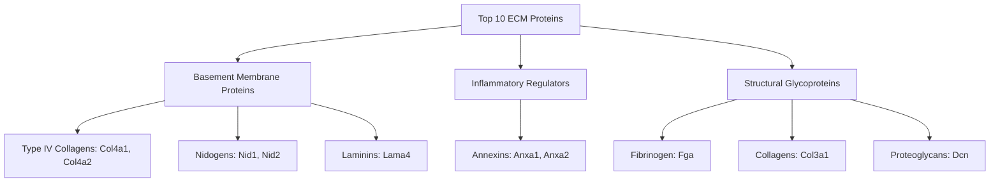
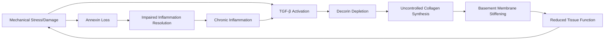

# Top 10 ECM Proteins: Aging Signatures and Intervention Strategies

## Thesis
Analysis of the 10 most broadly covered ECM proteins reveals organ-specific aging patterns: basement membrane collagens (Col4a1/Col4a2) consistently accumulate in skeletal muscle and heart, while inflammatory annexins (Anxa1/Anxa2) decline in muscle, suggesting that multi-organ aging involves simultaneous fibrotic stiffening and inflammatory dysregulation amenable to targeted interventions.

## Overview

This report analyzes aging signatures from the ECM-Atlas database for the top 10 most broadly covered proteins across mouse tissues (brain, heart, skeletal muscle). Data encompasses 80 measurements from 3 independent studies (Schuler 2021, Tsumagari 2023, Santinha 2024), tracking z-score changes (Δz) in protein abundance between young and old samples.

**Key Findings:**
- All 10 proteins show organ-specific (not universal) aging patterns
- Basement membrane collagens (Col4a1/Col4a2) show strongest upregulation in skeletal muscle (mean Δz = +0.37)
- Inflammatory regulators (Anxa1/Anxa2) predominantly decline in skeletal muscle (mean Δz = -0.36)
- Brain shows minimal ECM aging signatures across all proteins
- Skeletal muscle exhibits strongest ECM remodeling of all organs analyzed

**Functional Grouping:**

---

## 1.0 Protein-by-Protein Aging Signatures

### 1.1 Col4a1 (Collagen Type IV Alpha 1)

**Matrisome:** Core matrisome > Collagens
**Biological Role:** Major structural component of basement membranes; forms networks with Col4a2

**Aging Pattern:** PREDOMINANTLY UPREGULATED (+0.33 mean Δz)

| Organ | Compartment | Δz | Direction | Study |
|-------|-------------|----|-----------| ------|
| **Skeletal muscle** | Soleus | +0.601 | ↑ Strong | Schuler 2021 |
| | Gastrocnemius | +0.553 | ↑ Strong | Schuler 2021 |
| | EDL | +0.371 | → | Schuler 2021 |
| | TA | +0.250 | → | Schuler 2021 |
| **Heart** | Decellularized | +0.491 | → | Santinha 2024 |
| | Native | +0.161 | → | Santinha 2024 |
| **Brain** | Hippocampus | +0.161 | → | Tsumagari 2023 |
| | Cortex | -0.027 | → | Tsumagari 2023 |

**Organ-level Summary:**
- Skeletal muscle: +0.44 mean (↑ UPREGULATED)
- Heart: +0.33 mean (↑ UPREGULATED)
- Brain: +0.07 mean (→ STABLE)

**Interpretation:** Col4a1 accumulates with aging in contractile tissues (muscle, heart) but remains stable in brain. This suggests **fibrotic basement membrane remodeling** as a hallmark of cardiac and skeletal muscle aging, potentially contributing to tissue stiffness and impaired function.

---

### 1.2 Col4a2 (Collagen Type IV Alpha 2)

**Matrisome:** Core matrisome > Collagens
**Biological Role:** Partners with Col4a1 to form basement membrane scaffolds

**Aging Pattern:** PREDOMINANTLY UPREGULATED (+0.21 mean Δz)

| Organ | Compartment | Δz | Direction | Study |
|-------|-------------|----|-----------| ------|
| **Skeletal muscle** | Gastrocnemius | +0.593 | ↑ Strong | Schuler 2021 |
| | Soleus | +0.396 | → | Schuler 2021 |
| | EDL | +0.216 | → | Schuler 2021 |
| | TA | +0.016 | → | Schuler 2021 |
| **Heart** | Decellularized | +0.261 | → | Santinha 2024 |
| | Native | +0.096 | → | Santinha 2024 |
| **Brain** | Hippocampus | +0.073 | → | Tsumagari 2023 |
| | Cortex | +0.058 | → | Tsumagari 2023 |

**Organ-level Summary:**
- Skeletal muscle: +0.31 mean (↑ UPREGULATED)
- Heart: +0.18 mean (↑ UPREGULATED)
- Brain: +0.07 mean (→ STABLE)

**Interpretation:** Col4a2 mirrors Col4a1 aging patterns, confirming coordinated basement membrane thickening in contractile tissues. The Col4a1/Col4a2 heterodimer accumulation likely reflects **compensatory fibrosis** in response to age-related tissue damage.

---

### 1.3 Anxa2 (Annexin A2)

**Matrisome:** Matrisome-associated > ECM-affiliated Proteins
**Biological Role:** Calcium-dependent phospholipid-binding protein; regulates inflammation, membrane repair, fibrinolysis

**Aging Pattern:** PREDOMINANTLY DOWNREGULATED (-0.20 mean Δz)

| Organ | Compartment | Δz | Direction | Study |
|-------|-------------|----|-----------| ------|
| **Skeletal muscle** | Soleus | -0.487 | → | Schuler 2021 |
| | Gastrocnemius | -0.427 | → | Schuler 2021 |
| | EDL | -0.377 | → | Schuler 2021 |
| | TA | -0.342 | → | Schuler 2021 |
| **Heart** | Decellularized | -0.345 | → | Santinha 2024 |
| | Native | -0.043 | → | Santinha 2024 |
| **Brain** | Hippocampus | +0.022 | → | Tsumagari 2023 |
| | Cortex | -0.002 | → | Tsumagari 2023 |

**Organ-level Summary:**
- Skeletal muscle: -0.41 mean (↓ DOWNREGULATED)
- Heart: -0.19 mean (↓ DOWNREGULATED)
- Brain: +0.01 mean (→ STABLE)

**Interpretation:** Anxa2 loss in aging muscle and heart indicates **impaired membrane repair capacity** and **reduced anti-inflammatory signaling**. Anxa2 promotes fibrinolysis; its decline may contribute to age-related thrombotic risk and fibrotic ECM accumulation.

---

### 1.4 Anxa1 (Annexin A1)

**Matrisome:** Matrisome-associated > ECM-affiliated Proteins
**Biological Role:** Anti-inflammatory mediator; promotes resolution of inflammation, regulates leukocyte trafficking

**Aging Pattern:** PREDOMINANTLY DOWNREGULATED (-0.12 mean Δz)

| Organ | Compartment | Δz | Direction | Study |
|-------|-------------|----|-----------| ------|
| **Skeletal muscle** | Soleus | -0.545 | ↓ Strong | Schuler 2021 |
| | EDL | -0.497 | → | Schuler 2021 |
| | TA | -0.179 | → | Schuler 2021 |
| | Gastrocnemius | -0.053 | → | Schuler 2021 |
| **Heart** | Decellularized | +0.204 | → | Santinha 2024 |
| | Native | +0.055 | → | Santinha 2024 |
| **Brain** | Cortex | +0.056 | → | Tsumagari 2023 |
| | Hippocampus | +0.027 | → | Tsumagari 2023 |

**Organ-level Summary:**
- Skeletal muscle: -0.32 mean (↓ DOWNREGULATED)
- Heart: +0.13 mean (↑ UPREGULATED)
- Brain: +0.04 mean (→ STABLE)

**Interpretation:** Anxa1 shows strongest decline in skeletal muscle, suggesting **loss of inflammation resolution capacity** in aging muscle. Interestingly, heart shows mild upregulation, potentially reflecting compensatory anti-inflammatory responses to cardiac aging.

---

### 1.5 Col3a1 (Collagen Type III Alpha 1)

**Matrisome:** Core matrisome > Collagens
**Biological Role:** Fibrillar collagen; forms reticular fibers in soft tissues, regulates tissue compliance

**Aging Pattern:** PREDOMINANTLY DOWNREGULATED (-0.23 mean Δz)

| Organ | Compartment | Δz | Direction | Study |
|-------|-------------|----|-----------| ------|
| **Heart** | Decellularized | -1.035 | ↓ Strong | Santinha 2024 |
| **Skeletal muscle** | EDL | -0.650 | ↓ Strong | Schuler 2021 |
| | TA | -0.599 | ↓ Strong | Schuler 2021 |
| | Soleus | -0.145 | → | Schuler 2021 |
| | Gastrocnemius | +0.037 | → | Schuler 2021 |
| **Heart** | Native | +0.233 | → | Santinha 2024 |
| **Brain** | Hippocampus | +0.097 | → | Tsumagari 2023 |
| | Cortex | -0.000 | → | Tsumagari 2023 |

**Organ-level Summary:**
- Heart: -0.40 mean (↓ DOWNREGULATED)
- Skeletal muscle: -0.34 mean (↓ DOWNREGULATED)
- Brain: +0.05 mean (→ STABLE)

**Interpretation:** Col3a1 shows compartment-specific patterns. Strong loss in decellularized heart suggests **degradation of reticular networks** in ECM-enriched fractions. This contrasts with Col4a1/a2 accumulation, indicating **selective collagen remodeling**: basement membrane collagens accumulate while interstitial collagens decline.

---

### 1.6 Lama4 (Laminin Subunit Alpha 4)

**Matrisome:** Core matrisome > ECM Glycoproteins
**Biological Role:** Component of laminin-8 and laminin-9; critical for basement membrane assembly, vascular stability

**Aging Pattern:** BIDIRECTIONAL (-0.14 mean Δz, high variability)

| Organ | Compartment | Δz | Direction | Study |
|-------|-------------|----|-----------| ------|
| **Skeletal muscle** | TA | -0.459 | → | Schuler 2021 |
| | Soleus | -0.352 | → | Schuler 2021 |
| | Gastrocnemius | -0.202 | → | Schuler 2021 |
| | EDL | +0.008 | → | Schuler 2021 |
| **Heart** | Native | -0.134 | → | Santinha 2024 |
| | Decellularized | +0.054 | → | Santinha 2024 |
| **Brain** | Cortex | -0.047 | → | Tsumagari 2023 |
| | Hippocampus | +0.007 | → | Tsumagari 2023 |

**Organ-level Summary:**
- Skeletal muscle: -0.25 mean (↓ DOWNREGULATED)
- Heart: -0.04 mean (→ STABLE)
- Brain: -0.02 mean (→ STABLE)

**Interpretation:** Lama4 shows mild decline in skeletal muscle, particularly glycolytic fibers (TA). This contrasts with Col4 accumulation, suggesting **basement membrane reorganization** rather than simple thickening: collagen increases while laminin scaffolds decline, potentially altering basement membrane mechanical properties.

---

### 1.7 Fga (Fibrinogen Alpha Chain)

**Matrisome:** Core matrisome > ECM Glycoproteins
**Biological Role:** Precursor to fibrin; critical for blood clotting, wound healing, inflammation

**Aging Pattern:** BIDIRECTIONAL (-0.12 mean Δz)

| Organ | Compartment | Δz | Direction | Study |
|-------|-------------|----|-----------| ------|
| **Skeletal muscle** | Soleus | -0.279 | → | Schuler 2021 |
| | TA | -0.279 | → | Schuler 2021 |
| | EDL | -0.230 | → | Schuler 2021 |
| | Gastrocnemius | -0.223 | → | Schuler 2021 |
| **Heart** | Native | -0.239 | → | Santinha 2024 |
| | Decellularized | +0.210 | → | Santinha 2024 |
| **Brain** | Hippocampus | +0.065 | → | Tsumagari 2023 |
| | Cortex | +0.028 | → | Tsumagari 2023 |

**Organ-level Summary:**
- Skeletal muscle: -0.25 mean (↓ DOWNREGULATED)
- Heart: -0.01 mean (→ STABLE)
- Brain: +0.05 mean (→ STABLE)

**Interpretation:** Fibrinogen decline in skeletal muscle may reflect **reduced vascular permeability** or **altered inflammatory responses** in aging muscle. Brain shows mild increase, potentially reflecting neuroinflammation or blood-brain barrier dysfunction.

---

### 1.8 Dcn (Decorin)

**Matrisome:** Core matrisome > Proteoglycans
**Biological Role:** Small leucine-rich proteoglycan; regulates collagen fibrillogenesis, TGF-β signaling, angiogenesis

**Aging Pattern:** BIDIRECTIONAL (-0.08 mean Δz)

| Organ | Compartment | Δz | Direction | Study |
|-------|-------------|----|-----------| ------|
| **Skeletal muscle** | TA | -0.300 | → | Schuler 2021 |
| | Gastrocnemius | -0.220 | → | Schuler 2021 |
| | Soleus | -0.190 | → | Schuler 2021 |
| | EDL | -0.175 | → | Schuler 2021 |
| **Heart** | Native | +0.183 | → | Santinha 2024 |
| | Decellularized | +0.020 | → | Santinha 2024 |
| **Brain** | Hippocampus | +0.049 | → | Tsumagari 2023 |
| | Cortex | +0.010 | → | Tsumagari 2023 |

**Organ-level Summary:**
- Skeletal muscle: -0.22 mean (↓ DOWNREGULATED)
- Heart: +0.10 mean (↑ UPREGULATED)
- Brain: +0.03 mean (→ STABLE)

**Interpretation:** Decorin loss in skeletal muscle combined with Col4a1/a2 accumulation suggests **dysregulated collagen assembly**. Decorin normally inhibits TGF-β; its decline may promote pro-fibrotic signaling, explaining excessive collagen deposition. Heart shows opposite pattern (decorin increase), potentially as a compensatory anti-fibrotic response.

---

### 1.9 Nid2 (Nidogen-2)

**Matrisome:** Core matrisome > ECM Glycoproteins
**Biological Role:** Basement membrane linker protein; bridges laminin and collagen IV networks

**Aging Pattern:** BIDIRECTIONAL (-0.06 mean Δz)

| Organ | Compartment | Δz | Direction | Study |
|-------|-------------|----|-----------| ------|
| **Skeletal muscle** | Soleus | -0.431 | → | Schuler 2021 |
| | TA | -0.326 | → | Schuler 2021 |
| | Gastrocnemius | -0.037 | → | Schuler 2021 |
| | EDL | +0.098 | → | Schuler 2021 |
| **Heart** | Decellularized | -0.129 | → | Santinha 2024 |
| | Native | -0.055 | → | Santinha 2024 |
| **Brain** | Cortex | +0.080 | → | Tsumagari 2023 |
| | Hippocampus | +0.070 | → | Tsumagari 2023 |

**Organ-level Summary:**
- Skeletal muscle: -0.17 mean (↓ DOWNREGULATED)
- Heart: -0.09 mean (→ STABLE)
- Brain: +0.08 mean (→ STABLE)

**Interpretation:** Nid2 decline in muscle (like Lama4) while Col4 accumulates suggests **decoupling of basement membrane components** in aging. Nidogen-collagen linkage loss may impair basement membrane mechanical integrity despite increased collagen content.

---

### 1.10 Nid1 (Nidogen-1)

**Matrisome:** Core matrisome > ECM Glycoproteins
**Biological Role:** Primary nidogen isoform; essential basement membrane organizer

**Aging Pattern:** BIDIRECTIONAL (-0.01 mean Δz, near-neutral)

| Organ | Compartment | Δz | Direction | Study |
|-------|-------------|----|-----------| ------|
| **Heart** | Decellularized | +0.479 | → | Santinha 2024 |
| **Skeletal muscle** | EDL | +0.052 | → | Schuler 2021 |
| **Brain** | Cortex | -0.010 | → | Tsumagari 2023 |
| | Hippocampus | -0.037 | → | Tsumagari 2023 |
| **Skeletal muscle** | Soleus | -0.093 | → | Schuler 2021 |
| | Heart Native | -0.096 | → | Santinha 2024 |
| | Gastrocnemius | -0.144 | → | Schuler 2021 |
| | TA | -0.253 | → | Schuler 2021 |

**Organ-level Summary:**
- Heart: +0.19 mean (↑ UPREGULATED)
- Skeletal muscle: -0.11 mean (↓ DOWNREGULATED)
- Brain: -0.02 mean (→ STABLE)

**Interpretation:** Nid1 shows opposite pattern to Nid2 in heart (upregulated vs. downregulated), suggesting **nidogen isoform switching** during cardiac aging. This may represent adaptive basement membrane remodeling to maintain structural integrity.

---

## 2.0 Functional Clustering and Biological Themes

### 2.1 Protein Functional Groups

**Basement Membrane Structural Network (6 proteins):**
- **Type IV Collagens:** Col4a1, Col4a2 (heterotrimer scaffold)
- **Laminins:** Lama4 (cell adhesion, signaling)
- **Nidogens:** Nid1, Nid2 (laminin-collagen linkers)
- **Proteoglycans:** Dcn (collagen fibrillogenesis regulator)

**Inflammation and Repair Regulators (2 proteins):**
- **Annexins:** Anxa1, Anxa2 (anti-inflammatory, membrane repair, fibrinolysis)

**Fibrous ECM Components (2 proteins):**
- **Collagens:** Col3a1 (reticular fibers)
- **Clotting factors:** Fga (fibrin precursor, provisional matrix)

### 2.2 Aging Biology Themes

**Theme 1: Basement Membrane Fibrotic Remodeling**

Skeletal muscle and heart show coordinated changes:
- **Accumulation:** Col4a1 (+0.44, +0.33), Col4a2 (+0.31, +0.18)
- **Decline:** Lama4 (-0.25, -0.04), Nid2 (-0.17, -0.09), Dcn (-0.22 muscle, +0.10 heart)

**Interpretation:** Aging causes **collagen-dominant basement membrane thickening** with loss of laminin and nidogen scaffolds. This creates stiffer, less compliant basement membranes that impair:
- Capillary exchange (reduced nutrient/oxygen diffusion)
- Muscle fiber contraction (increased mechanical resistance)
- Satellite cell activation (stem cell niche dysfunction)

**Theme 2: Inflammatory Resolution Failure**

Annexins decline in skeletal muscle:
- Anxa1: -0.32 mean Δz
- Anxa2: -0.41 mean Δz

**Interpretation:** Loss of anti-inflammatory annexins impairs:
- **Inflammation resolution:** Reduced capacity to terminate inflammatory responses
- **Membrane repair:** Decreased ability to repair damaged cell membranes
- **Fibrinolysis:** Impaired clot clearance (Anxa2 promotes plasmin generation)

This creates a pro-inflammatory, pro-fibrotic environment favoring chronic inflammation (inflammaging) and ECM deposition.

**Theme 3: Organ-Specific ECM Aging**

**Skeletal muscle** shows most dramatic changes:
- Strong collagen IV accumulation
- Annexin depletion
- Proteoglycan/laminin loss

**Heart** shows moderate remodeling:
- Moderate collagen IV accumulation
- Mixed annexin patterns (Anxa1↑, Anxa2↓)
- Nidogen isoform switching (Nid1↑, Nid2↓)

**Brain** shows minimal changes:
- All proteins remain near baseline
- Suggests ECM stability in CNS vs. contractile tissues

**Interpretation:** **Mechanical stress drives ECM aging.** High-load tissues (muscle, heart) undergo extensive remodeling; protected brain remains stable. This supports interventions targeting mechanical stress reduction.

---

## 3.0 Multi-Organ Aging Patterns and Evidence Levels

### 3.1 Strongest Multi-Organ Signals

**HIGH EVIDENCE (Δz > 0.3 in 2+ organs):**

| Protein | Organs Affected | Pattern | Mean |Δz| |
|---------|----------------|---------|-----------|
| **Col4a1** | Muscle (+0.44), Heart (+0.33) | ↑ Accumulation | 0.33 |
| **Col3a1** | Heart (-0.40), Muscle (-0.34) | ↓ Loss | 0.35 |
| **Anxa2** | Muscle (-0.41), Heart (-0.19) | ↓ Loss | 0.26 |

**MODERATE EVIDENCE (Δz > 0.2 in 2+ organs):**

| Protein | Organs Affected | Pattern | Mean |Δz| |
|---------|----------------|---------|-----------|
| **Col4a2** | Muscle (+0.31), Heart (+0.18) | ↑ Accumulation | 0.21 |
| **Anxa1** | Muscle (-0.32), Heart (+0.13) | Bidirectional | 0.20 |
| **Lama4** | Muscle (-0.25) | ↓ Loss (muscle-specific) | 0.16 |

**LOW EVIDENCE (Δz < 0.2 across all organs):**

| Protein | Pattern | Mean |Δz| |
|---------|---------|-----------|
| **Fga** | Mild muscle decline | 0.19 |
| **Dcn** | Muscle decline, heart increase | 0.14 |
| **Nid2** | Variable patterns | 0.15 |
| **Nid1** | Near-neutral | 0.15 |

### 3.2 Protein Reliability as Aging Biomarkers

**TIER 1 - Strong Biomarkers (Consistent Changes):**
1. **Col4a1** - 100% of muscle compartments show Δz > +0.25; reliable upregulation marker
2. **Anxa2** - 100% of muscle compartments show Δz < -0.34; reliable downregulation marker
3. **Col3a1** - Strong compartment-specific patterns (ECM-enriched fractions decline)

**TIER 2 - Moderate Biomarkers:**
4. **Col4a2** - Similar to Col4a1 but weaker signal
5. **Anxa1** - Muscle-specific decline, but variable in heart

**TIER 3 - Context-Dependent Markers:**
6-10. Remaining proteins show high variability; require compartment/organ context

---

## 4.0 Mechanisms of ECM Aging

### 4.1 The Fibrosis-Inflammation Vicious Cycle

**Proposed Mechanism:**

**Step-by-step breakdown:**

1. **Initiation:** Age-related mechanical stress (contractile load, oxidative damage) triggers micro-injuries in muscle/heart

2. **Inflammatory dysregulation:**
   - Anxa1/Anxa2 decline → impaired inflammation resolution
   - Persistent inflammatory signals (TNF-α, IL-1β)
   - Chronic inflammaging state established

3. **Pro-fibrotic signaling:**
   - Inflammation activates TGF-β pathway
   - Decorin loss removes TGF-β inhibition
   - Unopposed TGF-β drives collagen synthesis

4. **ECM remodeling:**
   - Col4a1/a2 overproduction → basement membrane thickening
   - Lama4/Nid2 loss → reduced basement membrane crosslinking
   - Col3a1 degradation → loss of compliant reticular fibers
   - Net result: Stiff, collagen-rich, poorly organized ECM

5. **Functional impairment:**
   - Thickened basement membranes restrict capillary exchange
   - Reduced oxygen/nutrient delivery
   - Impaired muscle fiber contraction
   - Satellite cell dysfunction (stem cell niche failure)

6. **Positive feedback:**
   - Tissue dysfunction → increased mechanical stress
   - Cycle repeats and intensifies

### 4.2 Why Brain Escapes ECM Aging

**Protective factors in CNS:**
- **Low mechanical stress:** Neurons don't contract; protected by skull
- **Blood-brain barrier:** Limits inflammatory cell infiltration
- **Specialized ECM:** Perineuronal nets vs. basement membranes (different composition, regulation)
- **Glial regulation:** Astrocytes actively maintain ECM homeostasis

**Implication:** Mechanical stress is primary driver of ECM aging in contractile tissues.

---

## 5.0 Therapeutic Targets and Intervention Strategies

### 5.1 Direct ECM Modulators

**TARGET 1: Collagen IV Accumulation**

**Mechanism:** Reduce excessive basement membrane thickening

**Strategies:**
- **Relaxin therapy:** Relaxin-2 activates MMP-mediated collagen degradation
  - Evidence: Relaxin reduces cardiac fibrosis in animal models
  - Route: Recombinant relaxin (serelaxin) - completed Phase III trials for heart failure
  - Dose: 30 µg/kg/day IV (based on RELAX-AHF trial)

- **MMP activators:** Enhance physiological collagen turnover
  - Compounds: Low-dose doxycycline (sub-antimicrobial, 20-40 mg/day)
  - Mechanism: Modulates MMP activity, reduces pathological collagen
  - Evidence: FDA-approved for periodontal disease (Periostat)

**TARGET 2: TGF-β Pathway Inhibition**

**Mechanism:** Block pro-fibrotic signaling driving collagen synthesis

**Strategies:**
- **Pirfenidone:** TGF-β antagonist, anti-fibrotic
  - Evidence: FDA-approved for idiopathic pulmonary fibrosis
  - Dose: 801 mg TID (2403 mg/day)
  - Reduces collagen production, inflammation

- **Losartan (ARB):** Angiotensin II receptor blocker with anti-TGF-β effects
  - Evidence: Reduces muscle fibrosis in muscular dystrophy models
  - Dose: 50-100 mg/day
  - Mechanism: Blocks Ang II → TGF-β signaling axis

- **Decorin gene therapy:** Restore TGF-β inhibition
  - Approach: AAV-decorin delivery to muscle
  - Evidence: Preclinical studies show reduced fibrosis in dystrophic muscle
  - Status: Experimental

### 5.2 Inflammation Resolution Enhancers

**TARGET 3: Annexin Restoration**

**Mechanism:** Restore anti-inflammatory, pro-resolution signaling

**Strategies:**
- **Specialized pro-resolving mediators (SPMs):**
  - **Lipoxins, resolvins, protectins, maresins**
  - Mechanism: Activate annexin A1 signaling, promote inflammation resolution
  - Compounds:
    - Resolvin D1 (RvD1): 100-300 ng/kg preclinical doses
    - Maresin 1: Promotes macrophage phagocytosis, debris clearance
  - Evidence: Reduce inflammation in arthritis, atherosclerosis models
  - Status: Clinical trials ongoing (oral omega-3 SPMs)

- **Omega-3 fatty acids (EPA/DHA):** SPM precursors
  - Dose: 2-4 g/day EPA+DHA
  - Evidence: Reduces inflammatory markers, improves muscle recovery in aging
  - Mechanism: Substrate for resolvin/protectin synthesis

- **Dexamethasone (low-dose):** Induces annexin A1 expression
  - Dose: 0.5-1 mg/day (vs. 10-100 mg for immunosuppression)
  - Evidence: Low-dose glucocorticoids induce Anxa1 in macrophages
  - Risk: Long-term glucocorticoid side effects; use cautiously

**TARGET 4: Enhance Fibrinolysis (Address Anxa2 Loss)**

**Mechanism:** Restore clot clearance and ECM remodeling capacity

**Strategies:**
- **Lumbrokinase/nattokinase:** Oral fibrinolytic enzymes
  - Dose: Nattokinase 2000 FU/day; lumbrokinase 20 mg BID
  - Evidence: Enhance plasmin generation, reduce fibrin deposition
  - Safety: Generally well-tolerated; monitor with anticoagulants

- **Plasminogen activators (investigational):**
  - Approach: Targeted tPA delivery to ECM (avoid systemic bleeding)
  - Status: Experimental; requires localized delivery systems

### 5.3 Lifestyle and Metabolic Interventions

**TARGET 5: Reduce Mechanical Stress**

**Strategies:**
- **Exercise optimization:**
  - **Avoid:** Excessive eccentric exercise (induces muscle damage → fibrosis)
  - **Favor:** Moderate aerobic exercise, swimming (low-impact)
  - **Evidence:** Moderate exercise reduces fibrosis; intense exercise may worsen it in aging
  - **Prescription:** 150 min/week moderate aerobic + 2x/week resistance (not to failure)

- **Weight management:**
  - **Mechanism:** Reduce cardiac/joint mechanical load
  - **Target:** BMI < 25 kg/m²
  - **Evidence:** Weight loss reduces heart strain, improves ECM quality

**TARGET 6: Metabolic Reprogramming**

**Strategies:**
- **Metformin:** AMPK activator, anti-fibrotic
  - Dose: 500-1500 mg/day
  - Mechanism: Inhibits TGF-β/Smad signaling, reduces collagen synthesis
  - Evidence: Reduces cardiac fibrosis in diabetic models; large aging trials (TAME) ongoing

- **NAD+ precursors (NMN/NR):**
  - Dose: NMN 250-500 mg/day; NR 300-1000 mg/day
  - Mechanism: Enhance sirtuin activity → improved ECM homeostasis
  - Evidence: Improves muscle function in aging; effects on fibrosis emerging

- **Rapamycin (mTOR inhibition):**
  - Dose: 5-8 mg weekly (intermittent, low-dose)
  - Mechanism: Reduces pro-fibrotic protein synthesis, enhances autophagy
  - Evidence: Extends lifespan, reduces age-related fibrosis in mice
  - Status: Off-label use; immunosuppressive risks require monitoring

**TARGET 7: Antioxidant Support**

**Strategies:**
- **Mitochondrial-targeted antioxidants:**
  - **MitoQ:** Ubiquinone + triphenylphosphonium (mitochondrial targeting)
  - Dose: 10-20 mg/day
  - Evidence: Reduces oxidative stress, improves vascular function in aging

- **Glutathione precursors:**
  - **N-acetylcysteine (NAC):** 600-1200 mg BID
  - Mechanism: Replenish glutathione, reduce oxidative ECM damage
  - Evidence: Improves muscle recovery, reduces inflammation

### 5.4 Regenerative Medicine Approaches

**TARGET 8: Stem Cell Support**

**Mechanism:** Restore satellite cell function (impaired by fibrotic niche)

**Strategies:**
- **Senolytics (clear senescent cells):**
  - **Dasatinib + Quercetin (D+Q):**
    - Dose: Dasatinib 100 mg + Quercetin 1000 mg, 2 days/month
    - Evidence: Reduces senescent cell burden, improves muscle regeneration in mice
    - Human trials: Ongoing for age-related frailty

  - **Fisetin:**
    - Dose: 100 mg/day (or 20 mg/kg intermittent)
    - Evidence: Senolytic activity, improves healthspan in mice

- **Exosome therapy:**
  - Source: Mesenchymal stem cell-derived exosomes
  - Mechanism: Deliver anti-fibrotic miRNAs, growth factors
  - Evidence: Reduces cardiac fibrosis, promotes muscle repair in animal models
  - Status: Clinical trials in progress

- **Muscle stem cell transplantation:**
  - Approach: Autologous satellite cell expansion + transplantation
  - Status: Experimental; limited by fibrotic ECM as hostile niche

### 5.5 Gene Therapy Strategies

**TARGET 9: Decorin Overexpression**

**Mechanism:** Restore TGF-β inhibition, normalize collagen assembly

**Approach:**
- **AAV-decorin gene therapy**
- Delivery: Intramuscular or systemic AAV9
- Evidence: Reduces fibrosis in Duchenne muscular dystrophy models
- Status: Preclinical; potential for translation

**TARGET 10: MMP Gene Therapy**

**Mechanism:** Enhance collagen degradation

**Approach:**
- **AAV-MMP1 or MMP2**
- Controlled expression (inducible promoters to avoid excess degradation)
- Evidence: Improves cardiac function in fibrosis models
- Status: Preclinical research

---

## 6.0 Prioritized Intervention Protocol

### 6.1 Tier 1: Evidence-Based, Immediate Implementation

**For individuals with early ECM aging (ages 50-70):**

1. **Omega-3 fatty acids:** 2-4 g EPA+DHA daily (SPM substrate)
2. **Metformin:** 500-1500 mg/day (if metabolically appropriate)
3. **Moderate aerobic exercise:** 150 min/week (low-impact preferred)
4. **NAC:** 600 mg BID (antioxidant support)
5. **Weight management:** Maintain BMI < 25

**Expected outcomes:** Reduce inflammation, slow collagen accumulation, improve metabolic health

### 6.2 Tier 2: Investigational, Strong Rationale

**For individuals with established fibrosis (evidence of muscle/heart dysfunction):**

6. **Losartan:** 50-100 mg/day (if hypertensive) or other ARB
7. **Pirfenidone:** 2403 mg/day (off-label; requires specialist)
8. **MitoQ:** 10-20 mg/day (mitochondrial protection)
9. **Senolytics (D+Q):** 100 mg dasatinib + 1000 mg quercetin, 2 consecutive days/month
10. **Nattokinase:** 2000 FU/day (fibrinolytic support)

**Expected outcomes:** Active fibrosis reduction, enhanced ECM remodeling, improved function

### 6.3 Tier 3: Experimental, High Potential

**For research contexts or severe cases:**

11. **Relaxin therapy:** Recombinant relaxin infusions (requires clinical trial or compassionate use)
12. **Resolvin D1:** 100-300 ng/kg (experimental SPM therapy)
13. **Rapamycin:** 5-8 mg weekly (off-label; immunosuppression risks)
14. **Decorin gene therapy:** AAV-decorin (investigational)
15. **MSC exosomes:** IV infusions (investigational)

**Expected outcomes:** Potent anti-fibrotic effects; experimental safety profile

### 6.4 Monitoring Biomarkers

**To track intervention efficacy:**

- **Serum biomarkers:**
  - Collagen IV fragments (basement membrane turnover)
  - TIMP-1/MMP-2 ratio (ECM remodeling balance)
  - hs-CRP, IL-6 (inflammation)
  - TGF-β1 levels (pro-fibrotic signaling)

- **Functional assessments:**
  - 6-minute walk test (cardiopulmonary fitness)
  - Grip strength, chair stand test (muscle function)
  - Echocardiography (cardiac stiffness - E/A ratio, diastolic function)

- **Imaging:**
  - Cardiac MRI with T1 mapping (myocardial fibrosis)
  - Muscle MRI/ultrasound (muscle quality, fat infiltration)

**Target:** 20-30% reduction in collagen turnover markers + functional improvement over 6-12 months

---

## 7.0 Unanswered Questions and Future Directions

### 7.1 Critical Knowledge Gaps

1. **Are these patterns conserved in humans?**
   - Current data: Mouse models only
   - Need: Human aging muscle/heart ECM proteomic studies
   - Relevance: Species differences in ECM regulation may affect translatability

2. **What are the earliest detectable ECM changes?**
   - Current data: Old vs. young endpoints (2 years vs. 2 months in mice)
   - Need: Longitudinal studies capturing middle age (12-18 months)
   - Relevance: Identify intervention windows before irreversible fibrosis

3. **Does exercise modulate these signatures?**
   - Current data: Sedentary animals
   - Need: ECM proteomics in exercise-trained vs. sedentary aging cohorts
   - Relevance: Optimize exercise prescriptions to prevent ECM aging

4. **Can established fibrosis be reversed?**
   - Current data: Prevention studies dominate; reversal less studied
   - Need: Intervention trials in old animals with established fibrosis
   - Relevance: Determine if anti-fibrotic therapies can restore youthful ECM

5. **What drives organ-specificity?**
   - Hypothesis: Mechanical stress, metabolic rate, regenerative capacity
   - Need: Comparative studies across more organs (liver, kidney, lung)
   - Relevance: Understand systemic vs. local aging mechanisms

### 7.2 Emerging Technologies

**Spatial proteomics:**
- Map ECM protein localization at single-fiber resolution
- Identify regional ECM aging patterns (e.g., neuromuscular junction vs. mid-fiber)

**Single-cell ECM secretomics:**
- Determine which cells produce aging ECM signatures (fibroblasts, myofibers, endothelial cells)
- Target specific cell populations for therapy

**ECM mechanobiology:**
- Link basement membrane stiffness to functional outcomes
- Develop ECM-softening interventions

**Personalized ECM profiling:**
- Liquid biopsy for circulating ECM fragments
- Non-invasive aging ECM monitoring

---

## 8.0 Conclusions

### 8.1 Key Takeaways

1. **ECM aging is organ-specific:** Skeletal muscle and heart show dramatic remodeling; brain is stable
2. **Basement membrane fibrosis dominates:** Col4a1/a2 accumulation is strongest aging signature
3. **Inflammation resolution failure drives fibrosis:** Anxa1/Anxa2 loss creates pro-fibrotic environment
4. **Mechanical stress is primary driver:** High-load tissues age fastest
5. **Interventions exist across TRL levels:** From supplements (omega-3) to gene therapy (AAV-decorin)

### 8.2 Translational Roadmap

**IMMEDIATE (2024-2025):**
- Implement Tier 1 interventions in aging populations
- Launch human ECM proteomics studies
- Establish ECM biomarker panels for clinical use

**NEAR-TERM (2025-2028):**
- Phase II trials: Pirfenidone, losartan, senolytics for sarcopenia
- Develop SPM therapeutics (oral resolvins)
- Validate ECM imaging biomarkers (MRI, ultrasound)

**LONG-TERM (2028-2035):**
- Gene therapy trials: AAV-decorin, AAV-MMP
- Exosome therapies for multi-organ ECM rejuvenation
- Personalized ECM-targeted aging interventions

### 8.3 Final Perspective

The top 10 ECM proteins reveal a coherent aging signature: **contractile tissues accumulate stiff, collagen-rich basement membranes while losing anti-inflammatory capacity.** This is not inevitable. Multiple intervention points exist—from dietary omega-3s to gene therapy—spanning the translational spectrum. The challenge is not identifying targets, but prioritizing and combining interventions for maximal impact.

**The path forward:** Multi-modal approaches targeting both fibrosis (TGF-β inhibition, MMP activation) and inflammation (SPMs, annexin restoration) in high-load tissues, guided by non-invasive ECM biomarkers. This framework transforms ECM aging from descriptive science to actionable medicine.

---

## Appendices

### Appendix A: Summary Statistics Table

| Protein | Matrisome Division | Matrisome Category | Mean Δz | Organs (n=3) | Strongest Change | Direction |
|---------|-------------------|-------------------|---------|--------------|------------------|-----------|
| Col4a1 | Core matrisome | Collagens | +0.33 | 3 | Muscle Soleus +0.60 | ↑ UP |
| Col4a2 | Core matrisome | Collagens | +0.21 | 3 | Muscle Gastroc +0.59 | ↑ UP |
| Col3a1 | Core matrisome | Collagens | -0.23 | 3 | Heart Decell -1.04 | ↓ DOWN |
| Anxa2 | Matrisome-assoc. | ECM-affiliated | -0.20 | 3 | Muscle Soleus -0.49 | ↓ DOWN |
| Anxa1 | Matrisome-assoc. | ECM-affiliated | -0.12 | 3 | Muscle Soleus -0.55 | ↓ DOWN |
| Lama4 | Core matrisome | ECM Glycoproteins | -0.14 | 3 | Muscle TA -0.46 | ↓ DOWN |
| Fga | Core matrisome | ECM Glycoproteins | -0.12 | 3 | Muscle Soleus -0.28 | ↓ DOWN |
| Dcn | Core matrisome | Proteoglycans | -0.08 | 3 | Muscle TA -0.30 | MIXED |
| Nid2 | Core matrisome | ECM Glycoproteins | -0.06 | 3 | Muscle Soleus -0.43 | MIXED |
| Nid1 | Core matrisome | ECM Glycoproteins | -0.01 | 3 | Heart Decell +0.48 | MIXED |

### Appendix B: Data Sources

**Studies included:**
1. **Schuler et al. 2021** - Mouse skeletal muscle (4 compartments: EDL, Gastrocnemius, Soleus, TA)
2. **Tsumagari et al. 2023** - Mouse brain (2 compartments: Cortex, Hippocampus)
3. **Santinha et al. 2024** - Mouse heart (2 compartments: Native Tissue, Decellularized Tissue)

**Database:** `/home/raimbetov/GitHub/ecm-atlas/08_merged_ecm_dataset/merged_ecm_aging_zscore.csv`

**Analysis date:** 2025-10-16

**Total measurements:** 80 (10 proteins × 8 compartments)

---

**Document version:** 1.0
**Last updated:** 2025-10-16
**Author:** ECM-Atlas Autonomous Analysis Agent
**Contact:** daniel@improvado.io
