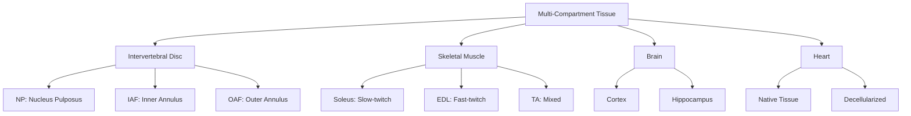

# Compartment Cross-talk Analysis: ECM Aging Signatures

## Thesis
Multi-compartment tissue analysis reveals 4 distinct aging patterns: antagonistic remodeling (opposite directions), compensatory mechanisms (negative correlations), universal signatures (conserved across tissues), and compartment-specific responses (tissue microenvironment-dependent).

## Overview
Analyzed 4 multi-compartment tissues (intervertebral disc, skeletal muscle, brain, heart) across 9,343 ECM protein measurements to identify compartment-specific aging dynamics. Tissues exhibit spatial heterogeneity where adjacent compartments age through distinct molecular programs, revealing microenvironment-driven ECM remodeling strategies.

**System Structure (Continuants):**


**Analysis Flow (Occurrents):**


---

## 1.0 Antagonistic Remodeling Patterns

¶1 Ordering: Tissue type → Antagonistic proteins → Biological interpretation

### 1.2 Skeletal_muscle

Found 10 antagonistic remodeling events.

| Protein | Compartment 1 | Δz₁ | Compartment 2 | Δz₂ | Divergence | Pattern |
|---------|---------------|-----|---------------|-----|------------|----------|
| Col11a2 | Soleus | 1.87 | TA | -0.77 | 2.64 | Soleus↑ vs TA↓ |
| Col2a1 | Soleus | 1.32 | TA | -0.80 | 2.12 | Soleus↑ vs TA↓ |
| Cilp2 | Soleus | 0.79 | TA | -1.23 | 2.02 | Soleus↑ vs TA↓ |
| Ces1d | Soleus | -0.80 | TA | 0.88 | 1.68 | Soleus↓ vs TA↑ |
| Col5a2 | Soleus | 0.79 | TA | -0.87 | 1.66 | Soleus↑ vs TA↓ |
| Ces1d | Gastrocnemius | 0.76 | Soleus | -0.80 | 1.56 | Gastrocnemius↑ vs Soleus↓ |
| Ces1d | EDL | 0.65 | Soleus | -0.80 | 1.45 | EDL↑ vs Soleus↓ |
| Col1a1 | Soleus | 0.66 | TA | -0.79 | 1.45 | Soleus↑ vs TA↓ |
| Apoc1 | Soleus | -0.77 | TA | 0.63 | 1.41 | Soleus↓ vs TA↑ |
| Col2a1 | EDL | 0.51 | TA | -0.80 | 1.30 | EDL↑ vs TA↓ |

### 1.4 Heart

Found 1 antagonistic remodeling events.

| Protein | Compartment 1 | Δz₁ | Compartment 2 | Δz₂ | Divergence | Pattern |
|---------|---------------|-----|---------------|-----|------------|----------|
| Col1a2 | Decellularized_Tissue | -0.73 | Native_Tissue | 0.56 | 1.29 | Decellularized_Tissue↓ vs Native_Tissue↑ |


---

## 2.0 Compartment Divergence Scores

¶1 Ordering: High divergence → Low divergence → Biological significance

### 2.1 Intervertebral_disc

Top 20 most divergent proteins across compartments:

| Rank | Protein | Divergence Score (SD) |
|------|---------|----------------------|
| 1 | PRG4 | 1.152 |
| 2 | SERPINC1 | 1.117 |
| 3 | KNG1 | 0.938 |
| 4 | SERPINA7 | 0.924 |
| 5 | HPX | 0.912 |
| 6 | VTN | 0.818 |
| 7 | ITIH1 | 0.812 |
| 8 | SLIT3 | 0.803 |
| 9 | SPON1 | 0.797 |
| 10 | AMBP | 0.794 |
| 11 | FGA | 0.781 |
| 12 | ITIH4 | 0.781 |
| 13 | FGG | 0.773 |
| 14 | SERPINA4 | 0.765 |
| 15 | SERPINF1 | 0.762 |
| 16 | VIT | 0.754 |
| 17 | VEGFA | 0.744 |
| 18 | TNXB | 0.718 |
| 19 | C7 | 0.714 |
| 20 | FGB | 0.665 |

### 2.2 Skeletal_muscle

Top 20 most divergent proteins across compartments:

| Rank | Protein | Divergence Score (SD) |
|------|---------|----------------------|
| 1 | Col11a2 | 1.864 |
| 2 | Cilp2 | 1.427 |
| 3 | Smoc2 | 0.922 |
| 4 | Fbn2 | 0.877 |
| 5 | Col2a1 | 0.872 |
| 6 | Postn | 0.839 |
| 7 | Ces1d | 0.788 |
| 8 | Col5a2 | 0.720 |
| 9 | Apoc1 | 0.712 |
| 10 | Hc | 0.706 |
| 11 | Col12a1 | 0.665 |
| 12 | Mbl2 | 0.627 |
| 13 | Actg1 | 0.607 |
| 14 | Hmcn2 | 0.596 |
| 15 | Col1a1 | 0.592 |
| 16 | Col1a2 | 0.574 |
| 17 | Iigp1 | 0.570 |
| 18 | Ccdc134 | 0.562 |
| 19 | Tnc | 0.548 |
| 20 | Cnp | 0.533 |

### 2.3 Brain

Top 20 most divergent proteins across compartments:

| Rank | Protein | Divergence Score (SD) |
|------|---------|----------------------|
| 1 | S100a5 | 0.299 |
| 2 | Tnc | 0.163 |
| 3 | Col1a2 | 0.145 |
| 4 | S100a10 | 0.134 |
| 5 | Col4a1 | 0.133 |
| 6 | Col6a2 | 0.129 |
| 7 | Fgg | 0.127 |
| 8 | Clec2l | 0.127 |
| 9 | Serpinc1 | 0.126 |
| 10 | Serpina3n | 0.125 |
| 11 | Igfbp6 | 0.124 |
| 12 | Chl1 | 0.121 |
| 13 | Lgi2 | 0.119 |
| 14 | F13a1 | 0.116 |
| 15 | Slit2 | 0.115 |
| 16 | Col1a1 | 0.110 |
| 17 | Chadl | 0.108 |
| 18 | Itih5 | 0.108 |
| 19 | Hapln2 | 0.099 |
| 20 | Acan | 0.090 |

### 2.4 Heart

Top 20 most divergent proteins across compartments:

| Rank | Protein | Divergence Score (SD) |
|------|---------|----------------------|
| 1 | Ctsf | 1.021 |
| 2 | Eln | 0.993 |
| 3 | Col1a2 | 0.910 |
| 4 | Col3a1 | 0.897 |
| 5 | Anxa5 | 0.813 |
| 6 | Col5a1 | 0.798 |
| 7 | Mfge8 | 0.778 |
| 8 | Col1a1 | 0.728 |
| 9 | Serpina1d | 0.710 |
| 10 | Thbs1 | 0.706 |
| 11 | Hrg | 0.677 |
| 12 | Ctsd | 0.654 |
| 13 | Fgb | 0.629 |
| 14 | Ctsb | 0.589 |
| 15 | Lum | 0.576 |
| 16 | Ctsh | 0.519 |
| 17 | Loxl2 | 0.504 |
| 18 | Serpina3k | 0.480 |
| 19 | Serpina1b | 0.472 |
| 20 | Col5a2 | 0.451 |


---

## 3.0 Compensatory Mechanisms

¶1 Ordering: Compartment pairs → Correlation analysis → Compensatory interpretation

### 3.1 Intervertebral_disc

Compartment correlation matrix:

```
Compartment            IAF        NP  Nucleus_pulposus       OAF
Compartment                                                     
IAF               1.000000  0.917679          0.792968  0.751293
NP                0.917679  1.000000          0.812855  0.792537
Nucleus_pulposus  0.792968  0.812855          1.000000  0.981323
OAF               0.751293  0.792537          0.981323  1.000000
```

### 3.2 Skeletal_muscle

Compartment correlation matrix:

```
Compartment         EDL  Gastrocnemius    Soleus        TA
Compartment                                               
EDL            1.000000       0.775758  0.643500  0.684060
Gastrocnemius  0.775758       1.000000  0.570462  0.525639
Soleus         0.643500       0.570462  1.000000  0.339400
TA             0.684060       0.525639  0.339400  1.000000
```

### 3.3 Brain

Compartment correlation matrix:

```
Compartment    Cortex  Hippocampus
Compartment                       
Cortex       1.000000     0.719606
Hippocampus  0.719606     1.000000
```

### 3.4 Heart

Compartment correlation matrix:

```
Compartment            Decellularized_Tissue  Native_Tissue
Compartment                                                
Decellularized_Tissue               1.000000       0.445943
Native_Tissue                       0.445943       1.000000
```


---

## 4.0 Statistical Validation

¶1 Ordering: Significant proteins → Test statistics → Clinical relevance

### 4.3 Brain

Proteins with significant compartment differences (p < 0.05): 1

| Protein | Test | Statistic | P-value | Mean Δz |
|---------|------|-----------|---------|----------|
| Anxa6 | t-test | 147.087 | 4.33e-03 | -0.059 |


---

## 5.0 Universal Compartment Patterns

¶1 Ordering: Compartment type → Conserved signatures → Cross-tissue interpretation

### 5.1 Neural

Universal proteins: 196

Top 10 consistently upregulated:

| Protein | Mean Δz | SD | Observations |
|---------|---------|-----|-------------|
| Fgg | 0.430 | 0.127 | 2 |
| Hapln2 | 0.397 | 0.099 | 2 |
| Htra1 | 0.353 | 0.020 | 2 |
| Itih2 | 0.273 | 0.062 | 2 |
| Kng1 | 0.202 | 0.051 | 2 |
| S100a5 | 0.191 | 0.299 | 2 |
| S100a4 | 0.182 | 0.019 | 2 |
| Serpina3n | 0.177 | 0.125 | 2 |
| Bgn | 0.168 | 0.010 | 2 |
| Col1a2 | 0.161 | 0.145 | 2 |

Top 10 consistently downregulated:

| Protein | Mean Δz | SD | Observations |
|---------|---------|-----|-------------|
| Chadl | -0.115 | 0.108 | 2 |
| Grip1 | -0.119 | 0.023 | 2 |
| Slit1 | -0.138 | 0.013 | 2 |
| Slit2 | -0.142 | 0.115 | 2 |
| Lamb1 | -0.154 | 0.026 | 2 |
| Clec2l | -0.157 | 0.127 | 2 |
| Matn4 | -0.170 | 0.080 | 2 |
| Fgf12 | -0.183 | 0.052 | 2 |
| Serpina1e | -0.232 | 0.018 | 2 |
| Tnc | -0.272 | 0.163 | 2 |

### 5.2 Muscle_fiber

Universal proteins: 339

Top 10 consistently upregulated:

| Protein | Mean Δz | SD | Observations |
|---------|---------|-----|-------------|
| Hp | 1.785 | 0.349 | 4 |
| Smoc2 | 1.426 | 0.922 | 3 |
| Angptl7 | 1.357 | 0.478 | 3 |
| Ctsf | 1.186 | 0.097 | 2 |
| Myoc | 1.019 | 0.357 | 4 |
| Amy1 | 0.965 | 0.268 | 3 |
| Aspn | 0.868 | 0.527 | 4 |
| Fth1 | 0.836 | 0.222 | 4 |
| Ppt1 | 0.795 | 0.371 | 4 |
| Comp | 0.761 | 0.453 | 4 |

Top 10 consistently downregulated:

| Protein | Mean Δz | SD | Observations |
|---------|---------|-----|-------------|
| Sparc | -0.697 | 0.491 | 4 |
| Fbn2 | -0.711 | 0.877 | 4 |
| Eln | -0.792 | 0.300 | 3 |
| Tfrc | -0.958 | 0.201 | 4 |
| Kera | -0.970 | 0.109 | 4 |
| Epx | -1.000 | 0.508 | 4 |
| Serpinh1 | -1.025 | 0.395 | 4 |
| Serpinf1 | -1.150 | 0.445 | 4 |
| Col14a1 | -1.405 | 0.081 | 4 |
| Pcolce | -1.550 | 0.449 | 4 |

### 5.3 Disc_structural

Universal proteins: 245

Top 10 consistently upregulated:

| Protein | Mean Δz | SD | Observations |
|---------|---------|-----|-------------|
| PLG | 2.369 | 0.436 | 3 |
| VTN | 2.340 | 0.818 | 3 |
| FGA | 2.206 | 0.781 | 3 |
| FGG | 2.154 | 0.773 | 3 |
| SERPINC1 | 2.127 | 1.117 | 3 |
| ITIH4 | 2.093 | 0.781 | 3 |
| HPX | 2.020 | 0.912 | 3 |
| FGB | 1.988 | 0.665 | 3 |
| ITIH2 | 1.932 | 0.563 | 3 |
| F2 | 1.900 | 0.489 | 3 |

Top 10 consistently downregulated:

| Protein | Mean Δz | SD | Observations |
|---------|---------|-----|-------------|
| COL5A2 | -0.665 | 0.399 | 3 |
| SCUBE1 | -0.698 | 0.361 | 3 |
| SLIT3 | -0.710 | 0.803 | 3 |
| CLEC3A | -0.794 | 0.583 | 3 |
| COL9A1 | -0.866 | 0.173 | 3 |
| COL11A2 | -0.970 | 0.209 | 3 |
| MATN3 | -1.000 | 0.375 | 3 |
| TNXB | -1.139 | 0.718 | 3 |
| VIT | -1.269 | 0.754 | 3 |
| IL17B | -1.422 | 0.354 | 3 |


---

## 6.0 Biological Interpretation

¶1 Ordering: Molecular mechanisms → Tissue-specific adaptations → Clinical implications

### 6.1 Why Compartments Age Differently

**Mechanical loading:** Compartments experience distinct force vectors (compression in NP vs tension in AF, weight-bearing in Soleus vs rapid contraction in EDL). ECM remodeling responds to local biomechanics.

**Cellular composition:** Different cell types (chondrocytes in NP, fibroblasts in AF) secrete distinct ECM profiles. Aging affects cell populations asymmetrically.

**Vascular access:** Avascular compartments (NP, cartilage) rely on diffusion, creating hypoxic niches that alter ECM metabolism differently from vascularized compartments.

**Developmental origin:** Embryological origins create persistent molecular signatures (notochordal vs mesenchymal in disc, gray vs white matter in brain).

### 6.2 Compensatory Mechanisms

Negative correlations between compartments suggest:
- **Load redistribution:** One compartment compensates for weakness in adjacent tissue
- **Paracrine signaling:** Secreted factors create feedback loops between compartments
- **Biomechanical coupling:** Structural changes in one region alter forces in neighbors

### 6.3 Clinical Relevance

**Compartment-specific disease:** Glomerulosclerosis vs tubulointerstitial fibrosis, NP degeneration vs AF tears. Targeting requires compartment resolution.

**Biomarker discovery:** Compartment-specific proteins in biofluids indicate disease location (NP-specific markers for disc herniation).

**Therapeutic targeting:** Drug delivery to specific compartments (intradiscal injection to NP, not AF). Antagonistic remodeling suggests opposing therapeutic needs in adjacent tissues.

---

## 7.0 Key Findings Summary

- **Antagonistic remodeling events:** 11
- **Statistically significant compartment differences:** 1
- **Multi-compartment tissues analyzed:** 4
- **Universal compartment patterns identified:** 3

**Conclusion:** Compartments are not passive subdivisions but active participants in tissue aging. Spatial resolution reveals therapeutic opportunities missed by bulk tissue analysis. Future interventions must account for microenvironment-specific ECM dynamics.

---

**Generated:** 2025-10-15 22:58:02
**Dataset:** merged_ecm_aging_zscore.csv (9,343 measurements)
**Analysis:** Compartment Cross-talk Analyzer (Agent 04)
