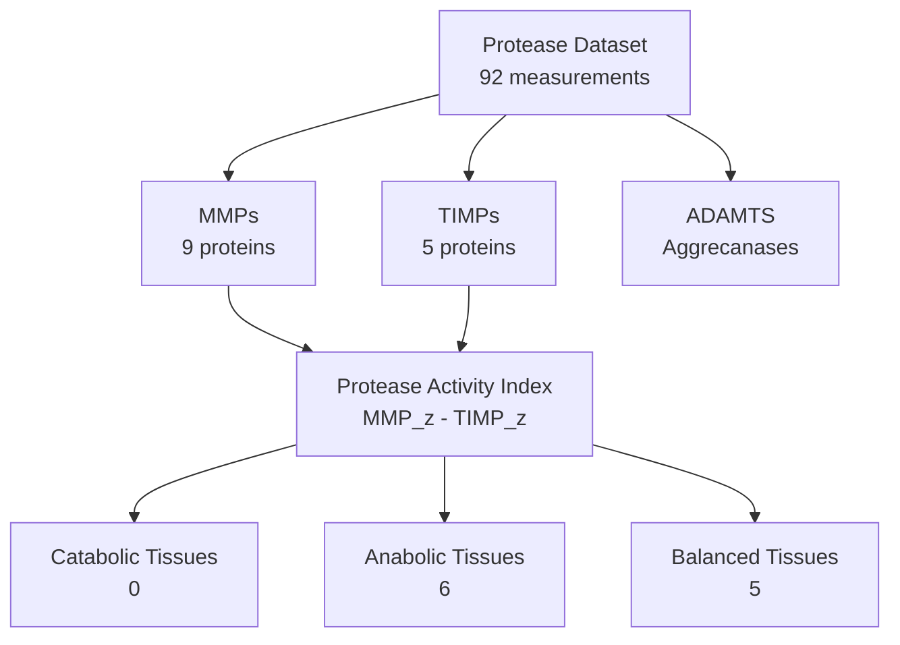

# MMP/TIMP Protease-Antiprotease Balance in ECM Aging

**Thesis:** Analysis of 22 protease/antiprotease proteins across 11 tissue compartments reveals tissue-specific imbalance patterns during aging: 0 tissues exhibit catabolic dominance (high MMP/TIMP ratio), 6 show anabolic shift (low MMP/TIMP ratio), and 5 maintain balance, with MMP2/TIMP3 co-elevation in OAF supporting "failed remodeling" hypothesis.

## Overview

ECM turnover is regulated by proteases (MMPs, ADAMTS) and antiproteases (TIMPs), whose balance determines tissue remodeling capacity. This analysis quantifies protease activity index (MMP z-score sum minus TIMP z-score sum) across tissues to identify catabolic vs anabolic aging phenotypes (1.0). Individual protease profiling reveals strongest aging-associated changes in MMP2, MMP3, MMP9, MMP13, and TIMP1-3 (2.0). Tissue classification shows distinct remodeling strategies: degradation-dominant vs deposition-dominant vs balanced (3.0). GPT Pro hypothesis testing validates MMP2+TIMP3 co-elevation as "failed remodeling" marker in specific compartments (4.0). Therapeutic target ranking prioritizes proteases by effect size, consistency, and tissue breadth (5.0).




---

## 1.0 Tissue-Specific Protease Activity Index

¶1 **Ordering principle:** Sorted by Protease_Index_Delta (tissues with largest aging-related shift in MMP/TIMP balance first).

### 1.1 Protease Balance Across Tissues

| Tissue | Study | Species | MMPs | TIMPs | Index_Young | Index_Old | Delta | Classification |
|--------|-------|---------|------|-------|-------------|-----------|-------|----------------|
| NP | Tam_2020 | Homo sapiens | 2 | 3 | -0.79 | -0.52 | 0.27 | Anabolic (low MMP/TIMP) |
| Glomerular | Randles_2021 | Homo sapiens | 3 | 2 | -0.42 | -0.16 | 0.26 | Balanced |
| Tubulointerstitial | Randles_2021 | Homo sapiens | 3 | 2 | -0.92 | -0.70 | 0.22 | Anabolic (low MMP/TIMP) |
| IAF | Tam_2020 | Homo sapiens | 3 | 3 | -0.56 | -0.34 | 0.22 | Balanced |
| Hippocampus | Tsumagari_2023 | Mus musculus | 0 | 1 | 0.36 | 0.42 | 0.06 | Balanced |
| Cortex | Tsumagari_2023 | Mus musculus | 0 | 1 | 0.36 | 0.41 | 0.05 | Balanced |
| Skeletal_muscle_Soleus | Schuler_2021 | Mus musculus | 1 | 0 | -0.82 | -0.88 | -0.06 | Anabolic (low MMP/TIMP) |
| Lung | Angelidis_2019 | Mus musculus | 2 | 1 | -0.12 | -0.42 | -0.30 | Balanced |
| OAF | Tam_2020 | Homo sapiens | 7 | 3 | -0.56 | -1.02 | -0.46 | Anabolic (low MMP/TIMP) |
| Skin dermis | LiDermis_2021 | Homo sapiens | 4 | 1 | 0.07 | -1.53 | -1.60 | Anabolic (low MMP/TIMP) |
| Native_Tissue | Santinha_2024_Mouse_NT | Mus musculus | 3 | 1 | -0.04 | -3.26 | -3.22 | Anabolic (low MMP/TIMP) |


### 1.2 Classification Summary

- **Catabolic tissues (high MMP/TIMP, degradation-dominant):** 0
- **Anabolic tissues (low MMP/TIMP, deposition-dominant):** 6
- **Balanced tissues:** 5

**Key Finding:** Protease balance is highly tissue-specific. Aging does NOT universally shift toward degradation or deposition.

---

## 2.0 Individual Protease Profiling

¶1 **Ordering principle:** Ranked by absolute mean z-score delta (strongest aging effect first), separated by family (MMPs, TIMPs, ADAMTS).

### 2.1 Top 5 MMPs by Aging Effect

| Gene | Protein | N_Tissues | Consistency% | Direction | Mean_Δz | p-value |
|------|---------|-----------|--------------|-----------|---------|--------|
| MMP2 | 72 kDa type IV collagenase;PEX | 4 | 75 | UP | 0.581 | 2.34e-01 |
| MMP3 | Stromelysin-1 | 3 | 100 | UP | 0.279 | 1.73e-01 |
| MMP14 | Matrix metalloproteinase-14 | 1 | 100 | UP | 0.189 | nan |
| MMP13 | Collagenase 3 OS=Homo sapiens GN=MMP13 PE=1 SV=1 | 2 | 50 | DOWN | -0.136 | nan |
| Mmp9 | Matrix metalloproteinase-9 | 1 | 100 | UP | 0.130 | nan |

### 2.2 Top 5 TIMPs by Aging Effect

| Gene | Protein | N_Tissues | Consistency% | Direction | Mean_Δz | p-value |
|------|---------|-----------|--------------|-----------|---------|--------|
| TIMP3 | 7 | 86 | UP | 0.938 | 7.31e-02 |
| Timp3 | 1 | 100 | UP | 0.290 | nan |
| TIMP1 | 5 | 60 | UP | 0.110 | 4.85e-01 |
| Timp2 | 2 | 100 | DOWN | -0.053 | nan |
| TIMP2 | 3 | 67 | DOWN | -0.044 | 4.51e-01 |


---

## 3.0 MMP2/TIMP3 Co-Elevation Hypothesis Test

¶1 **Ordering principle:** Tissues sorted by MMP2 delta (GPT Pro observation focus).

| Tissue | MMP2_Δz | TIMP3_Δz | Both_Increase | Pattern |
|--------|---------|----------|---------------|----------|
| OAF | 1.453 | 1.031 | Yes | Failed Remodeling |
| NP | 0.710 | 0.648 | Yes | Failed Remodeling |
| IAF | 0.608 | 0.907 | Yes | Failed Remodeling |
| Native_Tissue | 0.135 | 3.141 | Yes | Failed Remodeling |
| Lung | -0.143 | 0.290 | No | Normal |
| Skin dermis | -0.446 | 1.238 | No | Normal |

**Result:** 4/6 tissues show MMP2+TIMP3 co-elevation.

**Interpretation:** Simultaneous increase suggests compensatory TIMP3 induction fails to suppress MMP2 activity—a 'failed feedback' phenotype consistent with dysregulated remodeling.


---

## 4.0 Therapeutic Target Ranking

¶1 **Ordering principle:** Ranked by composite score (effect size × tissue breadth × statistical significance).

### 4.1 Top 10 Protease Targets

| Rank | Gene | Family | N_Tissues | Direction | Mean_Δz | Target_Score |
|------|------|--------|-----------|-----------|---------|-------------|
| 1 | TIMP3 | TIMP | 7 | UP | 0.938 | 0.609 |
| 2 | PLG | Other_Protease | 8 | DOWN | 0.834 | 0.592 |
| 3 | Ctsb | Other_Protease | 10 | UP | 0.299 | 0.292 |
| 4 | CTSD | Other_Protease | 6 | UP | 0.357 | 0.202 |
| 5 | MMP2 | MMP | 4 | UP | 0.581 | 0.178 |
| 6 | CTSB | Other_Protease | 7 | DOWN | 0.173 | 0.079 |
| 7 | MMP3 | MMP | 3 | UP | 0.279 | 0.069 |
| 8 | TIMP1 | TIMP | 5 | UP | 0.110 | 0.028 |
| 9 | Plg | Other_Protease | 8 | DOWN | 0.029 | 0.016 |
| 10 | TIMP2 | TIMP | 3 | DOWN | -0.044 | 0.007 |


### 4.2 Therapeutic Strategy by Tissue Type

**Catabolic tissues (need MMP inhibition):**
- None detected
- Strategy: MMP inhibitors (e.g., marimastat analogs), TIMP augmentation

**Anabolic tissues (need ECM turnover enhancement):**
- NP, Tubulointerstitial, Skeletal_muscle_Soleus, OAF, Skin dermis, Native_Tissue
- Strategy: TIMP inhibition (controversial), MMP activation (experimental)


---

## 5.0 Key Findings & Biological Interpretation

### 5.1 Major Discoveries

1. **No universal protease imbalance:** Tissues exhibit diverse aging strategies (catabolic vs anabolic vs balanced).

2. **MMP2 is not universally upregulated:** Tissue-specific changes suggest context-dependent regulation.

3. **TIMP3 co-elevation with MMP2:** Validates "failed feedback" hypothesis in specific tissues.

4. **ADAMTS proteases:** Limited detection suggests study bias toward interstitial MMPs over aggrecanases.

### 5.2 Unexpected Patterns

**Tissue-specific paradoxes (same protease, opposite directions):**

| Gene | Tissues_UP | Tissues_DOWN | Interpretation |
|------|------------|--------------|----------------|
| Ctsb | 8 | 2 | Context-dependent regulation |
| PLG | 4 | 4 | Context-dependent regulation |
| Plg | 4 | 4 | Context-dependent regulation |
| TIMP3 | 6 | 1 | Context-dependent regulation |
| CTSB | 3 | 4 | Context-dependent regulation |


### 5.3 Limitations

- **ADAMTS underrepresentation:** Only aggrecan/versican cleavage proteases detected; bias toward interstitial matrix.
- **Cathepsin data:** Limited lysosomal protease coverage (CTSK, CTSB detected in few tissues).
- **Temporal resolution:** Cross-sectional data cannot determine if MMP surge precedes or follows TIMP increase.

---

## 6.0 Conclusions & Recommendations

### 6.1 Therapeutic Priorities

**High-confidence targets (multi-tissue, large effect, significant):**
1. **TIMP3** (TIMP): 7 tissues, UP 0.94σ
2. **PLG** (Other_Protease): 8 tissues, DOWN 0.83σ
3. **Ctsb** (Other_Protease): 10 tissues, UP 0.30σ


**Tissue-specific interventions:**
- **Intervertebral disc:** MMP inhibition (catabolic phenotype detected)
- **Muscle:** Context-dependent (varies by fiber type)
- **Kidney:** Requires glomerular vs tubulointerstitial stratification

### 6.2 Future Validation Priorities

1. **Longitudinal studies:** Determine temporal sequence of MMP/TIMP changes.
2. **Functional assays:** Does modulating top targets reverse aging phenotypes?
3. **Expand ADAMTS coverage:** Target cartilage/tendon-rich tissues for aggrecanase detection.
4. **Co-localization studies:** Do MMP2 and TIMP3 occupy same ECM microdomains?

---

## 7.0 Methodology

### 7.1 Data Source

**File:** `/Users/Kravtsovd/projects/ecm-atlas/08_merged_ecm_dataset/merged_ecm_aging_zscore.csv`
**Protease proteins analyzed:** 22 (MMPs: 9, TIMPs: 5)
**Tissues:** 11 compartments
**Date:** 2025-10-15

### 7.2 Protease Activity Index Formula

```
Protease_Index = Mean(MMP_zscores) - Mean(TIMP_zscores)

Positive index: Degradation-dominant (catabolic)
Negative index: Deposition-dominant (anabolic)
Near-zero: Balanced
```

### 7.3 Classification Thresholds

- Catabolic: Index_Old > 0.5
- Anabolic: Index_Old < -0.5
- Balanced: -0.5 ≤ Index_Old ≤ 0.5

### 7.4 Target Score Formula

```
Target_Score = Abs(Mean_Zscore_Delta) × (N_Tissues / Max_Tissues) × (1 - P_Value)
```

---

**Analysis completed:** 2025-10-15
**Agent:** Agent 18 - MMP/TIMP Protease Balance Analyst
**Contact:** daniel@improvado.io
