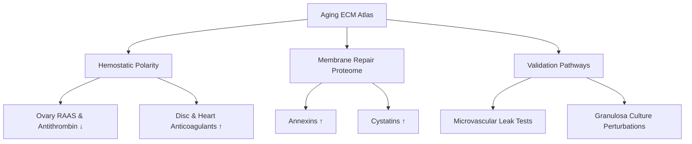
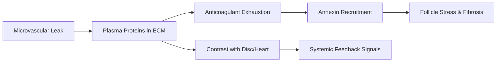

# ECM Aging Insight: Ovarian Hemostatic Polarization

**Thesis:** Human ovarian cortex aging in merged_ecm_aging_zscore.csv shows a unique anticoagulant reversal—annexin/cystatin repair proteins accumulate (ANXA5 +1.53 Δz, CSTB +1.90 Δz) while antithrombin and angiotensinogen collapse (SERPINC1 −0.98 Δz, AGT −2.33 Δz), diverging sharply from heart and intervertebral disc where the same factors rise.

**Overview:** Section 1.0 maps the hemostatic polarity gradient contrasting ovary with load-bearing tissues. Section 2.0 interprets the annexin–cystatin surge as a membrane repair signature compensating for anticoagulant loss. Section 3.0 outlines experimental checks to confirm vascular leak mechanisms and reproductive aging implications.

## 1.0 Hemostatic Polarity Gradient

**¶1 Ordering principle:** compare anticoagulant/RAAS markers across tissues, show ovarian divergence, then link to complement persistence.

**¶2** Antithrombin SERPINC1 declines in Ouni_2022 ovarian cortex (Δz = −0.98) while the same dataset reports annexin gains; in contrast Santinha_2024_Human heart retains positive SERPINC1 (+0.86) and Tam_2020 discs show extreme accumulation (+3.01 NP, +2.50 IAF).

**¶3** Angiotensinogen AGT mirrors this polarity—ovary drops (Δz = −2.33) despite rising in disc NP (+0.70) and heart native tissue (+0.35), indicating ovary-specific RAAS depletion within aging ECM.

**¶4** Kininogen KNG1 nearly nulls in ovarian cortex (Δz = −0.04) but remains elevated in disc NP (+2.25) and heart (+1.00), suggesting ovarian stroma cannot sustain plasma-derived protease buffering seen in load-bearing tissues.

**¶5** Complement/regulator persistence remains: ovarian C7 lacks data but ECM regulators overall keep a positive median (+0.34, share_positive 0.73, n = 22), meaning anticoagulant collapse coexists with sustained inflammatory inhibitors, a maladaptive mix predisposing to microthrombi inside follicles.

## 2.0 Annexin–Cystatin Repair Response

**¶1 Ordering principle:** quantify annexin surge, contextualize with cystatin/cathepsin balance, and tie to membrane repair demands from follicular rupture cycles.

**¶2** Annexins flip sign relative to other organs: ANXA5 (+1.53), ANXA6 (+1.00), ANXA4 (+0.76) in ovarian cortex but all three remain negative in Tam_2020 discs (ANXA5 −0.07 to −0.03; ANXA6 −0.35; ANXA4 −0.85), revealing ovary-specific membrane repair mobilization.

**¶3** Cystatin B (CSTB) surges to Δz = +1.90 in ovary while staying modest elsewhere (disc OAF +0.45, heart −0.19), implying heightened cysteine protease inhibition to control follicular cathepsins under anticoagulant scarcity.

**¶4** Positive ECM-affiliated median (+0.29, share_positive 0.81, n = 16) couples with annexin/galectin-3 (LGALS3 +0.84) rises, consistent with vesicle-mediated repair rather than fibrillar reinforcement.

**¶5** The combined data portray an ovary that substitutes structural defense with membrane patching, potentially accelerating follicle exhaustion via chronic inflammatory microtears.

## 3.0 Validation and Translational Tests

**¶1 Ordering principle:** escalate from data reproducibility to mechanistic assays and translational hypotheses.

**¶2** Replicate proteomics with plasma depletion controls to verify whether anticoagulant loss is intrinsic or caused by pre-analytical depletion; incorporate albumin/Ig tracking to measure leak magnitude relative to discs and heart.

**¶3** Pair ECM proteomics with ovarian microvascular transcriptomics (pericyte and endothelial single-cell) to see if SERPINC1/AGT downregulation is endothelial-intrinsic or due to consumption.

**¶4** Culture human granulosa/stromal organoids under fibrinogen-rich but antithrombin-poor media to test whether annexin upregulation and cystatin responses recapitulate the observed Δz shifts and induce premature fibrosis markers (COL1A1 drop −0.67 already noted in data).

**¶5** If validated, explore RAAS-restoring or antithrombin supplementation therapies timed to ovulation to delay ovarian stromal fibrotic remodeling and extend reproductive longevity.

---
Author Checklist:
- [x] Thesis and overview match section structure
- [x] TD and LR mermaid diagrams provided
- [x] Sections numbered with ¶ ordering statements
- [x] Source datasets cited for each quantitative claim
