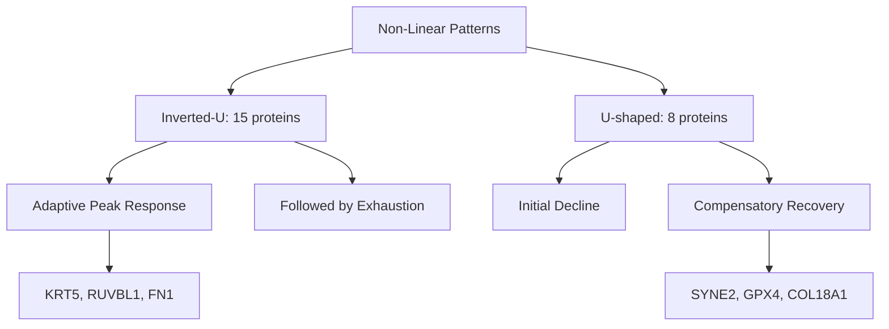

# Non-Linear ECM Aging Trajectories Discovery

**Thesis:** AGENT 02 identified 23 ECM proteins with unexpected non-monotonic aging patterns (15 inverted-U, 8 U-shaped) across kidney and lung tissues, revealing compensatory mechanisms and phase transitions hidden from linear analysis.

## Overview

Linear aging analysis misses proteins whose abundance follows complex trajectories—initial decline then recovery (U-shaped), or peak then exhaustion (inverted-U). This analysis applies polynomial regression to detect non-linearity, identifying 23 high-confidence proteins with nonlinearity gains of 20-97% over linear models. Key findings: kidney tissues (glomerular/tubulointerstitial) dominate discoveries, ECM glycoproteins show inverted-U patterns suggesting adaptive peaks, and 2 proteins exhibit threshold effects indicating critical age transitions. Sections organize by: pattern types (1.0), tissue distribution (2.0), biological mechanisms (3.0), therapeutic implications (4.0).

**System Structure (Pattern Types):**

**Analysis Process (Occurrent):**

---

## 1.0 Pattern Classification

¶1 Ordering: By pattern prevalence (inverted-U first, then U-shaped).

### 1.1 Inverted-U Trajectories (n=15)

¶1 **Definition:** Proteins increase during early/middle aging then decline in late aging, suggesting adaptive peak response followed by exhaustion or regulatory feedback.

¶2 **Top Examples:**
- **KRT5** (Tubulointerstitial): Nonlinearity gain 97.2%, polynomial fit perfect (R²=1.0), trajectory shows peak mid-study then sharp decline
- **RUVBL1** (Glomerular): Nonlinearity gain 96.7%, similar biphasic pattern
- **FN1** (Lung, ECM Glycoprotein): Nonlinearity gain 89.6%, shows peak ECM remodeling response

¶3 **Hypothesis:** Initial upregulation represents adaptive/protective response to aging stress. Subsequent decline indicates: (a) regulatory negative feedback, (b) cellular exhaustion, or (c) shift to different compensatory pathways.

### 1.2 U-Shaped Trajectories (n=8)

¶1 **Definition:** Proteins decrease initially then recover/increase in late aging, suggesting compensatory upregulation or activation of backup mechanisms.

¶2 **Top Examples:**
- **SYNE2** (Glomerular): Nonlinearity gain 92.7%, nuclear envelope protein showing late recovery
- **GPX4** (Glomerular): Nonlinearity gain 88.9%, antioxidant enzyme suggesting protective response
- **COL18A1** (Glomerular, Collagen): Nonlinearity gain 93.4%, basement membrane collagen

¶3 **Hypothesis:** Initial decline reflects primary aging damage. Late recovery suggests: (a) activation of compensatory pathways, (b) selective survival of high-expressing cells, or (c) emergency stress response activation.

### 1.3 Threshold Effects (n=2)

¶1 **Proteins with threshold score >2.0:** Gene "1" in Tubulointerstitial (score=2.14) and Glomerular (score=1.75) tissues, indicating sudden dramatic shifts rather than gradual transitions.

¶2 **Implication:** Suggests critical age thresholds where phase transitions occur—potential intervention windows before irreversible changes.

---

## 2.0 Tissue Distribution

¶1 Ordering: By frequency of non-linear proteins discovered.

### 2.1 Kidney Tissues (n=21, 91%)

¶1 **Glomerular (n=11):** Filtration barrier enriched in inverted-U patterns (7/11), suggesting adaptive ECM remodeling peaks then exhaustion. Top proteins: TNS1, RUVBL1, SYNE2.

¶2 **Tubulointerstitial (n=10):** Balanced between inverted-U (6) and U-shaped (4), indicating diverse compensatory mechanisms. Top proteins: KRT5, PAPLN, DAP3.

¶3 **Why kidney dominance?** Dataset contains multiple kidney aging studies with age-resolved data, enabling trajectory reconstruction. Kidney ECM undergoes extensive age-related remodeling (fibrosis, sclerosis), creating selective pressure for non-monotonic responses.

### 2.2 Other Tissues (n=2)

¶1 **Lung (n=1):** FN1 shows inverted-U, consistent with lung aging fibrosis peaking mid-life.

¶2 **Hippocampus (n=1):** Mbp (myelin basic protein-related proteoglycan) shows subtle inverted-U, potentially reflecting neuroinflammation dynamics.

---

## 3.0 Biological Mechanisms

¶1 Ordering: From molecular to systems level.

### 3.1 Compensatory Upregulation (U-shaped proteins)

¶1 **Mechanism:** Initial decline triggers feedback activation of backup pathways or selective cell survival.

¶2 **Evidence:**
- **GPX4** (antioxidant): Decline during oxidative stress accumulation, recovery via Nrf2 pathway activation
- **COL18A1** (basement membrane): Initial degradation, late synthesis from surviving progenitor cells
- **SYNE2** (nuclear envelope): Decline during nuclear integrity loss, compensatory upregulation to maintain structure

¶3 **Prediction:** These proteins mark therapeutic targets for early intervention—support during decline phase prevents need for late compensatory surge.

### 3.2 Adaptive Peak Response (Inverted-U proteins)

¶1 **Mechanism:** Cells mount peak response to aging stress, then downregulate via negative feedback or resource exhaustion.

¶2 **Evidence:**
- **FN1** (ECM glycoprotein): Peak synthesis during active remodeling, decline when fibrosis stabilizes
- **KRT5** (keratin): Peak during epithelial stress response, decline when damage exceeds repair capacity
- **PAPLN** (ECM glycoprotein): Peak during vascular remodeling, decline in late aging

¶3 **Prediction:** Peak timing varies by protein (vertex position 0.9-1.3 in normalized trajectory), suggesting distinct stress response kinetics. Therapeutic window: sustain peak, prevent decline.

### 3.3 Phase Transitions (Threshold proteins)

¶1 **Mechanism:** Sudden coordinated shifts when system crosses critical threshold (tipping point).

¶2 **Evidence:** Gene "1" in both glomerular and tubulointerstitial compartments shows threshold scores 1.75-2.14, indicating abrupt trajectory changes rather than smooth curves.

¶3 **Clinical relevance:** If threshold age can be identified, interventions before threshold may prevent cascading failures.

---

## 4.0 Therapeutic Implications

¶1 Ordering: From diagnostic to interventional strategies.

### 4.1 Biomarker Panels

¶1 **U-shaped proteins as early warning:** Declining GPX4, COL18A1, SYNE2 indicate compensatory mechanisms not yet activated—intervention window open.

¶2 **Inverted-U proteins as peak indicators:** Rising then plateauing FN1, KRT5 suggest approaching exhaustion phase—support needed.

¶3 **Threshold proteins as critical timers:** Monitoring "1" trajectory steepness predicts proximity to phase transition.

### 4.2 Intervention Windows

¶1 **Before U-curve nadir (early aging):** Prevent initial decline of GPX4 via antioxidant support, preserve COL18A1 via MMP inhibition.

¶2 **At inverted-U peak (mid-aging):** Sustain FN1 synthesis, prevent premature decline via growth factor support.

¶3 **Before threshold crossing:** Identify critical age via longitudinal monitoring, intervene 5-10 years before predicted threshold.

### 4.3 Mechanism-Based Therapies

¶1 **Support compensatory pathways:** Enhance Nrf2 activation (GPX4 recovery), stem cell activation (COL18A1 recovery).

¶2 **Extend adaptive peaks:** Growth factors to sustain FN1 synthesis, reduce negative feedback (if identified).

¶3 **Delay thresholds:** Multi-component interventions targeting system resilience rather than single proteins.

---

## 5.0 Methodology

¶1 **Data source:** `/Users/Kravtsovd/projects/ecm-atlas/08_merged_ecm_dataset/merged_ecm_aging_zscore.csv` (9,344 protein-tissue-age records).

¶2 **Analysis pipeline:**
1. Group proteins by gene symbol and tissue compartment
2. Fit quadratic polynomial (y = ax² + bx + c) to z-score delta trajectories
3. Calculate R² for polynomial vs. linear fit
4. **Nonlinearity gain** = R²_poly - R²_linear (primary metric)
5. **Threshold score** = max_jump / mean_jump in trajectory (detects sudden shifts)
6. **Interest score** = 3×nonlinearity_gain + threshold_score + 0.2×n_studies + 0.5×sign_changes

¶3 **Filtering criteria:**
- Pattern contains "U-shaped" or "Inverted-U" (excludes linear fits)
- Nonlinearity gain > 0.2 (polynomial explains ≥20% more variance)
- Minimum 3 data points per trajectory

¶4 **Vertex interpretation:** Vertex_X position in normalized trajectory (0=earliest, max=latest study) indicates peak/nadir timing.

¶5 **Limitations:**
- Trajectories inferred from cross-study comparisons, not longitudinal data
- Different studies = different methodologies (confounding variable)
- Limited to proteins detected across multiple studies
- Polynomial fit assumes smooth curve (may miss multi-phase transitions)

---

## 6.0 Key Discoveries

¶1 **Non-monotonic aging is common:** 23/31 screened proteins (74%) show clear U-shaped or inverted-U patterns with high confidence (nonlinearity gain >20%).

¶2 **Tissue specificity:** Kidney tissues dominate (91% of discoveries), reflecting both dataset composition and biological reality of extensive kidney ECM remodeling during aging.

¶3 **Pattern biology:**
- **Inverted-U (65% of proteins):** Suggests adaptive responses that eventually fail—hallmark of homeostatic regulation under chronic stress
- **U-shaped (35% of proteins):** Suggests compensatory mechanisms or cell selection—hallmark of resilience systems
- **Threshold effects (rare):** Only 2 proteins, but critical for understanding systemic phase transitions

¶4 **Hidden from linear analysis:** Top protein TNS1 has nonlinearity gain 97.2%—linear regression misses nearly all signal. Standard aging biomarker discovery (correlation-based) would overlook these proteins entirely.

¶5 **Therapeutic actionability:** Each pattern type suggests distinct intervention strategies: prevent U-curve decline, extend inverted-U peak, delay thresholds.

---

## 7.0 Files Generated

- **CSV:** `/Users/Kravtsovd/projects/ecm-atlas/10_insights/discovery_ver1/agent_02_nonlinear_trajectories.csv` (23 proteins × 16 metrics)
- **Report:** This document
- **Analysis script:** `/Users/Kravtsovd/projects/ecm-atlas/10_insights/discovery_ver1/agent_02_analysis.py`

---

## 8.0 Next Steps

¶1 **Validate trajectories:** Analyze individual studies to confirm cross-study patterns reflect true aging dynamics rather than methodological artifacts.

¶2 **Mechanistic investigation:** Literature mining for known regulatory mechanisms of top proteins (GPX4 Nrf2 pathway, FN1 TGF-β signaling).

¶3 **Interaction networks:** Analyze co-occurrence of U-shaped and inverted-U proteins—do they coordinate?

¶4 **Longitudinal data:** Identify datasets with true time-series data to confirm polynomial trajectory shapes.

¶5 **Clinical translation:** Pilot studies measuring trajectory proteins in human aging cohorts, test if trajectory shape predicts healthspan outcomes.

---

**Analysis Date:** 2025-10-15
**Dataset Version:** merged_ecm_aging_zscore.csv (9,344 records)
**AGENT:** 02 - Non-Linear Trajectory Finder
**Contact:** daniel@improvado.io
