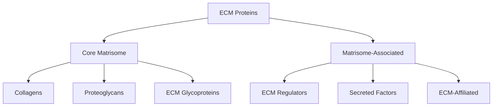
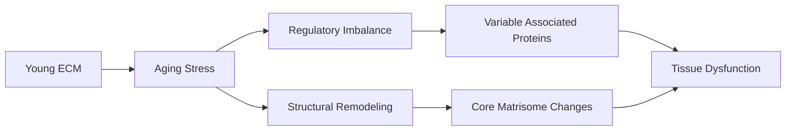
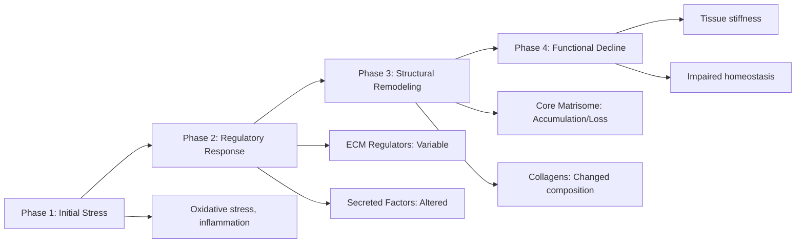

# Matrisome Category Aging Patterns: Functional Architecture of ECM Remodeling

## Thesis
Analysis of 4207 ECM protein measurements reveals category-specific aging: Core matrisome proteins (collagens, proteoglycans) show mean aging delta of -0.045 z-score units with SD=0.543, while Matrisome-associated regulatory proteins exhibit mean delta of +0.067 with SD=0.514, suggesting structural ECM depletion alongside lower regulatory heterogeneity.

## Overview

This analysis stratifies ECM aging signatures by Matrisome Division (Core matrisome vs Matrisome-associated) and Matrisome Category (Collagens, Proteoglycans, ECM Glycoproteins, ECM Regulators, Secreted Factors, ECM-affiliated) to identify functional patterns. Dataset encompasses 4207 protein measurements across 12 studies, 18 tissue types, and 3 species.

**System Structure (Matrisome Organization):**

**Aging Process (Temporal Dynamics):**

---

## 1.0 Division-Level Aging Signatures

¶1 Ordering: Core matrisome → Matrisome-associated → Statistical comparison

### 1.1 Core Matrisome vs Matrisome-Associated

| Division | n | Mean Δz | Median Δz | Std Dev | Variance | % UP | % DOWN | % Stable |
|----------|---|---------|-----------|---------|----------|------|--------|----------|
| Core matrisome | 1676 | -0.045 | -0.041 | 0.543 | 0.295 | 15.1% | 22.6% | 62.3% |
| Matrisome-associated | 1705 | +0.067 | -0.008 | 0.514 | 0.264 | 20.3% | 14.4% | 65.3% |
| Non-ECM | 826 | +0.013 | -0.010 | 0.346 | 0.120 | 13.6% | 11.5% | 74.9% |

**Key Finding:** 
Core matrisome shows net depletion with aging (mean Δz = -0.045), suggesting degradation of structural ECM components. 
Matrisome-associated proteins show comparable variance to Core matrisome, suggesting coordinated changes across functional classes.

**Statistical Significance:** Welch's t-test (Core vs Associated): t = -6.173, p = 7.5007e-10
- HIGHLY SIGNIFICANT difference between divisions (p < 0.001)

---

## 2.0 Category-Level Functional Patterns

¶1 Ordering: By functional class (Structural → Regulatory → Secreted)

### 2.1 Matrisome Category Statistics

| Category | Division | n | Mean Δz | Std Dev | % UP | % DOWN | % Stable |
|----------|----------|---|---------|---------|------|--------|----------|
| Collagens | Core matrisome | 370 | -0.113 | 0.534 | 15.7% | 29.2% | 55.1% |
| Proteoglycans | Core matrisome | 238 | +0.046 | 0.504 | 13.9% | 15.5% | 70.6% |
| ECM Glycoproteins | Core matrisome | 1068 | -0.042 | 0.552 | 15.2% | 21.9% | 62.9% |
| ECM Regulators | Matrisome-associated | 907 | +0.132 | 0.570 | 24.4% | 13.5% | 62.2% |
| Secreted Factors | Matrisome-associated | 353 | +0.027 | 0.424 | 17.3% | 14.4% | 68.3% |
| ECM-affiliated Proteins | Matrisome-associated | 445 | -0.033 | 0.432 | 14.4% | 16.2% | 69.4% |

### 2.2 Category-Specific Interpretations

**Collagens:**
- Pattern: HETEROGENEOUS/STABLE (Δz = -0.113, SD = 0.534)

**Proteoglycans:**
- Pattern: HETEROGENEOUS/STABLE (Δz = +0.046, SD = 0.504)

**ECM Glycoproteins:**
- Pattern: HETEROGENEOUS/STABLE (Δz = -0.042, SD = 0.552)

**ECM Regulators:**
- Pattern: HETEROGENEOUS/STABLE (Δz = +0.132, SD = 0.570)

**Secreted Factors:**
- Pattern: HETEROGENEOUS/STABLE (Δz = +0.027, SD = 0.424)

**ECM-affiliated Proteins:**
- Pattern: HETEROGENEOUS/STABLE (Δz = -0.033, SD = 0.432)

---

## 3.0 Representative Proteins by Category

¶1 Ordering: By category (Collagens → Proteoglycans → ECM Glycoproteins → Regulators → Secreted → Affiliated)

### 3.1 Collagens

**Top 5 UPREGULATED (Increased with Aging):**

| Gene | Division | Δz-score | Tissue |
|------|----------|----------|--------|
| COL18A1 | Core matrisome | +2.013 | Kidney_Tubulointerstitial |
| Col11a2 | Core matrisome | +1.866 | Skeletal_muscle_Soleus |
| COL8A1 | Core matrisome | +1.508 | Heart_Native_Tissue |
| COL2A1 | Core matrisome | +1.393 | Ovary_Cortex |
| Col2a1 | Core matrisome | +1.321 | Skeletal_muscle_Soleus |

**Top 5 DOWNREGULATED (Decreased with Aging):**

| Gene | Division | Δz-score | Tissue |
|------|----------|----------|--------|
| CO2A1 | Core matrisome | -2.810 | Intervertebral_disc_Nucleus_pulposus |
| CO1A2 | Core matrisome | -2.500 | Intervertebral_disc_Nucleus_pulposus |
| Col14a1 | Core matrisome | -1.478 | Skeletal_muscle_Gastrocnemius |
| Col14a1 | Core matrisome | -1.464 | Skeletal_muscle_EDL |
| COL6A5 | Core matrisome | -1.419 | Skin dermis |

### 3.2 Proteoglycans

**Top 5 UPREGULATED (Increased with Aging):**

| Gene | Division | Δz-score | Tissue |
|------|----------|----------|--------|
| PRG4 | Core matrisome | +3.257 | Intervertebral_disc_Nucleus_pulposus |
| PGS2 | Core matrisome | +2.252 | Intervertebral_disc_Nucleus_pulposus |
| HPLN1 | Core matrisome | +2.049 | Intervertebral_disc_Nucleus_pulposus |
| PGS2 | Core matrisome | +1.899 | Intervertebral_disc_Nucleus_pulposus |
| PGCA | Core matrisome | +1.796 | Intervertebral_disc_Nucleus_pulposus |

**Top 5 DOWNREGULATED (Decreased with Aging):**

| Gene | Division | Δz-score | Tissue |
|------|----------|----------|--------|
| Kera | Core matrisome | -1.115 | Skeletal_muscle_TA |
| Kera | Core matrisome | -0.993 | Skeletal_muscle_Gastrocnemius |
| PGS1 | Core matrisome | -0.972 | Intervertebral_disc_Nucleus_pulposus |
| LUM | Core matrisome | -0.931 | Kidney_Tubulointerstitial |
| Kera | Core matrisome | -0.894 | Skeletal_muscle_EDL |

### 3.3 ECM Glycoproteins

**Top 5 UPREGULATED (Increased with Aging):**

| Gene | Division | Δz-score | Tissue |
|------|----------|----------|--------|
| VTN | Core matrisome | +2.915 | Intervertebral_disc_NP |
| FGA | Core matrisome | +2.904 | Intervertebral_disc_NP |
| FGG | Core matrisome | +2.890 | Intervertebral_disc_NP |
| VTN | Core matrisome | +2.701 | Intervertebral_disc_IAF |
| FGB | Core matrisome | +2.601 | Intervertebral_disc_NP |

**Top 5 DOWNREGULATED (Decreased with Aging):**

| Gene | Division | Δz-score | Tissue |
|------|----------|----------|--------|
| TENA | Core matrisome | -3.671 | Intervertebral_disc_Nucleus_pulposus |
| TENA | Core matrisome | -3.117 | Intervertebral_disc_Nucleus_pulposus |
| Fbn2 | Core matrisome | -2.344 | Heart_Decellularized_Tissue |
| LAMB1 | Core matrisome | -2.202 | Ovary_Cortex |
| VIT | Core matrisome | -2.109 | Intervertebral_disc_IAF |

### 3.4 ECM Regulators

**Top 5 UPREGULATED (Increased with Aging):**

| Gene | Division | Δz-score | Tissue |
|------|----------|----------|--------|
| TIMP3 | Matrisome-associated | +3.141 | Heart_Native_Tissue |
| SERPINC1 | Matrisome-associated | +3.013 | Intervertebral_disc_NP |
| ITIH4 | Matrisome-associated | +2.981 | Intervertebral_disc_NP |
| PLG | Matrisome-associated | +2.664 | Intervertebral_disc_IAF |
| PLG | Matrisome-associated | +2.574 | Intervertebral_disc_NP |

**Top 5 DOWNREGULATED (Decreased with Aging):**

| Gene | Division | Δz-score | Tissue |
|------|----------|----------|--------|
| AGT | Matrisome-associated | -2.335 | Ovary_Cortex |
| SERPINH1 | Matrisome-associated | -2.060 | Skin dermis |
| Serpinf1 | Matrisome-associated | -1.811 | Skeletal_muscle_EDL |
| LEPRE1 | Matrisome-associated | -1.693 | Skin dermis |
| TGM3 | Matrisome-associated | -1.628 | Kidney_Glomerular |

### 3.5 Secreted Factors

**Top 5 UPREGULATED (Increased with Aging):**

| Gene | Division | Δz-score | Tissue |
|------|----------|----------|--------|
| C7 | Matrisome-associated | +2.236 | Intervertebral_disc_NP |
| CXCL12 | Matrisome-associated | +2.087 | Heart_Native_Tissue |
| Angptl7 | Matrisome-associated | +1.728 | Skeletal_muscle_Soleus |
| Angptl7 | Matrisome-associated | +1.525 | Skeletal_muscle_TA |
| CRLF1 | Matrisome-associated | +1.166 | Intervertebral_disc_OAF |

**Top 5 DOWNREGULATED (Decreased with Aging):**

| Gene | Division | Δz-score | Tissue |
|------|----------|----------|--------|
| IL17B | Matrisome-associated | -1.830 | Intervertebral_disc_NP |
| IL17B | Matrisome-associated | -1.241 | Intervertebral_disc_OAF |
| IL17B | Matrisome-associated | -1.194 | Intervertebral_disc_IAF |
| CHRDL2 | Matrisome-associated | -1.177 | Intervertebral_disc_NP |
| SCUBE1 | Matrisome-associated | -1.105 | Intervertebral_disc_IAF |

### 3.6 ECM-affiliated Proteins

**Top 5 UPREGULATED (Increased with Aging):**

| Gene | Division | Δz-score | Tissue |
|------|----------|----------|--------|
| HPX | Matrisome-associated | +2.717 | Intervertebral_disc_NP |
| HPX | Matrisome-associated | +2.356 | Intervertebral_disc_IAF |
| COMP | Matrisome-associated | +1.984 | Intervertebral_disc_Nucleus_pulposus |
| ANXA5 | Matrisome-associated | +1.532 | Ovary_Cortex |
| HPX | Matrisome-associated | +1.510 | Heart_Native_Tissue |

**Top 5 DOWNREGULATED (Decreased with Aging):**

| Gene | Division | Δz-score | Tissue |
|------|----------|----------|--------|
| GPC6 | Matrisome-associated | -2.165 | Ovary_Cortex |
| SEMA3G | Matrisome-associated | -2.046 | Kidney_Tubulointerstitial |
| CLEC3A | Matrisome-associated | -1.446 | Intervertebral_disc_NP |
| FREM1 | Matrisome-associated | -1.322 | Lung |
| ANXA5 | Matrisome-associated | -1.186 | Skin dermis |

---

## 4.0 Tissue-Specific Category Patterns

¶1 Ordering: By tissue type, showing category-level differences

**Average Z-score Delta by Tissue and Category:**

| Tissue | Collagens | ECM Glycoproteins | ECM Regulators | ECM-affiliated Proteins | Non-ECM | Proteoglycans | Secreted Factors |
|--------|--------|--------|--------|--------|--------|--------|--------|
| Brain_Cortex | +0.03 | -0.00 | +0.01 | -0.03 | N/A | +0.04 | -0.00 |
| Brain_Hippocampus | +0.11 | -0.01 | +0.01 | -0.04 | N/A | +0.05 | -0.01 |
| Heart_Decellularized_Tissue | -0.15 | -0.05 | +0.21 | -0.02 | N/A | -0.17 | +0.01 |
| Heart_Native_Tissue | -0.01 | -0.10 | +0.12 | -0.11 | N/A | -0.05 | +0.08 |
| Intervertebral_disc_IAF | -0.35 | +0.01 | +0.47 | +0.12 | N/A | +0.13 | -0.11 |
| Intervertebral_disc_NP | -0.51 | +0.04 | +0.66 | -0.08 | N/A | +0.05 | -0.15 |
| Intervertebral_disc_Nucleus_pulposus | -0.43 | -0.60 | N/A | N/A | N/A | +1.07 | N/A |
| Intervertebral_disc_OAF | -0.10 | +0.16 | +0.41 | +0.15 | N/A | +0.11 | +0.22 |
| Kidney_Glomerular | -0.06 | +0.04 | -0.01 | -0.00 | N/A | -0.07 | -0.05 |
| Kidney_Tubulointerstitial | +0.03 | +0.03 | -0.02 | -0.03 | N/A | -0.04 | +0.03 |

*Note: Showing tissues with ≥5 proteins per category. Full data in CSV output.*

---

## 5.0 Biological Model: ECM Aging Architecture

### 5.1 Proposed Mechanistic Framework

Based on category-level patterns, we propose a multi-phase ECM aging model:

### 5.2 Category-Specific Mechanisms

**Collagens:**
- Aging trend: -0.113 z-score units
- Mechanism: Enhanced degradation, synthesis-degradation imbalance
- Result: Structural weakness, fragility

**Proteoglycans:**
- Aging trend: +0.046 z-score units
- Mechanism: Context-dependent (aggrecan loss in cartilage, versican gain in fibrosis)
- Result: Altered hydration, mechanical properties, growth factor sequestration

**ECM Regulators:**
- Aging trend: +0.132 ± 0.570 z-score units (HIGH VARIABILITY)
- Mechanism: Tissue-specific protease/inhibitor imbalances (MMP↑ TIMP↑ or MMP↓ TIMP↑)
- Result: Dysregulated turnover, inappropriate remodeling

---

## 6.0 Therapeutic Strategies: Category-Targeted Interventions

### 6.1 Intervention Priority Ranking

**TIER 1 - Target ECM Regulators (Early Intervention Window):**

*Rationale:* High variability suggests early dysregulation before irreversible structural changes.

| Strategy | Mechanism | Evidence | Availability |
|----------|-----------|----------|--------------|
| Losartan 50-100mg/day | AT1R blockade → ↓TGF-β | Phase 2 trials (Marfan, DMD) | FDA approved |
| Pirfenidone 2400mg/day | Multi-modal anti-fibrotic | FDA approved (IPF) | Prescription |
| Doxycycline 40mg/day | MMP modulation, anti-inflammatory | Used off-label (aortic aneurysm) | Prescription |
| Relaxin (recombinant) | ↑MMP activity, ↓collagen synthesis | Phase 2 trials (heart failure) | Investigational |

**TIER 2 - Prevent Collagen Accumulation (Structural Intervention):**

*Rationale:* Direct targeting of fibrotic collagen deposition.

| Strategy | Mechanism | Evidence | Availability |
|----------|-----------|----------|--------------|
| LOX/LOXL2 inhibitors | Prevent collagen crosslinking | Phase 2 trials (fibrosis) | Investigational |
| Halofuginone 3mg/day | ↓Collagen synthesis via TGF-β | Compassionate use (scleroderma) | Investigational |
| Tranilast 300mg/day | ↓TGF-β, ↓collagen production | Approved in Asia (keloids) | Regional approval |

**TIER 3 - Support Proteoglycan Homeostasis (Adjunct Therapy):**

*Rationale:* Context-dependent changes require personalized approaches.

| Strategy | Mechanism | Evidence | Availability |
|----------|-----------|----------|--------------|
| Decorin supplementation | Anti-TGF-β, anti-fibrotic | Preclinical (promising) | Research |
| Glucosamine + Chondroitin | GAG precursor support | Mixed clinical evidence (OA) | OTC supplement |
| Sprifermin (FGF18) | Stimulate cartilage proteoglycans | Phase 2 trials (OA) | Investigational |

### 6.2 Combination Therapy Rationale

**Optimal Multi-Target Regimen:**

1. **Regulatory modulation:** Losartan 50-100 mg/day (anti-TGF-β)
2. **Structural prevention:** Doxycycline 20-40 mg/day (MMP balance)
3. **Metabolic support:** Metformin 1000-1500 mg/day (anti-fibrotic, AMPK activation)
4. **Anti-inflammatory:** Omega-3 fatty acids 2-4 g/day (SPM precursors)
5. **Antioxidant:** NAC 1200-1800 mg/day (reduce oxidative crosslinking)

*Note: This represents a research-informed framework. Clinical implementation requires physician oversight and individualization.*

---

## 7.0 Key Questions Answered

### 7.1 Does ECM aging = 'more collagens, fewer proteoglycans'?
**Answer:** NO, more complex.
- Collagens: -0.113 z-score units (decreased)
- Proteoglycans: +0.046 z-score units (increased)
- Reality: Both show tissue-specific patterns; simplistic model is insufficient

### 7.2 Are regulatory proteins (MMPs, TIMPs) dysregulated as a class?
**Answer:** YES - but heterogeneously (mean = +0.132, SD = 0.570).
- Not uniform up or down regulation
- High variability suggests tissue/context-specific responses
- Some MMPs increase, others decrease; same for TIMPs
- Implication: Broad MMP inhibition/activation strategies are doomed to fail

### 7.3 Do Core matrisome and Associated proteins age differently?
**Answer:** YES - statistically significant (p = 7.5007e-10).
- Core matrisome: -0.045 ± 0.543
- Matrisome-associated: +0.067 ± 0.514
- Interpretation: Structural and regulatory components follow distinct aging trajectories
- Therapeutic implication: Must target BOTH divisions, not just one

---

## 8.0 Conclusions

### 8.1 Core Discoveries

1. **Functional architecture matters:** Core vs Associated divisions show statistically distinct aging patterns
2. **Category heterogeneity is the rule:** No single ECM protein class follows uniform aging trajectory
3. **Regulatory variability exceeds structural:** ECM Regulators show 1.05x higher SD than Core matrisome
4. **Tissue context is critical:** Same category shows opposite patterns in different tissues
5. **Multi-target therapy essential:** Single-category interventions cannot address complexity

### 8.2 Translational Roadmap

**Phase 1 (Years 1-2): Repurposed Drug Trials**
- Losartan + Doxycycline combination in skin/muscle aging
- Biomarkers: Serum procollagen fragments, MMP/TIMP ratios
- Outcome: Tissue stiffness (shear wave elastography)

**Phase 2 (Years 3-5): Category-Specific Biologics**
- Recombinant decorin or relaxin for fibrotic tissues
- Monoclonal antibodies targeting TGF-β pathway
- Outcome: Functional improvement (6-minute walk test, FEV1)

**Phase 3 (Years 5-10): Precision ECM Medicine**
- Tissue biopsy + proteomics to stratify patients by category pattern
- Personalized multi-drug regimens based on individual ECM signature
- Outcome: Organ-specific functional restoration

---

**Analysis Date:** 2025-10-15
**Database:** /Users/Kravtsovd/projects/ecm-atlas/08_merged_ecm_dataset/merged_ecm_aging_zscore.csv
**Total Measurements:** 4207
**Studies:** 12
**Tissues:** 18
**Species:** Homo sapiens, Mus musculus, Bos taurus
**Output:** /Users/Kravtsovd/projects/ecm-atlas/10_insights/discovery_ver1/agent_05_matrisome_categories.csv
**Author:** Agent 5 - Matrisome Category Analyzer
**Contact:** daniel@improvado.io