# ECM Atlas LFQ Ingestion Pipeline - Complete Flowchart

## Full Pipeline: From Raw Data to Z-Scored Unified Database

```mermaid
graph TB
    Start[📥 New LFQ Dataset<br/>Raw Excel/CSV] --> Phase1[🔍 PHASE 1: STUDY PROCESSING]

    Phase1 --> P1_0[Step 0: Pre-Analysis<br/>Identify file structure, columns,<br/>age groups, compartments]
    P1_0 --> P1_1[Step 1: Data Parsing<br/>Excel → Long-format<br/>Join with metadata if needed]
    P1_1 --> P1_2[Step 2: Age Binning<br/>Assign Young vs Old<br/>≥66% retention required]
    P1_2 --> P1_3[Step 3: Schema Standardization<br/>Map to 17-column unified schema<br/>⚠️ Keep compartments SEPARATE]
    P1_3 --> P1_3_5[Step 3.5: Protein Enrichment<br/>Fill missing metadata from UniProt API<br/>⚠️ BEFORE annotation]
    P1_3_5 --> P1_4[Step 4: Protein Annotation<br/>Match to matrisome reference<br/>Uses enriched Gene_Symbol]
    P1_4 --> P1_5[Step 5: Wide-Format Conversion<br/>⚠️ Filter ECM ONLY<br/>Aggregate by Age_Bin]
    P1_5 --> P1_6[Step 6: Quality Validation<br/>Check completeness, compartments<br/>Validate known markers]
    P1_6 --> P1Output[📦 PHASE 1 OUTPUT<br/>Study_YYYY_wide_format.csv<br/>NO z-scores yet]

    P1Output --> Phase2[🔄 PHASE 2: MERGE TO UNIFIED]

    Phase2 --> P2_1[Load ECM_Atlas_Unified.csv<br/>or create if first study]
    P2_1 --> P2_2[Load new study CSV<br/>Study_YYYY_wide_format.csv]
    P2_2 --> P2_3[Validate schema match<br/>Add missing columns as NaN]
    P2_3 --> P2_4[Concatenate dataframes<br/>pd.concat with ignore_index]
    P2_4 --> P2_5[Check for duplicates<br/>Study_ID + Protein_ID + Tissue]
    P2_5 --> P2_6[Create backup<br/>backups/ECM_Atlas_Unified_<timestamp>.csv]
    P2_6 --> P2_7[Save updated unified CSV<br/>⚠️ New study added WITHOUT z-scores]
    P2_7 --> P2Output[📦 PHASE 2 OUTPUT<br/>ECM_Atlas_Unified.csv<br/>Z-score columns = NaN for new study]

    P2Output --> Phase3[📊 PHASE 3: Z-SCORE CALCULATION]

    Phase3 --> P3_1[Load ECM_Atlas_Unified.csv]
    P3_1 --> P3_2[Filter to NEW study only<br/>df WHERE Study_ID == 'Study_YYYY']
    P3_2 --> P3_3[Group by specified columns<br/>groupby groupby_columns]
    P3_3 --> P3_4[For each group...]

    P3_4 --> P3_5[Count missing values<br/>n_missing_young, n_missing_old<br/>⚠️ Report % - expected 0-30%]
    P3_5 --> P3_6[Calculate skewness<br/>on NON-NaN values only<br/>skew Abundance.dropna]
    P3_6 --> P3_7{Skewness > 1?}
    P3_7 -->|Yes| P3_8[Log2 x+1 transform<br/>⚠️ NaN preserved]
    P3_7 -->|No| P3_9[No transform<br/>⚠️ NaN preserved]
    P3_8 --> P3_10
    P3_9 --> P3_10

    P3_10[Calculate mean and std<br/>⚠️ EXCLUDE NaN from calculation<br/>.mean skipna=True<br/>.std skipna=True]
    P3_10 --> P3_11[Calculate z-scores<br/>Z = Abundance - mean / std<br/>⚠️ NaN input → NaN output]
    P3_11 --> P3_12[Validate on NON-NaN only<br/>Check: mean ≈ 0, std ≈ 1<br/>Count outliers: abs Z > 3]
    P3_12 --> P3_13{More groups?}
    P3_13 -->|Yes| P3_4
    P3_13 -->|No| P3_14[Concatenate all groups<br/>df_study_with_zscores]

    P3_14 --> P3_15[Create backup<br/>backups/ECM_Atlas_Unified_<timestamp>.csv]
    P3_15 --> P3_16[Update unified CSV IN-PLACE<br/>⚠️ ONLY rows WHERE Study_ID == 'Study_YYYY'<br/>Other studies UNCHANGED]
    P3_16 --> P3_17[Save zscore_metadata_Study_YYYY.json<br/>Parameters per group]
    P3_17 --> FinalOutput[📦 FINAL OUTPUT<br/>ECM_Atlas_Unified.csv<br/>✅ With z-scores for new study]

    style Phase1 fill:#ffe6e6
    style Phase2 fill:#ffd6cc
    style Phase3 fill:#ccffcc
    style P1_3 fill:#ff6b6b,color:#fff
    style P1_3_5 fill:#FFD700,color:#000
    style P1_5 fill:#ff6b6b,color:#fff
    style P3_5 fill:#ff9999
    style P3_6 fill:#ff9999
    style P3_10 fill:#ff9999
    style P3_11 fill:#ff9999
    style P3_16 fill:#51cf66,color:#fff
    style FinalOutput fill:#ffffcc
```



---

## Key Principles Visualized

### 🔴 Critical Points (Red)
1. **Keep compartments SEPARATE** (P1_3)
   - ❌ "Kidney"
   - ✅ "Kidney_Glomerular", "Kidney_Tubulointerstitial"

2. **Filter ECM proteins ONLY** (P1_5)
   - Before wide-format: Match_Confidence > 0
   - Remove non-ECM proteins

### 🟡 Enrichment Step (Gold)
3. **Enrich BEFORE annotation** (P1_3_5)
   - Fetch missing Gene_Symbol and Protein_Name from UniProt API
   - Do this BEFORE Step 4 (annotation) for better match quality
   - Annotation uses Gene_Symbol as primary match key

### 🟠 Missing Value Handling (Orange)
4. **Count missing values** (P3_5)
   - Report % missing (expected: 0-30%)
   - Do NOT remove or impute

5. **Exclude NaN from statistics** (P3_6, P3_10, P3_11)
   - Skewness: `skew(Abundance.dropna())`
   - Mean/Std: `.mean(skipna=True)`, `.std(skipna=True)`
   - Z-score calculation: NaN input → NaN output

### 🟢 Update Strategy (Green)
6. **Update ONLY new study** (P3_16)
   - Filter to Study_ID
   - Update z-score columns
   - Other studies unchanged

---

## Data Flow Summary

```
RAW DATA (Excel/CSV, ~2-3K proteins, 6-66 samples)
    ↓ PHASE 1: Study Processing
WIDE-FORMAT CSV (ECM only, ~200-500 proteins, Young/Old columns)
    ↓ PHASE 2: Merge
UNIFIED CSV (All studies, NO z-scores for new study yet)
    ↓ PHASE 3: Z-Score Calculation
UNIFIED CSV (All studies, z-scores added for new study)
```

---

## File Locations

### Input
- `data_raw/Study et al. - YYYY/*.xlsx` (raw data)
- `references/human_matrisome_v2.csv` (annotation reference)

### Intermediate
- `XX_Study_YYYY_paper_to_csv/Study_YYYY_wide_format.csv` (PHASE 1 output)

### Output
- `08_merged_ecm_dataset/ECM_Atlas_Unified.csv` (PHASE 2 & 3 output)
- `08_merged_ecm_dataset/backups/ECM_Atlas_Unified_*.csv` (automatic backups)
- `08_merged_ecm_dataset/zscore_metadata_Study_YYYY.json` (PHASE 3 metadata)

---

## Validation Points

### After PHASE 1
- ✅ CSV created with 15 core columns
- ✅ ECM proteins only (Match_Confidence > 0)
- ✅ Compartments separate in Tissue column
- ✅ Known markers found (COL1A1, FN1, etc.)

### After PHASE 2
- ✅ Unified CSV row count increased
- ✅ No duplicates
- ✅ Backup created
- ✅ unified_metadata.json updated

### After PHASE 3
- ✅ Z-scores added for new study
- ✅ Other studies unchanged
- ✅ Validation passed (mean ≈ 0, std ≈ 1)
- ✅ Metadata JSON created
- ✅ Backup created

---

## Usage

### Command-Line Workflow

```bash
# PHASE 1: Process study (manual or sub-agent)
# → Creates Study_YYYY_wide_format.csv

# PHASE 2: Merge to unified
python merge_study.py Study_YYYY_wide_format.csv
# → Updates ECM_Atlas_Unified.csv

# PHASE 3: Calculate z-scores
cd /Users/Kravtsovd/projects/ecm-atlas/11_subagent_for_LFQ_ingestion
python universal_zscore_function.py Study_YYYY Tissue
# → Adds z-scores to ECM_Atlas_Unified.csv
```

### Python API

```python
# PHASE 3 only (assumes PHASE 1 & 2 already done)
from universal_zscore_function import calculate_study_zscores

df_updated, metadata = calculate_study_zscores(
    study_id='Study_YYYY',
    groupby_columns=['Tissue']  # or ['Tissue_Compartment'], etc.
)
```

---

## Time Estimates

| Phase | Task | Estimated Time |
|-------|------|----------------|
| **PHASE 1** | Study Processing | 2-4 hours (manual) or 30-60 min (sub-agent) |
| **PHASE 2** | Merge | 2-5 minutes |
| **PHASE 3** | Z-Score Calculation | 2-10 minutes (depends on dataset size) |
| **TOTAL** | New study ingestion | 2-4 hours (first time), 1-2 hours (with experience) |

---

## Error Handling

### Common Issues

| Error | Cause | Solution |
|-------|-------|----------|
| "Study not found" | Study_ID mismatch | Check Study_ID in unified CSV |
| "Column not found" | Wrong groupby column | Use 'Tissue' (most common) |
| "Validation WARNING" | Small group size | Check n < 20, may be acceptable |
| "Schema mismatch" | Different column sets | Function auto-adds missing columns |
| Low annotation coverage | Whole-proteome study | Expected - most proteins non-ECM |

---

**Last updated:** 2025-10-13
**Maintainer:** Daniel Kravtsov (daniel@improvado.io)
