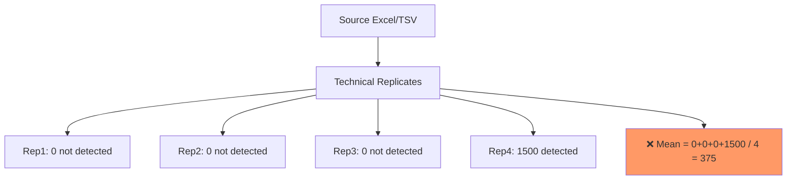
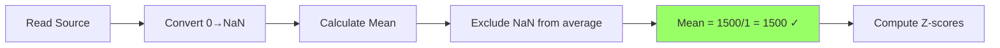

# Task: Fix Zero-to-NaN Conversion in Technical Replicates

**Date:** 2025-10-15 | **Priority:** CRITICAL | **Status:** Ready

---

## Thesis
Convert zeros to NaN at source data ingestion for all 11 datasets, implementing correct replicate averaging (exclude zeros, not average them) to fix incorrect z-score calculations in merged ECM database.

## Overview
Source proteomic files contain zeros where proteins were not detected (biological absence = NaN), but current pipeline treats them as real measurements when averaging technical replicates (e.g., [0,0,0,1500] → mean=375 instead of 1500). Fix requires: (1) audit zero patterns across 11 datasets, (2) modify autonomous_agent.py to convert 0→NaN at file read, (3) implement replicate logic that excludes NaN from mean calculation, (4) reprocess all datasets and recalculate z-scores.

---

**Current Problem (Continuants):**


**Correct Process (Occurrents):**


---

## 1.0 Problem Definition

¶1 **Ordering:** Symptom → Root cause → Impact

¶2 **Symptom:** Database has 82 proteins with zero in old samples, 197 in young, 8 with both=0 (invalid). Study-specific: LiDermis_2021 has 31.3% zeros in old, Tam_2020 has 18.9% missing in young.

¶3 **Root Cause:** Zeros in source files represent "not detected" (should be NaN), but pipeline:
- Treats 0 as real value during replicate averaging
- Example: Kidney study with 4 replicates [0,0,0,1500] → incorrectly computes mean=375 instead of 1500

¶4 **Impact:** Incorrect z-scores for ~15-30% of proteins across 11 datasets, violating statistical assumptions (mean≠0, std≠1 within studies).

---

## 2.0 Solution Logic

¶1 **Ordering:** Data reading → Replicate handling → Statistical calculation

### 2.1 Zero-to-NaN Conversion
**Location:** autonomous_agent.py, PHASE 1 (Normalization), immediately after reading source Excel/TSV.

```python
def read_source_data(filepath):
    df = pd.read_excel(filepath)

    # Convert 0→NaN in abundance/LFQ columns
    abundance_cols = [c for c in df.columns if any(x in c.lower() for x in ['abundance', 'lfq', 'intensity'])]
    df[abundance_cols] = df[abundance_cols].replace(0, np.nan)

    return df
```

### 2.2 Replicate Averaging Logic
**Rule:** When averaging technical replicates, exclude NaN values (don't count them as zeros).

```python
# Current (WRONG):
mean = (rep1 + rep2 + rep3 + rep4) / 4  # [0,0,0,1500] → 375

# Fixed (CORRECT):
mean = df[replicates].mean(skipna=True)  # [NaN,NaN,NaN,1500] → 1500
```

**Minimum replicate threshold:** If <50% replicates have values, mark protein as NaN (too few measurements).

---

## 3.0 Execution Plan

¶1 **Ordering:** Audit → Fix code → Reprocess → Validate

### 3.1 Pre-Audit (DO FIRST)
```bash
# Run zero audit across all 11 datasets
python scripts/audit_zeros.py --datasets 05_papers_to_csv/*/ --output zero_audit_report.csv
```

**Deliverable:** Report showing per-dataset:
- Count of zeros in source files
- Count of technical replicates per protein
- Expected impact of 0→NaN conversion

**Approval gate:** Review audit before proceeding.

### 3.2 Code Modification
**Files to update:**
1. `autonomous_agent.py` → PHASE 1: add zero_to_nan() after file read
2. Add replicate averaging logic with skipna=True
3. Add metadata: `"zeros_converted": True, "conversion_date": "2025-10-15"`

### 3.3 Reprocess Datasets
**All 11 datasets:**
- Caldeira_2017, Randles_2021, Tam_2020, Ouni_2022, Angelidis_2019
- Dipali_2023, LiDermis_2021, Tsumagari_2023, Lofaro_2021, Schuler_2021, Santinha_2024

**Execution:**
```bash
# Parallel processing
for dataset in 05_papers_to_csv/*/; do
    python autonomous_agent.py --fix-zeros "$dataset" &
done
```

### 3.4 Validation
- [✓] No zeros in abundance columns of *_wide_format.csv (except documented biological zeros)
- [✓] Zero records with "Both old=0 AND young=0" (currently 8)
- [✓] Z-scores: mean≈0, std≈1 within each study
- [✓] Dashboard displays updated data correctly

---

## 4.0 Acceptance Criteria

¶1 **Ordering:** Data quality → Statistical validity → Documentation

**Data Quality:**
- All 11 datasets reprocessed with 0→NaN conversion
- Replicate averaging excludes NaN (not treats as 0)
- No invalid "both=0" records

**Statistical Validity:**
- Z-scores recalculated for all 2,177 proteins
- Within-study distributions: |mean|<0.1, |std-1|<0.1

**Documentation:**
- Zero audit report archived in `reparse_whole_base_fix_zero_issue/`
- Database metadata updated: `conversion_method: "zeros_to_nan_at_ingestion"`

---

## References

**Current database:** `08_merged_ecm_dataset/merged_ecm_aging_zscore.csv` (2,177 proteins)
**Quality assessment:** `DATABASE_QUALITY_ASSESSMENT_AND_RECOMMENDATIONS.md` (Issue 4)
**Source:** Lazar et al. 2016, J Proteome Res - missing value handling in proteomics
