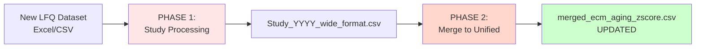

# LFQ Dataset Normalization and Merge to Unified CSV

**Purpose:** Universal algorithm for processing any LFQ proteomics dataset and adding it to the unified ECM Atlas.

**Target audience:** Sub-agent or human researcher processing new study

**Output:** Study added to `08_merged_ecm_dataset/merged_ecm_aging_zscore.csv`

**Configuration:** Use `study_config_template.py` to define study-specific parameters

---

## Pipeline Overview



---

## PHASE 1: Study Processing (Data Normalization)

### Overview
Transform raw LFQ dataset into standardized wide-format CSV with ECM protein annotations.

### Input
- Raw data file (Excel or CSV)
- Study metadata (PMID, species, tissue, method)

### Output
- `Study_YYYY_wide_format.csv` (standardized schema)
- `Study_YYYY_metadata.json`
- `Study_YYYY_annotation_report.md`
- `Study_YYYY_validation_log.txt`

### Target Schema (Wide-Format, 15 core columns)

```
Protein_ID              - UniProt accession
Protein_Name            - Full protein name
Gene_Symbol             - Gene symbol from dataset
Canonical_Gene_Symbol   - Standardized gene symbol from matrisome reference
Matrisome_Category      - ECM category (Collagens, ECM Glycoproteins, etc.)
Matrisome_Division      - Core matrisome / Matrisome-associated
Tissue                  - Combined format: Organ_Compartment (e.g., "Kidney_Glomerular")
Tissue_Compartment      - Explicit compartment (e.g., "Glomerular")
Species                 - "Homo sapiens" or "Mus musculus"
Abundance_Young         - Mean LFQ intensity for young group
Abundance_Old           - Mean LFQ intensity for old group
Method                  - Proteomics method description
Study_ID                - Unique identifier (e.g., "Randles_2021")
Match_Level             - Annotation match level (Level 1-4)
Match_Confidence        - Annotation confidence (0-100)
```

**Optional columns** (study-specific):
- `N_Profiles_Young` - Number of young samples averaged
- `N_Profiles_Old` - Number of old samples averaged
- `Spatial_Metadata` - Additional spatial information if applicable

**⚠️ CRITICAL:** Abundances may contain NaN (missing values) - this is **expected** for LFQ proteomics. Do NOT impute or fill missing values.

---

## PHASE 1 Step-by-Step Algorithm

### Step 0: Pre-Analysis (Reconnaissance)

**Goal:** Understand data structure before parsing.

**Actions:**
1. Identify source file location
2. Inspect Excel sheets or CSV structure
3. Locate protein identifier columns (UniProt, Gene Symbol, Description)
4. Locate LFQ intensity columns (sample names, ages, conditions)
5. Check for separate metadata sheet (age, compartment, spatial data)
6. Identify age groups and compartments

**Example (Randles 2021):**
```python
# File: data_raw/Randles et al. - 2021/ASN.2020101442-File027.xlsx
# Sheet: "Human data matrix fraction"
# Protein IDs: Accession (UniProt), Gene name, Description
# LFQ columns: G15, T15, G29, T29, G37, T37, G61, T61, G67, T67, G69, T69
# Age groups: 15,29,37 (Young) vs 61,67,69 (Old)
# Compartments: G = Glomerular, T = Tubulointerstitial
```

**Example (Tam 2020):**
```python
# File: data_raw/Tam et al. - 2020/elife-64940-supp1-v3.xlsx
# Sheet 1: "Raw data" - protein matrix with LFQ intensities
# Sheet 2: "Sample information" - metadata (age-group, compartment, spatial coordinates)
# Protein IDs: T: Majority protein IDs, T: Gene names
# LFQ columns: 66 columns matching profile names in metadata sheet
# Age groups: 16 (Young) vs 59 (Aged)
# Compartments: NP, IAF, OAF, NP/IAF
```

**Decision:**
- If metadata sheet exists → use it for sample annotations
- If no metadata sheet → parse sample info from column names

---

### Step 1: Data Parsing (Excel/CSV → Long-Format)

**Goal:** Convert wide protein matrix to long-format table.

**Prerequisites:**
1. Fill in `study_config_template.py` with your study parameters
2. Run validation: `python study_config_template.py`

**Algorithm:**
```python
import pandas as pd
import re
from study_config_template import STUDY_CONFIG

# 1. Load configuration
config = STUDY_CONFIG  # or load from your custom config
excel_file = config['data_file']
df_raw = pd.read_excel(excel_file, sheet_name=config['data_sheet'])

print(f"Loaded {len(df_raw)} proteins from {config['data_sheet']}")

# 2. Extract column names from config
id_cols = [
    config['column_mapping']['protein_id'],
    config['column_mapping']['protein_name'],
    config['column_mapping']['gene_symbol']
]
intensity_cols = config['column_mapping']['intensity_columns']

# Auto-detect LFQ columns if not specified
if intensity_cols is None:
    # Find all columns with intensity-like names
    intensity_cols = [col for col in df_raw.columns
                      if 'LFQ' in col or 'intensity' in col.lower()
                      or re.match(r'^[A-Z]\d+', col)]  # e.g., G15, T29
    print(f"Auto-detected {len(intensity_cols)} intensity columns")

# 3. Filter and reshape to long format
df_filtered = df_raw[id_cols + intensity_cols].copy()

# Rename to standard names for easier processing
df_filtered = df_filtered.rename(columns={
    config['column_mapping']['protein_id']: 'Protein_ID',
    config['column_mapping']['protein_name']: 'Protein_Name',
    config['column_mapping']['gene_symbol']: 'Gene_Symbol'
})

df_long = df_filtered.melt(
    id_vars=['Protein_ID', 'Protein_Name', 'Gene_Symbol'],
    value_vars=intensity_cols,
    var_name='Sample_Column',
    value_name='Abundance'
)

print(f"Long-format created: {len(df_long)} rows")

# 4. Parse sample metadata
if config.get('metadata_sheet'):
    # Strategy A: Use metadata sheet
    df_metadata = pd.read_excel(excel_file, sheet_name=config['metadata_sheet'])
    join_col = config['column_mapping']['metadata_join_column']
    df_long = df_long.merge(df_metadata, left_on='Sample_Column', right_on=join_col, how='left')
    print(f"Joined with metadata sheet on '{join_col}'")
else:
    # Strategy B: Parse from column names
    parse_config = config['parse_sample_info']

    if parse_config['method'] == 'regex':
        # Extract compartment
        if 'compartment_pattern' in parse_config:
            df_long['Compartment_Code'] = df_long['Sample_Column'].str.extract(
                parse_config['compartment_pattern']
            )[0]
            # Map to full compartment name
            if config.get('compartments'):
                df_long['Compartment'] = df_long['Compartment_Code'].map(config['compartments'])

        # Extract age
        if 'age_pattern' in parse_config:
            df_long['Age'] = df_long['Sample_Column'].str.extract(
                parse_config['age_pattern']
            )[0].astype(int)

    print(f"Parsed metadata from column names")

# 5. Create Sample_ID
if 'Compartment' in df_long.columns:
    df_long['Sample_ID'] = df_long['Compartment'] + '_' + df_long['Age'].astype(str)
else:
    df_long['Sample_ID'] = df_long['Sample_Column']

# 6. Validation
print(f"\nParsing validation:")
print(f"  Total rows: {len(df_long)}")
print(f"  Unique proteins: {df_long['Protein_ID'].nunique()}")
print(f"  Unique samples: {df_long['Sample_ID'].nunique()}")
print(f"  Null abundances: {df_long['Abundance'].isna().sum()} ({df_long['Abundance'].isna().sum()/len(df_long)*100:.1f}%)")

# Expected output columns:
# Protein_ID, Protein_Name, Gene_Symbol, Sample_Column, Abundance,
# Age, Compartment (if applicable), Sample_ID
```

**Complete example script:** See `examples/step1_data_parsing.py` for a ready-to-run implementation.

**⚠️ Missing Values:**
- 50-80% null abundances are **NORMAL** for LFQ proteomics
- Null = protein not detected in that sample
- Do NOT remove nulls yet - they will be handled during aggregation

---

### Step 2: Age Binning

**Goal:** Assign samples to age groups (Young vs Old).

**Algorithm:**
```python
def assign_age_bin(age, study_specific_thresholds):
    """
    Assign age bin based on study-specific thresholds.

    Common strategies:
    - Binary: Young vs Old (most common)
    - Multi-group: Young/Middle/Old (if ≥3 age groups present)

    Requirements:
    - Data retention ≥66% (at least 2/3 of samples must be binned)
    - Clear age gap between groups (ideally ≥10 years for humans)
    """
    if age in young_ages:
        return "Young"
    elif age in old_ages:
        return "Old"
    else:
        return "Excluded"  # Ages that don't fit clear bins

# Apply to dataframe
df_long['Age_Bin'] = df_long['Age'].apply(assign_age_bin)

# Validate retention
retention_rate = (df_long['Age_Bin'] != 'Excluded').sum() / len(df_long)
assert retention_rate >= 0.66, f"❌ Data retention {retention_rate:.1%} < 66%"
```

**Example age binning strategies:**

| Study | Ages | Strategy | Young | Old | Retention |
|-------|------|----------|-------|-----|-----------|
| Randles 2021 | 15,29,37,61,67,69 | Binary | 15,29,37 | 61,67,69 | 100% |
| Tam 2020 | 16, 59 | Binary | 16 | 59 | 100% |
| Hypothetical | 20,30,40,50,60,70 | Multi-group | 20,30 | 60,70 | 66% (40,50 excluded) |

---

### Step 3: Schema Standardization

**Goal:** Map parsed data to unified 17-column schema.

**Algorithm:**
```python
df_standardized = pd.DataFrame({
    # Protein identifiers
    'Protein_ID': df_long['Accession'],
    'Protein_Name': df_long['Description'],
    'Gene_Symbol': df_long['Gene name'],
    'Canonical_Gene_Symbol': None,  # Filled in Step 4
    'Matrisome_Category': None,      # Filled in Step 4
    'Matrisome_Division': None,      # Filled in Step 4

    # Tissue metadata - COMPARTMENTS KEPT SEPARATE
    'Tissue': 'Organ_' + df_long['Compartment'],  # e.g., "Kidney_Glomerular"
    'Tissue_Compartment': df_long['Compartment'],  # e.g., "Glomerular"

    # Species
    'Species': 'Homo sapiens',  # or 'Mus musculus'

    # Age information
    'Age': df_long['Age'],
    'Age_Unit': 'years',  # or 'months', 'weeks'
    'Age_Bin': df_long['Age_Bin'],

    # Abundance (⚠️ Contains NaN - DO NOT REMOVE)
    'Abundance': df_long['Abundance'],
    'Abundance_Unit': 'LFQ_intensity',  # or 'HiN_LFQ_intensity', 'TMT_intensity', etc.

    # Method and study metadata
    'Method': 'Label-free LC-MS/MS (Progenesis + Mascot)',  # Study-specific
    'Study_ID': 'Randles_2021',
    'Sample_ID': df_long['Sample_ID'],

    # Annotation metadata (filled in Step 4)
    'Match_Level': None,
    'Match_Confidence': None
})

# Clean data
df_standardized = df_standardized[df_standardized['Protein_ID'].notna()]  # Remove null IDs
# ⚠️ DO NOT REMOVE NULL ABUNDANCES - they are biological reality
```

**⚠️ CRITICAL: Tissue Column Format**

Multiple compartments MUST remain separate and Tissue column MUST be unique per compartment:

```python
# ❌ WRONG - merged compartments
Tissue = "Kidney"  # Lost compartment information!

# ❌ WRONG - same Tissue for all compartments
Tissue = "Skeletal muscle"  # Same for Soleus, Gastrocnemius, TA, EDL
# This causes SEVERE DATA LOSS during merge deduplication!

# ✅ CORRECT - separate compartments with unique Tissue values
Tissue = "Kidney_Glomerular"
Tissue = "Kidney_Tubulointerstitial"

# ✅ CORRECT - each muscle type has unique Tissue value
Tissue = "Skeletal_muscle_Soleus"
Tissue = "Skeletal_muscle_Gastrocnemius"
Tissue = "Skeletal_muscle_TA"
Tissue = "Skeletal_muscle_EDL"

# ✅ CORRECT - multiple disc compartments
Tissue = "Intervertebral_disc_NP"
Tissue = "Intervertebral_disc_IAF"
Tissue = "Intervertebral_disc_OAF"
```

**Why this matters:**
1. Z-score normalization is done per-compartment, not averaged across compartments
2. Merge deduplication uses `Tissue_Compartment` to preserve proteins appearing in multiple compartments
3. If Tissue is identical across compartments, proteins will be lost during merge

---

### Step 3.5: Protein Metadata Enrichment (UniProt API)

**Goal:** Fill missing `Protein_Name` and `Gene_Symbol` fields by fetching from UniProt REST API.

**Why do this BEFORE annotation:**
- Step 4 (annotation) relies on Gene_Symbol for best matching quality
- Enriching metadata first improves annotation coverage
- Validates data quality early in pipeline

**When to run:**
```python
# Check if enrichment needed
missing_gene = df_standardized['Gene_Symbol'].isna().sum()
missing_name = df_standardized['Protein_Name'].isna().sum()

if missing_gene > 0 or missing_name > 0:
    print(f"⚠️  Enrichment recommended:")
    print(f"   Missing Gene_Symbol: {missing_gene}")
    print(f"   Missing Protein_Name: {missing_name}")
```

**Quick enrichment algorithm:**
```python
import requests
from time import sleep

UNIPROT_API = "https://rest.uniprot.org/uniprotkb/{}.json"

def enrich_protein_metadata(protein_id):
    """Fetch metadata from UniProt API."""
    try:
        response = requests.get(UNIPROT_API.format(protein_id), timeout=5)
        if response.status_code == 200:
            data = response.json()

            # Extract protein name
            protein_desc = data.get('proteinDescription', {})
            name = None
            if 'recommendedName' in protein_desc:
                name = protein_desc['recommendedName'].get('fullName', {}).get('value')

            # Extract gene symbol
            genes = data.get('genes', [])
            gene_symbol = genes[0].get('geneName', {}).get('value') if genes else None

            return {'name': name, 'gene': gene_symbol}
    except:
        return None

# Apply enrichment to missing values only
needs_enrichment = df_standardized[
    df_standardized['Gene_Symbol'].isna() | df_standardized['Protein_Name'].isna()
]['Protein_ID'].unique()

for protein_id in needs_enrichment:
    metadata = enrich_protein_metadata(protein_id)
    if metadata:
        # Fill missing Gene_Symbol
        df_standardized.loc[
            (df_standardized['Protein_ID'] == protein_id) &
            (df_standardized['Gene_Symbol'].isna()),
            'Gene_Symbol'
        ] = metadata['gene']

        # Fill missing Protein_Name
        df_standardized.loc[
            (df_standardized['Protein_ID'] == protein_id) &
            (df_standardized['Protein_Name'].isna()),
            'Protein_Name'
        ] = metadata['name']

    sleep(0.1)  # Rate limiting (10 req/sec)

print(f"✅ Enrichment complete")
```

**For detailed enrichment implementation:** See `07_PROTEIN_METADATA_ENRICHMENT.md`

---

### Step 4: Protein Annotation (Matrisome Reference Matching)

**Goal:** Annotate proteins with matrisome categories (ECM classification).

**Reference files:**
- Human: `references/human_matrisome_v2.csv` (1,026 genes)
- Mouse: `references/mouse_matrisome_v2.csv` (1,109 genes)

**Algorithm:**
```python
import pandas as pd

# 1. Load reference
species = 'Homo sapiens'
if species == 'Homo sapiens':
    ref = pd.read_csv('references/human_matrisome_v2.csv')
elif species == 'Mus musculus':
    ref = pd.read_csv('references/mouse_matrisome_v2.csv')

# 2. Create lookup tables
ref_by_gene = dict(zip(ref['Gene Symbol'], ref.to_dict('records')))
ref_by_uniprot = dict(zip(ref['UniProt_IDs'], ref.to_dict('records')))

# Parse synonyms (pipe-separated)
ref_by_synonym = {}
for idx, row in ref.iterrows():
    if pd.notna(row['Synonyms']):
        for syn in row['Synonyms'].split('|'):
            ref_by_synonym[syn.strip().upper()] = row.to_dict()

# 3. Hierarchical matching function
def annotate_protein(row):
    """
    4-level matching hierarchy:
    Level 1: Exact gene symbol (confidence 100%)
    Level 2: UniProt ID (confidence 95%)
    Level 3: Synonym (confidence 80%)
    Level 4: Unmatched (confidence 0%)
    """
    gene = str(row['Gene_Symbol']).strip().upper()
    uniprot = str(row['Protein_ID']).strip()

    # Level 1: Gene symbol
    if gene in ref_by_gene:
        match = ref_by_gene[gene]
        return {
            'Canonical_Gene_Symbol': match['Gene Symbol'],
            'Matrisome_Category': match['Matrisome Category'],
            'Matrisome_Division': match['Matrisome Division'],
            'Match_Level': 'Level 1: Gene Symbol',
            'Match_Confidence': 100
        }

    # Level 2: UniProt
    if uniprot in ref_by_uniprot:
        match = ref_by_uniprot[uniprot]
        return {
            'Canonical_Gene_Symbol': match['Gene Symbol'],
            'Matrisome_Category': match['Matrisome Category'],
            'Matrisome_Division': match['Matrisome Division'],
            'Match_Level': 'Level 2: UniProt ID',
            'Match_Confidence': 95
        }

    # Level 3: Synonym
    if gene in ref_by_synonym:
        match = ref_by_synonym[gene]
        return {
            'Canonical_Gene_Symbol': match['Gene Symbol'],
            'Matrisome_Category': match['Matrisome Category'],
            'Matrisome_Division': match['Matrisome Division'],
            'Match_Level': 'Level 3: Synonym',
            'Match_Confidence': 80
        }

    # Level 4: Unmatched
    return {
        'Canonical_Gene_Symbol': None,
        'Matrisome_Category': None,
        'Matrisome_Division': None,
        'Match_Level': 'Level 4: Unmatched',
        'Match_Confidence': 0
    }

# 4. Apply annotation
annotation_results = df_standardized.apply(annotate_protein, axis=1, result_type='expand')
df_annotated = pd.concat([df_standardized, annotation_results], axis=1)

# 5. Calculate coverage
total_proteins = df_annotated['Protein_ID'].nunique()
matched_proteins = df_annotated[df_annotated['Match_Confidence'] > 0]['Protein_ID'].nunique()
coverage_rate = (matched_proteins / total_proteins) * 100

print(f"Annotation coverage: {coverage_rate:.1f}% ({matched_proteins}/{total_proteins})")
```

**Expected annotation coverage:**
- **Whole-proteome studies:** 8-15% (most proteins are non-ECM)
  - Example: Randles 2021 = 8.8%, Tam 2020 = 13.7%
  - This is **CORRECT** - kidney/disc contain mostly non-ECM proteins
- **ECM-focused studies:** 70-95% (study pre-selected ECM proteins)

**⚠️ Low coverage is NOT an error** - it reflects biological reality.

**Validation:** Check for known ECM markers
```python
EXPECTED_MARKERS = ['COL1A1', 'COL1A2', 'FN1', 'LAMA1', 'ACAN', 'MMP2']
for marker in EXPECTED_MARKERS:
    if marker in df_annotated['Canonical_Gene_Symbol'].values:
        print(f"✅ {marker} found and annotated")
    else:
        print(f"⚠️  {marker} not detected (may not be in dataset)")
```

---

### Step 5: Wide-Format Conversion (Long → Wide)

**Goal:** Aggregate spatial/replicate profiles into single protein-level rows with `Abundance_Young` and `Abundance_Old` columns.

**Algorithm:**
```python
# 1. Filter to ECM proteins ONLY
df_ecm = df_annotated[df_annotated['Match_Confidence'] > 0].copy()

print(f"Filtered to {df_ecm['Protein_ID'].nunique()} ECM proteins")
print(f"Original: {df_annotated['Protein_ID'].nunique()} total proteins")

# 2. Define grouping columns
groupby_cols = [
    'Protein_ID', 'Protein_Name', 'Gene_Symbol',
    'Tissue', 'Tissue_Compartment', 'Species',
    'Method', 'Study_ID',
    'Canonical_Gene_Symbol', 'Matrisome_Category', 'Matrisome_Division',
    'Match_Level', 'Match_Confidence'
]

# 3. Aggregate by Age_Bin (mean of abundances)
df_wide = df_ecm.groupby(groupby_cols, dropna=False).apply(
    lambda x: pd.Series({
        'Abundance_Young': x[x['Age_Bin'] == 'Young']['Abundance'].mean(),  # mean() excludes NaN
        'Abundance_Old': x[x['Age_Bin'] == 'Old']['Abundance'].mean(),      # mean() excludes NaN
        'N_Profiles_Young': x[x['Age_Bin'] == 'Young']['Sample_ID'].nunique(),
        'N_Profiles_Old': x[x['Age_Bin'] == 'Old']['Sample_ID'].nunique()
    })
).reset_index()

# 4. Result
# Each protein appears ONCE per compartment
# Abundance_Young/Old = mean across samples (NaN if all samples were NaN)
```

**⚠️ Missing Value and Zero Value Handling:**
```python
# Example: Protein X in Glomerular compartment

# Case 1: Mixed values and NaN
# Young samples: [25.3, NaN, 27.1]  → mean = 26.2 (NaN excluded by pandas.mean(skipna=True))
# Old samples: [NaN, NaN, NaN]      → mean = NaN (all NaN → aggregate NaN)

# Case 2: All zeros (NOT the same as all NaN!)
# Young samples: [0.0, 0.0, 0.0]    → mean = 0.0 (NOT NaN - indicates detected absence)
# Old samples: [0.0]                → mean = 0.0 (NOT NaN - indicates detected absence)

# Critical distinction:
# - NaN = "not measured" (missing data) → excluded from calculations
# - 0.0 = "measured as zero" (detected absence) → included in calculations

# This is CORRECT behavior:
# - NaN in → NaN out (later z-score will also be NaN)
# - 0.0 in → 0.0 out (later z-score will be valid non-NaN value)
# - Later z-score calculation: zero abundances produce valid z-scores indicating extreme absence
```

**Expected output dimensions:**
```python
# Example: Randles 2021
# Input: 31,320 rows (2,610 proteins × 12 samples, but only 229 ECM proteins)
# Output: ~460 rows (229 ECM proteins × 2 compartments)

# Example: Tam 2020
# Input: 48,961 rows (3,101 proteins × variable profiles per compartment, but only 426 ECM proteins)
# Output: ~6,809 rows (426 ECM proteins × 4 compartments, some proteins not in all compartments)
```

---

### Step 6: Quality Validation

**Goal:** Verify data completeness and correctness before export.

**Validation checklist:**
```python
validation_report = {
    # Row counts
    'unique_proteins': df_wide['Protein_ID'].nunique(),
    'total_rows': len(df_wide),
    'compartments': df_wide['Tissue_Compartment'].unique().tolist(),

    # Missing values
    'null_protein_id': df_wide['Protein_ID'].isna().sum(),
    'null_abundance_young': df_wide['Abundance_Young'].isna().sum(),
    'null_abundance_old': df_wide['Abundance_Old'].isna().sum(),

    # Annotation
    'annotation_coverage_%': (df_wide['Match_Confidence'] > 0).sum() / len(df_wide) * 100,
    'ecm_proteins': len(df_wide)  # All rows after filtering
}

# Critical checks (MUST PASS)
checks = [
    ('No null Protein_ID', validation_report['null_protein_id'] == 0),
    ('Compartments kept separate', len(validation_report['compartments']) >= 1),
    ('All rows are ECM proteins', validation_report['annotation_coverage_%'] == 100.0),  # After filtering
    ('Unique proteins found', validation_report['unique_proteins'] > 0)
]

print("\nValidation Checks:")
for check_name, passed in checks:
    print(f"  {'✅' if passed else '❌'} {check_name}")

# Report missing abundances (NOT an error)
print(f"\n⚠️  Missing abundances (expected for LFQ):")
print(f"  Young: {validation_report['null_abundance_young']} rows")
print(f"  Old: {validation_report['null_abundance_old']} rows")
print(f"  This is biological reality - proteins not detected in some samples")
```

---

### Step 7: Export Study Files

**Goal:** Save processed study as standardized CSV files.

**Required outputs:**
```python
import json
from datetime import datetime

# 1. Wide-format CSV (PRIMARY DELIVERABLE)
output_dir = f"{study_id}_paper_to_csv/"
df_wide.to_csv(f"{output_dir}/{study_id}_wide_format.csv", index=False)

# 2. Metadata JSON
metadata = {
    "dataset_id": study_id,
    "parsing_timestamp": datetime.now().isoformat(),
    "paper_pmid": "PMID",
    "species": "Homo sapiens",
    "tissue": "Kidney",
    "compartments": df_wide['Tissue_Compartment'].unique().tolist(),
    "age_groups": {
        "young": young_ages,
        "old": old_ages
    },
    "method": "Label-free LC-MS/MS",
    "source_file": "data_raw/...",
    "parsing_results": {
        "total_rows": len(df_wide),
        "unique_proteins": df_wide['Protein_ID'].nunique(),
        "compartments": len(df_wide['Tissue_Compartment'].unique()),
        "ecm_annotation_coverage_%": 100.0,  # After filtering to ECM only
        "data_retention_%": 100.0 * (df_wide['Age_Bin'].isin(['Young', 'Old']).sum() / len(df_annotated))
    },
    "reference_list": "references/human_matrisome_v2.csv"
}

with open(f"{output_dir}/{study_id}_metadata.json", 'w') as f:
    json.dump(metadata, f, indent=2)

# 3. Annotation report (Markdown)
with open(f"{output_dir}/{study_id}_annotation_report.md", 'w') as f:
    f.write(f"# {study_id} Annotation Report\n\n")
    f.write(f"**Total proteins:** {df_wide['Protein_ID'].nunique()}\n")
    f.write(f"**Match levels:**\n")
    for level, count in df_wide['Match_Level'].value_counts().items():
        f.write(f"- {level}: {count}\n")

# 4. Validation log (Text)
with open(f"{output_dir}/{study_id}_validation_log.txt", 'w') as f:
    f.write("="*80 + "\n")
    f.write(f"{study_id.upper()} - VALIDATION LOG\n")
    f.write("="*80 + "\n")
    for check_name, passed in checks:
        f.write(f"{'PASS' if passed else 'FAIL'}: {check_name}\n")

print(f"\n✅ Study processing complete!")
print(f"Output: {output_dir}/{study_id}_wide_format.csv")
```

---

## PHASE 2: Merge to Unified CSV

### Overview
Add processed study to unified ECM Atlas CSV file.

### Input
- `Study_YYYY_wide_format.csv` (from Phase 1)
- Existing `merged_ecm_aging_zscore.csv` (if any)

### Output
- Updated `merged_ecm_aging_zscore.csv` with new study rows
- Backup of previous version
- `unified_metadata.json` updated

### Algorithm

```python
import pandas as pd
import shutil
from datetime import datetime
from pathlib import Path

def merge_study_to_unified(
    study_csv: str,
    unified_csv: str = '08_merged_ecm_dataset/merged_ecm_aging_zscore.csv'
):
    """
    Add new study to unified CSV.

    Steps:
    1. Backup existing unified CSV
    2. Load new study CSV
    3. Load existing unified CSV (if exists)
    4. Validate schema match
    5. Concatenate
    6. Save updated unified CSV
    7. Update unified metadata
    """

    print(f"\n{'='*70}")
    print("MERGE STUDY TO UNIFIED CSV")
    print(f"{'='*70}")

    # Ensure output directory exists
    unified_path = Path(unified_csv)
    unified_path.parent.mkdir(parents=True, exist_ok=True)

    # 1. Backup existing unified CSV
    if unified_path.exists():
        backup_dir = unified_path.parent / 'backups'
        backup_dir.mkdir(exist_ok=True)
        timestamp = datetime.now().strftime('%Y-%m-%d_%H-%M-%S')
        backup_path = backup_dir / f"merged_ecm_aging_zscore_{timestamp}.csv"
        shutil.copy(unified_csv, backup_path)
        print(f"✅ Backup created: {backup_path}")
    else:
        print(f"ℹ️  No existing unified CSV - creating new one")

    # 2. Load new study
    df_new = pd.read_csv(study_csv)
    study_id = df_new['Study_ID'].iloc[0]
    print(f"\n📥 Loading new study: {study_id}")
    print(f"   Rows: {len(df_new)}")
    print(f"   Proteins: {df_new['Protein_ID'].nunique()}")
    print(f"   Compartments: {df_new['Tissue_Compartment'].unique().tolist()}")

    # 3. Load existing unified (if exists)
    if unified_path.exists():
        df_existing = pd.read_csv(unified_csv)
        print(f"\n📊 Existing unified CSV:")
        print(f"   Rows: {len(df_existing)}")
        print(f"   Studies: {df_existing['Study_ID'].unique().tolist()}")

        # 4. Validate schema match
        missing_cols = set(df_new.columns) - set(df_existing.columns)
        extra_cols = set(df_existing.columns) - set(df_new.columns)

        if missing_cols:
            print(f"   ⚠️  New columns in study (will add to unified): {missing_cols}")
            for col in missing_cols:
                df_existing[col] = None

        if extra_cols:
            print(f"   ⚠️  Missing columns in study (will add NaN): {extra_cols}")
            for col in extra_cols:
                df_new[col] = None

        # Align column order
        df_new = df_new[df_existing.columns]

    else:
        df_existing = pd.DataFrame()

    # 5. Concatenate
    df_merged = pd.concat([df_existing, df_new], ignore_index=True)

    print(f"\n🔗 Merged result:")
    print(f"   Total rows: {len(df_merged)} (added {len(df_new)})")
    print(f"   Total studies: {df_merged['Study_ID'].nunique()}")
    print(f"   Studies: {df_merged['Study_ID'].unique().tolist()}")

    # 6. Check for duplicates
    # NOTE: Use Tissue_Compartment instead of Tissue to preserve proteins in multiple compartments
    duplicates = df_merged.duplicated(subset=['Protein_ID', 'Tissue_Compartment', 'Study_ID']).sum()
    if duplicates > 0:
        print(f"   ⚠️  WARNING: {duplicates} duplicate rows detected!")
        # Remove duplicates, keeping last occurrence
        df_merged = df_merged.drop_duplicates(subset=['Protein_ID', 'Tissue_Compartment', 'Study_ID'], keep='last')
        print(f"   ✅ Duplicates removed")

    # 7. Save updated unified CSV
    df_merged.to_csv(unified_csv, index=False)
    print(f"\n✅ Saved updated unified CSV: {unified_csv}")

    # 8. Update unified metadata
    metadata_path = unified_path.parent / 'unified_metadata.json'

    import json
    metadata = {
        "last_updated": datetime.now().isoformat(),
        "total_rows": len(df_merged),
        "total_studies": int(df_merged['Study_ID'].nunique()),
        "studies": df_merged['Study_ID'].unique().tolist(),
        "total_proteins": int(df_merged['Protein_ID'].nunique()),
        "compartments": df_merged['Tissue'].unique().tolist(),
        "species": df_merged['Species'].unique().tolist(),
        "rows_per_study": df_merged.groupby('Study_ID').size().to_dict()
    }

    with open(metadata_path, 'w') as f:
        json.dump(metadata, f, indent=2)
    print(f"✅ Updated metadata: {metadata_path}")

    return df_merged


# === USAGE ===
if __name__ == '__main__':
    # Example: Add Randles 2021 to unified
    merge_study_to_unified(
        study_csv='05_Randles_paper_to_csv/Randles_2021_wide_format.csv',
        unified_csv='08_merged_ecm_dataset/merged_ecm_aging_zscore.csv'  # Relative path
    )
```

**Complete merge script:** See `merge_to_unified.py` for ready-to-use implementation.

---

## Key Principles Summary

### ✅ DO
- Keep compartments SEPARATE in Tissue column format
- Filter to ECM proteins ONLY (Match_Confidence > 0) before wide-format conversion
- Preserve NaN abundances throughout pipeline (they are biological reality)
- Use `mean(skipna=True)` when aggregating (pandas default)
- Validate schema consistency when merging to unified
- Create backups before modifying unified CSV
- Document all steps in metadata JSON

### ❌ DO NOT
- Merge compartments into generic tissue names (e.g., "Kidney" instead of "Kidney_Glomerular")
- Use identical Tissue values for different compartments (e.g., "Skeletal muscle" for all muscle types)
- Use `Tissue` column for deduplication - always use `Tissue_Compartment` instead
- Impute or fill missing values (NaN should stay NaN)
- Remove proteins with missing abundances (only remove null Protein_IDs)
- Include non-ECM proteins in final wide-format output
- Modify existing studies in unified CSV when adding new study

---

## Expected File Structure

```
project/
├── data_raw/
│   └── Study et al. - YYYY/
│       └── raw_data_file.xlsx
├── references/
│   ├── human_matrisome_v2.csv
│   └── mouse_matrisome_v2.csv
├── XX_Study_YYYY_paper_to_csv/
│   ├── Study_YYYY_wide_format.csv          ← PHASE 1 OUTPUT
│   ├── Study_YYYY_metadata.json
│   ├── Study_YYYY_annotation_report.md
│   └── Study_YYYY_validation_log.txt
└── 08_merged_ecm_dataset/
    ├── merged_ecm_aging_zscore.csv          ← PHASE 2 OUTPUT
    ├── unified_metadata.json
    └── backups/
        └── merged_ecm_aging_zscore_2025-10-13.csv
```

---

## Troubleshooting

### Problem: Low annotation coverage (<20%)
**Diagnosis:** Expected for whole-proteome studies (most proteins are non-ECM)
**Action:** Proceed normally - this is biological reality

### Problem: Schema mismatch when merging
**Diagnosis:** New study has different column set
**Action:** Add missing columns as NaN in both dataframes before merge

### Problem: High % of missing abundances (>80%)
**Diagnosis:** Normal for LFQ spatial proteomics (not all proteins detected everywhere)
**Action:** Proceed normally - do NOT impute or remove

### Problem: Duplicate rows in unified CSV
**Diagnosis:** Study was merged twice
**Action:** Remove duplicates using `drop_duplicates(subset=['Protein_ID', 'Tissue_Compartment', 'Study_ID'])`

**⚠️ WARNING:** Do NOT use `Tissue` for deduplication - this will cause data loss for multi-compartment studies!

### Problem: Compartments accidentally merged
**Diagnosis:** Tissue column used generic name
**Action:** Fix in Phase 1 Step 3 - use "Organ_Compartment" format

---

## Next Steps

After PHASE 2 completion:
1. ✅ Study added to unified CSV
2. ✅ Ready for z-score calculation (see document 02)
3. ✅ Can add more studies using same pipeline

**Proceed to:** `02_ZSCORE_CALCULATION_UNIVERSAL_FUNCTION.md`
