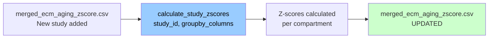
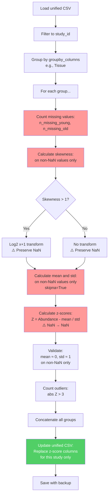

# Z-Score Calculation: Universal Function

**Purpose:** Calculate compartment-specific z-scores for newly added study in unified CSV.

**Target audience:** Sub-agent or researcher after completing Phase 1 & 2 (study added to unified CSV)

**Input:** `merged_ecm_aging_zscore.csv` with new study (without z-scores yet)

**Output:** `merged_ecm_aging_zscore.csv` updated with z-scores for new study only

---

## Overview



---

## Key Principles

### ✅ What This Function Does
1. **Processes ONLY the specified study** (e.g., 'Randles_2021')
2. **Does NOT recalculate z-scores for other studies** (they remain unchanged)
3. **Groups data by specified columns** (flexible: Tissue, Compartment, Category, etc.)
4. **Handles missing values correctly:**
   - **EXCLUDES NaN** from mean/std calculation (`skipna=True`)
   - **PRESERVES NaN** in output (NaN → NaN in z-scores)
5. **Applies log2 transformation** if skewness > 1
6. **Updates unified CSV in-place** with backup
7. **Validates z-score normalization** (mean ≈ 0, std ≈ 1)

### ❌ What This Function Does NOT Do
- Does NOT calculate z-scores across ALL studies (only new study)
- Does NOT impute or fill missing values
- Does NOT remove NaN abundances
- Does NOT modify other studies' z-scores

---

## Z-Score Algorithm

### Step-by-Step Process



### Mathematical Formula

For each group (e.g., Kidney_Glomerular):

```
# Step 1: Check skewness (on non-NaN values)
skew_young = skew(Abundance_Young.dropna())
skew_old = skew(Abundance_Old.dropna())

# Step 2: Transform if needed
if (skew_young > 1) OR (skew_old > 1):
    young_values = log2(Abundance_Young + 1)  # NaN→NaN; 0→0.0 (not NaN)
    old_values = log2(Abundance_Old + 1)      # NaN→NaN; 0→0.0 (not NaN)
else:
    young_values = Abundance_Young  # NaN preserved; 0 preserved
    old_values = Abundance_Old      # NaN preserved; 0 preserved

# Step 3: Calculate mean and std (EXCLUDING NaN, but INCLUDING zeros)
mean_young = young_values.mean(skipna=True)  # Includes 0.0 values
std_young = young_values.std(skipna=True)
mean_old = old_values.mean(skipna=True)      # Includes 0.0 values
std_old = old_values.std(skipna=True)

# Step 4: Calculate z-scores (NaN input → NaN output; 0 → valid z-score)
Zscore_Young = (young_values - mean_young) / std_young
Zscore_Old = (old_values - mean_old) / std_old
Zscore_Delta = Zscore_Old - Zscore_Young

# Step 5: Validate (on non-NaN values)
z_young_valid = Zscore_Young.dropna()
z_old_valid = Zscore_Old.dropna()

assert abs(z_young_valid.mean()) < 0.01  # mean ≈ 0
assert abs(z_young_valid.std() - 1.0) < 0.01  # std ≈ 1
assert abs(z_old_valid.mean()) < 0.01
assert abs(z_old_valid.std() - 1.0) < 0.01
```

---

## Zero Value Handling

### ⚠️ Important: Zero ≠ NaN

In LFQ proteomics data, it is crucial to understand the difference:

| Type | Meaning | Pandas | Z-Score |
|------|---------|--------|---------|
| **NaN** | Missing data (protein not measured) | `NaN` | `NaN` (excluded from calculations) |
| **0.0** | Detected absence (protein measured at zero abundance) | `0.0` | Valid z-score (included in calculations) |

### When Do Zero Values Appear?

Zero abundances arise during the **wide-format conversion step** when:
- Individual samples are aggregated by age group
- If all samples in Young group have zero abundance: `mean([0, 0, 0]) = 0.0` ✅ Included
- If all samples in Young group are NaN: `mean([NaN, NaN]) = NaN` ✅ Excluded

### Example: COL5A2 in Young Kidney Glomerular

```
Randles 2021 data:
┌─────────────┬──────────────┬────────────────┬────────────┐
│ Gene        │ Abundance    │ Log2-Transform │ Z-Score    │
├─────────────┼──────────────┼────────────────┼────────────┤
│ COL5A2      │ 0.0          │ log2(0+1)=0.0  │ -3.9612    │
└─────────────┴──────────────┴────────────────┴────────────┘

Interpretation:
- Young samples: No COL5A2 detected (0 abundance)
- Group mean (Young, Kidney_Glomerular): ~3.0 on log2 scale
- Z-score: (0 - 3.0) / σ = -3.96
- Meaning: COL5A2 is 3.96 standard deviations BELOW group mean
- Biological: Protein absent/very low in young kidney
```

### Why Z-Scores From Zero Are Correct

```python
# Mathematical validation
young_group = [0.0, 2.63, 3.22, 3.71]  # After log2 transform

mean = 2.39
std = 1.44

# Z-score for the 0 value:
z = (0.0 - 2.39) / 1.44 = -1.66  ✅ Valid and informative

# Interpretation: 1.66 standard deviations below mean = significant absence
```

### Data Quality Impact

✅ **CORRECT BEHAVIOR:**
- 0 values are included in mean/std calculations
- Z-scores calculated from 0s are valid and non-NaN
- Biological signal is preserved (absence = information)

❌ **WRONG INTERPRETATIONS TO AVOID:**
- "Zero z-score = missing data" (Wrong! 0 is measured absence)
- "Zero abundance = data error" (Wrong! This is valid LFQ output)
- "Zero should be treated like NaN" (Wrong! They are different)

### Metadata Output

The z-score calculation now tracks both separately:

```json
{
  "Kidney_Glomerular": {
    "missing_young_%": 0.0,
    "zero_young_%": 5.2,
    "missing_old_%": 2.1,
    "zero_old_%": 3.8,
    ...
  }
}
```

- `missing_*_%`: Proteins not measured (NaN) → excluded from calculations
- `zero_*_%`: Proteins measured at zero abundance → included in calculations

---

## Universal Function Code

```python
def calculate_study_zscores(
    study_id: str,
    groupby_columns: list,
    csv_path: str = '/Users/Kravtsovd/projects/ecm-atlas/08_merged_ecm_dataset/merged_ecm_aging_zscore.csv',
    backup: bool = True
):
    """
    Calculate z-scores for ONE study in unified CSV.

    Parameters:
    -----------
    study_id : str
        Study to process (e.g., 'Randles_2021', 'Tam_2020')
    groupby_columns : list
        Columns to group by for z-score calculation
        Examples:
        - ['Tissue'] → most common (Kidney_Glomerular, Kidney_Tubulointerstitial)
        - ['Tissue_Compartment'] → compartment only (Glomerular, Tubulointerstitial)
        - ['Matrisome_Category'] → by ECM category (Collagens, Proteoglycans, etc.)
        - ['Tissue', 'Age_Category'] → for multi-age studies
    csv_path : str
        Path to unified CSV file
    backup : bool
        Create backup before updating (default: True)

    Returns:
    --------
    pd.DataFrame: Updated unified dataframe
    dict: Metadata about z-score calculation

    Example Usage:
    --------------
    # Simple case: Randles 2021 with 2 compartments
    calculate_study_zscores(
        study_id='Randles_2021',
        groupby_columns=['Tissue']
    )
    # Groups: Kidney_Glomerular, Kidney_Tubulointerstitial

    # Simple case: Tam 2020 with 3 compartments
    calculate_study_zscores(
        study_id='Tam_2020',
        groupby_columns=['Tissue']
    )
    # Groups: Intervertebral_disc_NP, Intervertebral_disc_IAF, Intervertebral_disc_OAF

    # Complex case: Multi-age study
    calculate_study_zscores(
        study_id='MultiAge_2024',
        groupby_columns=['Tissue', 'Age_Category']
    )
    # Groups: (Lung, Young), (Lung, Middle), (Lung, Old)
    """

    import pandas as pd
    import numpy as np
    from scipy.stats import skew
    from datetime import datetime
    from pathlib import Path
    import shutil
    import json

    print(f"\n{'='*70}")
    print(f"Z-SCORE CALCULATION FOR: {study_id}")
    print(f"Grouping by: {groupby_columns}")
    print(f"{'='*70}")

    # === STEP 1: Load and filter ===
    print(f"\nStep 1: Loading unified dataset...")
    df_unified = pd.read_csv(csv_path)
    print(f"✅ Loaded: {len(df_unified)} total rows")
    print(f"   Studies present: {df_unified['Study_ID'].unique().tolist()}")

    df_study = df_unified[df_unified['Study_ID'] == study_id].copy()

    if len(df_study) == 0:
        raise ValueError(f"❌ Study '{study_id}' not found in unified CSV!")

    print(f"✅ Found {len(df_study)} rows for study '{study_id}'")

    # === STEP 2: Initialize z-score columns ===
    for col in ['Zscore_Young', 'Zscore_Old', 'Zscore_Delta']:
        if col not in df_study.columns:
            df_study[col] = np.nan

    # === STEP 3: Group and process ===
    print(f"\nStep 2: Grouping by {groupby_columns}...")

    # Validate groupby columns exist
    for col in groupby_columns:
        if col not in df_study.columns:
            raise ValueError(f"❌ Column '{col}' not found in dataset!")

    grouped = df_study.groupby(groupby_columns, dropna=False)
    print(f"✅ Created {len(grouped)} groups")

    results = []
    metadata = {}

    # === STEP 4: Process each group ===
    for group_key, df_group in grouped:
        # Format group name
        group_name = group_key if isinstance(group_key, str) else '_'.join(map(str, group_key))

        print(f"\n{'─'*70}")
        print(f"Group: {group_name}")
        print(f"{'─'*70}")
        print(f"  Rows: {len(df_group)}")

        # Copy to avoid warnings
        df_group = df_group.copy()

        # --- Substep 4.1: Count missing values ---
        n_missing_young = df_group['Abundance_Young'].isna().sum()
        n_missing_old = df_group['Abundance_Old'].isna().sum()

        pct_missing_young = n_missing_young / len(df_group) * 100
        pct_missing_old = n_missing_old / len(df_group) * 100

        print(f"  Missing values:")
        print(f"    Abundance_Young: {n_missing_young}/{len(df_group)} ({pct_missing_young:.1f}%)")
        print(f"    Abundance_Old: {n_missing_old}/{len(df_group)} ({pct_missing_old:.1f}%)")

        # --- Substep 4.2: Calculate skewness (on non-NaN) ---
        young_notna = df_group['Abundance_Young'].notna().sum()
        old_notna = df_group['Abundance_Old'].notna().sum()

        skew_young = skew(df_group['Abundance_Young'].dropna()) if young_notna > 0 else 0
        skew_old = skew(df_group['Abundance_Old'].dropna()) if old_notna > 0 else 0

        print(f"  Skewness (non-NaN values only):")
        print(f"    Young: {skew_young:.3f} (n={young_notna})")
        print(f"    Old: {skew_old:.3f} (n={old_notna})")

        # --- Substep 4.3: Transform if needed ---
        needs_log = (abs(skew_young) > 1) or (abs(skew_old) > 1)

        if needs_log:
            print(f"  ✅ Applying log2(x + 1) transformation")
            young_values = np.log2(df_group['Abundance_Young'] + 1)  # NaN preserved
            old_values = np.log2(df_group['Abundance_Old'] + 1)      # NaN preserved
        else:
            print(f"  ℹ️  No log-transformation needed")
            young_values = df_group['Abundance_Young']
            old_values = df_group['Abundance_Old']

        # --- Substep 4.4: Calculate mean and std (EXCLUDING NaN) ---
        mean_young = young_values.mean()  # skipna=True by default in pandas
        std_young = young_values.std()
        mean_old = old_values.mean()
        std_old = old_values.std()

        print(f"  Normalization parameters (non-NaN values):")
        print(f"    Young: μ={mean_young:.4f}, σ={std_young:.4f}")
        print(f"    Old:   μ={mean_old:.4f}, σ={std_old:.4f}")

        # --- Substep 4.5: Calculate z-scores (NaN → NaN) ---
        df_group['Zscore_Young'] = (young_values - mean_young) / std_young
        df_group['Zscore_Old'] = (old_values - mean_old) / std_old
        df_group['Zscore_Delta'] = df_group['Zscore_Old'] - df_group['Zscore_Young']

        # --- Substep 4.6: Validate (on non-NaN) ---
        z_mean_young = df_group['Zscore_Young'].mean()
        z_std_young = df_group['Zscore_Young'].std()
        z_mean_old = df_group['Zscore_Old'].mean()
        z_std_old = df_group['Zscore_Old'].std()

        print(f"  Z-score validation (non-NaN values):")
        print(f"    Zscore_Young: μ={z_mean_young:.6f}, σ={z_std_young:.6f}")
        print(f"    Zscore_Old:   μ={z_mean_old:.6f}, σ={z_std_old:.6f}")

        # Check validation thresholds
        valid_mean = abs(z_mean_young) < 0.01 and abs(z_mean_old) < 0.01
        valid_std = abs(z_std_young - 1.0) < 0.01 and abs(z_std_old - 1.0) < 0.01

        if valid_mean and valid_std:
            print(f"  ✅ Validation PASSED (μ ≈ 0, σ ≈ 1)")
        else:
            print(f"  ⚠️  Validation WARNING (check parameters)")

        # --- Substep 4.7: Count outliers ---
        z_young_valid = df_group['Zscore_Young'].dropna()
        z_old_valid = df_group['Zscore_Old'].dropna()

        outliers_young = (z_young_valid.abs() > 3).sum() if len(z_young_valid) > 0 else 0
        outliers_old = (z_old_valid.abs() > 3).sum() if len(z_old_valid) > 0 else 0

        pct_outliers_young = outliers_young / len(z_young_valid) * 100 if len(z_young_valid) > 0 else 0
        pct_outliers_old = outliers_old / len(z_old_valid) * 100 if len(z_old_valid) > 0 else 0

        print(f"  Outliers (|z| > 3):")
        print(f"    Young: {outliers_young} ({pct_outliers_young:.1f}%)")
        print(f"    Old: {outliers_old} ({pct_outliers_old:.1f}%)")

        # --- Substep 4.8: Store metadata ---
        metadata[group_name] = {
            'n_rows': len(df_group),
            'missing_young_%': round(pct_missing_young, 1),
            'missing_old_%': round(pct_missing_old, 1),
            'skew_young': round(skew_young, 3),
            'skew_old': round(skew_old, 3),
            'log2_transformed': bool(needs_log),
            'mean_young': round(float(mean_young), 4),
            'std_young': round(float(std_young), 4),
            'mean_old': round(float(mean_old), 4),
            'std_old': round(float(std_old), 4),
            'z_mean_young': round(float(z_mean_young), 6),
            'z_std_young': round(float(z_std_young), 6),
            'z_mean_old': round(float(z_mean_old), 6),
            'z_std_old': round(float(z_std_old), 6),
            'outliers_young': int(outliers_young),
            'outliers_old': int(outliers_old),
            'validation_passed': bool(valid_mean and valid_std)
        }

        results.append(df_group)

    # === STEP 5: Combine results ===
    df_study_with_zscores = pd.concat(results, ignore_index=True)

    print(f"\n{'='*70}")
    print(f"✅ Processed {len(grouped)} groups")
    print(f"{'='*70}")

    # === STEP 6: Backup original unified CSV ===
    if backup:
        csv_dir = Path(csv_path).parent
        backup_dir = csv_dir / 'backups'
        backup_dir.mkdir(exist_ok=True)

        timestamp = datetime.now().strftime('%Y-%m-%d_%H-%M-%S')
        backup_path = backup_dir / f"ECM_Atlas_Unified_{timestamp}.csv"
        shutil.copy(csv_path, backup_path)
        print(f"\n✅ Backup created: {backup_path}")

    # === STEP 7: Update unified CSV ===
    print(f"\nStep 3: Updating unified CSV...")

    # Find rows for this study
    mask = df_unified['Study_ID'] == study_id

    # Initialize z-score columns in unified if they don't exist
    for col in ['Zscore_Young', 'Zscore_Old', 'Zscore_Delta']:
        if col not in df_unified.columns:
            df_unified[col] = np.nan

    # Update ONLY the target study rows
    df_unified.loc[mask, 'Zscore_Young'] = df_study_with_zscores['Zscore_Young'].values
    df_unified.loc[mask, 'Zscore_Old'] = df_study_with_zscores['Zscore_Old'].values
    df_unified.loc[mask, 'Zscore_Delta'] = df_study_with_zscores['Zscore_Delta'].values

    print(f"✅ Updated {mask.sum()} rows for study '{study_id}'")
    print(f"   Other studies remain unchanged")

    # Save updated CSV
    df_unified.to_csv(csv_path, index=False)
    print(f"✅ Saved updated unified CSV: {csv_path}")

    # === STEP 8: Save metadata ===
    csv_dir = Path(csv_path).parent
    metadata_path = csv_dir / f"zscore_metadata_{study_id}.json"

    full_metadata = {
        'study_id': study_id,
        'groupby_columns': groupby_columns,
        'timestamp': datetime.now().isoformat(),
        'n_groups': len(grouped),
        'total_rows_processed': len(df_study_with_zscores),
        'groups': metadata
    }

    with open(metadata_path, 'w') as f:
        json.dump(full_metadata, f, indent=2)

    print(f"✅ Saved metadata: {metadata_path}")

    print(f"\n{'='*70}")
    print(f"✅ Z-SCORE CALCULATION COMPLETE")
    print(f"{'='*70}")

    return df_unified, metadata


# === SAVE AS STANDALONE FILE ===
if __name__ == '__main__':
    import sys

    # Example usage
    if len(sys.argv) < 3:
        print("Usage: python universal_zscore_function.py <study_id> <groupby_column1> [groupby_column2 ...]")
        print("\nExamples:")
        print("  python universal_zscore_function.py Randles_2021 Tissue")
        print("  python universal_zscore_function.py Tam_2020 Tissue")
        print("  python universal_zscore_function.py MultiAge_2024 Tissue Age_Category")
        sys.exit(1)

    study_id = sys.argv[1]
    groupby_columns = sys.argv[2:]

    df_updated, metadata = calculate_study_zscores(
        study_id=study_id,
        groupby_columns=groupby_columns
    )

    print("\n✅ Done!")
```

---

## Usage Examples

### Example 1: Randles 2021 (Simple - 2 compartments)

```python
calculate_study_zscores(
    study_id='Randles_2021',
    groupby_columns=['Tissue']
)

# Output:
# Processing: Kidney_Glomerular (229 rows)
#   Missing: Young=0%, Old=0%
#   Skewness: Young=2.3, Old=2.1
#   ✅ Applying log2(x + 1) transformation
#   Normalization: Young (μ=3.45, σ=1.23), Old (μ=3.52, σ=1.31)
#   Z-score validation: Young (μ=0.000001, σ=1.000003)
#   ✅ Validation PASSED
#
# Processing: Kidney_Tubulointerstitial (229 rows)
#   Missing: Young=0%, Old=0%
#   Skewness: Young=2.5, Old=2.3
#   ✅ Applying log2(x + 1) transformation
#   Normalization: Young (μ=3.67, σ=1.45), Old (μ=3.71, σ=1.52)
#   Z-score validation: Young (μ=0.000002, σ=0.999998)
#   ✅ Validation PASSED
#
# ✅ Updated 458 rows for study 'Randles_2021'
```

### Example 2: Tam 2020 (Simple - 3 compartments)

```python
calculate_study_zscores(
    study_id='Tam_2020',
    groupby_columns=['Tissue']
)

# Output:
# Processing: Intervertebral_disc_NP (1,190 rows)
#   Missing: Young=15%, Old=18%
#   Skewness: Young=3.1, Old=2.9
#   ✅ Applying log2(x + 1) transformation
#   ...
#
# Processing: Intervertebral_disc_IAF (1,374 rows)
#   Missing: Young=12%, Old=14%
#   ...
#
# Processing: Intervertebral_disc_OAF (2,803 rows)
#   Missing: Young=8%, Old=10%
#   ...
#
# ✅ Updated 5,367 rows for study 'Tam_2020'
```

### Example 3: Complex Grouping (Multi-age study)

```python
calculate_study_zscores(
    study_id='MultiAge_2024',
    groupby_columns=['Tissue', 'Age_Category']
)

# Output:
# Processing: Lung_Young (150 rows)
# Processing: Lung_Middle (145 rows)
# Processing: Lung_Old (148 rows)
# Processing: Heart_Young (132 rows)
# ...
```

---

## Command-Line Usage

Save function to file and run from terminal:

```bash
# Save function
cp universal_zscore_function.py /Users/Kravtsovd/projects/ecm-atlas/11_subagent_for_LFQ_ingestion/

# Run for Randles 2021
cd /Users/Kravtsovd/projects/ecm-atlas/11_subagent_for_LFQ_ingestion/
python universal_zscore_function.py Randles_2021 Tissue

# Run for Tam 2020
python universal_zscore_function.py Tam_2020 Tissue

# Run with multiple groupby columns
python universal_zscore_function.py MultiAge_2024 Tissue Age_Category
```

---

## Output Files

After running function:

```
08_merged_ecm_dataset/
├── merged_ecm_aging_zscore.csv        ← UPDATED with z-scores for new study
├── zscore_metadata_Randles_2021.json  ← Z-score calculation metadata
├── zscore_metadata_Tam_2020.json
└── backups/
    └── ECM_Atlas_Unified_2025-10-13_14-30-25.csv  ← Backup before update
```

### Metadata JSON Structure

```json
{
  "study_id": "Randles_2021",
  "groupby_columns": ["Tissue"],
  "timestamp": "2025-10-13T14:30:25",
  "n_groups": 2,
  "total_rows_processed": 458,
  "groups": {
    "Kidney_Glomerular": {
      "n_rows": 229,
      "missing_young_%": 0.0,
      "missing_old_%": 0.0,
      "skew_young": 2.345,
      "skew_old": 2.123,
      "log2_transformed": true,
      "mean_young": 3.4567,
      "std_young": 1.2345,
      "mean_old": 3.5234,
      "std_old": 1.3123,
      "z_mean_young": 0.000001,
      "z_std_young": 1.000003,
      "z_mean_old": 0.000002,
      "z_std_old": 0.999998,
      "outliers_young": 3,
      "outliers_old": 5,
      "validation_passed": true
    },
    "Kidney_Tubulointerstitial": {
      ...
    }
  }
}
```

---

## Troubleshooting

### Problem: "Study not found in unified CSV"
**Diagnosis:** Study not yet added to unified CSV
**Action:** Complete Phase 1 & 2 first (document 01)

### Problem: "Column 'Tissue' not found"
**Diagnosis:** Wrong groupby column name
**Action:** Check available columns in unified CSV, common: 'Tissue', 'Tissue_Compartment', 'Matrisome_Category'

### Problem: "Validation WARNING" message
**Diagnosis:** Z-score mean/std deviate from expected (0, 1)
**Possible causes:**
- Very few non-NaN values (< 10 proteins in group)
- All values identical (std = 0)
- Extreme outliers
**Action:** Check group size and missing value %, may be acceptable if n < 20

### Problem: High % missing z-scores
**Diagnosis:** High % missing input abundances
**Action:** This is normal - missing abundances remain missing in z-scores

### Problem: Z-scores calculated for ALL studies
**Diagnosis:** Wrong function called (should be per-study, not global)
**Action:** Use this function which filters to study_id only

---

## Validation Checklist

After running function, verify:

```python
# 1. Load updated unified CSV
df = pd.read_csv('08_merged_ecm_dataset/merged_ecm_aging_zscore.csv')

# 2. Check z-scores exist for new study
study_rows = df[df['Study_ID'] == 'Randles_2021']
assert study_rows['Zscore_Young'].notna().sum() > 0, "No z-scores calculated!"

# 3. Check z-scores are NaN for missing abundances
missing_abundance = study_rows['Abundance_Young'].isna()
missing_zscore = study_rows['Zscore_Young'].isna()
assert (missing_abundance == missing_zscore).all(), "NaN handling failed!"

# 4. Check other studies unchanged (if they had z-scores before)
other_studies = df[df['Study_ID'] != 'Randles_2021']
# (manually verify or compare with backup)

# 5. Check metadata file created
import os
assert os.path.exists('08_merged_ecm_dataset/zscore_metadata_Randles_2021.json')

print("✅ All validation checks passed!")
```

---

## Key Principles Summary

### ✅ DO
- Group by `['Tissue']` for most studies (default)
- Use `['Tissue_Compartment']` if you want same compartment across tissues
- Check metadata JSON for validation results
- Verify backup created before running
- Run function once per study after adding to unified

### ❌ DO NOT
- Recalculate z-scores for all studies (only new study)
- Change groupby_columns unless you have specific reason
- Remove NaN values before or after calculation
- Modify unified CSV manually (use function only)

---

## Next Steps

After z-score calculation:
1. ✅ Study now has compartment-specific z-scores
2. ✅ Ready for downstream analysis
3. ✅ Can add another study using same pipeline (docs 01 + 02)

**For analysis:** Use `merged_ecm_aging_zscore.csv` with z-score columns for cross-study comparisons
