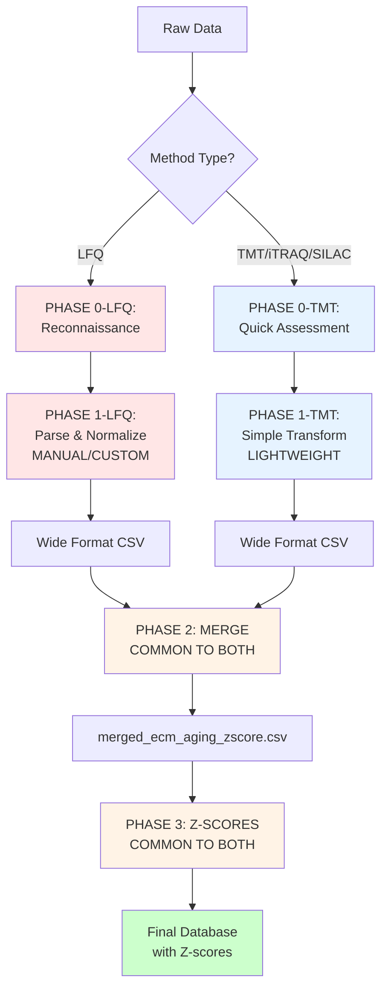
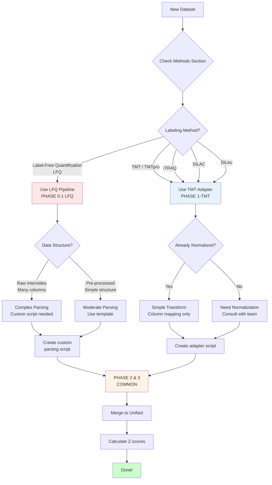

# TMT vs LFQ Processing Guide for ECM Atlas

**Purpose:** Comprehensive guide for processing both TMT and LFQ proteomics datasets into the unified ECM Atlas database.

**Created:** 2025-10-15
**For:** Claude Code agents and human researchers

---

## Table of Contents

1. [Pipeline Overview](#pipeline-overview)
2. [Common Components (Shared by Both)](#common-components-shared-by-both)
3. [LFQ-Specific Processing](#lfq-specific-processing)
4. [TMT-Specific Processing](#tmt-specific-processing)
5. [Decision Tree: Which Pipeline to Use?](#decision-tree-which-pipeline-to-use)
6. [Step-by-Step Instructions](#step-by-step-instructions)
7. [Troubleshooting](#troubleshooting)

---

## Pipeline Overview

### Complete Pipeline (3 Phases)



---

## Common Components (Shared by Both)

These pipeline components are **identical** for both TMT and LFQ datasets:

### ✅ PHASE 2: Merge to Unified CSV

**Script:** `merge_to_unified.py`

**What it does:**
- Appends new study data to `08_merged_ecm_dataset/merged_ecm_aging_zscore.csv`
- Creates automatic backups
- Validates schema compliance
- Updates metadata JSON

**Input Requirements (SAME for both TMT and LFQ):**
```
Study_YYYY_wide_format.csv with columns:
├── Protein_ID              (UniProt accession)
├── Protein_Name            (Full protein name)
├── Gene_Symbol             (Gene symbol from dataset)
├── Canonical_Gene_Symbol   (Standardized gene symbol)
├── Matrisome_Category      (ECM category)
├── Matrisome_Division      (Core/Associated)
├── Tissue                  (Organ_Compartment format)
├── Tissue_Compartment      (Explicit compartment)
├── Species                 (Homo sapiens / Mus musculus)
├── Abundance_Young         (Mean intensity for young)
├── Abundance_Old           (Mean intensity for old)
├── Method                  (Proteomics method)
├── Study_ID                (Unique identifier)
├── Match_Level             (Annotation level 1-4)
└── Match_Confidence        (0-100)
```

**Usage:**
```bash
python merge_to_unified.py path/to/Study_2021_wide_format.csv
```

**Output:**
- Updated `merged_ecm_aging_zscore.csv`
- Backup in `08_merged_ecm_dataset/backups/`
- Updated `unified_metadata.json`

---

### ✅ PHASE 3: Z-Score Calculation

**Script:** `universal_zscore_function.py`

**What it does:**
- Calculates z-scores for newly added study ONLY
- Groups by Tissue/Compartment (configurable)
- Handles NaN values correctly (preserves, not imputes)
- Applies log2 transform if skewness > 1
- Validates normalization (mean ≈ 0, std ≈ 1)

**Mathematical Process (IDENTICAL for TMT and LFQ):**

```python
# For each compartment group (e.g., Kidney_Glomerular):

# 1. Check skewness (on non-NaN values only)
if skewness > 1:
    values = log2(Abundance + 1)  # Transform, preserve NaN
else:
    values = Abundance  # No transform, preserve NaN

# 2. Calculate statistics (excluding NaN)
mean = values.mean(skipna=True)
std = values.std(skipna=True)

# 3. Z-score normalization
Z_score_Young = (Abundance_Young - mean_young) / std_young
Z_score_Old = (Abundance_Old - mean_old) / std_old

# NaN → NaN in z-scores (preserved)
```

**Usage:**
```bash
python universal_zscore_function.py "Study_2021" "Tissue"
```

**Output:**
- Updated `merged_ecm_aging_zscore.csv` with z-score columns
- Validation report showing mean/std per compartment

---

### ✅ Target Unified Schema (COMMON)

Both TMT and LFQ must produce this **exact** schema:

| Column | Type | Example | Source |
|--------|------|---------|--------|
| Protein_ID | str | P02452 | UniProt accession |
| Protein_Name | str | Collagen alpha-1(I) chain | Full name |
| Gene_Symbol | str | COL1A1 | From dataset |
| Canonical_Gene_Symbol | str | COL1A1 | From matrisome DB |
| Matrisome_Category | str | Collagens | ECM classification |
| Matrisome_Division | str | Core matrisome | Core/Associated |
| Tissue | str | Kidney_Glomerular | Organ_Compartment |
| Tissue_Compartment | str | Glomerular | Compartment only |
| Species | str | Homo sapiens | Organism |
| Abundance_Young | float | 23.456 | Mean young intensity |
| Abundance_Old | float | 45.678 | Mean old intensity |
| Method | str | LFQ / TMTpro 16-plex | Proteomics method |
| Study_ID | str | Randles_2021 | Unique identifier |
| Match_Level | int | 1 | Annotation level 1-4 |
| Match_Confidence | float | 95.0 | Confidence 0-100 |

**Critical Notes:**
- `Abundance_Young` and `Abundance_Old` are **already averaged** across replicates
- NaN values are **preserved** (missing proteins in some samples)
- NO imputation, NO filling of missing values

---

## LFQ-Specific Processing

### PHASE 0-LFQ: Reconnaissance

**Goal:** Understand raw data structure before parsing.

**Actions:**
1. Identify Excel file location and sheet names
2. Locate protein identifier columns (UniProt ID, Gene Symbol, Description)
3. Find LFQ intensity columns (often labeled as "LFQ intensity", sample IDs, or age codes)
4. Check for metadata sheet (age, compartment, spatial coordinates)
5. Determine age groupings and tissue compartments
6. Assess data quality (missing values, format consistency)

**Example Analysis:**
```python
import pandas as pd

# Load and inspect
df = pd.read_excel('data_raw/Author et al. - 2021/SuppTable.xlsx', sheet_name=0)
print(f"Shape: {df.shape}")
print(f"Columns: {df.columns.tolist()[:20]}")  # First 20 columns
print(f"Missing values per column:\n{df.isnull().sum()}")

# Look for metadata
xl = pd.ExcelFile('data_raw/Author et al. - 2021/SuppTable.xlsx')
print(f"Available sheets: {xl.sheet_names}")
```

**Common LFQ File Structures:**

**Type A: MaxQuant Output (Randles 2021)**
```
Columns:
- Protein IDs (UniProt)
- Majority protein IDs
- Gene names
- LFQ intensity G15, LFQ intensity T15  # Compartment + Age code
- LFQ intensity G29, LFQ intensity T29
- ... (one column per sample)
```

**Type B: With Separate Metadata Sheet (Tam 2020)**
```
Sheet 1: "Raw data"
- T: Majority protein IDs
- T: Gene names
- Profile_001, Profile_002, ... Profile_066  # Generic sample names

Sheet 2: "Sample information"
- Profile name
- Age-group (Young/Aged)
- Compartment (NP/IAF/OAF)
- Spatial coordinates
```

---

### PHASE 1-LFQ: Data Normalization (MANUAL/CUSTOM)

**Goal:** Transform raw LFQ data → wide-format CSV with ECM annotations.

**Complexity:** ⚠️ **HIGH** - Requires study-specific custom parsing logic.

**Why Manual?**
- Every journal/lab formats data differently
- Column names vary wildly
- Metadata may be in separate sheets or embedded in column names
- Age definitions are study-specific
- Compartment labels are inconsistent

**Required Steps:**

#### Step 1.1: Create Study Configuration

Create `05_papers_to_csv/XX_Author_YEAR_paper_to_csv/study_config.json`:

```json
{
  "study_id": "Author_2021",
  "pmid": "12345678",
  "species": "Homo sapiens",
  "tissue": "Kidney",
  "method": "LFQ",
  "data_file": "../../data_raw/Author et al. - 2021/SupplementaryTable.xlsx",
  "data_sheet": "Data Matrix",
  "metadata_sheet": null,

  "column_mapping": {
    "protein_id": "Protein IDs",
    "protein_name": "Protein names",
    "gene_symbol": "Gene names",
    "intensity_columns": null  // Auto-detect
  },

  "age_groups": {
    "young": [15, 29, 37],
    "old": [61, 67, 69]
  },

  "compartments": {
    "G": "Glomerular",
    "T": "Tubulointerstitial"
  },

  "parse_sample_info": {
    "method": "regex",
    "compartment_pattern": "^([A-Z])",  // Extract first letter
    "age_pattern": "([0-9]+)$"          // Extract trailing number
  }
}
```

#### Step 1.2: Parse Raw Data → Long Format

```python
import pandas as pd
import json

# Load config
with open('study_config.json') as f:
    config = json.load(f)

# Load raw data
df = pd.read_excel(config['data_file'], sheet_name=config['data_sheet'])

# Extract protein identifiers
id_cols = [
    config['column_mapping']['protein_id'],
    config['column_mapping']['gene_symbol']
]

# Auto-detect LFQ columns
lfq_cols = [col for col in df.columns if 'LFQ intensity' in col]

# Melt to long format
df_long = df[id_cols + lfq_cols].melt(
    id_vars=id_cols,
    value_vars=lfq_cols,
    var_name='Sample_Column',
    value_name='Abundance'
)

# Parse sample metadata from column names
df_long['Compartment'] = df_long['Sample_Column'].str.extract(
    config['parse_sample_info']['compartment_pattern']
)[0]
df_long['Age'] = df_long['Sample_Column'].str.extract(
    config['parse_sample_info']['age_pattern']
)[0].astype(int)

# Map compartment codes to full names
df_long['Tissue_Compartment'] = df_long['Compartment'].map(config['compartments'])

# Classify age groups
df_long['Age_Group'] = df_long['Age'].apply(
    lambda x: 'Young' if x in config['age_groups']['young'] else 'Old'
)

print(f"Long format: {len(df_long)} rows")
```

#### Step 1.3: ECM Annotation

```python
# Load human matrisome reference
matrisome = pd.read_csv('references/human_matrisome_v2.csv')

# Merge to annotate ECM proteins
df_annotated = df_long.merge(
    matrisome,
    left_on='Gene names',
    right_on='Gene Symbol',
    how='left',
    indicator=True
)

# Calculate match confidence
df_annotated['Match_Confidence'] = df_annotated['_merge'].map({
    'both': 100,
    'left_only': 0
})

# Filter to ECM proteins only
df_ecm = df_annotated[df_annotated['Match_Confidence'] > 0].copy()

print(f"ECM proteins: {df_ecm['Protein IDs'].nunique()}/{df_long['Protein IDs'].nunique()}")
```

#### Step 1.4: Aggregate to Wide Format

```python
# Group by protein and calculate means per age group
df_wide = df_ecm.groupby([
    'Protein IDs',
    'Gene names',
    'Tissue_Compartment',
    'Matrisome Category',
    'Matrisome Division'
]).apply(lambda x: pd.Series({
    'Abundance_Young': x[x['Age_Group'] == 'Young']['Abundance'].mean(),
    'Abundance_Old': x[x['Age_Group'] == 'Old']['Abundance'].mean(),
    'N_Samples_Young': x[x['Age_Group'] == 'Young']['Abundance'].notna().sum(),
    'N_Samples_Old': x[x['Age_Group'] == 'Old']['Abundance'].notna().sum()
})).reset_index()

# Rename to unified schema
df_wide = df_wide.rename(columns={
    'Protein IDs': 'Protein_ID',
    'Gene names': 'Gene_Symbol',
    'Matrisome Category': 'Matrisome_Category',
    'Matrisome Division': 'Matrisome_Division'
})

# Add study metadata
df_wide['Study_ID'] = config['study_id']
df_wide['Species'] = config['species']
df_wide['Method'] = config['method']
df_wide['Tissue'] = config['tissue'] + '_' + df_wide['Tissue_Compartment']

# Save
df_wide.to_csv('Author_2021_wide_format.csv', index=False)
print(f"Saved wide format: {len(df_wide)} rows")
```

---

## TMT-Specific Processing

### PHASE 0-TMT: Quick Assessment

**Goal:** Verify that TMT data is already pre-processed and suitable for direct transformation.

**Actions:**
1. Confirm isobaric labeling method (TMT, iTRAQ, SILAC)
2. Check that data is already normalized (e.g., quantile normalization)
3. Verify protein identifiers are present (UniProt IDs)
4. Identify sample replicate columns
5. Confirm ECM classification is already done (if available)
6. Assess age group structure

**Example (Ouni 2022):**
```python
import pandas as pd

df = pd.read_excel('data_raw/Ouni et al. - 2022/Supp Table 3.xlsx',
                   sheet_name='Matrisome Proteins')

print(f"Shape: {df.shape}")  # (102, 33)
print(f"Columns: {df.columns.tolist()}")

# Check what we have:
# ✅ Category, Division (ECM classification already done!)
# ✅ Accession (UniProt IDs)
# ✅ EntryGeneSymbol (Gene symbols)
# ✅ Q. Norm. of TOT_prepub1-5 (Normalized TMT intensities for prepubertal)
# ✅ Q. Norm. of TOT_repro1-5 (Reproductive age)
# ✅ Q. Norm. of TOT_meno1-5 (Menopausal)

# This is 80% done already! Just need simple transformation.
```

---

### PHASE 1-TMT: Simple Transform (LIGHTWEIGHT)

**Goal:** Map pre-processed TMT data → wide-format CSV.

**Complexity:** ⚠️ **LOW** - Usually just column renaming and averaging.

**Why Simple?**
- TMT data is typically pre-normalized by the authors
- Protein IDs are standardized (mass spec output)
- ECM classification may already be done
- Sample structure is clear from TMT channel design

**Required Steps:**

#### Step 1.1: Create TMT Adapter Script

Create `11_subagent_for_LFQ_ingestion/tmt_adapter_ouni2022.py`:

```python
#!/usr/bin/env python3
"""
TMT Adapter for Ouni et al. 2022
Transforms TMTpro 16-plex data to unified wide-format schema
"""

import pandas as pd
import numpy as np

def process_ouni2022():
    """Process Ouni 2022 TMT data to wide format."""

    # 1. Load TMT data
    df = pd.read_excel(
        'data_raw/Ouni et al. - 2022/Supp Table 3.xlsx',
        sheet_name='Matrisome Proteins'
    )

    print(f"Loaded {len(df)} matrisome proteins")

    # 2. Define sample columns
    prepub_cols = [f'Q. Norm. of TOT_prepub{i}' for i in range(1, 6)]
    repro_cols = [f'Q. Norm. of TOT_repro{i}' for i in range(1, 6)]
    meno_cols = [f'Q. Norm. of TOT_meno{i}' for i in range(1, 6)]

    # 3. Calculate means per age group
    df['Abundance_Prepubertal'] = df[prepub_cols].mean(axis=1)
    df['Abundance_Reproductive'] = df[repro_cols].mean(axis=1)
    df['Abundance_Menopausal'] = df[meno_cols].mean(axis=1)

    # 4. Decision: How to map 3 age groups to Young/Old binary?
    # Option A: Prepubertal=Young, Menopausal=Old (exclude Reproductive)
    # Option B: Reproductive=Young, Menopausal=Old (standard reproductive age)
    # Option C: Create 2 separate entries per protein (Prepub vs Repro, Repro vs Meno)

    # Choose Option B (most comparable to other studies)
    df['Abundance_Young'] = df['Abundance_Reproductive']
    df['Abundance_Old'] = df['Abundance_Menopausal']

    # 5. Map to unified schema
    df_wide = pd.DataFrame({
        'Protein_ID': df['Accession'],
        'Protein_Name': df['EntryName'],
        'Gene_Symbol': df['EntryGeneSymbol'],
        'Canonical_Gene_Symbol': df['EntryGeneSymbol'],  # Already canonical
        'Matrisome_Category': df['Category'],
        'Matrisome_Division': df['Division'],
        'Tissue': 'Ovary_Cortex',
        'Tissue_Compartment': 'Cortex',
        'Species': 'Homo sapiens',
        'Abundance_Young': df['Abundance_Young'],
        'Abundance_Old': df['Abundance_Old'],
        'Method': 'DC-MaP + TMTpro 16-plex',
        'Study_ID': 'Ouni_2022',
        'Match_Level': 1,  # ECM classification already done by authors
        'Match_Confidence': 100.0
    })

    # 6. Save wide format
    output_file = '05_papers_to_csv/08_Ouni_2022_paper_to_csv/Ouni_2022_wide_format.csv'
    df_wide.to_csv(output_file, index=False)

    print(f"\n✅ Created wide format: {output_file}")
    print(f"   - {len(df_wide)} proteins")
    print(f"   - Young age: Reproductive (26±5 years)")
    print(f"   - Old age: Menopausal (59±8 years)")
    print(f"\nNext steps:")
    print(f"   1. python merge_to_unified.py {output_file}")
    print(f"   2. python universal_zscore_function.py 'Ouni_2022' 'Tissue'")

    return df_wide

if __name__ == '__main__':
    df = process_ouni2022()
```

**Usage:**
```bash
python tmt_adapter_ouni2022.py
```

**That's it!** TMT processing done. Now proceed to PHASE 2 & 3 (same as LFQ).

---

## Decision Tree: Which Pipeline to Use?



---

## Step-by-Step Instructions

### For LFQ Datasets

**Phase 0: Reconnaissance**
```bash
# 1. Examine raw data
cd data_raw/Author\ et\ al.\ -\ 2021/
ls -lh  # Check files
python3 << EOF
import pandas as pd
xl = pd.ExcelFile('SupplementaryTable.xlsx')
print("Sheets:", xl.sheet_names)
df = pd.read_excel('SupplementaryTable.xlsx', sheet_name=0, nrows=5)
print("\nColumns:", df.columns.tolist())
EOF
```

**Phase 1: Custom Processing**
```bash
# 2. Create study folder
mkdir -p 05_papers_to_csv/XX_Author_2021_paper_to_csv
cd 05_papers_to_csv/XX_Author_2021_paper_to_csv

# 3. Copy template
cp ../../11_subagent_for_LFQ_ingestion/study_config_template.py ./study_config.json

# 4. Edit configuration
nano study_config.json  # Fill in study-specific details

# 5. Create custom parsing script
nano process_author2021.py  # Adapt from examples

# 6. Run processing
python3 process_author2021.py

# Output: Author_2021_wide_format.csv
```

**Phase 2: Merge**
```bash
cd ../..  # Back to repo root
python3 11_subagent_for_LFQ_ingestion/merge_to_unified.py \
    05_papers_to_csv/XX_Author_2021_paper_to_csv/Author_2021_wide_format.csv
```

**Phase 3: Z-Scores**
```bash
python3 11_subagent_for_LFQ_ingestion/universal_zscore_function.py \
    "Author_2021" "Tissue"
```

---

### For TMT Datasets

**Phase 0: Quick Assessment**
```bash
# 1. Check data structure
cd data_raw/Author\ et\ al.\ -\ 2022/
python3 << EOF
import pandas as pd
df = pd.read_excel('SupplementaryTable.xlsx', sheet_name=0)
print(f"Shape: {df.shape}")
print(f"Columns: {df.columns.tolist()}")
print(f"\nHas ECM classification? {'Category' in df.columns}")
print(f"Has UniProt IDs? {'Accession' in df.columns}")
print(f"Normalized? {'Norm' in ' '.join(df.columns)}")
EOF
```

**Phase 1: Simple Transform**
```bash
# 2. Create adapter script
cd ../../11_subagent_for_LFQ_ingestion
cp tmt_adapter_template.py tmt_adapter_author2022.py

# 3. Edit adapter
nano tmt_adapter_author2022.py  # Simple column mapping

# 4. Run adapter
python3 tmt_adapter_author2022.py

# Output: Author_2022_wide_format.csv
```

**Phase 2 & 3: Same as LFQ**
```bash
# Merge
python3 merge_to_unified.py ../05_papers_to_csv/XX_Author_2022_paper_to_csv/Author_2022_wide_format.csv

# Z-scores
python3 universal_zscore_function.py "Author_2022" "Tissue"
```

---

## Troubleshooting

### Common LFQ Issues

**Problem: Can't identify LFQ columns**
```python
# Solution: Manual inspection
df = pd.read_excel('data.xlsx')
print(df.columns[df.columns.str.contains('LFQ|Intensity|abundance', case=False)])
```

**Problem: Age information missing**
```python
# Solution: Check methods section of paper or metadata
# Often ages are in:
# - Separate metadata sheet
# - Column names (e.g., "G15" = Glomerular age 15)
# - Supplementary table captions
```

**Problem: Multiple compartments mixed**
```python
# Solution: Create separate rows per compartment
df_long['Compartment'] = df_long['Sample'].str.extract(r'([A-Z]+)\d+')[0]
df_grouped = df_long.groupby(['Protein_ID', 'Compartment', 'Age_Group'])
```

### Common TMT Issues

**Problem: Three age groups, need binary Young/Old**
```python
# Solution Option 1: Map middle group to Young
age_mapping = {
    'Prepubertal': 'Young',
    'Reproductive': 'Young',  # Choose this
    'Menopausal': 'Old'
}

# Solution Option 2: Create 2 separate comparisons
# Entry 1: Prepubertal (Young) vs Reproductive (Old)
# Entry 2: Reproductive (Young) vs Menopausal (Old)
```

**Problem: Data not normalized**
```python
# Solution: Apply quantile normalization before transform
from sklearn.preprocessing import quantile_transform
df_norm = pd.DataFrame(
    quantile_transform(df[sample_cols]),
    columns=sample_cols,
    index=df.index
)
```

### Common Issues (Both)

**Problem: Missing UniProt IDs**
```python
# Solution: Use UniProt mapping API
import requests

def map_gene_to_uniprot(gene_symbol, species='human'):
    url = f"https://rest.uniprot.org/uniprotkb/search?query=gene:{gene_symbol}+AND+organism_id:9606&format=tsv&fields=accession"
    response = requests.get(url)
    if response.ok:
        return response.text.split('\n')[1].strip()
    return None

df['Protein_ID'] = df['Gene_Symbol'].apply(map_gene_to_uniprot)
```

**Problem: ECM classification missing**
```python
# Solution: Merge with matrisome reference
matrisome = pd.read_csv('references/human_matrisome_v2.csv')
df = df.merge(matrisome, on='Gene_Symbol', how='left')
df_ecm = df[df['Matrisome_Category'].notna()]  # ECM proteins only
```

**Problem: Too many NaN values**
```python
# Analysis: Check NaN percentage
nan_pct = df[['Abundance_Young', 'Abundance_Old']].isnull().mean() * 100
print(f"NaN in Young: {nan_pct['Abundance_Young']:.1f}%")
print(f"NaN in Old: {nan_pct['Abundance_Old']:.1f}%")

# Expected: 50-80% NaN is NORMAL for proteomics
# Action: DO NOT impute - preserve NaN in output
```

---

## Summary: Key Differences

| Aspect | LFQ Pipeline | TMT Pipeline |
|--------|--------------|--------------|
| **Complexity** | HIGH - Custom parsing required | LOW - Simple transformation |
| **Phase 0** | Extensive reconnaissance | Quick assessment |
| **Phase 1** | Manual custom script | Lightweight adapter |
| **Normalization** | Post-acquisition z-scores | Pre-normalized by authors |
| **Time Required** | 2-4 hours per study | 30-60 minutes per study |
| **Error Prone** | Yes - parsing variations | No - standardized format |
| **Automation** | Difficult | Easy |
| **Example Scripts** | Study-specific | Reusable template |

| Aspect | COMMON (Both) |
|--------|---------------|
| **Phase 2** | Same merge script |
| **Phase 3** | Same z-score calculation |
| **Target Schema** | Identical 15-column format |
| **NaN Handling** | Preserve, never impute |
| **Output** | Same unified database |

---

## Recommendations

### For Processing New Datasets:

1. **Always check method first:** Read paper's methods section to identify LFQ vs TMT/iTRAQ/SILAC

2. **For LFQ:**
   - Budget 2-4 hours for custom parsing
   - Start with reconnaissance (Phase 0)
   - Look for similar studies as templates
   - Test with small subset first

3. **For TMT:**
   - Budget 30-60 minutes for transformation
   - Check if ECM classification already done
   - Verify normalization method
   - Decide on age group mapping strategy

4. **Both methods:**
   - Use `merge_to_unified.py` (Phase 2)
   - Use `universal_zscore_function.py` (Phase 3)
   - Validate output at each step
   - Check NaN percentages (50-80% is normal!)

5. **Quality checks:**
   ```bash
   # After Phase 1
   python3 -c "import pandas as pd; df=pd.read_csv('Study_wide_format.csv'); print(df.info()); print(df.head())"

   # After Phase 2
   python3 -c "import pandas as pd; df=pd.read_csv('08_merged_ecm_dataset/merged_ecm_aging_zscore.csv'); print(df[df['Study_ID']=='Author_2021'].shape)"

   # After Phase 3
   python3 -c "import pandas as pd; df=pd.read_csv('08_merged_ecm_dataset/merged_ecm_aging_zscore.csv'); print(df[df['Study_ID']=='Author_2021'][['Zscore_Young', 'Zscore_Old']].describe())"
   ```

---

## Conclusion

The ECM Atlas pipeline is **modular by design**:
- **Phase 1 is method-specific** (LFQ vs TMT require different approaches)
- **Phases 2 & 3 are universal** (same for all proteomics methods)

This design allows flexibility in data acquisition while maintaining a unified, standardized database for downstream analysis.

---

**Document Version:** 1.0
**Last Updated:** 2025-10-15
**Maintainer:** Claude Code Agent Team
