# Step 3.5: Protein Metadata Enrichment (Pre-Annotation)

**When to use:** After schema standardization (Step 3), BEFORE matrisome annotation (Step 4)

**Purpose:** Fill missing `Protein_Name` and `Gene_Symbol` fields by fetching metadata from UniProt REST API

**Status:** **CRITICAL FOR API RELIABILITY** - Prevents JSON serialization bugs in dashboards

---

## Problem Statement

### Issue Discovered: October 14, 2025

**Symptom:** Compare Datasets tab in dashboard fails with JavaScript error:
```
SyntaxError: Unexpected token 'N', ..."ein_name":NaN}... is not valid JSON
```

**Root Cause:** Some datasets (especially Schuler et al. 2021) have missing `Protein_Name` in source files. When Flask API serializes pandas `NaN` to JSON, it becomes literal JavaScript `NaN` (invalid JSON) instead of `null`.

**Impact:** 16.4% of merged dataset (423/2575 records) have missing `Protein_Name`

### Why This Happens

| Dataset | Missing Protein_Name | Reason |
|---------|---------------------|---------|
| Schuler_2021_EDL | 278/278 (100%) | Source Excel has no `Protein_Name` column |
| Schuler_2021_TA | 65/65 (100%) | Source Excel has no `Protein_Name` column |
| Schuler_2021_Soleus | 37/37 (100%) | Source Excel has no `Protein_Name` column |
| Schuler_2021_Gastrocnemius | 18/18 (100%) | Source Excel has no `Protein_Name` column |
| Angelidis_2019 | 25/291 (8.6%) | Some UniProt IDs lack full names (isoforms) |

**Example problematic record:**
```
Protein_ID:   P01635
Gene_Symbol:  NaN   ← Missing!
Protein_Name: NaN   ← Missing!
Actual:       IGKC (Ig kappa chain C region)
```

---

## Solution: UniProt API Enrichment

### Overview

Fetch missing metadata from UniProt REST API and merge back into unified CSV.

### Algorithm

#### Step 1: Identify Missing Metadata

```python
import pandas as pd

# Load merged dataset
df = pd.read_csv('08_merged_ecm_dataset/merged_ecm_aging_zscore.csv')

print("Missing metadata analysis:")
print(f"  Protein_Name: {df['Protein_Name'].isna().sum()} / {len(df)} ({df['Protein_Name'].isna().sum()/len(df)*100:.1f}%)")
print(f"  Gene_Symbol:  {df['Gene_Symbol'].isna().sum()} / {len(df)} ({df['Gene_Symbol'].isna().sum()/len(df)*100:.1f}%)")

# Get unique proteins needing enrichment
needs_enrichment = df[
    df['Protein_Name'].isna() | df['Gene_Symbol'].isna()
]['Protein_ID'].unique()

print(f"\n{len(needs_enrichment)} unique proteins need enrichment")
```

#### Step 2: Fetch from UniProt API

```python
import requests
from time import sleep

UNIPROT_API = "https://rest.uniprot.org/uniprotkb/{}.json"
RATE_LIMIT_DELAY = 0.1  # 10 requests/second (UniProt limit)

def fetch_protein_metadata(uniprot_id):
    """
    Fetch metadata from UniProt REST API

    Returns:
        dict with keys: name, gene, organism, source, confidence
        or None if fetch fails
    """
    url = UNIPROT_API.format(uniprot_id)

    try:
        response = requests.get(url, timeout=5)

        if response.status_code == 200:
            data = response.json()

            # Extract protein name
            protein_desc = data.get('proteinDescription', {})
            name = None
            if 'recommendedName' in protein_desc:
                name = protein_desc['recommendedName'].get('fullName', {}).get('value')
            elif 'submittedName' in protein_desc:
                submitted = protein_desc['submittedName']
                if isinstance(submitted, list) and len(submitted) > 0:
                    name = submitted[0].get('fullName', {}).get('value')

            # Extract gene symbol
            genes = data.get('genes', [])
            gene_symbol = None
            if genes and len(genes) > 0:
                gene_symbol = genes[0].get('geneName', {}).get('value')

            return {
                'name': name,
                'gene': gene_symbol,
                'organism': data.get('organism', {}).get('scientificName', 'Unknown'),
                'source': 'UniProt',
                'confidence': 1.0
            }
        else:
            print(f"  ⚠️  HTTP {response.status_code}")
            return None

    except Exception as e:
        print(f"  ❌ Error: {e}")
        return None

# Fetch for all proteins
enrichment_data = []

for i, protein_id in enumerate(needs_enrichment, 1):
    print(f"[{i}/{len(needs_enrichment)}] {protein_id}...", end=' ')

    metadata = fetch_protein_metadata(protein_id)

    if metadata and (metadata['name'] or metadata['gene']):
        enrichment_data.append({
            'Protein_ID': protein_id,
            'Enriched_Name': metadata['name'],
            'Enriched_Gene': metadata['gene'],
            'Organism': metadata['organism'],
            'Source': metadata['source'],
            'Confidence': metadata['confidence']
        })
        print(f"✅ {metadata['gene'] or 'N/A'} | {(metadata['name'] or 'N/A')[:40]}")
    else:
        print("❌ Failed")

    sleep(RATE_LIMIT_DELAY)  # Rate limiting

print(f"\nSuccessfully enriched: {len(enrichment_data)} / {len(needs_enrichment)}")
```

**Expected time:** ~40 seconds for 400 proteins (0.1 sec/protein + API latency)

#### Step 3: Save Enrichment Table

```python
# Save enrichment lookup table
enrichment_df = pd.DataFrame(enrichment_data)
enrichment_df.to_csv('08_merged_ecm_dataset/merged_ecm_enrichment.csv', index=False)

print(f"✅ Saved: merged_ecm_enrichment.csv")
print(f"   Columns: {list(enrichment_df.columns)}")
print(f"   Rows: {len(enrichment_df)}")
```

**Output file structure:**
```
Protein_ID | Enriched_Name            | Enriched_Gene | Organism      | Source  | Confidence
P01635     | Ig kappa chain C region  | Igkc          | Mus musculus  | UniProt | 1.0
Q61646     | Haptoglobin              | Hp            | Mus musculus  | UniProt | 1.0
...
```

#### Step 4: Merge Back to Unified CSV

```python
# Load original merged dataset
df = pd.read_csv('08_merged_ecm_dataset/merged_ecm_aging_zscore.csv')

# Load enrichment table
enrichment_df = pd.read_csv('08_merged_ecm_dataset/merged_ecm_enrichment.csv')

# Merge enrichment data
df_enriched = df.merge(
    enrichment_df[['Protein_ID', 'Enriched_Name', 'Enriched_Gene']],
    on='Protein_ID',
    how='left'
)

# Fill missing values with enriched data
original_name_nulls = df_enriched['Protein_Name'].isna().sum()
original_gene_nulls = df_enriched['Gene_Symbol'].isna().sum()

df_enriched['Protein_Name'] = df_enriched['Protein_Name'].fillna(df_enriched['Enriched_Name'])
df_enriched['Gene_Symbol'] = df_enriched['Gene_Symbol'].fillna(df_enriched['Enriched_Gene'])

# Add data quality flag
df_enriched['Data_Quality'] = 'Original'
df_enriched.loc[df_enriched['Enriched_Name'].notna(), 'Data_Quality'] = 'Enriched_UniProt'

# Remove temporary columns
df_enriched = df_enriched.drop(columns=['Enriched_Name', 'Enriched_Gene'])

# Save enriched dataset
df_enriched.to_csv('08_merged_ecm_dataset/merged_ecm_aging_zscore_enriched.csv', index=False)

# Summary
new_name_nulls = df_enriched['Protein_Name'].isna().sum()
new_gene_nulls = df_enriched['Gene_Symbol'].isna().sum()

print(f"\n✅ Enrichment Complete!")
print(f"\nBefore → After:")
print(f"  Protein_Name NaN: {original_name_nulls} → {new_name_nulls} (fixed {original_name_nulls - new_name_nulls})")
print(f"  Gene_Symbol NaN:  {original_gene_nulls} → {new_gene_nulls} (fixed {original_gene_nulls - new_gene_nulls})")
```

#### Step 5: Update API Server to Use Enriched Dataset

```python
# In api_server.py, update data loading:

# OLD:
data_path = os.path.join(script_dir, '../08_merged_ecm_dataset/merged_ecm_aging_zscore.csv')

# NEW:
data_path = os.path.join(script_dir, '../08_merged_ecm_dataset/merged_ecm_aging_zscore_enriched.csv')
```

---

## Complete Enrichment Script

**Location:** `08_merged_ecm_dataset/enrich_missing_metadata.py`

**Usage:**
```bash
cd 08_merged_ecm_dataset
python3 enrich_missing_metadata.py
```

**Output files:**
1. `merged_ecm_enrichment.csv` - Enrichment lookup table
2. `merged_ecm_aging_zscore_enriched.csv` - Main dataset with filled metadata

**Expected results:**
- ~400 proteins enriched (95% success rate)
- ~20 proteins may still be missing (UniProt doesn't have data)
- Data quality preserved (flagged with `Data_Quality` column)

---

## Integration with Pipeline

### When to Run Enrichment

```mermaid
graph LR
    A[Step 1-2:<br/>Parse & Age Bin] --> B[Long-format data]
    B --> C[Step 3:<br/>Schema Standardization]
    C --> D[Standardized data<br/>with NaN metadata]
    D --> E[🔄 ENRICHMENT<br/>Step 3.5]
    E --> F[Enriched data<br/>Gene_Symbol filled]
    F --> G[Step 4:<br/>Matrisome Annotation]
    G --> H[Annotated data]

    style E fill:#FFD700
    style F fill:#90EE90
    style G fill:#87CEEB
```



**Recommendation:** Run enrichment **PER STUDY** during PHASE 1 processing, BEFORE annotation.

**Why?**
- Better annotation quality (Gene_Symbol match is most reliable)
- Validates data quality early in pipeline
- Prevents annotation mismatches from missing metadata
- Proper data engineering flow: normalize → enrich → annotate

### Pipeline Checklist (Per Study)

- [ ] Step 1-2: Parse data and assign age bins
- [ ] Step 3: Schema standardization
- [ ] **Step 3.5: Run enrichment** ← Fetch missing metadata from UniProt
- [ ] Step 4: Matrisome annotation (uses enriched Gene_Symbol)
- [ ] Step 5-7: Wide-format conversion, validation, export
- [ ] PHASE 2: Merge to unified CSV
- [ ] PHASE 3: Calculate z-scores
- [ ] Test dashboard

---

## Quality Assurance

### Validation Checks

```python
# After enrichment, validate results
df_enriched = pd.read_csv('08_merged_ecm_dataset/merged_ecm_aging_zscore_enriched.csv')

print("Validation Report:")
print(f"  Total records: {len(df_enriched)}")
print(f"  Enriched records: {(df_enriched['Data_Quality'] == 'Enriched_UniProt').sum()}")
print(f"  Remaining NaN Protein_Name: {df_enriched['Protein_Name'].isna().sum()}")
print(f"  Remaining NaN Gene_Symbol: {df_enriched['Gene_Symbol'].isna().sum()}")

# Check specific problematic protein
p01635 = df_enriched[df_enriched['Protein_ID'] == 'P01635']
if len(p01635) > 0:
    print(f"\nP01635 (IGKC) check:")
    print(f"  Gene_Symbol:  {p01635['Gene_Symbol'].iloc[0]}")
    print(f"  Protein_Name: {p01635['Protein_Name'].iloc[0]}")
    print(f"  Data_Quality: {p01635['Data_Quality'].iloc[0]}")
```

### Expected Results

| Metric | Before Enrichment | After Enrichment |
|--------|-------------------|------------------|
| Missing Protein_Name | 423 (16.4%) | ~23 (<1%) |
| Missing Gene_Symbol | 1 (0.04%) | 0 (0%) |
| Enriched records | 0 | ~400 |

---

## API-Side Protection (Defense in Depth)

Even with enrichment, add defensive code in Flask API:

### 1. Filter NaN from Arrays

```python
# In api_server.py, line 339-340:
compartments = sorted([c for c in filtered_df['Compartment'].unique() if pd.notna(c)])
proteins = [p for p in filtered_df['Gene_Symbol'].unique() if pd.notna(p)]
```

### 2. Global JSON Encoder

```python
# In api_server.py, add at top:
from flask.json.provider import DefaultJSONProvider

class NaNSafeJSONProvider(DefaultJSONProvider):
    """Convert pandas NaN to JSON null"""
    def default(self, obj):
        if pd.isna(obj):
            return None
        if isinstance(obj, (np.integer, np.floating)):
            if np.isnan(obj) or np.isinf(obj):
                return None
            return float(obj) if isinstance(obj, np.floating) else int(obj)
        return super().default(obj)

app.json = NaNSafeJSONProvider(app)  # Apply globally
```

**Why both?**
- **Enrichment (ETL layer):** Fixes root cause, improves data quality
- **API filters (Business logic):** Defensive programming, handles edge cases
- **JSON encoder (Serialization):** Safety net, automatic protection

This creates **3 layers of protection** against NaN bugs.

---

## Troubleshooting

### Problem: UniProt API rate limiting
**Symptom:** `429 Too Many Requests` errors
**Solution:** Increase `RATE_LIMIT_DELAY` to 0.2 seconds (5 req/sec)

### Problem: Some proteins still have NaN after enrichment
**Diagnosis:** UniProt doesn't have complete metadata for these proteins
**Action:** This is acceptable - API-side filters will handle it

### Problem: Enrichment script timeout
**Symptom:** Script takes >5 minutes for 400 proteins
**Solution:** Run in background: `python3 enrich_missing_metadata.py > enrichment.log 2>&1 &`

### Problem: Wrong organism returned
**Symptom:** Mouse proteins get human names
**Solution:** Check `Species` column in merged CSV matches UniProt organism

---

## References

- **UniProt REST API docs:** https://www.uniprot.org/help/api
- **Bug report:** `documentation/Technical_Issues_NaN_Serialization.md`
- **Enrichment script:** `08_merged_ecm_dataset/enrich_missing_metadata.py`
- **Git commit:** `c7c4623` (Fix) + `fdd3acb` (Documentation)

---

## Summary

**Problem:** 16.4% of proteins missing `Protein_Name` → JSON serialization errors

**Solution:** Fetch missing metadata from UniProt API after merging studies

**Result:** <1% missing metadata, dashboard works correctly

**Implementation time:** ~45 minutes (script: 5 min, runtime: 40 min for 400 proteins)

**Maintenance:** Re-run enrichment only when adding new studies with missing metadata

---

**Next step:** Continue to Step 4 (Matrisome Annotation) in `01_LFQ_DATASET_NORMALIZATION_AND_MERGE.md`

**Note:** This enrichment step is now integrated into PHASE 1 study processing, not a separate post-merge operation.
