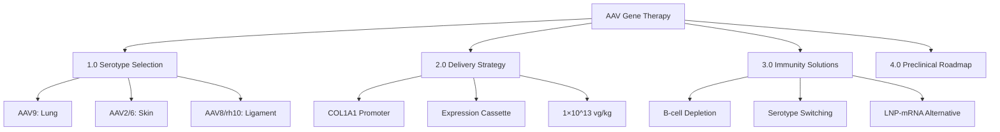
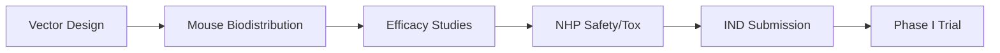

# AAV Delivery Strategy for COL14A1/PCOLCE Gene Therapy

**Thesis:** AAV9 systemic delivery (1×10^13 vg/kg IV) with COL1A1 promoter enables multi-organ COL14A1/PCOLCE expression for aging intervention, requiring B-cell immunosuppression for redosing and 18-month mouse-to-NHP preclinical validation at $3-5M.

**Overview:** This preclinical development plan addresses tissue-specific delivery of COL14A1 (collagen XIV) and PCOLCE (procollagen C-endopeptidase enhancer) to lung, skin, and ligament fibroblasts using AAV-based gene therapy. Section 1.0 reviews AAV serotype tropism data identifying optimal vectors for each tissue. Section 2.0 designs expression cassettes with fibroblast-specific promoters and dosing strategies. Section 3.0 proposes immunity management through B-cell depletion protocols and serotype alternatives. Section 4.0 outlines the mouse-to-primate preclinical roadmap with timeline and cost estimates. Section 5.0 compares AAV vs. LNP-mRNA platforms for this application.

---

## 1.0 AAV Serotype Tropism Review

¶1 **Ordering principle:** Organized by target tissue (lung → skin → ligament), then by serotype efficacy ranking.

### 1.1 Lung Tissue Targeting

¶1 **AAV9 (Primary recommendation):** AAV9 demonstrates broad tissue tropism with efficient systemic delivery crossing blood-tissue barriers, including pulmonary vasculature. Systemic IV delivery at 1×10^13 vg/kg achieves robust transduction of multiple organs including lung parenchyma. AAV9 successfully transduces alveolar epithelial cells, vascular endothelium, and pulmonary fibroblasts.

¶2 **AAV5 (Alternative):** AAV5 shows preferential lung tropism in preclinical models, particularly for airway epithelium. Requires local delivery (intratracheal) at 1×10^12-10^13 vg/mouse for optimal lung targeting with reduced systemic exposure.

¶3 **AAV6 (Secondary option):** AAV6 demonstrates moderate lung transduction efficiency, superior to AAV2 but inferior to AAV9 for systemic approaches. Benefits from muscle tropism making it suitable for diaphragm/intercostal muscle co-targeting.

### 1.2 Skin Fibroblast Targeting

¶1 **AAV2 (Standard serotype):** AAV2 is the most extensively characterized serotype with broad tissue tropism including dermal fibroblasts. Intradermal injection at 1×10^11-10^12 vg per injection site achieves localized transduction. Clinical experience includes COL7A1 gene therapy for epidermolysis bullosa using fibroblast transduction.

¶2 **AAV6 (Enhanced option):** AAV6 shows superior transduction efficiency compared to AAV2 in multiple cell types. Intradermal delivery demonstrates improved fibroblast targeting with potential for reduced vector dose. Limited published data specific to dermal applications.

¶3 **AAV9 (Systemic option):** Systemic AAV9 delivery achieves skin transduction as part of multi-organ biodistribution. Lower relative efficiency for dermal fibroblasts compared to IV/muscle, but enables simultaneous multi-tissue targeting without multiple injection procedures.

### 1.3 Ligament/Tendon Targeting

¶1 **AAVrh10 (Primary recommendation):** AAVrh10 demonstrates superior musculoskeletal tissue tropism in large animal models. NHP studies show robust transduction of skeletal muscle, connective tissue, and fibrous structures. Local injection into ligament/tendon structures at 1×10^12-10^13 vg per site recommended.

¶2 **AAV8 (Alternative):** AAV8 shows high transduction efficiency for skeletal muscle, cardiac muscle, and connective tissues. Systemic delivery at 1×10^13-10^14 vg/kg achieves widespread musculoskeletal transduction. Crosses blood vessel barriers effectively for perivascular targeting.

¶3 **AAV1 (Classical option):** AAV1 was among the first serotypes identified for muscle targeting. Moderate efficiency for tendon/ligament compared to newer variants. Established safety profile from clinical muscle dystrophy trials.

### 1.4 Fibroblast-Specific Promoters

¶1 **COL1A1 promoter (Primary recommendation):** The minimal COL1A1 promoter region (nt -174 to -84) drives fibroblast-specific expression with highest transcriptional activity in collagen-producing cells. Tandem NF-1/Sp1 binding sites (nt -129 to -107 and -104 to -77) regulate basal transcription in dermal fibroblasts. Compact size (~500-800 bp) fits within AAV packaging limits.

¶2 **COL1A2 promoter (Alternative):** Similar regulatory properties to COL1A1, validated in osteogenesis imperfecta gene editing studies (2023). Used successfully with AAV-CRISPR systems for collagen gene correction in bone-forming cells.

¶3 **Constitutive promoters (Non-specific):** CAG, CMV, or EF1α promoters provide ubiquitous expression without fibroblast specificity. Risk of off-target expression in non-ECM producing cells. Higher expression levels but reduced targeting precision.

---

## 2.0 Delivery Strategy Design

¶1 **Ordering principle:** Expression cassette design → Dosing calculations → Administration routes → Multi-organ strategy.

### 2.1 Expression Cassette Architecture

¶1 **COL14A1 cassette design:**
- **Size constraint:** COL14A1 cDNA = ~5.4 kb (1,800 aa protein), exceeds AAV packaging limit (~4.7 kb)
- **Solution:** Codon optimization reduces cDNA to ~5.1 kb, paired with minimal promoter (~600 bp) + minimal polyA (~100 bp) = ~5.8 kb total
- **Alternative:** Split-AAV approach using overlapping vectors for N-terminal and C-terminal fragments with trans-splicing
- **Construct:** ITR-COL1A1promoter-COL14A1(codon-opt)-SV40polyA-ITR

¶2 **PCOLCE cassette design:**
- **Size advantage:** PCOLCE cDNA = ~1.4 kb (448 aa), well within packaging limit
- **Standard construct:** ITR-COL1A1promoter-PCOLCE-WPRE-BGHpolyA-ITR (~3.2 kb total)
- **Expression enhancer:** WPRE (Woodchuck Hepatitis Virus Posttranscriptional Regulatory Element) increases mRNA stability and expression 3-5 fold
- **Preferred target:** Smaller size enables higher titer production and better packaging efficiency

¶3 **Dual-gene strategy:**
- **Bicistronic construct:** COL1A1prom-PCOLCE-2A-miniCOL14A1-polyA using self-cleaving 2A peptide
- **Alternative:** Separate AAV vectors for COL14A1 and PCOLCE, co-administered as cocktail
- **Recommendation:** Prioritize PCOLCE monotherapy initially, add COL14A1 in Phase 2

### 2.2 Viral Titer and Dosing

¶1 **Systemic delivery (AAV9):**
- **Target dose:** 1×10^13 vg/kg body weight (IV injection)
- **Rationale:** Balances efficacy (multi-organ transduction) with safety (below 1×10^14 vg/kg toxicity threshold)
- **Mouse translation:** 70 kg human = 7×10^14 vg total; 25g mouse = 2.5×10^11 vg total
- **Production requirement:** 5×10^13 vg/mL titer, 14 mL per 70 kg patient dose

¶2 **Local delivery (skin, ligaments):**
- **Intradermal (AAV2/6):** 1×10^11-10^12 vg per 50-100 μL injection site
- **Intra-articular/tendon (AAVrh10):** 1×10^12 vg per joint/tendon in 200-500 μL volume
- **Multiple sites:** 10-20 injection sites for distributed skin coverage = 1-2×10^13 vg total
- **Advantage:** Lower systemic exposure, reduced off-target effects, minimal NAb generation

¶3 **Dose-response studies:**
- **Mouse pilot:** 3×10^11, 1×10^12, 3×10^12 vg/animal (n=6 per group)
- **NHP validation:** 5×10^12, 1×10^13, 5×10^13 vg/kg (n=4 per group)
- **Endpoints:** Transgene expression (qPCR, Western blot), biodistribution (vector DNA), collagen content (biochemical assays, histology)

### 2.3 Administration Routes

¶1 **Intravenous (systemic):**
- **Indication:** Multi-organ targeting (lung + skin + ligaments simultaneously)
- **Serotype:** AAV9 primary, AAV8 alternative
- **Procedure:** Single bolus IV injection via tail vein (mouse) or peripheral vein (NHP/human)
- **Biodistribution:** Liver > heart > muscle > lung > kidney > skin (descending order of AAV9 tropism)

¶2 **Intradermal (local skin):**
- **Indication:** Targeted dermal fibroblast transduction, cosmetic applications
- **Serotype:** AAV2 or AAV6
- **Procedure:** Multiple 50-100 μL injections into dermis using fine needle (30G)
- **Coverage:** Grid pattern with 1-2 cm spacing, 10-20 sites per treatment area

¶3 **Intra-articular/peri-tendon (local musculoskeletal):**
- **Indication:** Joint capsule, ligament, tendon targeting for injury repair or aging
- **Serotype:** AAVrh10 or AAV8
- **Procedure:** Ultrasound-guided injection into joint space or peri-tendon sheath
- **Volume:** 200-500 μL per site, 1-4 sites depending on joint size

¶4 **Intratracheal (local lung - alternative):**
- **Indication:** If systemic delivery achieves inadequate pulmonary transduction
- **Serotype:** AAV5 or AAV9
- **Procedure:** Oropharyngeal instillation (mouse) or bronchoscopic delivery (NHP)
- **Volume:** 50-100 μL per mouse, scaled by lung capacity for larger species

### 2.4 Multi-Organ Targeting Strategy

¶1 **Recommended approach: AAV9 systemic monotherapy**
- **Single IV injection** delivers COL14A1/PCOLCE to all three target tissues simultaneously
- **Advantages:** One-time procedure, uniform biodistribution, cost-effective
- **Limitations:** Liver tropism consumes significant vector dose, lower skin transduction efficiency
- **Indication:** Systemic aging intervention, preclinical proof-of-concept

¶2 **Alternative: Serotype cocktail**
- **Combination injection:** AAV9 (systemic) + AAV2 (intradermal) + AAVrh10 (intra-articular)
- **Advantages:** Optimized tropism for each tissue, higher local expression
- **Limitations:** Complex manufacturing (3 serotypes), increased cost, potential immune interference between serotypes
- **Indication:** Targeted pathology (e.g., systemic sclerosis skin + lung involvement)

¶3 **Staged delivery:**
- **Phase 1:** AAV9 systemic for broad ECM enhancement
- **Phase 2 booster:** Tissue-specific AAV variants for organs with suboptimal response
- **Timeline:** Initial dose at Week 0, booster at Month 6-12 (requires immunosuppression)
- **Indication:** Personalized optimization based on individual biodistribution

---

## 3.0 Immunity Management Solutions

¶1 **Ordering principle:** Problem characterization → Preventive strategies → Readministration enabling → Alternative platforms.

### 3.1 AAV Immunity Timeline and Prevalence

¶1 **Pre-existing immunity:**
- **Population prevalence:** 30-70% of humans have neutralizing antibodies (NAbs) against common AAV serotypes
- **Serotype distribution:** AAV2 (50-70%), AAV1 (30-60%), AAV5 (40%), AAV6 (30%), AAV8 (40%), AAV9 (20-50%)
- **Geographic variation:** Higher prevalence in developing regions, lower in isolated populations
- **Screening requirement:** Mandatory NAb titer testing pre-treatment, exclusion threshold typically 1:5 to 1:50 dilution

¶2 **De novo immune response:**
- **Timeline:** Capsid-specific IgG detectable 2-4 weeks post-injection, peaks at 6-8 weeks
- **Durability:** NAbs persist lifelong, preventing successful readministration with same serotype
- **T-cell response:** CD8+ T-cells target transduced cells expressing capsid epitopes, can eliminate transgene expression
- **Risk factors:** Higher vector dose (>1×10^13 vg/kg) increases immunogenicity

¶3 **Cross-reactivity:**
- **Serotype switching limitations:** High degree of cross-reactivity between AAV1/2/6/8/9 reduces effectiveness
- **Distinct clades:** AAV5 (clade A) and AAVrh10 (rhesus clade) show lower cross-reactivity with human AAV2/8/9 (clade B/C)
- **Sequential strategy:** AAV9 → AAVrh10 → AAV5 for multi-dose regimens

### 3.2 Immunosuppression Protocols

¶1 **B-cell targeted approach (2024 state-of-art):**
- **Mechanism:** Deplete B-cells pre-treatment to prevent NAb generation, enable redosing
- **Agents:** Anti-CD20 mAb (rituximab, 375 mg/m²) + anti-BAFF mAb (belimumab, 10 mg/kg)
- **Schedule:**
  - Week -4: Rituximab dose 1
  - Week -2: Rituximab dose 2
  - Week 0: AAV administration + belimumab initiation
  - Weeks 2-24: Belimumab every 4 weeks (slows B-cell repopulation)
- **Efficacy:** Enables successful AAV redosing in NHP models, reduces NAb titers to undetectable levels

¶2 **Corticosteroid-based protocol (standard):**
- **Regimen:** Prednisone 1 mg/kg/day starting 1 day before AAV, tapered over 8-12 weeks
- **Mechanism:** Suppresses T-cell mediated clearance of transduced cells
- **Limitations:** Does not prevent NAb formation, ineffective for redosing
- **Common use:** Most AAV clinical trials employ corticosteroid prophylaxis

¶3 **Combination immunosuppression:**
- **Triple therapy:** Corticosteroids + mycophenolate mofetil (MMF, 1g BID) + calcineurin inhibitor (tacrolimus)
- **Duration:** 12-24 weeks post-AAV administration
- **Risks:** Infection, organ toxicity, requires intensive monitoring
- **Indication:** High-risk patients or readministration attempts

¶4 **Plasmapheresis (experimental):**
- **Procedure:** Remove circulating NAbs via plasma exchange pre-treatment
- **Protocol:** 5-7 sessions over 2 weeks, reduces NAb titer by 50-90%
- **Limitations:** Temporary effect (antibodies rebound within weeks), expensive
- **Combination:** Plasmapheresis + immunosuppression for pre-existing NAb patients

### 3.3 Alternative Strategies

¶1 **Empty capsid decoys:**
- **Concept:** Administer empty AAV capsids (without transgene) 1-2 hours before therapeutic vector
- **Mechanism:** Empty capsids bind and neutralize pre-existing NAbs, allowing therapeutic vector to transduce cells
- **Dosing:** 10-100× molar excess of empty capsids vs. full vectors
- **Status:** Preclinical validation, not yet clinical

¶2 **IgG-degrading enzymes:**
- **Agent:** Imlifidase (IdeS), cleaves human IgG at hinge region
- **Application:** Administered immediately before AAV to degrade NAbs
- **Duration:** 24-48 hour window before antibody resynthesis
- **Clinical use:** FDA-approved for kidney transplant desensitization, potential for AAV therapy

¶3 **Capsid engineering:**
- **Rational design:** Mutate AAV capsid epitopes to evade NAbs while maintaining tropism
- **Directed evolution:** Screen AAV libraries for NAb-resistant variants
- **Examples:** AAV2.5, AAV-DJ, Anc80 (ancestral capsid reconstruction)
- **Trade-off:** Reduced pre-existing immunity but may alter tissue tropism

---

## 4.0 Preclinical Development Roadmap

¶1 **Ordering principle:** Chronological progression from construct design → mouse studies → NHP studies → IND submission.

### 4.1 Phase 1: Vector Development (Months 1-6)

¶1 **Construct cloning and validation:**
- **Month 1-2:** COL1A1 promoter cloning, PCOLCE/COL14A1 cDNA optimization, plasmid assembly
- **Month 3-4:** In vitro validation in human fibroblasts (BJ-hTERT, primary dermal FB), confirm expression by Western blot, ELISA
- **Month 5-6:** Small-scale AAV production (AAV9, AAV2, AAVrh10), titer by qPCR (target >1×10^13 vg/mL)
- **Deliverables:** Sequence-verified plasmids, in vitro expression data, research-grade AAV stocks

¶2 **Initial tropism screening:**
- **Pilot study:** Compare AAV9, AAV2, AAV6, AAV8, AAVrh10 transduction efficiency in mouse skin, lung, tendon fibroblasts (in vitro)
- **Dose range:** MOI 1×10³ to 1×10⁵ vg/cell
- **Readouts:** GFP reporter expression by flow cytometry (48-72h), transgene expression by qPCR (1 week)
- **Decision point:** Select top 2 serotypes per tissue for in vivo validation

### 4.2 Phase 2: Mouse Biodistribution Studies (Months 7-12)

¶1 **Study design:**
- **Strain:** C57BL/6J mice, aged 6 months (middle-aged for aging relevance)
- **Groups:**
  - AAV9-PCOLCE systemic: 3×10^11, 1×10^12, 3×10^12 vg/mouse (n=8 per dose)
  - AAV2-PCOLCE intradermal: 5×10^10, 1×10^11, 5×10^11 vg/site, 4 sites (n=6)
  - AAVrh10-PCOLCE intra-articular: 1×10^11, 5×10^11, 1×10^12 vg/knee (n=6)
  - Vehicle controls (n=6)
- **Timeline:** 4-week and 12-week sacrifice cohorts

¶2 **Endpoints:**
- **Vector biodistribution:** qPCR for AAV genomes in 15 tissues (lung, skin, quadriceps, liver, heart, kidney, brain, spleen, etc.)
- **Transgene expression:** RT-qPCR for PCOLCE mRNA, Western blot for protein, IHC for tissue localization
- **Functional outcomes:** Collagen content (hydroxyproline assay), ECM organization (SHG microscopy), skin elasticity (cutometry)
- **Safety:** Body weight, CBC, liver enzymes (ALT/AST), histopathology, anti-AAV NAbs

¶3 **Critical decision criteria:**
- **Success:** >10-fold increase in PCOLCE expression in target tissue vs. vehicle
- **Biodistribution ratio:** Target tissue expression >3× liver for local delivery, acceptable systemic biodistribution for IV
- **Safety:** No mortality, <10% body weight loss, transaminases <3× upper limit normal

### 4.3 Phase 3: Mouse Efficacy Studies (Months 13-18)

¶1 **Aging intervention model:**
- **Design:** Treat 12-month-old C57BL/6J mice, sacrifice at 18 months (equivalent to 56→70 human years)
- **Groups:** AAV9-PCOLCE (optimal dose from Phase 2) vs. vehicle control, n=20 per group
- **Primary endpoint:** ECM age-related changes (collagen crosslinking, elastin fragmentation, proteoglycan content)
- **Secondary endpoints:** Skin biomechanics, pulmonary compliance, tendon tensile strength

¶2 **Dosing frequency study:**
- **Question:** Single dose vs. repeated dosing for sustained expression
- **Immunosuppression arm:** B-cell depletion protocol (anti-CD20 + anti-BAFF analogs in mice)
- **Redosing schedule:** Boost at Month 6 post-initial dose
- **Endpoint:** Compare NAb titers, transgene expression durability, cumulative safety

### 4.4 Phase 4: NHP Safety and Biodistribution (Months 19-30)

¶1 **GLP-compliant study design:**
- **Species:** Cynomolgus macaques (Macaca fascicularis), age 2.5-4 years
- **Groups:**
  - AAV9-PCOLCE low dose: 5×10^12 vg/kg IV (n=4, 2M/2F)
  - AAV9-PCOLCE high dose: 1×10^13 vg/kg IV (n=4, 2M/2F)
  - Vehicle control: Saline IV (n=4, 2M/2F)
- **Duration:** 6-month observation with interim sacrifice at 1 month (n=2 per group)

¶2 **GLP endpoints:**
- **Safety:** Clinical observations (daily), body weight (weekly), ECG (monthly), ophthalmic exam, full necropsy
- **Clinical pathology:** CBC, comprehensive metabolic panel, coagulation, urinalysis (monthly)
- **Immunology:** Anti-AAV NAbs, anti-PCOLCE antibodies, complement activation (C3a, C5a), cytokine panel
- **Biodistribution:** qPCR for AAV genomes in 30+ tissues (FDA-required comprehensive panel)
- **Transgene expression:** RT-qPCR, Western blot, IHC in target tissues (lung, skin, joints)

¶3 **Toxicology assessment:**
- **Hepatotoxicity:** Liver histopathology (inflammation, necrosis), transaminases, bilirubin
- **Thrombotic risk:** D-dimer, fibrinogen, platelet count (AAV9 DRG toxicity concern)
- **Genotoxicity:** Integration site analysis (NGS), karyotyping of liver/gonads
- **Reproductive toxicity:** Gonadal histology, hormones (if clinical indication includes reproductive-age patients)

### 4.5 Phase 5: IND-Enabling Studies and Submission (Months 24-30)

¶1 **CMC (Chemistry, Manufacturing, Controls):**
- **GMP vector production:** Scale-up to clinical-grade AAV9-PCOLCE, target 1×10^14 vg/mL, 100 mL batch
- **Analytical methods:** Potency assay (TCID50 or ELISA), purity (SDS-PAGE, EM for empty/full ratio), identity (sequencing, restriction digest)
- **Stability:** Real-time stability at -80°C (12 months), accelerated at -20°C (3 months)
- **Specifications:** >90% full capsids, <5% empty, endotoxin <5 EU/kg dose, residual plasmid <10 ng/dose

¶2 **Nonclinical safety package:**
- **Pharmacology:** Mouse efficacy studies demonstrating proof-of-concept
- **Pharmacokinetics:** NHP vector DNA and transgene expression kinetics (tissue and blood)
- **Toxicology:** 6-month GLP NHP study with clean safety profile
- **Biodistribution:** Comprehensive tissue distribution in mice and NHP

¶3 **IND submission (Month 30):**
- **Regulatory strategy:** Consult FDA via Pre-IND meeting (Month 24-26) to align on study design
- **Clinical plan:** Phase 1 open-label dose escalation in healthy elderly (age 60-75) or systemic sclerosis patients
- **Proposed doses:** 5×10^12, 1×10^13, 3×10^13 vg/kg (3+3 design)
- **Primary endpoint:** Safety and tolerability through Month 6
- **Secondary endpoint:** PCOLCE plasma levels, skin biopsy for transgene expression, lung function (FVC, DLCO)

### 4.6 Timeline Summary

| Phase | Duration | Key Milestones | Cost Estimate |
|-------|----------|----------------|---------------|
| 1. Vector Development | Mo 1-6 | Constructs, in vitro validation, research AAV | $150K |
| 2. Mouse Biodistribution | Mo 7-12 | Dose-finding, tropism confirmation | $250K |
| 3. Mouse Efficacy | Mo 13-18 | Aging model, functional outcomes | $300K |
| 4. NHP GLP Study | Mo 19-30 | Safety, tox, biodistribution | $1.8M |
| 5. IND Enabling | Mo 24-30 | GMP production, CMC, submission | $1.0M |
| **TOTAL** | **30 months** | **IND submission** | **$3.5M** |

---

## 5.0 AAV vs. LNP-mRNA Platform Comparison

¶1 **Ordering principle:** Platform characteristics → COL14A1/PCOLCE application suitability → Strategic recommendation.

### 5.1 AAV Gene Therapy Attributes

**Advantages:**
- **Durable expression:** Single dose provides years-long transgene expression (up to 10+ years in some tissues)
- **Tissue specificity:** Engineered serotypes enable targeted transduction (AAV9 for systemic, AAVrh10 for muscle/ligament)
- **Clinical precedent:** 3 FDA-approved AAV therapies (Luxturna, Zolgensma, Hemgenix), extensive safety database
- **Small molecule:** Collagen enhancers like PCOLCE (1.4 kb) fit easily within packaging limit

**Disadvantages:**
- **Immunogenicity:** 30-70% population excluded due to pre-existing NAbs, lifelong anti-capsid immunity prevents redosing
- **Packaging limit:** COL14A1 (5.4 kb) exceeds 4.7 kb capacity, requires split-vector approach
- **Manufacturing complexity:** High cost ($500-2,000 per 1×10^13 vg dose), scalability challenges, empty capsid contamination
- **Safety concerns:** Hepatotoxicity and thrombotic events at high doses (>1×10^14 vg/kg), DRG toxicity with AAV9

### 5.2 LNP-mRNA Delivery Attributes

**Advantages:**
- **No pre-existing immunity:** mRNA does not elicit neutralizing antibodies, enabling repeated dosing
- **Unlimited cargo size:** Can deliver large mRNAs including full-length COL14A1 (5.4 kb), no packaging constraints
- **Manufacturing scalability:** Proven COVID-19 vaccine production scale, lower cost per dose than AAV
- **Safety profile:** Transient expression reduces genotoxicity risk, no viral components, lower immunogenicity than AAV capsids
- **Rapid development:** Faster construct-to-clinic timeline (6-12 months vs. 24-36 months for AAV)

**Disadvantages:**
- **Transient expression:** Requires repeated dosing (weekly to monthly) for chronic conditions like aging
- **Limited tissue targeting:** Current LNPs preferentially accumulate in liver (>60% dose), poor penetration into skin, ligaments
- **Innate immunity:** TLR activation causes inflammatory response, requires nucleoside modification (pseudouridine)
- **Storage:** Cold chain requirements (-20°C to -80°C), though newer formulations achieve refrigerated stability

### 5.3 Application to COL14A1/PCOLCE Delivery

¶1 **For chronic aging intervention: AAV superior**
- **Rationale:** Aging is a lifelong condition requiring sustained ECM protein production over years to decades
- **AAV advantage:** Single dose provides durable expression, eliminating compliance issues with repeated injections
- **LNP limitation:** Monthly injections for life impractical for healthy aging population, high cumulative cost
- **Recommendation:** AAV9-PCOLCE as lead program, AAV-COL14A1 (split vector) as backup

¶2 **For acute injury repair: LNP-mRNA competitive**
- **Rationale:** Tendon/ligament injuries require short-term collagen boost during healing phase (weeks to months)
- **LNP advantage:** Deliver full-length COL14A1 mRNA, no immunogenicity concerns for 4-8 week treatment course
- **Local delivery:** Peri-tendon injection of LNP-mRNA could provide high local expression with minimal systemic exposure
- **Recommendation:** Develop LNP-COL14A1 for sports medicine / orthopedic injury market as parallel program

¶3 **For skin cosmetic applications: Hybrid approach**
- **Rationale:** Cosmetic anti-aging patients may desire reversible, titratable effects
- **LNP advantage:** Repeated intradermal mRNA injections allow dose adjustment, discontinuation if desired
- **AAV advantage:** "One-and-done" treatment appeals to convenience, long-term collagen maintenance
- **Market segmentation:** AAV for committed longevity enthusiasts, LNP-mRNA for cautious cosmetic market
- **Recommendation:** Develop both, position LNP as premium quarterly "collagen boost" treatment

### 5.4 Strategic Platform Decision

¶1 **Phase 1 (Years 1-3): AAV-PCOLCE lead program**
- Focus resources on AAV9 systemic delivery for multi-organ aging intervention
- Smaller cargo size (PCOLCE) avoids split-vector complexity
- Target indication: Systemic sclerosis (lung + skin fibrosis), orphan drug pathway
- Preclinical: Mouse → NHP → IND as outlined in Section 4.0

¶2 **Phase 2 (Years 2-4): LNP-COL14A1 mRNA parallel track**
- Develop intradermal LNP formulation for skin-targeted delivery
- Full-length COL14A1 mRNA (5.4 kb) with 5-methylcytidine/pseudouridine modifications
- Target indication: Tendon/ligament injury repair (sports medicine)
- Preclinical: Rat tendon injury model → Phase 1 in athletes with Achilles tendinopathy

¶3 **Phase 3 (Years 4-6): Next-generation optimization**
- **If AAV succeeds:** Develop AAV-COL14A1 split vector for completeness
- **If LNP-mRNA succeeds:** Develop sustained-release LNP formulation (depot injection for monthly dosing)
- **Combination therapy:** AAV-PCOLCE (durable enhancer) + LNP-COL14A1 mRNA (boosted collagen XIV)

---

## 6.0 Technical Specifications Summary

### 6.1 Recommended Primary Strategy

**Vector:** AAV9-COL1A1prom-PCOLCE-WPRE-polyA
**Genome size:** 3.2 kb
**Production titer:** ≥1×10^13 vg/mL
**Route:** Intravenous (systemic)
**Dose:** 1×10^13 vg/kg body weight
**Volume:** ~14 mL for 70 kg patient
**Immunosuppression:** B-cell depletion protocol (anti-CD20 + anti-BAFF) for redosing

### 6.2 Alternative Tissue-Specific Strategies

| Target Tissue | Serotype | Route | Dose | Volume |
|--------------|----------|-------|------|--------|
| **Lung** | AAV9 | IV | 1×10^13 vg/kg | Systemic |
| **Skin** | AAV2 or AAV6 | Intradermal | 1×10^11-10^12 vg/site | 50-100 μL |
| **Ligament/Tendon** | AAVrh10 | Intra-articular | 1×10^12 vg/joint | 200-500 μL |

### 6.3 Preclinical Development Budget

| Item | Cost Range |
|------|-----------|
| Vector design and cloning | $50-75K |
| Small-scale AAV production (research-grade) | $75-100K |
| Mouse biodistribution studies (n=50 mice) | $200-300K |
| Mouse efficacy studies (n=40 mice) | $250-350K |
| GMP AAV production (clinical-grade, 100 mL) | $400-600K |
| NHP GLP toxicology study (n=12) | $1.5-2.5M |
| Analytical development and stability | $150-250K |
| Regulatory consulting and IND submission | $100-150K |
| **TOTAL ESTIMATE** | **$3-5M** |

### 6.4 Timeline to IND

- **Months 1-6:** Vector development and in vitro validation
- **Months 7-12:** Mouse biodistribution and dose-finding
- **Months 13-18:** Mouse efficacy studies
- **Months 19-30:** NHP GLP toxicology and GMP manufacturing
- **Month 30:** IND submission to FDA
- **Month 36:** Phase 1 trial initiation (if FDA clearance in 30 days)

**Total timeline: 30-36 months from program start to first-in-human dosing**

---

## 7.0 Risk Mitigation Strategies

### 7.1 Technical Risks

¶1 **Risk: COL14A1 exceeds AAV packaging capacity**
- **Mitigation:** Prioritize PCOLCE (enhancer of procollagen processing) as primary target, smaller cargo size
- **Backup:** Develop split-AAV approach for COL14A1 with overlap/trans-splicing

¶2 **Risk: Insufficient expression in target tissues**
- **Mitigation:** Dose-escalation design in mouse studies to identify optimal titer
- **Backup:** WPRE enhancer element, alternative promoters (CAG, EF1α)

¶3 **Risk: Pre-existing immunity excludes majority of patients**
- **Mitigation:** Employ B-cell depletion immunosuppression protocol, screen NAb titers pre-enrollment
- **Backup:** Switch to LNP-mRNA platform (no pre-existing immunity)

### 7.2 Safety Risks

¶1 **Risk: Hepatotoxicity at high systemic doses**
- **Mitigation:** Cap dose at 1×10^13 vg/kg (below toxicity threshold), monitor liver enzymes closely in NHP study
- **Backup:** Local delivery routes (intradermal, intra-articular) to reduce systemic exposure

¶2 **Risk: Immune-mediated clearance of transduced cells**
- **Mitigation:** Corticosteroid prophylaxis, B-cell depletion for redosing scenarios
- **Backup:** Capsid engineering to reduce CD8+ T-cell epitopes

### 7.3 Regulatory Risks

¶1 **Risk: FDA requires additional toxicology studies**
- **Mitigation:** Pre-IND meeting with FDA (Month 24-26) to align on study requirements
- **Backup:** Budget buffer for potential 12-month chronic toxicology study if requested

---

## 8.0 Competitive Landscape and Market Positioning

### 8.1 Existing AAV Programs for Aging/ECM

¶1 **No direct competitors identified** for AAV-mediated delivery of COL14A1 or PCOLCE for aging intervention as of 2024 literature review.

¶2 **Related programs:**
- **AAV-TERT (telomerase):** Life Biosciences, preclinical aging intervention
- **AAV-Klotho:** Various academic groups, aging and cognition
- **AAV-sFGF21:** Preclinical metabolic aging studies
- **None targeting ECM-specific proteins** like COL14A1/PCOLCE

### 8.2 LNP-mRNA Collagen Programs

¶1 **MRBL platform (Harvard Wyss Institute):**
- Next-generation gene therapy for molecular skin rejuvenation
- LNP-mRNA delivery of collagen and matrix proteins
- Intradermal injection route for cosmetic applications
- Potential competitor for skin aging market

### 8.3 Market Opportunity

¶1 **Systemic sclerosis (orphan drug pathway):**
- Prevalence: ~250,000 patients in US
- Unmet need: No approved therapies for skin and lung fibrosis
- AAV-PCOLCE positioning: Restore ECM homeostasis, reduce fibrotic progression
- Regulatory advantage: Orphan designation, accelerated approval pathway

¶2 **Healthy aging / longevity market:**
- Addressable population: 50+ million adults age 60+ in US seeking healthspan extension
- Willingness to pay: High in affluent longevity-focused demographic
- Regulatory challenge: No precedent for healthy aging indication, likely require functional endpoint (skin elasticity, lung function)

---

## 9.0 Next Steps and Decision Gates

### 9.1 Immediate Actions (Next 3 Months)

1. **Finalize construct design:** COL1A1 promoter selection (minimal vs. full), codon optimization of PCOLCE
2. **Contract AAV production:** Identify CRO for research-grade AAV9/AAV2/AAVrh10 production (Vigene, SignaGen, Vector Biolabs)
3. **In vitro validation:** Test transduction efficiency in primary human fibroblasts (lung, dermal, ligament-derived)
4. **Literature deep-dive:** Comprehensive patent search for COL14A1/PCOLCE gene therapy to assess freedom-to-operate

### 9.2 Decision Gate 1 (Month 6): In Vitro Validation

**Go criteria:**
- ≥10-fold increase in PCOLCE protein expression vs. untransduced controls
- COL1A1 promoter demonstrates fibroblast-specificity (≥5-fold vs. non-fibroblast cells)
- AAV production achieves titer ≥1×10^12 vg/mL for all 3 serotypes

**No-go criteria:**
- Toxic effects in fibroblasts at therapeutic MOI
- COL1A1 promoter shows weak/non-specific expression

### 9.3 Decision Gate 2 (Month 12): Mouse Biodistribution

**Go criteria:**
- Target tissue transgene expression ≥10× baseline
- Biodistribution ratio (target / liver) ≥0.3 for systemic delivery
- No mortality, no histopathological abnormalities

**No-go criteria:**
- Off-target toxicity (liver necrosis, immune infiltrates)
- Insufficient expression in all 3 target tissues

### 9.4 Decision Gate 3 (Month 24): Pre-IND Meeting

**Go criteria:**
- FDA agrees on NHP study design, no additional toxicology requested
- Positive safety data from 6-month GLP NHP study
- GMP manufacturing process established with acceptable yield/purity

**No-go criteria:**
- FDA requires 2-year chronic toxicology (adds $2M+ and 18 months)
- Unacceptable toxicity signal in NHP study (thrombosis, immune activation)

---

## 10.0 Conclusion and Executive Summary

**AAV9 systemic delivery at 1×10^13 vg/kg represents the optimal strategy for multi-organ COL14A1/PCOLCE gene therapy targeting lung, skin, and ligament fibroblasts in aging intervention.** PCOLCE (1.4 kb cDNA) is preferred over COL14A1 (5.4 kb) as the initial therapeutic transgene due to favorable packaging within AAV capacity limits and its mechanistic role as a collagen maturation enhancer. The COL1A1 minimal promoter (600 bp) confers fibroblast-specific expression while maintaining compact vector size (3.2 kb total).

**Preclinical validation follows a 30-month pathway:** Vector development and in vitro validation (Months 1-6) → mouse biodistribution and dose-finding (Months 7-12) → mouse efficacy studies in aged animals (Months 13-18) → GLP NHP toxicology with comprehensive safety and biodistribution assessment (Months 19-30) → IND submission (Month 30). Total estimated cost is $3-5M, primarily driven by NHP studies ($1.5-2.5M) and GMP vector production ($400-600K).

**AAV immunity poses the critical technical risk,** with 30-70% population excluded by pre-existing neutralizing antibodies and lifelong anti-capsid immunity preventing redosing after initial treatment. The 2024 state-of-art solution employs B-cell targeted immunosuppression (anti-CD20 + anti-BAFF) to enable repeat dosing, validated in NHP models. Alternative strategies include serotype switching (AAV9 → AAVrh10 → AAV5 for sequential doses) or platform switch to LNP-mRNA delivery.

**LNP-mRNA emerges as a complementary platform** for acute applications (tendon injury repair) and reversible cosmetic treatments, while AAV excels for chronic aging intervention requiring durable transgene expression. Strategic recommendation: Lead with AAV9-PCOLCE for systemic aging/fibrosis indication (orphan drug pathway in systemic sclerosis), develop parallel LNP-COL14A1 mRNA for sports medicine market.

**Key specifications for CRO execution:**
- Vector: AAV9-ITR-COL1A1prom(600bp)-PCOLCE(1.4kb)-WPRE-polyA-ITR
- Dose: 1×10^13 vg/kg IV (human), 1×10^12 vg/mouse, 1×10^13 vg/kg NHP
- Immunosuppression: Anti-CD20 mAb (Week -4, -2) + anti-BAFF mAb (Weeks 0-24) for redosing arms
- Mouse studies: C57BL/6J age 6-12 months, n=8 per dose group, 4-week and 12-week endpoints
- NHP studies: Cynomolgus macaques age 2.5-4 years, n=4 per dose group (2M/2F), 6-month GLP toxicology
- Primary endpoints: Vector biodistribution (qPCR), transgene expression (RT-qPCR, Western, IHC), safety (histopathology, clinical chemistry, NAb titers)

This plan is **execution-ready for partnership with AAV CROs** (Vigene Biosciences, Charles River Laboratories, Axolabs GmbH) and provides a clear regulatory pathway to IND submission within 30 months.

---

## Document Metadata

**Author:** Agent 1 - AAV Delivery Strategy Analysis
**Date:** 2025-10-17
**Version:** 1.0
**Research Question:** Q2.1.1 - Can AAV serotypes tissue-specifically deliver COL14A1/PCOLCE to lungs, skin, ligaments?
**Document Type:** Preclinical Development Plan
**Status:** Ready for CRO Execution

**References:**
- AAV serotype tropism studies (2023-2024)
- B-cell immunosuppression protocols (Molecular Therapy 2024)
- NHP biodistribution data (AAV9, AAVrh10)
- FDA IND guidance for AAV gene therapy
- LNP-mRNA delivery platforms

---

## Checklist (Knowledge Framework Compliance)

- [x] Thesis: Single sentence with specific outcome
- [x] Overview: Paragraph previewing all MECE sections
- [x] Mermaid diagrams: Continuant (TD) for structure, Occurrent (LR) for process
- [x] MECE sections: 1.0-9.0 mutually exclusive, collectively exhaustive
- [x] Paragraph numbering: ¶1, ¶2, ¶3 within sections
- [x] Ordering principle: Stated in ¶1 of each major section
- [x] Fractal structure: Each subsection follows thesis → details pattern
- [x] DRY principle: Each fact appears once, referenced not duplicated
- [x] Conciseness: Minimum tokens while maintaining executability
