# Task: Re-analyze Entropy V2 Results Through DEATh Lemma 3 Lens

## Thesis
Validate DEATh Lemma 3 (entropy expulsion via ECM remodeling) using batch-corrected proteomics data to test whether observed entropy increases (S_info ↑, structural proteins 3.08 vs 2.90) and transition proteins (PZP, SERPINB2, TNFSF13) represent cell survival strategy of exporting intracellular entropy to extracellular space through mechanosensory-driven ECM fragmentation and aberrant deposition.

## Overview
DEATh theorem Lemma 3 proposes that increased intracellular entropy (C) near genetic material triggers survival response: cells expel entropy outward via mechanosensory pathways (YAP/TAZ) regulating ECM remodeling enzymes (MMPs) and structural proteins, causing extracellular entropy (E) to increase while C decreases (equation 3: dC/dt = f(C,E), dE/dt = -g(C,E)). This analysis re-interprets entropy V2 findings (Section 1.0: structural entropy reversal p=0.001, Section 2.0: transition protein hierarchy PZP/SERPINB2/TNFSF13, Section 3.0: Lemma 3 validation tests, Section 4.0: mechanistic synthesis) to determine if proteomics patterns reflect entropy delocalization rather than simple dysregulation, addressing Rakhan Aimbetov's hypothesis that aging hallmarks emerge secondary to ECM crosslinking-induced entropy redistribution.

**DEATh Theorem Framework (Continuants):**

```mermaid
graph TD
    DEATh[DEATh Theorem] --> Lemma1[Lemma 1: ϕ C E = constant]
    DEATh --> Lemma2[Lemma 2: Crosslinking<br/>dC/dt × dE/dt < 0]
    DEATh --> Lemma3[Lemma 3: Entropy Expulsion<br/>dE/dt = -g C E]

    Lemma3 --> Mechano[Mechanosensory Pathways<br/>YAP/TAZ, integrins]
    Lemma3 --> Enzymes[ECM Remodeling<br/>MMPs, LOX, serpins]
    Lemma3 --> Fragmentation[ECM Fragmentation<br/>+ Aberrant Deposition]

    Fragmentation --> Pathology[Tissue Pathology<br/>Fibrosis, Inflammation]
```

**Analysis Process (Occurrents):**

---

## 1.0 DEATh Lemma 3: Theoretical Framework

¶1 **Ordering:** Supposition → Lemma 2 → Lemma 3 → Predictions

### 1.1 Core Supposition
¶1 Cell and ECM form thermodynamically connected unit; intracellular entropy (C) and extracellular entropy (E) maintain relationship ϕ(C, E) = constant at young state (t₀).

### 1.2 Lemma 2: Crosslinking-Driven Entropy Shift
¶1 **Mechanism:** ECM crosslinks (AGEs, LOX-mediated) → reduced matrix mobility → decreased E (fewer microscopic states).
¶2 **Consequence:** From ϕ(C,E) = constant, if E↓ then C↑ → hallmarks of aging emerge (epigenetic loss, proteostasis disruption).
¶3 **Mathematical:** ∀t > t₀: dC/dt × dE/dt < 0 (inverse relationship).

### 1.3 Lemma 3: Entropy Expulsion Response (CRITICAL)
¶1 **Trigger:** Increased C near genetic material presents survival threat.
¶2 **Response:** Mechanosensory pathways (YAP/TAZ, integrins) detect stiff matrix → upregulate ECM remodeling genes.
¶3 **Action:** MMPs fragment crosslinked ECM, aberrant deposition of new ECM → increases E (entropy exported from cell to matrix).
¶4 **Result:** As E↑, C↓ temporarily (survival strategy), but at expense of tissue homeostasis → pathology (fibrosis, inflammation).
¶5 **Mathematical:** dC/dt = f(C,E), dE/dt = -g(C,E), where f, g > 0 (entropy flows bidirectionally).

### 1.4 Visual Summary (from DEATh Theorem PDF)

**Figure interpretation:**
- **Young (left):** ϕ(C, E) = constant, ordered matrix (parallel fibers), low intracellular entropy (few red triangles)
- **Old (middle):** Crosslinked matrix (crosshatched) → ↓E, ↑C (many red triangles in cell), dC/dt × dE/dt < 0 (Lemma 2)
- **Pathological (right):** Cell expels entropy → ECM fragmentation (pink scissors = MMPs), ↑E (disordered matrix), ↓C (fewer triangles), but tissue damage (Lemma 3)

---

## 2.0 Lemma 3 Predictions for Proteomic Data

¶1 **Ordering:** Entropy flow markers → Mechanosensory targets → Validation tests

### 2.1 Prediction 1: MMP/Serpin Dominance in Transition Proteins
¶1 **Hypothesis:** High-transition proteins (young→old entropy shift) should be ECM remodeling enzymes (MMPs, serpins, LOX) — these execute entropy expulsion.
¶2 **V2 finding:** PZP, SERPINB2, SERPINB3, SERPINB9 dominate top 10 transitions → **SUPPORTS Lemma 3** (serpins = protease regulation).
¶3 **Test:** Calculate enrichment of "ECM Regulators" category in transition proteins vs background.

### 2.2 Prediction 2: YAP/TAZ Target Enrichment
¶1 **Hypothesis:** Mechanosensory pathway (YAP/TAZ) mediates entropy expulsion; its target genes should show high transitions or entropy increases.
¶2 **Known YAP targets:** CTGF, CYR61, ANKRD1, SERPINE1, collagens (COL1A1, COL3A1), MMPs.
¶3 **Test:** Check if YAP targets are enriched in high-transition (top 50) or high-Shannon-entropy (top 100) proteins.

### 2.3 Prediction 3: Structural Entropy Increase = Entropy Export
¶1 **Hypothesis:** Structural protein Shannon entropy increase (3.08 vs 2.90, p=0.001) reflects aberrant ECM deposition (Lemma 3 "de novo deposition") rather than simple diversity.
¶2 **Mechanism:** Stiff matrix → YAP activation → overexpression of collagens/laminins → variable deposition across tissues → ↑S_info.
¶3 **Test:** Correlate structural protein entropy with tissue stiffness data (if available) or YAP activity markers.

### 2.4 Prediction 4: Transition Score = Entropy Flow Rate (dE/dt)
¶1 **Hypothesis:** Entropy transition score (|CV_old - CV_young|) quantifies entropy flow rate from cell to ECM.
¶2 **Biological meaning:** High transition = rapid dE/dt (cell actively exporting entropy via ECM remodeling).
¶3 **Test:** Verify transition proteins have "ECM remodeling" GO terms; calculate GO enrichment p-values.

---

## 3.0 Analysis Tasks

¶1 **Ordering:** Load data → Enrichment tests → Mechanistic mapping → Synthesis

### 3.1 Data Loading
- ✅ Load V2 entropy metrics CSV (531 proteins, from `/13_1_meta_insights/01_entropy_multi_agent_after_batch_corection/claude_code_agent_01/entropy_metrics_v2.csv`)
- ✅ Load matrisome annotations (Core vs Associated, Category, Division)
- ✅ Identify top 50 transition proteins, top 100 Shannon entropy proteins

### 3.2 Enrichment Tests
- ✅ **Test 1:** ECM Regulators in top 50 transitions vs background (Fisher's exact test)
- ✅ **Test 2:** YAP/TAZ targets in high-transition/high-entropy proteins (compile YAP target list from literature, test enrichment)
- ✅ **Test 3:** GO term enrichment for transition proteins ("ECM organization", "protease activity", "mechanotransduction")

### 3.3 Mechanistic Mapping
- ✅ Classify proteins by Lemma 3 role:
  - **Mechanosensors:** YAP/TAZ targets, integrins, focal adhesion proteins
  - **Entropy exporters:** MMPs, serpins, LOX family
  - **Structural overflow:** Collagens, laminins with high entropy (aberrant deposition)
  - **Pathology markers:** Inflammatory cytokines (TNFSF13), fibrosis markers (CTGF)
- ✅ Calculate proportion of each class in high-transition proteins

### 3.4 Quantitative Validation
- ✅ Correlate transition scores with known YAP activity (if gene expression data available, or use YAP signature score)
- ✅ Test if structural entropy (Core matrisome Shannon H) correlates with tissue stiffness references (literature-derived)
- ✅ Compare V1 vs V2 transition proteins: which align with Lemma 3 (V2 should be cleaner biology)

---

## 4.0 Deliverables

¶1 **Ordering:** Quantitative → Visual → Interpretive

### 4.1 Quantitative Outputs
1. **Enrichment table:** Categories × Entropy groups (transition top 50, Shannon top 100, background) with p-values
2. **YAP target analysis:** List of YAP targets in dataset, their entropy metrics, enrichment statistics
3. **Protein classification:** CSV with Lemma 3 role assignments (Mechanosensor, Exporter, Structural, Pathology)

### 4.2 Visualizations (3-5 PNG files)
1. **Lemma 3 pathway diagram:** Flowchart (Crosslinking → Stiffness → YAP → MMPs/Serpins → Fragmentation → Pathology) with protein examples
2. **Transition protein pie chart:** Proportion by Lemma 3 role (Mechanosensor, Exporter, Structural, Pathology, Other)
3. **Entropy flow schematic:** Adaptation of DEATh Figure 1 with V2 data overlay (show C↑ then E↑ sequence)
4. **YAP target heatmap:** Entropy metrics (Shannon, Transition, Predictability) for known YAP targets
5. **(Optional) Structural entropy vs stiffness:** Scatter plot if literature stiffness data can be matched

### 4.3 Interpretive Document (Markdown, Knowledge Framework)
**Title:** `01_LEMMA3_VALIDATION_REPORT.md`

**Structure:**
1. **Thesis:** One-sentence summary of Lemma 3 support/refutation
2. **Overview:** Paragraph with findings preview
3. **Mermaid diagrams:** Continuant (Lemma 3 components), Occurrent (entropy flow process)
4. **Section 1.0:** Enrichment Results (ECM Regulators, YAP targets, GO terms)
5. **Section 2.0:** Protein Classification (by Lemma 3 role, examples)
6. **Section 3.0:** Mechanistic Synthesis (how V2 data maps to Lemma 3 equations)
7. **Section 4.0:** Implications (DEATh theorem validation, therapeutic targets, future experiments)
8. **Section 5.0:** Limitations (proteomics ≠ thermodynamics, need biophysical validation)

---

## 5.0 Success Criteria

| Criterion | Status | Evidence Required |
|-----------|--------|-------------------|
| ✅ Data Loaded | — | 531 proteins, entropy metrics, matrisome annotations |
| ✅ Enrichment Tests | — | p-values < 0.05 for ECM Regulators, YAP targets in transitions |
| ✅ Protein Classification | — | ≥70% of top 50 transitions assigned to Lemma 3 roles (Mechanosensor/Exporter/Structural) |
| ✅ Visualizations | — | 3-5 publication-quality PNG files (300 DPI) |
| ✅ Interpretive Report | — | Knowledge Framework MD (thesis → mermaid → MECE sections) |
| ✅ Lemma 3 Verdict | — | Clear statement: SUPPORTED / REFUTED / PARTIAL, with evidence |

---

## 6.0 Key Questions to Answer

1. **Are transition proteins entropy exporters?**
   - Do PZP, SERPINB2, SERPINB3, SERPINB9, TNFSF13 have ECM remodeling functions?
   - Are they YAP/TAZ targets or mechanosensory pathway members?

2. **Does structural entropy increase = aberrant deposition?**
   - Why do Core matrisome proteins have HIGHER Shannon entropy (3.08 vs 2.90)?
   - Is this consistent with Lemma 3 "de novo deposition" under stiff matrix conditions?

3. **Can we map dC/dt and dE/dt empirically?**
   - Does transition score approximate dE/dt (rate of entropy export)?
   - Can we infer dC/dt from intracellular proteostasis markers?

4. **What contradicts Lemma 3?**
   - If structural proteins show high entropy, does this conflict with Lemma 2 (E↓)?
   - Resolution: Distinguish S_thermo (crosslinking, molecular order) from S_info (expression diversity)

---

## 7.0 Reference Materials

### 7.1 DEATh Theorem PDF
**Location:** `/Users/Kravtsovd/projects/ecm-atlas/references/Delocalized entropy aging theorem.pdf`

**Key excerpts:**
- **Lemma 3 (p.3):** "The increased entropy in proximity to the genetic material presents a critical threat to the cell's survival, triggering a reaction – the entropy must be expelled away from crucial intracellular hotspots. This is done by mechanosensory pathways feeding into regulatory circuits governing the expression of ECM remodeling enzymes and ECM structural parts."
- **Equation 3:** dC/dt = f(C,E), dE/dt = -g(C,E), where f, g > 0 → bidirectional entropy flow
- **Figure 1:** Visual representation of Young → Old → Pathological entropy transitions

### 7.2 V2 Entropy Results
**Location:** `/Users/Kravtsovd/projects/ecm-atlas/13_1_meta_insights/01_entropy_multi_agent_after_batch_corection/`

**Key files:**
- `00_INTEGRATED_ENTROPY_THEORY_V2.md` — Unified findings from 4 agents
- `claude_code_agent_01/entropy_metrics_v2.csv` — 531 proteins × metrics
- `claude_code_agent_01/90_results_claude_code_01.md` — Comprehensive analysis

**Key findings:**
- Structural > Regulatory entropy (p=0.001) — Lemma 3 "aberrant deposition"?
- Top transitions: PZP, SERPINB2, TNFSF13 — Lemma 3 "ECM remodeling enzymes"?
- V1 artifacts (FCN2, FGL1, COL10A1) removed — cleaner Lemma 3 biology

### 7.3 YAP/TAZ Target Database
**Compile from literature:**
- CTGF (CCN2), CYR61 (CCN1), ANKRD1
- Serpins: SERPINE1 (PAI-1)
- Collagens: COL1A1, COL3A1, COL5A1
- ECM: FN1, LAMC2, ITGB2
- MMPs: MMP7, MMP10 (context-dependent)

**Reference:** Panciera et al. 2017 (Nature Reviews Mol Cell Biol, DOI: 10.1038/nrm.2017.87)

---

## 8.0 Expected Timeline

- **Data Loading & Enrichment:** 10 min (load CSV, calculate Fisher's exact, GO enrichment)
- **Protein Classification:** 15 min (assign Lemma 3 roles, validate with GO terms)
- **Visualizations:** 20 min (pathway diagram, pie chart, heatmap, entropy flow schematic)
- **Interpretive Report:** 25 min (Knowledge Framework MD, synthesis, Lemma 3 verdict)
- **TOTAL:** ~70 min

---

## 9.0 Lemma 3 Hypothesis Summary

**IF Lemma 3 is correct:**
- High-transition proteins = ECM remodeling enzymes (MMPs, serpins) ✅ OBSERVED (PZP, SERPINB2)
- YAP/TAZ targets enriched in transitions ⚠️ TO TEST
- Structural entropy increase = aberrant deposition ⚠️ TO INTERPRET (why 3.08 vs 2.90?)
- Transition score ∝ dE/dt (entropy export rate) ⚠️ TO VALIDATE

**IF Lemma 3 is incorrect:**
- Transition proteins random w.r.t. ECM remodeling ❌ NOT OBSERVED
- No YAP/TAZ enrichment ⚠️ TO TEST
- Structural entropy unrelated to mechanosensing ⚠️ TO INTERPRET

**Current stance:** Preliminary support (serpin dominance), requires quantitative validation.

---

**Author:** Daniel Kravtsov
**Contact:** daniel@improvado.io
**Date:** 2025-10-18
**Framework:** DEATh Theorem (Rakhan Aimbetov, Dec 2024)
**Dataset:** ECM-Atlas V2 (batch-corrected, 531 proteins)

---

**"Entropy is delocalized — cells survive by exporting chaos to their matrix."** 🔄🧬
