# Critical Comparison: Tarkhov tBA Model vs. DEATh Lemma 3 Framework

**Thesis:** Tarkhov's thermodynamic biological age (tBA) model and DEATh Lemma 3 are complementary frameworks—tBA describes global organism-level entropy accumulation (tBA ∝ S_config ↑ irreversibly) while Lemma 3 explains molecular mechanisms of entropy redistribution (C→E export via serpins/MMPs), with critical divergence on reversibility (tBA: organism-wide irreversible vs. Lemma 3: local C↓ possible via entropy export at cost of E↑ pathology) and critical agreement requiring validation that tBA = C + E.

## Overview

¶1 Tarkhov et al. (2024, Aging Biology) propose aging as irreversible accumulation of thermodynamic biological age (tBA), measured via DNA methylation clocks and proportional to configuration entropy from stochastic transitions between metastable states, with full-organism rejuvenation fundamentally limited by thermodynamic arrow of time. DEATh Lemma 3 (validated in 01_LEMMA3_VALIDATION_REPORT.md with ECM-Atlas proteomics, 531 proteins) proposes cells actively expel intracellular entropy (C) to extracellular matrix (E) via serpin-protease regulation (SERPINB2/3/9, PZP, MMP14), achieving local C↓ survival strategy while causing E↑ tissue pathology. Section 1.0 compares conceptual frameworks (entropy definitions, spatial localization, reversibility predictions). Section 2.0 analyzes empirical methods (tBA: methylation/physiology vs. proteomics: transitions/Shannon entropy). Section 3.0 identifies convergence zone (tBA = C + E hypothesis, serpin transitions as tBA components). Section 4.0 highlights critical contradictions (YAP mechanotransduction absent in proteomics, stochastic vs. active mechanisms). Section 5.0 proposes integration model and validation experiments (methylation + proteomics correlation tests).

**Conceptual Frameworks (Continuants):**

```mermaid
graph TD
    Aging[Aging Theories] --> Tarkhov[Tarkhov tBA Model]
    Aging --> DEATh[DEATh Lemma 3]

    Tarkhov --> tBA[tBA: Biological Age<br/>∝ Configuration Entropy]
    Tarkhov --> Irreversible[Entropy ↑ Irreversibly<br/>Thermodynamic Arrow]
    Tarkhov --> Global[Organism-Wide Scalar<br/>No Spatial Component]
    Tarkhov --> Method_T[Method: DNA Methylation<br/>Horvath Clocks, Physiology]

    DEATh --> Two_Entropies[Two Entropies: C vs E<br/>Intracellular ≠ Extracellular]
    DEATh --> Redistribution[Entropy Redistribution<br/>C → E Export]
    DEATh --> Spatial[Spatial Localization<br/>Nucleus → Cytoplasm → ECM]
    DEATh --> Method_D[Method: Proteomics<br/>Transitions, Shannon H]

    Two_Entropies --> Hypothesis[Hypothesis: tBA = C + E?]
    Irreversible -.-> Hypothesis

    style Tarkhov fill:#e74c3c
    style DEATh fill:#3498db
    style Hypothesis fill:#f39c12
```


**Validation Process (Occurrents):**

```mermaid
graph LR
    A[Identify Models] --> B[Compare Entropy<br/>Definitions]
    B --> C[Analyze Methods<br/>tBA vs Proteomics]
    C --> D{Test Integration<br/>tBA = C + E?}
    D -->|Hypothesis| E[Predict Correlations<br/>Methylation ↔ Transitions]
    D -->|Contradictions| F[Identify Conflicts<br/>YAP, Reversibility]
    E --> G[Propose Validation<br/>Dual-Assay Datasets]
    F --> G
    G --> H[Unified Model<br/>or Refutation]
```


---

## 1.0 Conceptual Framework Comparison

¶1 **Ordering:** Entropy nature → Spatial structure → Reversibility predictions to establish fundamental theoretical divergences before methodological analysis.

### 1.1 Entropy Definitions: Global vs. Delocalized

¶1 **Tarkhov Model (Global tBA):**
- **Entity:** Thermodynamic biological age (tBA) = scalar quantity proportional to configuration entropy (S_config)
- **Mechanism:** Aging = accumulation of rare stochastic transitions among metastable states in high-dimensional configuration space
- **Trajectory:** tBA ↑ monotonically with chronological age, measured via DNA methylation (Horvath clocks), physiological parameters (UK Biobank)
- **Interpretation:** Information loss during aging tracked by tBA; entropy increase reflects irreversible exploration of configuration space

¶2 **DEATh Lemma 3 (Delocalized C and E):**
- **Entities:** Two independent entropies: C (intracellular, near genetic material) and E (extracellular, ECM)
- **Mechanism:** Crosslinking → E↓ (Lemma 2) → C↑ (ϕ(C,E) = constant violated) → mechanosensory response → entropy export (dE/dt = -g(C,E)) via serpins/MMPs → E↑, C↓
- **Trajectory:** C and E change inversely (dC/dt × dE/dt < 0), non-monotonic at local level
- **Interpretation:** Cells actively redistribute entropy spatially (nucleus → cytoplasm → ECM) to survive

¶3 **Critical Question:**
> If tBA represents total organism entropy and DEATh proposes entropy redistribution (C ↔ E), does **tBA = C + E**?

¶4 **Hypothesis for Integration:**
- **If YES (tBA = C + E):** Lemma 3 describes molecular mechanism by which tBA components shuffle, but **C + E = tBA ↑** irreversibly (Tarkhov correct at organism level, Lemma 3 correct at cellular mechanism level)
- **If NO:** Models are incompatible—either tBA doesn't capture spatial entropy distribution or Lemma 3 entropy ≠ thermodynamic entropy

### 1.2 Spatial Structure: Scalar vs. Vector

| Aspect | Tarkhov tBA | DEATh Lemma 3 |
|--------|-------------|---------------|
| **Dimensionality** | Scalar (single value per organism/tissue) | Vector (C, E independent variables) |
| **Spatial Localization** | None—organism-wide average | Explicit: intracellular (C) → extracellular (E) |
| **Measurement Unit** | Years (biological age) or entropy units (bits) | Unmeasured S_thermo; proxies: S_info (Shannon), S_reg (transitions) |
| **Dynamics** | Monotonic increase (tBA ↑) | Bidirectional flow (C↓ possible if E↑) |

¶1 **Implication:** Tarkhov's tBA averages over spatial heterogeneity that Lemma 3 explicitly models. If tBA = ⟨C⟩ + ⟨E⟩ (spatial average), then local C↓ (one cell) could occur while global tBA ↑ (whole tissue).

### 1.3 Reversibility: Thermodynamic Limits vs. Active Export

¶1 **Tarkhov Prediction:**
- **Irreversibility:** Aging driven by stochastic transitions in high-dimensional space → entropy production → thermodynamic arrow of time
- **Rejuvenation Limits:** Partial reversal possible in subsystems (epigenetic reprogramming), but **full organism rejuvenation thermodynamically improbable**
- **Evidence:** Yamanaka factor reprogramming reverses methylation clocks (tBA ↓ locally) but doesn't restore whole-organism youth

¶2 **Lemma 3 Prediction:**
- **Local Reversibility:** Cells **CAN reduce C** via entropy export to ECM (C↓ achieved), but at cost of E↑ → tissue pathology (fibrosis, inflammation)
- **Mechanism:** Active process—serpins (SERPINB2/3/9), MMPs (MMP14), proteases regulate ECM fragmentation → E↑
- **Evidence:** Serpin enrichment in high-transition proteins (p=0.019), structural protein entropy increase (Core matrisome 3.08 vs Associated 2.90, p=0.0005)

¶3 **Reconciliation:**
- **Tarkhov (global):** tBA ↑ irreversibly because **even if C↓ locally, E↑ faster** → tBA = C + E ↑ net positive
- **Lemma 3 (local):** Cells survive by exporting entropy (C↓), but this **accelerates tissue aging** (E↑↑) → organism-level tBA ↑ (agrees with Tarkhov)
- **Key Insight:** Lemma 3 describes **why** tBA increases irreversibly (active cellular entropy export creates vicious cycle: crosslinking → C↑ → export → E↑ → more crosslinking)

---

## 2.0 Empirical Methods: Methylation vs. Proteomics

¶1 **Ordering:** Measurement platforms → Entropy proxies → Validation status to assess whether different methods measure same underlying entropy.

### 2.1 Tarkhov Methods (tBA via DNA Methylation)

¶1 **Primary Data:**
- **DNA Methylation Clocks:** Horvath, Hannum, PhenoAge, GrimAge (CpG site methylation levels)
- **Physiological Data:** UK Biobank (blood pressure, grip strength, lung function, inflammatory markers)
- **Analysis:** Principal component analysis (PCA) on methylation/physiology → dominant PC ≈ tBA

¶2 **Entropy Proxy:**
- **Configuration Entropy (S_config):** tBA ∝ log(number of accessible microstates) in high-dimensional biomarker space
- **Assumption:** Methylation patterns reflect **stochastic exploration** of epigenetic landscape → more methylation diversity = higher entropy
- **Validation:** tBA correlates with chronological age (r > 0.9), mortality risk (hazard ratio ~1.1 per tBA year), chronic disease incidence

### 2.2 DEATh Methods (Proteomics Transitions)

¶1 **Primary Data:**
- **Proteomics:** LFQ, TMT, SILAC quantification of 531 ECM proteins across 13 studies (ECM-Atlas)
- **Batch Correction:** ComBat algorithm to remove study-specific artifacts
- **Metrics:** Shannon entropy (H = -Σ p log p), Transition score (|CV_old - CV_young|), Predictability (1 - normalized H)

¶2 **Entropy Proxies:**
- **S_info (Informational Entropy):** Shannon entropy of protein expression across samples (measures diversity, not thermodynamic entropy)
- **S_reg (Regulatory Entropy):** Transition scores capture dysregulation (high transitions = high stochasticity)
- **Limitation:** Proteomics measures expression diversity (S_info), not molecular disorder (S_thermo); assumes S_info ∝ S_thermo without direct proof

¶3 **Validation:** Serpin enrichment (p=0.019), structural entropy increase (p=0.0005), consistent with Lemma 3 predictions

### 2.3 Cross-Method Validation Gap

| Feature | Tarkhov (Methylation) | DEATh (Proteomics) | Overlap? |
|---------|----------------------|-------------------|----------|
| **Data Type** | DNA methylation, physiology | Protein abundance | ❌ No datasets with both |
| **Entropy Proxy** | Configuration entropy (S_config) | Informational (S_info), Regulatory (S_reg) | ⚠️ Assumed correlation |
| **Spatial Resolution** | Bulk tissue | Extracellular matrix (secreted proteins) | ❌ Different compartments |
| **Validation** | Mortality, disease incidence | Lemma 3 enrichment tests | ❌ No shared outcomes |

¶1 **Critical Gap:** **NO dataset exists** (in current analysis) combining DNA methylation (tBA) + ECM proteomics (transitions/Shannon H) → **cannot directly test if tBA ∝ S_reg or S_info**.

¶2 **Proposed Test:**
- **Hypothesis 1:** tBA correlates with SERPINB2/3/9 transition scores (if true, entropy exporters contribute to tBA)
- **Hypothesis 2:** tBA correlates with Core matrisome Shannon entropy (if true, structural dysregulation contributes to tBA)
- **Required Data:** Tissue samples with BOTH methylation profiling AND proteomics (e.g., GTEx, TCGA with ECM enrichment)

---

## 3.0 Convergence Zone: tBA = C + E Hypothesis

¶1 **Ordering:** Mathematical formulation → Proteomics evidence → Implications to test integration hypothesis quantitatively.

### 3.1 Mathematical Formulation

¶1 **Tarkhov Equation:**
```
tBA(t) ∝ S_config(t) = -Σ p_i(t) log p_i(t)
```
where p_i(t) = probability of configuration state i at time t (from methylation/physiology PCA)

¶2 **DEATh Equations (Lemma 3):**
```
dC/dt = f(C, E)   [intracellular entropy change]
dE/dt = -g(C, E)  [extracellular entropy export, g > 0]
ϕ(C, E) = const   [young equilibrium, violated with age]
```

¶3 **Integration Hypothesis:**
```
tBA(t) = α·C(t) + β·E(t) + γ
```
where:
- α, β = weighting coefficients (may reflect compartment size: E larger → β > α?)
- γ = baseline entropy at t=0
- **Prediction:** If Lemma 3 correct, then dC/dt < 0 (local cell) BUT d(tBA)/dt > 0 if β·dE/dt > α·|dC/dt| (E increases faster)

### 3.2 Proteomics Evidence Supporting Integration

¶1 **Serpin Transitions as tBA Components:**

| Protein | Transition Score | Lemma 3 Role | Predicted tBA Contribution |
|---------|-----------------|--------------|---------------------------|
| PZP | 0.790 | Entropy_Exporter | High (regulates protease → E↑) |
| SERPINB2 | 0.769 | Entropy_Exporter | High (serine protease inhibitor) |
| SERPINB3 | 0.652 | Entropy_Exporter | Medium (ECM remodeling regulator) |
| SERPINB9 | 0.618 | Entropy_Exporter | Medium (apoptosis regulator) |
| MMP14 | 0.597 | Entropy_Exporter | Medium (membrane-type MMP) |

¶2 **Interpretation:** If tBA = C + E, then high-transition serpins represent **dE/dt component** (rate of extracellular entropy export). Tarkhov's tBA increases because these proteins drive E↑ faster than any local C↓.

¶3 **Structural Entropy as E Component:**
- Core matrisome Shannon entropy (3.08) > Associated (2.90), p=0.0005
- Consistent with E↑ (aberrant ECM deposition, variable collagen composition)
- Suggests **E component of tBA** measured by structural protein S_info

### 3.3 Implications for Therapeutic Strategies

| Intervention | Effect on C | Effect on E | Effect on tBA (C+E) | Predicted Outcome |
|--------------|-------------|-------------|---------------------|-------------------|
| **Serpin Inhibition** (SERPINB2/3 ↓) | C↑ (less export) | E↓ (less fragmentation) | **Depends on α vs β** | If β > α: tBA ↓ (tissue protection) |
| **Epigenetic Reprogramming** (Yamanaka) | C↓? | E unchanged | tBA ↓ (Tarkhov observed) | Temporary tBA reduction |
| **Crosslinking Inhibition** (ALT-711) | C↓ (less E↓ → less C↑) | E stable | tBA ↓ | Prevent vicious cycle |
| **MMP Inhibition** (Broad-spectrum) | C↑ (less export) | E↓ (less fragmentation) | **Risk: C↑ toxicity** | Clinical trials failed (cancer, fibrosis) |

¶1 **Key Prediction:** If tBA = C + E and **β > α** (E compartment larger), then **targeting E↑** (serpin/MMP inhibition) may be more effective than intracellular interventions (C↓ via autophagy, proteostasis).

---

## 4.0 Critical Contradictions

¶1 **Ordering:** Mechanistic drivers (YAP) → Temporal dynamics (stochastic vs active) → Thermodynamic assumptions to identify where models fundamentally diverge.

### 4.1 YAP/TAZ Mechanotransduction: Predicted vs. Absent

¶1 **Lemma 3 Prediction (from DEATh theorem):**
> "Mechanosensory pathways feeding into regulatory circuits governing ECM remodeling enzymes"
- Expected: YAP/TAZ targets (CTGF, CYR61, COL1A1, FN1) enriched in high-transition proteins
- Expected: Mechanosensors (integrins, focal adhesion proteins) present in dataset

¶2 **Proteomics Observation (01_LEMMA3_VALIDATION_REPORT.md):**

| Test | Result | P-value | Interpretation |
|------|--------|---------|----------------|
| YAP targets in top 50 transitions | 0/6 (0%) | 1.00 | ❌ NOT ENRICHED |
| Mechanosensors in dataset | 0/531 (0%) | N/A | ❌ NOT DETECTED |
| YAP-driven collagens (COL1A1/3A1) | Transition < 0.02 | N/A | LOW dysregulation (high determinism) |

¶3 **Possible Resolutions:**
1. **Proteomics Bias:** ECM-focused methods enrich secreted proteins, miss membrane mechanosensors (integrins not in matrisome definition)
2. **Temporal Decoupling:** YAP activation (acute response to stiffness) occurs before chronic serpin dysregulation captured in aged tissue
3. **Alternative Mechanism (Tarkhov-compatible):** Entropy export may be **passive consequence of stochastic transitions**, not active YAP-driven response
4. **YAP as Upstream Trigger:** YAP activates serpins/MMPs early in aging, but proteomics captures downstream effectors (serpins) after YAP activity normalized

¶4 **Tarkhov Perspective:**
- Tarkhov model: Aging = **stochastic, passive** accumulation of configuration entropy (no need for active YAP pathway)
- Contradiction: If entropy export (Lemma 3) requires active mechanotransduction (YAP), but YAP not enriched, then **Lemma 3 mechanism unvalidated**
- Alternative: Serpins may dysregulate due to **stochastic epigenetic drift** (Tarkhov-style transitions) rather than mechanosensory control

### 4.2 Stochastic Transitions vs. Active Cellular Response

¶1 **Tarkhov Model (Passive Stochasticity):**
- Aging = rare jumps between metastable states in epigenetic/proteomic landscape
- No teleology—cells don't "decide" to age, they randomly explore configuration space
- Entropy accumulation = emergent property of stochastic dynamics

¶2 **Lemma 3 Model (Active Survival Strategy):**
- Cells **detect** C↑ (stress response, mechanosensory pathways)
- Cells **execute** entropy export (upregulate serpins, MMPs via transcriptional programs)
- Entropy redistribution = evolved survival mechanism (short-term C↓, long-term E↑ pathology)

¶3 **Critical Test:**
> **Question:** Are high-transition serpins (SERPINB2/3/9) result of **active stress response** (Lemma 3) or **passive stochastic drift** (Tarkhov)?

¶4 **Evidence Favoring Lemma 3 (Active):**
- Serpin enrichment (p=0.019) suggests **non-random selection** (if purely stochastic, expect random GO term distribution)
- Structural entropy increase (p=0.0005) suggests coordinated dysregulation (aberrant deposition pattern)

¶5 **Evidence Favoring Tarkhov (Passive):**
- YAP pathway not enriched → no evidence of **coordinated mechanotransduction response**
- Transition proteins may represent **stochastic epigenetic drift** in CpG-rich promoters (serpins have immune/stress regulation → epigenetically labile?)

### 4.3 Thermodynamic Entropy vs. Informational Entropy

¶1 **Tarkhov Assumption:**
- Configuration entropy (S_config) from methylation/physiology PCA **IS** thermodynamic entropy (or proportional to it)
- Justification: High-dimensional state space → Boltzmann-like entropy S = k log Ω

¶2 **DEATh Assumption:**
- Shannon entropy (S_info), Transition scores (S_reg) **PROXY FOR** thermodynamic entropy (S_thermo)
- Justification: Molecular disorder (S_thermo) should correlate with expression diversity (S_info)

¶3 **Critical Gap:**
- **Neither model directly measures S_thermo** (molecular microstates, Boltzmann entropy)
- Both use informational proxies: Tarkhov (methylation diversity), DEATh (protein expression diversity)
- **Validation needed:** Biophysical measurement (NMR relaxation times, AFM stiffness) to test if S_info ∝ S_thermo

---

## 5.0 Integration Model and Validation Roadmap

¶1 **Ordering:** Unified model → Testable predictions → Experimental validation to synthesize frameworks and propose critical experiments.

### 5.1 Unified Model: tBA as Sum of Compartment Entropies

**Proposed Synthesis:**


**Mathematical Formulation:**
```
tBA(t) = α·C(t) + β·E(t)

dC/dt = f(C,E) - λ_export·g(C,E)  [Lemma 3 export term]
dE/dt = λ_export·g(C,E) + λ_crosslink·h(E)  [Export + Crosslinking]

d(tBA)/dt = α·dC/dt + β·dE/dt
          = α·f(C,E) + (β·λ_export - α·λ_export)·g(C,E) + β·λ_crosslink·h(E)
          = α·f(C,E) + (β - α)·λ_export·g(C,E) + β·λ_crosslink·h(E)

If β > α (ECM compartment larger), then d(tBA)/dt > 0 even if dC/dt < 0
```

**Interpretation:**
1. **Tarkhov correct at organism level:** tBA ↑ irreversibly because E compartment dominates (β > α)
2. **Lemma 3 correct at cellular level:** Cells reduce C via export (λ_export·g > 0), but this accelerates E↑
3. **Vicious Cycle:** Crosslinking (h(E)) → C↑ → Export (g(C,E)) → E↑ → More crosslinking

### 5.2 Testable Predictions

| Hypothesis | Predicted Correlation | Test Dataset | Expected r | Validates |
|------------|----------------------|--------------|-----------|-----------|
| **H1:** tBA ∝ Serpin transitions | tBA ~ (PZP + SERPINB2 + SERPINB3) | Methylation + Proteomics | r > 0.5 | Lemma 3 export mechanism contributes to tBA |
| **H2:** tBA ∝ Structural entropy | tBA ~ Core matrisome Shannon H | Same | r > 0.4 | E component (aberrant deposition) contributes to tBA |
| **H3:** C + E = tBA | (Intracellular markers) + (ECM Shannon H) ~ tBA | Dual-compartment proteomics + Methylation | r > 0.7 | Integration model (tBA = α·C + β·E) |
| **H4:** Serpin KO reduces tBA | SERPINB2−/− mice have lower tBA at old age | Mouse knockout + Methylation clocks | p < 0.05 | Causality: serpins drive tBA increase |
| **H5:** YAP inhibition affects serpins | Verteporfin (YAP inhibitor) → SERPINB2/3 ↓ | Cell culture + qPCR/proteomics | p < 0.05 | YAP upstream of serpin export (resolves §4.1 contradiction) |

### 5.3 Validation Experiments

¶1 **Experiment 1: Dual-Assay Correlation Study**
- **Design:** Measure BOTH methylation (tBA) AND proteomics (transitions, Shannon H) in same tissue samples
- **Samples:** Human aging cohort (n=50, ages 20-80), tissues: skin (ECM-rich), blood (intracellular markers)
- **Analysis:** Linear regression tBA ~ (serpin transitions + structural Shannon H)
- **Success Criteria:** r² > 0.5, p < 0.001 → validates tBA = C + E hypothesis

¶2 **Experiment 2: Serpin Knockout Aging Study**
- **Design:** SERPINB2−/− mice vs WT, measure tBA (methylation clocks) at 3, 12, 24 months
- **Prediction (Lemma 3):** SERPINB2−/− has LOWER E (less export) but HIGHER C (less C↓ relief) → net tBA effect depends on α vs β
- **Prediction (Tarkhov):** No effect (serpins = passive consequence, not driver)
- **Outcome:** If tBA(KO) < tBA(WT) → Lemma 3 correct (serpins drive tBA); if tBA(KO) = tBA(WT) → Tarkhov correct (passive drift)

¶3 **Experiment 3: Biophysical Entropy Validation**
- **Design:** Measure S_thermo directly via NMR (T2 relaxation times, molecular tumbling), AFM (ECM stiffness), calorimetry (heat capacity)
- **Samples:** Young vs old ECM extracts, isolated proteoglycans
- **Analysis:** Correlate S_thermo (NMR/AFM) with S_info (Shannon entropy from proteomics)
- **Success Criteria:** r > 0.6 → validates informational entropy as proxy for thermodynamic entropy

¶4 **Experiment 4: YAP-Serpin Pathway Rescue**
- **Design:** Primary fibroblasts on stiff vs soft substrates (mechanotransduction control), ± verteporfin (YAP inhibitor)
- **Readouts:** YAP nuclear localization (IF), SERPINB2/3/9 expression (qPCR), ECM fragmentation (MMP activity assay)
- **Prediction (Lemma 3):** Stiff substrate → YAP nuclear → serpins ↑ → MMP activity ↑; verteporfin blocks this
- **Outcome:** If YAP inhibition → serpins ↓ → validates mechanotransduction pathway (resolves §4.1 YAP contradiction)

---

## 6.0 Conclusions and Open Questions

### 6.1 Model Integration Verdict

| Framework | Scope | Status | Evidence |
|-----------|-------|--------|----------|
| **Tarkhov tBA** | Organism-level, global | ✅ SUPPORTED | tBA ↑ correlates with mortality, disease; irreversible entropy accumulation |
| **DEATh Lemma 3** | Cellular/ECM, local mechanism | ⚠️ PARTIAL SUPPORT | Serpin enrichment (p=0.019), structural entropy ↑ (p=0.0005), but YAP pathway not detected |
| **Integration (tBA = C + E)** | Multi-scale synthesis | ❓ UNTESTED | Requires dual-assay datasets (methylation + proteomics); mathematically plausible |

¶1 **Synthesis:** Tarkhov and Lemma 3 are **complementary**, not contradictory—Tarkhov describes **what happens** (tBA ↑ irreversibly), Lemma 3 describes **how it happens molecularly** (serpin-mediated entropy export C→E). Integration hypothesis (tBA = α·C + β·E) reconciles local C↓ (cell survival) with global tBA ↑ (organism aging).

### 6.2 Critical Open Questions

¶1 **Q1: Do serpin transitions contribute to tBA?**
- **Test:** Correlation study (methylation + proteomics)
- **Impact:** If YES → Lemma 3 validated as molecular mechanism of Tarkhov's tBA increase

¶2 **Q2: Why is YAP/TAZ pathway not detected in proteomics?**
- **Hypotheses:** (1) Proteomics bias against membrane proteins, (2) Temporal decoupling (YAP acts early), (3) Stochastic drift (Tarkhov) supersedes mechanotransduction
- **Test:** YAP inhibition experiment (verteporfin) → measure serpin expression
- **Impact:** Determines if entropy export is **active** (YAP-driven) or **passive** (stochastic)

¶3 **Q3: Does inhibiting serpins reduce tBA and extend healthspan?**
- **Test:** SERPINB2 knockout mice + tBA methylation clocks
- **Risk:** If C↑ (reduced export) causes intracellular toxicity → lifespan decreases
- **Impact:** Therapeutic target validation or refutation

¶4 **Q4: Is informational entropy (S_info) proportional to thermodynamic entropy (S_thermo)?**
- **Test:** Biophysical measurements (NMR, AFM) vs proteomics Shannon entropy
- **Impact:** Validates fundamental assumption of BOTH Tarkhov (configuration entropy) and Lemma 3 (proteomics entropy)

### 6.3 Implications for Aging Interventions

| Intervention Class | Mechanism | Predicted Effect on tBA | Evidence Status |
|-------------------|-----------|------------------------|-----------------|
| **Epigenetic Reprogramming** (Yamanaka) | Resets methylation → tBA ↓ | Temporary tBA reduction (Tarkhov observed) | ✅ Validated in partial reprogramming |
| **Serpin Inhibition** | Reduce E↑ (less export) | Depends on α vs β; if β > α → tBA ↓ | ❓ Untested (proposed Exp 2) |
| **Crosslinking Inhibitors** (ALT-711, glucosepane breakers) | Prevent E↓ → prevent C↑ | Break vicious cycle → tBA ↓ | ⚠️ Mixed clinical results |
| **MMP Inhibitors** (Broad-spectrum) | Reduce E↑ but also reduce homeostatic remodeling | Risk: C↑ toxicity | ❌ Failed trials (cancer progression, musculoskeletal toxicity) |
| **Senolytic + Serpin Modulation** | Clear senescent cells (high C) + regulate export | Dual benefit: reduce C source + control E↑ | ❓ Untested combination |

¶1 **Optimal Strategy (Hypothesis):** Target **E↑** (extracellular entropy increase) via selective serpin inhibition (SERPINB2/3 specific, not broad MMP block) while supporting intracellular proteostasis (C↓ via autophagy, proteasome function). If β > α (E compartment dominates tBA), this maximizes tBA reduction.

---

## 7.0 References and Data Sources

### 7.1 Tarkhov Model

¶1 **Primary Publication:**
- Tarkhov AE, Denisov KA, Fedichev PO (2024). "Aging Clocks, Entropy, and the Challenge of Age Reversal." *Aging Biology* 2:20240031. https://agingcelljournal.org/Archive/Volume2/20240031/

¶2 **Key Concepts:**
- Thermodynamic biological age (tBA) ∝ configuration entropy
- Stochastic transitions among metastable states
- Irreversibility of organism-level aging
- Limits on epigenetic rejuvenation

### 7.2 DEATh Lemma 3 Validation

¶1 **Internal Analysis:**
- `01_LEMMA3_VALIDATION_REPORT.md` (this directory)
- Dataset: ECM-Atlas V2, 531 proteins, batch-corrected (ComBat)
- Key findings: Serpin enrichment p=0.019, structural entropy increase p=0.0005, YAP targets NOT enriched p=1.00

¶2 **DEATh Theorem Source:**
- Aimbetov R (2024). "Delocalized Entropy Aging Theorem." `/Users/Kravtsovd/projects/ecm-atlas/references/Delocalized entropy aging theorem.pdf`

### 7.3 Validation Datasets (Proposed)

¶1 **Dual-Assay Cohorts (Methylation + Proteomics):**
- GTEx (Genotype-Tissue Expression): Has methylation (some tissues) + RNA-seq (need ECM proteomics enrichment)
- TCGA (The Cancer Genome Atlas): Methylation + proteomics, but cancer tissues (confounded)
- **Ideal:** Custom aging cohort with skin biopsies → methylation arrays + TMT proteomics (ECM-enriched)

¶2 **Mouse Models:**
- SERPINB2−/− available (JAX Labs or CRISPR generation)
- Methylation clocks: Horvath mouse clock (2020), Zhang multi-tissue clock (2023)

---

**Author:** Daniel Kravtsov
**Contact:** daniel@improvado.io
**Date:** 2025-10-18
**Framework:** Knowledge Framework (MECE + Minto + BFO Ontology)
**Compared Models:** Tarkhov et al. (2024) tBA vs. DEATh Lemma 3 (Aimbetov 2024)
**Status:** Hypothesis-generating analysis; validation experiments required

---

**"Tarkhov measures entropy's arrow—Lemma 3 reveals the molecular bow that shoots it."** 🎯🔬
