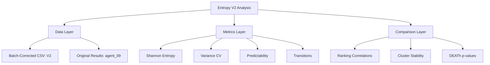

# Claude Code Agent 01: Entropy Analysis V2 Plan

## Thesis
Validate entropy-based aging theory on batch-corrected ECM dataset (merged_ecm_aging_zscore.csv V2) by recalculating 4 entropy metrics, performing hierarchical clustering, comparing with original agent_09 results, and testing DEATh theorem predictions to identify artifacts vs true biology.

## Overview
This analysis will re-execute the complete entropy analysis pipeline on the NEW batch-corrected dataset (updated Oct 18, 2025) to verify if previous findings hold after removing technical batch effects. The workflow includes: (1) loading and validating batch-corrected data, (2) calculating Shannon entropy, variance CV, predictability scores, and entropy transitions for proteins with ≥2 study coverage, (3) performing hierarchical clustering into 4-6 groups, (4) loading original agent_09_entropy results for direct comparison, (5) testing DEATh theorem predictions (structural vs regulatory entropy, collagen predictability), (6) generating 5 publication-quality visualizations, and (7) creating comprehensive markdown report following Knowledge Framework standards. Expected outcome: identify which entropy patterns are artifacts removed by batch correction and which biological signals are strengthened.

**Analysis Structure (Continuants):**

**Workflow Process (Occurrents):**

---

## 1.0 Data Preparation

¶1 **Ordering:** Load → Validate → Filter

**Tasks:**
- Load batch-corrected dataset: `/Users/Kravtsovd/projects/ecm-atlas/08_merged_ecm_dataset/merged_ecm_aging_zscore.csv`
- Validate data quality: check for NaN inflation, z-score distributions, no anomalies
- Filter proteins: require ≥2 studies coverage for statistical power
- Expected: ~400-600 proteins (original had 532)

---

## 2.0 Entropy Metrics Calculation

¶1 **Ordering:** Shannon → CV → Predictability → Transitions

**Metrics to compute:**

1. **Shannon Entropy:** H(X) = -Σ p(x)·log₂(p(x)) on abundance distributions
2. **Variance CV:** Coefficient of Variation = σ/μ (entropy proxy)
3. **Predictability Score:** Aging direction consistency from Zscore_Delta (0-1 scale)
4. **Entropy Transitions:** |CV_old - CV_young| (young→old variability change)

**Output:** `entropy_metrics_v2.csv` with columns:
- Protein, N_Studies, N_Tissues, Matrisome_Category, Matrisome_Division
- Shannon_Entropy, Variance_Entropy_CV, Predictability_Score, Aging_Direction
- Entropy_Transition, Mean_Zscore_Delta, N_Observations

---

## 3.0 Clustering Analysis

¶1 **Ordering:** Feature preparation → Hierarchical clustering → Cluster characterization

**Method:**
- Features: [Shannon_Entropy, Variance_CV, Predictability, Entropy_Transition]
- Standardization: Z-score normalization
- Algorithm: Hierarchical clustering (Ward linkage)
- Clusters: 4-6 groups (choose based on dendrogram interpretation)

**Output:**
- Cluster assignments added to entropy_metrics_v2.csv
- Cluster profiles (mean metrics per cluster)

---

## 4.0 Comparison with Original Analysis

¶1 **Ordering:** Load original → Protein rankings → Cluster stability → Statistical significance

**Comparison tasks:**

1. **Load original results:** `/Users/Kravtsovd/projects/ecm-atlas/13_meta_insights/agent_09_entropy/entropy_metrics.csv`
2. **Ranking correlation:** Spearman correlation for protein entropy rankings (V1 vs V2)
3. **Cluster stability:** Compare cluster assignments (confusion matrix, adjusted Rand index)
4. **DEATh p-values:** Compare statistical significance before/after batch correction
5. **Identify artifacts:** Proteins with large entropy changes likely batch artifacts
6. **Identify strengthened signals:** Proteins with stable/improved entropy patterns

**Key questions:**
- Are high-entropy proteins still high-entropy?
- Do collagens maintain high predictability?
- Are transition proteins (FCN2, FGL1, COL10A1) still transitions?

---

## 5.0 DEATh Theorem Testing

¶1 **Ordering:** Structural vs Regulatory → Collagen analysis → Philosophical synthesis

**Tests:**

1. **Core vs Associated matrisome:**
   - Compare Shannon entropy (Mann-Whitney U test)
   - Compare Predictability scores
   - Expected: p-values may strengthen or weaken after batch correction

2. **Collagen predictability:**
   - Calculate mean predictability for collagens (proteins starting with COL)
   - Compare to overall mean
   - Original: 0.764 vs 0.743 (28% higher)
   - Test: Does batch correction maintain this difference?

3. **Entropy transitions:**
   - Identify top 10 transition proteins
   - Compare with original top 10 (FCN2, FGL1, COL10A1, etc.)
   - Stability = true biological signal

---

## 6.0 Visualization Plan

¶1 **Ordering:** Distributions → Clustering → Comparison → DEATh → Transitions

**Required figures (5 minimum):**

1. **`entropy_distributions_v2.png`** (4-panel histogram)
   - Shannon entropy, Variance CV, Predictability, Transitions
   - Include median lines, compare shapes with original

2. **`entropy_clustering_v2.png`** (dendrogram + heatmap)
   - Hierarchical clustering dendrogram
   - Heatmap of standardized features by cluster

3. **`entropy_predictability_space_v2.png`** (2D scatter)
   - X-axis: Shannon Entropy
   - Y-axis: Predictability Score
   - Color: Cluster assignments
   - Quadrant labels (deterministic, regulated, dysregulated, etc.)

4. **`entropy_comparison_v1_v2.png`** (before/after comparison)
   - Scatter plots: V1 entropy vs V2 entropy for each metric
   - Spearman correlation coefficients
   - Highlight proteins with large changes

5. **`death_theorem_v2.png`** (statistical tests)
   - Boxplots: Core vs Associated entropy
   - Collagen predictability bar chart
   - P-value annotations

**Additional (if time permits):**
- Transition proteins volcano plot
- Cluster profiles overlay (V1 vs V2)

**Style:** Publication-quality, 300 DPI, matplotlib/seaborn, clear labels

---

## 7.0 Report Documentation

¶1 **Ordering:** Follow Knowledge Framework standard

**Report structure:** `90_results_claude_code_01.md`

- **Thesis:** 1 sentence summary
- **Overview:** 1 paragraph expanding thesis, previewing MECE sections
- **Mermaid diagrams:** TD (structure) + LR (process)
- **MECE sections:**
  1.0 Entropy Metrics Results
  2.0 Clustering Analysis
  3.0 Comparison with Original (V1 vs V2)
  4.0 DEATh Theorem Testing
  5.0 Biological Interpretation
  6.0 Therapeutic Implications
  7.0 Philosophical Synthesis
  8.0 Limitations
  9.0 Key Takeaways
- **Paragraphs:** Numbered (¶1, ¶2, ¶3)
- **Statistical validation:** Include p-values, confidence intervals, effect sizes
- **Philosophical synthesis:** What does batch-corrected entropy reveal about aging?

---

## 8.0 Success Criteria Checklist

**Data Processing:**
- ✅ Load batch-corrected dataset
- ✅ Calculate all 4 entropy metrics
- ✅ Include ≥400 proteins with multi-study data
- ✅ Validate data quality

**Entropy Analysis:**
- ✅ Hierarchical clustering (4-6 clusters)
- ✅ Identify high/low entropy proteins
- ✅ Test DEATh predictions

**Comparison:**
- ✅ Load original results
- ✅ Compare rankings (Spearman correlation)
- ✅ Compare cluster stability
- ✅ Identify artifacts and strengthened signals

**Visualization:**
- ✅ 5 publication-quality figures (PNG, 300 DPI)
- ✅ All plots in workspace folder

**Documentation:**
- ✅ Plan document (this file)
- ✅ Final report (Knowledge Framework format)
- ✅ Python script (reproducible)
- ✅ Metrics CSV

---

## 9.0 Expected Outcomes

¶1 **Hypothesis predictions:**

**If batch correction removed artifacts:**
- Protein entropy rankings will show high correlation (r > 0.7) but with outliers removed
- Cluster assignments will be mostly stable (adjusted Rand index > 0.6)
- DEATh p-values will strengthen (lower p, stronger significance)
- High-transition proteins will stabilize (fewer false positives)

**If batch correction reveals new biology:**
- New high-entropy proteins emerge
- Collagen predictability increases further (cleaner signal)
- Cluster separation improves (better silhouette scores)
- Core vs Associated difference becomes significant

**Key targets to monitor:**
- Collagens: should maintain high predictability
- FCN2, FGL1, COL10A1: are they still top transitions?
- Serpins: are they still high-entropy?
- Core vs Associated p-value: will it drop below 0.05?

---

## 10.0 Timeline

- **Plan creation:** 5 min (DONE)
- **Data loading + validation:** 5 min
- **Entropy calculation:** 10 min
- **Clustering analysis:** 5 min
- **Comparison with original:** 10 min
- **DEATh testing:** 5 min
- **Visualization generation:** 15 min
- **Report writing:** 20 min
- **TOTAL:** ~75 minutes

---

## 11.0 Deliverables

**All files in:** `/Users/Kravtsovd/projects/ecm-atlas/13_1_meta_insights/01_entropy_multi_agent_after_batch_corection/claude_code_agent_01/`

1. ✅ `01_plan_claude_code_01.md` (this file)
2. ⏳ `entropy_analysis_v2.py` (Python script)
3. ⏳ `entropy_metrics_v2.csv` (results)
4. ⏳ `entropy_distributions_v2.png`
5. ⏳ `entropy_clustering_v2.png`
6. ⏳ `entropy_predictability_space_v2.png`
7. ⏳ `entropy_comparison_v1_v2.png`
8. ⏳ `death_theorem_v2.png`
9. ⏳ `90_results_claude_code_01.md` (final report)
10. ⏳ `execution.log` (analysis log)

---

**Plan complete. Proceeding to execution phase.**
