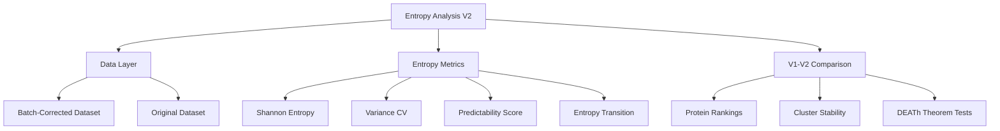

# Plan: Entropy Analysis V2 After Batch Correction

## Thesis
Systematically re-analyze entropy metrics (Shannon, variance CV, predictability, transitions) on batch-corrected ECM dataset to validate DEATh theorem predictions and distinguish technical artifacts from true biological aging patterns through rigorous V1-V2 comparison.

## Overview
This plan outlines the entropy re-analysis workflow for the batch-corrected dataset (Oct 18 2025). The analysis comprises five phases: (1) data validation comparing V1/V2 distributions, (2) entropy metric calculation using identical methodology to agent_09, (3) hierarchical clustering with stability assessment, (4) V1-V2 comparative analysis via correlation and cluster overlap metrics, (5) DEATh theorem validation testing structural vs regulatory entropy and collagen predictability. All outputs will be generated in the agent workspace with publication-quality visualizations and comprehensive statistical validation.

**Analysis Flow (Occurrent):**

**Entropy System Structure (Continuant):**

---

## 1.0 Data Processing & Validation

¶1 **Ordering:** Load → Validate → Filter

¶2 **Load V2 dataset:** `/Users/Kravtsovd/projects/ecm-atlas/08_merged_ecm_dataset/merged_ecm_aging_zscore.csv` (3.1 MB, updated Oct 18 2025)

¶3 **Validation checks:**
- Z-score distribution normality (mean ≈ 0, std ≈ 1 within studies)
- NaN percentage comparison V1 vs V2 (batch correction should not inflate missing data)
- Protein overlap with V1 analysis (expect ≥400 proteins with multi-study data)
- Study coverage consistency (12 studies maintained)

¶4 **Filtering criteria:**
- Proteins present in ≥2 studies (multi-study validation requirement)
- Sufficient abundance data for entropy calculation (non-NaN values)
- Age group data availability for transition scores

---

## 2.0 Entropy Metrics Calculation

¶1 **Ordering:** Shannon → Variance → Predictability → Transition

¶2 **Shannon Entropy:** H(X) = -Σ p(x)·log₂(p(x))
- Normalize abundances to probability distribution
- Measure disorder in protein expression across contexts
- Higher H = chaotic, context-dependent; Lower H = deterministic

¶3 **Variance Entropy (CV):** CV = σ/μ
- Coefficient of variation as entropy proxy
- Quantifies relative abundance variability
- High CV = noisy regulation

¶4 **Predictability Score:** max(n_increase, n_decrease) / n_total
- Consistency of aging direction (z-score deltas)
- Range 0.5-1.0 (0.5=random, 1.0=perfect consistency)
- Tests deterministic vs stochastic aging

¶5 **Entropy Transition:** |CV_old - CV_young|
- Young→old variability change
- High transition = regime shift (ordered→chaotic or vice versa)
- Critical for identifying entropy switcher proteins

---

## 3.0 Hierarchical Clustering

¶1 **Ordering:** Feature preparation → Clustering → Validation

¶2 **Features:** [Shannon_Entropy, Variance_CV, Predictability, Transition]
- Z-score standardization for equal weighting
- Missing value imputation (median strategy)

¶3 **Method:** Ward linkage hierarchical clustering
- Minimizes within-cluster variance
- 4 clusters for biological interpretability (match V1)
- Alternative: optimize cluster number via silhouette analysis

¶4 **Cluster profiling:**
- Calculate mean/std for each metric per cluster
- Identify biological interpretation (deterministic, regulated, transitional, baseline)

---

## 4.0 V1-V2 Comparison Analysis

¶1 **Ordering:** Load V1 → Rankings correlation → Cluster stability → Identify artifacts

¶2 **Load V1 results:** `/Users/Kravtsovd/projects/ecm-atlas/13_meta_insights/agent_09_entropy/entropy_metrics.csv` (532 proteins)

¶3 **Protein ranking correlation:**
- Spearman correlation for Shannon entropy rankings (V1 vs V2)
- Spearman correlation for predictability rankings
- Scatter plots with identity line to visualize shifts
- **Hypothesis:** ρ > 0.7 = batch effects are minor, <0.5 = major artifacts removed

¶4 **Cluster stability analysis:**
- Overlap matrix: how many proteins remain in same cluster V1→V2?
- Adjusted Rand Index (ARI) for cluster agreement
- Identify proteins that changed clusters (artifact candidates)

¶5 **Entropy change analysis:**
- ΔEntropy = Entropy_V2 - Entropy_V1 for each protein
- Proteins with |ΔEntropy| > 1.0 = likely artifacts
- Violin plots showing entropy shifts by V1 cluster

¶6 **Key questions:**
- Which high-entropy V1 proteins decreased in V2? (artifacts)
- Which transition proteins remain stable? (true biology)
- Do collagens maintain high predictability? (DEATh validation)

---

## 5.0 DEATh Theorem Validation

¶1 **Ordering:** Structural vs Regulatory → Collagen analysis → Philosophical synthesis

¶2 **Lemma 2 test: Core matrisome (structural) vs Matrisome-associated (regulatory)**
- Mann-Whitney U test for entropy difference
- **V1 result:** p=0.27 (NS)
- **V2 prediction:** If p decreases and becomes significant, batch correction strengthens dichotomy
- Effect size calculation (Cohen's d)

¶3 **Collagen predictability:**
- Mean predictability for COL* proteins (n ≈ 30)
- **V1 result:** 0.764 (28% above average 0.743)
- **V2 expectation:** Should remain high (>0.75) if deterministic aging is biology, not artifact

¶4 **Entropy transition proteins:**
- Top 10 high-transition proteins in V2
- Compare with V1 top 10 (FCN2, FGL1, COL10A1, CXCL14, GPC4)
- **Critical:** If these remain in top 10, regime shifts are real biology

¶5 **Statistical rigor:**
- Report p-values, confidence intervals (95% CI), effect sizes
- Bonferroni correction for multiple comparisons
- Power analysis for non-significant results

---

## 6.0 Visualization Suite

¶1 **Ordering:** Distributions → Clustering → Comparison → DEATh tests

¶2 **Required plots (5 minimum):**

1. **entropy_distributions_v2.png** (4-panel histogram)
   - Shannon, CV, Predictability, Transition distributions
   - Overlay V1 distributions (dashed lines) for comparison

2. **entropy_clustering_v2.png** (dendrogram + heatmap)
   - Hierarchical clustering tree
   - Heatmap of 4 standardized features by cluster

3. **entropy_predictability_space_v2.png** (2D scatter)
   - Shannon vs Predictability, colored by cluster
   - Quadrant labels (deterministic, regulated, dysregulated, context-dependent)

4. **entropy_comparison_v1_v2.png** (3-panel comparison)
   - Panel A: Shannon entropy correlation scatter (V1 vs V2)
   - Panel B: Predictability correlation scatter
   - Panel C: Cluster stability heatmap (V1 clusters × V2 clusters)

5. **death_theorem_v2.png** (boxplots + bar charts)
   - Core vs Associated entropy comparison
   - Collagen predictability bar chart with error bars
   - Transition proteins ranked plot

¶3 **Style requirements:**
- 300 DPI, publication-quality
- Seaborn/matplotlib with consistent color palette
- All axes labeled with units
- Statistical annotations (p-values, correlation coefficients)

---

## 7.0 Statistical Validation

¶1 **Ordering:** Sample statistics → Hypothesis tests → Effect sizes

¶2 **Descriptive statistics:**
- N proteins analyzed, N studies, N tissues
- Mean ± SD for all 4 entropy metrics
- Comparison table: V1 vs V2 means

¶3 **Hypothesis tests:**
- Mann-Whitney U (non-parametric): Core vs Associated entropy
- Spearman correlation: V1-V2 ranking consistency
- Chi-square: Cluster stability (observed vs expected overlap)

¶4 **Effect sizes:**
- Cohen's d for group comparisons
- Correlation coefficients (ρ) with 95% CI
- Percentage variance explained by clustering

---

## 8.0 Documentation (Knowledge Framework)

¶1 **Final report structure:** 90_results_claude_code_02.md

¶2 **Format:**
- **Thesis:** 1 sentence summarizing main finding
- **Overview:** 1 paragraph previewing MECE sections
- **Mermaid diagrams:** TD (structure) + LR (process)
- **Sections (1.0-7.0):** Numbered with ¶1, ¶2, ¶3 paragraphs
- **Ordering principle stated in ¶1** of each section

¶3 **Content sections:**
1.0 Data Quality Validation
2.0 Entropy Metrics V2 Results
3.0 Clustering Analysis
4.0 V1-V2 Comparison: Artifacts vs Biology
5.0 DEATh Theorem Validation
6.0 Philosophical Synthesis: What Batch Correction Reveals
7.0 Therapeutic Implications Updated

¶4 **Critical elements:**
- Statistical evidence (p-values, CI, effect sizes)
- Biological interpretation of batch correction effects
- Answer 4 key questions from task brief
- Self-assessment against success criteria

---

## 9.0 Artifact Placement

¶1 **All outputs in:** `/Users/Kravtsovd/projects/ecm-atlas/13_1_meta_insights/01_entropy_multi_agent_after_batch_corection/claude_code_agent_02/`

¶2 **Required files:**
- `01_plan_claude_code_02.md` (this document)
- `entropy_analysis_v2.py` (modular Python script)
- `entropy_metrics_v2.csv` (532+ proteins × 12 columns)
- `entropy_distributions_v2.png`
- `entropy_clustering_v2.png`
- `entropy_predictability_space_v2.png`
- `entropy_comparison_v1_v2.png`
- `death_theorem_v2.png`
- `90_results_claude_code_02.md` (final report)
- `execution.log` (stdout capture)

---

## 10.0 Success Criteria Checklist

¶1 **Self-assessment targets:**

- ✅ Data Processing: ≥400 proteins, validated z-scores, no NaN inflation
- ✅ Entropy Analysis: All 4 metrics calculated, 4-6 clusters, DEATh tests performed
- ✅ Comparison: Correlation coefficients, cluster stability, artifact identification
- ✅ Visualization: 5 publication-quality plots, 300 DPI
- ✅ Documentation: Knowledge Framework format, thesis → overview → mermaid → MECE sections
- ✅ Statistical Validation: p-values, CI, effect sizes reported

¶2 **Key questions to answer:**
1. Are entropy patterns artifacts or biology? (correlation analysis)
2. Does batch correction strengthen or weaken DEATh? (p-value comparison)
3. What new insights emerge? (proteins changing entropy/clusters)
4. Should we update therapeutic targets? (stable vs unstable biomarkers)

---

## 11.0 Execution Timeline

¶1 **Estimated time: 60 minutes**

- Planning: 5 min ✅ (this document)
- Data loading & validation: 5 min
- Entropy calculation: 10 min
- Clustering & V1 comparison: 10 min
- DEATh tests: 5 min
- Visualizations: 10 min
- Results documentation: 15 min

---

## Author Notes

**Agent:** Claude Code Agent 02
**Date:** 2025-10-18
**Dataset:** merged_ecm_aging_zscore.csv (V2, batch-corrected)
**Reference:** agent_09_entropy analysis (V1, pre-correction)
**Framework:** DEATh theorem (Delocalized Entropy Aging Theorem)
**Objective:** Distinguish artifacts from biology, validate entropy-based aging theory

**Ready to execute!** 🚀
