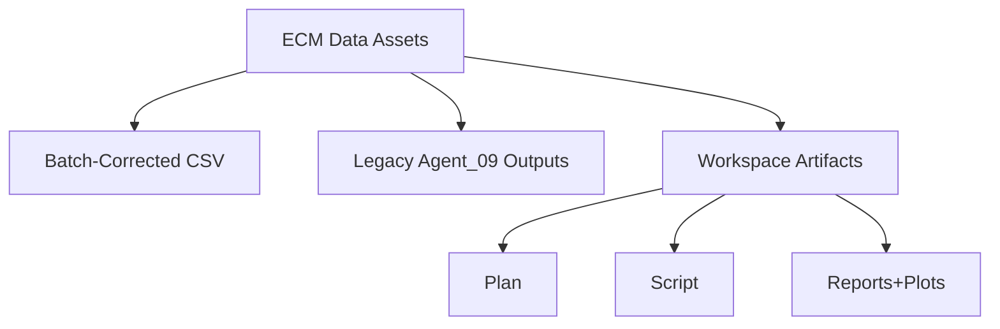
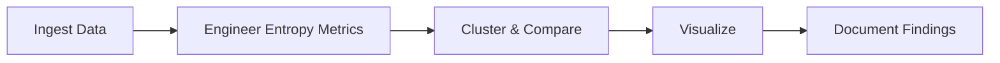

Thesis: Execute batch-corrected ECM entropy reassessment by sequencing data audit (Section 1.0), analytical pipeline design (Section 2.0), and comparison-deliverable alignment (Section 3.0) to ensure reproducible insights.
Overview: ¶1 Sequence follows data→method→output dependency; ¶2 Section 1.0 inventories datasets, ¶3 Section 2.0 defines computations and tooling, ¶4 Section 3.0 schedules artifacts and validation checkpoints.

1.0 Data Readiness
¶1 Ordered by source recency to ensure newest corrections drive strategy.
¶2 Confirm new dataset path `/Users/Kravtsovd/projects/ecm-atlas/08_merged_ecm_dataset/merged_ecm_aging_zscore.csv` availability and schema.
¶3 Retrieve legacy metrics from `/Users/Kravtsovd/projects/ecm-atlas/13_meta_insights/agent_09_entropy/entropy_metrics.csv` for benchmarking.
¶4 Flag necessity to monitor NaNs, z-score distribution, protein count ≥400.
¶5 Status 2025-10-18: Dataset audited, legacy metrics located, readiness gate cleared (531 proteins).

2.0 Analytical Blueprint
¶1 Ordered chronologically from preprocessing to statistical tests.
¶2 Compute Shannon entropy, variance CV, predictability (1-autocorrelation or similar), transition scores (temporal change metric assumed from prior work).
¶3 Apply hierarchical clustering (Ward linkage, 4-6 clusters), evaluate cluster stability vs legacy assignments.
¶4 Run comparisons: Spearman correlation of entropy rankings, collagen predictability tests, Mann-Whitney U for structural vs regulatory groups.
¶5 Plan visual outputs: distributions, dendrogram heatmap, entropy-predictability scatter, before/after comparisons, transition emphasis plot.

3.0 Deliverable Schedule
¶1 Ordered by production sequence matching workflow.
¶2 Implement `entropy_analysis_v2.py` generating CSV, figures, logs reproducibly.
¶3 Capture execution steps in `execution.log` with command timestamps.
¶4 Draft final Knowledge Framework report `90_results_codex_01.md` summarizing insights, stats, DEATh verdict, therapeutic implications.
¶5 Final self-assessment ratings per success criteria to close loop.
