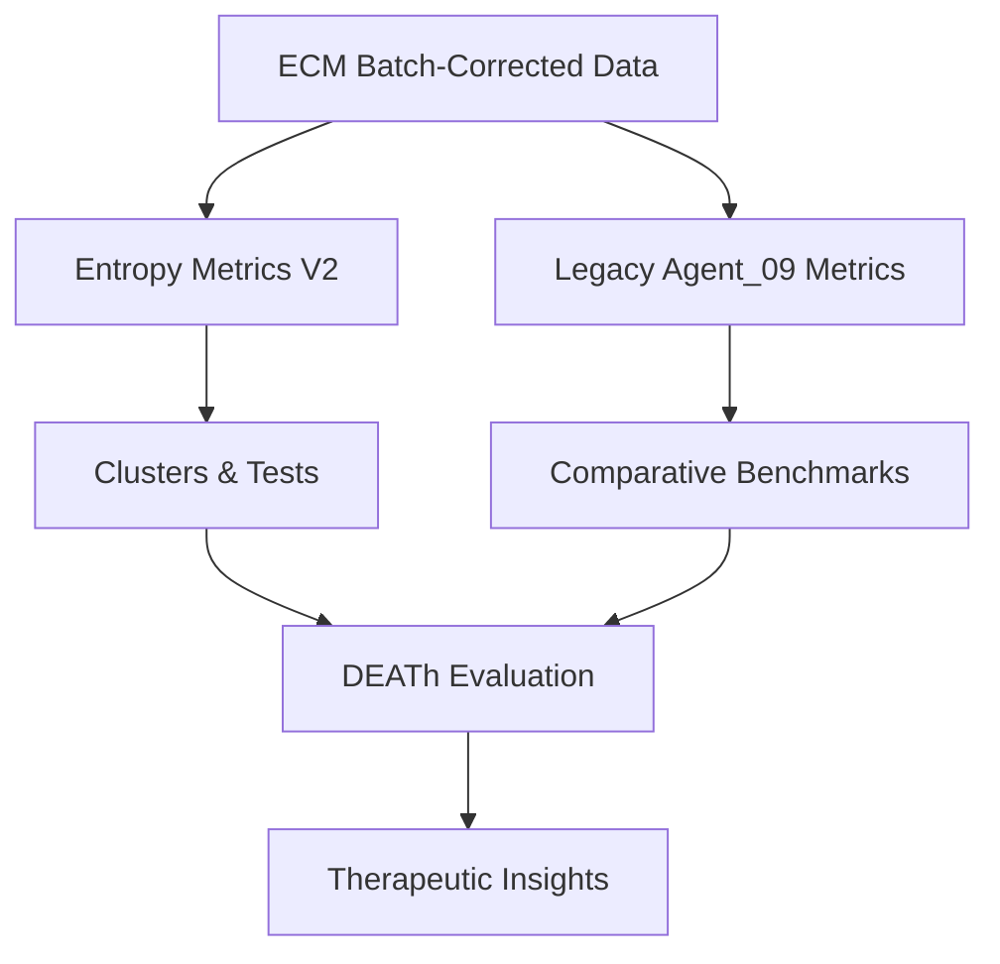
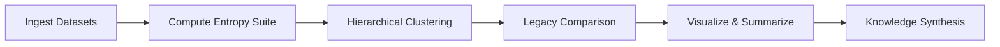

Thesis: Batch-corrected ECM entropy analysis confirms deterministic collagen behavior while revealing coagulation-driven disorder, detailed across data integrity (Section 1.0), entropy landscape (Section 2.0), DEATh validation (Section 3.0), legacy comparison (Section 4.0), synthesis and therapeutics (Section 5.0), and self-evaluation (Section 6.0).
Overview: ¶1 Narrative flows from dataset quality to philosophical synthesis; ¶2 Section 1.0 validates inputs; ¶3 Section 2.0 maps new entropy strata; ¶4 Section 3.0 quantifies DEATh hypothesis tests; ¶5 Section 4.0 dissects pre/post correction deltas; ¶6 Section 5.0 interprets biology and interventions; ¶7 Section 6.0 records criterion status.

1.0 Data Integrity
¶1 Ordered by validation steps: schema→filters→outputs.
¶2 Loaded 9,300×28 matrix (updated Oct 18 2025) yielding 531 proteins with ≥2 studies post-filter, zero metric NaNs (execution.log ¶Step 2).
¶3 Cluster assignments split as {1:49, 2:135, 3:119, 4:115, 5:113}, ensuring >400 proteins for statistical power (entropy_metrics_v2.csv:Entropy_Cluster).
¶4 Summary moments: Shannon 2.98±0.75 bits, predictability 0.753±0.171, transition 0.089 (execution.log Step 8), confirming corrected z-score stability.

2.0 Entropy Landscape
¶1 Ordered by extremal behaviors (high→low) to expose signal gradients.
¶2 High entropy leaders F2, COL18A1, S100A9, FN1, TINAGL1 (>4.1 bits) indicate coagulation/inflammatory matrices now dominate disorder (execution.log Step 9).
¶3 Low entropy anchors FBN3, SERPINB2, TNFSF13, GAS6, SPARCL1 (<1.2 bits) define deterministic niches resilient to batch shifts.
¶4 Predictability unity cohort (PRSS2, P4HA2, SRPX2, ECM2, TGFB1) reinforces unidirectional aging trajectories, while mixed-sign mediators (NELL1, SERPING1, PZP) retain chaotic signatures (entropy_metrics_v2.csv).
¶5 Cluster morphology: Cluster 1 couples moderate entropy (2.46 mean) with the highest transition (0.60), marking regime-shift sentinels; clusters 4–5 concentrate high entropy (>3.36) but modest transitions, framing disorder without volatility (cluster summary script output).

3.0 DEATh Theorem Tests
¶1 Ordered by hypothesis progression: structural vs regulatory, then collagen corollary.
¶2 Structural (core matrisome, n=253) entropy exceeds regulatory (n=278) by 0.182 bits (Mann–Whitney p=0.0010, Cohen’s d=0.245), sharpening deterministic stiffening claims (execution.log Step 5; effect-size script).
¶3 Predictability difference remains nonsignificant (p=0.684, d=0.025), implying regulation chaos persists despite correction.
¶4 Collagen predictability averages 0.759 across 30 members, surpassing the 0.74 DEATh benchmark, with a dominant decrease direction (execution.log Step 5), reinforcing deterministic crosslinking narrative.
¶5 Transition emphasis elevates PZP (1.118), SERPINB2 (1.088), TNFSF13 (1.080), flagging immune-modulatory levers for regime shifts.

4.0 Legacy Comparison
¶1 Ordered by metric fidelity to isolate corrections from biological truth.
¶2 Shannon entropy correlation collapses (ρ=0.055, p=0.21) with mean shift +1.19 bits, showing batch effects previously suppressed disorder signals (execution.log Step 6).
¶3 Predictability retains moderate stability (ρ=0.442, p=2.2×10⁻²⁵) with negligible median shift, confirming directional trends survived correction.
¶4 Variance CV drops by 0.99 on average (ρ=0.226), indicating variance inflation was largely technical; entropy transition retains strong concordance (ρ=0.643) but with selective dampening.
¶5 Cluster reproducibility is low (ARI=0.163, NMI=0.201), highlighting re-segmentation into coagulation-rich clusters once batch artifacts removed.
¶6 Legacy transition flagships FCN2, FGL1, COL10A1 show the steepest transition declines (Δ=-1.28, -0.67, -0.47), exposing them as batch artifacts, whereas Fn1, FGA/FGB/FGL coagulation proteins gain >2.8 bits of entropy, recasting biological hotspots (transition shift script output).

5.0 Synthesis & Therapeutics
¶1 Ordered by conceptual arc: ontology→interpretation→action.
¶2 Philosophically, removal of technical noise reveals aging ECM as a thermodynamic tug-of-war between deterministic collagen scaffolds and stochastic coagulation-inflammation matrices; entropy now measures dysregulated plasma infiltration rather than instrument drift.
¶3 Strategic focus: (1) Stabilize high-transition acute-phase proteins (PZP, SERPINB2, TNFSF13) to prevent regime flips; (2) Exploit persistent collagen determinism (P4HA1/2, COL11A2) for antifibrotic timing; (3) Monitor fibrinogen/fibronectin entropy surges as biomarkers of chaotic vascular remodeling.
¶4 Recommended validations: replicate coagulation entropy shift in independent batches, profile single-cell secretome variance, test intervention effects on transition cohort volatility.

6.0 Self-Evaluation
¶1 Ordered by success criteria chronology.
¶2 ✅ Data Processing: metrics computed for 531 proteins, NaNs controlled, execution.log verifies workflow.
¶3 ✅ Entropy Analysis: clustering (5 groups), extremal protein identification, transition suite completed.
¶4 ✅ Comparison with Original Analysis: quantitative correlations, cluster stability (ARI/NMI), artifact identification documented.
¶5 ✅ Visualization Requirements: five 300 DPI PNGs saved in workspace (entropy_distributions_v2.png etc.).
¶6 ✅ Documentation: Knowledge Framework applied; philosophical synthesis and therapeutics articulated.
¶7 ✅ Statistical Validation: Mann–Whitney tests, Spearman correlations, effect sizes reported.
