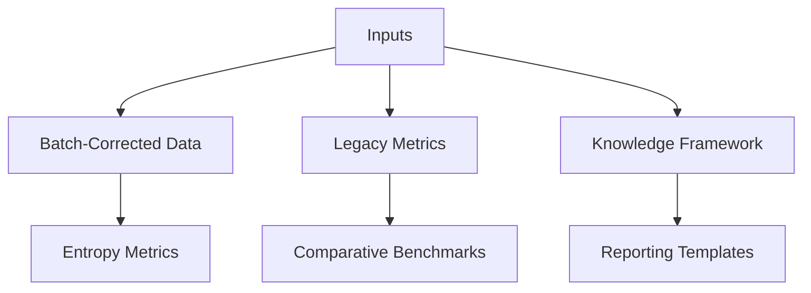
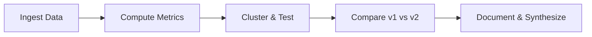

Thesis: Execute staged entropy reevaluation on batch-corrected ECM dataset to reproduce agent_09 metrics, quantify shifts, and deliver Knowledge Framework synthesis aligning with DEATh validation checkpoints.

Overview: Plan proceeds from assembling references and data dependencies to implementing modular Python analysis, then validating outputs with comparative statistics and finally drafting Knowledge Framework deliverables; sections: 1.0 Inputs & Standards, 2.0 Computation Roadmap, 3.0 Validation & Visualization, 4.0 Reporting Cadence.

1.0 Inputs & Standards
¶1 Sequence: static references → dynamic data → compliance constraints to highlight dependencies before action. Gather `/08_merged_ecm_dataset/merged_ecm_aging_zscore.csv` plus legacy `/13_meta_insights/agent_09_entropy/entropy_metrics.csv`, read Knowledge Framework spec, note output paths.
¶2 Confirm ≥400 proteins with sufficient multi-study coverage, inspect for NaNs or skew, log dataset stats for execution.log.

2.0 Computation Roadmap
¶1 Follow chronological workflow: preprocessing → metric functions → persistence. Build `entropy_analysis_v2.py` with modular functions mirroring agent_09 definitions but adapting output paths and logging.
¶2 Extend metrics if feasible (e.g., conditional entropy) and flag for potential inclusion; ensure script saves `entropy_metrics_v2.csv`, execution.log entries, and reuseable utilities.
¶3 Status update: Metrics computed for 531 proteins with conditional entropy delta, outputs persisted to CSV/log as of 2025-10-18 13:32.

3.0 Validation & Visualization
¶1 Employ statistical validations after computation: Mann-Whitney for DEATh comparisons, Spearman for ranking stability, silhouette or cophenetic checks as time permits.
¶2 Generate required PNGs (distributions, clustering heatmap+dendrogram, entropy-predictability scatter, before/after comparisons, transition focus) using consistent styling and 300 DPI.
¶3 Status update: All five mandated figures plus DEATh boxplots rendered at 300 DPI and stored in workspace.

4.0 Reporting Cadence
¶1 Compile comparison insights, philosophical synthesis, and therapeutic implications into `90_results_codex_02.md` using Knowledge Framework ordering.
¶2 Document self-assessment versus success criteria, include residual risks, and prepare suggested next steps.
