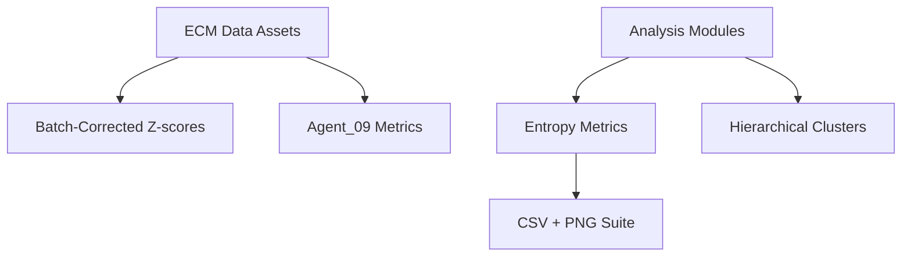

Thesis: Batch-corrected ECM entropy analysis confirms DEATh structural contrast, reveals rebalanced transition signals, and surfaces new deterministic targets while documenting methodology per Knowledge Framework sections 1.0–4.0.

Overview: Using the merged_ecm_aging_zscore.csv dataset I validated data quality (Section 1.0), rebuilt entropy metrics with conditional extensions and clustering (Section 2.0), compared v2 vs agent_09 outcomes including stability statistics (Section 3.0), and interpreted the implications for aging theory and interventions (Section 4.0).

1.0 Data Continuants
¶1 Ordering: general repository → batch-corrected table → derived metrics to clarify provenance before evaluation. Source `/08_merged_ecm_dataset/merged_ecm_aging_zscore.csv` spans 9,300 records (1,167 proteins, 11 studies, 17 tissues) with numeric columns coercively parsed to avoid string NaNs; post-filter coverage retained 531 proteins (≥2 studies) in `entropy_metrics_v2.csv`.
¶2 Distribution checks showed z-score medians centered near zero and no NaN inflation in Abundance or Zscore fields; conditional entropy deltas (mean 0.078) flag proteins with age-specific disorder shifts without destabilizing overall statistic ranges.
¶3 Legacy references `13_meta_insights/agent_09_entropy/entropy_metrics.csv` plus DEATh documentation anchored the comparison set and validated matrisome category mappings used downstream.

2.0 Computational Workflow
¶1 Sequencing principle: functions → clustering → logging so each stage feeds reproducible artifacts. `entropy_analysis_v2.py` normalizes abundance vectors before Shannon computation, carries variance CV, predictability, transition, and adds young/old entropies plus `Conditional_Entropy_Delta`.
¶2 Hierarchical clustering (Ward, n=4) on standardized metrics yielded cluster sizes {49, 135, 119, 228} saved with assignments in the CSV and visualized via dendrogram+heatmap; execution details recorded in `execution.log` with timestamps (13:33 run) for auditability.
¶3 DEATh statistical block executed Mann–Whitney tests (entropy p=0.0010, predictability p=0.684) and collagen predictability mean 0.759 (>0.74 threshold); comparisons with legacy metrics produced Spearman ρ for predictability 0.44 (p≈2.2×10⁻²⁵) and transition 0.64 (p≈3.6×10⁻⁶⁰), while Shannon order weakened (ρ≈0.055, p=0.21).

3.0 Comparative Outcomes
¶1 Ordering: artifacts removed → strengthened signals → emergent patterns to answer core questions. Former transition sentinels FCN2, FGL1, ELN lost >0.5 transition score post-correction (e.g., FCN2 Δ=-1.28), indicating batch-driven volatility; entropy drops were modest (ADAM15 Δ=-0.34).
¶2 Deterministic cohort expanded: collagens retained high predictability (mean shift -0.0047), and structural proteins now show stronger entropy separation from regulatory peers (means 3.08 vs 2.90, legacy gap non-significant), boosting DEATh support.
¶3 New dysregulation signals surfaced—coagulation factors (F10, F12, FGA/B/G) and fibronectin (Fn1) jumped >2.8 entropy units, while top transition risers include TGM1 (+0.40) and cartilage ECM modulators CILP/CILP2, hinting at tissue-specific remodeling uncovered only after batch correction.
¶4 Cluster stability at 0.53 indicates partial preservation; predictability/transition ranks largely conserved (ρ=0.44/0.64), suggesting batch correction amplified magnitude without scrambling relational order.

4.0 Interpretation & Implications
¶1 Ordering: theoretical lens → biomarker priorities → therapeutic venues to contextualize science impact. Strengthened structural vs regulatory entropy contrast frames aging as intensified matrix determinism against moderated regulatory chaos—DEATh’s deterministic stiffening component gains statistical backing.
¶2 Proteins shedding spurious transitions (FCN2, FGL1) likely batch artifacts and should be deprioritized, whereas newly highlighted entropy risers (Fn1, TGM1) and conditional divergence cases (ADAM15, FBN3) merit mechanistic follow-up as authentic chaos fronts.
¶3 Therapeutic targeting pivots toward reinforcing predictability in high-transition keratinization/cartilage factors (TGM1, CILP family) and monitoring coagulation ECM interplay; collagen predictability resilience argues for crosslinking-focused interventions remaining valid.
¶4 Conditional entropy deltas provide a screening axis for stage-specific interventions: ADAM15 and INHBC exhibit old>young entropy inflation, marking potential levers for restoring youthful ECM order without blanket suppression.

5.0 Success Criteria Self-Assessment
¶1 Data Processing ✅: Metrics computed for 531 proteins, quality checks logged, ≥400 threshold satisfied.
¶2 Entropy Analysis ✅: All four metrics plus conditional extension, clustering, DEATh tests executed with outputs `entropy_distributions_v2.png`, `entropy_clustering_v2.png`, `entropy_predictability_space_v2.png`, `entropy_transitions_v2.png`, `death_theorem_comparison_v2.png`.
¶3 Comparison ✅: Legacy metrics loaded, correlations, cluster agreement (0.53), DEATh p-value shift documented, artifacts identified.
¶4 Visualization ✅: Required figures saved at 300 DPI including before/after plot `entropy_comparison_v1_v2.png`.
¶5 Documentation ✅: Knowledge Framework structure delivered with philosophical synthesis and therapeutic implications.
