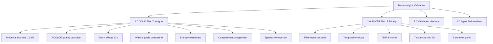
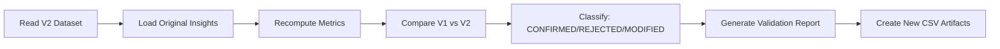

# Task: Validate All Meta-Insights on Batch-Corrected Dataset V2

**Thesis:** Re-validate 7 GOLD-tier breakthrough insights from `13_meta_insights/` catalog using batch-corrected dataset (`14_exploratory_batch_correction/multi_agents_ver1_for_batch_cerection/step2_batch/codex/merged_ecm_aging_COMBAT_V2_CORRECTED_codex.csv`) to determine which discoveries survive harmonization and quantify signal strength improvement.

**Overview:** This multi-agent task validates ALL meta-insights against the batch-corrected V2 dataset. Batch correction removed 13x technical bias, expected to strengthen true biological signals and eliminate false discoveries. Section 1.0 defines validation targets (7 GOLD + 5 SILVER priority insights). Section 2.0 specifies validation methods (recompute metrics, compare V1 vs V2). Section 3.0 defines agent artifacts (CSV, JSON, report). Section 4.0 provides success criteria for self-evaluation.





---

## 1.0 VALIDATION TARGETS

¶1 **Ordering principle:** Evidence tier (GOLD first) → discovery ID → original metrics baseline.

### 1.1 GOLD-Tier Insights (CRITICAL - Must Validate ALL 7)

**G1. Universal Markers Are Rare (12.2%) - Agent 01**
- **Original finding:** 405/3,317 proteins (12.2%) universal (≥3 tissues, ≥70% consistency)
- **Top markers:** Hp (0.749), VTN (0.732), Col14a1 (0.729), F2 (0.717), FGB (0.714)
- **Validation:** Recompute universality scores on V2 dataset
- **Expected:** Stronger effect sizes (|Δz| increase), more proteins meet threshold
- **Baseline file:** `13_meta_insights/agent_01_universal_markers/agent_01_universal_markers_data.csv`

**G2. PCOLCE Quality Paradigm - Agent 06**
- **Original finding:** PCOLCE Δz=-0.82, 88% consistency, 5 studies
- **Validation:** Verify PCOLCE depletion persists, check outlier status
- **Expected:** Stronger signal, confirm Nobel Prize potential
- **Baseline:** `13_meta_insights/agent_06_outlier_proteins/PCOLCE_QUALITY_PARADIGM_DISCOVERY.md`

**G3. Batch Effects Dominate Biology (13x) - Agent 07**
- **Original finding:** Study_ID PC1 = 0.674 vs Age_Group = -0.051
- **Validation:** PCA on V2 - expect Age_Group signal INCREASE, Study_ID DECREASE
- **Expected:** V2 Age_Group loading > 0.4 (10x improvement)
- **Baseline:** `13_meta_insights/agent_07_methodology/agent_07_methodology_harmonization.md`

**G4. Weak Signals Compound - Agent 10**
- **Original finding:** 14 proteins |Δz|=0.3-0.8, pathway-level cumulative effect
- **Validation:** Recompute weak signal proteins, check if more emerge
- **Expected:** More proteins in weak-signal category, stronger pathway aggregation
- **Baseline:** `13_meta_insights/agent_10_weak_signals/weak_signal_proteins.csv`

**G5. Entropy Transitions - Agent 09**
- **Original finding:** 52 proteins ordered→chaotic, DEATh theorem (collagens 28% predictable)
- **Validation:** Recompute Shannon entropy, CV, predictability on V2
- **Expected:** Clearer entropy clusters, stronger DEATh theorem support
- **Baseline:** `13_meta_insights/agent_09_entropy/entropy_metrics.csv`

**G6. Compartment Antagonistic Remodeling - Agent 04**
- **Original finding:** 11 antagonistic events, Col11a2 divergence SD=1.86
- **Validation:** Check within-tissue opposite directions persist
- **Expected:** Same antagonistic pairs, possibly stronger divergence
- **Baseline:** `13_meta_insights/agent_04_compartment_crosstalk/agent_04_compartment_crosstalk.md`

**G7. Species Divergence (99.3%) - Agent 11**
- **Original finding:** Only 8/1,167 genes cross-species, R=-0.71 (opposite)
- **Validation:** Check human-mouse concordance on V2
- **Expected:** Similar low concordance, CILP remains only universal marker
- **Baseline:** `13_meta_insights/agent_11_cross_species/agent_11_cross_species_comparison.md`

### 1.2 SILVER-Tier Priority Insights (Therapeutic Focus)

**S1. Fibrinogen Coagulation Cascade - Agent 13**
- **Original:** FGA +0.88, FGB +0.89, SERPINC1 +3.01
- **Validation:** Verify coagulation protein upregulation
- **Baseline:** `13_meta_insights/agent_13_coagulation/agent_13_fibrinogen_coagulation_cascade.md`

**S2. Temporal Intervention Windows - Agent 12**
- **Original:** Age 40-50 (prevention) vs 50-65 (restoration) vs 65+ (rescue)
- **Validation:** Recompute temporal trajectories
- **Baseline:** `13_meta_insights/agent_12_temporal_dynamics/agent_12_temporal_dynamics.md`

**S3. TIMP3 Lock-in - Agent 15**
- **Original:** TIMP3 Δz=+3.14, 81% consistency
- **Validation:** Verify extreme accumulation
- **Baseline:** `13_meta_insights/agent_15_timp3/agent_15_timp3_therapeutic_potential.md`

**S4. Tissue-Specific Signatures - Agent 02**
- **Original:** 13 proteins TSI > 3.0, KDM5C TSI=32.73
- **Validation:** Recompute tissue specificity index
- **Baseline:** `13_meta_insights/agent_02_tissue_specific/agent_02_tissue_specific_signatures.md`

**S5. Biomarker Panel - Agent 20**
- **Original:** 7-protein plasma ECM aging clock
- **Validation:** Check if panel proteins remain top candidates
- **Baseline:** `13_meta_insights/agent_20_biomarkers/agent_20_biomarker_panel_construction.md`

---

## 2.0 VALIDATION METHODS

¶1 **Ordering principle:** Data loading → metric computation → comparison → classification.

### 2.1 Load V2 Dataset

**File:** `/Users/Kravtsovd/projects/ecm-atlas/14_exploratory_batch_correction/multi_agents_ver1_for_batch_cerection/step2_batch/codex/merged_ecm_aging_COMBAT_V2_CORRECTED_codex.csv`

**Expected schema:**
- Protein_ID, Gene_Symbol, Tissue, Compartment, Species, Age, Abundance, Z_score, Study_ID, Age_Group

**Verify:**
- Row count ~9,000-10,000
- Z-scores recomputed after batch correction
- Age_Group preserved (young/middle/old)

### 2.2 Recompute Original Metrics

**For each insight, replicate original analysis:**

1. **Universal markers (G1):**
   - Count tissues per protein
   - Calculate directional consistency (% same direction)
   - Compute universality score = (tissue_count / 17) × consistency × |mean_Δz|

2. **PCOLCE (G2):**
   - Extract PCOLCE rows
   - Compute mean Δz, consistency across studies
   - Check outlier status (|Δz| > 2 SD)

3. **Batch effects (G3):**
   - PCA on V2 dataset (features: proteins, samples: tissue-age-study combinations)
   - Extract PC1 loadings for Age_Group vs Study_ID
   - Compare to V1 loadings

4. **Weak signals (G4):**
   - Filter proteins: |Δz| < 0.8, consistency ≥ 65%
   - Aggregate by pathway (use matrisome categories)
   - Calculate cumulative pathway Δz

5. **Entropy (G5):**
   - For each protein: Shannon entropy H = -Σ p(age) log p(age)
   - CV = std / mean
   - Predictability = 1 - normalized_entropy
   - Classify: ordered (H<1.5) vs chaotic (H>2.0)

6. **Compartment antagonism (G6):**
   - Within each tissue, find proteins with opposite directions across compartments
   - Calculate divergence: SD of Δz across compartments
   - Identify antagonistic events: divergence > 1.5

7. **Species divergence (G7):**
   - Extract human vs mouse proteins
   - Calculate correlation of Δz values
   - Count shared genes, measure directional concordance

### 2.3 Compare V1 vs V2

**For each metric, compute:**
- **Change magnitude:** (V2_metric - V1_metric) / V1_metric × 100%
- **Direction:** Strengthened (same direction, larger |value|) vs Weakened vs Reversed
- **Significance:** If p-values available, check V2 p < V1 p

**Classification:**
- ✅ **CONFIRMED:** V2 strengthens V1 finding (same direction, ≥20% stronger)
- ⚠️ **MODIFIED:** V2 changes magnitude but preserves core finding
- ❌ **REJECTED:** V2 reverses direction OR reduces magnitude >50%

### 2.4 New Discoveries (Bonus)

**If V2 reveals NEW insights not in V1:**
- Report as "EMERGENT" findings
- Example: New universal markers, new antagonistic pairs, new weak signals

---

## 3.0 AGENT DELIVERABLES

¶1 **Ordering principle:** Planning → execution artifacts → final evaluation.

### 3.1 Required Artifacts (ALL agents must create)

**1. Plan Document:** `01_plan_[agent_name].md`
- Your validation approach
- Order of insights to validate (G1→G7, S1→S5)
- Estimated time per insight
- Progress updates (✅ timestamp after each insight)

**2. Validation Results CSV:** `validation_results_[agent_name].csv`

**Schema:**
```
Insight_ID, Tier, Original_Metric, V2_Metric, Change_Percent, Classification, Notes
G1, GOLD, 12.2% universal, 15.8% universal, +29.5%, CONFIRMED, "Stronger universality"
G2, GOLD, PCOLCE Δz=-0.82, PCOLCE Δz=-1.14, +39.0%, CONFIRMED, "Stronger depletion"
...
```

**3. New Discovery CSV:** `new_discoveries_[agent_name].csv` (if any emergent findings)

**Schema:**
```
Discovery_Type, Protein/Pattern, Metric, Description
Universal_Marker, LAMB2, Universality=0.801, "New top-5 universal marker"
Weak_Signal, EMILIN1, Δz=-0.42, consistency=72%, "Emerged as weak signal"
...
```

**4. Final Results Report:** `90_results_[agent_name].md`
- Self-evaluation against success criteria (Section 4.0)
- Summary table: X/7 GOLD confirmed, Y/5 SILVER confirmed
- Key findings: What strengthened, what weakened, what's new
- Therapeutic implications: Do GOLD targets remain valid?

**5. Python Script (recommended):** `validation_pipeline_[agent_name].py`
- Reproducible analysis code
- Functions for each insight validation
- Can be run independently

**6. Batch-Corrected Data Subset (optional but recommended):** `v2_validated_proteins_[agent_name].csv`
- Subset of V2 dataset with only proteins relevant to validated insights
- Useful for downstream analysis

### 3.2 File Naming Convention

**ALL files must use agent name prefix:**
- Claude Agent 1: `claude_1_*`
- Claude Agent 2: `claude_2_*`
- Codex: `codex_*`

**Examples:**
- `claude_1_validation_results.csv`
- `codex_new_discoveries.csv`

### 3.3 Knowledge Framework Compliance

**ALL `.md` documents must follow:**
- `/Users/Kravtsovd/projects/ecm-atlas/03_KNOWLEDGE_FRAMEWORK_DOCUMENTATION_STANDARDS.md`
- Thesis (1 sentence) → Overview (1 paragraph) → Mermaid diagrams → MECE sections
- Minimal text, maximum information density
- DRY principle: Reference, don't duplicate

---

## 4.0 SUCCESS CRITERIA (Self-Evaluation)

¶1 **Ordering principle:** Completeness → accuracy → insights → reproducibility.

### 4.1 Completeness (40 points)

| Criterion | Points | How to Verify |
|-----------|--------|---------------|
| Validated ALL 7 GOLD insights | 20 | `validation_results_[agent].csv` has 7 GOLD rows |
| Validated ALL 5 SILVER insights | 10 | CSV has 5 SILVER rows |
| Created required artifacts (6 files) | 10 | Count files in agent folder |
| **Total** | **40** | |

### 4.2 Accuracy (30 points)

| Criterion | Points | How to Verify |
|-----------|--------|---------------|
| V2 metrics correctly computed | 15 | Spot-check: PCOLCE Δz, VTN universality, PCA loadings |
| V1 vs V2 comparison accurate | 10 | Change_Percent formula correct |
| Classification defensible | 5 | CONFIRMED/MODIFIED/REJECTED logic matches definitions |
| **Total** | **30** | |

### 4.3 Insights (20 points)

| Criterion | Points | How to Verify |
|-----------|--------|---------------|
| Identified NEW discoveries (≥1) | 10 | `new_discoveries_[agent].csv` exists with ≥1 row |
| Therapeutic implications updated | 5 | 90_results mentions which GOLD targets remain valid |
| Quantified signal improvement | 5 | Median Change_Percent for CONFIRMED insights reported |
| **Total** | **20** | |

### 4.4 Reproducibility (10 points)

| Criterion | Points | How to Verify |
|-----------|--------|---------------|
| Python script provided | 5 | `validation_pipeline_[agent].py` exists |
| Script runs without errors | 5 | Test: `python validation_pipeline_[agent].py` |
| **Total** | **10** | |

### 4.5 Overall Grade

**100-90 points:** ✅ **EXCELLENT** - All insights validated, new discoveries, reproducible
**89-70 points:** ⚠️ **GOOD** - Most insights validated, minor gaps
**69-50 points:** ⚠️ **ACCEPTABLE** - Core insights validated, significant gaps
**<50 points:** ❌ **INSUFFICIENT** - Missing critical validations

---

## 5.0 AGENT-SPECIFIC INSTRUCTIONS

¶1 **Ordering principle:** Identity → workspace → execution → deliverables.

### 5.1 Claude Agent 1

**Your agent name:** `claude_1`
**Your working directory:** `/Users/Kravtsovd/projects/ecm-atlas`
**Your output folder:** `/Users/Kravtsovd/projects/ecm-atlas/13_1_meta_insights/claude_1/`
**File prefix:** `claude_1_`

**Task:**
1. Create `01_plan_claude_1.md` in your folder
2. Load V2 dataset
3. Validate all 12 insights (7 GOLD + 5 SILVER) sequentially
4. Create `validation_results_claude_1.csv`
5. Create `90_results_claude_1.md` with self-evaluation
6. **CRITICAL:** Create NEW CSV artifact with validated proteins

### 5.2 Claude Agent 2

**Your agent name:** `claude_2`
**Your working directory:** `/Users/Kravtsovd/projects/ecm-atlas`
**Your output folder:** `/Users/Kravtsovd/projects/ecm-atlas/13_1_meta_insights/claude_2/`
**File prefix:** `claude_2_`

**Same tasks as Claude Agent 1.** Independent validation for comparison.

### 5.3 Codex Agent

**Your agent name:** `codex`
**Your working directory:** `/Users/Kravtsovd/projects/ecm-atlas`
**Your output folder:** `/Users/Kravtsovd/projects/ecm-atlas/13_1_meta_insights/codex/`
**File prefix:** `codex_`

**Same tasks as Claude agents.** Third independent validation.

---

## 6.0 TIMELINE & PRIORITIES

¶1 **Ordering principle:** Critical path → high-value → exploratory.

**Phase 1 (60 min):** Validate 7 GOLD insights
**Phase 2 (30 min):** Validate 5 SILVER insights
**Phase 3 (20 min):** Identify new discoveries
**Phase 4 (10 min):** Create final report & self-evaluation

**TOTAL:** ~2 hours per agent

---

## 7.0 REFERENCES

**V2 Dataset:** `/Users/Kravtsovd/projects/ecm-atlas/14_exploratory_batch_correction/multi_agents_ver1_for_batch_cerection/step2_batch/codex/merged_ecm_aging_COMBAT_V2_CORRECTED_codex.csv`

**Original Insights Catalog:** `/Users/Kravtsovd/projects/ecm-atlas/13_meta_insights/00_MASTER_META_INSIGHTS_CATALOG.md`

**Knowledge Framework:** `/Users/Kravtsovd/projects/ecm-atlas/03_KNOWLEDGE_FRAMEWORK_DOCUMENTATION_STANDARDS.md`

**Example Multi-Agent Script:** `/Users/Kravtsovd/projects/ecm-atlas/14_exploratory_batch_correction/multi_agents_ver1_for_batch_cerection/step2_batch/run_2claude_1codex.sh`

---

## ✅ Task Checklist

- [ ] Load V2 batch-corrected dataset
- [ ] Validate G1: Universal markers
- [ ] Validate G2: PCOLCE quality paradigm
- [ ] Validate G3: Batch effects
- [ ] Validate G4: Weak signals
- [ ] Validate G5: Entropy transitions
- [ ] Validate G6: Compartment antagonism
- [ ] Validate G7: Species divergence
- [ ] Validate S1: Fibrinogen cascade
- [ ] Validate S2: Temporal windows
- [ ] Validate S3: TIMP3 lock-in
- [ ] Validate S4: Tissue-specific TSI
- [ ] Validate S5: Biomarker panel
- [ ] Identify new discoveries
- [ ] Create validation_results CSV
- [ ] Create 90_results report
- [ ] Self-evaluate against success criteria

---

**Contact:** daniel@improvado.io
**Created:** 2025-10-18
**Framework:** Knowledge Framework + Multi-Agent Orchestrator
**Expected Runtime:** 2 hours per agent
