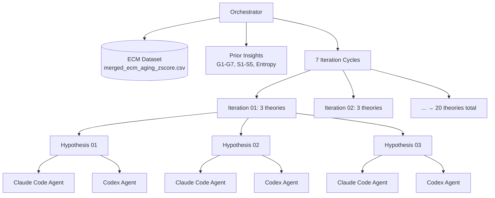
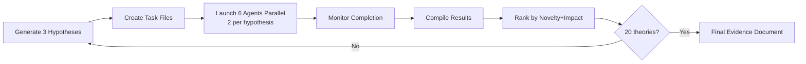

# Multi-Agent Multi-Hypothesis Scientific Discovery Framework

**Thesis:** Autonomous orchestrator iteratively discovers ECM aging signatures by launching 6 parallel agents (2 per hypothesis × 3 hypotheses) across 7 iterations, compiling and ranking results by novelty and impact after each batch, ultimately analyzing 20 distinct theories to identify breakthrough therapeutic targets beyond PCOLCE.

**Overview:** Section 1.0 defines the orchestration architecture and iteration loop. Section 2.0 establishes hypothesis generation criteria and ranking methodology. Section 3.0 specifies agent task structure and artifact requirements. Section 4.0 outlines compilation and synthesis protocol. Section 5.0 tracks iteration progress toward the 20-theory goal.

**System Architecture (Continuants):**


**Process Flow (Occurrents):**


---

## 1.0 Orchestration Architecture

¶1 **Ordering:** Structure → Process → Tracking.

### 1.1 Iteration Cycle

¶1 **Each iteration processes 3 hypotheses = 6 agents:**
- 2 agents per hypothesis: Claude Code + Codex
- Agents work in parallel on identical tasks
- Each creates artifacts in own folder
- Orchestrator compiles both results after completion

¶2 **Total iterations: 7 (to reach 20 theories):**
- Iterations 1-6: 3 theories each = 18 theories
- Iteration 7: 2 theories = 20 theories total

### 1.2 Directory Structure

```
02_multi_agent_multi_hipothesys/
├── 00_task.md                                   # Original task specification
├── 01_ORCHESTRATOR_PLAN.md                      # This document
├── 02_HYPOTHESIS_REGISTRY.md                    # All generated hypotheses
├── 03_FINAL_RANKING.md                          # Final sorted discoveries
│
├── iterations/
│   ├── iteration_01/
│   │   ├── hypothesis_01_[name]/
│   │   │   ├── 01_task.md                       # Shared task for both agents
│   │   │   ├── claude_code/
│   │   │   │   ├── 01_plan_claude_code.md
│   │   │   │   ├── 90_results_claude_code.md
│   │   │   │   └── [artifacts].csv/.py
│   │   │   └── codex/
│   │   │       ├── 01_plan_codex.md
│   │   │       ├── 90_results_codex.md
│   │   │       └── [artifacts].csv/.py
│   │   ├── hypothesis_02_[name]/
│   │   │   └── [same structure]
│   │   └── hypothesis_03_[name]/
│   │       └── [same structure]
│   ├── iteration_02/
│   │   └── [3 hypotheses with same structure]
│   └── ... → iteration_07/
│
└── compiled_results/
    ├── iteration_01_compilation.md
    ├── iteration_02_compilation.md
    └── ... → iteration_07_compilation.md
```

---

## 2.0 Hypothesis Generation and Ranking

¶1 **Ordering:** Generation criteria → Ranking methodology → Novelty assessment.

### 2.1 Hypothesis Sources

¶1 **For Iteration 01 (cold start), draw from:**
- Existing insights (G1-G7, S1-S5) EXCLUDING PCOLCE
- Entropy theory findings (DEATh reversal, serpin transitions)
- Dataset patterns (compartment antagonism, species divergence)
- New protein candidates (from codex/claude validated lists)

¶2 **For Iterations 02-07 (warm start), generate based on:**
- Previous iteration discoveries
- Unexpected protein clusters
- Contradictions between agent results
- Cross-theory emergent patterns

### 2.2 Ranking Criteria

¶1 **Each hypothesis evaluated on 2 dimensions:**

| Criterion | Weight | Scoring |
|-----------|--------|---------|
| **Novelty** | 50% | Is this insight NEW? Not in G1-G7, S1-S5, or entropy work |
| **Impact** | 50% | Therapeutic potential + mechanistic clarity + cross-tissue evidence |

¶2 **Novelty scoring (0-10):**
- 10: Completely new protein/pathway/mechanism
- 7: New combination of known elements
- 4: Extension of existing insight
- 0: Duplicate of prior work

¶3 **Impact scoring (0-10):**
- Therapeutic potential (0-4): Druggable target? Clinical relevance?
- Mechanistic clarity (0-3): Explains HOW/WHY aging occurs?
- Cross-tissue evidence (0-3): Multiple tissues? High statistical power?

### 2.3 Selection for Next Iteration

¶1 **After each compilation:**
1. Rank all hypotheses tested so far by composite score (Novelty + Impact)
2. Identify top 3 UNTESTED hypotheses from latest discoveries
3. Generate 3 new hypotheses for next iteration

---

## 3.0 Agent Task Structure

¶1 **Ordering:** Task template → Artifact requirements → Quality criteria.

### 3.1 Standard Task File Template

¶1 **Each hypothesis gets ONE task file (`01_task.md`) used by BOTH agents:**

```markdown
# Hypothesis: [Name]

## Scientific Question
[Clear 1-2 sentence question]

## Data Source
/Users/Kravtsovd/projects/ecm-atlas/08_merged_ecm_dataset/merged_ecm_aging_zscore.csv

## Success Criteria
1. [Criterion 1: quantifiable result]
2. [Criterion 2: statistical validation]
3. [Criterion 3: mechanistic interpretation]
4. [Criterion 4: therapeutic implication]

## Required Artifacts
1. 01_plan_[agent].md - Analysis plan
2. analysis_[agent].py - Executable analysis script
3. results_[agent].csv - Key findings dataset
4. visualizations_[agent]/ - Figures supporting conclusions
5. 90_results_[agent].md - Final report with self-evaluation (Knowledge Framework format)

## Self-Evaluation Rubric
- Completeness: All success criteria addressed (40 pts)
- Accuracy: Statistical rigor + validation (30 pts)
- Novelty: Discovery significance (20 pts)
- Reproducibility: Code + data artifacts (10 pts)

## Context
[Reference to prior insights this builds upon]
```

### 3.2 Mandatory Artifacts

¶1 **Every agent MUST produce:**
- `01_plan_[agent].md`: Strategy and approach
- `90_results_[agent].md`: Findings in Knowledge Framework format
- Analysis code (.py file) with comments
- Results CSV with key metrics
- Visualizations (PNGs/PDFs)

¶2 **All artifacts MUST be in agent's subfolder** (`claude_code/` or `codex/`).

### 3.3 Knowledge Framework Compliance

¶1 **All `.md` files follow standards:**
- Thesis (1 sentence) → Overview (1 paragraph) → Mermaid diagrams → MECE sections
- TD diagram for structure, LR diagram for process
- Numbered sections (1.0, 2.0), numbered paragraphs (¶1, ¶2)
- Reference: `/Users/Kravtsovd/projects/ecm-atlas/03_KNOWLEDGE_FRAMEWORK_DOCUMENTATION_STANDARDS.md`

---

## 4.0 Compilation and Synthesis Protocol

¶1 **Ordering:** Results collection → Agent comparison → Hypothesis scoring → Next iteration prep.

### 4.1 Per-Hypothesis Compilation

¶1 **For each hypothesis, compare Claude Code vs Codex:**
- Agreement: Do they find same proteins/patterns?
- Divergence: Where do results differ? Why?
- Winner: Which agent's evidence is stronger?
- Synthesis: Unified conclusion from both

### 4.2 Cross-Hypothesis Ranking

¶1 **After compiling all 3 hypotheses in iteration:**
1. Score each on Novelty (0-10) and Impact (0-10)
2. Calculate composite score (average of both)
3. Rank hypotheses: #1 (highest) → #3 (lowest)
4. Document in `compiled_results/iteration_XX_compilation.md`

### 4.3 Next Iteration Generation

¶1 **Based on iteration results:**
- Extract 5-10 emergent patterns from agent discoveries
- Generate 3 new hypotheses exploring strongest patterns
- Add to `02_HYPOTHESIS_REGISTRY.md` with iteration number
- Create hypothesis folders for next iteration

---

## 5.0 Iteration Progress Tracking

¶1 **Ordering:** Current status → Completed → Pending.

### 5.1 Target: 20 Theories Total

| Iteration | Theories | Cumulative | Status |
|-----------|----------|------------|--------|
| 01 | 3 | 3/20 | Pending |
| 02 | 3 | 6/20 | Pending |
| 03 | 3 | 9/20 | Pending |
| 04 | 3 | 12/20 | Pending |
| 05 | 3 | 15/20 | Pending |
| 06 | 3 | 18/20 | Pending |
| 07 | 2 | 20/20 | Pending |

### 5.2 Exclusions

¶1 **DO NOT analyze PCOLCE** - already extensively studied in:
- `/Users/Kravtsovd/projects/ecm-atlas/13_1_meta_insights/PCOLCE research anomaly/`
- 4 agent analysis complete with final comparison document

### 5.3 Final Deliverable

¶1 **After iteration 7:**
- Compile all 20 theories into `03_FINAL_RANKING.md`
- Sort by composite score (Novelty + Impact)
- Create evidence document for top 5 discoveries
- Highlight therapeutic targets with highest clinical potential

---

## Reference

**Key Paths:**
- Dataset: `/Users/Kravtsovd/projects/ecm-atlas/08_merged_ecm_dataset/merged_ecm_aging_zscore.csv`
- Knowledge Framework: `/Users/Kravtsovd/projects/ecm-atlas/03_KNOWLEDGE_FRAMEWORK_DOCUMENTATION_STANDARDS.md`
- Multi-agent orchestrator: `/Users/Kravtsovd/projects/chrome-extension-tcs/algorithms/product_div/Multi_agent_framework/00_MULTI_AGENT_ORCHESTRATOR.md`
- Execution script template: `/Users/Kravtsovd/projects/ecm-atlas/13_1_meta_insights/compare previos insights wiht new dataset/run_2claude_1codex.sh`
- Prior insights: `/Users/Kravtsovd/projects/ecm-atlas/13_1_meta_insights/compare previos insights wiht new dataset/FINAL_THREE_AGENT_COMPARISON.md`

**Next Action:** Generate 3 hypotheses for Iteration 01 → Document in `02_HYPOTHESIS_REGISTRY.md`

---
**Created:** 2025-10-20
**Status:** Orchestrator framework active, ready for hypothesis generation
**Contact:** daniel@improvado.io
