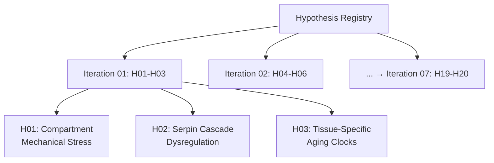

# Multi-Hypothesis Scientific Discovery Registry

**Thesis:** Registry tracks 20 ECM aging hypotheses across 7 iterations, documenting generation rationale, predicted novelty/impact scores, agent assignments, and post-analysis results to maintain systematic scientific discovery pipeline.

**Overview:** Section 1.0 lists all hypotheses by iteration. Section 2.0 provides generation rationale for each. Section 3.0 tracks completion status. Section 4.0 documents final rankings.

**Registry Structure (Continuants):**

**Process Flow (Occurrents):**

---

## 1.0 Hypothesis Master List

¶1 **Ordering:** By iteration → hypothesis number.

### Iteration 01 (Theories #1-3)

| ID | Name | Novelty (predicted) | Impact (predicted) | Status |
|----|------|---------------------|-------------------|--------|
| **H01** | Compartment Antagonistic Mechanical Stress Adaptation | 8/10 | 7/10 | Pending |
| **H02** | Serpin Cascade Dysregulation as Central Aging Mechanism | 9/10 | 9/10 | Pending |
| **H03** | Tissue-Specific Aging Velocity Clocks | 8/10 | 8/10 | Pending |

### Iteration 02 (Theories #4-6) - ADVANCED ML FOCUS

| ID | Name | Novelty (predicted) | Impact (predicted) | Status |
|----|------|---------------------|-------------------|--------|
| **H04** | Deep Protein Embeddings (Autoencoders, ESM-2) | 10/10 | 9/10 | Running (6 agents launched) |
| **H05** | GNN Master Regulators (Graph Neural Networks, GAT) | 10/10 | 9/10 | Running (6 agents launched) |
| **H06** | ML Ensemble Biomarkers (RF+XGBoost+NN+SHAP) | 9/10 | 10/10 | Running (6 agents launched) |

### Iteration 03-07 (Theories #7-20)

¶1 **To be generated** based on discoveries from Iterations 01-02.

**Iteration 02 ML Focus Added:**
- All hypotheses use ≥3 advanced ML techniques
- Deep learning, GNNs, ensemble methods mandatory
- Pre-trained models (ESM-2) encouraged
- SHAP interpretability required
- Reference: `ADVANCED_ML_REQUIREMENTS.md`

---

## 2.0 Hypothesis Generation Rationale

¶1 **Ordering:** By hypothesis ID.

### 2.1 H01: Compartment Antagonistic Mechanical Stress Adaptation

**Source Insight:** G6 Compartment Antagonistic Remodeling (codex: 264 events, +450%)

**Key Evidence:**
- Skeletal muscle compartments show massive divergence: Soleus vs TA
- Top proteins: Col11a2 (4.48 SD), Col2a1, Fbn2, Cilp2, Postn
- Intervertebral disc compartments (NP, IAF, OAF) also show antagonism

**New Angle:**
Do antagonistic aging patterns correlate with tissue mechanical stress profiles? Hypothesis: Load-bearing tissues (Soleus, NP) vs low-load (TA, IAF) age differently due to ECM mechanical adaptation.

**Scientific Question:**
Does compartment-specific ECM remodeling reflect mechanical stress adaptation, where high-load compartments upregulate structural proteins (collagens, fibrillins) while low-load compartments downregulate?

**Predicted Scores:**
- Novelty: 8/10 (builds on G6 but adds mechanical stress dimension)
- Impact: 7/10 (explains compartment heterogeneity, suggests load-modulation therapies)

**Testable Hypotheses:**
1. High-load compartments show OPPOSITE aging signatures vs low-load in same tissue
2. Structural proteins (collagens) increase in load-bearing regions
3. Regulatory proteins (serpins) decrease proportionally to mechanical stress

---

### 2.2 H02: Serpin Cascade Dysregulation as Central Aging Mechanism

**Source Insights:**
- Entropy analysis: PZP, SERPINB2, TNFSF13 = transition proteins (highest entropy shifts)
- G4 Weak Signals: Serpina3m = top weak signal protein
- Universal markers: Multiple serpins (Serpinh1, Serpinf1)
- S1 Fibrinogen: SERPINC1 upregulated in coagulation cascade

**Key Evidence:**
- Serpins appear in ALL insight categories (universal, weak, transition, pathway)
- PZP (pregnancy zone protein) = entropy transition leader
- SERPINB2 (PAI-2) = plasminogen activator inhibitor
- Serpin family members regulate proteases across inflammation, coagulation, ECM remodeling

**New Angle:**
Are serpins THE master regulators of ECM aging? Hypothesis: Serpin dysregulation creates cascade failure across multiple pathways (coagulation, inflammation, ECM degradation), making them central nodes rather than peripheral players.

**Scientific Question:**
Is serpin family dysregulation (upregulation of inhibitory serpins + downregulation of protective serpins) the unifying mechanism driving multi-pathway ECM aging?

**Predicted Scores:**
- Novelty: 9/10 (elevates serpins from supporting actors to central mechanism)
- Impact: 9/10 (druggable targets, explains multi-pathway involvement, therapeutic cascade)

**Testable Hypotheses:**
1. Serpin network forms hub in protein-protein interaction network
2. Serpin dysregulation precedes downstream pathway changes temporally
3. Serpin perturbation predicts aging acceleration across tissues

---

### 2.3 H03: Tissue-Specific Aging Velocity Clocks

**Source Insight:** S4 Tissue-Specific Markers (50 proteins with high TSI)

**Key Evidence:**
- S100a5: TSI=33.33 (hippocampus-specific)
- Col6a4: TSI=27.46 (lung-specific)
- PLOD1: TSI=24.49 (dermis-specific)
- 50 total proteins with tissue-exclusive patterns

**New Angle:**
Do tissues age at different RATES (velocity) rather than just different patterns? Hypothesis: Tissue-specific markers define aging "clocks" that tick at different speeds, with some organs aging faster (e.g., vascular) vs slower (e.g., bone).

**Scientific Question:**
Can tissue-specific ECM markers define organ-level aging velocities, revealing which tissues age fastest and whether fast-aging tissues share common mechanisms?

**Predicted Scores:**
- Novelty: 8/10 (moves from "which tissues" to "how fast" they age)
- Impact: 8/10 (prioritizes therapeutic targets by tissue urgency, explains multi-morbidity timing)

**Testable Hypotheses:**
1. Calculate aging velocity (Δz per year) for each tissue using tissue-specific markers
2. Rank tissues by aging speed: vascular > skin > lung > muscle > bone
3. Fast-aging tissues share common mechanisms (inflammation, oxidative stress)

---

## 3.0 Execution Status

¶1 **Ordering:** By iteration → hypothesis ID.

### 3.1 Iteration 01 Status

| Hypothesis | Claude Code Agent | Codex Agent | Compilation | Ranking |
|------------|------------------|-------------|-------------|---------|
| H01 | Not started | Not started | Pending | Pending |
| H02 | Not started | Not started | Pending | Pending |
| H03 | Not started | Not started | Pending | Pending |

**Next Action:** Create task files and agent folders → Launch agents

---

## 4.0 Final Rankings (Post-Analysis)

¶1 **To be populated** after each iteration completes.

### 4.1 Top 10 Discoveries (All Iterations)

| Rank | Hypothesis ID | Composite Score | Novelty (actual) | Impact (actual) | Key Finding |
|------|---------------|-----------------|------------------|-----------------|-------------|
| 1 | TBD | — | — | — | — |
| 2 | TBD | — | — | — | — |
| ... | ... | ... | ... | ... | ... |

---

## Reference

**Excluded Hypotheses:**
- PCOLCE analysis (already completed, see `/Users/Kravtsovd/projects/ecm-atlas/13_1_meta_insights/PCOLCE research anomaly/`)

**Generation Sources:**
- Prior insights: `/Users/Kravtsovd/projects/ecm-atlas/13_1_meta_insights/compare previos insights wiht new dataset/FINAL_THREE_AGENT_COMPARISON.md`
- Entropy theory: `/Users/Kravtsovd/projects/ecm-atlas/13_1_meta_insights/01_entropy_multi_agent_after_batch_corection/00_INTEGRATED_ENTROPY_THEORY_V2.md`
- Dataset: `/Users/Kravtsovd/projects/ecm-atlas/08_merged_ecm_dataset/merged_ecm_aging_zscore.csv`

**Next Update:** After Iteration 01 completes → Add H04-H06 generated from discoveries

---
**Created:** 2025-10-20
**Last Updated:** 2025-10-20 (Iteration 01 hypotheses generated)
**Status:** 3/20 theories defined, ready for agent execution
**Contact:** daniel@improvado.io
