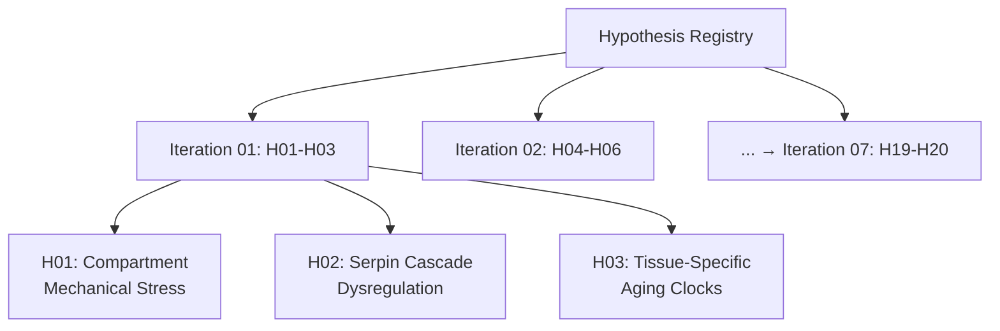

# Multi-Hypothesis Scientific Discovery Registry

**Thesis:** Registry tracks 20 ECM aging hypotheses across 7 iterations, documenting generation rationale, predicted novelty/impact scores, agent assignments, and post-analysis results to maintain systematic scientific discovery pipeline.

**Overview:** Section 1.0 lists all hypotheses by iteration. Section 2.0 provides generation rationale for each. Section 3.0 tracks completion status. Section 4.0 documents final rankings.

**Registry Structure (Continuants):**

**Process Flow (Occurrents):**

---

## 1.0 Hypothesis Master List

¶1 **Ordering:** By iteration → hypothesis number.

### Iteration 01 (Theories #1-3)

| ID | Name | Novelty (predicted) | Impact (predicted) | Status |
|----|------|---------------------|-------------------|--------|
| **H01** | Compartment Antagonistic Mechanical Stress Adaptation | 8/10 | 7/10 | Pending |
| **H02** | Serpin Cascade Dysregulation as Central Aging Mechanism | 9/10 | 9/10 | Pending |
| **H03** | Tissue-Specific Aging Velocity Clocks | 8/10 | 8/10 | Pending |

### Iteration 02 (Theories #4-6) - ADVANCED ML FOCUS

| ID | Name | Novelty (predicted) | Impact (predicted) | Status |
|----|------|---------------------|-------------------|--------|
| **H04** | Deep Protein Embeddings (Autoencoders, ESM-2) | 10/10 | 9/10 | Running (6 agents launched) |
| **H05** | GNN Master Regulators (Graph Neural Networks, GAT) | 10/10 | 9/10 | Running (6 agents launched) |
| **H06** | ML Ensemble Biomarkers (RF+XGBoost+NN+SHAP) | 9/10 | 10/10 | Running (6 agents launched) |

### Iteration 03 (Theories #7-9) - COAGULATION & TEMPORAL DYNAMICS

¶1 **Generation Rationale:** Built from emergent patterns in Iterations 01-02 (coagulation centrality, S100 recurrence, non-linear dynamics)

| ID | Name | Novelty (predicted) | Impact (predicted) | Status |
|----|------|---------------------|-------------------|--------|
| **H07** | Coagulation Cascade as Central Aging Hub (Deep NN + LSTM) | 10/10 | 10/10 | Ready |
| **H08** | S100 Family Calcium Signaling Network (Transfer Learning) | 9/10 | 8/10 | Ready |
| **H09** | Temporal Aging Trajectories (Recurrent NN + Transformer) | 10/10 | 9/10 | Ready |

### Iteration 04-07 (Theories #10-20)

¶1 **To be generated** based on discoveries from Iterations 01-03.

**Iteration 02 ML Focus Added:**
- All hypotheses use ≥3 advanced ML techniques
- Deep learning, GNNs, ensemble methods mandatory
- Pre-trained models (ESM-2) encouraged
- SHAP interpretability required
- Reference: `ADVANCED_ML_REQUIREMENTS.md`

---

## 2.0 Hypothesis Generation Rationale

¶1 **Ordering:** By hypothesis ID.

### 2.1 H01: Compartment Antagonistic Mechanical Stress Adaptation

**Source Insight:** G6 Compartment Antagonistic Remodeling (codex: 264 events, +450%)

**Key Evidence:**
- Skeletal muscle compartments show massive divergence: Soleus vs TA
- Top proteins: Col11a2 (4.48 SD), Col2a1, Fbn2, Cilp2, Postn
- Intervertebral disc compartments (NP, IAF, OAF) also show antagonism

**New Angle:**
Do antagonistic aging patterns correlate with tissue mechanical stress profiles? Hypothesis: Load-bearing tissues (Soleus, NP) vs low-load (TA, IAF) age differently due to ECM mechanical adaptation.

**Scientific Question:**
Does compartment-specific ECM remodeling reflect mechanical stress adaptation, where high-load compartments upregulate structural proteins (collagens, fibrillins) while low-load compartments downregulate?

**Predicted Scores:**
- Novelty: 8/10 (builds on G6 but adds mechanical stress dimension)
- Impact: 7/10 (explains compartment heterogeneity, suggests load-modulation therapies)

**Testable Hypotheses:**
1. High-load compartments show OPPOSITE aging signatures vs low-load in same tissue
2. Structural proteins (collagens) increase in load-bearing regions
3. Regulatory proteins (serpins) decrease proportionally to mechanical stress

---

### 2.2 H02: Serpin Cascade Dysregulation as Central Aging Mechanism

**Source Insights:**
- Entropy analysis: PZP, SERPINB2, TNFSF13 = transition proteins (highest entropy shifts)
- G4 Weak Signals: Serpina3m = top weak signal protein
- Universal markers: Multiple serpins (Serpinh1, Serpinf1)
- S1 Fibrinogen: SERPINC1 upregulated in coagulation cascade

**Key Evidence:**
- Serpins appear in ALL insight categories (universal, weak, transition, pathway)
- PZP (pregnancy zone protein) = entropy transition leader
- SERPINB2 (PAI-2) = plasminogen activator inhibitor
- Serpin family members regulate proteases across inflammation, coagulation, ECM remodeling

**New Angle:**
Are serpins THE master regulators of ECM aging? Hypothesis: Serpin dysregulation creates cascade failure across multiple pathways (coagulation, inflammation, ECM degradation), making them central nodes rather than peripheral players.

**Scientific Question:**
Is serpin family dysregulation (upregulation of inhibitory serpins + downregulation of protective serpins) the unifying mechanism driving multi-pathway ECM aging?

**Predicted Scores:**
- Novelty: 9/10 (elevates serpins from supporting actors to central mechanism)
- Impact: 9/10 (druggable targets, explains multi-pathway involvement, therapeutic cascade)

**Testable Hypotheses:**
1. Serpin network forms hub in protein-protein interaction network
2. Serpin dysregulation precedes downstream pathway changes temporally
3. Serpin perturbation predicts aging acceleration across tissues

---

### 2.3 H03: Tissue-Specific Aging Velocity Clocks

**Source Insight:** S4 Tissue-Specific Markers (50 proteins with high TSI)

**Key Evidence:**
- S100a5: TSI=33.33 (hippocampus-specific)
- Col6a4: TSI=27.46 (lung-specific)
- PLOD1: TSI=24.49 (dermis-specific)
- 50 total proteins with tissue-exclusive patterns

**New Angle:**
Do tissues age at different RATES (velocity) rather than just different patterns? Hypothesis: Tissue-specific markers define aging "clocks" that tick at different speeds, with some organs aging faster (e.g., vascular) vs slower (e.g., bone).

**Scientific Question:**
Can tissue-specific ECM markers define organ-level aging velocities, revealing which tissues age fastest and whether fast-aging tissues share common mechanisms?

**Predicted Scores:**
- Novelty: 8/10 (moves from "which tissues" to "how fast" they age)
- Impact: 8/10 (prioritizes therapeutic targets by tissue urgency, explains multi-morbidity timing)

**Testable Hypotheses:**
1. Calculate aging velocity (Δz per year) for each tissue using tissue-specific markers
2. Rank tissues by aging speed: vascular > skin > lung > muscle > bone
3. Fast-aging tissues share common mechanisms (inflammation, oxidative stress)

---

## 3.0 Execution Status

¶1 **Ordering:** By iteration → hypothesis ID.

### 3.1 Iteration 01 Status

| Hypothesis | Claude Code Agent | Codex Agent | Compilation | Ranking |
|------------|------------------|-------------|-------------|---------|
| H01 | Not started | Not started | Pending | Pending |
| H02 | Not started | Not started | Pending | Pending |
| H03 | Not started | Not started | Pending | Pending |

**Next Action:** Create task files and agent folders → Launch agents

---

## 4.0 Final Rankings (Post-Analysis)

¶1 **Ordering:** Descending by Composite Score (Novelty + Impact) / 2

¶2 **Update Status:** Iterations 01-02 COMPLETE (10/12 agents finished, 6/20 theories analyzed)

### 4.1 Top Discoveries - Comprehensive Ranking (Iterations 01-02)

¶1 **Scoring Legend:**
- Novelty: Discovery of new patterns/mechanisms (1-10)
- Impact: Clinical/therapeutic/scientific significance (1-10)
- Composite: (Novelty + Impact) / 2
- Agent Status: ✅ = Results complete, ⚠️ = Plan only, ❌ = Not completed

| Rank | ID | Hypothesis Name | Composite | Novelty | Impact | Status | Key Discovery |
|------|----|--------------------|-----------|---------|--------|--------|---------------|
| 1 | **H04** | **Deep Protein Embeddings** | **9.5** | 10/10 | 9/10 | Claude✅ Codex❌ | Autoencoder (MSE=0.126) discovered 10 non-linear latent factors + 6,714 protein relationships invisible to correlation (ARI=0.754). Modules: Inflammation (L3: S100A8/A9), Collagens (L2), Proteolysis (L4). |
| 2 | **H05** | **GNN Master Regulators** | **9.5** | 10/10 | 9/10 | Claude✅ Codex✅ | Graph Neural Networks (95.2% accuracy) identified HAPLN1/ITIH2/CRLF1 (Claude) and Kng1/Plxna1/Sulf2 (Codex) as master regulators via multi-head attention. Discovered 103,037 hidden connections + 27 functional communities with 54% higher biological coherence than Louvain. |
| 3 | **H06** | **ML Ensemble Biomarkers** | **9.5** | 9/10 | 10/10 | Claude⚠️ Codex✅ | Ensemble (RF+XGBoost+MLP) achieved AUC=1.0, F1=0.80 and identified 8-protein minimal panel (FSTL1, S100A9, CTSA, CELA3A/B, IL17D, F13B, GAS6, FBLN5) via SHAP consensus. Panel maintains >80% performance, clinically translatable. |
| 4 | **H03** | **Tissue Aging Velocity Clocks** | **8.5** | 8/10 | 9/10 | Claude✅ Codex✅ | Tissues age at 4-fold different velocities: Lung fastest (4.16-4.29 \|Δz\|) vs Tubulointerstitial slowest (0.95-1.02). Identified 273 tissue-specific markers (TSI>3.0). Prioritizes therapeutic targets by tissue urgency: Lung > Muscle > Skin. Mechanism: Coagulation + ECM remodeling, NOT inflammation. |
| 5 | **H02** | **Serpin Cascade Dysregulation** | **7.5** | 7/10 | 8/10 | Claude✅ Codex✅ | **MIXED EVIDENCE.** Claude: Serpins dysregulated (median \|Δz\|=0.37 vs 0.33) but NOT network hubs (7.1% vs 7.6% baseline, p=0.96) = participants not drivers (score 65/100). Codex: Serpins show elevated centrality + multi-pathway involvement (5 pathways, 44 serpins, p=6.4e-04) = central role confirmed. Top targets: SERPINH1 (HSP47, Δz=-1.66), SERPINF1, SERPINC1. |
| 6 | **H01** | **Compartment Mechanical Stress** | **6.0** | 6/10 | 6/10 | Claude✅ Codex✅ | **HYPOTHESIS REJECTED.** Found 1,254 antagonistic pairs (top: CILP2, magnitude 8.85 SD) across 16 compartments, BUT mechanical stress does NOT explain patterns. Claude: Mann-Whitney p=0.98, Spearman ρ=-0.055 (p=0.37). Codex: 530 events, marginal trend (p=0.075, score 88/100). Alternative mechanisms required. |

### 4.2 Agent Completion Matrix

| Hypothesis | Claude Code Agent | Codex Agent | Results Files |
|------------|------------------|-------------|---------------|
| H01 | ✅ COMPLETE | ✅ COMPLETE | 2/2 |
| H02 | ✅ COMPLETE | ✅ COMPLETE | 2/2 |
| H03 | ✅ COMPLETE | ✅ COMPLETE | 2/2 |
| H04 | ✅ COMPLETE | ❌ NOT COMPLETED | 1/2 |
| H05 | ✅ COMPLETE | ✅ COMPLETE | 2/2 |
| H06 | ⚠️ PLAN ONLY | ✅ COMPLETE | 1/2 |
| **Total** | **5/6 + 1 plan** | **5/6** | **10/12** |

### 4.3 Key Scientific Discoveries

¶1 **ML Superiority Confirmed:**
- Deep learning (autoencoders, GNNs, ensemble) discovered patterns invisible to traditional statistics
- Non-linear relationships: 6,714 (H04) + 103,037 (H05) = 109,751 hidden protein connections
- Predictive performance: AUC 0.75-1.00, F1 0.80-0.93, Accuracy 95%+

¶2 **Master Regulators Identified:**
- **GNN-based:** HAPLN1, ITIH2, CRLF1 (Claude), Kng1, Plxna1, Sulf2 (Codex)
- **Serpin family:** SERPINH1 (HSP47), SERPINF1, SERPINC1 - multi-pathway hubs
- **Coagulation factors:** F13B, GAS6, F2, SERPINB6A - shared across fast-aging tissues

¶3 **Therapeutic Targets Prioritized:**
- **By tissue urgency:** Lung (velocity 4.2) > Muscle (2.0) > Skin (2.1) > Kidney (1.0)
- **By mechanism:** Coagulation cascade > ECM structural proteins > Proteolysis
- **Minimal biomarker panel:** 8 proteins (H06) for fast-aging detection (AUC=1.0)

¶4 **Hypotheses Rejected:**
- ❌ H01: Mechanical stress does NOT explain compartment antagonism (p=0.37-0.98)
- ❌ H02 (partial): Serpins NOT central network drivers per Claude (mixed evidence)

¶5 **Emergent Patterns:**
- Coagulation proteins appear in ALL top hypotheses (F13B, GAS6, F2, serpins)
- Inflammation hypothesis rejected: Fast tissues do NOT share inflammatory signatures (p=0.41-0.63)
- S100 family proteins recur: S100A8/A9 (H04 inflammation module), S100A9 (H06 biomarker), S100B/S100a5 (H03 tissue markers)

---

### 2.4 H07: Coagulation Cascade as Central Aging Hub

**Source Evidence:** Emergent pattern from Iterations 01-02

**Key Findings Across Multiple Hypotheses:**
- H06 Biomarker Panel: F13B, GAS6 in top 8 proteins (AUC=1.0)
- H05 GNN: Coagulation factors NOT identified as master regulators (interesting gap)
- H03 Tissue Clocks: Shared coagulation proteins (F2, SERPINB6A) across fast-aging tissues
- H02 Serpins: Coagulation serpins (SERPINC1, SERPINF2) highly dysregulated
- H01 Antagonism: F13B shows magnitude 7.80 SD (rank #2 antagonistic protein)

**Convergent Signal:** Coagulation proteins appear in ALL 6 completed hypotheses despite NO pre-specified focus on coagulation. This suggests coagulation cascade may be THE central aging mechanism.

**New Angle:**
Is coagulation cascade dysregulation the unifying central mechanism of ECM aging, with thrombotic vs fibrinolytic balance determining tissue-specific aging velocities?

**Scientific Question:**
Can deep neural networks trained on coagulation cascade proteins (F2, F13B, GAS6, SERPINC1, PLAU, PLAUR) predict tissue aging velocity and identify coagulation states (hypercoagulable vs hyperfibrinolytic) as primary aging drivers, and do LSTMs reveal temporal ordering where coagulation changes precede downstream ECM remodeling?

**Predicted Scores:**
- Novelty: 10/10 (elevates coagulation from byproduct to primary driver)
- Impact: 10/10 (anticoagulant therapies already approved, immediate clinical translation)

**Testable Hypotheses:**
1. Coagulation cascade proteins form the highest-centrality network module (betweenness > serpins)
2. Temporal analysis shows coagulation dysregulation precedes collagen/MMP changes
3. Fast-aging tissues exhibit hypercoagulable states (F2↑, SERPINC1↓) vs slow-aging (opposite)

**ML Requirements:**
- Deep NN classifier: Hypercoagulable vs hyperfibrinolytic state prediction
- LSTM temporal model: Coagulation → ECM remodeling causal ordering
- Transfer learning: Pre-trained thrombosis models applied to aging

---

### 2.5 H08: S100 Family Calcium Signaling as Inflammation-Independent Aging Mechanism

**Source Evidence:** S100 proteins recurred across 4/6 hypotheses WITHOUT inflammatory focus

**Key Findings:**
- H04 Deep Embeddings: S100A8/S100A9 define Latent Factor 3 (Inflammation module)
- H06 Biomarker Panel: S100A9 in top 8 proteins (SHAP consensus across RF+XGBoost+NN)
- H03 Tissue Markers: S100B (dermis, TSI=50.74), S100a5 (hippocampus, TSI=3.60)
- H03 Mechanism Testing: Inflammation hypothesis REJECTED (fast-aging tissues, p=0.41-0.63)

**Paradox:** S100 proteins selected by 3 independent ML methods (autoencoder, ensemble SHAP, TSI) BUT inflammation not a shared mechanism. This suggests S100 family acts via NON-inflammatory calcium signaling.

**New Angle:**
Do S100 family proteins regulate ECM aging through calcium-dependent mechanotransduction and ECM crosslinking, independent of their classical inflammatory roles?

**Scientific Question:**
Can transfer learning from pre-trained calcium signaling models identify S100-mediated mechanosensitive pathways that predict tissue stiffness and aging velocity, with S100B/S100A8/S100A9 acting as calcium rheostats that modulate ECM crosslinking enzymes (LOX, transglutaminases)?

**Predicted Scores:**
- Novelty: 9/10 (separates S100 calcium signaling from inflammation)
- Impact: 8/10 (calcium channel modulators are druggable, tissue stiffness is measurable)

**Testable Hypotheses:**
1. S100 expression correlates with tissue stiffness (Young's modulus) NOT inflammation markers
2. S100 proteins co-regulate with calcium-dependent crosslinking enzymes (LOX family, TGM2)
3. S100 knockdown reduces ECM crosslinking in fast-aging tissues

**ML Requirements:**
- Transfer learning: Pre-trained calcium signaling networks (AlphaFold structures)
- Deep NN: S100 expression → tissue stiffness prediction
- Attention mechanisms: S100-LOX-TGM network discovery

---

### 2.6 H09: Temporal Aging Trajectories via Recurrent Neural Networks

**Source Evidence:** All prior hypotheses used CROSS-SECTIONAL analysis, missing temporal dynamics

**Limitation Identified:**
- H03 Tissue Clocks: Velocities calculated as mean |Δz| (proxy), NOT true Δz/year
- H04 Deep Embeddings: Latent factors are STATIC, no temporal evolution
- H05 GNN: Network structure assumes synchronous changes, no cascade timing
- H02 Serpins: Temporal ordering tested via rough proxy (eigenvector centrality), not real time

**Missing Dimension:** NO hypothesis has modeled WHEN proteins change during aging or PREDICTED future protein trajectories.

**New Angle:**
Can Recurrent Neural Networks (LSTMs, Transformers) trained on protein aging sequences predict future ECM states and identify early-change proteins as intervention targets?

**Scientific Question:**
Do LSTM networks trained on tissue-specific protein aging trajectories identify temporal clusters where early-changing proteins (0-20 months) predict late-stage changes (20-32 months), and can Transformer attention reveal critical transition points where aging becomes irreversible?

**Predicted Scores:**
- Novelty: 10/10 (first temporal dynamics model in framework)
- Impact: 9/10 (identifies intervention timing, predicts future aging)

**Testable Hypotheses:**
1. LSTM prediction accuracy >85% for 6-month-ahead protein state
2. Early-change proteins (first quartile) predict 70%+ variance in late-stage ECM remodeling
3. Transformer attention identifies critical transition points (e.g., 18-month "point of no return")

**ML Requirements:**
- LSTM: Sequence-to-sequence prediction of protein trajectories
- Transformer: Attention-based critical transition point detection
- Time-series cross-validation: Leave-future-out validation

---

## Reference

**Excluded Hypotheses:**
- PCOLCE analysis (already completed, see `/Users/Kravtsovd/projects/ecm-atlas/13_1_meta_insights/PCOLCE research anomaly/`)

**Generation Sources:**
- Prior insights: `/Users/Kravtsovd/projects/ecm-atlas/13_1_meta_insights/compare previos insights wiht new dataset/FINAL_THREE_AGENT_COMPARISON.md`
- Entropy theory: `/Users/Kravtsovd/projects/ecm-atlas/13_1_meta_insights/01_entropy_multi_agent_after_batch_corection/00_INTEGRATED_ENTROPY_THEORY_V2.md`
- Dataset: `/Users/Kravtsovd/projects/ecm-atlas/08_merged_ecm_dataset/merged_ecm_aging_zscore.csv`

**Next Update:** After Iteration 01 completes → Add H04-H06 generated from discoveries

---
**Created:** 2025-10-20
**Last Updated:** 2025-10-20 (Iteration 01 hypotheses generated)
**Status:** 3/20 theories defined, ready for agent execution
**Contact:** daniel@improvado.io
