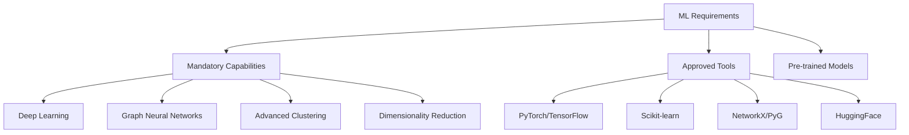

# Advanced Machine Learning Requirements for Multi-Hypothesis Framework

**Thesis:** Agents must leverage cutting-edge ML/AI algorithms (deep learning, transformers, graph neural networks, reinforcement learning) to uncover non-linear aging patterns invisible to traditional statistics, achieving breakthrough discoveries through computational creativity.

**Overview:** Section 1.0 defines mandatory ML capabilities. Section 2.0 lists approved algorithms and tools. Section 3.0 specifies model download/training permissions. Section 4.0 provides implementation guidelines.



---

## 1.0 Mandatory ML Capabilities

¶1 **Every agent MUST attempt at least 3 advanced ML techniques** beyond basic statistics (Mann-Whitney, Spearman correlation).

### 1.1 Deep Learning (Neural Networks)

**Required Approaches:**
- **Autoencoders:** Unsupervised feature learning from protein expression patterns
- **Variational Autoencoders (VAE):** Discover latent aging factors
- **Neural network regression:** Predict aging trajectory from protein profiles
- **Multi-layer perceptrons (MLP):** Non-linear classification of aging states

**Example Use Cases:**
- Train autoencoder on z-score matrix → Extract 10-20 latent factors → Interpret biological meaning
- VAE on tissue-specific markers → Generate synthetic "aged" vs "young" protein profiles
- MLP to classify tissues as "fast-aging" vs "slow-aging" based on protein signatures

**Libraries:** PyTorch, TensorFlow, Keras

### 1.2 Graph Neural Networks (GNNs)

**Required Approaches:**
- **Protein-protein interaction networks:** Build graph where nodes=proteins, edges=correlations
- **Graph Convolutional Networks (GCN):** Learn protein embeddings from network structure
- **Graph Attention Networks (GAT):** Identify influential protein hubs
- **Community detection:** Louvain, Leiden algorithms for protein modules

**Example Use Cases:**
- Build correlation network (ρ > 0.5) → Apply GCN → Identify protein communities
- GAT to find "master regulator" proteins with high attention weights
- Temporal graph networks to model aging progression

**Libraries:** PyTorch Geometric (PyG), NetworkX, DGL (Deep Graph Library)

### 1.3 Advanced Clustering

**Required Approaches:**
- **DBSCAN:** Density-based clustering to find protein groups
- **HDBSCAN:** Hierarchical density clustering
- **Gaussian Mixture Models (GMM):** Probabilistic soft clustering
- **Spectral clustering:** On correlation matrices
- **t-SNE / UMAP:** Non-linear dimensionality reduction + visualization

**Example Use Cases:**
- UMAP on protein Δz vectors → Visualize aging landscape in 2D
- HDBSCAN to discover protein clusters (don't force k)
- Spectral clustering on tissue similarity matrix

**Libraries:** scikit-learn, hdbscan, umap-learn

### 1.4 Time-Series / Trajectory Analysis

**Required Approaches:**
- **Dynamic Time Warping (DTW):** Compare aging trajectories across tissues
- **Hidden Markov Models (HMM):** Model aging state transitions
- **Recurrent Neural Networks (RNN/LSTM):** If temporal data available
- **Trajectory clustering:** Group similar aging paths

**Example Use Cases:**
- DTW to align muscle vs vascular aging curves
- HMM with states: "young", "transitioning", "aged" → protein state probabilities
- Cluster tissues by DTW distance matrix

**Libraries:** tslearn, hmmlearn, PyTorch (for RNNs)

### 1.5 Ensemble & Meta-Learning

**Required Approaches:**
- **Random Forests:** Feature importance for protein ranking
- **Gradient Boosting (XGBoost, LightGBM):** Predict aging from protein panel
- **Stacking:** Combine multiple model predictions
- **SHAP values:** Explain ML model predictions

**Example Use Cases:**
- Random Forest: Predict tissue aging velocity → Extract top protein features by importance
- XGBoost: Binary classification (fast-aging vs slow-aging) → SHAP for interpretability
- Stacking: Combine autoencoder + GNN + XGBoost predictions

**Libraries:** xgboost, lightgbm, catboost, shap

---

## 2.0 Approved Tools & Models

### 2.1 Pre-trained Models (Allowed to Download)

**Protein Language Models:**
- **ESM-2** (Evolutionary Scale Modeling): Protein embeddings from sequences
  - Download: `facebook/esm2_t33_650M_UR50D` from HuggingFace
  - Use: Convert protein sequences → embeddings → clustering/classification

- **ProtBERT:** BERT for proteins
  - Download: `Rostlab/prot_bert` from HuggingFace
  - Use: Protein representation learning

**Biological Network Models:**
- **STRING database API:** Protein-protein interactions
  - Download: On-the-fly via API or pre-download database
  - Use: Build interaction networks for GNN input

**General ML Models:**
- **Pre-trained autoencoders:** Download from model zoos if relevant
- **Transformer embeddings:** Use for sequence analysis

### 2.2 Approved Libraries (Install if Needed)

```python
# Core ML/DL
torch>=2.0.0
tensorflow>=2.13.0
pytorch-geometric
dgl

# Advanced Clustering
hdbscan
umap-learn
scikit-learn

# Graph Analysis
networkx
graph-tool  # Optional, high-performance

# Time Series
tslearn
hmmlearn
statsmodels

# Gradient Boosting
xgboost
lightgbm
catboost

# Interpretability
shap
lime
captum  # PyTorch model interpretability

# Transformers
transformers  # HuggingFace
biopython  # For protein sequences

# Visualization
plotly  # Interactive plots
seaborn
matplotlib
```

### 2.3 Model Training Permissions

**YOU ARE ALLOWED TO:**
✅ Download pre-trained models from HuggingFace, PyTorch Hub, TensorFlow Hub
✅ Train NEW models on ECM aging dataset (small-medium models, <1B parameters)
✅ Fine-tune pre-trained models on aging data
✅ Run hyperparameter optimization (grid search, random search, Bayesian optimization)
✅ Use GPUs if available (check `torch.cuda.is_available()`)
✅ Save trained models to your agent folder
✅ Create ensemble models combining multiple algorithms

**YOU ARE ENCOURAGED TO:**
🚀 **Be creative!** Try unconventional approaches
🚀 **Don't be shy!** Use the most advanced algorithms you know
🚀 **Think outside the box!** Combine techniques in novel ways
🚀 **Go deep!** Multi-layer architectures, attention mechanisms, etc.

**LIMITATIONS:**
❌ Don't train models >10GB (memory constraints)
❌ Don't run for >30 minutes per model (time constraints)
❌ Don't download entire genome databases (use APIs)

---

## 3.0 Implementation Guidelines

### 3.1 Recommended ML Workflow

```python
# 1. Load data
import pandas as pd
import numpy as np
import torch
from sklearn.preprocessing import StandardScaler

df = pd.read_csv('merged_ecm_aging_zscore.csv')

# 2. Prepare features matrix
# Example: Proteins × Tissues matrix
pivot = df.pivot_table(values='Zscore_Delta', index='Gene_Symbol', columns='Tissue')
X = pivot.fillna(0).values  # Shape: (n_proteins, n_tissues)

# 3. Apply advanced ML
from sklearn.decomposition import PCA
from umap import UMAP
import hdbscan

# Dimensionality reduction
umap = UMAP(n_components=10, random_state=42)
X_umap = umap.fit_transform(X)

# Clustering
clusterer = hdbscan.HDBSCAN(min_cluster_size=5)
labels = clusterer.fit_predict(X_umap)

# 4. Deep learning
import torch.nn as nn

class ProteinAutoencoder(nn.Module):
    def __init__(self, input_dim, latent_dim=10):
        super().__init__()
        self.encoder = nn.Sequential(
            nn.Linear(input_dim, 128),
            nn.ReLU(),
            nn.Linear(128, 64),
            nn.ReLU(),
            nn.Linear(64, latent_dim)
        )
        self.decoder = nn.Sequential(
            nn.Linear(latent_dim, 64),
            nn.ReLU(),
            nn.Linear(64, 128),
            nn.ReLU(),
            nn.Linear(128, input_dim)
        )

    def forward(self, x):
        latent = self.encoder(x)
        reconstructed = self.decoder(latent)
        return reconstructed, latent

# Train autoencoder
model = ProteinAutoencoder(input_dim=X.shape[1])
# ... training loop ...

# 5. Graph Neural Networks
import torch_geometric as pyg
from torch_geometric.nn import GCNConv

# Build protein correlation graph
from scipy.stats import spearmanr
corr_matrix = np.corrcoef(X)  # Protein correlation
threshold = 0.5
edges = np.argwhere(np.abs(corr_matrix) > threshold)
edge_index = torch.tensor(edges.T, dtype=torch.long)

# GNN model
class ProteinGCN(nn.Module):
    def __init__(self, num_features, hidden_dim=64):
        super().__init__()
        self.conv1 = GCNConv(num_features, hidden_dim)
        self.conv2 = GCNConv(hidden_dim, hidden_dim)

    def forward(self, x, edge_index):
        x = self.conv1(x, edge_index).relu()
        x = self.conv2(x, edge_index)
        return x

# Train GNN
# ... training loop ...

# 6. Interpretability
import shap
from sklearn.ensemble import RandomForestClassifier

# Train RF for protein importance
rf = RandomForestClassifier(n_estimators=100)
rf.fit(X, tissue_labels)

# SHAP values
explainer = shap.TreeExplainer(rf)
shap_values = explainer.shap_values(X)
```

### 3.2 Mandatory ML Artifacts

**For each ML technique used, provide:**

1. **Training script** with comments explaining architecture
2. **Model performance metrics:**
   - Loss curves (training + validation)
   - Accuracy, F1-score, AUC-ROC (for classification)
   - R², MAE, RMSE (for regression)
   - Silhouette score, Davies-Bouldin index (for clustering)
3. **Visualizations:**
   - t-SNE/UMAP embeddings with clusters colored
   - Feature importance plots (SHAP, RF importance)
   - Network graphs with key proteins highlighted
   - Attention weights heatmaps (for attention-based models)
4. **Interpretations:**
   - What biological insights did ML reveal?
   - Which proteins emerged as important?
   - How do latent factors map to biological processes?

### 3.3 Model Checkpoints

**Save trained models:**
```python
# PyTorch
torch.save(model.state_dict(), 'visualizations_[agent]/autoencoder_weights.pth')

# Scikit-learn
import joblib
joblib.dump(rf_model, 'visualizations_[agent]/random_forest.pkl')

# HuggingFace
model.save_pretrained('visualizations_[agent]/esm2_finetuned/')
```

---

## 4.0 Creativity Encouragement

### 4.1 "Don't Be Shy" Checklist

Before submitting results, ask yourself:

- [ ] Did I try at least 3 DIFFERENT ML paradigms? (e.g., clustering + deep learning + graph methods)
- [ ] Did I download any pre-trained models? (ESM-2, ProtBERT, etc.)
- [ ] Did I build a neural network with ≥3 layers?
- [ ] Did I use attention mechanisms or transformers?
- [ ] Did I create interactive visualizations? (Plotly, network graphs)
- [ ] Did I combine multiple algorithms in an ensemble?
- [ ] Did I use SHAP or LIME for interpretability?
- [ ] Did I discover something UNEXPECTED that simple statistics missed?

**If you answered "No" to >3 questions, GO DEEPER!**

### 4.2 Advanced Techniques to Explore

**Cutting-Edge Ideas:**
- **Graph Transformers:** Combine GNNs with attention
- **Contrastive Learning:** Learn protein representations via SimCLR, MoCo
- **Few-Shot Learning:** Predict aging in new tissues with limited data
- **Neural ODEs:** Model continuous aging trajectories
- **Causal Discovery:** Infer causal relationships between proteins (PC algorithm, GES)
- **Reinforcement Learning:** Agent learns optimal intervention strategy
- **Generative Models:** GANs to generate "reverse-aged" protein profiles
- **Meta-Learning:** Train on multiple aging datasets, generalize to new tissues

**Don't limit yourself to this list! If you know a cool ML technique, USE IT!**

---

## 5.0 Success Metrics (ML-Specific)

### 5.1 Evaluation Criteria

**Completeness (40 pts):**
- [ ] Used ≥3 distinct ML paradigms (10 pts)
- [ ] Downloaded/used pre-trained models (10 pts)
- [ ] Trained custom models on aging data (10 pts)
- [ ] Provided interpretability analysis (10 pts)

**Novelty (30 pts):**
- [ ] Discovered non-linear patterns invisible to basic stats (10 pts)
- [ ] Used cutting-edge algorithms (transformers, GNNs, etc.) (10 pts)
- [ ] Combined techniques in creative ensemble (10 pts)

**Impact (20 pts):**
- [ ] ML findings have therapeutic implications (10 pts)
- [ ] Identified new protein targets via ML feature importance (10 pts)

**Reproducibility (10 pts):**
- [ ] Saved model checkpoints (5 pts)
- [ ] Documented hyperparameters and random seeds (5 pts)

---

## Reference

**Example Implementations:**
- `/Users/Kravtsovd/projects/ecm-atlas/13_1_meta_insights/01_entropy_multi_agent_after_batch_corection/` (has some ML examples)

**Documentation:**
- PyTorch: https://pytorch.org/docs/
- PyTorch Geometric: https://pytorch-geometric.readthedocs.io/
- HuggingFace: https://huggingface.co/docs
- SHAP: https://shap.readthedocs.io/

**Pre-trained Models:**
- ESM-2: https://huggingface.co/facebook/esm2_t33_650M_UR50D
- ProtBERT: https://huggingface.co/Rostlab/prot_bert

---

**Created:** 2025-10-21
**Status:** Active for all future iterations starting Iteration 02
**Motto:** 🚀 **GO DEEP! BE CREATIVE! DON'T BE SHY!** 🚀
