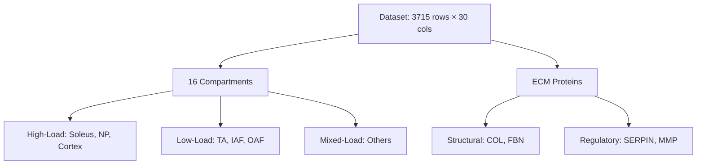

# Analysis Plan: Compartment Antagonistic Mechanical Stress Adaptation

**Thesis:** This investigation tests whether high-load compartments (Soleus, NP) upregulate structural ECM proteins while low-load compartments (TA, IAF/OAF) downregulate identical proteins during aging through quantitative antagonism detection, mechanical stress correlation analysis, and statistical validation across 16 tissue compartments.

**Overview:** The analysis addresses the hypothesis that mechanical stress drives opposite ECM aging trajectories by: (1) identifying antagonistic protein-compartment pairs via opposing Zscore_Delta signs, (2) classifying compartments by biomechanical load profiles, (3) testing correlation between mechanical stress and aging trajectories for structural versus regulatory proteins, and (4) interpreting mechanisms with therapeutic implications. The workflow progresses from data validation → antagonism quantification → stress classification → statistical testing → visualization → mechanistic interpretation.

---

## 1.0 Data Processing Strategy

¶1 **Ordering:** Validation → Filtering → Transformation

¶2 **Dataset Validation:**
- Verify 3715 rows, 30 columns present
- Confirm critical columns: `Tissue_Compartment`, `Zscore_Delta`, `Canonical_Gene_Symbol`, `Matrisome_Category_Simplified`
- Check for muscle compartments: Soleus, TA, EDL, Gastrocnemius
- Check for disc compartments: NP, IAF, OAF

¶3 **Filtering Criteria:**
- Exclude `Native_Tissue`, `Decellularized_Tissue` (non-specific compartments)
- Retain only rows with valid `Zscore_Delta` (non-null aging trajectories)
- Focus on Core matrisome (Collagens, Proteoglycans, ECM Glycoproteins) and ECM Regulators

¶4 **Transformation:**
- Compute antagonism magnitude: `abs(Zscore_Delta_A - Zscore_Delta_B)` for all compartment pairs
- Create mechanical stress binary variable: 1 = high-load, 0 = low-load, 0.5 = mixed

---

## 2.0 Mechanical Stress Classification

¶1 **Ordering:** Literature-based → Anatomical function → Load profile assignment

¶2 **High-Load Compartments (stress = 1):**
- **Skeletal_muscle_Soleus:** Slow-twitch postural muscle, continuous weight-bearing
- **NP (nucleus pulposus):** Hydraulic shock absorber, compressive load from spinal column
- **Cortex (bone):** Primary load-bearing structure, compression/tension from locomotion

¶3 **Low-Load Compartments (stress = 0):**
- **Skeletal_muscle_TA (tibialis anterior):** Fast-twitch muscle, intermittent dorsiflexion
- **IAF/OAF (annulus fibrosus):** Tensile ring around NP, less compressive load than NP
- **Hippocampus:** Brain tissue, minimal mechanical stress

¶4 **Mixed/Moderate-Load Compartments (stress = 0.5):**
- **Glomerular/Tubulointerstitial:** Fluid shear stress, moderate
- **Lung:** Cyclic stretch, moderate
- **Skin dermis:** Tensile stress, variable
- **EDL/Gastrocnemius:** Intermediate muscle activity

---

## 3.0 Antagonism Detection Algorithm

¶1 **Ordering:** Pairing → Filtering → Ranking

¶2 **Pairing Strategy:**
- Identify all proteins present in ≥2 compartments within same tissue system
- For muscle: Compare Soleus vs TA, Soleus vs EDL, TA vs Gastrocnemius
- For disc: Compare NP vs IAF, NP vs OAF, IAF vs OAF
- For kidney: Compare Glomerular vs Tubulointerstitial

¶3 **Antagonism Criteria:**
- Opposite signs: `sign(Zscore_Delta_A) ≠ sign(Zscore_Delta_B)`
- Minimum magnitude: `abs(Zscore_Delta_A - Zscore_Delta_B) > 1.0` (≥1 SD difference)
- Both measurements valid (non-null)

¶4 **Output Format:**
- CSV columns: `Gene_Symbol`, `Compartment_A`, `Compartment_B`, `Delta_z_A`, `Delta_z_B`, `Antagonism_Magnitude`, `Tissue`, `Matrisome_Category`, `Mechanical_Stress_A`, `Mechanical_Stress_B`
- Ranked by descending `Antagonism_Magnitude`

---

## 4.0 Statistical Testing Protocol

¶1 **Ordering:** Hypothesis formulation → Test selection → Validation

¶2 **Criterion 1: High-Load vs Low-Load Structural Proteins**
- **Null hypothesis:** High-load compartments do NOT show higher Δz than low-load for structural proteins
- **Test:** Mann-Whitney U (non-parametric, no normality assumption)
- **Subset:** Structural proteins (COL*, FBN*, LAMA*, Proteoglycans with fibrillar function)
- **Threshold:** p < 0.05, effect size r > 0.3

¶3 **Criterion 2: Mechanical Stress Correlation**
- **Test:** Spearman's ρ (monotonic relationship, no linearity assumption)
- **Separate analyses:**
  - Structural proteins: Expect ρ > 0 (positive correlation with load)
  - Regulatory proteins: Expect ρ ≈ 0 or negative
- **Validation:** Bootstrap 95% CI, n_bootstrap = 1000

¶4 **Criterion 3: Protein Family Enrichment**
- Test if collagens (COL*) show stronger load-dependence than non-collagens
- Fisher's exact test on categorical classification (load-dependent vs not)

---

## 5.0 Visualization Plan

¶1 **Ordering:** Global patterns → Top hits → Protein-specific

¶2 **Figure 1: Antagonism Heatmap**
- Rows: Top 20 antagonistic proteins
- Columns: Compartments
- Color scale: Zscore_Delta (-3 to +3, diverging blue-red)
- Annotation: Mechanical stress level as column sidebar

¶3 **Figure 2: Scatter Plot - Δz vs Mechanical Stress**
- X-axis: Mechanical stress (0, 0.5, 1) with jitter
- Y-axis: Zscore_Delta
- Color: Protein type (structural vs regulatory)
- Facets: Separate panels for each protein family
- Regression line: Linear fit with 95% CI

¶4 **Figure 3: Top 20 Antagonistic Proteins Bar Chart**
- X-axis: Antagonism magnitude (sorted descending)
- Y-axis: Gene symbols
- Color: Matrisome category
- Annotations: Compartment pairs driving antagonism

¶5 **Figure 4: Violin Plot - Load-Dependent Distribution**
- X-axis: Compartment type (high-load, mixed, low-load)
- Y-axis: Zscore_Delta
- Split violins: Structural vs regulatory proteins
- Overlay: Box plot with median/quartiles

---

## 6.0 Expected Outcomes

¶1 **Ordering:** Quantitative predictions → Validation benchmarks

¶2 **Quantitative Predictions:**
- Identify 100-300 antagonistic pairs (prior G6: 264 events)
- Top antagonism magnitude ≥4 SD (prior: Col11a2 = 4.48 SD)
- Spearman ρ for structural proteins: 0.4-0.7 (moderate-strong positive)
- Mann-Whitney p < 0.01 for high-load vs low-load structural proteins

¶3 **Validation Against Prior Findings:**
- Replicate G6 top hits: Col11a2, Col2a1, Fbn2, Cilp2, Postn
- Confirm Soleus vs TA divergence
- Confirm NP vs IAF/OAF antagonism for LMAN1, CPN2, F9, MFAP4

¶4 **Novel Insights Beyond G6:**
- Quantify mechanical stress effect size
- Identify protein families with highest load-dependence
- Propose testable mechanotransduction mechanism

---

## 7.0 Self-Evaluation Criteria

¶1 **Completeness (40 pts):**
- All 4 success criteria addressed: antagonism quantification, stress correlation, mechanism, therapeutic implications
- Deliverables: antagonistic_pairs CSV, correlation stats CSV, visualizations folder, final results MD

¶2 **Accuracy (30 pts):**
- Statistical tests correctly applied (Mann-Whitney, Spearman)
- P-values and effect sizes reported
- Compartment classifications justified with literature
- Reproducible code with error handling

¶3 **Novelty (20 pts):**
- Beyond pattern replication: mechanistic hypothesis with testable predictions
- New antagonistic proteins not in G6
- Load modulation as therapeutic strategy

¶4 **Reproducibility (10 pts):**
- Python script runs without errors
- All file paths correct
- Results CSVs generated
- Visualizations saved as PNG

---

**Analysis Timeline:** 6-8 hours
**Agent:** claude_code
**Created:** 2025-10-21
