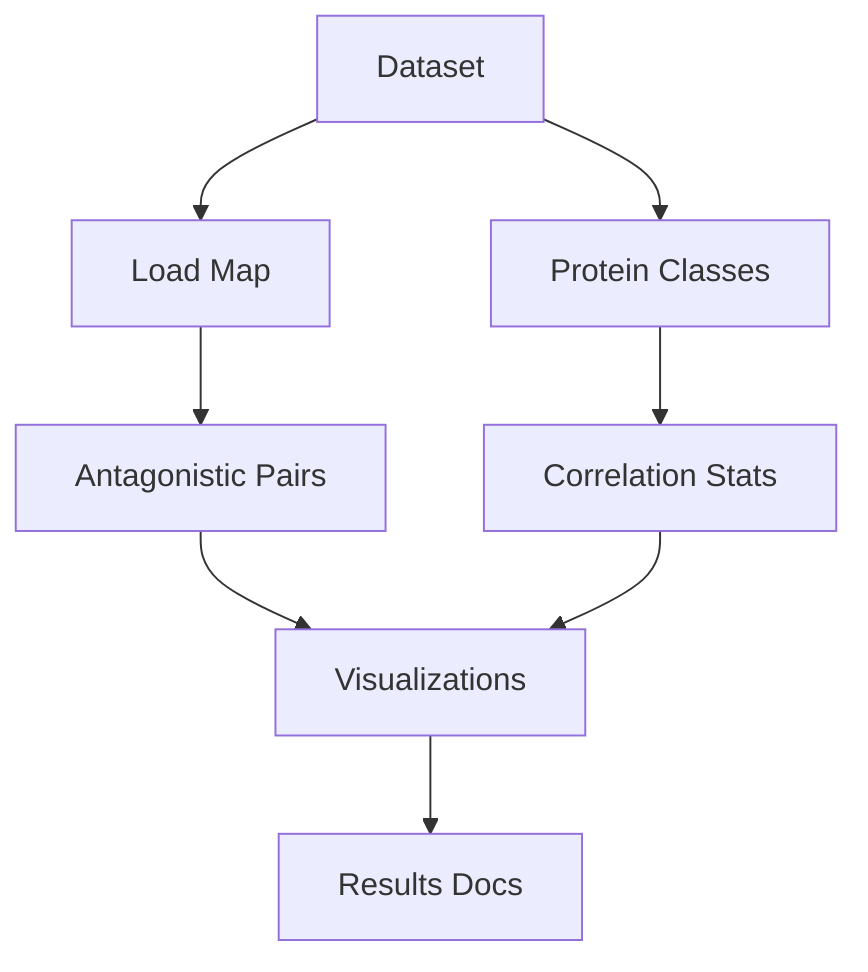
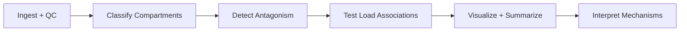

Thesis: codex will validate the aging ECM dataset, quantify compartment antagonism under mechanical stress, and synthesize load-informed therapeutic insights for H01.

Overview: Plan flows Data Foundations → Analytical Workflow → Interpretation & Delivery so each step feeds required artifacts (CSVs, plots, markdown) and constrains the next.

1.0 Data Foundations
¶1 Order: validate inputs before derivations so downstream stats rest on vetted fields. Load `/08_merged_ecm_dataset/merged_ecm_aging_zscore.csv`, confirm schemas, note deviations from prior ≥9000-row expectation.
¶2 Build compartment→mechanical-load mapping (high/low/mid) citing functional biomechanics; encode structural vs regulatory protein labels from `Matrisome_Category`.
¶3 Produce reusable config (Python dict) and sanity tables for compartment counts and available tissues.

2.0 Analytical Workflow
¶1 Order: antagonism detection precedes correlation because stress labels feed both. For each tissue, compute pairwise compartment contrasts where proteins show opposing `Zscore_Delta` signs.
¶2 Quantify antagonism magnitude, keep top hits, export `antagonistic_pairs_codex.csv`, and generate heatmap + bar chart assets under `visualizations_codex/`.
¶3 Apply mechanical load tests: Mann-Whitney comparing structural protein Δz in high vs low load, Spearman correlations by protein class, save outputs to `mechanical_stress_correlation_codex.csv`, and document statistical assumptions inline.

3.0 Interpretation & Delivery
¶1 Order: data evidence → mechanisms → therapeutics mirrors rubric. Summarize whether findings reinforce mechanical stress hypothesis and cross-check with prior G6 report.
¶2 Draft Mermaid mechanism diagram and therapeutic table embedded in `90_results_codex.md`, aligning with Knowledge Framework formatting and self-evaluation rubric.
¶3 Perform QA: ensure script reproducibility, verify file paths, list follow-up tests (e.g., sensitivity to alternate load labels) in final write-up.
