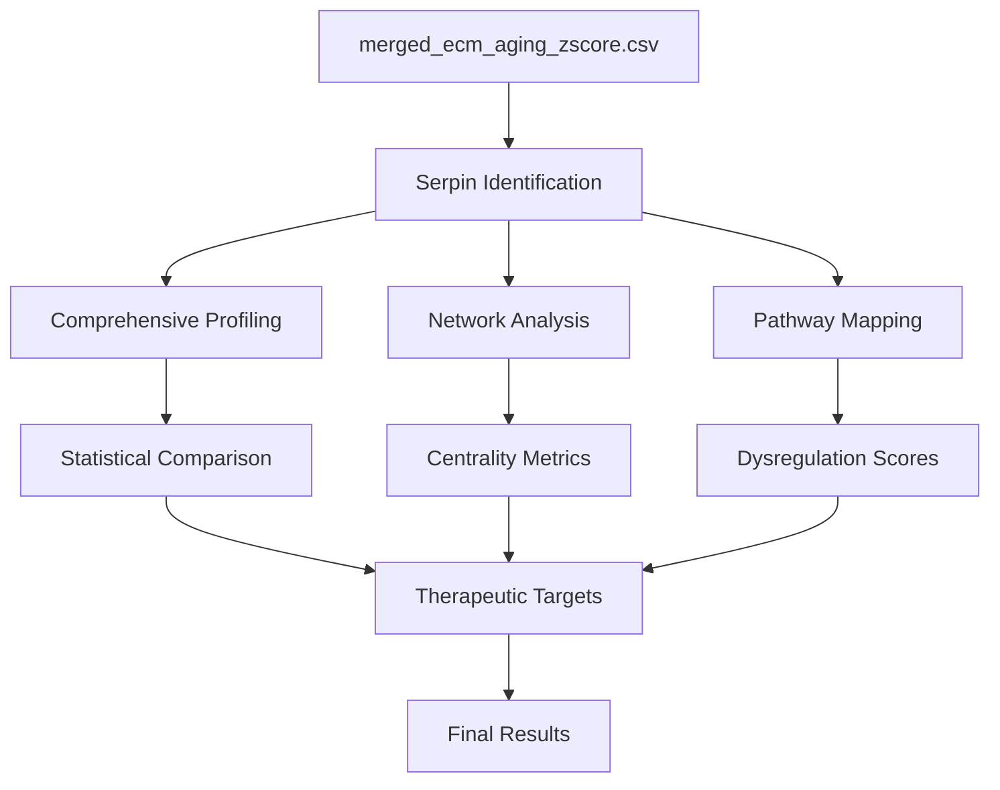

# Serpin Cascade Dysregulation Analysis Plan

**Thesis:** This analysis will systematically test whether serpin family dysregulation represents the central unifying mechanism of ECM aging by profiling all serpins (criterion 1), quantifying their network centrality (criterion 2), mapping multi-pathway involvement (criterion 3), and identifying therapeutic targets (criterion 4).

**Overview:** Serpins appear across all prior insights—entropy transitions (PZP, SERPINB2), weak signals (Serpina3m), universal markers (Serpinh1, Serpinf1), and coagulation cascades (SERPINC1)—suggesting they are not peripheral players but central hubs. This plan structures a four-phase analysis to test this hypothesis: (1.0) comprehensive serpin profiling from merged_ecm_aging_zscore.csv identifying all SERPIN* family members with aging trajectories, tissue breadth, and directional consistency; (2.0) protein correlation network construction to calculate degree/betweenness/eigenvector centrality metrics testing whether serpins exhibit higher centrality than non-serpins; (3.0) biological pathway mapping across coagulation, fibrinolysis, complement, ECM assembly, and inflammation to quantify multi-pathway participation; (4.0) therapeutic prioritization ranking serpins by centrality, pathway breadth, and druggability. Deliverables include Python analysis script, CSV outputs, network visualizations, and final report with self-evaluation against 100-point rubric.

---

## 1.0 Serpin Family Comprehensive Profiling (40 pts)

¶1 Ordering: Identification → Quantification → Classification → Statistical Testing

¶2 **Identification Strategy:** Extract all proteins matching pattern `SERPIN*|A2M|PZP` (case-insensitive) from Gene_Symbol and Canonical_Gene_Symbol columns. Expected: ≥10 serpins including PZP (entropy leader), SERPINB2 (PAI-2), Serpina3m (weak signal), SERPINH1 (collagen chaperone), SERPINC1 (antithrombin).

¶3 **Metrics per Serpin:**
- Mean Δz across all studies (aging trajectory magnitude/direction)
- Tissue breadth: Count unique Tissue_Compartment values
- Directional consistency: % of studies where Zscore_Delta has same sign as mean
- Entropy metrics: Extract Shannon/transition scores from prior analysis if available
- Study count: Number of Study_ID entries

¶4 **Functional Classification:** Group serpins into categories:
- Coagulation inhibitors: SERPINC1 (antithrombin), SERPINF2 (α2-antiplasmin)
- Fibrinolysis: SERPINB2 (PAI-2)
- Complement: SERPING1 (C1-inhibitor)
- ECM modulators: SERPINH1 (HSP47 collagen chaperone)
- Inflammation: SERPINA3 (α1-antichymotrypsin)
- Broad inhibitors: A2M, PZP (pan-protease inhibitors)

¶5 **Statistical Test:** Mann-Whitney U test comparing |Zscore_Delta| distributions between serpins vs non-serpins. Hypothesis: serpins show higher dysregulation magnitude. Report: median |Δz|_serpins, median |Δz|_others, U-statistic, p-value, effect size (rank-biserial correlation).

¶6 **Deliverable:** `serpin_comprehensive_profile_claude_code.csv` with columns: Gene_Symbol, Mean_Zscore_Delta, Tissue_Breadth, Directional_Consistency_Pct, Study_Count, Functional_Category, Entropy_Score (if available).

---

## 2.0 Network Centrality Analysis (30 pts)

¶1 Ordering: Network Construction → Centrality Calculation → Serpin Comparison → Hub Identification

¶2 **Network Construction:**
- Nodes: All proteins in dataset
- Edges: Spearman correlation of Zscore_Delta profiles across tissues
- Threshold: |ρ| > 0.5, p < 0.05 (Bonferroni correction for multiple testing)
- Implementation: Calculate pairwise correlations for proteins present in ≥3 tissues

¶3 **Centrality Metrics:**
- Degree centrality: Number of direct connections (local influence)
- Betweenness centrality: Fraction of shortest paths through node (bridging role)
- Eigenvector centrality: Connectivity to high-importance nodes (prestige)
- Calculate for ALL proteins, then extract serpin subset

¶4 **Hypothesis Test:** Two-sample t-test or Mann-Whitney U test comparing serpin centrality scores vs non-serpin scores for each metric. Expected: serpins have significantly higher centrality (p < 0.05). Report effect sizes (Cohen's d or rank-biserial).

¶5 **Hub Identification:** Define hubs as proteins in top 10% of ANY centrality metric. Count: (a) total hubs, (b) serpin hubs, (c) % serpins among hubs. Hypothesis: serpins overrepresented in hubs compared to baseline frequency.

¶6 **Deliverables:**
- `network_centrality_claude_code.csv`: Protein, Degree_Centrality, Betweenness_Centrality, Eigenvector_Centrality, Is_Serpin, Is_Hub
- Network graph (PNG): Nodes colored by serpin status (red=serpin, gray=other), sized by average centrality

---

## 3.0 Multi-Pathway Involvement (20 pts)

¶1 Ordering: Pathway Definition → Serpin-Pathway Mapping → Overlap Analysis → Dysregulation Ranking

¶2 **Pathway Definitions:**
- Coagulation cascade: F2, F9, F10, F12, SERPINC1, SERPINF2
- Fibrinolysis: PLG, PLAT, PLAU, SERPINB2, SERPINE1
- Complement system: C1QA/B/C, C3, C4A/B, SERPING1
- ECM assembly: Collagens (COL*), SERPINH1, P4HA*, PLOD*
- Inflammation: Cytokines (IL*, CCL*), SERPINA3, complement components

¶3 **Serpin-Pathway Matrix:** Binary matrix (serpins × pathways) indicating participation based on:
- Literature evidence (annotated functional roles)
- Network connectivity (serpin correlated with ≥2 pathway members, |ρ| > 0.5)
- Count pathways per serpin (multi-pathway serpins = participate in ≥2 pathways)

¶4 **Pathway Dysregulation Score:** For each pathway, calculate mean |Zscore_Delta| of all serpins assigned to that pathway. Rank pathways by serpin dysregulation severity. Compare to pathway dysregulation from non-serpin members (serpins driving change vs passengers).

¶5 **Overlap Quantification:** Create Venn diagram showing serpin overlap across top 3 pathways (coagulation, fibrinolysis, ECM assembly). Calculate Jaccard similarity coefficients for pathway pairs.

¶6 **Deliverables:**
- `pathway_dysregulation_claude_code.csv`: Pathway, Serpin_Count, Mean_Serpin_Zscore_Delta, Mean_NonSerpin_Zscore_Delta, Dysregulation_Rank
- Serpin-pathway matrix visualization (heatmap)
- Venn diagram (PNG) of pathway overlaps

---

## 4.0 Temporal and Therapeutic Implications (10 pts)

¶1 Ordering: Temporal Ordering Test → Druggability Assessment → Target Prioritization

¶2 **Temporal Ordering Hypothesis:** If serpins are DRIVERS (not consequences), their |Zscore_Delta| should exceed downstream targets. Test: For serpins with known pathway targets (e.g., SERPINC1 → thrombin, SERPINB2 → plasminogen activators), compare |Δz|_serpin vs mean |Δz|_targets. Report cases where serpin > targets.

¶3 **Druggability Assessment:** Identify serpins with existing drugs/inhibitors:
- SERPINC1: heparin (enhances antithrombin activity)
- SERPINE1: small molecule inhibitors (tiplaxtinin, PAI-039)
- SERPINH1: collagen synthesis modulators
- Mark serpins as druggable (yes/no/investigational)

¶4 **Target Prioritization Criteria:**
- Network centrality score (normalize to 0-1, average across 3 metrics)
- Multi-pathway score (number of pathways involved)
- Dysregulation magnitude (|mean Zscore_Delta|)
- Druggability bonus (+0.5 if druggable)
- Final score = (centrality + multi-pathway + |Δz|) × (1 + druggability_bonus)

¶5 **Top 3 Targets:** Rank all serpins by final score, select top 3. For each, provide:
- Rationale (centrality rank, pathway involvement, dysregulation direction)
- Predicted cascade effects (which pathways/proteins would be modulated)
- Therapeutic strategy (agonist vs antagonist)

¶6 **Deliverable:** Section in final report (90_results_claude_code.md) with target prioritization table and mechanistic rationale.

---

## 5.0 Implementation Details

¶1 **Python Script (`analysis_claude_code.py`):**
- Libraries: pandas, numpy, scipy.stats, networkx, matplotlib, seaborn, matplotlib_venn
- Functions: load_data(), identify_serpins(), calculate_centrality(), build_pathway_matrix(), prioritize_targets()
- Execution: Single script producing all CSV outputs and visualizations

¶2 **Visualization Standards:**
- Network graph: Force-directed layout, serpin nodes red (size by centrality), edges gray (thickness by correlation)
- Boxplot: Serpin vs non-serpin |Zscore_Delta| distributions with statistical annotation
- Heatmap: Serpin-pathway matrix with color intensity = participation strength
- Venn diagram: 3-way overlap of top pathways

¶3 **Quality Assurance:**
- Sanity checks: ≥10 serpins identified, PZP/SERPINC1/SERPINB2 present
- Statistical assumptions: Check normality (Shapiro-Wilk), use non-parametric tests if violated
- Multiple testing correction: Bonferroni for network edges, Benjamini-Hochberg for pathway enrichment

---

## 6.0 Success Metrics

¶1 **Hypothesis Confirmation Thresholds:**
- Strong (90-100 pts): Serpins have significantly higher centrality (p < 0.001, large effect), participate in ≥3 pathways, clear therapeutic targets
- Supported (70-89 pts): Serpins show elevated centrality (p < 0.05, medium effect), ≥2 pathway involvement
- Mixed (50-69 pts): Some serpins central, but inconsistent across metrics
- Not supported (<50 pts): No centrality difference or pathway specificity

¶2 **Expected Results (validation against prior insights):**
- PZP: Top entropy transition score → expect high betweenness centrality (bridging role)
- SERPINB2: High entropy transition → expect multi-pathway involvement (fibrinolysis + inflammation)
- Serpina3m: Top weak signal → expect tissue-specific centrality patterns
- SERPINC1: Coagulation upregulation → expect high degree centrality within coagulation network

---

## 7.0 Timeline

| Phase | Duration | Output |
|-------|----------|--------|
| 1. Serpin profiling | 2 hours | serpin_comprehensive_profile_claude_code.csv |
| 2. Network analysis | 2-3 hours | network_centrality_claude_code.csv, network graph |
| 3. Pathway mapping | 1-2 hours | pathway_dysregulation_claude_code.csv, heatmap, Venn |
| 4. Therapeutic prioritization | 1 hour | Target table in final report |
| 5. Visualization + writeup | 2-3 hours | All figures, 90_results_claude_code.md |
| **Total** | **9-12 hours** | Complete hypothesis evaluation |

---

**Agent:** claude_code
**Task ID:** H02_iteration_01
**Plan Created:** 2025-10-21
**Dataset:** /Users/Kravtsovd/projects/ecm-atlas/08_merged_ecm_dataset/merged_ecm_aging_zscore.csv
