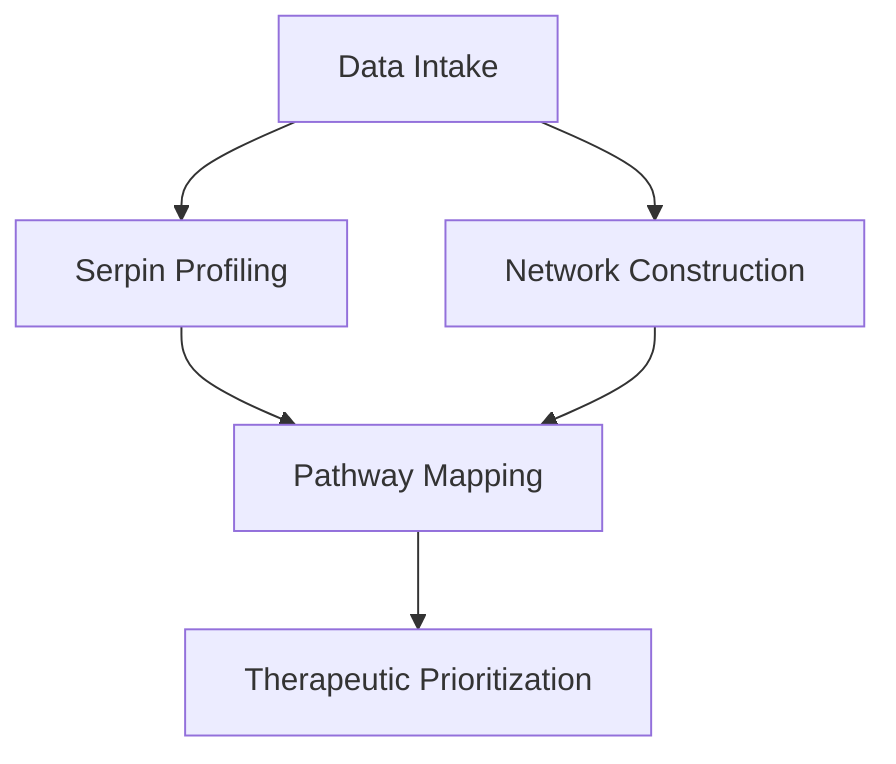

Thesis: codex will validate serpin cascade dysregulation as an aging hub by executing sequential modules for serpin profiling (1.0), network centrality (2.0), pathway integration (3.0), and therapeutic leverage (4.0).

Overview: The plan loads and cleans the merged ECM dataset, then quantifies serpin-specific dysregulation, constructs and tests correlation networks, maps serpins across coagulation–inflammation–ECM pathways, and finally synthesizes temporal plus therapeutic implications while producing all mandated artifacts.

1.0 Serpin Profiling Preparation
¶1 Ordering follows data readiness → metric computation → validation to keep dependencies linear.
¶2 Load dataset, enforce canonical gene symbol columns, and subset serpins via regex (SERPIN*, A2M, PZP) with sanity checks from task file.
¶3 Compute per-serpin metrics: mean Δz, tissue breadth (unique Tissue_Compartment), directional consistency (sign agreement across studies), entropy metrics if available, and build classification schema (coagulation, inflammation, ECM modulators).
¶4 Run Mann-Whitney U comparing |Δz| of serpins vs non-serpins and log summary statistics for results markdown.

2.0 Network Centrality Analysis
¶1 Sequence moves from correlation matrix creation to hypothesis testing to ensure reproducibility.
¶2 Compute tissue-level Δz correlations (Spearman) for all protein pairs, threshold |ρ|>0.5 with p<0.05, and build NetworkX graph.
¶3 Calculate degree, betweenness, eigenvector centralities for each node; export `network_centrality_codex.csv` with annotations (serpin flag, matrisome category).
¶4 Compare serpin vs non-serpin centralities using Mann-Whitney, identify top 10% hubs, and generate highlighted network visualization saved in `visualizations_codex/`.

3.0 Pathway and Cascade Mapping
¶1 Ordering covers pathway assignment first, then overlap, then dysregulation scoring.
¶2 Curate serpin-to-pathway dictionary (coagulation, fibrinolysis, complement, ECM assembly, inflammation) from provided insights plus literature notes.
¶3 Build serpin-pathway participation matrix, quantify pathway dysregulation via mean |Δz|, and analyze overlaps (set logic + Venn data) saved to `pathway_dysregulation_codex.csv`.
¶4 Evaluate multi-pathway participation counts per serpin to flag cascade connectors and prepare data for figures.

4.0 Temporal and Therapeutic Synthesis
¶1 Steps progress from temporal inference to intervention strategy for coherent storytelling.
¶2 Compare serpin Δz magnitudes vs downstream targets (coagulation factors, matrix proteases) using paired or grouped summaries to infer driver status.
¶3 Assess druggability via external knowledge (approved inhibitors/recombinant forms), rank top three serpin targets by combined centrality, pathway span, and intervention feasibility.
¶4 Draft final narrative in `90_results_codex.md` integrating figures, tables, and self-evaluation checklist.

Author Checklist
- [ ] Dataset schema confirmed
- [ ] Serpin regex validated (SERPIN, A2M, PZP)
- [ ] Statistical tests scripted
- [ ] Visualizations specified
- [ ] Deliverables mapped to outputs
