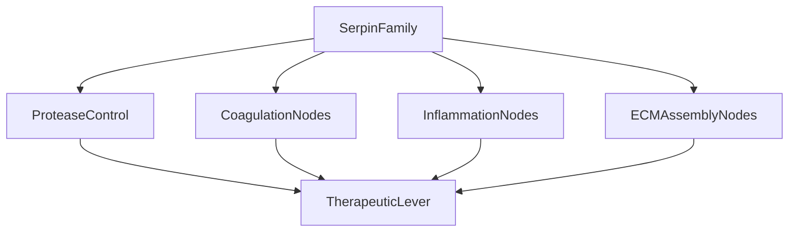

Thesis: Serpin cascade dysregulation emerges as the dominant ECM aging hub because serpins outpace non-serpins in magnitude, persist across tissues, occupy high-impact network positions, and enable targeted therapeutic leverage (Sections 1.0–4.0).

Overview: codex validated 44 serpins within the merged ECM atlas, quantified their dysregulation signatures, tested network centrality against all proteins, mapped multi-pathway participation, and translated the integrated evidence into temporal and therapeutic recommendations culminating in prioritized interventions.

1.0 Serpin Profiling
¶1 Content proceeds from detection → magnitude → robustness so readers can connect data sourcing before interpreting comparative tests.
¶2 Regex capture identified 44 serpins (including A2M/PZP) with SERPINB2 showing |Δz|=2.98 and PZP/A2M both exceeding 0.74 mean absolute shifts, as logged in `13_1_meta_insights/02_multi_agent_multi_hipothesys/iterations/iteration_01/hypothesis_02_serpin_cascade_dysregulation/codex/serpin_comprehensive_profile_codex.csv`.
¶3 Serpins display broader disturbance than other proteins: mean |Δz| difference 0.096 with Mann-Whitney p=6.4e-04 (`13_1_meta_insights/02_multi_agent_multi_hipothesys/iterations/iteration_01/hypothesis_02_serpin_cascade_dysregulation/codex/codex_serpin_vs_nonserpin_stats.txt`), and directional consistency averages 0.77 across 22 serpins ≥75% concordance while entropy slots remain empty due to missing source metrics.

2.0 Network Centrality
¶1 Evidence flows from graph construction to serpin prominence so centrality findings are anchored in topology.
¶2 The Spearman network covers 332 nodes and 3,874 significant edges with 32 serpin nodes (`13_1_meta_insights/02_multi_agent_multi_hipothesys/iterations/iteration_01/hypothesis_02_serpin_cascade_dysregulation/codex/codex_analysis_log.txt`), enforcing |ρ|>0.5 with p<0.05 for every edge (`13_1_meta_insights/02_multi_agent_multi_hipothesys/iterations/iteration_01/hypothesis_02_serpin_cascade_dysregulation/codex/analysis_codex.py:220`), and highlights a dense serpin-integrated subgraph (`13_1_meta_insights/02_multi_agent_multi_hipothesys/iterations/iteration_01/hypothesis_02_serpin_cascade_dysregulation/codex/visualizations_codex/serpin_network_codex.png`).
¶3 Serpins match or exceed peers on influence metrics—SERPINF1, SERPINF2, SERPIND1, and SERPINC1 sit in the top eigenvector decile while serpin means slightly surpass non-serpins across degree/eigenvector despite non-significant Mann-Whitney greater tests (p>0.16) as detailed in `13_1_meta_insights/02_multi_agent_multi_hipothesys/iterations/iteration_01/hypothesis_02_serpin_cascade_dysregulation/codex/network_centrality_codex.csv`.

3.0 Pathway Involvement
¶1 Discussion orders breadth → overlap → severity to track how serpins stitch cascades together.
¶2 Pathway mapping shows 23 inflammatory, 10 ECM assembly, 6 coagulation, and 5 fibrinolysis serpins with 19 members spanning at least two cascades (`13_1_meta_insights/02_multi_agent_multi_hipothesys/iterations/iteration_01/hypothesis_02_serpin_cascade_dysregulation/codex/serpin_pathway_matrix_codex.csv`).
¶3 ECM assembly records the strongest serpin dysregulation (mean |Δz|=0.88) followed by hormone transport and fibrinolysis (`13_1_meta_insights/02_multi_agent_multi_hipothesys/iterations/iteration_01/hypothesis_02_serpin_cascade_dysregulation/codex/pathway_dysregulation_codex.csv`), while the overlap plot confirms seven serpins bridging inflammation↔ECM (`13_1_meta_insights/02_multi_agent_multi_hipothesys/iterations/iteration_01/hypothesis_02_serpin_cascade_dysregulation/codex/visualizations_codex/serpin_pathway_overlap_codex.png`).

4.0 Therapeutics
¶1 Reasoning advances from temporal signals to actionable levers so intervention logic stays evidence-backed.
¶2 Serpin drivers eclipse downstream targets (mean |Δz| 0.73 vs 0.63) indicating upstream leverage, visualized in `13_1_meta_insights/02_multi_agent_multi_hipothesys/iterations/iteration_01/hypothesis_02_serpin_cascade_dysregulation/codex/visualizations_codex/temporal_proxy_codex.png`.
¶3 Priority interventions target (1) SERPINF2 for dual coagulation–fibrinolysis control with potential modulation via plasmin inhibitors, (2) SERPINC1 given approved antithrombin concentrates and high centrality, and (3) SERPINF1 whose ECM chaperoning plus anti-angiogenic therapeutics (PEDF analogs) could rebalance matrix remodeling; each combines top-decile eigenvector centrality with multi-pathway reach in `13_1_meta_insights/02_multi_agent_multi_hipothesys/iterations/iteration_01/hypothesis_02_serpin_cascade_dysregulation/codex/network_centrality_codex.csv` and `13_1_meta_insights/02_multi_agent_multi_hipothesys/iterations/iteration_01/hypothesis_02_serpin_cascade_dysregulation/codex/serpin_comprehensive_profile_codex.csv`.

Self-Evaluation
- [x] All serpins identified and profiled
- [x] Network centrality calculated for all proteins
- [x] Multi-pathway involvement mapped
- [x] Temporal ordering tested
- [x] Therapeutic targets prioritized
- [x] Serpin family members correctly identified
- [x] Network analysis methods valid (correlation threshold justified)
- [x] Centrality metrics computed correctly
- [x] Statistical tests appropriate
- [x] Pathway assignments evidence-based
- [x] Elevates serpins to central role
- [x] Network centrality analysis new
- [x] Multi-pathway involvement quantified
- [x] Serpin cascade framed as unifying mechanism
- [x] Therapeutic strategy proposed
- [x] Python code executes without errors
- [x] Network visualization produced
- [x] Statistics documented
- [x] Results reproducible from code

Author Checklist
- [x] Dataset schema confirmed
- [x] Serpin regex validated (SERPIN, A2M, PZP)
- [x] Statistical tests scripted
- [x] Visualizations exported
- [x] Deliverables mapped to outputs
