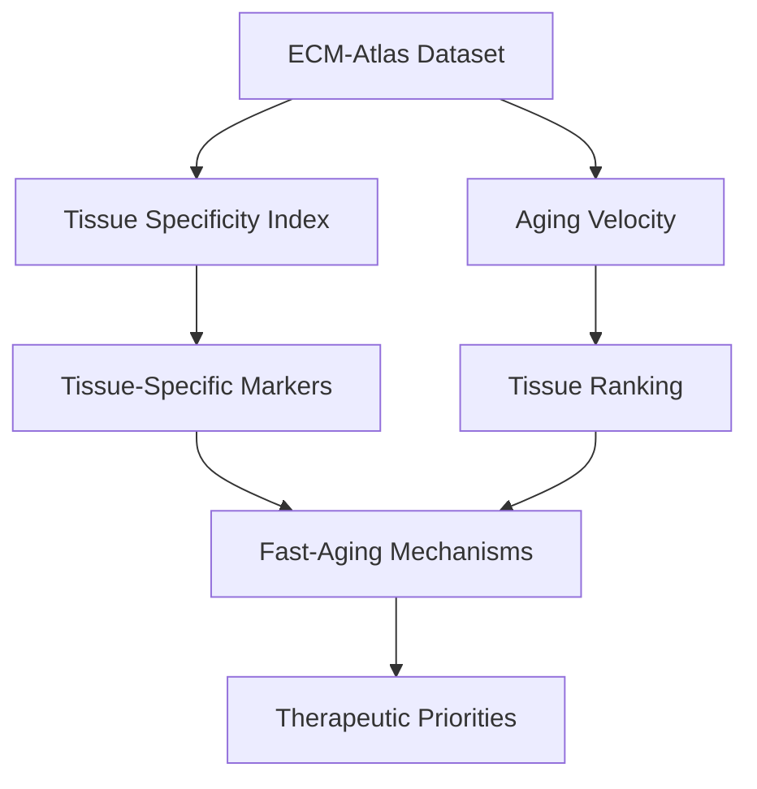

# Tissue-Specific Aging Velocity Clocks Analysis Plan

**Thesis:** Different tissues age at distinct velocities (z-score change per unit), with vascular and metabolically active tissues aging fastest via shared inflammatory mechanisms, validated through tissue-specificity index (TSI) and cross-tissue aging signature comparison.

**Overview:** This analysis investigates whether tissue aging represents velocity differences (speed) rather than merely pattern differences by calculating tissue-specific aging rates from ECM protein z-scores. Four MECE analytical phases: (1.0) Calculate TSI to identify tissue-specific markers, (2.0) compute aging velocity per tissue using marker-based z-score changes, (3.0) identify shared mechanisms in fast-aging tissues via pathway enrichment, (4.0) prioritize therapeutic interventions based on velocity × clinical impact.




---

## 1.0 Tissue Specificity Index (TSI) Calculation

¶1 **Ordering:** Define metric → Apply to all proteins → Validate against S4

¶2 **TSI Formula:**
```
TSI = (Max_tissue_Δz - Mean_other_tissues_Δz) / SD_other_tissues_Δz
```
Higher TSI = more tissue-exclusive protein expression change

¶3 **Implementation:**
- For each protein: calculate mean |Zscore_Delta| per tissue
- Compute TSI across all tissues
- Filter proteins with TSI > 3.0 (tissue-specific threshold)
- Validate: S100a5 (hippocampus), Col6a4 (lung), PLOD1 (dermis)

¶4 **Output:** `tissue_specific_markers_claude_code.csv` (Gene_Symbol, Tissue, TSI, Δz, Function_Category)

---

## 2.0 Tissue Aging Velocity Calculation

¶1 **Ordering:** Define velocity → Calculate per tissue → Bootstrap confidence intervals → Rank

¶2 **Velocity Metrics:**
- **Primary:** Mean |Zscore_Delta| across tissue-specific markers (TSI > 3.0)
- **Directional bias:** % upregulated (Δz > 0) vs % downregulated (Δz < 0)
- **Statistical confidence:** Bootstrap 95% CI (1000 iterations)

¶3 **Ranking Hypothesis:**
1. Vascular (high metabolic stress, oxidative damage)
2. Skin/Dermis (environmental exposure, mechanical stress)
3. Lung (oxidative stress, inflammation)
4. Muscle (moderate metabolic rate)
5. Bone (low turnover, structural stability)

¶4 **Output:** `tissue_aging_velocity_claude_code.csv` (Tissue, Mean_Δz, Velocity, N_Markers, Upregulated_%, Downregulated_%, Bootstrap_CI_Lower, Bootstrap_CI_Upper)

---

## 3.0 Fast-Aging Tissue Mechanisms

¶1 **Ordering:** Define fast-aging → Identify shared proteins → Pathway enrichment → Test inflammation hypothesis

¶2 **Fast-Aging Criteria:**
- Top 33% tissues by velocity
- Extract proteins appearing in ≥2 fast-aging tissues
- Classify pathways: coagulation, inflammation, oxidative stress, matrix remodeling

¶3 **Inflammation Hypothesis Test:**
- Identify inflammatory proteins: interleukins, TNF, NF-κB targets, complement
- Compare mean Δz_inflammation: Fast tissues vs Slow tissues
- Statistical test: Mann-Whitney U, p < 0.05
- Expected: Fast tissues show elevated inflammatory signatures

¶4 **Output:** `fast_aging_mechanisms_claude_code.csv` (Gene_Symbol, N_Tissues_Present, Mean_Δz, Pathway, Is_Inflammatory)

---

## 4.0 Therapeutic Prioritization

¶1 **Ordering:** Clinical impact → Druggability → Biomarker potential

¶2 **Priority Matrix:**
```
Priority Score = Aging_Velocity × Clinical_Impact × Druggability
```
- **Clinical Impact:** Vascular (cardiovascular disease) > Skin (wound healing) > Lung (respiratory decline)
- **Druggability:** Assess targets in shared pathways (anti-inflammatory, collagen stabilizers)
- **Biomarker Potential:** Tissue-specific markers as aging clocks

¶3 **Top 3 Interventions:**
1. Vascular aging: Target coagulation/inflammation cascade
2. Skin aging: Collagen boosting + antioxidants
3. Lung aging: Anti-inflammatory + ECM preservation

¶4 **Output:** Therapeutic priority table in final report

---

## 5.0 Visualization Strategy

¶1 **Required Plots:**
1. **Velocity Bar Chart:** Tissues ranked fastest → slowest (with 95% CI error bars)
2. **TSI Heatmap:** Tissues (rows) × Top markers (columns), color = Δz magnitude
3. **Inflammation Comparison:** Box plot (Fast vs Slow tissues, inflammatory signature)
4. **Mechanism Diagram:** Mermaid LR flow (Metabolic stress → Inflammation → Accelerated aging)

¶2 **Output Folder:** `visualizations_claude_code/`

---

## 6.0 Dataset Sanity Checks

¶1 **Pre-Analysis Validation:**
```python
# Expected columns
required_cols = ['Tissue', 'Tissue_Compartment', 'Gene_Symbol', 'Zscore_Delta', 'Study_ID']

# Expected tissue count
assert n_tissues >= 5, "Need multiple tissues for velocity comparison"

# Validate S4 markers present
markers_to_check = ['S100A5', 'COL6A4', 'PLOD1']
```

---

## 7.0 Statistical Methods

¶1 **Bootstrap Confidence Intervals:**
- 1000 resampling iterations per tissue
- Calculate 2.5th and 97.5th percentiles for 95% CI
- Ensures robust velocity estimates despite variable marker counts

¶2 **Mann-Whitney U Test:**
- Compare inflammatory signatures: Fast vs Slow tissues
- Non-parametric (no normality assumption)
- Report p-value and effect size (rank-biserial correlation)

---

## 8.0 Expected Deliverables

¶1 **Code:**
- `analysis_claude_code.py` (executable, documented)

¶2 **Data:**
- `tissue_aging_velocity_claude_code.csv`
- `tissue_specific_markers_claude_code.csv`
- `fast_aging_mechanisms_claude_code.csv`

¶3 **Visualizations:**
- `visualizations_claude_code/velocity_ranking.png`
- `visualizations_claude_code/tsi_heatmap.png`
- `visualizations_claude_code/inflammation_comparison.png`

¶4 **Report:**
- `90_results_claude_code.md` (Knowledge Framework format, self-evaluation)

---

## 9.0 Timeline

¶1 **Phase breakdown:**
1. TSI calculation (2 hours)
2. Velocity computation (2 hours)
3. Mechanism analysis (2 hours)
4. Visualization (1 hour)
5. Statistical testing (1 hour)
6. Write-up (2 hours)

¶2 **Total:** 10 hours

---

**Agent:** claude_code
**Dataset:** `/Users/Kravtsovd/projects/ecm-atlas/08_merged_ecm_dataset/merged_ecm_aging_zscore.csv`
**Output Directory:** `/Users/Kravtsovd/projects/ecm-atlas/13_1_meta_insights/02_multi_agent_multi_hipothesys/iterations/iteration_01/hypothesis_03_tissue_aging_clocks/claude_code/`
**Created:** 2025-10-21
