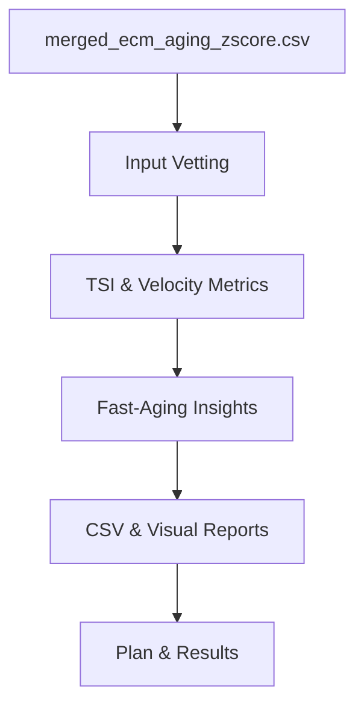

Thesis: codex will orchestrate data vetting, metric derivation, mechanistic synthesis, and communication to test tissue-specific aging velocity differences across ECM markers.

Overview: ¶1 This plan follows data validation, metric engineering, mechanistic exploration, and delivery packaging so that tissue velocities, markers, and interventions are resolved end-to-end. ¶2 Section 1.0 ensures inputs and definitions are trustworthy; Section 2.0 designs TSI and velocity computations; Section 3.0 targets fast-aging mechanism discovery; Section 4.0 sets documentation, visualization, and QA commitments.

1.0 Input Vetting
¶1 Ordering by data prerequisites → computation steps ensures downstream metrics rely on trusted structures. ¶2 Load dataset, confirm tissue identifiers, and replicate S4 marker presence (S100a5, Col6a4, PLOD1). ¶3 Profile missing ages to decide velocity proxy (mean |Δz|), and log assumption.

2.0 Metric Engineering
¶1 Ordering by metric dependency: TSI informs marker filtering before velocity estimation. ¶2 Compute TSI per gene using Zscore_Young/Old as appropriate, align with S4 thresholds, and classify function categories. ¶3 Derive tissue-specific Δz statistics, bootstrap confidence intervals, and velocity ranks using tissue-specific markers only.

3.0 Mechanism Discovery
¶1 Ordering fast-aging identification before mechanism tests keeps hypothesis alignment. ¶2 Flag top 33% tissues by velocity, extract shared proteins, evaluate inflammation signatures (Mann-Whitney), and perform pathway enrichment heuristics. ¶3 Summarize mechanistic pathways against metabolic-stress hypothesis with literature cues.

4.0 Visualization & Reporting
¶1 Ordering artifacts before documentation guarantees reproducible outputs feed narrative. ¶2 Generate CSVs, velocity charts, heatmaps, and Mermaid diagrams stored under codex visualizations. ¶3 Draft Knowledge Framework-compliant results with self-evaluation, including validation vs S4 and clinical prioritization.

Author Checklist
- [x] Dataset vetted and proxy decision recorded
- [x] TSI computation verified against S4 markers
- [x] Bootstrap, tests, and visualizations scripted
- [x] Documentation follows Knowledge Framework with diagrams
