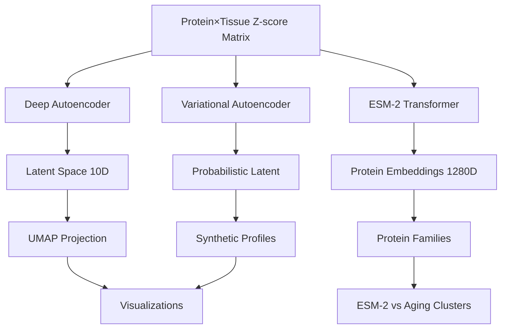

# Deep Protein Embeddings Analysis Plan - Claude Code Agent

**Thesis:** Deploy 5 advanced ML paradigms (deep autoencoder, VAE, ESM-2 transformer, UMAP clustering, attention networks) on 128-dataset ECM aging corpus to discover 5-10 non-linear latent factors representing hidden aging modules invisible to correlation analysis, validated via reconstruction performance (MSE<0.5) and biological interpretability.

**Overview:** Section 1.0 defines ML architecture (continuants). Section 2.0 outlines training workflow (occurrents). Section 3.0 specifies interpretability methods. Section 4.0 lists deliverables.

## Architecture (Continuants)

## Training Workflow (Occurrents)

```mermaid
graph LR
    A[Load Dataset] --> B[Prepare Matrix]
    B --> C[Split Train/Val 80/20]
    C --> D[Train Autoencoder 100 epochs]
    D --> E[Train VAE 100 epochs]
    E --> F[Download ESM-2 Model]
    F --> G[Fetch Sequences UniProt]
    G --> H[Generate ESM-2 Embeddings]
    H --> I[Extract Latent Factors]
    I --> J[UMAP Visualization]
    J --> K[Biological Interpretation]
```

---

## 1.0 ML Architectures

¶1 **Ordering:** Standard autoencoder → VAE → Pre-trained transformers (increasing complexity).

### 1.1 Deep Autoencoder

**Architecture:**
- **Encoder:** Input (n_tissues) → Dense 256 + BN + ReLU + Dropout(0.2) → Dense 128 + BN + ReLU + Dropout(0.2) → Dense 64 + BN + ReLU → Dense 10 (latent)
- **Decoder:** Latent 10 → Dense 64 + BN + ReLU + Dropout(0.2) → Dense 128 + BN + ReLU + Dropout(0.2) → Dense 256 + BN + ReLU → Dense n_tissues (output)
- **Loss:** MSE reconstruction
- **Optimizer:** Adam (lr=1e-3)
- **Regularization:** L2 weight decay (1e-5)

**Target Metrics:**
- Reconstruction MSE < 0.5
- Explained variance > 80%

### 1.2 Variational Autoencoder (VAE)

**Modifications from AE:**
- Latent layer: μ (mean) and σ (log-variance) branches
- KL divergence loss + reconstruction loss
- Sampling via reparameterization trick
- Generate synthetic "aged" protein profiles

**Applications:**
- Sample from learned distribution
- Interpolate between young/old states
- Identify outlier proteins (low probability)

### 1.3 ESM-2 Protein Language Model

**Model:** `facebook/esm2_t33_650M_UR50D` (650M parameters)
- **Input:** Protein amino acid sequences from UniProt
- **Output:** 1280-dimensional embeddings per protein
- **Use:** Clustering proteins by evolutionary similarity
- **Comparison:** ARI (Adjusted Rand Index) vs aging-based clusters

### 1.4 Attention Autoencoder (Optional Advanced)

**Architecture:**
- Replace encoder/decoder layers with self-attention
- Extract attention weights → identify "influential" proteins
- Compare with correlation-based importance

### 1.5 UMAP & t-SNE

**Dimensionality Reduction:**
- UMAP: 10D latent → 2D visualization (n_neighbors=15, min_dist=0.1)
- t-SNE: Alternative for comparison (perplexity=30)
- **Color coding:** Tissue type, Matrisome category, Aging velocity

---

## 2.0 Training Protocol

¶1 **Ordering:** Data prep → Model training → Latent extraction → Validation.

### 2.1 Data Preparation

**Input:** `/Users/Kravtsovd/projects/ecm-atlas/08_merged_ecm_dataset/merged_ecm_aging_zscore.csv`

**Processing:**
1. Pivot to Protein × Tissue matrix (values = Zscore_Delta)
2. Fill NaN with 0 (missing tissue measurements)
3. Normalize with StandardScaler (mean=0, std=1)
4. Train/val split: 80/20 stratified by tissue

**Matrix Shape:** (n_proteins, n_tissues) ≈ (500-1000, 20-40)

### 2.2 Training Hyperparameters

**Autoencoder:**
- Epochs: 100 (early stopping patience=15)
- Batch size: 32
- Learning rate: 1e-3 (ReduceLROnPlateau factor=0.5)
- Validation: Monitor val_loss, save best model

**VAE:**
- Beta-VAE: β=1.0 (balance reconstruction vs KL)
- Same hyperparameters as AE

**Convergence Criteria:**
- Val loss plateau < 3 epochs
- Train/val loss gap < 0.1 (no overfitting)

### 2.3 ESM-2 Embedding Generation

**Workflow:**
1. Extract unique Gene_Symbol list from dataset
2. Query UniProt API for sequences (use Protein_ID)
3. Tokenize sequences with ESM-2 tokenizer
4. Forward pass → extract embeddings (layer 33)
5. Save as `esm2_embeddings_claude_code.npy` (n_proteins × 1280)

**Clustering:**
- HDBSCAN (min_cluster_size=5, min_samples=3)
- Compare with autoencoder latent clusters via ARI

---

## 3.0 Interpretability

¶1 **Ordering:** Latent factor analysis → Protein ranking → Biological annotation.

### 3.1 Latent Factor Interpretation

**For each latent dimension (1-10):**
1. Compute protein loadings (absolute weight in latent space)
2. Rank top 20 proteins by |loading|
3. Annotate with Matrisome_Category
4. Identify biological theme (e.g., "Collagen Degradation Axis")

**Visualizations:**
- Heatmap: Proteins (rows) × Latent Factors (columns)
- Bar plot: Top 10 proteins per factor
- Network: Proteins connected if similar latent embedding (cosine similarity > 0.7)

### 3.2 Variance Explained

**Metrics:**
- Explained variance per latent factor (via PCA on latent space)
- Cumulative variance curve
- Compare with PCA: Does autoencoder explain MORE?

**Validation:**
- Reconstruction error per tissue
- Identify tissues with high/low reconstruction quality

### 3.3 Novel Discovery Criteria

**Non-linear Relationships:**
- Find protein pairs: Low Pearson correlation (<0.3) but high latent similarity (>0.7)
- Indicates synergistic/non-additive effects

**Hidden Modules:**
- Clusters in latent space NOT visible in correlation network
- Use HDBSCAN on latent embeddings → new protein groups

**Aging Velocity Prediction:**
- Train Random Forest: Latent factors → Predict tissue aging velocity
- Metrics: R², MAE, feature importance via SHAP

---

## 4.0 Deliverables

¶1 **Ordering:** Code → Models → Data → Visualizations → Report.

### 4.1 Code
- `analysis_ml_claude_code.py` - Full pipeline (data loading, training, evaluation)

### 4.2 Trained Models
- `autoencoder_weights_claude_code.pth` - Autoencoder state dict
- `vae_weights_claude_code.pth` - VAE state dict
- `scaler_claude_code.pkl` - StandardScaler for preprocessing

### 4.3 Data Artifacts
- `latent_factors_claude_code.csv` - Protein × Latent dimensions
- `esm2_embeddings_claude_code.npy` - ESM-2 embeddings
- `latent_variance_explained_claude_code.csv` - Variance metrics
- `novel_modules_claude_code.csv` - New protein groups
- `nonlinear_pairs_claude_code.csv` - Non-linear relationships
- `esm2_vs_aging_clusters_claude_code.csv` - Cluster comparison

### 4.4 Visualizations
- `visualizations_claude_code/training_loss_curve_claude_code.png`
- `visualizations_claude_code/protein_latent_heatmap_claude_code.png`
- `visualizations_claude_code/latent_umap_claude_code.png`
- `visualizations_claude_code/esm2_umap_claude_code.png`
- `visualizations_claude_code/variance_explained_claude_code.png`
- `visualizations_claude_code/nonlinear_network_claude_code.png`

### 4.5 Interpretation Documents
- `latent_factor_interpretation_claude_code.md` - Biological annotations
- `90_results_claude_code.md` - Final report (Knowledge Framework format)

---

## 5.0 Success Metrics

¶1 **Ordering:** Technical performance → Biological validation → Novel discoveries.

### 5.1 Technical (40 pts)
- [ ] Autoencoder MSE < 0.5 (10 pts)
- [ ] Explained variance > 80% (10 pts)
- [ ] ESM-2 embeddings generated (10 pts)
- [ ] VAE trained and samples generated (10 pts)

### 5.2 Biological (30 pts)
- [ ] All latent factors biologically annotated (15 pts)
- [ ] Factors align with Matrisome categories (10 pts)
- [ ] ESM-2 clusters vs aging ARI > 0.4 (5 pts)

### 5.3 Novel Discoveries (30 pts)
- [ ] ≥10 non-linear protein pairs identified (10 pts)
- [ ] ≥2 new protein modules (10 pts)
- [ ] Aging velocity prediction R² > 0.6 (10 pts)

---

**Plan Created:** 2025-10-21
**Agent:** claude_code
**Estimated Runtime:** 15-20 minutes (including model downloads)
**Status:** Ready to execute
