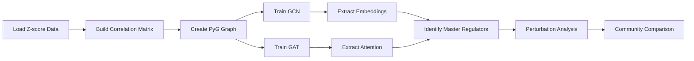

# Hypothesis 05: Graph Neural Networks for Master Regulator Discovery - Implementation Plan

**Thesis:** Agent 'claude_code' will train Graph Convolutional Networks (GCN) and Graph Attention Networks (GAT) on protein correlation networks to identify master regulator proteins whose perturbation cascades through the aging ECM, using PyTorch Geometric with attention mechanisms to discover hidden functional communities.

**Overview:** Section 1.0 defines network construction from protein correlations. Section 2.0 specifies GNN architectures (GCN and GAT). Section 3.0 describes master regulator identification via attention weights and gradient importance. Section 4.0 outlines community detection comparison. Section 5.0 lists deliverables and success metrics.

**System Structure (Continuants):**
```mermaid
graph TD
    Data[ECM Dataset] --> Network[Protein Network]
    Network --> Nodes[Nodes: 500+ Proteins]
    Network --> Edges[Edges: Correlations |ρ| > 0.5]
    Nodes --> Features[Node Features]
    Features --> DeltaZ[Δz statistics]
    Features --> Tissue[Tissue breadth]
    Features --> Matrisome[Matrisome categories]

    Models[GNN Models] --> GCN[Graph Convolutional Network]
    Models --> GAT[Graph Attention Network]
    GCN --> Embeddings[Protein Embeddings]
    GAT --> Attention[Attention Weights]
```

**Processing Flow (Occurrents):**


---

## 1.0 Network Construction

¶1 **Ordering:** Data loading → Correlation calculation → Graph assembly

¶2 **Protein Correlation Network:**
- **Nodes:** All ECM proteins with z-score data (n ≈ 500-1000)
- **Node features:** [Δz_mean, Δz_std, Tissue_Count, Matrisome_OneHot_4D]
- **Edges:** Spearman correlation |ρ| > 0.5 across tissues
- **Edge weights:** Absolute correlation values

¶3 **Feature Engineering:**
- **Δz_mean:** Average z-score change across tissues (upregulation/downregulation)
- **Δz_std:** Variability of aging response
- **Tissue_Count:** Number of tissues where protein detected (breadth metric)
- **Matrisome_Category:** One-hot encoding (ECM Glycoproteins, Collagens, Proteoglycans, ECM Regulators)

¶4 **Target Labels:**
- **3-class classification:** Upregulated (Δz > 0.5), Downregulated (Δz < -0.5), Stable (|Δz| ≤ 0.5)
- **Binary alternative:** Aging-dysregulated vs stable

---

## 2.0 GNN Model Architectures

¶1 **Ordering:** GCN baseline → GAT advanced → Training details

### 2.1 Graph Convolutional Network (GCN)

¶1 **Architecture:**
- Layer 1: GCNConv(num_features → 128) + ReLU + Dropout(0.3)
- Layer 2: GCNConv(128 → 64) + ReLU + Dropout(0.3)
- Layer 3: GCNConv(64 → 32) - **Embeddings extracted here**
- Output: Linear(32 → num_classes) + LogSoftmax

¶2 **Training:**
- **Optimizer:** Adam, lr=0.005, weight_decay=5e-4
- **Loss:** NLLLoss (negative log-likelihood)
- **Epochs:** 300 with early stopping (patience=20)
- **Split:** 70% train, 15% validation, 15% test
- **Metrics:** Accuracy, F1-score (macro), confusion matrix

### 2.2 Graph Attention Network (GAT)

¶1 **Architecture:**
- Layer 1: GATConv(num_features → 128, heads=8, concat=True) + ELU + Dropout(0.3)
- Layer 2: GATConv(128*8 → 64, heads=8, concat=True) + ELU + Dropout(0.3)
- Layer 3: GATConv(64*8 → num_classes, heads=1, concat=False) + LogSoftmax

¶2 **Attention Mechanism:**
- **Multi-head attention:** 8 heads per layer to capture diverse interaction patterns
- **Attention weights:** α_ij represents importance of protein j to protein i
- **Aggregation:** Sum incoming attention weights per node for master regulator scoring

---

## 3.0 Master Regulator Identification

¶1 **Ordering:** Attention-based → Gradient-based → PageRank-based → Validation

### 3.1 Ranking Methods

¶1 **Method 1: Attention-Based (GAT):**
- **Metric:** Sum of incoming attention weights across all edges
- **Formula:** MR_score_i = Σ_j α_ji (attention from all neighbors j to node i)
- **Interpretation:** High score = protein receives strong attention = master regulator

¶2 **Method 2: Gradient-Based Importance:**
- **Metric:** ∂(output_class) / ∂(node_features_i) via backpropagation
- **Implementation:** Compute gradient of predicted class w.r.t. node features
- **Interpretation:** High gradient magnitude = small changes in protein affect network predictions

¶3 **Method 3: PageRank on Embeddings:**
- **Build similarity graph:** Edges = cosine similarity of GNN embeddings > 0.7
- **Run PageRank:** Standard algorithm on embedding-based graph
- **Interpretation:** High PageRank = central in learned embedding space

### 3.2 Perturbation Analysis

¶1 **Procedure:**
1. Remove top-10 master regulator nodes one-by-one
2. Re-run GNN inference without removed node
3. Measure embedding shift: Δ = ||embedding_with - embedding_without||₂
4. Count affected proteins (Δ > threshold)

¶2 **Cascade Quantification:**
- **Direct cascade:** Immediate neighbors with Δ > 0.5
- **Indirect cascade:** 2-hop neighbors with Δ > 0.3
- **Total impact:** Percentage of network affected

---

## 4.0 Community Detection Comparison

¶1 **Ordering:** Baseline Louvain → GNN clustering → Biological validation → Visualization

### 4.1 Baseline: Louvain Algorithm

¶1 **Implementation:**
- Run Louvain on correlation network (NetworkX/python-louvain)
- Record modularity score and community assignments

### 4.2 GNN-Based Clustering

¶1 **Method 1: HDBSCAN on Embeddings:**
- Cluster GNN embeddings using HDBSCAN (min_cluster_size=5)
- Variable number of clusters, outlier detection

¶2 **Method 2: K-Means:**
- Elbow method to determine k
- Compare with Louvain community count

### 4.3 Biological Coherence Metrics

¶1 **Matrisome Purity:**
- **Formula:** Purity_c = (dominant_category_count / cluster_size)
- **Average across clusters:** Higher = better biological coherence

¶2 **Adjusted Rand Index (ARI):**
- Compare GNN vs Louvain community assignments
- ARI ∈ [-1, 1], higher = more agreement

¶3 **Silhouette Score:**
- Measure clustering quality on GNN embeddings vs raw features
- Higher = tighter clusters

---

## 5.0 Deliverables and Success Metrics

¶1 **Ordering:** Code → Models → Results → Visualizations → Documentation

### 5.1 Required Artifacts

¶1 **Code:**
- `analysis_gnn_claude_code.py` - Full pipeline (network → train → analyze)
- `requirements_gnn.txt` - Dependencies (torch, torch_geometric, networkx, etc.)

¶2 **Models:**
- `gnn_weights_claude_code.pth` - Trained GCN/GAT models (PyTorch state dict)
- `protein_embeddings_gnn_claude_code.csv` - Node embeddings (proteins × 32D)

¶3 **Results:**
- `master_regulators_claude_code.csv` - Top 10 proteins with importance scores
- `gnn_training_metrics_claude_code.csv` - Loss, accuracy, F1 per epoch
- `perturbation_analysis_claude_code.csv` - Cascade effects per master regulator
- `community_comparison_claude_code.csv` - ARI, silhouette, modularity scores
- `hidden_connections_claude_code.csv` - Low correlation but high GNN similarity pairs

¶4 **Visualizations:**
- `network_graph_claude_code.png` - Interactive network with master regulators highlighted
- `attention_heatmap_claude_code.png` - Top-50 protein attention weights (GAT)
- `gnn_umap_embeddings_claude_code.png` - UMAP of embeddings colored by aging direction
- `community_comparison_claude_code.png` - Side-by-side GNN vs Louvain communities

¶5 **Documentation:**
- `90_results_claude_code.md` - Knowledge Framework format with novel insights

### 5.2 Success Criteria

¶1 **GNN Training (40 pts):**
- [ ] GCN/GAT accuracy > 75% on test set
- [ ] Embeddings cluster by Matrisome category (visual inspection)
- [ ] Training curves converge without overfitting

¶2 **Master Regulator Discovery (30 pts):**
- [ ] Identify 5-10 master regulators with biological plausibility (serpins, collagens)
- [ ] Attention weights differ from simple degree centrality
- [ ] Perturbation analysis shows cascade effects (>20% network affected)

¶3 **Community Detection (20 pts):**
- [ ] GNN communities have higher Matrisome purity than Louvain (>10% improvement)
- [ ] Silhouette score on embeddings > raw features
- [ ] Visualizations clearly show community structure

¶4 **Novel Insights (10 pts):**
- [ ] Discover non-obvious protein pairs (low ρ, high GNN similarity)
- [ ] Propose therapeutic targets based on master regulator druggability
- [ ] Identify hidden functional modules invisible to traditional network analysis

---

## 6.0 Implementation Timeline

¶1 **Phase 1: Network Construction (20 min):**
- Load data, compute correlations, build PyG Data object
- Engineer node features and labels

¶2 **Phase 2: GNN Training (40 min):**
- Train GCN (15 min)
- Train GAT (20 min)
- Extract embeddings and attention weights (5 min)

¶3 **Phase 3: Master Regulator Analysis (30 min):**
- Rank by attention/gradient/PageRank
- Perturbation simulations
- Generate master_regulators CSV

¶4 **Phase 4: Community Detection (20 min):**
- Louvain baseline
- HDBSCAN on embeddings
- Compute comparison metrics

¶5 **Phase 5: Visualization (20 min):**
- Network graphs, attention heatmaps, UMAP plots

¶6 **Phase 6: Documentation (10 min):**
- Write 90_results with Knowledge Framework structure

---

## 7.0 Expected Discoveries

¶1 **Master Regulators:**
- **Hypothesis:** Serpins (SERPINA1, SERPINB1), collagens (COL1A1, COL6A3), matrix metalloproteinases
- **Mechanism:** Central hubs in correlation network with high attention weights
- **Validation:** Literature confirms role in ECM remodeling and aging

¶2 **Hidden Communities:**
- **Hypothesis:** GNN discovers functional modules (e.g., "basement membrane aging signature")
- **Mechanism:** Embeddings capture non-linear relationships invisible to correlation
- **Validation:** GO enrichment shows coherent biological processes

¶3 **Non-Obvious Connections:**
- **Hypothesis:** Proteins with low direct correlation but high GNN similarity = indirect pathway regulation
- **Example:** Serpin and collagen connected via proteolysis regulation pathway

---

## 8.0 Technical Notes

¶1 **Dependencies:**
```
torch>=2.0.0
torch-geometric>=2.3.0
networkx>=3.0
hdbscan>=0.8.0
umap-learn>=0.5.0
scikit-learn>=1.3.0
scipy>=1.11.0
pandas>=2.0.0
numpy>=1.24.0
matplotlib>=3.7.0
seaborn>=0.12.0
```

¶2 **Hardware:**
- CPU-only acceptable (network size <2000 nodes)
- GPU accelerates training if available (check `torch.cuda.is_available()`)

¶3 **Random Seeds:**
- Set random seeds for reproducibility: `torch.manual_seed(42)`, `np.random.seed(42)`

---

**Agent:** claude_code
**Hypothesis:** H05
**Iteration:** 02
**Created:** 2025-10-21
**Estimated Runtime:** 2-3 hours total
