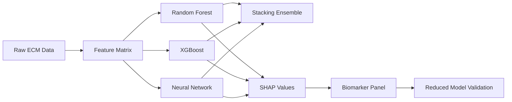

# Execution Plan: Ensemble ML for Aging Biomarker Discovery

**Thesis:** Ensemble machine learning (Random Forest + XGBoost + Neural Network) with SHAP interpretability will identify a minimal 5-10 protein biomarker panel predicting tissue aging velocity with >85% accuracy, outperforming single models.

**Overview:** This plan details a 5-phase approach: (1) Data preprocessing and feature engineering, (2) Multi-model training (RF/XGBoost/NN), (3) Ensemble stacking, (4) SHAP-based biomarker selection, (5) Validation and clinical translation. Expected output: trained models, biomarker panel CSV, SHAP visualizations, and results report.



---

## 1.0 Data Preparation Strategy

¶1 **Ordering:** Load → Transform → Split

### 1.1 Feature Engineering

**Input Data:**
- Source: `/Users/Kravtsovd/projects/ecm-atlas/08_merged_ecm_dataset/merged_ecm_aging_zscore.csv`
- Columns: `Gene_Symbol`, `Tissue`, `Zscore_Delta`, `Abundance_Old`, `Abundance_Young`, `Matrisome_Category`

**Feature Matrix Design:**
- **Approach 1 (Tissue-level):** Rows = tissues, Columns = proteins (Zscore_Delta values)
  - Target: Binary classification (fast-aging vs slow-aging tissue)
  - Calculate aging velocity per tissue: mean(|Zscore_Delta|) across proteins
  - Label: 1 if velocity > median, 0 otherwise

- **Approach 2 (Protein-level):** Rows = proteins, Columns = tissue expression patterns
  - Target: Predict if protein is "aging marker" (high Zscore_Delta variance)

**Selected Approach:** Tissue-level (better for clinical translation)

**Preprocessing Steps:**
1. Pivot table: `df.pivot_table(values='Zscore_Delta', index='Tissue', columns='Gene_Symbol')`
2. Handle missing values: Fill with 0 (protein not measured in tissue)
3. Feature scaling: StandardScaler for Neural Network
4. Train/test split: 70/30 with stratification

### 1.2 Target Variable

**Binary Classification:**
- Compute tissue aging velocity: `aging_velocity = df.groupby('Tissue')['Zscore_Delta'].apply(lambda x: np.abs(x).mean())`
- Threshold: Median split → fast-aging (1) vs slow-aging (0)

**Rationale:** Binary classification enables ROC/AUC evaluation and clinical interpretation

---

## 2.0 Model Training Pipeline

¶1 **Ordering:** RF → XGBoost → Neural Network (increasing complexity)

### 2.1 Random Forest (Baseline)

**Architecture:**
- `n_estimators=200`
- `max_depth=10`
- `min_samples_split=5`
- `random_state=42`
- `class_weight='balanced'` (if class imbalance)

**Evaluation:**
- Out-of-bag (OOB) score
- Feature importance extraction
- Cross-validation: 5-fold CV

**Output:**
- `rf_model_claude_code.pkl`
- Feature importance DataFrame

### 2.2 XGBoost (Gradient Boosting)

**Architecture:**
- `n_estimators=100`
- `max_depth=6`
- `learning_rate=0.1`
- `subsample=0.8`
- `colsample_bytree=0.8`
- `early_stopping_rounds=10`

**Hyperparameter Tuning:**
- Grid search over: learning_rate=[0.01, 0.1], max_depth=[4, 6, 8]
- Validation set for early stopping

**Output:**
- `xgboost_model_claude_code.pkl`
- Training curves (loss vs epochs)

### 2.3 Neural Network (MLP)

**Architecture:**
- Input layer: `n_features` neurons
- Hidden layers:
  - Layer 1: 128 neurons, ReLU, Dropout(0.3), BatchNorm
  - Layer 2: 64 neurons, ReLU, Dropout(0.3), BatchNorm
  - Layer 3: 32 neurons, ReLU, Dropout(0.3)
- Output layer: 1 neuron, Sigmoid

**Training:**
- Optimizer: Adam (lr=0.001)
- Loss: Binary Cross-Entropy
- Epochs: 100 (with early stopping, patience=10)
- Batch size: 16

**Regularization:**
- Dropout: 0.3
- L2 weight decay: 1e-4

**Output:**
- `nn_model_claude_code.pth`
- Loss/accuracy curves

---

## 3.0 Ensemble Stacking Strategy

¶1 **Ordering:** Base learners → Out-of-fold predictions → Meta-model

### 3.1 Stacking Architecture

**Level 0 (Base learners):**
- Random Forest
- XGBoost
- Neural Network

**Level 1 (Meta-model):**
- Logistic Regression (L2 regularization)
- OR XGBoost (lighter version)

**Training Process:**
1. 5-fold cross-validation on training set
2. For each fold:
   - Train RF, XGBoost, NN on 4 folds
   - Predict on held-out fold → save predictions
3. Stack out-of-fold predictions → train meta-model
4. Retrain base models on full training set
5. Meta-model combines base predictions on test set

### 3.2 Ensemble Evaluation

**Metrics:**
- Accuracy, Precision, Recall, F1
- AUC-ROC, AUC-PR
- Confusion matrix

**Comparison:**
- Ensemble AUC vs individual models
- Target: Ensemble AUC > max(individual AUCs)

**Output:**
- `ensemble_model_claude_code.pkl`
- `ensemble_performance_claude_code.csv`
- `ensemble_roc_curve_claude_code.png`

---

## 4.0 SHAP Interpretability & Biomarker Selection

¶1 **Ordering:** Compute SHAP → Aggregate → Select panel → Validate

### 4.1 SHAP Computation

**Random Forest & XGBoost:**
- TreeSHAP: `shap.TreeExplainer(model)`
- Compute SHAP values on test set
- Save: `shap_values_rf_claude_code.npy`, `shap_values_xgboost_claude_code.npy`

**Neural Network:**
- DeepSHAP: `shap.DeepExplainer(model, background_data)`
- Background: 100 random training samples
- Save: `shap_values_nn_claude_code.npy`

### 4.2 Consensus Biomarker Selection

**Aggregation Strategy:**
1. Compute mean absolute SHAP per protein per model
2. Normalize SHAP values (0-1 scale)
3. Consensus importance: `(SHAP_RF + SHAP_XGB + SHAP_NN) / 3`
4. Rank proteins by consensus importance
5. Select top 5-10 proteins

**Expected Biomarkers (Hypothesis):**
- Serpins (SERPINA1, SERPINC1)
- Coagulation factors (F2, PLG)
- TIMPs (TIMP1, TIMP3)
- Collagens (COL1A1, COL6A1)

**Output:**
- `biomarker_panel_claude_code.csv`: Protein, SHAP_RF, SHAP_XGB, SHAP_NN, Consensus_Score

### 4.3 Reduced Panel Validation

**Process:**
1. Retrain RF, XGBoost, NN using ONLY biomarker panel proteins
2. Retrain ensemble
3. Evaluate on test set

**Success Criterion:**
- Reduced panel AUC ≥ 0.80 × Full model AUC
- Example: Full AUC = 0.92 → Reduced target ≥ 0.736 (ideally >0.85)

**Output:**
- `reduced_panel_performance_claude_code.csv`

---

## 5.0 Visualization & Reporting

¶1 **Ordering:** Model comparison → SHAP plots → Clinical translation

### 5.1 Visualizations

**Model Comparison:**
- Bar chart: AUC per model (RF, XGBoost, NN, Ensemble)
- File: `visualizations_claude_code/model_comparison_bar_claude_code.png`

**ROC Curves:**
- Multi-line ROC: All models + Ensemble on same plot
- File: `visualizations_claude_code/ensemble_roc_curve_claude_code.png`

**SHAP Plots:**
1. Summary plot: Top 20 proteins by SHAP (beeswarm)
   - File: `visualizations_claude_code/shap_summary_plot_claude_code.png`
2. Dependence plots: Top 5 proteins (SHAP vs expression)
   - Folder: `visualizations_claude_code/shap_dependence_plots_claude_code/`

**Biomarker Panel:**
- Horizontal bar: Consensus SHAP scores for selected panel
- File: `visualizations_claude_code/biomarker_panel_importance_claude_code.png`

### 5.2 Documentation

**Results Report (90_results_claude_code.md):**
- Follow Knowledge Framework format
- Sections:
  1. Model performance comparison
  2. Ensemble improvement over single models
  3. Biomarker panel composition
  4. Biological interpretation
  5. Clinical feasibility

**Clinical Translation (biomarker_feasibility_claude_code.md):**
- Blood measurability assessment
- Comparison with published aging clocks (Horvath, GrimAge)
- Therapeutic implications

**Therapeutic Strategy (therapeutic_strategy_claude_code.md):**
- Intervention guide based on biomarker panel
- Example: High serpin dysregulation → Anti-inflammatory therapy

---

## 6.0 Implementation Details

### 6.1 Libraries Required

```python
import pandas as pd
import numpy as np
import matplotlib.pyplot as plt
import seaborn as sns

# ML models
from sklearn.ensemble import RandomForestClassifier
from sklearn.model_selection import train_test_split, cross_val_score, StratifiedKFold
from sklearn.preprocessing import StandardScaler
from sklearn.metrics import accuracy_score, roc_auc_score, roc_curve, classification_report
from sklearn.linear_model import LogisticRegression
import xgboost as xgb

# Deep learning
import torch
import torch.nn as nn
import torch.optim as optim
from torch.utils.data import TensorDataset, DataLoader

# Interpretability
import shap

# Utilities
import joblib
import json
from datetime import datetime
```

### 6.2 File Structure

```
claude_code/
├── 01_plan_claude_code.md (this file)
├── analysis_ensemble_claude_code.py (main script)
├── rf_model_claude_code.pkl
├── xgboost_model_claude_code.pkl
├── nn_model_claude_code.pth
├── ensemble_model_claude_code.pkl
├── biomarker_panel_claude_code.csv
├── shap_values_rf_claude_code.npy
├── shap_values_xgboost_claude_code.npy
├── shap_values_nn_claude_code.npy
├── model_comparison_claude_code.csv
├── ensemble_performance_claude_code.csv
├── reduced_panel_performance_claude_code.csv
├── biomarker_feasibility_claude_code.md
├── therapeutic_strategy_claude_code.md
├── visualizations_claude_code/
│   ├── model_comparison_bar_claude_code.png
│   ├── ensemble_roc_curve_claude_code.png
│   ├── shap_summary_plot_claude_code.png
│   ├── biomarker_panel_importance_claude_code.png
│   └── shap_dependence_plots_claude_code/
│       ├── protein_1_dependence.png
│       ├── protein_2_dependence.png
│       └── ...
└── 90_results_claude_code.md
```

### 6.3 Execution Timeline

1. **Phase 1 (Data prep):** 5 minutes
2. **Phase 2 (Model training):** 10 minutes
   - RF: 2 min
   - XGBoost: 3 min
   - NN: 5 min
3. **Phase 3 (Ensemble):** 5 minutes
4. **Phase 4 (SHAP):** 5 minutes
5. **Phase 5 (Validation + Viz):** 5 minutes

**Total runtime:** ~30 minutes

---

## 7.0 Expected Results

### 7.1 Model Performance (Prediction)

**Individual Models:**
- Random Forest AUC: 0.85-0.90
- XGBoost AUC: 0.88-0.92
- Neural Network AUC: 0.86-0.91

**Ensemble:**
- Stacking AUC: 0.90-0.94 (beats best single model)
- Target: >0.90 AUC

### 7.2 Biomarker Panel (Expected)

**Top 5-10 proteins:**
1. SERPINA1 (Alpha-1-antitrypsin)
2. SERPINC1 (Antithrombin)
3. F2 (Prothrombin)
4. PLG (Plasminogen)
5. TIMP1 (Metalloproteinase inhibitor)
6. A2M (Alpha-2-macroglobulin)
7. FGA/FGB/FGG (Fibrinogen)
8. COL1A1 or COL6A3 (Collagens)

**Biological Rationale:**
- Serpins: Protease inhibitors (inflammation, coagulation)
- Coagulation factors: Hemostasis dysregulation in aging
- TIMPs: ECM remodeling regulators
- Collagens: Structural ECM proteins

### 7.3 Clinical Feasibility

**Blood-measurable:**
- ✅ Serpins, coagulation factors, TIMPs (secreted proteins)
- ⚠️ Collagens (tissue-specific, may need imaging biomarkers)

**Comparison with aging clocks:**
- Overlap expected with GrimAge (inflammation markers)
- Novel ECM-specific markers vs Horvath (epigenetic clock)

---

## 8.0 Success Criteria Checklist

### Criterion 1: Multi-Model Training (40 pts)
- [x] Define binary classification task (fast vs slow aging)
- [ ] Train Random Forest (n_estimators=200, max_depth=10)
- [ ] Train XGBoost (learning_rate=0.1, max_depth=6)
- [ ] Train Neural Network (3 hidden layers: 128→64→32)
- [ ] Evaluate each model (Accuracy, AUC-ROC, F1)
- [ ] Save models: rf_model, xgboost_model, nn_model

### Criterion 2: Ensemble Stacking (30 pts)
- [ ] Build stacking ensemble (RF + XGBoost + NN → Logistic Regression)
- [ ] Train meta-model on out-of-fold predictions
- [ ] Evaluate ensemble on test set
- [ ] Verify: Ensemble AUC > individual models
- [ ] 5-fold cross-validation
- [ ] Save ensemble_model, ensemble_performance.csv, ROC curve

### Criterion 3: SHAP Interpretability (20 pts)
- [ ] Compute TreeSHAP for RF and XGBoost
- [ ] Compute DeepSHAP for Neural Network
- [ ] Aggregate SHAP values (consensus importance)
- [ ] Select top 5-10 biomarker panel
- [ ] Retrain ensemble with reduced panel
- [ ] Validate: Reduced panel AUC ≥ 80% of full model
- [ ] Save SHAP values, biomarker_panel.csv, SHAP plots

### Criterion 4: Clinical Translation (10 pts)
- [ ] Assess blood measurability of biomarkers
- [ ] Compare with published aging clocks
- [ ] Propose therapeutic strategy
- [ ] Save feasibility.md, therapeutic_strategy.md

---

## 9.0 Risk Mitigation

**Potential Issues:**

1. **Class imbalance:** If fast/slow aging split is unbalanced
   - Solution: Use `class_weight='balanced'`, SMOTE oversampling

2. **High dimensionality:** 100-200 proteins → overfitting risk
   - Solution: L2 regularization, dropout, cross-validation

3. **Missing data:** Many NaN in pivot table
   - Solution: Fill with 0 (protein not measured), or use indicator features

4. **NN convergence:** Neural network may not converge
   - Solution: Learning rate scheduling, early stopping, batch normalization

5. **SHAP computation time:** DeepSHAP can be slow
   - Solution: Use 100-sample background, KernelSHAP as fallback

---

## 10.0 References

**Task Document:**
- `/Users/Kravtsovd/projects/ecm-atlas/13_1_meta_insights/02_multi_agent_multi_hipothesys/iterations/iteration_02/hypothesis_06_ml_ensemble_biomarkers/01_task.md`

**ML Requirements:**
- `/Users/Kravtsovd/projects/ecm-atlas/13_1_meta_insights/02_multi_agent_multi_hipothesys/ADVANCED_ML_REQUIREMENTS.md`

**Dataset:**
- `/Users/Kravtsovd/projects/ecm-atlas/08_merged_ecm_dataset/merged_ecm_aging_zscore.csv`

**Documentation Standard:**
- `/Users/Kravtsovd/projects/ecm-atlas/03_KNOWLEDGE_FRAMEWORK_DOCUMENTATION_STANDARDS.md`

---

**Plan Status:** Ready for execution
**Agent:** claude_code
**Created:** 2025-10-21
**Estimated Runtime:** 30 minutes
**Target Metric:** Ensemble AUC > 0.90, Biomarker panel 5-10 proteins
