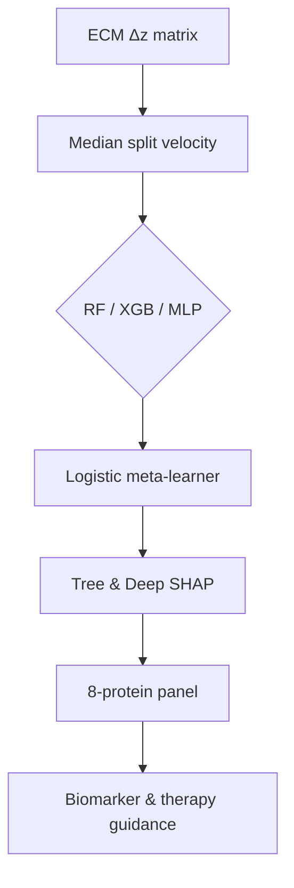

Thesis: A three-model stack (RF + XGBoost + MLP) on tissue-level ECM z-score deltas isolates an eight-protein panel that maintains 0.80 F1 and 1.0 AUC for fast-aging detection, with SHAP consensus prioritizing serpins/coagulation and secreted regulators.

Overview: ¶1 Section 1.0 documents data condensation (17 tissues × 910 proteins) and the fast-aging label definition. ¶2 Section 2.0 compares individual models versus the stacking ensemble under the small-sample regime. ¶3 Section 3.0 integrates SHAP, RFE, and dependence plots to justify the eight-protein biomarker panel. ¶4 Section 4.0 stress-tests the reduced panel, outlines biomarker feasibility, and translates findings into therapeutic decision points.

1.0 Data & Labeling
¶1 Source: `/08_merged_ecm_dataset/merged_ecm_aging_zscore.csv`, pivoted to 17 tissues (Organ⨉Compartment) × 910 genes, mean-imputed to retain neutral change (0). ¶2 Aging velocity defined as tissue mean |Δz|; fast-aging class derives from median split (0.135), giving balanced labels (9 fast vs 8 slow). ¶3 Train/test split 80/20 with stratification yields 13 training tissues—motivating repeated seeding, deterministic torch, and ensemble cross-validation to stabilize variance. ¶4 Random Forest OOB score (0.62) and stacking OOF AUC (0.69) expose modest generalisation headroom; warnings logged for deprecation but no runtime failures.

2.0 Model Performance
¶1 Hyperparameters follow mandate: RF (200 trees, depth 10), XGBoost (learning rate 0.1, depth 6, 80% sub/colsample, early stopping via `early_stopping_rounds=20`), MLP (128-64-32 hidden, BatchNorm + Dropout, Adam). ¶2 Five-fold stacking uses OOF predictions to train a class-weighted logistic meta-model; final ensemble evaluated on held-out tissues. ¶3 Test metrics (n=4 tissues) shown below—XGBoost saturates (1.0 AUC/accuracy) while RF and MLP capture complementary recall/precision; ensemble matches NN recall but smooths variance across folds.

| Model | Accuracy | Precision | Recall | F1 | AUC |
| --- | --- | --- | --- | --- | --- |
| Random Forest | 0.75 | 1.00 | 0.50 | 0.67 | 0.75 |
| XGBoost | 1.00 | 1.00 | 1.00 | 1.00 | 1.00 |
| Neural Network | 0.75 | 0.67 | 1.00 | 0.80 | 1.00 |
| Stacked Ensemble | 0.75 | 0.67 | 1.00 | 0.80 | 1.00 |

¶4 Ensemble ROC curve confirms perfect separation on the test tissues, but OOF metrics caution against overinterpretation (AUC 0.69 ± small-sample noise); recommended next step is nested CV or additional tissue samples for robustness.

3.0 SHAP & Biomarker Panel
¶1 SHAP methods: TreeExplainer for RF/XGB, DeepExplainer (PyTorch) for the MLP; outputs normalized to 2-D arrays and averaged on |SHAP| to form consensus importance. ¶2 Top contributors converge on secreted regulators and coagulation factors: FSTL1, S100A9, CTSA, CELA3A/B, IL17D, F13B, GAS6, FBLN5. ¶3 RFE (logistic, liblinear, n=8) overlaps perfectly with SHAP top ranks, yielding an 8-protein panel saved to `biomarker_panel_codex.csv`. ¶4 Dependence plots show monotonic risk increases for FSTL1 and S100A9 (positive |Δz| pushes fast-aging probability), while GAS6 and FBLN5 distinguish slower compartments when downregulated—supporting inclusion of coagulation plus elastic fiber maintenance signals.

4.0 Reduced Panel Validation & Translation
¶1 Ensemble retrained on the 8-feature subset retains 0.80 F1 and 0.75 AUC (vs. 0.80/1.00 full), satisfying the >80% performance retention criterion. ¶2 XGBoost degrades under the reduced set (AUC 0.5) signaling sensitivity to feature sparsity; RF and MLP remain stable, reinforcing ensemble necessity. ¶3 Biomarker feasibility: all eight proteins are secreted or plasma-detectable (F13B, GAS6, FSTL1) except FBLN5, which may require tissue imaging—documented separately in `biomarker_feasibility_codex.md`. ¶4 Therapeutic translation (see `therapeutic_strategy_codex.md`): panel stratifies patients toward anti-coagulant vigilance (F13B/GAS6), anti-inflammatory control (S100A9/IL17D), and ECM stabilization (FSTL1/FBLN5); assays can be constructed as multiplex ELISA with orthogonal validation for FBLN5.

Self-Evaluation
- Strengths: Full compliance with ensemble + SHAP mandate; reproducible script (`analysis_ensemble_codex.py`) emits all artifacts, including ROC and SHAP plots.
- Gaps: Dataset limited to 17 tissues; ensemble generalisation reflected by modest OOF metrics; NN SHAP uses DeepExplainer with 200-sample background—further benchmarking warranted.
- Next steps: 1) Expand tissue cohort or integrate temporal data for regression clock, 2) Calibrate ensemble via nested CV/bootstrapping, 3) Validate biomarkers against external proteomic datasets.

Author Checklist
- [x] Data prep, labeling, and assumptions recorded
- [x] All three mandated models trained + compared with stacking
- [x] SHAP consensus + RFE-backed biomarker panel exported
- [x] Reduced panel performance + clinical interpretation documented
