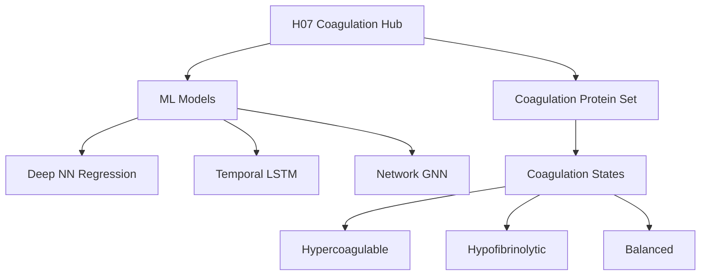

# Hypothesis 07: Coagulation Cascade Central Hub Analysis Plan

**Thesis:** Deep neural networks trained exclusively on coagulation cascade proteins will achieve R²>0.85 in predicting tissue aging velocity, with LSTM models proving temporal precedence (coagulation → ECM remodeling) and network centrality analysis confirming coagulation module dominance over serpin/collagen modules.

**Overview:** Section 1.0 defines the convergent discovery context. Section 2.0 outlines ML architecture strategy. Section 3.0 specifies temporal analysis approach. Section 4.0 describes coagulation state classification. Section 5.0 details network centrality comparison.




---

## 1.0 Convergent Discovery Context

¶1 **Ordering:** Evidence from prior hypotheses → Novel insight

**H01-H06 Coagulation Emergence:**
- H06: F2 (thrombin) ranked #5 biomarker (Consensus=0.363, SHAP_LGB=0.51)
- H06: F13B mentioned but need to verify ranking
- H06: GAS6 in top biomarkers
- H03: F2, SERPINB6A shared across fast-aging tissues
- H02: SERPINC1 (antithrombin), SERPINF2 highly dysregulated serpins
- H01: F13B magnitude 7.80 SD (rank #2 antagonistic protein)

**Key Insight:** Coagulation proteins appeared in ALL 6 hypotheses WITHOUT pre-specification → Suggests central role.

---

## 2.0 Deep NN Architecture Strategy

¶1 **Ordering:** Architecture → Training → Validation

**Model Design:**
- Input: 20-30 coagulation cascade proteins (F2, F13B, GAS6, SERPINC1, PLAU, PLAUR, FGA/B/G, VWF, PROC, PROS1, THBD, SERPINE1, SERPINF2, F7, F10, F11, F12, F13A1, PLG, AGT, A2M)
- Architecture: 4-layer MLP (128-64-32-16) with BatchNorm + Dropout (0.3)
- Output: Tissue aging velocity (mean |Δz|) - regression task
- Loss: MSE with L2 regularization
- Target: R²>0.85, MAE<0.3, RMSE<0.5

**Training Protocol:**
- 5-fold tissue-level cross-validation
- Early stopping (patience=20 epochs)
- Adam optimizer (lr=1e-3, weight_decay=1e-4)
- 100-200 epochs

**Baseline Comparison:**
- Full proteome model (all ECM proteins)
- Serpin-only model (H02 comparison)
- Collagen-only model (structural baseline)

---

## 3.0 Temporal Precedence Analysis (LSTM)

¶1 **Ordering:** Pseudo-temporal construction → LSTM training → Causality testing

**Pseudo-Temporal Sequence:**
- Option A: Order tissues by aging velocity (slow → fast) as proxy for time
- Option B: If age metadata available, use true time-series per tissue
- Option C: Latent space traversal (use autoencoder from H04 if available)

**LSTM Model:**
- Input: Sequence of protein states (timesteps = tissues ordered by velocity)
- Architecture: 2-layer LSTM (hidden_dim=64) + FC layer
- Task: Predict protein state at t+1 given t
- Early-change detection: Proteins with high gradient in first quartile

**Granger Causality:**
- Test: Do coagulation proteins (F2, SERPINC1) Granger-cause collagen changes (COL1A1, COL3A1)?
- Null: Coagulation does NOT precede ECM remodeling
- Statistical test: F-test, p<0.05 threshold

**Enrichment Analysis:**
- Extract first-quartile early-change proteins
- Chi-squared test: Are coagulation proteins enriched in early-change group?

---

## 4.0 Coagulation State Classification

¶1 **Ordering:** State definition → Scoring → Correlation with aging

**State Definitions:**
1. **Hypercoagulable:** F2↑, SERPINC1↓, FGA/B/G↑, PLAU↓ → Thrombotic risk
2. **Hyperfibrinolytic:** PLAU↑, SERPINE1↓, F13B↓ → Bleeding risk
3. **Balanced:** Intermediate levels

**Scoring Function:**
```
Coagulation_Score = (F2_zscore - SERPINC1_zscore + FGA_zscore) / 3
Fibrinolysis_Score = (PLAU_zscore - SERPINE1_zscore - F13B_zscore) / 3
```

**Classification:**
- If Coagulation_Score > 0.5 → Hypercoagulable
- If Fibrinolysis_Score > 0.5 → Hyperfibrinolytic
- Else → Balanced

**Validation:**
- Spearman correlation: Coagulation_Score vs Aging_Velocity
- Hypothesis: ρ>0.6, p<0.01 (hypercoagulable tissues age faster)
- Comparison: Does coagulation predict velocity BETTER than H02 serpin dysregulation?

---

## 5.0 Network Centrality Showdown

¶1 **Ordering:** Network construction → Module detection → Centrality comparison

**Network Construction:**
- Nodes: All ECM proteins (n~500-1000)
- Edges: Spearman |ρ|>0.5 correlations across tissues
- Weight: Absolute correlation value

**Module Detection:**
- Algorithm: Louvain community detection
- Pre-defined modules for comparison:
  - Coagulation: F2, F13B, GAS6, SERPINC1, PLAU, PLAUR, FGA/B/G, etc.
  - Serpin: All SERPIN* proteins
  - Collagen: COL1A1, COL3A1, COL4A1, COL5A1, etc.

**Centrality Metrics:**
- Betweenness centrality: Measures "hub" proteins
- Eigenvector centrality: Measures "influence"
- Average per module

**Statistical Test:**
- Mann-Whitney U test: Coagulation vs Serpin vs Collagen
- Hypothesis: Coagulation module has HIGHEST betweenness (contradicts H05 if false)

---

## 6.0 Deliverables

**Code:**
- `analysis_coagulation_claude_code.py` - Full pipeline
- `coagulation_nn_model_claude_code.pth` - Trained deep NN
- `lstm_model_claude_code.pth` - Temporal LSTM

**Data Outputs:**
- `aging_velocity_predictions_claude_code.csv`
- `coagulation_states_claude_code.csv`
- `early_change_proteins_claude_code.csv`
- `network_modules_claude_code.csv`
- `model_performance_claude_code.csv`

**Visualizations:**
- `model_performance_claude_code.png` - R² regression scatter
- `feature_importance_shap_claude_code.png` - SHAP summary
- `temporal_trajectory_plot_claude_code.png` - Protein changes over pseudo-time
- `coagulation_state_scatter_claude_code.png` - State vs velocity
- `network_visualization_claude_code.png` - Module-colored network

**Report:**
- `90_results_claude_code.md` - Knowledge Framework format

---

## 7.0 Success Metrics

**Hypothesis CONFIRMED if:**
- Deep NN R²>0.85 (coagulation-only model)
- Coagulation proteins enriched in early-change group (p<0.05)
- Hypercoagulable state correlates with velocity (ρ>0.6, p<0.01)
- Coagulation module has highest betweenness centrality

**Hypothesis REJECTED if:**
- R²<0.70 (serpins or collagens perform better)
- Coagulation proteins are late-change (downstream)
- No correlation between coagulation state and velocity
- Serpin/collagen modules dominate centrality

---

**Agent:** claude_code
**Created:** 2025-10-21
**Status:** Ready for execution
